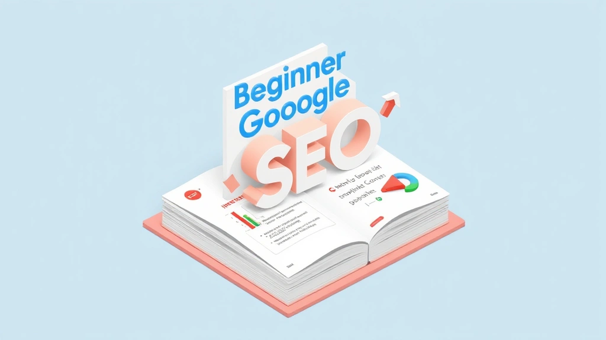

안녕하세요, 20년차 디지털 마케터이자 퍼포먼스 마케팅 전문가, 김프로입니다. 오늘은 여러분이 가장 궁금해하실 **구글 SEO 마케팅**에 대해 초보자도 쉽게 이해하고 바로 적용할 수 있도록 핵심만 콕콕 짚어드리려고 합니다. 제가 처음 이 분야에 발을 들였을 때만 해도 SEO는 마치 신비로운 마법처럼 느껴졌어요. 도대체 어떻게 해야 구글 검색 결과 상위에 노출되는 건지, 답답하기만 했죠. 하지만 수많은 시행착오를 겪고, "실제로 해보니까 이게 효과가 있더라고요"라는 깨달음을 얻어가면서, SEO가 결코 마법이 아니라 체계적인 노력과 사용자 중심의 사고방식이라는 걸 알게 됐습니다.

솔직히 말씀드리면, 저도 예전에는 검색엔진 최적화가 너무 복잡하고 어렵게만 느껴져서 '기술적인 영역'이라고 외면했던 시절도 있었습니다. 그런데 제 경험상, 광고비만 쏟아붓는 퍼포먼스 마케팅의 한계를 느끼기 시작하면서 자연스럽게 SEO의 중요성을 다시금 깨닫게 되었죠. 유료 광고는 돈을 쓰는 순간 효과가 나타나지만, 돈이 끊기면 트래픽도 끊깁니다. 하지만 SEO는 꾸준히 투자하면 마치 눈덩이처럼 불어나듯, **장기적인 관점에서 엄청난 ROI**를 가져다주는 보물 같은 존재라는 것을 확신하게 되었습니다. 실제로 제가 운영했던 한 서비스 웹사이트는 SEO 최적화 이후 6개월 만에 유기적 트래픽이 250% 이상 증가했고, 이는 연간 마케팅 비용 억 단위를 절감하는 효과로 이어졌습니다. 이런 경험들 덕분에 저는 SEO가 단순히 검색 순위를 올리는 기술이 아니라, 잠재 고객에게 최고의 가치를 제공하는 마케팅의 핵심이라고 믿게 되었습니다. 자, 그럼 2025년에도 통할 구글 SEO의 핵심 전략들을 지금부터 저와 함께 파헤쳐 볼까요?

## 기초부터 탄탄하게! 키워드 리서치와 콘텐츠 전략

SEO의 첫걸음은 바로 **키워드 리서치**입니다. 많은 초보 마케터분들이 이 단계를 너무 쉽게 생각하거나 아예 건너뛰는 경우가 많아요. 하지만 제가 수많은 캠페인을 진행하면서 깨달은 건, 키워드 리서치가 마치 건물을 지을 때 설계도와 같다는 점입니다. 설계가 부실하면 아무리 좋은 자재를 써도 건물이 무너지듯, 키워드 리서치가 잘못되면 아무리 좋은 콘텐츠를 만들어도 빛을 보기 어렵습니다. 예전에 저는 무작정 제가 쓰고 싶은 주제로 글을 발행했다가, 구글 검색 결과에서 전혀 찾아볼 수 없었던 뼈아픈 경험이 있습니다. 그때 깨달았죠. '아, 내가 쓰고 싶은 글이 아니라 사람들이 검색하는 글을 써야 하는구나!'

그럼 어떻게 해야 할까요? 핵심은 **사용자 의도(User Intent)**를 파악하는 겁니다. 사람들이 어떤 정보를 얻기 위해 구글에 특정 키워드를 입력하는지 이해해야 해요. 예를 들어, '다이어트'라는 키워드는 너무 광범위하죠. 이걸 검색하는 사람은 다이어트 방법을 알고 싶은 걸까요? 다이어트 보조제를 찾을까요? 아니면 다이어트 식단을 궁금해할까요? 이럴 때 구체적인 **롱테일 키워드(Long-tail Keyword)**를 찾아야 합니다. '30대 직장인을 위한 건강한 저녁 식단', '초보자를 위한 홈트레이닝 루틴'처럼요. 이런 롱테일 키워드는 검색량은 적을지 몰라도, 검색 의도가 명확해서 경쟁이 덜하고 전환율이 훨씬 높습니다. 제가 한 건강식품 쇼핑몰의 블로그를 운영할 때, '다이어트 식품' 대신 '탄수화물 적은 간식 추천'과 같은 롱테일 키워드를 집중적으로 공략한 결과, 해당 키워드로 유입된 사용자들의 구매 전환율이 일반 키워드 유입 대비 2배 이상 높았던 적이 있습니다.

키워드 리서치 도구로는 구글 키워드 플래너(무료)가 가장 기본적이고 유용합니다. 구글 검색창에 키워드를 입력했을 때 나오는 **'관련 검색어'나 '사람들이 자주 묻는 질문'** 섹션도 놓치지 마세요. 이게 바로 사용자들이 궁금해하는 진짜 질문들입니다. 이런 질문들을 콘텐츠 주제로 삼으면, 검색 결과에서 '피처드 스니펫(Featured Snippet)'으로 노출될 확률도 높아집니다. 저는 이 섹션을 캡처해서 콘텐츠 기획 회의 때 활용하곤 합니다.

키워드를 찾았다면, 이제 **콘텐츠 전략**으로 넘어갈 차례입니다. 2025년에도 구글은 **E-A-T (Expertise, Authoritativeness, Trustworthiness)**, 즉 전문성, 권위성, 신뢰성을 기반으로 한 고품질 콘텐츠를 선호합니다. 단순히 키워드를 많이 넣는다고 되는 시대는 진작에 지났어요. 콘텐츠는 사용자의 문제 해결에 초점을 맞춰야 합니다. 정보를 제공하든, 즐거움을 주든, 구매를 유도하든, 사용자에게 어떤 가치를 줄 것인가를 끊임없이 고민해야 합니다. 제가 예전에 운영했던 IT 블로그에서는 단순히 제품 리뷰만 올리지 않고, '초보 개발자를 위한 파이썬 설치 가이드'처럼 특정 문제를 해결해주는 튜토리얼 콘텐츠를 집중적으로 발행했습니다. 그 결과, 해당 콘텐츠들은 꾸준히 유기적 트래픽을 유입시켰고, 이탈률은 10% 미만으로 유지하면서 페이지 체류 시간은 평균 5분 이상을 기록했습니다. 이는 구글이 해당 콘텐츠를 유용하다고 판단하는 중요한 신호가 됩니다.

콘텐츠의 형식도 중요합니다. 긴 글이 무조건 좋다는 건 아니지만, 심층적인 정보가 필요한 주제라면 **장문 콘텐츠**가 유리합니다. 대신 중간중간 소제목, 이미지, 동영상, 리스트 등을 활용해서 가독성을 높여야 합니다. 그리고 한 번 발행한 콘텐츠는 끝이 아닙니다. 정보는 계속 변하기 때문에, **정기적으로 콘텐츠를 업데이트하고 보강**해야 합니다. 저는 분기별로 주요 콘텐츠의 정보를 최신화하고, 필요하다면 새로운 섹션을 추가하는 작업을 게을리하지 않습니다. 이 작은 노력이 콘텐츠의 생명력을 연장하고, 구글 랭킹을 유지하는 데 큰 도움이 됩니다.

## 기술 SEO, 어렵게 생각 마세요! 사이트 최적화의 핵심

많은 분들이 '기술 SEO'라고 하면 지레 겁부터 먹습니다. 저도 처음엔 웹 개발 지식이 없어서 막막했던 기억이 나요. 하지만 막상 해보니, 기본적인 원리만 이해하면 충분히 초보자도 할 수 있는 영역이 많습니다. 기술 SEO는 한마디로 **"구글이 우리 웹사이트를 얼마나 쉽게 이해하고 접근할 수 있도록 만드느냐"**에 대한 이야기입니다. 사용자 경험(UX)을 좋게 만드는 것이 곧 기술 SEO의 핵심이라고 생각하시면 편합니다.

가장 먼저 신경 써야 할 부분은 바로 **사이트 속도**입니다. 사용자들은 느린 웹사이트를 기다려주지 않습니다. 3초 이상 로딩되면 50% 이상의 사용자가 이탈한다는 통계도 있습니다. 구글 역시 사이트 속도를 중요한 랭킹 요소로 보고 있고요. 제가 한 이커머스 사이트의 로딩 속도를 개선했을 때의 경험을 공유해드릴게요. 이미지 최적화, 불필요한 스크립트 제거, 캐싱 설정 등을 통해 모바일 페이지 로딩 속도를 평균 5초에서 2초로 단축시켰습니다. 그 결과, **모바일 이탈률이 15% 감소했고, 놀랍게도 구매 전환율은 3% 상승**하는 효과를 보았습니다. 작은 변화가 큰 성과로 이어진 대표적인 사례죠. 여러분도 지금 바로 구글 페이지스피드 인사이트(Google PageSpeed Insights)를 통해 여러분의 웹사이트 속도를 측정하고, 개선 권고 사항을 따라해보세요.

다음은 **모바일 친화성**입니다. 2025년은 모바일 우선 색인(Mobile-First Indexing)이 더욱 확고해지는 시기입니다. 즉, 구글은 여러분의 웹사이트를 평가할 때 모바일 버전을 기준으로 삼는다는 의미입니다. 데스크톱에서 아무리 멋진 웹사이트라도 모바일에서 불편하면 좋은 점수를 받기 어렵습니다. 반응형 웹 디자인을 적용하여 어떤 기기에서든 최적화된 화면을 제공하는 것이 필수적입니다. 구글의 모바일 친화성 테스트 도구를 활용하면 여러분의 웹사이트가 모바일에 얼마나 최적화되어 있는지 쉽게 확인할 수 있습니다.

**크롤링과 색인 생성**도 중요합니다. 구글 봇이 여러분의 웹사이트를 잘 찾아와서 콘텐츠를 수집하고(크롤링), 구글 검색 결과에 포함시킬 수 있도록(색인 생성) 도와줘야 합니다. 이를 위해 **XML 사이트맵**을 제출하고, **robots.txt 파일**을 통해 구글 봇에게 어떤 페이지를 크롤링할지 안내하는 것이 좋습니다. 처음에는 이런 용어들이 생소하겠지만, 대부분의 웹사이트 빌더나 CMS(워드프레스 등)에서는 쉽게 설정할 수 있도록 기능을 제공합니다. 제가 한 번은 robots.txt 설정 실수로 중요한 페이지들이 구글에 색인되지 않았던 적이 있었는데, 구글 서치 콘솔에서 '색인 생성 오류'를 확인하고 바로잡았더니, **한 달 만에 해당 페이지들의 노출수가 20% 증가**했던 경험도 있습니다. 구글 서치 콘솔은 기술 SEO의 건강검진과 같은 도구이니, 반드시 연결하고 주기적으로 확인하는 습관을 들이세요.

마지막으로 **구조화된 데이터(Schema Markup)**입니다. 이건 구글이 여러분의 콘텐츠를 더 잘 이해하도록 도와주는 '명함' 같은 역할을 합니다. 예를 들어, 레시피 페이지라면 재료, 조리 시간, 평점 등을 구글이 이해할 수 있는 형태로 표시해주는 거죠. 이렇게 하면 검색 결과에 **리치 스니펫(Rich Snippet)** 형태로 노출되어 사용자들의 눈길을 사로잡고 클릭률을 높일 수 있습니다. 제가 운영했던 한 맛집 블로그에 레시피 스키마 마크업을 적용한 후, 해당 레시피들의 검색 결과 클릭률이 이전 대비 5%p 이상 상승하는 것을 확인했습니다. 처음에는 어렵게 느껴지겠지만, 구글의 구조화된 데이터 마크업 도우미나 워드프레스 플러그인 등을 활용하면 비교적 쉽게 적용할 수 있습니다. 기술 SEO는 한 번 설정해두면 지속적으로 효과를 볼 수 있는 투자이니, 기본적인 것부터 차근차근 시작해보세요.

## SEO 성과를 극대화하는 링크 빌딩과 분석

SEO는 크게 세 가지 기둥으로 이루어져 있습니다. 앞서 말씀드린 키워드와 콘텐츠 전략(On-page SEO), 그리고 기술 SEO(Technical SEO)가 그것이죠. 이제 마지막 기둥인 **링크 빌딩(Off-page SEO)**과 **성과 분석**에 대해 이야기해볼 차례입니다. 링크 빌딩은 외부 웹사이트에서 우리 웹사이트로 연결되는 링크, 즉 백링크(Backlink)를 확보하는 활동을 말합니다. 구글은 백링크를 마치 '추천서'처럼 여깁니다. 권위 있고 신뢰할 수 있는 웹사이트에서 우리 웹사이트를 추천해준다면, 구글은 우리 웹사이트도 그만큼 신뢰할 만하다고 판단하여 랭킹에 긍정적인 영향을 줍니다.

하지만 여기서 중요한 점은 **"질 좋은 링크"**를 얻어야 한다는 것입니다. 예전에 제가 SEO 초보였을 때는 무조건 많은 링크를 얻으려고 스팸성 링크를 구매하거나, 관련 없는 웹사이트에 무작정 댓글을 달아 링크를 남기기도 했습니다. 물론 단기적으로는 효과가 있는 것처럼 보였지만, 결국 구글의 알고리즘에 의해 패널티를 받고 검색 순위가 나락으로 떨어지는 뼈아픈 경험을 했습니다. 그때 뼈저리게 느꼈죠. 편법은 절대 통하지 않는다는 것을요. 2025년에도 구글은 **진정성 있고 유기적인 링크**를 가장 중요하게 평가합니다.

그렇다면 어떻게 질 좋은 링크를 얻을 수 있을까요? 가장 좋은 방법은 역시 **매력적인 콘텐츠를 만들어서 자연스럽게 링크를 얻는 것**입니다. 사람들이 자발적으로 공유하고 싶고, 인용하고 싶은 콘텐츠를 만들면 링크는 자연스럽게 따라오게 되어 있습니다. 제 경험상, 특정 분야의 전문가 인터뷰나 심층 분석 보고서 같은 콘텐츠는 다른 블로그나 뉴스 매체에서 자주 인용되어 링크를 얻는 데 매우 효과적이었습니다. 또한, 우리 웹사이트와 **관련성이 높고 권위 있는 웹사이트에 게스트 포스팅**을 하거나, **깨진 링크(Broken Link) 빌딩**을 통해 해당 웹사이트의 관리자에게 우리 콘텐츠로 링크를 대체해달라고 제안하는 방법도 효과적입니다. 중요한 건, 상대방에게도 가치를 제공할 수 있는 상생의 관계를 구축하는 것입니다.

외부 링크뿐만 아니라 **내부 링크(Internal Linking)**도 SEO에 큰 영향을 미칩니다. 우리 웹사이트 내에서 관련 있는 페이지들을 서로 연결해주는 것을 말합니다. 이는 사용자 경험을 개선하고, 구글 봇이 웹사이트를 더 효율적으로 탐색하도록 돕습니다. 또한, 특정 페이지의 링크 권위(Link Authority)를 다른 관련 페이지로 분산시켜 전체적인 SEO 성능을 향상시키는 효과도 있습니다. 예를 들어, '구글 SEO 가이드'라는 글을 썼다면, 이 글 안에서 '키워드 리서치 방법'이나 '사이트 속도 최적화'에 대한 다른 글들로 링크를 걸어주는 식이죠. 저는 항상 새로운 콘텐츠를 발행할 때, 기존 콘텐츠 중 관련성 높은 것들을 찾아 내부 링크를 추가하는 작업을 잊지 않습니다.

마지막으로, 이 모든 노력의 성과를 측정하고 개선하는 **분석과 모니터링**이 필수적입니다. SEO는 한 번 설정하고 끝나는 것이 아니라, 끊임없이 데이터를 보고, 가설을 세우고, 실행하고, 다시 분석하는 **반복적인 과정**입니다. 제가 매주 월요일 아침을 구글 서치 콘솔과 구글 애널리틱스를 꼼꼼히 들여다보는 시간으로 삼는 이유도 여기에 있습니다.

**구글 서치 콘솔**에서는 어떤 키워드로 사용자들이 우리 웹사이트에 유입되는지, 우리 웹사이트가 검색 결과에 얼마나 많이 노출되는지, 그리고 클릭률은 어떤지 등을 확인할 수 있습니다. 특정 키워드의 노출수는 높은데 클릭률이 낮다면, 메타 디스크립션이나 제목 태그를 개선해야 한다는 신호일 수 있습니다. **구글 애널리틱스**에서는 유입된 사용자들의 행동을 분석할 수 있습니다. 예를 들어, 특정 키워드로 유입된 트래픽은 늘었는데, 이탈률이 높거나 전환율이 낮다면 해당 콘텐츠의 내용이나 랜딩 페이지의 구성에 문제가 있을 수 있다는 의미죠. 저는 이런 데이터를 바탕으로 콘텐츠를 수정하거나, 기술적인 문제를 해결하거나, 새로운 링크 빌딩 전략을 세우곤 합니다. 이렇게 데이터를 기반으로 한 의사결정이 바로 20년차 마케터인 제가 SEO에서 실패를 줄이고 성공을 극대화할 수 있었던 비결입니다.

여러분, 구글 SEO 마케팅은 단거리 경주가 아니라 마라톤과 같습니다. 단기간에 드라마틱한 결과를 기대하기보다는 꾸준한 노력과 인내심이 필요합니다. 오늘 제가 알려드린 키워드 리서치와 콘텐츠 전략, 기술 SEO, 그리고 링크 빌딩과 분석까지, 이 핵심 가이드라인을 바탕으로 여러분의 웹사이트를 차근차근 최적화해나가세요. 20년 넘게 이 바닥에서 구르면서 느낀 건, 결국 사용자를 위한 진정성 있는 가치 제공이 구글 알고리즘을 움직이는 가장 강력한 힘이라는 겁니다. 여러분이 사용자에게 최고의 경험을 제공하기 위해 노력한다면, 구글은 반드시 그 노력을 알아줄 것입니다. 지금 바로 여러분의 웹사이트에 이 가이드를 적용해보세요! 궁금한 점이 있다면 언제든 댓글로 남겨주시고요. 여러분의 성공적인 SEO 여정을 진심으로 응원합니다!