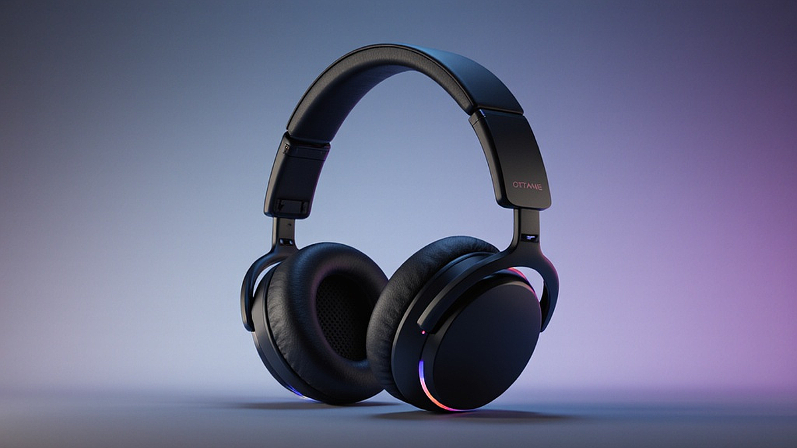

헤드폰 하나가 제 삶의 질을 얼마나 바꿔놓았는지 떠올려보면 지금도 가슴이 벅차오릅니다. 음악 매니아이자 주말이면 공연장을 전전하는 라이브 러버로서 저에게 소리란 단순히 귀로 듣는 진동 그 이상의 의미를 지닙니다. 어느 지독하게 외로웠던 퇴근길에 우연히 재생된 옛 가수의 라이브 음반이 제 마음을 어루만져 주었을 때 저는 깨달았습니다. 좋은 장비는 아티스트가 전달하고자 했던 그 찰나의 감정까지도 고스란히 배달해 준다는 사실을 말입니다. 오늘 이 글에서는 제가 수많은 기기를 거치며 겪었던 시행착오와 함께 여러분이 자신만의 인생 기기를 찾을 수 있도록 돕는 실무적인 가이드를 전해드리고자 합니다.

## 공간감의 마법, 오픈형과 밀폐형의 갈림길

음악을 감상할 때 가장 먼저 마주하게 되는 선택지는 구조적인 형태입니다. 저는 처음 입문할 때 디자인만 보고 덜컥 오픈형 모델을 구매했다가 낭패를 본 적이 있습니다. 조용한 독서실에서 음악을 크게 틀었다가 주변 사람들의 따가운 눈총을 받았던 기억은 지금도 얼굴이 화끈거리는 흑역사 중 하나입니다. 오픈형은 하우징 뒷면이 뚫려 있어 공기가 자유롭게 드나드는데 이 덕분에 소리가 머리 안이 아니라 넓은 공연장 전체에 퍼지는 듯한 개방감을 줍니다. 마치 제가 좋아하는 록 밴드의 스타디움 투어 한복판에 서 있는 듯한 착각을 불러일으키죠.

반면 밀폐형은 외부 소음을 차단하고 내부의 소리가 밖으로 나가지 않게 막아줍니다. 녹음실에서 보컬리스트들이 사용하는 제품들이 대부분 이 방식입니다. 마이크에 반주 소리가 들어가는 것을 방지해야 하기 때문입니다. 저처럼 대중교통을 자주 이용하거나 집중이 필요한 사무실에서 사용한다면 밀폐형이 정답입니다. 하지만 밀폐형은 구조상 저음이 강조되는 경향이 있고 오래 착용하면 귀에 열이 차기 쉽다는 단점이 있습니다. 제가 경험한 바로는 장시간의 편안한 감상을 원한다면 오픈형을, 몰입감과 실용성을 중시한다면 밀폐형을 선택하는 것이 좋습니다.

음반 제작 과정을 살펴보면 엔지니어들은 믹싱 단계에서 공간감을 구현하기 위해 리버브(Reverb)나 딜레이(Delay) 같은 효과를 사용합니다. 오픈형 헤드폰은 이러한 미세한 잔향을 가장 자연스럽게 표현해 줍니다. 반대로 힙합이나 EDM처럼 묵직한 베이스의 타격감이 중요한 장르를 주로 듣는다면 밀폐형이 주는 단단한 저음이 훨씬 더 매력적으로 다가올 것입니다. 저는 공연장의 현장감을 중시하기에 집에서는 주로 오픈형을 사용하고 여행이나 외출 시에는 밀폐형 노이즈 캔슬링 모델을 챙기는 편입니다.

## 스펙 시트 너머의 진실, 저항값과 구동력의 이해

많은 분이 헤드폰을 구매할 때 상세 페이지에 적힌 숫자를 보고 혼란스러워하곤 합니다. 그중에서도 임피던스(Impedance)라고 불리는 저항값은 반드시 이해해야 할 핵심 요소입니다. 단위는 옴(Ohm)을 사용하는데 쉽게 말해 이 숫자가 높을수록 소리를 내기 위해 더 강한 전압이 필요하다는 뜻입니다. 저는 과거에 300옴이 넘는 고임피던스 헤드폰을 스마트폰에 직접 연결했다가 모기 소리만큼 작게 들리는 음량에 당황했던 적이 있습니다. 기기 자체가 나쁜 것이 아니라 그 헤드폰을 제대로 울려줄 힘이 부족했던 것이죠.

최근 스트리밍 시장에서는 무손실 음원이 대세가 되면서 고음질 출력을 지원하는 기기들이 늘어나고 있습니다. 하지만 여전히 고사양 헤드폰의 잠재력을 100퍼센트 끌어내기 위해서는 별도의 앰프나 DAC(Digital to Analog Converter)가 필요할 때가 많습니다. DAC는 디지털 신호를 우리가 들을 수 있는 아날로그 신호로 바꿔주는 장치인데 컴퓨터나 스마트폰에 내장된 기본 칩셋보다 훨씬 정교한 변환이 가능합니다. 이를 통해 소리의 해상도가 높아지고 악기 하나하나의 위치가 선명하게 그려지는 경험을 할 수 있습니다.

입문자라면 32옴에서 50옴 사이의 저임피던스 모델을 추천합니다. 별도의 추가 장비 없이도 스마트폰이나 노트북에서 충분한 음량을 확보할 수 있기 때문입니다. 만약 여러분이 클래식 대편성 곡을 들으며 오케스트라의 웅장함을 그대로 느끼고 싶다면 그때는 고임피던스 모델과 전용 앰프의 조합을 고민해 보시기 바랍니다. 소리의 결이 달라지는 것을 느끼는 순간 여러분도 진정한 음향의 세계로 발을 들이게 될 것입니다.

## 나만의 완벽한 청음 환경을 위한 실전 체크리스트

좋은 헤드폰을 고르는 기준은 사람마다 다르지만 반드시 확인해야 할 공통적인 포인트들이 있습니다. 제가 수십 개의 제품을 거치며 정립한 판단 기준을 공유해 드릴 테니 구매 전 꼭 확인해 보시기 바랍니다.

*   **착용감과 무게:** 소리가 아무리 좋아도 머리가 아프거나 귀가 눌리면 30분도 듣기 힘듭니다. 300그램 이상의 제품은 장시간 착용 시 목에 무리가 갈 수 있으니 주의해야 합니다.
*   **교체 가능한 패드와 케이블:** 헤드폰은 소모품입니다. 귀에 닿는 이어패드가 낡았을 때 쉽게 교체할 수 있는지, 케이블이 단선되었을 때 선만 따로 바꿀 수 있는지 확인하는 것은 유지보수 측면에서 매우 중요합니다.
*   **자신의 주력 장르와의 궁합:** 고음이 강조된 성향은 여성 보컬이나 바이올린 연주에 좋고 저음이 강조된 성향은 밴드 음악이나 비트 중심의 음악에 유리합니다.
*   **구동 환경:** 주로 어디서 들을 것인가를 자문해 보세요. 이동 중에 들을 용도라면 무게와 접이식 구조 여부가 소리보다 더 중요한 기준이 될 수 있습니다.

또한 실패를 줄이기 위한 단계별 접근법도 필요합니다. 무턱대고 비싼 제품을 사기보다는 우선 자신이 선호하는 소리 성향을 파악하는 것이 우선입니다. 유튜브나 스트리밍 서비스에서 제공하는 주파수 테스트 음원을 들어보며 내가 고음을 좋아하는지 아니면 가슴을 울리는 저음을 좋아하는지 먼저 확인해 보세요. 그다음 오프라인 청음샵을 방문하여 후보군에 둔 제품들을 직접 써보는 과정이 필수적입니다. 사람마다 귓바퀴의 모양과 두개골의 구조가 다르기에 남에게는 인생 기기가 나에게는 고문 도구가 될 수도 있습니다.

## 장르별 최적의 조합과 실패하지 않는 선택 기준

음악을 사랑하는 사람으로서 저는 장르에 맞는 장비를 선택했을 때 오는 시너지를 강조하고 싶습니다. 예를 들어 재즈를 즐겨 듣는다면 중음역대가 따뜻하게 튜닝된 모델이 좋습니다. 색소폰의 거친 질감과 콘트라베이스의 풍부한 울림을 가장 잘 살려주기 때문입니다. 반면 최신 팝 음악이나 빌보드 차트 상위권의 곡들을 주로 듣는다면 하만 타겟 커브(Harman Target Curve)를 따르는 제품을 추천합니다. 이는 수많은 청취 테스트를 통해 사람들이 가장 대중적으로 선호하는 소리 균형을 데이터화한 표준입니다.

처음 시작할 때의 기준을 명확히 세워야 합니다. 만약 여러분이 첫 번째 고급 헤드폰을 고민 중이라면 너무 한쪽으로 치우친 성향보다는 밸런스가 잘 잡힌 올라운더 제품을 선택하는 것이 안전합니다. 특정 대역이 너무 강조된 제품은 처음에는 자극적이고 화려하게 들릴 수 있지만 금방 귀가 피로해질 수 있기 때문입니다. 제가 처음 샀던 모니터링용 헤드폰은 소리가 너무 평면적이어서 재미없게 느껴졌지만 시간이 지날수록 아티스트가 의도한 원음 그대로를 들려준다는 점에서 깊은 신뢰를 주었습니다.

피해야 할 경우도 분명히 존재합니다. 평소에 이어폰의 가벼움에 익숙한 분들이라면 크고 무거운 오버이어 헤드폰은 신중하게 접근해야 합니다. 또한 안경을 쓰시는 분들은 헤드폰의 장력이 너무 강하면 안경다리가 관자놀이를 압박해 통증을 유발할 수 있습니다. 이런 경우에는 이어패드가 아주 부드러운 소재로 되어 있거나 장력 조절이 유연한 모델을 선택하는 것이 현명합니다. 결국 가장 좋은 헤드폰은 스펙이 화려한 제품이 아니라 내 생활 패턴 속에 자연스럽게 스며들어 더 자주 음악을 듣게 만드는 제품입니다.

음악은 우리 삶의 배경음악이 되기도 하고 때로는 주인공이 되어 위로를 건네기도 합니다. 좋은 헤드폰을 선택한다는 것은 단순히 소리를 듣는 도구를 사는 것이 아니라 내가 사랑하는 아티스트와 더 가까이 만날 수 있는 입장권을 사는 것과 같습니다. 저 역시 수많은 시행착오를 겪으며 때로는 돈을 낭비하기도 하고 때로는 기대 이하의 성능에 실망하기도 했습니다. 하지만 그 과정 끝에 제 귀에 꼭 맞는 장비를 찾아냈을 때의 그 희열은 무엇과도 바꿀 수 없는 소중한 경험이었습니다.

여러분도 이제 자신만의 소리 취향을 찾아 여행을 떠나보시는 건 어떨까요. 오늘 제가 공유해 드린 기준과 팁들이 여러분의 실패 없는 선택에 작은 이정표가 되기를 진심으로 바랍니다. 지금 바로 여러분이 가장 좋아하는 곡을 재생해 보세요. 그리고 그 소리가 더 깊고 풍성하게 들리는 상상을 해보시기 바랍니다. 그 상상이 현실이 되는 순간 여러분의 일상은 이전보다 훨씬 더 다채로운 선율로 가득 차게 될 것입니다. 망설이지 말고 여러분의 감성을 깨워줄 그 첫 번째 헤드폰을 만나보세요.

## 마치며

지금까지 우리는 좋은 헤드폰을 선택하기 위한 실질적인 가이드부터 그 이면에 담긴 감성적인 가치까지 함께 살펴보았습니다. 단순히 성능표의 수치를 비교하는 것을 넘어, 자신의 음악적 취향을 깊이 있게 이해하고 일상에 어울리는 최적의 장비를 찾는 과정은 그 자체로 매우 설레는 여정입니다. 오늘 본문에서 공유해 드린 착용감의 중요성, 음색의 특징, 그리고 다양한 기능적 요소들을 하나씩 차근차근 체크해 보신다면 분명 인생 헤드폰을 만나는 시간을 훨씬 단축하실 수 있을 것입니다.

이제 여러분이 직접 움직여 보실 차례입니다. 더 이상 화면 속의 정보만 보며 고민하지 마시고, 가까운 청음 매장을 방문하여 평소 즐겨 듣던 곡들을 직접 소리로 느껴보세요. 혹은 오늘 배운 기준을 바탕으로 위시리스트에 담아두었던 모델들을 다시 한번 꼼꼼히 비교해 보시는 것도 좋습니다. 여러분의 귀에 완벽하게 안착하여 깊은 감동을 선사할 그 헤드폰은 생각보다 아주 가까운 곳에서 여러분을 기다리고 있을지도 모릅니다.

혹시 선택 과정에서 해결되지 않는 궁금한 점이 생기거나, 여러분이 직접 사용해 본 후 추천하고 싶은 자신만의 ‘인생 제품’이 있다면 언제든 댓글로 소중한 의견을 남겨주세요. 여러분이 들려주실 다채로운 음악 이야기가 벌써부터 무척 기대됩니다. 좋은 소리는 우리 삶의 질을 한 단계 높여주는 특별한 마법과도 같습니다. 오늘 이 글이 여러분의 음악 생활에 기분 좋은 변화를 일으키는 작은 시작점이 되었기를 바랍니다.

저는 앞으로도 여러분의 일상을 더욱 풍성하게 채워줄 깊이 있고 유익한 음향 기기 이야기로 다시 찾아오겠습니다. 여러분의 모든 평범한 순간들이 헤드폰을 통해 흐르는 아름다운 선율로 가득 차오르기를 진심으로 응원합니다. 긴 글 읽어주셔서 감사합니다. 오늘도 사랑하는 음악과 함께 따뜻하고 행복한 하루 보내시길 바랍니다!