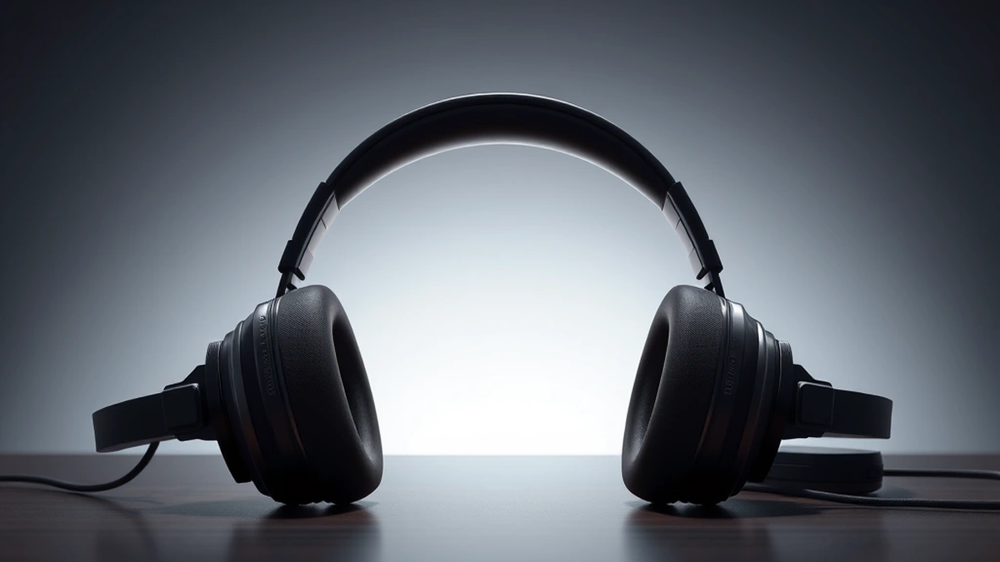

# 내 세상의 유일한 BGM, 헤드폰: 라이브 현장의 감동을 내 귀에 담는 법

최고의 **헤드폰**을 찾는 여정은, 어쩌면 나만의 작은 우주를 건설하는 일과 같아요. 저는 공연장에서 심장을 울리는 베이스 드럼 소리와 수만 명의 함성이 뒤섞인 공기를 마실 때 살아있음을 느끼는, 자타공인 라이브 공연 애호가입니다. 하지만 공연이 끝나고 텅 빈 무대를 뒤로한 채 집으로 돌아오는 지하철 안에서, 그 감동을 온전히 재현하기란 불가능에 가까웠죠. 번들 이어폰에서 흘러나오는 소리는 그저 흉내에 불과했고, 현장의 생생한 공간감과 아티스트의 작은 숨소리마저 담아내기엔 턱없이 부족했습니다. 바로 그 아쉬움이 제 헤드폰 여정의 시작이었습니다.

수많은 시행착오와 꽤 많은 ‘수업료’를 지불하며 깨달은 것이 있습니다. 헤드폰은 단순히 스펙 리스트의 숫자를 비교하며 고르는 기계가 아니라는 사실을요. 그것은 나와 음악 사이를 연결하는 가장 섬세하고 개인적인 매개체입니다. 어떤 헤드폰은 나를 수만 관중이 있는 라이브 현장의 한가운데로 데려다주고, 어떤 헤드폰은 녹음 스튜디오의 엔지니어 바로 옆자리에 앉혀주기도 하죠. 또 어떤 날은 세상의 모든 소음을 차단하고 오직 나와 음악만이 존재하는 고요한 심해로 안내합니다. 이 글은 단순히 제품을 추천하는 리뷰가 아닙니다. 음악을 사랑하는 한 사람이 자신에게 맞는 소리를 찾아 헤매고, 발견하고, 때론 실패하며 얻은 지극히 개인적인 경험담이자, 여러분이 자신만의 ‘인생 헤드폰’을 찾는 데 도움이 될 작은 이정표가 되길 바라는 마음으로 써 내려가는 이야기입니다.

## 첫사랑처럼 다가온 오픈형 헤드폰, 그리고 쓰라린 이별

음악에 본격적으로 빠져들면서 처음으로 큰마음 먹고 장만했던 건 바로 ‘오픈형 헤드폰’이었습니다. 당시만 해도 제게 헤드폰은 귀를 완전히 막아 소리가 밖으로 새어 나가지 않게 하는 ‘밀폐형’이 전부라고 생각했죠. 하지만 음악 커뮤니티에서 ‘공간감’이라는 단어를 처음 접하고, 그 끝판왕이 오픈형 헤드폰이라는 말에 홀린 듯 청음샵으로 향했습니다. 그리고 거기서 만난 젠하이저의 HD 600은 제 세상을 완전히 바꿔놓았습니다.

그날 제가 처음 들었던 곡은 제프 버클리(Jeff Buckley)의 라이브 앨범 ‘Live at Sin-é’에 수록된 ‘Hallelujah’였습니다. 늘 듣던 곡이었지만, 그날의 경험은 차원이 달랐어요. 마치 제 바로 앞에서 제프 버클리가 기타를 치며 노래하는 듯한 착각이 들 정도였죠. 그의 애절한 목소리가 공간을 가득 채우고, 기타 줄을 튕기는 손가락의 미세한 마찰음, 노래 중간에 작게 숨을 고르는 소리, 심지어는 관객들이 조용히 잔을 내려놓는 소리까지 생생하게 들려왔습니다. 소리가 머릿속에서 울리는 게 아니라, 마치 실제 공간에 악기들이 배치되어 있는 것처럼 좌우는 물론 앞뒤의 거리감까지 느껴졌습니다. 이게 바로 사람들이 말하던 ‘사운드스테이지(Soundstage)’구나, 온몸에 소름이 돋았습니다.

### 오픈형 헤드폰, 소리의 해방구

오픈형 헤드폰의 마법은 그 구조에 있습니다. 이름 그대로 헤드폰 유닛의 바깥쪽, 즉 귀를 덮는 하우징 부분이 그릴(grill) 망처럼 뚫려있어요. 그래서 소리를 내는 드라이버 유닛이 움직일 때 생기는 공기의 압력과 소리가 안쪽에만 갇히지 않고 바깥으로 자연스럽게 퍼져나가죠. 이걸 쉽게 비유하자면, 밀폐형 헤드폰이 방음이 잘 된 작은 방에서 음악을 듣는 것이라면, 오픈형 헤드폰은 창문이 활짝 열린 넓은 거실에서 스피커로 음악을 듣는 느낌과 비슷합니다. 소리가 갇히지 않고 자유롭게 흐르기 때문에 훨씬 자연스럽고 개방감 있는 소리를 만들어내는 거죠. 특히 클래식 음악의 오케스트라나 밴드의 라이브 앨범을 들을 때 그 진가가 발휘됩니다. 각 악기의 위치가 손에 잡힐 듯 그려지고, 현장의 공기감까지 고스란히 전달해주니까요.

### 현실의 벽, 그리고 솔직한 실패담

그렇게 오픈형 헤드폰과 사랑에 빠진 저는, 세상 모든 음악을 이걸로 들을 수 있을 거라 믿었습니다. 하지만 그 사랑은 오래가지 못했죠. 제 첫 번째 실패담의 시작이었습니다. 오픈형의 구조는 소리를 밖으로 내보내는 만큼, 바깥의 소음도 그대로 안으로 들여보냅니다. 조용한 제 방에서는 천상의 소리를 들려주던 헤드폰이, 지하철에서는 옆 사람의 통화 소리와 안내 방송에 섞여 음악의 디테일을 모두 잃어버렸습니다. 카페에서 작업을 하려고 꺼냈다가, 주변 소음 때문에 볼륨을 최대로 올려야 했죠.

결정적으로 저를 좌절시킨 건 ‘소리 샘(Sound Leakage)’ 문제였습니다. 조용한 도서관에서 제가 가장 좋아하는 핑크 플로이드(Pink Floyd)의 ‘The Dark Side of the Moon’ 앨범을 듣고 있었는데, 맞은편에 앉은 분이 조심스럽게 다가와 “혹시… 헤드폰 소리가 너무 큰 것 같아요”라고 말했을 때의 민망함은 아직도 잊을 수 없습니다. 저에게는 최고의 명반이, 다른 사람에게는 그저 시끄러운 소음일 뿐이었던 거죠. 결국 저의 첫사랑이었던 오픈형 헤드폰은 ‘집에서, 혼자 있을 때만’ 사용할 수 있는 애증의 존재가 되었습니다. 만약 여러분이 오직 조용한 개인 공간에서 음악 감상에만 몰입하고 싶고, 세상에서 가장 자연스럽고 넓은 공간감을 원한다면 오픈형 헤드폰은 최고의 선택이 될 겁니다. 하지만 저처럼 어디서든 음악과 함께하고 싶은 분이라면, 다음 이야기에도 귀를 기울여 주세요.

## 세상과 나를 분리하는 마법, 노이즈 캔슬링의 두 얼굴

오픈형 헤드폰과의 쓰라린 이별 아닌 이별 후, 저에게는 새로운 목표가 생겼습니다. 바로 ‘언제 어디서든 나만의 음악 감상실을 만들자’는 것이었죠. 시끄러운 대중교통 안에서도, 사람들로 붐비는 카페에서도 오롯이 음악에만 집중할 수 있는 방법. 그 해답은 바로 ‘액티브 노이즈 캔슬링(Active Noise Cancelling, ANC)’ 기술에 있었습니다. 이제는 너무나 대중적인 기술이 되었지만, 제가 처음 소니의 WH-1000X 시리즈 초기 모델을 접했을 때의 충격은 정말 대단했습니다.

청음샵에서 헤드폰을 착용하고 노이즈 캔슬링 버튼을 켜는 순간, 마법 같은 일이 일어났습니다. 웅성거리던 주변 사람들의 목소리, 시끄럽게 울리던 매장의 배경 음악, 문밖 도로의 자동차 소음이 마치 볼륨을 줄이듯 스르륵 사라지는 경험. 완벽한 정적은 아니었지만, 세상에 나와 음악, 단둘만 남겨진 듯한 고요함이 찾아왔습니다. 그 상태로 라디오헤드(Radiohead)의 ‘OK Computer’ 앨범을 재생했는데, 첫 곡 ‘Airbag’의 복잡하게 얽힌 기타 리프와 드럼 비트 하나하나가 마치 현미경으로 들여다보듯 선명하게 분리되어 들렸습니다. 이 곡 들으면서 정말 위로받았어요. 혼란스러운 세상 속에서 나만의 질서를 찾은 기분이랄까요. 노이즈 캔슬링은 단순히 소음을 줄여주는 기술이 아니라, 음악의 디테일에 더욱 깊게 몰입하게 해주는 강력한 도구였습니다.

### 소음으로 소음을 지운다는 발상

노이즈 캔슬링의 원리는 생각보다 간단하면서도 기발합니다. 헤드폰 바깥쪽에 달린 마이크가 주변 소음(특히 저음역대의 반복적인 소음)을 수집합니다. 그러면 헤드폰 내부의 칩이 그 소음의 파형을 분석해서, 정확히 그 반대 위상의 파형, 즉 ‘역위상’ 음파를 만들어내죠. 이 두 개의 파형이 만나면 서로를 상쇄시켜 소음이 사라지게 되는 원리입니다. ‘소리로 소리를 없앤다’는, 그야말로 이이제이(以夷制夷)인 셈이죠. 그래서 지하철의 ‘웅-’ 하는 소리나 비행기 엔진 소음처럼 일정하고 반복적인 저주파 소음에 특히 효과가 좋습니다. 반면 사람의 목소리나 갑작스러운 경적 소리 같은 불규칙하고 높은 주파수의 소음은 완벽하게 막아주지는 못합니다.

최근 2025년 트렌드를 보면 노이즈 캔슬링 기술은 한 단계 더 진화했습니다. 단순히 켜고 끄는 것을 넘어, 사용자의 환경에 맞춰 캔슬링 강도를 자동으로 조절하는 ‘어댑티브 ANC’가 보편화되었죠. 예를 들어, 조용한 사무실에서는 약하게, 시끄러운 길거리에서는 강하게 작동하는 식입니다. 또한 ‘주변 소리 듣기(Transparency Mode)’ 기능도 빼놓을 수 없습니다. 헤드폰을 벗지 않고도 외부 마이크를 통해 주변 소리를 자연스럽게 들을 수 있어, 편의점 계산이나 대화가 필요할 때 아주 유용합니다. 이제 노이즈 캔슬링 헤드폰은 단순히 소음을 막는 도구를 넘어, 외부 세계와의 연결을 사용자가 직접 제어할 수 있게 해주는 스마트 기기가 된 셈입니다.

### 완벽한 기술은 없다, 장점과 단점

물론 노이즈 캔슬링에도 단점은 존재합니다. 우선, 최고의 음질을 추구하는 오디오파일(Audiophile) 중 일부는 ANC 회로가 미세하게나마 원음에 영향을 준다고 이야기합니다. 소음을 상쇄하기 위한 인위적인 음파를 발생시키는 과정에서 아주 약간의 ‘화이트 노이즈’가 들리거나 음색이 살짝 변형될 수 있다는 거죠. 물론 기술이 발전하면서 이 문제는 거의 느낄 수 없을 정도로 개선되었지만, 여전히 순수한 소리를 추구하는 이들에게는 타협점으로 남기도 합니다. 또한, 일부 사용자는 노이즈 캔슬링을 켰을 때 귀가 먹먹해지는 듯한 압박감을 느끼기도 합니다. 이는 외부 소음이 사라지면서 발생하는 압력 차이 때문인데, 대부분은 금방 적응하지만 민감한 분들에게는 불편함으로 다가올 수 있습니다.

그럼에도 불구하고 노이즈 캔슬링 헤드폰은 현대인에게 거의 필수품이 되었습니다. 출퇴근길의 스트리밍 서비스 이용자 수를 보면 그 이유를 알 수 있습니다. 2024년 통계에 따르면, 전 세계적으로 출퇴근 시간(오전 7-9시, 오후 6-8시)에 발생하는 모바일 데이터 트래픽의 약 30%가 오디오 및 비디오 스트리밍에 사용된다고 합니다. 이 시끄러운 환경 속에서 우리가 좋아하는 아티스트의 목소리를, 영화의 대사를 제대로 듣기 위해서는 노이즈 캔슬링이 선택이 아닌 필수가 된 것이죠. 저 역시 이제는 노이즈 캔슬링 헤드폰 없이는 장거리 비행이나 기차 여행은 상상할 수도 없게 되었습니다.

## 스튜디오의 공기를 마시다: 레퍼런스 헤드폰과 음원의 민낯

집에서는 오픈형 헤드폰으로 넓은 공간감을 만끽하고, 밖에서는 노이즈 캔슬링 헤드폰으로 나만의 공간을 만들었습니다. 이 정도면 만족할 만도 한데, 음악을 파고들수록 새로운 호기심이 생겨났습니다. ‘과연 이 음악을 만든 아티스트와 엔지니어는 어떤 소리를 의도했을까?’ 우리가 듣는 대부분의 소비자용 헤드폰은 사실 약간의 ‘화장’을 하고 있습니다. 저음을 더 풍성하게(부스트) 만들고, 고음을 더 선명하게 강조해서 처음 들었을 때 더 신나고 재미있게 느껴지도록 소리를 조미료처럼 가공하는 경우가 많죠. 이걸 보통 V자형 이퀄라이저(EQ) 사운드라고 부릅니다.

하지만 저는 그 화장을 걷어낸, 음악의 ‘민낯’이 궁금해졌습니다. 그래서 발을 들인 세계가 바로 ‘모니터링 헤드폰’ 또는 ‘레퍼런스 헤드폰’의 영역입니다. 이 헤드폰들의 목표는 단 하나, 바로 ‘정확성’입니다. 어떤 소리도 더하거나 빼지 않고, 녹음된 원음 그대로를 최대한 평탄하게(Flat) 들려주는 것이죠. 제가 처음 선택한 모델은 전 세계 수많은 녹음 스튜디오의 표준으로 불리는 소니의 MDR-7506이었습니다. 그리고 처음 들었을 때의 감상은 솔직히 말해 ‘심심하다’였습니다. 쿵쿵 울리던 베이스는 단단하고 절제된 소리로 바뀌었고, 귀를 쏘던 날카로운 하이햇 소리는 정돈된 위치에서 자기 소리를 낼 뿐이었습니다.

### 필터 없는 소리, 그 적나라한 진실

그런데 계속 듣다 보니 이 ‘심심함’의 정체가 보이기 시작했습니다. 그건 바로 ‘정직함’이었습니다. 레퍼런스 헤드폰은 좋은 음원과 나쁜 음원을 가차 없이 구별해냈습니다. 예를 들어, 믹싱과 마스터링이 훌륭하기로 정평이 난 다프트 펑크(Daft Punk)의 ‘Random Access Memories’ 앨범을 들어보면, 각 악기 소리의 질감과 위치, 공간을 채우는 미세한 잔향까지 완벽하게 살아나며 엔지니어의 천재성에 감탄하게 됩니다. 반면, 소위 ‘음압 전쟁(Loudness War)’의 희생양이 되어 과도하게 압축된 음원은 소리가 뭉개지고 답답하게 들리며 금방 피로감을 느끼게 했죠.

이 헤드폰을 통해 저는 음악을 ‘감상’하는 것을 넘어 ‘분석’하게 되었습니다. 빌리 아일리시(Billie Eilish)의 ‘bad guy’를 들으며, 의도적으로 왜곡시킨 킥 드럼 사운드와 그녀의 속삭이는 듯한 목소리 바로 옆에 더빙된 미세한 효과음들을 발견했습니다. 이런 디테일은 일반적인 헤드폰에서는 쿵쾅거리는 베이스에 묻혀 잘 들리지 않던 것들이었죠. 마치 화가가 그림의 붓 터치 하나하나를 살펴보듯, 저는 사운드 엔지니어가 만들어 놓은 소리의 층(Layer)을 하나씩 분해해보는 즐거움을 알게 되었습니다. 특히 애플 뮤직의 무손실 음원이나 타이달(Tidal)의 MQA(Master Quality Authenticated) 같은 고해상도 음원을 들을 때, 레퍼런스 헤드폰은 그 진가를 100% 발휘합니다. 일반적인 MP3(320kbps)와 무손실 음원(24bit/96kHz)의 차이는, 마치 저화질 유튜브 영상과 4K 블루레이 영상의 차이처럼 명확하게 다가왔습니다. 압축 과정에서 사라졌던 공간의 공기감과 소리의 미세한 여운이 되살아나는 경험은 정말 짜릿했습니다.

### 누구에게 필요한가?

물론 레퍼런스 헤드폰이 모두에게 정답은 아닙니다. 만약 헬스장에서 신나는 EDM을 들으며 운동에 집중하고 싶다면, 심심하게 들리는 레퍼런스 헤드폰보다는 저음이 강조된 헤드폰이 훨씬 더 좋은 선택일 겁니다. 레퍼런스 헤드폰은 음악을 즐기는 도구이기도 하지만, 동시에 소리를 평가하고 분석하는 ‘측정 장비’에 가깝기 때문입니다.

따라서 이 헤드폰은 다음과 같은 분들에게 강력하게 추천하고 싶습니다.
*   음악을 직접 만들거나 믹싱, 마스터링을 공부하는 분
*   아티스트와 엔지니어가 의도한 원음 그대로를 듣고 싶어 하는 진지한 음악 애호가
*   자신이 좋아하는 음악이 어떻게 만들어졌는지, 그 구조를 파헤쳐보고 싶은 탐구적인 리스너

레퍼런스 헤드폰을 통해 음악의 민낯을 마주하는 경험은, 때로는 실망스러울 수도 있습니다. 내가 좋아했던 곡의 믹싱 상태가 생각보다 엉망이라는 사실을 깨닫게 될 수도 있으니까요. 하지만 동시에, 잘 만들어진 음악이 얼마나 위대한 예술 작품인지를 다시금 깨닫게 해주는 가장 확실한 방법이기도 합니다.

## 결론: 당신의 세상을 울릴 단 하나의 소리를 찾아서

돌이켜보면 저의 헤드폰 여정은 결국 ‘상황에 맞는 최고의 소리’를 찾아가는 과정이었습니다. 조용한 방에서 라이브 앨범의 현장감에 흠뻑 빠지고 싶을 때는 **오픈형 헤드폰**이, 시끄러운 세상과 나를 분리하고 오직 음악에만 몰입하고 싶을 때는 **노이즈 캔슬링 헤드폰**이, 그리고 아티스트의 의도를 한 겹이라도 더 깊이 이해하고 싶을 때는 **레퍼런스 헤드폰**이 제 곁을 지켜주었습니다. ‘세상에서 가장 좋은 헤드폰’이라는 건 존재하지 않을지도 모릅니다. 오직 ‘지금 나에게 가장 필요한 헤드폰’이 있을 뿐이죠.

이 글을 읽는 여러분도 자신만의 소리를 찾는 여정을 시작해보세요. 무작정 비싼 제품이나 유행하는 제품을 따라가기보다는, 내가 언제, 어디서, 어떤 음악을 들을 때 가장 행복한지를 먼저 고민해보는 겁니다. 그리고 기회가 된다면 꼭 직접 들어보세요. 다른 사람의 백 마디 칭찬보다 당신의 귀를 한 번 스치는 소리가 더 정확한 답을 알려줄 테니까요. 여러분의 세상은 어떤 소리로 채워지고 있나요? 당신의 마음을 울렸던 ‘인생 곡’과 그 곡을 함께했던 ‘인생 헤드폰’ 이야기가 있다면 댓글로 함께 나눠주세요. 우리들의 이야기가 모여 또 다른 누군가의 여정에 멋진 BGM이 되어줄 테니까요.

결국 ‘최고의 헤드폰’이란 질문의 답은 우리 각자의 내면에 있습니다. 때로는 세상의 소음을 지우고 오롯이 나만의 세계에 잠기기 위해, 때로는 원음의 미세한 떨림 하나까지 고스란히 느끼기 위해 우리는 각기 다른 헤드폰을 선택하죠. 이 글이 여러분의 소리를 찾아 떠나는 여정에 작은 이정표가 되었기를 바랍니다.

이제 여러분의 차례입니다. 주저하지 말고 가까운 청음샵에 들러 직접 당신의 귀를 믿어보세요. 그리고 댓글을 통해 여러분의 마음을 사로잡았던 소리의 경험, ‘인생 헤드폰’에 대한 이야기를 공유해주세요. 당신의 소중한 발견이 또 다른 음악 애호가에게는 새로운 지도가, 그리고 멋진 플레이리스트가 될 테니까요. 여러분 모두가 자신만의 완벽한 사운드트랙을 찾으시길 진심으로 응원합니다.