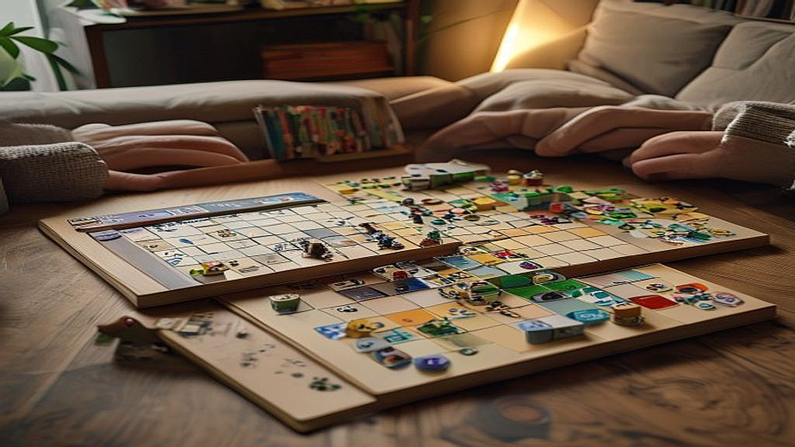

# 보드게임 카페가 아닌 '집'에서 즐기는 전략 보드게임 라이프

주말이면 습관처럼 스마트폰을 켜고 숏폼 콘텐츠를 넘기다 보면, 어느덧 해가 뉘엿뉘엿 지는 경험 다들 하시죠. 디지털 피로도가 극에 달한 요즘, 화면 속 세상에서 벗어나 우리 집 거실 테이블을 '진짜 몰입의 공간'으로 바꾸는 전략 보드게임 라이프가 새로운 취미로 자리 잡고 있습니다. 단순히 시간을 때우는 가벼운 게임이 아니라, 머리를 맞대고 고민하며 승리를 쟁취하는 전략 게임은 현대인에게 부족한 '생산적인 몰입'을 선물합니다. 밖에서 즐기는 보드게임 카페는 편리하지만, 집으로 취미를 옮겨오면 이야기가 달라집니다. 내가 좋아하는 조명 아래, 가장 편안한 옷을 입고, 좋아하는 음악을 배경으로 깔아둔 채 즐기는 게임은 단순한 놀이를 넘어 주말의 질을 완전히 바꿔놓는 경험이기 때문입니다. 오늘은 카페를 벗어나 우리 집 거실을 나만의 전략 보드게임 아지트로 만드는 실전 가이드를 공유합니다.

## 전략 보드게임, 입문 전 반드시 확인해야 할 3가지 체크포인트

집에서 보드게임을 시작할 때 가장 많이 범하는 실수는 '남들이 좋다는 인기 게임'을 무작정 구매하는 것입니다. 보드게임은 취향의 영역이 매우 넓어서, 남들에게는 명작인 게임이 나에게는 지루한 노동이 될 수 있습니다. 집이라는 공간은 카페처럼 직원이 게임을 설명해주거나 인원수를 맞춰주지 않습니다. 따라서 구매 전 다음 세 가지 기준을 반드시 따져봐야 합니다.

첫째, '실제 플레이 인원'입니다. 상자에는 2~4인용이라고 적혀 있어도, 실제로는 3인 이상일 때 비로소 재미가 완성되는 게임이 많습니다. 만약 주로 2인(커플이나 부부)이 즐길 예정이라면, 3~4인용 게임을 샀을 때 밸런스가 무너져 실망하기 쉽습니다. 2인 전용으로 설계된 게임인지, 아니면 다인용을 2명이서 억지로 하는 것인지 확인하세요.

둘째, '테이블 공간과 세팅 시간'입니다. 전략 게임은 보드판, 카드, 개인 타일 등 펼쳐야 할 구성물이 많습니다. 식탁이 좁거나, 게임을 세팅하는 데만 30분이 걸린다면 주말마다 게임을 꺼내기가 부담스러워집니다. 처음에는 테이블을 가득 채우지 않아도 되는 콤팩트한 사이즈의 게임으로 시작하는 것이 좋습니다.

셋째, '학습 곡선'입니다. 규칙을 익히는 과정 자체가 즐거움이 되어야 합니다. 설명서가 30페이지가 넘는 게임은 첫판을 시작하기도 전에 지쳐버릴 가능성이 큽니다. 유튜브에 올라온 10분 내외의 '룰 설명 영상'을 먼저 찾아보세요. 그 영상을 보면서 내가 흥미를 느끼는지, 혹은 벌써 지루한지 확인하는 것이 가장 정확한 구매 기준입니다.

실패 사례를 하나 들자면, 제 지인은 화려한 피규어에 매료되어 대작 전략 게임을 덜컥 구매했다가, 한 번도 끝까지 플레이하지 못했습니다. 게임의 볼륨이 너무 컸고, 규칙을 숙지할 동료가 없었기 때문입니다. 처음에는 구성물이 적고 규칙이 직관적인, 이른바 '미들급 전략 게임'으로 시작해 성공의 경험을 쌓는 것이 중요합니다.

## 집이라는 공간을 몰입의 아지트로 만드는 세팅 전략

보드게임을 카페가 아닌 집에서 즐길 때의 가장 큰 장점은 '우리만의 분위기'를 만들 수 있다는 점입니다. 단순히 거실 식탁에서 게임을 하는 것과, 몰입을 위한 환경을 조성하는 것은 차원이 다릅니다. 전략 게임은 집중력이 핵심입니다. 외부의 소음이나 스마트폰 알림이 게임의 흐름을 끊지 않도록 환경을 세팅해야 합니다.

가장 먼저 추천하는 것은 '조명 조절'입니다. 거실의 밝은 형광등보다는, 테이블 위를 집중적으로 비춰주는 스탠드를 활용해 보세요. 공간이 분리되는 느낌을 주어 게임에 더 깊게 몰입하게 만듭니다. 또한, 게임을 하는 동안 스마트폰은 거실 밖이나 다른 방에 두는 규칙을 세우는 것도 좋습니다. 이것은 디지털 피로도를 해소하기 위한 최소한의 장치입니다.

공간 관리 측면에서는 '보드게임 전용 매트'를 고려해 보세요. 일반 식탁에서 게임을 하면 카드를 집어 올리기 어렵고, 타일이 미끄러지기 쉽습니다. 저렴한 고무 재질의 매트 하나만 깔아도 테이블의 분위기가 완전히 달라집니다. 카드를 섞거나 타일을 놓을 때의 손맛이 훨씬 좋아지며, 이는 곧 게임에 대한 애정으로 이어집니다.

실수하기 쉬운 부분은 '수납의 압박'입니다. 게임을 하나둘씩 사다 보면 생각보다 부피가 커집니다. 게임을 구매하기 전, 보관할 선반이나 수납장 공간이 확보되었는지 먼저 확인하세요. 수납 공간이 없으면 게임이 거실 바닥에 굴러다니게 되고, 결국 그 게임은 다시는 꺼내지 않는 '장식품'이 됩니다. 

선택 기준을 제시하자면, '세팅과 정리의 간편함'을 우선순위에 두세요. 게임 종료 후 정리가 5분 안에 끝나는 게임은 자주 꺼내게 되지만, 정리가 복잡한 게임은 주말 마지막 날의 피로를 가중시킵니다. 구성물이 많더라도 트레이(정리함)가 잘 되어 있는 제품을 고르는 것이 장기적인 유지비와 정신 건강에 이롭습니다.

## 보드게임 라이프를 지속하는 커뮤니티와 기록의 즐거움

집에서만 즐기는 보드게임은 자칫하면 정체기에 빠지기 쉽습니다. 같은 게임만 반복하다 보면 전략이 뻔해지고 흥미가 떨어지기 때문입니다. 이럴 때 필요한 것이 바로 '기록'과 '커뮤니티'입니다. 

자신만의 보드게임 일지를 만들어 보세요. 어떤 게임을 했는지, 승자는 누구였는지, 어떤 전략이 유효했는지를 짧게 기록하는 것만으로도 게임의 깊이가 달라집니다. 승패의 이유를 복기하는 과정에서 다음 주말을 기다리는 설렘이 생깁니다. 이는 단순히 게임을 하는 행위를 넘어, 함께하는 사람과 공유하는 추억이 됩니다.

실전 팁으로, '게임 모임'을 거창하게 생각하지 마세요. 처음에는 가까운 지인 1~2명을 초대해 한 달에 한 번 정도 '보드게임 데이'를 정하는 것으로 충분합니다. 이때 중요한 것은 '맛있는 음식'과 함께하는 것입니다. 전략 게임은 에너지를 많이 소모합니다. 게임 중간에 먹는 간식이나 게임이 끝난 후 먹는 야식은 보드게임 라이프를 완성하는 화룡점정입니다.

피해야 할 상황은 '승패에 지나치게 집착하는 분위기'입니다. 집에서 하는 게임은 친밀감을 높이기 위한 도구여야 합니다. 이기기 위해 룰을 엄격하게 따지며 상대방을 다그치기 시작하면, 그 게임은 마지막 게임이 될 가능성이 큽니다. 특히 처음 접하는 사람에게는 승패보다 게임의 재미를 알려주는 '가이드' 역할을 자처하세요.

정리하자면, 집에서 즐기는 전략 보드게임은 우리 일상에 필요한 '아날로그적 몰입'을 되찾아주는 훌륭한 취미입니다. 처음부터 너무 어려운 게임에 도전하지 마시고, 자신의 인원과 공간에 맞는 게임을 신중히 선택하세요. 스마트폰을 끄고 테이블 위에 펼쳐진 게임판을 마주하는 순간, 당신의 주말은 이전과는 다른 깊이로 채워질 것입니다. 오늘 당장 거실 식탁을 정리하고, 가장 궁금했던 게임의 룰 영상을 찾아보는 것부터 시작해 보세요. 그것이 바로 보드게임 라이프의 첫걸음입니다.

## 마치며

집에서 즐기는 전략 보드게임은 단순한 놀이를 넘어, 바쁜 일상 속에서 아날로그적인 몰입과 소중한 사람들과의 깊은 유대감을 찾아주는 특별한 취미입니다. 승패에 연연하기보다 함께 웃고 즐기는 과정 그 자체에 집중한다면, 거실 식탁은 세상에서 가장 즐거운 소통의 장이 될 것입니다.

이제 고민은 그만하고, 오늘 바로 여러분의 취향을 저격할 보드게임을 하나 골라보세요. 게임의 규칙 영상을 찾아보고, 함께할 가족이나 친구에게 메시지를 보내는 것만으로도 설레는 보드게임 라이프는 이미 시작된 셈입니다. 스마트폰의 알림을 잠시 끄고, 테이블 위에 펼쳐진 게임판 앞에서 온전히 서로에게 집중하는 시간을 가져보시길 바랍니다. 이번 주말, 여러분의 공간에서 펼쳐질 즐거운 모험을 진심으로 응원하겠습니다!
