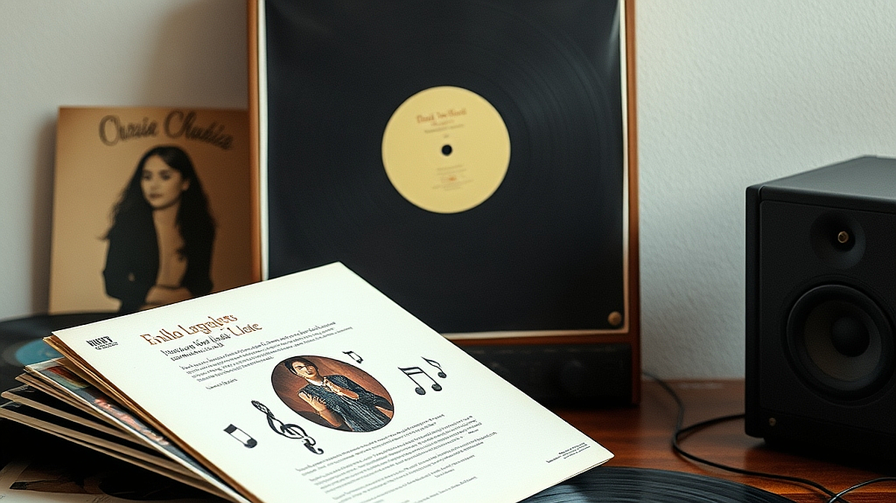

## 알고리즘이 추천하지 않는 노래를 찾는 법: 2026년형 음악 큐레이션 가이드

매일 아침 스트리밍 앱을 켜면 어제 들었던 곡과 90% 이상 닮은 음악이 메인 화면을 채웁니다. 음악 취향과 디지털 디톡스라는 화두는 이제 떼려야 뗄 수 없는 관계가 되었습니다. 인공지능이 제시하는 편안한 예측 가능성은 편리하지만, 역설적으로 우리는 새로운 음악을 만날 기회를 잃어가고 있습니다. 알고리즘은 사용자의 과거 데이터를 기반으로 가장 안전한 선택지를 내놓기 때문입니다. 만약 당신이 3년째 비슷한 분위기의 플레이리스트만 반복하고 있다면, 그건 당신의 취향이 고착된 것이 아니라 알고리즘이 당신을 특정 울타리에 가두고 있다는 신호입니다. 오늘 이 글에서는 플랫폼의 추천 엔진을 우회하여, 순수한 우연과 개인의 능동적인 감각으로 음악의 지평을 넓히는 구체적인 방법론을 제안합니다. 단순히 좋은 노래를 찾는 법을 넘어, 음악을 소비하는 주도권을 되찾는 과정입니다.

## 데이터의 굴레에서 벗어나는 첫 단계: 아카이브 탐색

알고리즘의 가장 큰 약점은 실시간성이 아닌 '기록된 과거'에 매몰되어 있다는 점입니다. 이를 극복하려면 데이터가 축적되지 않은 순수한 아카이브로 들어가야 합니다. 가장 추천하는 방식은 특정 장르나 시대의 레이블이 운영하는 아카이브 사이트나, 비영리 음악 데이터베이스를 직접 활용하는 것입니다. 예를 들어, 1970년대의 특정 국가 음악만 모아둔 아카이브나, 실험적인 전자음악 레이블의 전체 카탈로그를 연도순으로 훑어보는 방식입니다.

이 방법은 1시간 정도의 여유 시간과 정적인 환경이 필요합니다. 스트리밍 서비스의 검색창에 키워드를 넣는 것과는 차원이 다릅니다. 레이블의 홈페이지에 들어가 발매 순서대로 앨범 아트를 하나씩 클릭해 보는 과정은, 마치 헌책방에서 먼지 쌓인 책을 고르는 행위와 같습니다. 

*   **선택 기준:** 앨범 아트의 시각적 일관성이 없는 레이블을 고르세요. 기획된 상품이 아닌 아티스트의 고집이 담긴 레이블일수록 보석 같은 곡이 많습니다.
*   **실패 케이스:** 인기 차트 상위권 레이블의 아카이브를 뒤지는 것. 이곳은 이미 알고리즘이 휩쓸고 지나간 자리라 새로운 발견이 어렵습니다.
*   **실전 체크리스트:** 
    1. 특정 장르의 1980~1990년대 레이블 웹사이트 접속하기
    2. 가장 낮은 조회수를 기록한 앨범부터 들어보기
    3. 30초 내에 넘기지 말고 최소 2분간 감상하기

## 취향의 외연을 넓히는 교차 검증법

음악을 찾는 또 다른 방법은 내가 좋아하는 아티스트가 '영감을 받았다고 언급한 대상'을 추적하는 것입니다. 보통 우리는 좋아하는 아티스트의 신곡만 듣지만, 그들의 음악적 뿌리를 거슬러 올라가면 알고리즘이 절대 제안하지 않는 의외의 장르를 발견하게 됩니다. 인터뷰 기사나 아티스트가 직접 작성한 큐레이션 리스트를 활용하는 것이 핵심입니다.

여기서 중요한 것은 아티스트의 '영향력'이 아니라 '취향의 파편'을 찾는 것입니다. 단순히 같은 장르를 듣는 것이 아니라, 그들이 즐겨 듣는 영화 음악, 혹은 특정 시대의 민속 음악까지 뻗어 나가는 식입니다. 

*   **구체 예시:** 특정 재즈 피아니스트가 인터뷰에서 언급한 1950년대의 브라질 보사노바 앨범을 찾아 듣기. 이 과정에서 재즈와는 전혀 다른 화성학적 쾌감을 느낄 수 있습니다.
*   **실패 케이스:** 아티스트가 협업한 뮤지션의 음악만 듣는 것. 이는 알고리즘이 이미 당신의 데이터에 입력해둔 경로와 겹칠 확률이 90% 이상입니다.
*   **선택 기준:** 아티스트가 '어떤 상황에서' 그 음악을 듣는지 명시한 경우를 찾으세요. '작업할 때'보다는 '잠들기 전'이나 '비 오는 오후' 같은 구체적인 상황이 담긴 큐레이션이 당신의 감각을 더 날카롭게 자극합니다.

## 물리적 매체와 오프라인 경험의 재발견

디지털 디톡스의 정점은 물리적 매체, 즉 바이닐(LP)이나 카세트테이프를 활용하는 것입니다. 물리적 매체는 '곡 단위'가 아닌 '앨범 단위'로 음악을 강제합니다. 알고리즘은 3분짜리 곡을 추천하지만, 앨범은 40분의 서사를 요구합니다. 이 강제성은 음악을 감상하는 태도를 근본적으로 바꿉니다.

*   **방법론:** 중고 음반 매장에 가서 가장 낡아 보이는 앨범을 하나 골라 집으로 가져오세요. 앨범 커버를 보며 음악을 듣는 것은 시각과 청각을 동시에 사용하는 고도의 집중력을 요구합니다. 
*   **준비물:** 보급형 턴테이블 혹은 카세트 플레이어, 최소 1시간의 온전한 시간.
*   **피해야 할 경우:** 단순히 인테리어 소품으로 활용하려고 비싼 음반을 구매하는 행위. 이 경우 음악은 배경음으로 전락하며, 알고리즘 피로도를 해소하는 데 아무런 도움이 되지 않습니다.
*   **핵심 기준:** 앨범 전체를 관통하는 서사가 있는지 확인하세요. 한 곡만 좋고 나머지는 지루한 앨범을 끝까지 듣는 인내심이 필요합니다. 실패해도 괜찮습니다. 그 지루함 또한 나만의 취향을 구축하는 데이터가 되기 때문입니다.

## 디지털 피로를 씻어내는 음악적 습관

결국 알고리즘에서 벗어나는 것은 음악을 '상품'이 아닌 '경험'으로 대하는 태도의 문제입니다. 매일 새로운 곡을 쏟아내는 플랫폼의 속도에 맞춰 소비하는 습관을 버리세요. 대신, 이번 주말에는 스마트폰을 멀리 두고 오직 음악에만 집중하는 1시간을 만들어보길 권합니다. 알고리즘이 추천하지 않는 노래는 이미 세상에 존재하지만, 우리가 그 경로를 차단하고 있었을 뿐입니다. 

오늘 제안한 방법들 중 가장 먼저 실천해 볼 것은 '레이블 아카이브 탐색'입니다. 지금 바로 즐겨 듣는 아티스트의 소속사를 검색하고, 그들이 10년 전, 20년 전에 발행했던 앨범 리스트를 펼쳐보세요. 앨범 커버의 낯선 디자인이 주는 호기심이야말로 알고리즘이 절대 줄 수 없는 가치입니다. 음악은 소비되는 것이 아니라 발견되는 것입니다. 당신의 귀를 다시 한번 예민하게 벼려보세요. 낯선 리듬과 생소한 화음이 주는 당혹감이야말로 진정한 음악적 성장의 시작점입니다. 뻔한 플레이리스트가 지겨워졌다면, 지금 당장 스마트폰을 내려놓고 아날로그적인 탐색을 시작하십시오. 그곳에 당신이 찾던 진짜 음악이 기다리고 있습니다.

## 마치며

알고리즘의 편리함 뒤에 숨겨진 음악적 다양성을 되찾는 여정은 생각보다 단순합니다. 플랫폼이 정해준 알고리즘의 좁은 울타리를 벗어나 레이블 아카이브를 뒤지고, 낯선 앨범 커버를 마주하는 과정은 그 자체로 풍요로운 탐험이 됩니다. 우리가 익숙함에 안주하는 사이 놓치고 있던 것은 단순히 새로운 노래가 아니라, 음악을 주도적으로 발견하는 즐거움 그 자체일지도 모릅니다.

이제 알고리즘의 추천 목록을 끄고, 당신만의 음악적 지도를 그려볼 차례입니다. 이번 주말, 좋아하는 아티스트의 오래된 소속사 리스트를 훑어보는 것부터 시작해보세요. 처음 듣는 화음이 주는 낯선 감각에 몸을 맡기다 보면, 어느새 당신의 플레이리스트는 데이터가 아닌 당신의 취향으로 채워질 것입니다. 

음악은 소비하는 것이 아니라 당신만의 방식으로 발견하는 것입니다. 오늘 밤, 스마트폰의 추천 버튼 대신 당신의 귀와 직관을 믿고 새로운 소리를 찾아 떠나보는 건 어떨까요? 당신이 발견할 그 특별한 선율을 진심으로 응원합니다.
