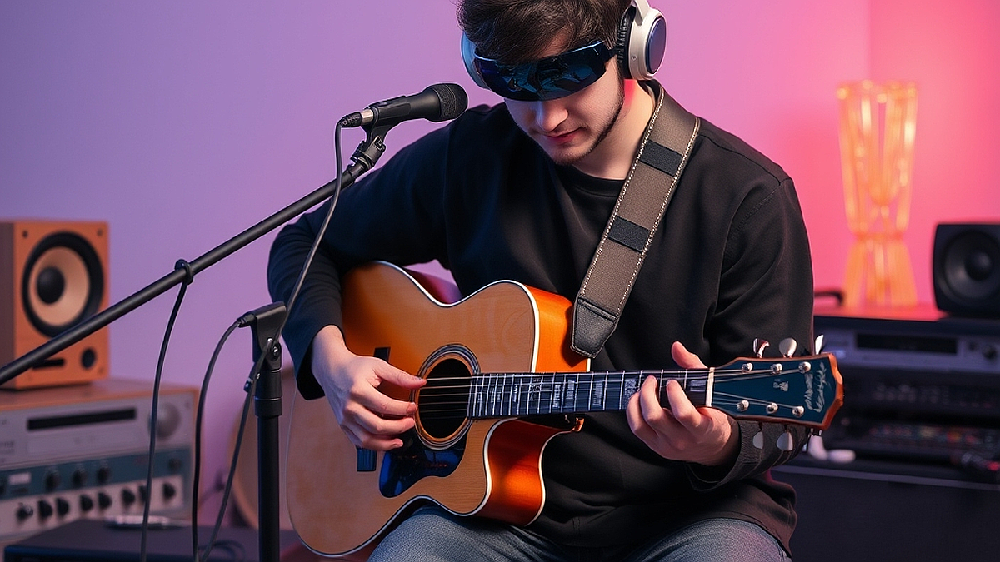

## AI 작곡가와 협업하는 2026년의 인디 뮤지션들

2026년 현재, AI 작곡가와 협업하는 인디 뮤지션들의 작업실 풍경은 불과 3년 전과는 확연히 다른 모습입니다. 과거에는 AI가 내놓는 결과물을 그저 신기한 장난감 정도로 치부하거나, 혹은 예술성을 훼손하는 위협적인 존재로 간주하는 이분법적인 시각이 지배적이었습니다. 하지만 지금 현장의 인디 뮤지션들은 AI를 창작의 주체가 아닌, 지치지 않는 세션 연주자이자 무한한 영감을 제공하는 공동 작업자로 대우하고 있습니다. 특히 1인 프로듀서 체제로 운영되는 홈 레코딩 환경에서 AI는 마감 기한을 맞추기 위한 필수적인 도구로 자리 잡았습니다. 오늘 이 글에서는 기술적 변화 앞에서 막연한 불안함을 느끼는 창작자들을 위해, 현장에서 AI를 어떻게 실질적인 생산성 도구로 활용하고 있는지, 그리고 어떤 기준으로 이 기술을 선택해야 하는지 구체적인 경험을 토대로 이야기해 보려 합니다. 단순히 기술을 찬양하려는 것이 아닙니다. 오히려 AI의 한계를 명확히 인식하고, 그 한계를 인간의 감각으로 어떻게 메울 것인지에 대한 실전적인 가이드를 제공하고자 합니다. 오늘 당장 여러분의 DAW(Digital Audio Workstation)에 적용할 수 있는 워크플로우를 확인해 보시기 바랍니다.

## AI 도구 선택의 기준: 창작의 보조인가, 대체인가

AI 음악 도구를 선택할 때 가장 먼저 고려해야 할 점은 본인의 작업 스타일이 '아이디어 발상'에 있는지, 아니면 '기술적 완성도'에 있는지 파악하는 것입니다. 현재 시중에 나와 있는 수많은 AI 서비스 중, 단순히 멜로디를 생성해 주는 모델에 의존하는 것은 위험합니다. 이는 자신의 음악적 색깔을 잃게 만드는 가장 빠른 길이기 때문입니다.

구체적인 선택 기준은 다음과 같습니다. 만약 여러분이 3시간 내에 곡의 스케치를 끝내야 하는 상황이라면, 전체 곡을 생성하는 모델보다는 특정 악기 트랙의 리듬 패턴이나 베이스 라인을 제안하는 '인텔리전트 플러그인' 형태의 도구를 선택해야 합니다. 반면, 곡의 전체적인 분위기를 잡기 위해 레퍼런스가 필요한 경우라면 프롬프트 기반의 생성형 모델을 활용해 5~10개의 짧은 루프를 얻어내는 것이 효율적입니다.

실패 사례를 하나 들자면, 많은 초보 창작자들이 AI가 만든 결과물을 그대로 가져와 자신의 곡인 양 믹싱을 시도합니다. 이는 저작권 문제 이전에, 곡 전체의 유기적인 흐름이 깨지는 결과를 초래합니다. AI는 데이터의 평균값을 내놓기 때문에, 대중적이지만 개성이 부족한 '심심한 음악'이 되기 십상입니다.

**선택을 위한 핵심 기준:**
* 데이터 소스 투명성: AI가 학습한 데이터의 저작권 상태를 확인할 수 있는가?
* 제어 가능성: 생성된 결과물에서 특정 음표나 리듬을 인간이 즉각적으로 수정할 수 있는가?
* DAW 통합성: 별도의 웹사이트를 거치지 않고 내 작업 환경 안에서 플러그인으로 구동되는가?

이 세 가지 조건 중 하나라도 충족하지 못한다면, 그 도구는 장기적인 창작 파트너로 적합하지 않습니다. 10만 원 미만의 구독료를 지불하기 전에 반드시 7일간의 무료 체험 기간을 활용해 실제 자신의 프로젝트 파일에서 돌려보십시오.

## 실전 체크리스트: AI와 함께하는 작업 프로세스 3단계

AI를 활용하는 인디 뮤지션의 작업은 '인간의 기획 - AI의 구체화 - 인간의 큐레이션'이라는 3단계 순환 구조를 가집니다. 이 과정에서 가장 중요한 것은 인간이 항상 '최종 결정권자'의 위치를 유지하는 것입니다.

첫 번째 단계인 '기획'에서는 AI에게 구체적인 제약 조건을 부여해야 합니다. 예를 들어 "슬픈 노래 만들어줘"와 같은 모호한 요청은 시간 낭비입니다. 대신 "110BPM, A 마이너 키, 90년대 로파이 힙합 비트 느낌의 킥과 스네어 패턴을 만들어줘"와 같이 명확한 수치와 장르적 레퍼런스를 입력해야 합니다.

두 번째 단계인 '구체화'에서는 AI가 뱉어낸 여러 버전의 결과물 중 가장 가능성 있는 소스 3개를 선택합니다. 이때 주의할 점은 음질이나 믹싱 상태가 아니라 '곡의 골격'만 보는 것입니다. 나머지는 여러분의 하드웨어와 플러그인으로 얼마든지 바꿀 수 있습니다.

세 번째 단계인 '큐레이션'이 예술성의 핵심입니다. AI가 만든 코드 진행에서 의외의 불협화음이 발견될 때, 이를 삭제하지 말고 오히려 그곳에서 새로운 멜로디의 영감을 얻어야 합니다. 실패하는 사람들은 AI가 만든 결과를 '완성된 제품'으로 받아들여 수정 없이 사용하려 합니다.

**실전 체크리스트:**
1. AI가 생성한 트랙을 솔로(Solo)로 들을 때 멜로디가 너무 평범하지 않은가? (평범하다면 프롬프트를 수정하십시오)
2. 기존에 내가 만들었던 곡들과 리듬적 통일감이 있는가?
3. AI 소스 위에 내가 직접 녹음한 악기나 보컬을 얹었을 때 어색함이 없는가?

이 체크리스트를 통과하지 못했다면, 그 AI 소스는 과감히 버리고 다시 생성하거나 직접 작곡하는 편이 훨씬 빠릅니다. AI는 시간을 단축해 주지 않습니다. 오히려 여러분이 '더 나은 선택'을 할 수 있도록 선택지의 폭을 넓혀줄 뿐입니다.

## 기술 변화기, 인디 뮤지션이 가져야 할 태도

기술이 발전할수록 음악 창작은 '기술적 숙련도'가 아니라 '취향의 큐레이션' 싸움이 됩니다. 2026년의 인디 뮤지션에게 필요한 덕목은 악기를 완벽하게 다루는 능력보다, 수많은 AI 생성물 중에서 내 음악의 정체성에 맞는 소리를 골라내는 '귀의 감각'입니다.

과거에는 악기를 잘 다루지 못하면 음악을 시작할 엄두를 내지 못했습니다. 하지만 이제는 누구나 아이디어가 있다면 AI의 도움을 받아 곡을 완성할 수 있습니다. 이것은 음악의 민주화인 동시에, 시장에 쏟아지는 음원의 질적 하향 평준화를 야기하기도 합니다. 이 지점에서 살아남는 뮤지션들은 AI가 할 수 없는 '인간적인 결함'을 음악에 녹여내는 이들입니다. 기계적으로 완벽한 박자보다는 연주자의 미세한 떨림, 가사의 진정성, 그리고 곡의 배경에 깔린 개인적인 서사가 대중의 마음을 움직입니다.

AI를 사용한다고 해서 여러분의 예술성이 부정되는 것은 아닙니다. 사진기가 발명되었을 때 화가들이 사라지지 않고 추상화라는 새로운 영역을 개척했듯이, 음악가들도 AI라는 도구를 통해 기존에 없던 새로운 사운드 디자인을 시도할 수 있습니다. 지금 여러분이 느끼는 불안함은 변화의 과정에서 오는 자연스러운 반응입니다. 다만, 그 불안을 해소하기 위해 기술을 무작정 배척하거나, 반대로 AI에 모든 것을 맡기고 수동적으로 변하는 태도 모두 경계해야 합니다.

가장 좋은 방법은 AI를 일종의 '실험실'로 활용하는 것입니다. 평소라면 시도하지 않았을 낯선 장르나 악기 구성을 AI에게 맡겨보고, 거기서 나오는 결과물들을 여러분의 기존 작법과 섞어보세요. 실패해도 괜찮습니다. 디지털 데이터는 물리적인 악기보다 훨씬 다루기 쉽고, 언제든 원래 상태로 되돌릴 수 있으니까요.

이제 여러분의 작업실에서 AI는 더 이상 두려운 존재가 아닙니다. 그것은 매일 아침 함께 커피를 마시며 아이디어를 던져주는, 지치지 않는 동료일 뿐입니다. 오늘 작업 중인 곡의 브릿지 구간이 막혔다면, 주저하지 말고 AI에게 해당 구간의 코드 진행을 몇 가지 제안해 보라고 시켜보십시오. 그 작은 시도가 여러분의 음악 인생을 바꾸는 새로운 전환점이 될지도 모릅니다. 기술을 도구로 부리되, 그 기술이 만드는 음악의 주인은 끝까지 여러분 자신이어야 한다는 점을 잊지 마시기 바랍니다. 지금 바로 DAW를 켜고, AI와 함께 새로운 실험을 시작해 보십시오. 여러분의 음악은 그 과정에서 더욱 단단해질 것입니다.

## 마치며

2026년, AI는 더 이상 음악가를 대체하는 경쟁자가 아니라 창의성의 지평을 넓혀주는 든든한 파트너가 되었습니다. AI를 단순한 도구로 활용해 낯선 장르를 실험하고, 막혔던 곡의 흐름을 뚫어주는 영감의 원천으로 삼아보세요. 기술이 제시하는 무한한 가능성을 여러분만의 독창적인 색깔로 다듬어 나갈 때, 비로소 대체 불가능한 여러분만의 음악이 완성됩니다.

이제 두려움은 잠시 내려놓고, 지금 바로 DAW를 켜서 AI와 함께 새로운 사운드를 탐험해 보는 건 어떨까요? 처음엔 작은 코드 진행 하나를 제안받는 것부터 시작해도 좋습니다. 그 작은 시도가 모여 여러분의 음악 세계를 더욱 풍성하고 단단하게 만들어 줄 테니까요. 오늘 당신의 작업실에서 탄생할 새로운 선율을 진심으로 응원합니다. 자, 이제 당신의 음악을 시작할 시간입니다!
