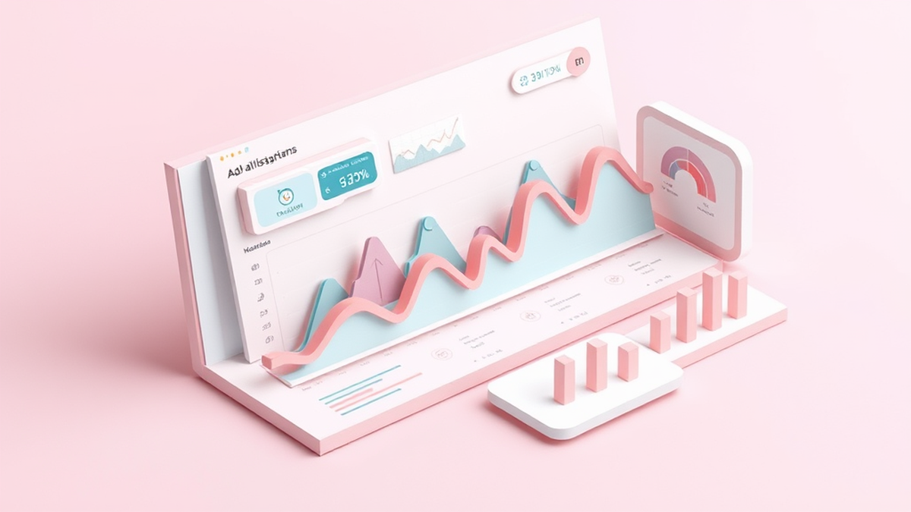

# 인스타그램 광고, 그냥 '좋아요'만 보시나요? 40대 키덜트 사장님의 진짜 효과 측정 비법!

안녕하세요, 여러분! 40대 키덜트 수집가이자, 가끔은 제 작은 가게를 운영하는 사장님으로 변신하는 블로그 주인장입니다. 오늘은 소상공인을 위한 인스타그램 광고 효과 측정 및 분석 방법이라는 조금 딱딱한 주제를 가지고 왔지만, 제가 수집하는 피규어처럼 하나하나 애정을 담아 풀어볼까 해요. 솔직히 저도 처음에는 인스타그램 광고를 '그냥 올려두면 되겠지' 하고 멋모르고 시작했어요. 마치 어릴 적 갖고 싶던 레고를 부모님께 졸라서 겨우 얻었는데, 조립 설명서는 대충 보고 마음대로 만들다가 결국 이상한 모양이 되어버린 것처럼 말이죠. 돈은 돈대로 쓰고, 기대했던 효과는 안 나오고... 아, 이거 진짜 갖고 싶었는데, 왜 이렇게 안 되는 거지? 하면서 좌절했던 기억이 생생합니다.

하지만 저도 한두 번 실패하고 나니 깨닫게 되더라고요. 비싼 한정판 피규어를 살 때도 그 피규어의 희소성, 품질, 심지어 나중에 리세일 가치까지 꼼꼼히 따져보는 것처럼, 광고도 마찬가지라는 걸요. 무작정 돈만 쓴다고 다가 아니에요. 우리가 소중하게 번 돈으로 광고를 집행했다면, 그 광고가 우리 가게에 어떤 영향을 미쳤는지 정확히 알아야 합니다. 그래야 다음번에는 더 나은 전략으로, 더 효율적으로 광고비를 쓸 수 있잖아요? 마치 레고 블록 하나하나를 신중하게 쌓아 올리듯이 말이죠. 단순히 '좋아요'나 '댓글' 몇 개 늘었다고 좋아할 때가 아니라는 겁니다. 진짜 중요한 건, 그 광고가 결국 우리 가게의 매출로 이어졌는지, 새로운 손님을 데려왔는지, 아니면 우리 브랜드를 얼마나 알렸는지 측정하고 분석하는 거죠. 오늘 제가 겪었던 시행착오들과 함께, 2025년 최신 트렌드에 맞춰 소상공인 사장님들이 인스타그램 광고 효과를 제대로 측정하고 분석하는 실용적인 방법들을 알려드릴게요.

## 광고 목표 설정부터 기본 지표 이해까지: 튼튼한 기반 다지기

여러분, 제가 어릴 적부터 장난감을 수집하면서 배운 가장 중요한 교훈 중 하나가 뭔지 아세요? 바로 **명확한 목표 설정**이에요. 특정 피규어를 모으기로 마음먹으면, 어떤 시리즈의 어떤 캐릭터를 모을 건지, 예산은 얼마인지, 어디서 구할 건지 철저하게 계획을 세우죠. 인스타그램 광고도 똑같습니다. 광고를 시작하기 전에 "우리 광고로 뭘 얻고 싶은가?" 이 질문에 대한 답이 명확해야 해요. 단순히 "우리 가게 잘 되게 해주세요!" 같은 막연한 목표로는 절대 제대로 된 효과를 측정할 수 없습니다.

가장 흔한 광고 목표는 크게 세 가지로 나눌 수 있어요. 첫째는 **인지도 향상**입니다. 우리 가게나 제품을 더 많은 사람들에게 알리고 싶을 때죠. 마치 신규 출시된 피규어의 존재를 세상에 알리는 것처럼요. 둘째는 **트래픽 및 참여 유도**입니다. 웹사이트 방문, DM 문의, 프로필 방문 등을 늘리고 싶을 때 선택하는 목표예요. 이건 마치 제가 좋아하는 피규어 커뮤니티에 사람들이 많이 들어와서 활발하게 소통하는 걸 바라는 마음과 비슷합니다. 셋째는 가장 중요한 **전환**입니다. 실제 구매, 회원 가입, 앱 설치 등 직접적인 행동을 유도하는 목표죠. 제가 갖고 싶던 한정판 피규어를 드디어 결제하는 순간과 같다고 보시면 돼요. 이 목표에 따라 우리가 집중해야 할 지표들이 달라집니다.

목표를 설정했다면, 이제 광고 성과를 보여주는 기본적인 지표들을 알아야 합니다. 마치 레고 설명서의 부품 목록처럼, 하나하나 어떤 역할을 하는지 알아야 조립을 제대로 할 수 있죠.

*   **도달 (Reach):** 우리 광고를 본 **고유한 사람의 수**입니다. 중복 없이 몇 명의 사람에게 광고가 노출되었는지 알려줘요.
*   **노출 (Impressions):** 우리 광고가 화면에 **총 몇 번 나타났는지**를 나타냅니다. 한 사람이 여러 번 볼 수 있기 때문에 도달보다 노출 수가 더 많을 수 있습니다. 제가 좋아하는 피규어 광고가 제 피드에 여러 번 뜨는 것처럼요.
*   **클릭 (Clicks):** 광고를 클릭한 횟수입니다. 웹사이트로 이동하거나 프로필을 방문하는 등의 행동이 여기에 해당하죠.
*   **클릭률 (CTR, Click-Through Rate):** 노출 수 대비 클릭 수의 비율입니다. (클릭 수 / 노출 수) * 100% 로 계산해요. CTR이 높다는 건 광고 소재가 사람들의 흥미를 잘 끌었다는 뜻입니다. 제가 올린 한정판 피규어 사진을 보고 사람들이 "와, 이건 어디서 팔아요?" 하고 클릭하는 것과 같아요.
*   **CPC (Cost Per Click):** 클릭 한 번당 지불한 비용입니다. (총 광고비 / 총 클릭 수)로 계산하죠. CPC가 낮을수록 효율적인 광고라고 볼 수 있어요.
*   **CPM (Cost Per Mille/Thousand Impressions):** 1,000회 노출당 비용입니다. (총 광고비 / 총 노출 수) * 1,000으로 계산해요. 주로 인지도 캠페인에서 중요하게 보는 지표입니다.

이 지표들을 이해하는 것이 광고 효과 분석의 첫걸음입니다. 저도 처음엔 클릭이 많으면 무조건 좋은 건 줄 알았어요. 그런데 알고 보니 클릭은 많았는데 실제 구매로 이어지는 전환은 거의 없었던 적도 있었죠. 마치 피규어 박스를 많이 구경했지만, 결국 구매는 안 한 것과 같은 셈입니다. 그래서 단순히 숫자가 높다고 좋은 것이 아니라, **내 광고 목표와 연결하여 지표들을 해석하는 능력**이 중요합니다. 예를 들어, 인지도 캠페인이라면 도달과 노출, CPM을 주로 보고, 전환 캠페인이라면 클릭률, CPC, 그리고 뒤에서 설명할 전환 지표들을 더 중요하게 봐야 하는 거죠. 이처럼 튼튼한 기반을 다져야 다음 단계로 나아갈 수 있습니다.

## 인스타그램 인사이트와 광고 관리자 활용: 숨겨진 보물 찾기

자, 이제 기본적인 지표들을 이해했으니, 실제로 어디서 이 보물 같은 데이터들을 찾아내고 분석할지 알아볼 시간입니다. 제가 새로운 피규어를 얻으면 박스 구석구석, 설명서 한 글자 한 글자까지 꼼꼼히 살펴보는 것처럼, 인스타그램 광고 데이터도 그렇게 세심하게 들여다봐야 합니다. 소상공인 사장님들에게 가장 유용한 도구는 바로 **인스타그램 인사이트**와 **메타 비즈니스 스위트(구 페이스북 광고 관리자)**입니다.

먼저, 인스타그램 인사이트는 여러분의 비즈니스 계정에서 바로 확인할 수 있는 아주 편리한 도구예요. 피드 게시물, 릴스, 스토리 등 여러분의 콘텐츠가 얼마나 많은 사람들에게 도달했고, 어떤 반응을 얻었는지 직관적으로 보여줍니다. 특히 광고를 집행했을 때, '홍보' 탭에 들어가면 해당 광고의 도달, 노출, 프로필 방문, 웹사이트 클릭 등의 성과를 한눈에 볼 수 있죠. 제가 좋아하는 피규어 사진을 올렸을 때, 누가 저장하고 누가 공유했는지 바로바로 알 수 있는 것과 같아요. 여기서 주목할 점은 **잠재 고객에 대한 인사이트**입니다. 우리 콘텐츠에 반응하는 사람들이 어떤 연령대이고, 성별은 어떻고, 어느 지역에 사는지 등을 파악할 수 있어요. 이 정보는 다음 광고를 기획할 때 "아, 우리 고객은 30대 여성분이 많으니, 다음 광고는 이분들이 좋아할 만한 소재로 만들자!" 하는 중요한 단서가 됩니다.

하지만 인스타그램 인사이트는 솔직히 말해 '맛보기' 수준에 가깝습니다. 진짜 깊이 있는 분석과 정교한 광고 운영을 위해서는 **메타 비즈니스 스위트** 안에 있는 **광고 관리자**를 적극 활용해야 합니다. 처음 이 광고 관리자 페이지를 열어보면 마치 거대한 레고 박스 안에 부품이 너무 많아서 어디서부터 시작해야 할지 막막하게 느껴질 수 있어요. 저도 그랬습니다. 하지만 몇 번 헤매다 보면 이 복잡한 도구가 얼마나 강력한지 깨닫게 될 거예요.

광고 관리자에서는 캠페인, 광고 세트, 광고라는 세 단계로 구성된 광고 구조를 볼 수 있습니다.

*   **캠페인:** 광고의 가장 큰 목표를 설정하는 단계입니다. (인지도, 트래픽, 전환 등)
*   **광고 세트:** 타겟 고객(연령, 성별, 관심사, 지역 등), 예산, 노출 위치(인스타그램 피드, 스토리, 릴스 등), 일정 등을 설정합니다. 여기가 바로 광고 효과를 좌우하는 핵심 설정 구간이라고 할 수 있어요. 제가 특정 피규어 콜렉터들을 타겟으로 광고를 할 때, 그들의 관심사를 정확히 파악해서 설정하는 것과 같죠.
*   **광고:** 실제로 고객에게 보여지는 이미지, 영상, 문구 등 광고 소재를 만드는 단계입니다.

여기서 우리가 집중해야 할 것은 **세부 데이터 분석**입니다. 광고 관리자에서는 특정 광고 세트나 광고의 성과를 **기간별, 타겟별, 노출 위치별, 기기별** 등으로 쪼개서 볼 수 있습니다. 예를 들어, "20대 여성에게는 이 광고 소재가 더 반응이 좋았고, 30대 남성에게는 저 소재가 좋았네?", "스토리 광고는 클릭률이 높은데, 피드 광고는 전환율이 높네?" 같은 인사이트를 얻을 수 있어요. 저도 한때 제 가게의 특정 상품 광고를 돌리면서, 처음엔 20대부터 40대까지 광범위하게 타겟을 잡았었거든요. 그런데 광고 관리자 데이터를 뜯어보니, 30대 후반 남성 고객들이 압도적으로 구매를 많이 한다는 걸 알게 되었고, 다음 광고부터는 그 타겟에 맞춰 소재와 문구를 집중적으로 변경해서 훨씬 좋은 성과를 냈습니다.

이처럼 광고 관리자는 마치 제가 수집한 피규어들의 상세 정보를 담은 데이터베이스 같아요. 어떤 피규어가 가장 인기가 많았고, 어떤 피규어는 생각보다 반응이 없었는지, 그리고 다음번에는 어떤 피규어를 수집해야 할지 알려주는 거죠. 이 데이터를 통해 비효율적인 광고를 중단하고, 성과가 좋은 광고에 예산을 더 투입하는 **예산 최적화**도 가능해집니다. 꾸준히 데이터를 들여다보고 분석하는 습관을 들이는 것이 숨겨진 보물을 찾는 열쇠가 될 거예요.

## 전환 추적과 ROAS 분석: 광고비, 허투루 쓰지 마세요!

수집가에게 가장 중요한 순간은 뭘까요? 바로 **결제 버튼을 누르는 순간**입니다. 제가 그토록 바라던 한정판 피규어를 손에 넣기 위해 지갑을 여는 그 순간 말이죠. 인스타그램 광고에서도 이 '결제'와 같은 최종 목표, 즉 **전환**을 추적하는 것이 가장 중요합니다. 많은 소상공인 사장님들이 광고를 돌리면서 "도달이 많이 나왔으니 잘 되었겠지?" 하고 막연하게 생각하시는데, 결국 광고는 매출로 이어져야 의미가 있잖아요? 광고비를 허투루 쓰지 않기 위해서는 전환 추적과 ROAS(광고 수익률) 분석이 필수적입니다.

전환 추적을 위해 가장 중요한 도구는 바로 **메타 픽셀(Meta Pixel)**입니다. 웹사이트에 심어두는 작은 코드 조각인데, 이게 우리 웹사이트를 방문한 고객들의 행동을 추적해줍니다. 어떤 페이지를 봤는지, 장바구니에 뭘 담았는지, 그리고 최종적으로 **구매를 완료했는지**까지 말이죠. 마치 제가 어떤 온라인 피규어 샵에서 어떤 상품을 보고, 장바구니에 담았다가 결국 구매까지 했는지 그 샵 주인이 알 수 있게 해주는 것과 같습니다. 이 픽셀이 있어야 광고 관리자에서 "우리 광고를 보고 10명이 구매했다"는 정확한 데이터를 볼 수 있어요. 2025년에는 개인 정보 보호 강화로 인해 **전환 API(Conversions API)**의 중요성도 더욱 커지고 있습니다. 픽셀이 브라우저 기반이라면, 전환 API는 서버 기반으로 데이터를 전송하여 더 정확하고 안정적인 추적이 가능하게 해주죠. 처음에는 설치가 조금 복잡하게 느껴질 수 있지만, 웹 개발자의 도움을 받거나 쇼핑몰 솔루션에서 제공하는 연동 기능을 활용하면 충분히 가능합니다. 이 작업은 마치 레고 조립 전에 설명서를 꼼꼼히 읽고 부품을 분류하는 것만큼 중요한 작업이니 꼭 시간을 들여야 합니다.

이제 픽셀이 설치되어 전환 데이터를 수집하기 시작했다면, 가장 핵심적인 지표인 **ROAS(Return On Ad Spend), 즉 광고 수익률**을 분석할 차례입니다. ROAS는 "광고비 1원당 얼마의 매출이 발생했는가?"를 알려주는 지표예요. 계산은 간단합니다. **(광고로 발생한 총 매출 / 총 광고비) * 100%** 입니다. 예를 들어, 10만 원의 광고비를 써서 50만 원의 매출이 발생했다면, ROAS는 (50만원 / 10만원) * 100% = 500%가 됩니다. 즉, 광고비 1원당 5원의 매출을 벌어들인 거죠. 제가 비싼 한정판 피규어를 구매할 때 "이게 나중에 가치가 얼마나 오를까?" 생각하는 것과 똑같습니다. ROAS가 높을수록 광고 효율이 좋다는 뜻이니, 우리는 이 ROAS를 최대한 끌어올리는 것을 목표로 해야 합니다.

ROAS와 함께 봐야 할 지표는 **CPA(Cost Per Acquisition), 즉 고객 획득 비용**입니다. 고객 한 명을 얻는 데 얼마의 광고비가 들었는지 알려주는 지표죠. (총 광고비 / 총 전환 수)로 계산합니다. 만약 우리 가게의 평균 객단가나 마진율을 알고 있다면, 이 CPA가 적절한 수준인지 판단할 수 있어요. CPA가 너무 높다면 광고 소재나 타겟팅에 문제가 있을 수 있습니다.

이러한 지표들을 분석하면서, 저는 다양한 **A/B 테스트**를 진행하는 것을 추천합니다. 광고 소재(이미지/영상), 문구, 타겟팅, 노출 위치 등 여러 요소를 조금씩 바꿔가면서 어떤 조합이 가장 높은 ROAS나 낮은 CPA를 만들어내는지 찾아내는 거죠. 마치 여러 종류의 레고 블록으로 다양한 모양을 만들어보면서 가장 멋진 작품을 찾아내는 과정과 같아요. 예를 들어, "이 피규어 사진이 더 잘 팔릴까, 아니면 저 피규어 영상이 더 잘 팔릴까?" 하고 테스트해보고, 데이터를 기반으로 더 효율적인 광고에 예산을 집중하는 거죠.

2025년에는 개인화된 고객 경험이 더욱 중요해지면서, 광고 데이터 분석은 단순히 효율을 넘어 **고객 생애 가치(LTV, Lifetime Value)**를 높이는 데까지 활용될 겁니다. 광고를 통해 유입된 고객이 우리 가게에서 얼마나 오랫동안, 얼마나 많은 가치를 창출할 것인지 예측하고, 그에 맞춰 광고 전략을 세우는 거죠. 광고비는 단순히 지출이 아니라, 우리 가게의 미래를 위한 투자라는 마인드로 접근해야 합니다. 전환 추적과 ROAS 분석을 통해 여러분의 소중한 광고비가 허투루 쓰이지 않고, 진짜 매출로 이어지도록 만들어 보세요!

## 광고 효과 분석, 이제 망설이지 말고 시작하세요!

여러분, 오늘 우리는 소상공인을 위한 인스타그램 광고 효과 측정 및 분석 방법에 대해 40대 키덜트 수집가인 저의 경험담과 함께 자세히 알아봤습니다. 처음에는 복잡하게 느껴질 수 있는 광고 목표 설정부터 시작해서, 인스타그램 인사이트와 메타 광고 관리자를 활용해 숨겨진 보물 같은 데이터를 찾아내는 방법, 그리고 최종적으로 전환 추적과 ROAS 분석을 통해 광고비를 허투루 쓰지 않는 실질적인 팁까지 말이죠.

기억하세요. 인스타그램 광고는 단순히 예쁜 사진을 올리고 '좋아요'를 많이 받는 것이 아니라, 우리 가게의 성장을 위한 전략적인 투자라는 것을요. 제가 좋아하는 피규어를 모으기 위해 정보도 찾아보고, 예산도 세우고, 발품도 파는 것처럼, 광고도 꾸준한 관심과 분석이 필요합니다. 처음부터 완벽하게 모든 것을 해낼 필요는 없어요. 작은 목표부터 세우고, 하나하나 지표를 확인하면서 여러분만의 최적화된 광고 전략을 찾아나가는 것이 중요합니다.

지금 당장 여러분의 인스타그램 비즈니스 계정을 열고 인사이트를 확인해보세요. 메타 광고 관리자에 접속해서 지난 광고의 데이터를 들여다보는 것부터 시작해보는 겁니다. 실패를 두려워하지 마세요. 저도 수많은 레고 블록을 잘못 끼워보고, 비싼 피규어를 샀다가 후회한 적도 많습니다. 하지만 그런 경험들이 쌓여 더 현명한 수집가가 되고, 더 나은 사장님이 될 수 있었어요. 여러분의 소중한 광고비가 헛되지 않도록, 오늘 배운 지식들을 활용하여 인스타그램 광고의 진짜 효과를 측정하고 분석하는 멋진 사장님이 되시기를 진심으로 응원합니다!