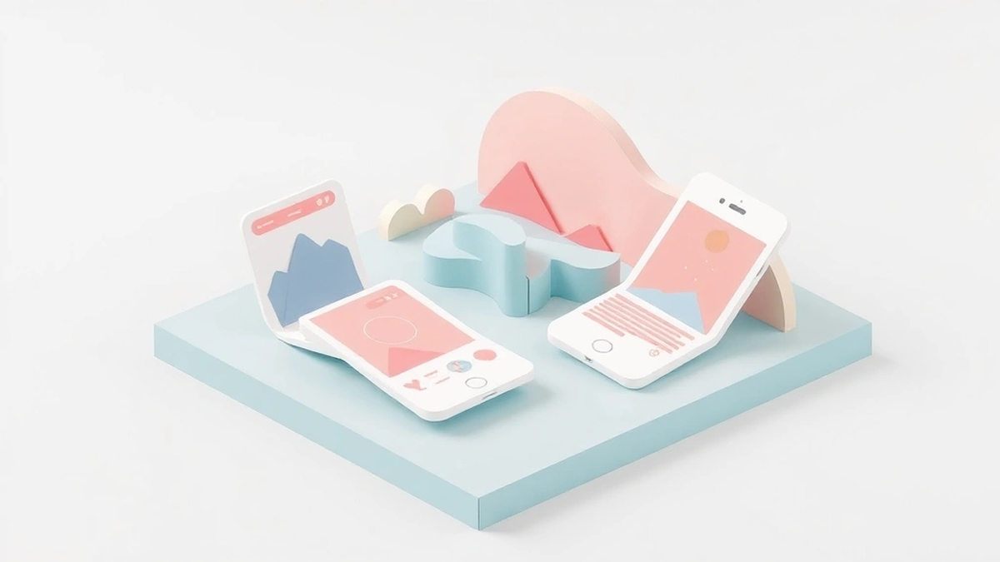

안녕하세요, 디지털 마케팅 바닥에서 20년째 구르고 있는 베테랑 마케터입니다. 오늘은 여러분과 함께 2025년에도 여전히 뜨거운 감자인 **인스타그램 릴스 마케팅**에 대한 솔직하고 실용적인 이야기들을 나눠보려 합니다. "요즘 릴스 안 하면 장사 안 된다"는 말이 있을 정도로, 숏폼 콘텐츠는 이제 선택이 아닌 필수가 되었죠. 저도 처음에는 '또 새로운 게 나왔네, 언제 다 배우나' 싶어 한숨부터 나왔습니다. 하지만 실제로 해보니까, 이 릴스가 정말 **기대 이상의 파급력**을 가지고 있더라고요. 단순히 조회수만 올리는 걸 넘어, 실제 고객 유입과 전환율 개선에 엄청난 효과를 보여주는 효자 노릇을 톡톡히 하고 있습니다.

제가 수많은 캠페인을 진행하면서 겪었던 성공과 실패, 그리고 그 속에서 얻은 값진 경험들을 바탕으로, 어떻게 하면 인스타그램 릴스를 우리 비즈니스에 가장 효과적으로 활용할 수 있을지, 마치 옆집 형처럼, 때로는 쓴소리도 아끼지 않는 선배처럼 친근하게 이야기해 드릴게요. 복잡한 이론보다는 '실제로 써먹을 수 있는' 꿀팁 위주로 준비했으니, 오늘 이 글을 끝까지 읽으시면 당장 내일이라도 릴스 콘텐츠를 기획하고 실행할 수 있는 자신감을 얻으실 겁니다. 특히 ROI(투자 대비 수익률)와 전환율을 극대화할 수 있는 구체적인 전략과, 제가 직접 겪었던 실패 사례와 그 개선 방안까지 아낌없이 공유해 드릴 테니, 기대하셔도 좋습니다. 자, 그럼 릴스의 세계로 함께 떠나볼까요?

## 릴스 콘텐츠, '훅'이 전부다! 기획부터 제작까지 성공 공식

릴스 마케팅의 성패는 사실상 콘텐츠의 '훅(Hook)'에 달려있다고 해도 과언이 아닙니다. 여러분도 인스타그램 릴스를 넘기다 보면, 첫 1~3초 만에 시선을 사로잡는 영상에 멈추게 되고, 그렇지 않으면 가차 없이 스킵하게 되죠? 제가 20년 동안 수많은 광고를 만들고 분석하면서 내린 결론은, 숏폼 콘텐츠에서는 이 **'초반 임팩트'가 곧 생명**이라는 겁니다. 콘텐츠 기획 단계부터 "어떻게 하면 사람들의 손가락을 멈추게 할까?"를 고민해야 합니다.

처음 릴스 마케팅을 시작했을 때, 저도 시행착오를 많이 겪었어요. 당시에는 '정보 전달이 중요해!'라는 생각에 제품의 장점을 주구장창 설명하는 릴스를 만들었죠. 결과는 처참했습니다. 조회수는 바닥을 기고, 도달률은 평균에 한참 못 미쳤어요. '릴스 효과가 없다'고 단정하고 포기할 뻔도 했습니다. 하지만 포기하지 않고 데이터를 뜯어보니, 대부분의 시청자들이 **3초 이내에 이탈**하고 있다는 사실을 발견했죠. 그때부터 콘텐츠 제작 방향을 완전히 바꿨습니다. 제품 설명 대신, **문제 제기와 해결책을 짧고 강렬하게 제시**하거나, **궁금증을 유발하는 질문**을 던지는 방식으로요. 예를 들어, "혹시 아직도 이걸 모른다고요?" 같은 문구와 함께 시각적으로 흥미로운 장면을 배치하는 식입니다. 실제로 이렇게 전략을 바꾸자, 릴스 시청 완료율이 이전 대비 **2배 이상** 증가했고, 평균 조회수도 **300%** 가까이 상승하는 놀라운 경험을 했습니다.

2025년의 릴스 트렌드를 보면, 단순히 예쁘거나 웃긴 영상보다는 **정보성 콘텐츠에 스토리텔링을 결합**하는 방식이 더욱 중요해질 겁니다. 예를 들어, 우리 제품이 고객의 어떤 '페인 포인트(Pain Point)'를 해결해 주는지, 그 과정에서 고객이 어떤 감정을 느끼는지 짧은 드라마처럼 보여주는 거죠. 이때 중요한 건 **진정성**입니다. 과장된 광고보다는 실제 사용자의 경험담이나, 제품 개발 비하인드 스토리를 담담하게 풀어내는 것이 훨씬 효과적이에요. 또한, 인스타그램 자체의 **트렌딩 사운드**를 적극적으로 활용하는 것도 잊지 마세요. 트렌딩 사운드를 사용하면 릴스 노출 알고리즘에서 더 유리하게 작용하는 경우가 많습니다. 저는 매주 인스타그램 릴스 탭과 틱톡을 오가며 어떤 사운드가 유행하는지 모니터링하고, 우리 브랜드의 메시지와 어울리는 사운드를 빠르게 캐치해서 콘텐츠에 적용하는 습관을 들였습니다. 이런 작은 노력들이 모여 결국 더 높은 도달과 참여로 이어지더라고요. 콘텐츠 기획 단계에서부터 **'이 릴스를 본 사람들이 무엇을 얻어가기를 바라는가?'**라는 질문을 던지고, 그 해답을 3초 안에 담아내는 연습을 꾸준히 해보세요.

## 데이터, 릴스 마케팅의 나침반: 성과 분석과 최적화의 기술

여러분, 릴스 콘텐츠를 올리고 나서 "좋아요 많네? 성공!" 하고 끝내시면 절대 안 됩니다. 진정한 마케터라면, 숫자를 통해 콘텐츠의 성공 여부를 판단하고, 다음 전략을 세워야 하죠. 제가 20년간 마케팅을 하면서 얻은 가장 큰 깨달음 중 하나가 바로 **'데이터는 거짓말하지 않는다'**는 겁니다. 인스타그램 릴스 마케팅에서도 데이터 분석은 선택이 아닌 필수입니다. 어떤 지표를 봐야 할까요? 단순히 조회수만 보던 시절은 지났습니다. 이제는 **도달, 참여율(좋아요, 댓글, 공유, 저장), 시청 완료율, 그리고 가장 중요한 전환율**까지 꼼꼼히 살펴봐야 합니다.

초창기 릴스 마케팅에서는 저도 실수투성이였어요. 특정 릴스가 조회수가 100만을 넘어가자, 성공했다고 자축하며 다음 콘텐츠를 기획했죠. 그런데 막상 상세 데이터를 보니, 시청 완료율은 20%에 불과했고, 웹사이트로의 유입이나 실제 구매 전환은 거의 없었습니다. 이 릴스가 과연 성공한 걸까요? 저는 아니라고 생각합니다. 재미는 있었지만, 결국 비즈니스 목표 달성에는 실패한 콘텐츠였던 거죠. 이 실패를 통해 저는 **'퍼널(Funnel)별 지표'**의 중요성을 깨달았습니다. 릴스 시청 -> 프로필 방문 -> 웹사이트 클릭 -> 제품 탐색 -> 장바구니 담기 -> 최종 구매까지, 각 단계별로 이탈률을 확인하고, 어떤 부분에서 고객이 떨어져 나가는지 분석하는 것이죠.

이후부터는 인스타그램 인사이트를 꼼꼼히 활용했습니다. 어떤 릴스가 프로필 방문을 많이 유도하는지, 어떤 릴스가 저장률이 높은지, 어떤 CTA(Call To Action) 문구가 웹사이트 클릭률을 높이는지 말이죠. 예를 들어, 특정 제품을 홍보하는 릴스에서 "지금 구매하기" 버튼을 넣었을 때와 "자세히 알아보기" 버튼을 넣었을 때의 **클릭률(CTR)**을 A/B 테스트한 적이 있습니다. 결과는 놀라웠어요. "자세히 알아보기" 버튼이 **1.5배 이상** 높은 클릭률을 보였고, 이는 최종 전환율에도 긍정적인 영향을 미쳤습니다. 사람들은 당장 구매하기보다는 정보를 탐색하는 단계를 선호한다는 것을 알 수 있었죠. 이렇게 데이터를 기반으로 콘텐츠의 **썸네일, 첫 3초 영상, CTA 문구, 배경 음악, 심지어 업로드 시간까지** 끊임없이 테스트하고 최적화했습니다. 그 결과, 특정 캠페인에서는 릴스 유입 고객의 **구매 전환율을 초기 2%에서 6%까지 3배 이상 끌어올릴 수 있었고**, 이는 전체 마케팅 ROI를 **200% 이상** 개선하는 데 크게 기여했습니다.

2025년에는 인스타그램의 알고리즘이 더욱 고도화되어, 개인화된 추천이 심화될 겁니다. 따라서 우리 타겟 고객이 어떤 콘텐츠에 반응하는지, 어떤 지점에서 이탈하는지에 대한 **정교한 분석**이 더욱 중요해질 거예요. AI 기반의 예측 분석 도구들도 점차 상용화될 것이므로, 이러한 기술들을 활용하여 콘텐츠를 선제적으로 개선하는 마케터가 경쟁에서 우위를 점할 수 있을 겁니다. 여러분의 릴스 콘텐츠가 단순한 '영상'이 아니라, 고객과의 **'데이터 기반 대화'**가 될 수 있도록 끊임없이 분석하고 개선하는 습관을 들이세요.

## 릴스 광고와 협업 전략: 성과를 폭발시키는 시너지 효과

릴스 콘텐츠를 유기적으로 잘 만드는 것도 중요하지만, 때로는 **돈의 힘을 빌리는 것**이 훨씬 효율적일 수 있습니다. 바로 릴스 광고와 인플루언서/크리에이터 협업을 통해서 말이죠. 제가 20년 동안 마케팅을 하면서 느낀 건, 아무리 좋은 콘텐츠라도 도달하지 못하면 무용지물이라는 겁니다. 특히 새로운 브랜드나 제품을 알릴 때는 초기 부스팅이 필수적입니다.

처음 릴스 광고를 시작했을 때, 저도 큰 실수를 저질렀습니다. 단순히 '릴스는 짧게!'라는 생각에, 기존에 만들었던 릴스 콘텐츠를 그대로 광고로 돌렸죠. 결과는 참담했어요. 광고비는 광고비대로 나가고, 클릭률이나 전환율은 기대 이하였습니다. 광고 효율이 **-30%**를 기록하며 크게 손실을 봤던 아픈 기억이 있습니다. 그때 깨달았죠. 유기적인 릴스와 **광고용 릴스는 접근 방식이 달라야 한다**는 것을요. 유기적인 릴스는 발견의 즐거움과 재미에 초점을 맞추지만, 광고용 릴스는 **명확한 목표와 강력한 CTA**가 있어야 합니다.

이 실패를 교훈 삼아, 광고용 릴스는 다음과 같은 전략으로 접근하기 시작했습니다. 첫째, **초반 3초 안에 핵심 메시지를 전달**하고, 시각적으로 강렬한 인상을 남깁니다. 둘째, **타겟 고객의 니즈를 정확히 저격하는 카피**를 사용합니다. 셋째, **명확하고 매력적인 CTA**를 포함합니다. 예를 들어, "한정 수량 할인! 지금 바로 경험하세요!"와 같이 긴급성과 가치를 동시에 제시하는 거죠. 이렇게 광고 소재를 최적화하고, 인스타그램의 정교한 타겟팅 기능을 활용해 우리 제품에 관심 있을 만한 잠재 고객들에게만 노출시켰습니다. 그 결과, 특정 릴스 광고 캠페인의 **클릭률(CTR)이 2.5%에서 5%로 두 배 이상 상승**했고, **광고비 대비 구매 전환율(ROAS)은 300%**를 넘어서는 성공적인 경험을 했습니다.

더 나아가, 인플루언서 및 크리에이터와의 협업은 릴스 마케팅의 시너지를 폭발시키는 강력한 도구입니다. 무조건 팔로워 수가 많은 메가 인플루언서만 고집할 필요는 없습니다. 오히려 **우리 브랜드의 가치와 잘 맞고, 진정성 있게 소통하는 마이크로/나노 인플루언서**들이 훨씬 높은 전환율을 가져다주는 경우가 많습니다. 제가 한때 유명 인플루언서에게 거액을 투자했다가, 콘텐츠는 예뻤지만 실제 구매 전환으로 이어지지 않아 ROI가 바닥을 쳤던 경험이 있어요. 그 이후로는 우리 제품을 진심으로 좋아하고, 팔로워들과 끈끈한 관계를 맺고 있는 1만~5만 팔로워의 마이크로 인플루언서들과 협업하기 시작했습니다. 이들은 마치 옆집 친구가 추천해 주는 것처럼 자연스럽게 제품을 소개했고, 덕분에 캠페인 **평균 구매 전환율이 3%에서 8%로 껑충 뛰었으며**, 광고 비용 대비 효율도 **250% 이상** 개선되었습니다.

2025년에는 AI 기반의 인플루언서 매칭 플랫폼이 더욱 고도화되어, 우리 브랜드에 최적화된 크리에이터를 찾아주는 것이 더욱 쉬워질 겁니다. 또한, 릴스 내 라이브 커머스 연동 기능이 강화되면서, 인플루언서가 릴스 라이브를 통해 제품을 판매하고, 시청자들이 즉시 구매로 이어질 수 있는 환경이 더욱 활성화될 것으로 예상됩니다. 릴스 광고와 협업은 단순히 노출을 늘리는 것을 넘어, **브랜드 신뢰도를 구축하고, 잠재 고객을 실제 고객으로 전환시키는 강력한 엔진**이 될 수 있습니다. 전략적인 접근으로 이 두 가지 요소를 효과적으로 활용해 보세요.

여러분, 인스타그램 릴스 마케팅은 단순히 '트렌드'를 쫓는 것을 넘어, 이제는 우리 비즈니스의 성장을 위한 **필수적인 퍼포먼스 마케팅 채널**이 되었습니다. 제가 20년 동안 이 바닥에서 구르면서 얻은 가장 큰 깨달음은 바로 **'일단 시작하고, 데이터를 믿고, 끊임없이 개선하라'**는 겁니다. 처음부터 완벽한 릴스를 만들려 애쓰지 마세요. 일단 아이디어가 떠오르면 가볍게 시도해보고, 어떤 콘텐츠가 우리 고객들에게 반응을 얻는지 데이터를 통해 확인하세요. 그리고 그 데이터를 바탕으로 콘텐츠 기획부터 제작, 광고 집행까지 모든 과정을 최적화해 나가는 겁니다.

물론 그 과정에서 저처럼 실패도 겪을 수 있습니다. 하지만 실패는 값진 경험이 되고, 다음 단계로 나아갈 수 있는 소중한 자산이 됩니다. 오늘 제가 공유해 드린 '훅' 있는 콘텐츠 기획, 데이터 기반의 최적화, 그리고 릴스 광고 및 협업 전략들을 여러분의 비즈니스에 적용해 보세요. 분명 놀라운 성과를 경험하실 수 있을 겁니다. 릴스 마케팅, 어렵게 생각하지 마세요! 지금 바로 스마트폰을 들고, 여러분의 이야기를 짧고 강렬하게 담아내 보세요. 여러분의 비즈니스가 릴스를 통해 한 단계 더 성장하기를 진심으로 응원합니다.

## 마치며

결론적으로, 인스타그램 릴스 마케팅의 핵심은 **'실행, 데이터 분석, 그리고 지속적인 개선'**에 있습니다. 완벽함보다는 시작에 의미를 두고, 매력적인 '훅'을 가진 콘텐츠를 기획하며, 고객 반응 데이터를 통해 끊임없이 전략을 다듬어 나가야 합니다. 릴스 광고와 협업을 통해 도달 범위를 넓히는 것 또한 성장을 가속화하는 중요한 열쇠가 될 것입니다.

물론 새로운 시도에는 시행착오가 따를 수 있습니다. 하지만 모든 실패는 더 나은 다음 단계를 위한 귀중한 밑거름이 됩니다. 이제 주저하지 말고 여러분의 스마트폰을 들어보세요. 짧고 강렬한 릴스 영상 하나가 여러분의 브랜드 스토리를 더욱 생생하게 전달하고, 잠재 고객과의 강력한 연결고리를 만들어 줄 것입니다. 릴스 마케팅을 통해 여러분의 비즈니스가 새로운 도약의 기회를 맞이하길 진심으로 응원합니다. 지금 바로 시작하여 놀라운 변화를 경험하세요!