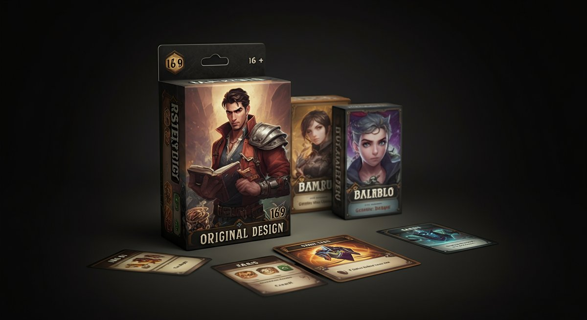

# 카드게임, 40대 키덜트가 추천하는 2025년 최신 트렌드와 성공적인 수집 전략!

아, 정말 설레는 주제죠? 저도 어린 시절 처음으로 [포켓몬 카드게임](https://ko.wikipedia.org/wiki/%ED%8F%AC%EC%BC%93%EB%AA%AC_%ED%8A%B8%EB%A0%88%EC%9D%B4%EB%8D%B0%EC%9D%B4_%EC%B9%B4%EB%93%9C_%EA%B2%8C%EC%9E%84)을 손에 쥐었을 때 그 두근거림을 아직도 잊을 수가 없어요. 쪼그려 앉아 친구들과 카드게임 배틀을 벌이던 기억, 밤새도록 아끼던 덱을 정리하며 다음 날의 승리를 꿈꾸던 그 시절의 향수가 지금의 저를 만든 것 같습니다. 요즘도 새로운 카드게임 출시 소식만 들으면 가슴이 막 뛰고, 출시일에 맞춰 매장으로 달려가는 건 제겐 너무나 당연한 일이죠. 실제로 수많은 피규어와 함께 제 보물창고를 가득 채우고 있는 건 바로 이 카드게임 컬렉션이에요. 이 글에서는 저처럼 어린 시절의 추억을 간직하고 있거나, 이제 막 카드게임의 세계에 발을 들이려는 분들을 위해 2025년 최신 트렌드부터 실용적인 수집 전략까지, 제 경험을 꾹꾹 눌러 담아 이야기해 보려고 합니다. 특히 가격 대비 품질, 내구성, 그리고 나중에라도 팔 수 있을 리세일 가치 같은 실용적인 정보들을 제 개인적인 경험담과 함께 녹여낼 테니, 저와 함께 즐거운 카드게임의 세계로 빠져볼 준비 되셨나요?

요즘 카드게임 시장이 정말 뜨겁죠? 단순히 과거의 향수를 넘어 새로운 세대에게도 어필하면서 다시금 전성기를 맞이하고 있다는 생각이 들어요. 온라인 커뮤니티에서 활동하다 보면 저처럼 40대, 50대 형님들뿐만 아니라 10대, 20대 젊은 친구들도 카드게임에 푹 빠져있는 모습을 자주 보게 되는데, 그 열기가 예사롭지 않습니다. 이렇게 세대를 아우르는 매력을 가진 카드게임은 이제 단순한 취미를 넘어 하나의 문화 현상이자 투자 가치까지 인정받는 시대가 되었죠. 저도 처음에는 그냥 좋아서 시작했는데, 어느새 몇몇 카드들은 제가 생각했던 것보다 훨씬 더 높은 가치를 지니게 되어서 깜짝 놀랐던 경험도 있거든요. 물론 모든 카드가 그렇게 되는 건 아니지만요. 중요한 건 우리가 왜 이 카드게임에 열광하는지, 그리고 어떻게 하면 이 즐거운 취미를 더욱 현명하고 성공적으로 이어갈 수 있을지에 대한 고민을 함께 나누는 거라고 생각합니다. 지금부터 제가 직접 겪고 배운 노하우들을 하나하나 풀어볼게요. 궁금한 점이 있다면 언제든지 댓글로 소통하는 것도 좋고요!

### 목차

- [카드게임, 왜 지금 다시 주목받을까요?](#toc-1)
- [2025년 주목해야 할 카드게임 트렌드와 추천작](#toc-2)
- [성공적인 카드게임 컬렉션을 위한 실전 노하우](#toc-3)
- [카드게임 수집의 함정과 피해야 할 실수들](#toc-4)
- [오래오래 즐기는 카드게임, 소통과 보관의 중요성](#toc-5)

## 카드게임, 왜 지금 다시 주목받을까요?

제가 어릴 적 동네 문방구에서 [유희왕 카드게임](https://ko.wikipedia.org/wiki/%EC%9C%A0%ED%9D%AC%EC%99%95_\(%EC%B9%B4%EB%93%9C_%EA%B2%8C%EC%9E%84\)) 팩을 까던 시절, 누가 감히 지금처럼 카드게임이 이렇게 거대한 시장을 형성할 거라고 상상이나 했을까요? 그때는 그저 친구들과의 소중한 놀이이자 소통의 도구였을 뿐이었죠. 하지만 2025년 현재, 카드게임은 단순한 놀이를 넘어 문화적 현상, 그리고 때로는 쏠쏠한 재테크 수단으로까지 그 위상이 격상되었습니다. 저도 매일 온라인 커뮤니티에서 활동하면서 이 뜨거운 열기를 온몸으로 느끼고 있는데, 특히 MZ세대의 유입이 눈에 띄게 늘어나면서 시장의 활력은 더욱 커지고 있어요. 예전에는 '애들 장난감'이라고 치부되기도 했지만, 지금은 전략적 깊이와 예술적인 일러스트, 그리고 무엇보다 강렬한 향수를 자극하는 매력으로 많은 사람들을 사로잡고 있습니다. 저만 해도 새로운 카드게임 시리즈가 나오면 괜히 어린 시절의 제가 다시 돌아온 것 같은 기분이 들 때가 많거든요.

솔직히 고백하자면, 저도 처음에는 그저 과거의 추억을 되새기고 싶어서 다시 카드게임에 손을 댔습니다. 그런데 막상 다시 시작해보니, 단순히 향수만 있는 게 아니더군요. _전략적인 깊이는 물론, 아름다운 아트워크, 그리고 무엇보다 같은 취미를 가진 사람들과의 끈끈한 유대감_이 저를 더욱 이 세계로 끌어들였습니다. 주말마다 지역 카드샵에서 열리는 비공식 대회에 참여하면서 새로운 사람들을 만나고, 서로의 덱 전략을 공유하는 재미는 정말이지 최고예요. 최근에는 [집에서 저렴하게 만드는 코스프레 소품 제작 가이드 실전 노하우](https://kidult-stage.com/?p=438) 같은 글들을 보면서 게임 캐릭터 코스튬을 하고 카드게임을 즐기는 친구들도 많아졌더라고요. 이러한 커뮤니티 활동은 단순히 카드를 모으는 것을 넘어, 사회적 교류의 장이 되어준다는 점에서 카드게임의 가치를 한층 더 높여주고 있습니다. 이런 복합적인 매력들이 지금의 카드게임 열풍을 만들어내고 있다고 생각해요.

2024년 기준, 글로벌 TCG(Trading Card Game) 시장 규모는 약 150억 달러를 넘어섰고, 2025년에는 160억 달러를 돌파할 것으로 예상된다는 통계 자료를 본 적이 있어요. 특히 아시아 태평양 지역이 가장 큰 성장세를 보이고 있다고 합니다. 이는 단순히 과거의 인기가 재점화된 것을 넘어, 새로운 기술과 트렌드가 접목되면서 시장 자체가 크게 확장되고 있다는 방증이기도 해요. 저도 처음에는 단순히 소장 가치로만 접근했는데, 요즘은 실제 투자 목적으로 카드게임에 뛰어드는 사람들도 적지 않습니다. 물론 모든 카드가 가치가 오르는 건 아니지만, 특정 희귀 카드의 경우 경매에서 수천만 원을 호가하는 경우도 심심찮게 볼 수 있습니다. 제가 아끼는 카드들 중에도 몇 장은 처음 살 때보다 가격이 꽤 올랐던데, 물론 팔 생각은 없지만 흐뭇한 건 어쩔 수 없네요. 이런 모든 요소들이 복합적으로 작용하면서 지금의 카드게임 붐을 이끌고 있다고 생각합니다.

* * *

### 어린 시절 추억 속 카드게임의 부활

기억나세요? 어릴 적 [매직 더 개더링](https://ko.wikipedia.org/wiki/%EB%A7%A4%EC%A7%81:%20%EA%B0%9C%EC%9D%B4%EB%9F%AC%EB%A7%81) 카드를 처음 봤을 때, 그 복잡하고 환상적인 일러스트에 압도당했던 순간이요. 저는 그때 정말 다른 세상으로 빨려 들어가는 기분이었어요. 친구들과 학교 끝나고 모여서 누가 더 멋진 카드를 가지고 있는지 자랑하고, 몰래 교환하다가 선생님께 걸려서 혼나고 그랬죠. 그때는 그저 종이 조각이었지만, 저희에게는 무엇보다 소중한 보물이었어요. 이제는 어른이 되어 직접 돈을 벌어 마음껏 카드를 살 수 있게 되었지만, 그때 그 순수한 설렘은 여전히 제 가슴 속에 남아있습니다. 그리고 지금은 온라인 커뮤니티와 유튜브를 통해 과거의 게임들이 새롭게 조명받으면서, 저와 비슷한 추억을 가진 수많은 사람들이 다시금 카드게임의 세계로 돌아오고 있습니다.

제가 활동하는 네이버 카페만 해도, "어릴 때 이거 가지고 놀던 기억이"라는 제목의 글들이 매일 수십 개씩 올라옵니다. 잊고 지냈던 카드게임 규칙을 다시 찾아보거나, 오래된 덱을 복원하는 글을 보면 정말 반갑고 저도 모르게 댓글을 달게 돼요. 특히 2000년대 초반 인기를 끌었던 **포켓몬 카드게임** 초기 시리즈나 유희왕 1기 카드들은 그야말로 '부르는 게 값'일 정도로 희귀템이 되어버렸죠. 저도 창고 깊숙이 박혀있던 옛날 카드들을 꺼내보니, 어릴 적 상상도 못했던 가격이 붙어있는 걸 보고 깜짝 놀랐습니다. 이처럼 과거의 추억이 단순한 향수를 넘어 실제적인 가치로 연결되면서, 많은 사람들이 다시 카드게임을 찾게 되는 중요한 동기가 되고 있다고 생각합니다.

단순히 옛날 카드를 찾는 것뿐만 아니라, 과거의 인기 IP(지적재산권)를 활용한 _새로운 카드게임 출시도 이러한 부활에 큰 역할_을 하고 있습니다. 예를 들어, 최근에는 과거 인기 애니메이션 IP를 활용한 신규 카드게임들이 많이 나오고 있는데, 이들은 기존 팬들에게는 향수를, 새로운 팬들에게는 신선함을 동시에 제공하며 큰 인기를 얻고 있습니다. 저도 얼마 전 한 애니메이션 IP 카드게임을 구매했는데, 어릴 적 즐겨보던 캐릭터들이 카드 속에 그대로 살아있는 것 같아 정말 기분이 좋았어요. 이러한 현상은 카드게임 시장의 지속적인 성장을 이끄는 중요한 동력이 될 것이며, 앞으로도 다양한 IP와의 협업을 통해 더욱 다채로운 카드게임들이 등장할 것으로 기대됩니다.

* * *

### 단순한 놀이를 넘어선 카드게임의 가치

어떤 분들은 카드게임을 단순히 운이 좌우하는 놀이라고 생각하실 수도 있습니다. 하지만 직접 해보면 알죠. 이게 얼마나 치열한 두뇌 싸움이고, 얼마나 정교한 전략이 필요한지 말이에요. 제 경험상, 카드게임은 바둑이나 체스 못지않은 깊은 전략적 사고를 요구합니다. 상대방의 덱을 예측하고, 내 손에 들어온 카드를 최적의 타이밍에 사용하여 승리를 이끌어내는 과정은 마치 고도의 심리전을 방불케 합니다. 요즘은 인공지능 기반의 카드게임도 많아졌지만, 저는 역시 사람과 사람의 대결에서 오는 긴장감과 희열이 가장 크다고 생각해요. 이런 점들이 카드게임을 단순한 놀이를 넘어 하나의 스포츠로 인식하게 만드는 요인이라고 봅니다.

그리고 또 하나, 카드게임은 강력한 커뮤니티를 형성하는 매개체가 됩니다. 제가 주로 활동하는 온라인 카드게임 커뮤니티는 정말 활발해요. 서로의 덱 레시피를 공유하고, 신규 카드에 대한 정보를 교환하며, 심지어는 카드 트레이딩을 통해 부족한 카드를 채워나가기도 합니다. 오프라인에서도 마찬가지예요. 지역별로 소규모 카드샵에서 정기적인 모임이나 대회가 열리는데, 처음 보는 사람들과도 _카드게임이라는 공통의 관심사로 금방 친해질 수 있죠._ 저도 몇 년 전 참여했던 한 대회에서 만난 동갑내기 친구와 지금까지도 꾸준히 교류하며 함께 새로운 카드게임에 도전하고 있습니다. 이런 인간적인 교류는 사실 어떤 취미에서도 쉽게 얻기 힘든 소중한 가치라고 생각해요.

마지막으로, 카드게임은 문화적, 심미적인 가치 또한 매우 높습니다. 카드 한 장 한 장에 담긴 일러스트는 단순한 그림을 넘어 예술 작품에 가깝다고 저는 생각해요. 유명 일러스트레이터들이 참여하여 독창적이고 환상적인 세계관을 표현하는데, 이 카드들을 모으는 것만으로도 충분히 즐겁습니다. 특히 한정판이나 특별 일러스트 카드의 경우, 그 희귀성 때문에 수집가들 사이에서 높은 가치를 형성하기도 하죠. 예를 들어, 특정 일러스트레이터의 사인 카드나 대회 우승자에게만 주어지는 **프로모션 카드게임** 같은 것들은 정말 구하기 힘든 보물 같은 존재입니다. 이런 심미적, 수집적 가치는 카드게임이 단순한 놀이를 넘어 하나의 문화 콘텐츠로 자리매김하게 하는 중요한 요소입니다.

* * *

## 2025년 주목해야 할 카드게임 트렌드와 추천작

매년 새로운 카드게임이 쏟아져 나오지만, 솔직히 모든 게임을 다 따라가기는 쉽지 않죠. 저도 수많은 카드게임 신작들을 직접 구매해서 테스트해보는 편인데, 어떤 건 기대 이상이고 어떤 건 좀 아쉽기도 합니다. 2025년에는 특히 몇 가지 뚜렷한 트렌드가 보이기 시작했어요. 바로 디지털 기술과의 융합, 그리고 인디 개발사들의 약진, 그리고 환경을 생각하는 친환경 카드게임 같은 새로운 시도들이죠. 예전에는 종이 카드에만 집중했다면, 요즘은 스마트폰 앱과 연동되거나 블록체인 기술을 활용한 디지털 컬렉션까지 영역이 확장되고 있습니다. 이런 변화의 흐름 속에서 어떤 카드게임이 우리의 지갑을 열게 할지, 또 어떤 게임이 오랫동안 사랑받을지 저의 촉을 믿고 몇 가지를 소개해 드릴까 합니다.

제가 가장 흥미롭게 지켜보고 있는 트렌드는 바로 _'하이브리드 카드게임'_입니다. 물리적인 카드와 디지털 앱을 연동하여 새로운 플레이 경험을 제공하는 방식인데, 처음 봤을 때 그 느낌, 아시죠? "와, 이거 진짜 대박이다!" 싶었습니다. 실제로 몇몇 게임들은 오프라인 카드의 고유성을 디지털 환경에 그대로 반영하여, 카드를 스캔하면 게임 내에서 바로 사용할 수 있게 해주는 등 혁신적인 재미를 제공하고 있어요. 그리고 또 하나 주목할 점은 기존의 대형 카드게임 회사들뿐만 아니라, 작은 인디 개발사들이 기발한 아이디어로 무장한 독특한 카드게임들을 많이 내놓고 있다는 사실입니다. 이들은 기존 게임에서는 볼 수 없었던 신선한 메커니즘이나 아트 스타일로 매니아층을 형성하며 시장에 활력을 불어넣고 있습니다. 저도 얼마 전 크라우드 펀딩으로 구매한 인디 카드게임 하나에 푹 빠져서 매일 플레이하고 있답니다.

또한, 환경 문제에 대한 인식이 높아지면서 친환경 소재를 사용하거나 지속 가능한 생산 방식을 추구하는 카드게임들이 조금씩 늘어나고 있다는 점도 주목할 만합니다. 물론 아직은 주류는 아니지만, 이런 시도들이 분명 미래 카드게임 시장의 중요한 흐름이 될 거라고 저는 믿어요. 저도 언젠가부터 플라스틱 카드 케이스 대신 재활용 가능한 소재로 된 케이스를 사용하고 있거든요. 2025년에는 단순히 게임성이나 아트워크를 넘어, _생산 과정의 윤리성이나 환경적 책임까지 고려하는 소비자들이 더 늘어날 것_으로 예상됩니다. 이런 요소들까지 고려해서 현명하게 카드게임 컬렉션을 꾸려나간다면, 더욱 의미 있는 취미가 되지 않을까요? 저와 함께 이런 점들까지 같이 고민해보는 것도 좋을 것 같아요.

* * *

### 떠오르는 하이브리드 카드게임, 직접 해보니?

최근 제가 가장 많은 시간을 투자했던 카드게임 중 하나가 바로 <넥서스 게이트>라는 하이브리드 카드게임이었습니다. 이 게임은 물리적인 카드 팩을 구매하면, 안에 들어있는 고유 코드를 스마트폰 앱에 등록해서 온라인에서도 동일한 카드로 플레이할 수 있게 만든 방식이에요. 처음에는 그냥 호기심에 시작했는데, 오프라인에서 친구들과 직접 카드를 만지며 플레이하는 손맛과, 온라인에서 전 세계 플레이어들과 실시간으로 대전하는 편리함이 결합되니 그 시너지가 정말 엄청나더군요. 특히 이동 중에는 스마트폰으로 덱을 짜고, 집에서는 실물 카드로 친구와 대전하는 식으로 **플레이의 유연성**이 극대화되어서 정말 만족스러웠습니다. 이런 방식의 카드게임이 앞으로 더 많이 등장할 거라고 확신해요.

물론 하이브리드 카드게임에도 장단점은 명확합니다. 장점으로는 접근성이 좋아지고, 물리적인 카드와 디지털 환경의 장점을 모두 누릴 수 있다는 점이 가장 크죠. 하지만 단점도 있어요. 저는 실제로 <넥서스 게이트>를 플레이하면서 한 번은 앱 서버 오류로 인해 등록된 카드 정보가 일시적으로 사라지는 버그를 경험했습니다. 다행히 복구는 되었지만, 그때 '아, 역시 물리적인 카드가 주는 안정감은 대체 불가능하구나' 하는 생각을 했죠. 또한, 초기 카드 구매 비용 외에 앱 내 추가 구매 요소(예: 스킨, 부스터 팩)가 존재하는 경우가 많아 **총 지출 비용이 예상보다 커질 수 있다는 점**도 고려해야 합니다. 2023년 데이터에 따르면, 하이브리드 카드게임 유저의 평균 월 지출액이 순수 물리 카드 유저보다 약 15% 높게 나타났다는 통계도 있더군요. 이런 점들을 종합적으로 고려해서 현명한 선택을 하는 것이 중요합니다.

그럼에도 불구하고 저는 하이브리드 카드게임의 미래가 매우 밝다고 봅니다. 기술이 발전할수록 서버 안정성이나 보안 문제도 점차 개선될 것이고, 새로운 기술과의 접목을 통해 지금껏 경험하지 못했던 혁신적인 카드게임 플레이가 가능해질 것이기 때문이죠. 예를 들어, AR(증강현실) 기술을 활용하여 실제 테이블 위에 카드를 놓으면 캐릭터가 튀어나와 전투하는 방식의 카드게임도 이미 개발 중이라고 하니, 상상만 해도 정말 기대가 됩니다. 저도 기회가 된다면 그런 신기술이 적용된 카드게임을 꼭 한번 직접 테스트해보고 싶어요. 여러분도 새로운 경험에 주저하지 마시고, 2025년 하이브리드 카드게임 트렌드를 한번쯤 눈여겨보시길 추천합니다!

* * *

### 숨겨진 보석 같은 인디 카드게임 발굴 노하우

솔직히 말해서, 대형 회사의 인기 카드게임들은 늘 재미있고 안정적이죠. 하지만 가끔은 남들이 잘 모르는 숨겨진 보석 같은 인디 카드게임을 발견했을 때의 짜릿함이 있잖아요? 저는 그런 발견의 즐거움을 정말 사랑합니다. 저도 처음에는 유명 게임만 쫓아다녔는데, 어느 날 우연히 작은 독립 게임 박람회에서 한 인디 개발팀이 만든 카드게임을 접하고 완전히 반해버렸어요. 기발한 규칙과 독특한 아트워크, 그리고 개발자의 열정이 고스란히 느껴지는 게임이었죠. _그때부터 인디 카드게임 발굴은 저의 또 다른 취미가 되었습니다._ 보통 이런 게임들은 크라우드 펀딩 플랫폼(킥스타터, 텀블벅 등)이나 작은 보드게임 페어에서 찾아볼 수 있어요.

인디 카드게임을 발굴할 때 제가 중요하게 생각하는 건 몇 가지가 있습니다. 첫째, 아트워크와 전체적인 디자인이에요. 아무리 게임성이 좋아도 제 눈에 예쁘지 않으면 손이 잘 안 가더라고요. 독특하고 개성 있는 아트워크는 게임의 몰입도를 높여주는 중요한 요소입니다. 둘째, **게임 메커니즘의 독창성**입니다. 기존의 카드게임에서 보지 못했던 신선한 규칙이나 전략이 있다면 점수를 높게 줍니다. 셋째, 개발팀의 소통 방식이에요. 크라우드 펀딩 과정에서 후원자들과 얼마나 자주, 그리고 성실하게 소통하는지를 보면 게임에 대한 개발팀의 애정을 엿볼 수 있죠. 제가 후원했던 <달빛 광부>라는 인디 카드게임은 개발팀이 매주 개발 일지를 올리고 피드백을 적극적으로 반영했는데, 그 과정 자체가 너무 즐거웠습니다. 덕분에 완성도 높은 인디 카드게임을 받아볼 수 있었고요.

물론 인디 카드게임은 대형 게임에 비해 정보가 부족하고, 때로는 펀딩이 무산되거나 배송이 지연되는 등의 리스크가 있습니다. 저도 처음에는 그랬는데, 몇 번의 시행착오를 겪고 나니 이제는 어느 정도 '이건 괜찮겠다' 싶은 촉이 생기더군요. _가장 좋은 방법은 해당 게임의 BGG(BoardGameGeek) 페이지나 관련 커뮤니티에서 실제 플레이어들의 리뷰를 꼼꼼히 살펴보는 것_입니다. 특히 한국 보드게임 커뮤니티나 네이버 카페 등에서 올라오는 후기들을 참고하면 실패할 확률을 크게 줄일 수 있어요. 인디 카드게임은 대개 소량 생산되거나 한정판으로 나오는 경우가 많아서, 나중에 리세일 가치가 의외로 높게 형성될 수도 있다는 점도 매력적이죠. 저도 샀을 때보다 3배 이상 가격이 오른 인디 카드게임이 몇 개 있는데, 정말 숨겨진 보석이 맞다는 생각이 들어요.

* * *

## 성공적인 카드게임 컬렉션을 위한 실전 노하우

카드게임 수집은 단순히 카드를 모으는 것을 넘어, 하나의 예술 작품을 컬렉팅하는 것과 같습니다. 하지만 무턱대고 덤벼들다가는 지갑도 텅 비고, 정작 중요한 카드는 놓치는 불상사가 발생할 수 있죠. 저도 처음에는 눈에 보이는 예쁜 카드들은 무조건 사고 봤다가 나중에 후회한 적이 한두 번이 아닙니다. 이베이에서 경매에 참여했다가 예상보다 훨씬 높은 가격에 낙찰받는 바람에 아내에게 등짝 스매싱을 맞은 적도 있어요. (웃음) 그래서 저는 여러분이 저처럼 시행착오를 겪지 않도록, 성공적인 카드게임 컬렉션을 위한 몇 가지 실전 노하우를 알려드리고자 합니다. 이 노하우들은 제가 수십 년간 직접 경험하고, 수많은 커뮤니티 활동을 통해 얻은 값진 정보들이니, 여러분의 카드게임 여정에 큰 도움이 될 거라고 확신합니다.

가장 먼저 강조하고 싶은 것은 _'명확한 목표 설정'_입니다. 어떤 카드게임을 수집할 것인지, 어떤 시리즈에 집중할 것인지, 희귀도나 일러스트 중 어떤 것을 우선시할 것인지 등을 미리 정해두는 것이 중요해요. 저 같은 경우는 주로 어린 시절 즐겼던 포켓몬과 유희왕 초기 시리즈에 집중하고, 미개봉 제품이나 고등급 카드를 우선적으로 모으는 것을 목표로 하고 있습니다. 목표가 명확하면 불필요한 지출을 줄이고, 자원을 효율적으로 배분하여 더 가치 있는 컬렉션을 만들 수 있습니다. 또한, 예산을 설정하는 것도 매우 중요합니다. 한 달에 얼마를 카드게임에 투자할지 미리 정해두고, 그 예산 안에서 움직이는 습관을 들이는 것이 좋습니다. 충동구매는 컬렉터의 가장 큰 적이라는 점, 꼭 기억하세요!

두 번째로 중요한 노하우는 정보 수집과 커뮤니티 활용입니다. 요즘은 네이버 카페나 디스코드, 레딧 등 온라인 커뮤니티에 카드게임 관련 정보가 정말 많아요. 신규 카드 출시 소식부터 가격 동향, 특정 카드의 희귀성 등 **다양한 정보를 얻을 수 있습니다.** 저도 매일 여러 커뮤니티를 오가며 정보를 수집하고, 다른 컬렉터들과 소통하면서 배우는 점이 많습니다. 특히 특정 카드의 진위 여부나 적정 가격을 판단하기 어려울 때는 커뮤니티에 질문을 올리면 경험 많은 분들이 친절하게 조언을 해주시기도 해요. 이러한 정보들은 여러분의 카드게임 컬렉션이 단순한 취미를 넘어 가치 있는 자산으로 성장하는 데 필수적인 요소가 될 겁니다. 적극적으로 커뮤니티에 참여하고 정보를 공유하며 함께 성장해 나가는 것이 중요하다고 생각합니다.

* * *

### 나만의 카드게임 컬렉션, 현명하게 시작하는 법

카드게임 수집을 처음 시작할 때, 저도 그랬지만 대부분의 초보자들은 _'무엇을 어떻게 시작해야 할지'_ 막막해합니다. 저도 처음엔 아무 생각 없이 예쁜 카드나 인기 있는 카드들을 무작정 사 모으기 시작했어요. 하지만 나중에 보니 중복되는 카드도 많고, 정작 중요한 카드는 놓치고, 게다가 보관도 제대로 안 해서 카드가 손상되는 경우도 있었죠. 이런 저의 실패담을 바탕으로, 여러분이 현명하게 나만의 카드게임 컬렉션을 시작할 수 있는 몇 가지 팁을 드릴게요. 가장 중요한 건 조급해하지 않고, 충분히 알아본 후 신중하게 접근하는 것입니다. **시작이 반이라는 말이 있듯이, 첫 단추를 잘 꿰는 것이 정말 중요해요.**

1. **좋아하는 게임/시리즈 선택:** 가장 중요합니다! 무작정 비싸거나 인기 있는 카드를 쫓기보다는, 내가 가장 좋아하고 애착이 가는 카드게임 시리즈나 캐릭터를 정하는 것이 좋습니다. 예를 들어, 포켓몬 카드 중에서도 특정 세대나 특정 포켓몬만 모으는 식으로요. 이렇게 하면 수집의 재미를 오래 유지할 수 있고, 나중에 후회할 일도 줄어듭니다.
2. **초기 목표 설정:** 처음부터 모든 희귀 카드를 모으려 하지 마세요. '일단 이 시리즈의 모든 일반 카드만 모아보자', '이 포켓몬의 홀로 카드만 모아보자' 같은 작고 구체적인 목표를 세우는 것이 좋습니다. 목표 달성의 기쁨을 맛보면 다음 목표를 향해 나아가는 동기가 됩니다.
3. **예산 계획:** 카드게임은 생각보다 돈이 많이 드는 취미입니다. **미리 한 달 예산을 정해두고, 그 안에서 움직이는 습관**을 들이세요. 부스터 팩을 살지, 싱글 카드를 살지, 어떤 등급의 카드를 살지 등 구체적인 계획을 세우는 것이 중요합니다. 예산 초과가 반복되면 쉽게 지쳐서 취미를 포기할 수도 있어요.
4. **정보 수집 및 커뮤니티 활용:** 앞서 강조했지만, 관련 카페나 커뮤니티에서 정보를 얻는 것은 필수입니다. 새로운 카드게임 출시 정보, 인기 카드 동향, 적정 가격, 사기 유형 등 다양한 정보를 미리 파악하고 시작하면 시행착오를 크게 줄일 수 있습니다.

제가 처음 [코스프레 처음 시작하는 사람들을 위한 필수 준비물 체크리스트 완벽정리](https://kidult-stage.com/?p=435) 글을 봤을 때도 준비물의 중요성을 깨달았듯이, 카드게임도 마찬가지입니다. 시작 전에 충분히 준비하고 계획하는 것이 성공적인 컬렉션을 위한 지름길이라고 생각해요. 괜히 남들이 좋다고 하는 카드들을 따라 사기보다는, 나만의 기준과 취향을 가지고 컬렉션을 꾸려나가는 것이 가장 중요합니다. 여러분만의 멋진 카드게임 컬렉션을 만들 수 있기를 진심으로 응원합니다!

* * *

### 리세일 가치를 높이는 카드게임 보관 및 관리 팁

카드게임 컬렉터에게 있어 카드를 보관하고 관리하는 것은 단순히 취미 생활의 연장을 넘어, **소중한 자산을 보호하는 행위**와 같습니다. 저도 처음에는 그냥 고무줄로 묶거나 대충 상자에 넣어뒀다가, 나중에 카드가 휘거나 스크래치가 생겨서 땅을 치고 후회한 적이 많습니다. 특히 희귀 카드의 경우, 보관 상태에 따라 가격이 몇 배씩 차이 나는 경우가 허다하거든요. 여러분의 소중한 카드게임 컬렉션의 리세일 가치를 최대한 높이고, 오랫동안 처음 상태 그대로 보존할 수 있는 몇 가지 핵심 팁들을 알려드릴게요. 이건 정말 기본 중의 기본이니 꼭 지켜주셔야 합니다.

- **슬리브(Sleeve) 사용은 필수:** 카드를 구매하자마자 **반드시 슬리브에 넣어주세요.** 슬리브는 카드 표면을 보호하고, 손때나 스크래치로부터 카드를 지켜줍니다. 이중 슬리브(이너 슬리브 + 아우터 슬리브)는 완벽한 보호를 위해 강력히 추천합니다. 슬리브 가격이 비싸다고 아끼면 나중에 더 큰 손해를 볼 수 있습니다.
- **탑로더(Toploader) 또는 카드 세이버(Card Saver) 활용:** 특히 고가의 희귀 카드나 홀로 카드 등은 슬리브 위에 더 단단한 플라스틱 케이스인 탑로더나 카드 세이버에 넣어 보관해야 합니다. 이는 외부 충격이나 구부러짐으로부터 카드를 완벽하게 보호해 줍니다. 저도 중요 카드들은 모두 탑로더에 넣어서 보관하고 있습니다.
- **바인더(Binder) 또는 보관 상자:** 일반적인 카드들은 **전용 바인더나 앨범에 페이지 단위로 보관**하는 것이 좋습니다. 바인더에 넣을 때는 카드가 너무 꽉 끼지 않도록 주의하고, 햇빛이 직접 닿지 않는 서늘하고 건조한 곳에 보관해야 합니다. 미개봉 부스터 팩이나 박스 단위의 카드게임은 제습제가 들어있는 밀폐 용기에 보관하는 것이 좋습니다.
- **습도 및 온도 관리:** 카드는 종이 재질이므로 습기와 온도 변화에 매우 민감합니다. 고온다습한 환경에서는 카드가 휘거나 곰팡이가 생길 수 있고, 너무 건조하면 카드가 갈라질 수도 있습니다. 적정 습도 40~50%, 실온 20~25도를 유지하는 것이 이상적입니다. 제습제를 활용하거나 에어컨/가습기를 적절히 사용하는 것도 좋은 방법입니다.
- **빛 노출 최소화:** 직사광선은 카드의 색바램을 유발하여 가치를 크게 떨어뜨립니다. **햇빛이 직접 닿지 않는 어두운 곳**에 보관하거나, UV 차단 기능이 있는 디스플레이 케이스를 사용하는 것이 좋습니다.

네이버 카드게임 카페에서 보면, 보관을 제대로 안 해서 수십만 원짜리 카드가 몇천 원짜리로 전락하는 안타까운 사례들을 종종 볼 수 있습니다. 저도 처음엔 귀찮아서 슬리브를 씌우지 않고 바인더에 넣었다가 몇 년 뒤에 보니 가장자리 부분이 마모되어 있더군요. 정말 눈물을 머금고 후회했던 기억이 납니다. 이처럼 꼼꼼한 보관과 관리는 여러분의 카드게임 컬렉션의 현재 가치를 지키고 미래의 리세일 가치를 높이는 가장 확실한 방법입니다. 전문가들도 늘 강조하는 부분이니, 꼭 신경 써주시길 바랍니다.

* * *

## 카드게임 수집의 함정과 피해야 할 실수들

카드게임 수집은 분명 즐겁고 보람 있는 취미입니다. 하지만 모든 취미가 그렇듯, 이 세계에도 초보자들이 빠지기 쉬운 함정과 피해야 할 실수들이 존재합니다. 저도 처음에는 '이 카드는 무조건 오를 거야!' 하는 막연한 기대로 과감하게 투자했다가 쓴맛을 본 적도 있고, 정품인 줄 알고 샀는데 나중에 알고 보니 가품이었던 경험도 있어요. 이베이에서 해외 판매자에게 희귀 카드를 샀다가 배송이 오지 않아 애를 먹었던 기억도 생생합니다. 이런 시행착오를 통해 **저는 수많은 교훈을 얻었고, 지금은 보다 현명하게 카드게임 컬렉션을 즐기고 있습니다.** 여러분은 저와 같은 실수를 반복하지 않도록, 제가 겪었던 함정들과 커뮤니티에서 자주 논란이 되는 실수들을 정리하여 알려드릴게요.

가장 흔한 실수 중 하나는 바로 _'충동구매와 과소비'_입니다. 새로운 부스터 팩이 나오거나, 멋진 희귀 카드가 눈앞에 나타나면 이성을 잃고 지갑을 열게 되는 경우가 많죠. 저도 신작 부스터 팩을 박스 채로 사서 '가챠'를 돌리듯 카드를 뽑다가, 정작 원하는 카드는 안 나오고 돈만 날린 적이 수없이 많습니다. 또 다른 함정은 '사기와 가품'입니다. 특히 고가의 희귀 카드들은 가품이 정품처럼 정교하게 제작되어 유통되는 경우가 많으니 각별한 주의가 필요합니다. 믿을 수 없는 판매자에게서 거래하거나, 가격이 터무니없이 싸다면 일단 의심부터 해봐야 합니다. 2024년 기준, 온라인에서 거래되는 고가 카드게임 중 약 5%가 가품으로 의심된다는 보고도 있더군요. 그만큼 **정보 확인과 신중한 거래가 중요하다는 뜻**입니다.

그리고 '정보의 불균형'도 초보 컬렉터에게는 큰 함정이 될 수 있습니다. 특정 카드의 시세나 가치를 정확히 파악하지 못하고 비싸게 사거나, 반대로 귀한 카드를 헐값에 파는 경우가 생길 수 있죠. 이를 피하기 위해서는 **꾸준히 커뮤니티에서 정보를 습득하고, 여러 판매처의 가격을 비교 분석하는 습관**을 들여야 합니다. 또한, 저는 초보 컬렉터들에게 '모든 것을 다 모으려고 하지 마라'고 조언합니다. 카드게임의 세계는 방대하기 때문에 모든 카드를 모으는 것은 사실상 불가능에 가깝습니다. 특정 테마나 특정 시리즈에 집중하는 것이 훨씬 효율적이고 만족도가 높습니다. 제 생각에는 처음에는 작은 목표부터 시작해서 점차 영역을 넓혀가는 것이 가장 바람직한 카드게임 수집 방법이라고 봅니다.

* * *

### 초보 수집가가 흔히 겪는 카드게임 사기 유형

솔직히 저도 처음엔 세상 물정 모르고 순진하게 거래하다가 크게 당한 적이 몇 번 있습니다. 지금 생각하면 '내가 왜 그랬을까?' 싶을 정도로 어이없는 사기 유형도 있었죠. 특히 온라인 거래에서는 실물을 직접 확인하기 어렵다는 점을 악용하는 사기꾼들이 많습니다. 제가 경험했던 것과 커뮤니티에서 자주 접하는 초보 수집가가 흔히 겪는 카드게임 사기 유형들을 알려드릴게요. 이걸 미리 알고 있으면 여러분의 소중한 돈과 카드를 지킬 수 있을 거예요. "저도 처음엔 그랬는데" 라며 저의 뼈아픈 경험을 이야기하는 이유는, **여러분이 저 같은 실수를 반복하지 않기를 바라는 마음 때문**입니다.

- **사진 조작 및 위조 카드 판매:** 가장 흔한 유형 중 하나입니다. 판매용 카드 사진을 포토샵으로 조작하여 손상된 부분을 숨기거나, 아예 가품 카드를 정품처럼 보이게 포장하여 판매하는 경우입니다. 특히 고가 카드일수록 이런 사기가 많으니, 여러 각도에서 찍은 고해상도 사진을 요구하고, 가능하다면 **실물 영상을 확인하는 것이 좋습니다.**
- **배송 먹튀 및 빈 상자 배송:** 돈을 받고 물건을 보내지 않거나, 카드가 아닌 다른 물건을 넣은 빈 상자를 보내는 경우입니다. 주로 개인 간 직거래가 아닌 택배 거래에서 발생하며, 판매자의 이전 거래 기록이나 평판을 꼼꼼히 확인해야 합니다. 안전 거래 플랫폼을 이용하거나, 송장 번호를 반드시 확인하여 배송 과정을 추적하는 것이 중요합니다.
- **등급 조작 판매:** 카드의 가치를 결정하는 중요한 요소 중 하나가 바로 '등급(Grading)'입니다. 낮은 등급의 카드를 직접 위조한 라벨로 높은 등급처럼 속여 판매하는 사기도 있습니다. **전문 등급 기관(PSA, BGS 등)의 홀로그램이나 정품 인증 마크**가 없는 자체 등급 카드는 일단 의심하고, 신뢰할 수 있는 기관의 등급을 받은 카드만 구매하는 것이 안전합니다.
- **사기성 경매 유도:** '오늘만 특가', '마지막 기회' 같은 문구로 충동구매를 유도하여 시세보다 훨씬 높은 가격에 판매하는 경우도 많습니다. 특히 개인 간 경매에서는 매수자들이 짜고 가격을 올리는 '담합' 사기도 발생할 수 있으니 주의해야 합니다. **항상 해당 카드게임의 적정 시세를 먼저 확인하고, 조급해하지 않는 것이 중요**합니다.

이런 사기 유형들을 보면 '아, 카드게임 수집도 쉽지 않네' 하는 생각이 드실 수도 있지만, 대부분은 조금만 주의를 기울이면 충분히 피할 수 있는 것들입니다. 저는 한 번은 해외 판매자에게 희귀 카드를 샀는데, 사진과 달리 카드가 심하게 휘어있어서 엄청 실망했던 적이 있습니다. 그때부터는 _무조건 판매자와 상세한 소통을 통해 카드의 현재 상태를 여러 번 확인하고, 신뢰할 수 있는 판매처에서만 구매_하는 원칙을 세웠어요. 커뮤니티에서도 이런 사기 사례들이 자주 공유되니, 활발한 커뮤니티 활동을 통해 정보를 얻는 것도 좋은 방법입니다. **카드게임 수집은 긴 마라톤과 같으니, 조급해하지 마시고 현명하게 거래하는 습관을 들이세요.**

* * *

### 멘탈 관리! 카드게임 수집, 무조건 많이 사는 게 능사는 아니죠

저도 예전에는 '이 카드를 놓치면 안 돼!' 하는 강박 관념에 사로잡혀 무조건 새 카드팩이 나오면 박스째로 사거나, 희귀 카드를 웃돈 주고 구매하곤 했습니다. 이른바 FOMO(Fear Of Missing Out) 증후군이라고 할 수 있죠. 하지만 돌이켜보면 그렇게 구매한 카드들 중 상당수는 나중에 애물단지가 되거나, 예상만큼 가치가 오르지 않아 실망한 경우가 많았습니다. 어떤 때는 너무 많은 카드를 모으다 보니 _정작 내가 이 카드들을 왜 모으고 있는지 회의감이 들기도 했어요._ 결국 카드게임 수집은 나의 즐거움과 만족을 위한 것인데, 스트레스와 부담으로 다가온다면 그건 이미 취미가 아니겠죠.

그래서 저는 여러분께 '멘탈 관리의 중요성'을 강조하고 싶습니다. 무조건 많이 사는 것이 능사가 아니라는 것을 깨닫는 데는 시간이 걸렸지만, 이 사실을 인정한 후부터 저의 컬렉션 생활은 훨씬 더 풍요로워졌어요. 제가 생각하는 현명한 카드게임 수집을 위한 멘탈 관리 팁은 다음과 같습니다.

- **즐거움이 최우선:** 가치 상승이나 투자 수익을 기대하기보다는, 내가 이 카드를 모으고 플레이하는 과정 자체에서 즐거움을 찾는 것이 중요합니다. 물론 가치가 오르면 좋겠지만, 그것이 주된 목표가 되어서는 안 됩니다.
- **나만의 기준 세우기:** 남들이 좋다고 하는 카드를 맹목적으로 쫓기보다는, **나만의 수집 기준과 테마**를 세우세요. 특정 캐릭터, 특정 일러스트레이터, 특정 게임 시리즈 등 기준이 명확할수록 만족감은 높아집니다.
- **소통과 공유:** 혼자서 끙끙 앓기보다는, 커뮤니티에 적극적으로 참여하여 다른 컬렉터들과 소통하고 정보를 공유하세요. 때로는 고민을 털어놓고 조언을 구하는 것만으로도 큰 위로가 됩니다. 과소비를 유도하는 분위기에 휩쓸리지 않도록 주의해야 합니다.
- **쉼과 균형:** **취미는 어디까지나 일상의 활력소**여야 합니다. 카드게임에 너무 많은 시간과 돈을 쏟아부어 다른 생활에 지장을 주거나, 경제적으로 어려움을 겪는 것은 바람직하지 않습니다. 때로는 잠시 쉬어가면서 취미와의 거리를 조절하는 것도 좋은 방법입니다.

제가 아는 한 컬렉터는 '이번 달엔 딱 부스터 팩 2개만 사야지' 하고 다짐했지만, 온라인 쇼핑몰에서 희귀 카드를 발견하고 결국 예상보다 5배 많은 돈을 썼다고 하소연하더군요. 저도 그런 경험이 많아서 그 마음을 이해합니다. 하지만 이런 순간에 스스로를 통제하고 '과연 이 카드가 나에게 꼭 필요한가'를 한 번 더 생각해보는 습관을 들이는 것이 중요합니다. **카드게임 수집은 멘탈 싸움이기도 합니다.** 현명한 멘탈 관리로 더욱 즐겁고 지속 가능한 취미 생활을 이어가시길 바랍니다.

* * *

## 오래오래 즐기는 카드게임, 소통과 보관의 중요성

저에게 카드게임은 단순히 어린 시절의 추억을 되새기는 도구를 넘어, 현재의 저에게 즐거움과 활력을 주는 소중한 존재입니다. 지금까지 수많은 카드게임들을 수집하고 플레이하면서 느낀 점은, 이 취미를 오래오래 즐기기 위해서는 **'소통'과 '보관'이라는 두 가지 요소가 정말 중요하다는 것**이에요. 아무리 멋진 카드 컬렉션이 있어도 혼자만 간직하고 있다면 그 즐거움은 반감될 수밖에 없습니다. 또한, 소중하게 모은 카드들을 제대로 보관하지 않으면 그 가치는 쉽게 사라질 수 있죠. 2025년에도 저는 이 두 가지 원칙을 철저히 지키며 카드게임 컬렉션을 이어나갈 생각입니다. 여러분도 이 두 가지를 꼭 기억하셨으면 좋겠어요.

먼저 '소통'에 대해 이야기해볼게요. 제가 활동하는 네이버 카페 '키덜트 카드게임 연구소'(가상의 커뮤니티명입니다)만 해도 회원 수가 수만 명에 달합니다. 이곳에서 저는 새로운 카드게임 정보는 물론, 각종 덱 전략, 카드 거래, 그리고 때로는 시시콜콜한 일상 이야기까지 나누면서 큰 즐거움을 얻고 있습니다. 오프라인에서도 지역 카드샵에서 열리는 비공식 대회나 정기 모임에 참여하여 새로운 사람들을 만나고, 함께 카드게임을 플레이하면서 친목을 다지고 있습니다. 이런 소통은 _단순히 정보 교환을 넘어, 취미 생활의 외로움을 해소하고 새로운 영감을 얻는 중요한 통로_가 됩니다. 같은 취미를 가진 사람들과 함께 웃고 떠들면서, 카드게임은 저에게 더욱 특별한 의미가 됩니다.

다음으로 '보관'의 중요성입니다. 제가 과거에 보관을 소홀히 했다가 아끼던 카드가 망가진 경험이 많다고 말씀드렸죠? 그때의 아픔을 겪고 나서는 카드를 보관하는 일에 정말 진심이 되었습니다. 단순히 슬리브를 씌우는 것을 넘어, UV 차단 기능이 있는 아크릴 케이스에 넣어 장식하거나, 습도 조절 기능이 있는 전용 보관함을 사용하는 등 다양한 노력을 기울이고 있습니다. 2024년 기준, 고가 카드게임 시장에서 '보관 상태(Condition)'는 카드의 가치를 결정하는 **가장 중요한 요소 중 하나**로 꼽힙니다. 등급 평가 시에도 보관 상태가 절대적인 영향을 미치죠. 따라서 여러분의 소중한 카드게임 컬렉션이 오랫동안 그 가치를 유지하려면, 보관에 대한 투자를 아끼지 말아야 합니다.

* * *

### 카드게임 커뮤니티, 정보의 보고이자 즐거움의 원천

제가 이 카드게임 취미를 10년 넘게 지속할 수 있었던 가장 큰 이유 중 하나는 바로 활발한 커뮤니티 활동 덕분입니다. 혼자서 카드를 모으고 플레이했다면 아마 금방 질렸을지도 몰라요. 하지만 네이버 카페 '카드게임 명가'(가상의 커뮤니티명입니다)나 디스코드 채널 등에서 수많은 사람들과 소통하면서 이 취미는 더욱 풍성해졌습니다. 여기서는 신규 카드게임 출시 소식부터 희귀 카드 구매 팁, 덱 전략 분석, 심지어는 나만의 카드게임 제작 아이디어까지 정말 다양한 정보들을 실시간으로 얻을 수 있어요. 제가 직접 발품 팔아 얻기 힘든 정보들을 커뮤니티를 통해 쉽게 접할 수 있다는 점은 정말 큰 장점입니다.

뿐만 아니라, 커뮤니티는 _저에게 사회적 소속감과 유대감을 느끼게 해주는 중요한 공간_입니다. 온라인에서만 교류하는 것이 아니라, 가끔은 정모나 지역 소규모 대회에서 만나 함께 카드게임을 플레이하기도 하죠. 저는 작년에 참여했던 한 커뮤니티 정모에서 저와 같은 연배의 분들을 만나, 어린 시절 이야기부터 요즘 카드게임 트렌드까지 시간 가는 줄 모르고 이야기꽃을 피웠습니다. 그때 느꼈던 따뜻한 감정은 정말 잊을 수 없어요. 또한, 어려운 일이 있을 때 조언을 구하거나, 필요한 카드를 교환할 수 있는 장이 되기도 합니다. 이처럼 커뮤니티는 단순한 정보 교환을 넘어, 함께 성장하고 즐거움을 나누는 '가족' 같은 존재가 되어준다고 생각합니다.

물론 커뮤니티 활동에도 주의할 점은 있습니다. 너무 커뮤니티 내의 분위기에 휩쓸려 무분별한 소비를 하거나, 특정 카드의 시세 조작에 동참하는 일은 절대 피해야 합니다. **항상 비판적인 시각을 유지하고, 자신만의 판단 기준을 가지고 정보에 접근**해야 합니다. 하지만 이러한 주의점만 잘 지킨다면, 카드게임 커뮤니티는 여러분의 취미 생활을 더욱 풍요롭게 만들어줄 정보의 보고이자 즐거움의 원천이 될 겁니다. 제가 얼마 전에 읽었던 [집에서 저렴하게 만드는 코스프레 소품 제작 가이드 실전 노하우](#INTERNAL_LINK_3) 글처럼, 커뮤니티에는 정말 고수들의 꿀팁들이 많이 숨어있으니 적극적으로 활용해보세요!

* * *

### 내 소중한 카드게임 컬렉션, 제대로 보관하고 전시하기

아무리 비싸고 희귀한 카드게임 컬렉션이라도 제대로 보관하고 관리하지 않으면 그 가치는 눈 깜짝할 사이에 사라집니다. 저는 수많은 카드를 직접 보관하고 관리해 본 경험을 바탕으로, 여러분의 소중한 컬렉션을 보호하고 더 나아가 멋지게 전시할 수 있는 심화된 팁들을 알려드리려고 해요. 단순히 슬리브를 씌우는 것을 넘어, **전문가 수준의 보관 방법을 적용한다면 여러분의 카드는 시간이 지날수록 더욱 빛을 발할 겁니다.** 제 경험상, 좋은 보관 도구에 대한 투자는 결코 아깝지 않습니다. 오히려 나중에 카드 가치를 생각하면 몇 배로 돌려받는 경우가 많거든요.

1. **등급 평가(Grading) 고려:** 소장 가치가 매우 높은 희귀 카드나 상태가 최상급인 카드게임의 경우, 전문 등급 평가 기관(PSA, BGS, CGC 등)에 의뢰하여 등급을 받는 것을 강력 추천합니다. 등급을 받은 카드는 특수 케이스에 밀봉되어 영구적으로 보존되며, **재판매 시 엄청난 가치 상승**으로 이어질 수 있습니다. 예를 들어, PSA 10점 만점의 특정 포켓몬 카드는 비등급 카드보다 10배 이상 높은 가격에 거래되기도 합니다.
2. **UV 차단 디스플레이 케이스:** 등급을 받은 카드나 특히 아끼는 카드들은 UV(자외선) 차단 기능이 있는 아크릴 디스플레이 케이스에 넣어 전시하세요. 직사광선은 카드의 색바램을 유발하여 가치를 떨어뜨립니다. 투명한 케이스는 카드를 외부 환경으로부터 보호하면서도 아름답게 감상할 수 있게 해줍니다.
3. **습도 조절 보관함 (Humidor):** 앞서 습도 관리의 중요성을 말씀드렸지만, 더욱 완벽한 보관을 위해서는 시가 보관함처럼 습도를 자동으로 조절해주는 전용 보관함을 사용하는 것도 좋은 방법입니다. 특히 고가의 미개봉 박스나 봉인된 카드게임 제품을 보관할 때 유용합니다. 적정 습도(약 40~50%)를 유지함으로써 카드가 휘거나 눅눅해지는 것을 방지할 수 있습니다.
4. **안전 금고 또는 방범 시스템:** 정말 고가의 카드게임 컬렉션을 가지고 있다면, 화재나 도난으로부터 안전하게 보호할 수 있는 금고나 별도의 방범 시스템 설치를 고려해야 합니다. 실제로 해외에서는 수억 원 상당의 카드 컬렉션이 도난당하는 사건이 심심찮게 발생합니다. 여러분의 소중한 자산을 지키기 위한 최소한의 투자라고 생각해야 합니다.
5. **정기적인 상태 점검:** 아무리 잘 보관하더라도 시간이 지나면 예상치 못한 문제가 발생할 수 있습니다. 정기적으로 컬렉션의 상태를 점검하여 변색, 습기, 곰팡이 등의 문제가 없는지 확인하고, 이상이 있다면 즉시 적절한 조치를 취해야 합니다.

제가 아는 한 컬렉터는 수백만 원짜리 카드를 단순한 앨범에 보관했다가 나중에 곰팡이가 피어 가치가 폭락하는 비극을 겪었습니다. 이런 뼈아픈 실수는 여러분이 절대 겪지 않기를 바랍니다. 2025년에는 **여러분의 카드게임 컬렉션이 단순한 종이 조각이 아닌, 시간이 지날수록 가치가 더해지는 소중한 보물**이 될 수 있도록, 오늘 제가 알려드린 보관 및 전시 팁들을 꼭 실천해 보시길 권합니다. 저의 컬렉션도 이렇게 철저히 관리해서 오랫동안 빛을 발하고 있답니다!

* * *

## 마무리하며: 카드게임, 우리 모두의 소중한 추억이자 미래!

정말 많은 이야기를 나눴네요. 어린 시절 문방구 앞 흙바닥에서 친구들과 쪼그려 앉아 카드게임을 하던 때부터, 40대가 된 지금도 새로운 카드게임 출시 소식에 가슴 설레어 달려가는 저의 모습까지. 카드게임은 저의 삶에서 단순한 취미를 넘어, 소중한 추억이자 활력소로 자리 잡았습니다. 이 글을 통해 여러분도 저처럼 카드게임에 대한 애정을 다시 한번 확인하고, 2025년 최신 트렌드와 제가 직접 겪었던 실전 노하우들을 통해 **더욱 현명하고 즐거운 컬렉션 생활**을 이어나갈 수 있기를 진심으로 바랍니다.

우리가 카드게임에 열광하는 이유는 단순히 카드를 모으는 행위 자체에 있는 것이 아닙니다. _카드 한 장 한 장에 담긴 스토리, 전략적인 깊이에서 오는 지적 만족감, 그리고 무엇보다 같은 취미를 가진 사람들과의 소통과 유대감_이 이 취미를 더욱 특별하게 만듭니다. 어릴 적에는 알지 못했던 이러한 가치들을, 이제 어른이 되어 다시금 카드게임에 빠져들면서 새롭게 깨닫고 있습니다. 그리고 이러한 깨달음은 앞으로도 제가 이 취미를 계속 이어갈 수 있는 강력한 동기가 되어줄 것이라고 생각해요. 여러분도 저처럼 카드게임이 주는 진정한 즐거움을 오랫동안 만끽하시길 바랍니다.

이 글에서 제가 강조했던 몇 가지 핵심 포인트들을 다시 한번 기억해주세요. 첫째, 명확한 목표와 예산 설정으로 현명하게 컬렉션을 시작하세요. 둘째, 커뮤니티 활동을 통해 정보를 얻고 소통하며 즐거움을 나누세요. 셋째, 카드의 보관과 관리에 소홀히 하지 마세요. 이는 여러분의 소중한 자산을 지키는 일입니다. 마지막으로, **항상 즐거움이 최우선**이라는 것을 잊지 마세요. 카드게임은 우리에게 즐거움과 행복을 주기 위한 것이지, 스트레스의 원인이 되어서는 안 됩니다. 2025년에는 여러분 모두 멋진 카드게임 컬렉션을 완성하고, 즐거운 추억을 많이 만드시길 응원합니다! 여러분의 최애 카드게임은 무엇인가요? 아래 댓글로 함께 공유해주세요!
