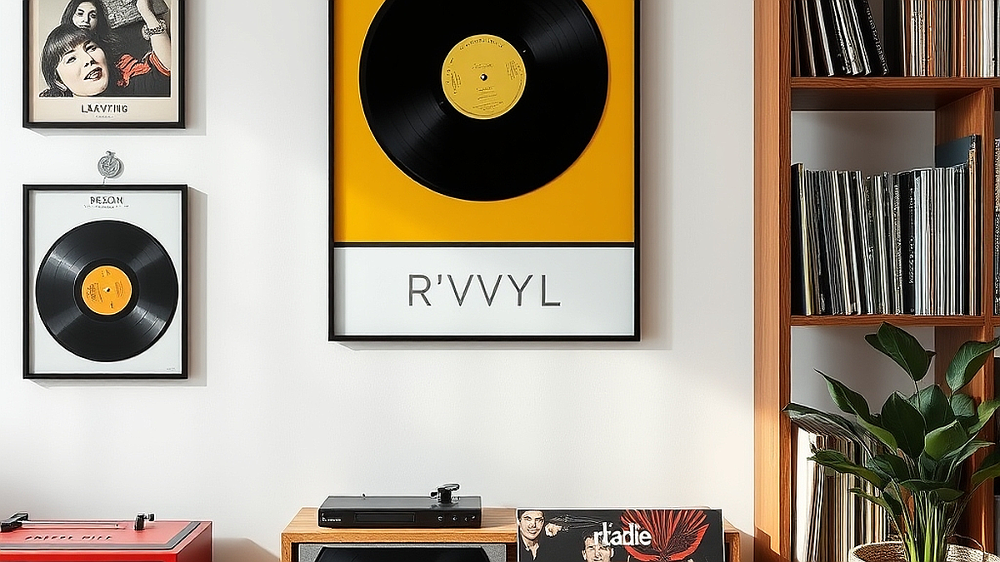

## 키덜트와 음악의 만남: '바이닐 앨범 아트'를 전시하는 법

바이닐 앨범 아트는 단순히 음악을 담는 패키지를 넘어, 그 자체로 한 명의 예술가가 완성한 하나의 작품입니다. 2026년 현재, 1인 가구의 주거 형태가 개인의 취향을 투영하는 전시 공간으로 진화하면서 바이닐을 '듣는 도구'에서 '보는 오브제'로 활용하는 방식이 홈스타일링의 핵심으로 떠올랐습니다. 좁은 원룸이나 오피스텔에 거주하며 제한된 예산으로 나만의 개성을 드러내고 싶은 분들에게, 바이닐은 가장 효율적이고 감각적인 인테리어 요소입니다. 하지만 무작정 벽에 붙이거나 쌓아두기만 한다면 자칫 방 전체가 어수선한 창고처럼 보일 위험이 큽니다. 이번 글에서는 음악적 취향을 공간에 녹여내면서도, 시각적 질서를 유지하는 구체적인 전시 전략을 다룹니다. 단순히 예쁜 액자를 사는 법이 아니라, 내 방의 면적과 조도, 그리고 음악적 맥락에 맞춰 앨범을 배치하는 실질적인 기준을 공유하겠습니다.

## 공간의 성격에 따른 바이닐 배치 전략

바이닐 전시는 공간의 여백과 조화가 핵심입니다. 1인 가구의 좁은 방이라면 수십 장의 바이닐을 한꺼번에 벽에 거는 방식은 피해야 합니다. 시각적 피로도가 급격히 높아지기 때문입니다. 대신, 특정 음악적 테마나 앨범의 색감을 기준으로 한두 장씩 교체하는 '큐레이션 방식'을 권장합니다.

공간을 활용할 때 가장 먼저 고려할 점은 '눈높이'입니다. 침대 옆 협탁이나 책상 위처럼 자주 머무는 곳의 시선이 닿는 높이에 앨범을 배치하세요. 이때 주의할 점은 직사광선입니다. 바이닐 자켓은 종이 재질이기에 강한 햇빛에 오래 노출되면 변색이 일어납니다. 창가에서 1미터 이상 떨어진 곳이 가장 적합합니다.

*   구체 예시: 미니멀한 화이트 톤의 방이라면, 채도가 높은 앨범 자켓 하나만 포인트로 걸어두고, 주변의 소품은 무채색으로 맞추는 것이 좋습니다.
*   실패 케이스: 앨범 자켓의 색상을 전혀 고려하지 않고 좋아하는 가수의 앨범을 무작위로 섞어서 배치하는 경우입니다. 시각적 소음이 발생해 방이 실제보다 더 좁아 보입니다.
*   선택 기준: 방의 가구 배치가 고정되어 있다면, 벽면을 훼손하지 않는 '와이어 액자 레일'이나 '투명 아크릴 선반'을 활용해 앨범을 쉽게 교체할 수 있는 구조를 만드세요. 시공이 어렵다면 무점착 접착 테이프를 이용한 거치대도 방법입니다.

## 실전 체크리스트: 음악적 맥락과 인테리어의 결합

바이닐을 전시할 때는 음악 장르와 공간의 분위기를 연결하는 과정이 필요합니다. 재즈나 클래식처럼 차분한 분위기를 원한다면 앨범 아트의 색감이 낮은 채도의 제품을 선택하고, 활기찬 분위기를 원한다면 그래픽이 강렬한 앨범을 전면에 배치하세요.

다음은 바이닐 전시를 시작하기 전 확인해야 할 실전 체크리스트입니다.

1.  공간의 조도 확인: 간접 조명을 앨범 자켓 아래에 배치할 수 있는가? (그림자가 생기면 앨범의 질감이 강조됩니다.)
2.  앨범 무게와 고정력: 벽지에 손상을 주지 않는 거치대를 사용하는가? (무거운 게이트폴드 앨범은 일반적인 테이프로 버티기 어렵습니다.)
3.  교체 주기 설정: 최소 2주에 한 번은 음악적 테마를 바꿔주는가? (전시는 박제되는 것이 아니라 생동감이 있어야 합니다.)
4.  음악과 인테리어의 조화: 현재 듣고 있는 음악의 분위기와 전시된 앨범 아트는 일치하는가? (시각과 청각의 불일치는 의외로 큰 스트레스를 줍니다.)

이 기준들을 충족하지 못한다면, 전시보다는 수납함에 넣어두고 필요할 때만 꺼내 보는 것이 공간 관리 측면에서 훨씬 유리합니다. 인테리어는 무언가를 더하는 것이 아니라, 불필요한 것을 덜어내는 과정임을 잊지 마세요.

## 지속 가능한 취향 소비를 위한 관리 포인트

바이닐을 단순히 소품으로만 사용하면 음악이라는 본질을 놓치기 쉽습니다. 앨범 아트를 전시하는 가장 큰 목적은 그 음악을 더 자주, 그리고 더 깊이 듣기 위함이어야 합니다. 전시 공간 근처에 턴테이블을 배치하고, '현재 재생 중'이라는 표시를 할 수 있는 작은 거치대를 함께 두는 것만으로도 공간의 의미가 달라집니다.

유지비와 관리 측면에서 보면, 바이닐은 습기에 매우 취약합니다. 여름철 장마 기간에는 제습기 근처에 두지 않도록 주의해야 하며, 앨범 자켓을 보호하기 위해 투명 비닐 커버를 씌우는 것은 필수입니다. 커버가 씌워진 상태에서도 충분히 훌륭한 전시 효과를 낼 수 있으므로, 보존과 전시의 균형을 맞추는 것이 중요합니다.

*   구체 예시: 턴테이블 옆에 3단 아크릴 선반을 설치하고, 맨 위에는 현재 듣고 있는 앨범, 아래 두 칸에는 다음 주에 들을 앨범을 정렬해두는 방식입니다.
*   실패 케이스: 앨범을 벽에 완전히 밀착시켜 붙이는 경우입니다. 통풍이 되지 않아 습기가 찰 수 있고, 나중에 앨범을 꺼낼 때 자켓 모서리가 손상될 위험이 큽니다.
*   선택 기준: 바이닐 수집량이 10장을 넘어간다면, 단순히 벽에 거는 것보다 앨범을 한눈에 볼 수 있는 매거진 랙 형태의 거치대를 사용하는 것이 관리 측면에서 훨씬 경제적입니다.

결론적으로 바이닐 앨범 아트를 전시한다는 것은 나만의 음악적 서사를 방이라는 공간에 기록하는 행위입니다. 수많은 굿즈와 소품이 넘쳐나는 시대에, 당신이 선택한 음악이 담긴 앨범 자켓은 그 어떤 인테리어 소품보다 강력한 정체성을 드러냅니다. 오늘 당장 책상 위나 선반 한 칸을 비우고, 가장 좋아하는 앨범 한 장을 올려두어 보세요. 음악이 흐르는 공간은 단순한 주거지를 넘어 당신의 취향이 숨 쉬는 아지트가 될 것입니다. 인테리어는 완성하는 것이 아니라, 당신의 변화하는 취향을 담아내며 함께 성장해가는 과정임을 기억하세요. 지금 바로 당신의 바이닐 컬렉션 중 가장 마음에 드는 아트워크를 골라, 공간의 중심에 두는 것부터 시작해 보시기 바랍니다.

## 마치며

바이닐 앨범 아트는 단순히 음악을 담는 도구를 넘어, 공간에 깊이 있는 감성을 더하고 당신의 음악적 취향을 투영하는 가장 개성 있는 인테리어 오브제입니다. 오늘 살펴본 것처럼, 올바른 보관법과 적절한 거치대를 활용한다면 당신의 소중한 컬렉션은 방 안에서 가장 빛나는 예술 작품이 될 것입니다. 

공간은 당신의 취향이 머무는 곳이자 성장하는 기록입니다. 너무 완벽하게 꾸미려 애쓰기보다는, 오늘 당장 가장 아끼는 앨범 한 장을 선반 위에 올려두는 것부터 시작해 보세요. 그 작은 변화만으로도 평범했던 일상이 좋아하는 음악이 흐르는 특별한 아지트로 변할 것입니다. 

여러분은 어떤 앨범의 아트를 가장 좋아하시나요? 오늘 바로 당신의 공간을 음악으로 채워보시길 바랍니다. 당신만의 감각으로 완성될 멋진 인테리어를 응원합니다!
