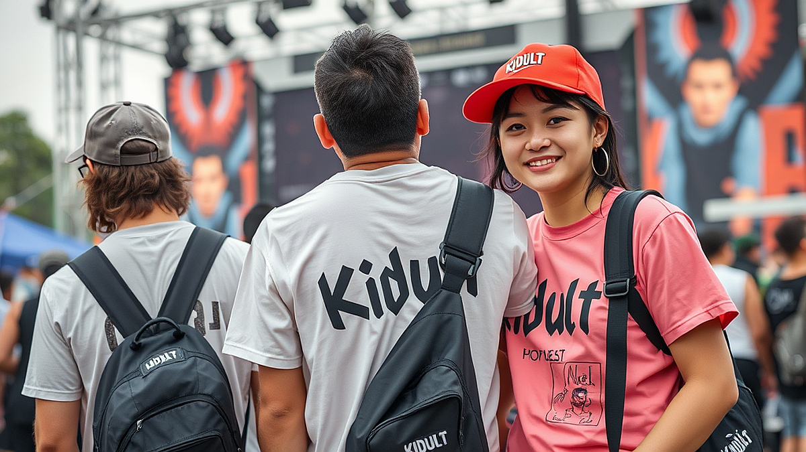

# 음악 페스티벌에서 만나는 키덜트 굿즈: 2026년 축제 현장의 마케팅 공식

음악 페스티벌은 단순히 좋아하는 아티스트의 공연을 보는 자리가 아닙니다. 이제는 그 공간 자체가 하나의 거대한 라이프스타일 큐레이션 현장이자, 키덜트 문화와 소비가 결합하는 최전선이 되었습니다. 2026년의 페스티벌 현장에서 브랜드들은 단순히 로고가 박힌 티셔츠를 파는 데 그치지 않습니다. 왜 사람들은 뙤약볕 아래서 몇 시간씩 줄을 서서 굿즈를 구매할까요? 그 이유는 그 굿즈가 공연의 기억을 박제하는 '물리적 매개체'이자, 자신의 취향을 증명하는 '키덜트적 수집 욕구'를 동시에 충족하기 때문입니다. 

필자는 매년 여름 페스티벌 현장에서 굿즈 부스를 관찰하며 마케터들이 어떻게 소비자들의 지갑을 여는지, 그리고 왜 어떤 굿즈는 완판되고 어떤 굿즈는 재고로 남는지 고민해 왔습니다. 이번 글에서는 음악 페스티벌이라는 특수한 공간에서 키덜트 소비자가 어떤 기준으로 굿즈를 선택하는지, 그리고 브랜드는 이들의 마음을 사로잡기 위해 어떤 마케팅 공식을 적용해야 하는지 구체적으로 짚어보려 합니다. 예산은 한정되어 있고, 짐은 늘리기 싫은 페스티벌 관람객의 입장에서, 무엇을 사야 후회하지 않고 무엇을 걸러야 하는지 그 실전 기준을 정리했습니다.

## 기능성을 넘어선 수집의 미학: 키덜트가 굿즈를 고르는 기준

키덜트 소비자는 단순히 귀여운 것을 사는 사람이 아닙니다. 이들은 '맥락'과 '서사'를 삽니다. 페스티벌 굿즈를 고를 때 가장 먼저 고려해야 할 것은 '실용성'이 아니라 '현장성'입니다. 

예를 들어, 페스티벌 현장에서 판매되는 한정판 피규어 키링을 생각해 봅시다. 이 키링은 공연장에서만 구할 수 있다는 희소성이 있습니다. 키덜트 소비자에게 이 키링은 단순히 가방에 다는 장식품이 아니라, '내가 2026년 그 여름의 페스티벌에 있었다'는 것을 증명하는 훈장과 같습니다. 

선택 기준은 명확합니다. 첫째, '일상에서 자연스럽게 녹아드는가'입니다. 페스티벌이 끝난 뒤 사무실 책상이나 평소 메는 가방에 두었을 때, 뜬금없는 디자인이라면 구매를 피해야 합니다. 둘째, '함께 즐기는 친구들과의 연대감이 담겨 있는가'입니다. 

실패하는 케이스는 대개 '브랜드 로고만 크게 박힌 범용 굿즈'입니다. 로고만 들어간 티셔츠나 모자는 페스티벌이 끝나면 잠옷으로 전락할 확률이 높습니다. 반면, 성공하는 굿즈는 캐릭터나 독특한 일러스트를 활용해 '무엇의 굿즈인지 모르는 사람이 봐도 예쁜' 디자인을 갖춘 경우입니다.

선택을 위한 체크 포인트는 다음과 같습니다.
1. 이 제품을 페스티벌이 끝난 뒤 6개월 후에도 사용할 것인가?
2. 굿즈를 구매하는 과정(대기 시간, 현장 이벤트 참여)이 페스티벌의 추억을 더 풍성하게 만드는가?
3. 가격이 공연 티켓 가격의 10%를 넘지 않는가? (과도한 지출 방지)

## 브랜드가 페스티벌에서 키덜트 취향을 저격하는 마케팅 공식

브랜드가 페스티벌 현장에서 키덜트 고객을 공략하는 방식은 크게 '경험 설계'와 '수집 욕구 자극'으로 나뉩니다. 마케터들은 고객이 부스에 머무는 시간을 늘리기 위해 게임 요소를 도입합니다. 

현장에서 자주 보이는 성공적인 마케팅은 '미션형 굿즈'입니다. 예를 들어, 부스 앞에서 특정 포즈로 사진을 찍어 SNS에 올리면 굿즈를 할인해주거나, 한정판 스티커를 증정하는 방식입니다. 이는 단순 구매를 넘어, 고객이 스스로 브랜드의 홍보 대사가 되게 만듭니다.

하지만 여기서 실패하는 케이스는 '참여 난이도가 너무 높은 경우'입니다. 페스티벌은 체력 소모가 큽니다. 줄을 서서 30분 이상 게임을 해야 굿즈를 살 수 있다면 대부분의 관객은 이탈합니다. 가장 효과적인 마케팅은 1분 내외로 끝나는 간단한 미션입니다.

마케팅 지표를 측정할 때 단순히 '굿즈 판매량'만 보지 마십시오. '부스 방문객 대비 구매 전환율'과 'SNS에 공유된 인증샷 수'를 함께 봐야 합니다. 만약 판매량은 높은데 SNS 인증이 없다면, 그 굿즈는 매력적인 콘텐츠가 아니라 단순한 생필품으로 소비된 것입니다. 

실전 마케팅 체크리스트:
- 부스 방문부터 구매까지 5분 이내인가?
- 굿즈를 구매했을 때 현장에서 바로 착용하거나 사용할 수 있는가?
- 온라인에서도 동일한 굿즈를 구매할 수 있는가? (현장 한정판이 아니라면 구매 매력이 급감함)

## 굿즈 소비를 통해 본 페스티벌의 지속 가능한 경험 설계

페스티벌 굿즈는 공연이 끝난 뒤에도 그 경험을 지속하게 만드는 '타임캡슐' 역할을 합니다. 키덜트 문화의 핵심은 '어른이 되어도 놓지 못하는 순수한 즐거움'입니다. 음악 페스티벌에서 굿즈를 구매하는 행위는, 바쁜 일상 속에서 잠시 잊고 지냈던 자신의 취향을 다시 확인하는 의식과 같습니다.

현장에서 굿즈를 고를 때 주의해야 할 점은 '분위기에 휩쓸린 충동구매'입니다. 페스티벌 현장은 음악과 조명으로 인해 평소보다 감성적인 상태가 되기 쉽습니다. 이럴 때일수록 '내가 이 굿즈를 어디에 둘 것인가'를 구체적으로 상상해야 합니다. 공간이 부족한 자취생이라면 부피가 큰 인형보다는 실용적인 문구류나 키링이 좋습니다. 반면, 수집을 즐기는 사람이라면 시리즈로 출시되는 굿즈의 첫 번째 버전을 확보하는 것이 유리합니다.

실패 사례는 '너무 많은 굿즈를 한꺼번에 구매하는 것'입니다. 페스티벌이 끝난 뒤 집에 돌아와 짐을 정리할 때, 정체불명의 굿즈가 쌓여 있으면 그 기억은 즐거움이 아닌 '처리해야 할 짐'으로 변합니다. 

현명한 소비를 위한 실전 팁:
- 예산 설정: 페스티벌 입장료의 최대 20%를 넘지 않게 예산을 잡으세요.
- 보관 공간: 집에 이미 비슷한 굿즈가 3개 이상 있다면 구매를 재고하세요.
- 목적성: 소장용인가, 실사용인가? 소장용이라면 포장 상태를 유지할 수 있는 공간이 확보되어 있는지 확인하세요.

음악 페스티벌은 1년에 몇 번 없는 특별한 경험입니다. 그 현장에서 구매하는 굿즈는 단순히 물건이 아니라, 당신이 그날 느꼈던 음악의 비트와 현장의 열기를 담은 기록물입니다. 키덜트적 감성으로 자신의 취향을 큐레이션 하되, 페스티벌이 끝난 뒤에도 당신의 일상을 긍정적으로 환기할 수 있는 물건을 선택하시기 바랍니다. 이제 다가오는 페스티벌 시즌, 부스 앞에 서기 전에 스스로에게 물어보세요. "이 굿즈가 내 방에서 6개월 뒤에도 빛을 발할 수 있을까?" 그 질문에 명확하게 답할 수 있다면, 그것은 당신의 취향을 완성할 최고의 페스티벌 굿즈가 될 것입니다. 오늘 정리한 기준을 바탕으로, 후회 없는 페스티벌 쇼핑을 즐겨보시길 바랍니다.

## 마치며

2026년의 음악 페스티벌은 단순한 공연 관람을 넘어, 우리의 취향을 수집하고 기록하는 특별한 공간이 될 것입니다. 오늘 살펴본 것처럼, 예산과 실용성, 그리고 나만의 기준을 명확히 세운다면 굿즈 쇼핑은 충동적인 소비가 아닌 ‘취향을 큐레이션하는 즐거운 과정’으로 바뀔 수 있습니다. 

단순히 유행을 따르기보다, 6개월 뒤 내 방에서 다시 보았을 때 그날의 비트와 열기가 생생하게 떠오를 수 있는 물건을 선택해 보세요. 여러분의 일상을 다채롭게 채워줄 최고의 굿즈를 만나는 것 또한 페스티벌을 즐기는 또 하나의 커다란 묘미가 될 것입니다.

자, 이제 곧 다가올 페스티벌 시즌을 위해 나만의 굿즈 구매 리스트를 점검해 보는 건 어떨까요? 이번 축제 현장에서는 후회 없는 선택으로 여러분의 소중한 추억을 완벽하게 간직해 보시길 바랍니다. 현장에서 마주할 여러분의 즐거운 취향을 진심으로 응원합니다!
