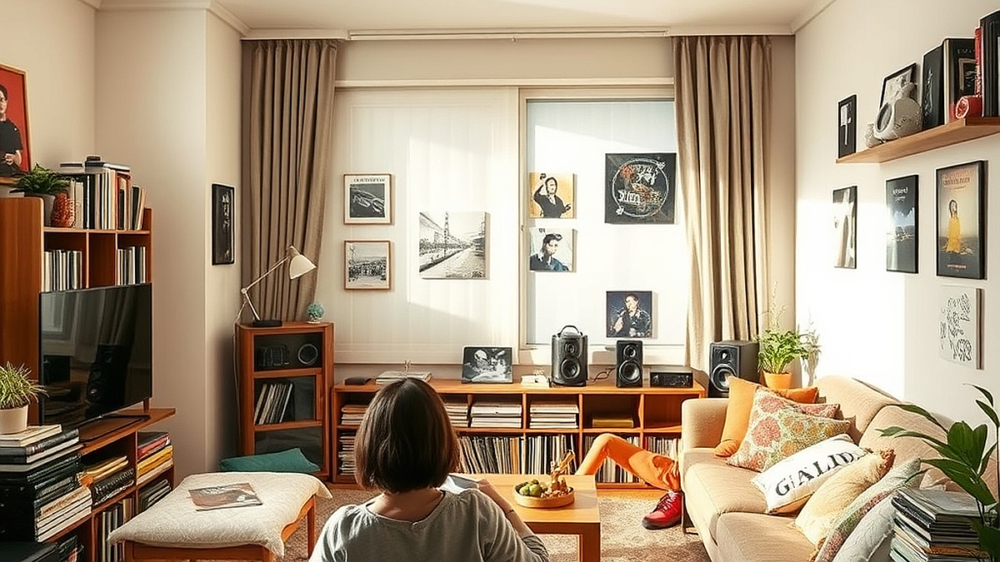

## 키덜트의 방이 된 거실, 인테리어와 음악이 만나는 '덕질 공간' 큐레이션

인테리어와 음악이 만나는 덕질 공간은 단순히 좋아하는 물건을 진열하는 것을 넘어, 나라는 사람의 취향이 집약된 하나의 소우주를 구축하는 과정입니다. 예전에는 거실이 손님을 맞이하거나 가족이 함께하는 공용 공간이라는 인식이 강했지만, 이제는 가장 개인적인 취향이 발현되는 '키덜트의 방'으로 변모하고 있습니다. 피규어, LP, 굿즈 같은 수집품들이 거실의 미관을 해친다는 고민은 사실 공간의 맥락을 고려하지 않은 배치에서 시작됩니다. 단순히 물건을 늘어놓는 것이 아니라, 음악이라는 청각적 요소와 인테리어라는 시각적 요소를 어떻게 결합하느냐에 따라 덕질 공간은 집 안의 골칫덩이가 아닌, 가장 몰입감 넘치는 안식처가 될 수 있습니다. 오늘은 10평 남짓한 거실을 내 취향의 박물관으로 바꾸면서도, 생활의 질을 떨어뜨리지 않는 구체적인 공간 기획법을 공유합니다.

## 수집품의 시각적 노이즈를 줄이는 레이아웃 전략

수집품이 많아질수록 공간이 좁아 보이고 어수선해지는 이유는 물건의 높낮이와 색상이 통일되지 않았기 때문입니다. 이를 해결하기 위해 가장 먼저 해야 할 일은 '시각적 노이즈'를 제거하는 것입니다.

실전 사례로, 저는 높이가 다른 피규어들을 일렬로 세우는 대신, 높낮이가 다른 아크릴 계단식 받침대를 사용해 수납했습니다. 이때 배경이 되는 벽면은 무채색 계열의 선반을 활용해 수집품의 색감이 튀어 보이지 않도록 중심을 잡았습니다. 반면, 실패 케이스는 모든 수집품을 한 번에 보여주기 위해 투명한 유리 장식장을 거실 한가운데 배치한 경우입니다. 이는 빛 반사와 복잡한 피사체들로 인해 거실 전체의 개방감을 완전히 차단합니다.

선택 기준은 명확합니다. 수집품의 총 부피가 거실 가구 면적의 20%를 넘지 않게 유지하는 것입니다. 만약 수집품이 이보다 많다면, 모든 것을 진열하려 하지 말고 2주 단위로 테마를 정해 순환 전시를 시도해 보세요. 

### 공간 구성 체크리스트
* 수납장 내부 조명(LED 스트립)을 활용해 전시장 같은 분위기를 연출했는가?
* 수집품의 크기순으로 배치하여 시선의 흐름을 일직선으로 만들었는가?
* 자주 사용하지 않는 굿즈는 불투명 수납함에 넣어 시각적 피로를 줄였는가?

## 음악적 몰입을 돕는 덕질 공간의 오디오 환경 설정

덕질은 눈으로 보는 행위만큼이나 귀로 듣는 경험이 중요합니다. 좋아하는 아티스트의 음악을 감상할 때, 스피커의 위치는 인테리어의 미학을 완성하는 마지막 퍼즐입니다. 많은 이들이 스피커를 단순히 장식장 위에 올려두지만, 이는 음향적으로나 시각적으로나 아쉬운 선택입니다.

구체적인 방법은 스피커를 수집품 진열대와 물리적으로 분리하는 것입니다. 스피커가 진열대 위에 있으면 진동이 수집품에 전달되어 미세한 소음을 유발하거나, 수집품이 스피커의 소리 파동을 방해하여 음질을 왜곡합니다. 저는 스피커 스탠드를 따로 배치하여 수집품과 청취 위치 사이의 삼각 구도를 형성했습니다. 실패 케이스는 스피커를 벽면에 바짝 붙여 설치하는 것입니다. 이는 저음이 벙벙거리는 부밍 현상을 유발해 음악의 선명도를 떨어뜨립니다.

음악적 몰입을 위한 선택 기준은 '스피커와 청취자의 정삼각형 배치'입니다. 거실의 폭이 좁다면 스피커를 살짝 안쪽으로 기울이는 '토인(Toe-in)' 조정을 통해 소리의 중심을 잡을 수 있습니다. 

### 오디오 환경 최적화 팁
* 스피커 하단에 방진 매트나 인슐레이터를 설치하여 진동을 차단했는가?
* 음악 장르에 맞춰 수집품의 위치를 조정하는 '큐레이션 플레이리스트'를 운영하는가?
* 케이블 정리를 위해 벨크로 타이나 케이블 덕트를 사용하여 지저분한 선을 숨겼는가?

## 취향과 생활의 조화를 위한 유지보수 루틴

공간 기획은 한 번의 배치로 끝나는 것이 아니라 지속적인 유지보수가 필요합니다. 특히 키덜트의 덕질 공간은 먼지와의 싸움이기도 합니다. 관리가 안 된 수집품은 인테리어의 품격을 떨어뜨리는 주범이 됩니다.

실전 팁으로, 저는 먼지 제거를 위한 전용 블로워와 극세사 붓을 덕질 공간 한편에 상시 배치했습니다. 또한, 3개월에 한 번씩 수집품의 위치를 바꾸는 '공간 재편성'을 수행합니다. 이는 단순히 청소를 위해서가 아니라, 익숙함에 매몰된 덕질 공간에 새로운 활력을 불어넣는 과정입니다. 실패 케이스는 관리가 불가능할 정도로 너무 많은 수집품을 빽빽하게 채워두는 것입니다. 먼지가 쌓여도 닦을 수 없는 구조는 결국 수집품을 망치고 공간의 가치를 훼손합니다.

선택 기준은 '접근성'입니다. 내가 가장 자주 들여다보는 물건은 손이 닿기 쉬운 높이(눈높이 아래 20cm 정도)에, 관리가 필요한 물건은 밀폐형 장식장에 두는 방식을 권장합니다.

### 유지관리 루틴 체크포인트
* 수집품 사이에 먼지가 쌓이지 않도록 틈새를 5cm 이상 확보했는가?
* 음악 감상 시 주변 조명을 낮출 수 있는 간접 조명을 설치했는가?
* 매달 한 번씩 수집품의 상태를 점검하고 위치를 변경하는가?

## 결론: 당신의 거실은 당신의 취향을 말해줍니다

키덜트의 공간은 단순히 물건을 모아두는 곳이 아니라, 당신이 어떤 음악을 사랑하고 어떤 미학적 기준을 가지고 있는지 보여주는 투영물입니다. 거실을 인테리어와 음악이 공존하는 덕질 공간으로 바꾸는 것은, 결국 나 자신의 내면을 정리하는 행위와 같습니다. 

오늘 제안한 전략들을 다시 정리해 봅시다. 첫째, 수납의 밀도를 조절하여 시각적 노이즈를 제거할 것. 둘째, 스피커와 수집품의 위치를 물리적으로 분리하여 몰입감을 극대화할 것. 셋째, 정기적인 관리 루틴을 통해 수집품과 공간의 생명력을 유지할 것. 

지금 바로 거실을 둘러보세요. 가장 소중한 수집품 하나를 정해 그 주변의 물건들을 비워보는 것부터 시작해도 좋습니다. 물건을 덜어내고 그 자리에 당신이 좋아하는 음악을 채워 넣는 순간, 당신의 거실은 평범한 휴식처에서 가장 완벽한 덕질의 성지로 변모할 것입니다. 당신의 취향이 머무는 공간이 더 깊고 풍성해지기를 응원합니다.

거실은 단순히 휴식을 위한 장소를 넘어, 나의 취향과 내면을 투영하는 가장 솔직한 공간입니다. 오늘 살펴본 것처럼, 수납의 밀도를 조절해 시각적 여유를 만들고, 스피커와 수집품의 배치를 최적화하는 것만으로도 거실은 품격 있는 '덕질 성지'로 탈바꿈할 수 있습니다. 공간을 정돈하는 것은 결국 나의 취향을 더 깊이 있게 다듬어가는 과정이기도 합니다.

이제 당신의 차례입니다. 오늘 당장 가장 아끼는 피규어나 앨범 하나를 골라보세요. 그 주변을 깨끗이 비우고, 그 자리에 당신이 가장 사랑하는 음악을 채워 넣는 것부터 시작해 보는 건 어떨까요? 불필요한 물건은 덜어내고, 오직 당신의 설렘으로 가득 찬 공간을 만들어보세요. 

당신의 취향이 머무는 거실이 일상 속 작은 위로이자 더 풍성한 영감의 원천이 되기를 진심으로 응원합니다. 오늘 당신의 거실은 어떤 음악으로 채워질까요?
