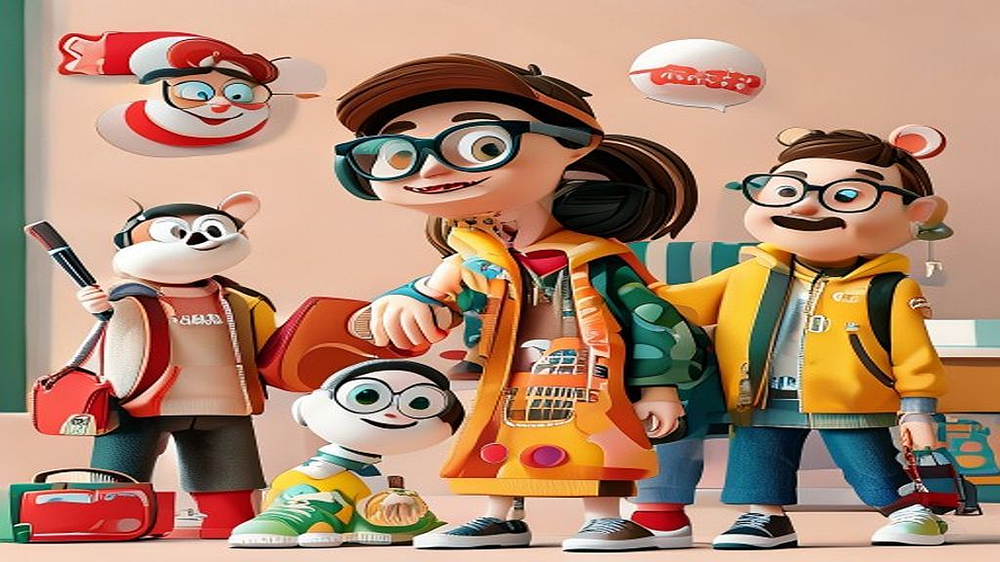

# 키덜트 마케팅의 진화: 왜 대기업들은 캐릭터 IP와 협업하는가?

키덜트 마케팅과 IP 비즈니스는 이제 단순한 장난감 판매를 넘어, 브랜드의 생존 전략이자 소비자의 정체성을 규정하는 핵심 도구가 되었습니다. 예전에는 캐릭터 상품이 아이들의 전유물로 여겨졌지만, 지금은 음악 차트 1위를 다투는 아티스트의 앨범 패키지에 캐릭터 피규어가 포함되고, 편의점 커피 컵에 낯익은 애니메이션 캐릭터가 인쇄되어야 비로소 '완성된 상품'으로 대우받는 시대입니다. 저는 매주 새로운 굿즈를 언박싱하고 음악 스트리밍 사이트의 차트를 분석하며, 왜 사람들이 수만 원을 호가하는 한정판 인형에 열광하고, 특정 브랜드의 콜라보레이션 소식에 새벽부터 줄을 서는지 그 심리를 관찰해 왔습니다.

독자 여러분이 이 글을 읽는 이유는 명확합니다. 내 지갑을 열게 만드는 이 화려한 마케팅의 원리를 알고, 단순히 유행에 휩쓸리는 소비자가 아니라 주도적으로 취향을 소비하고 싶기 때문일 것입니다. 마케팅 담당자라면 내 브랜드에 어떤 IP를 입혀야 할지 고민일 것이고, 일반 소비자라면 이 굿즈가 과연 소장 가치가 있는지 매번 갈등할 것입니다. 오늘 우리는 음악과 캐릭터, 그리고 브랜드가 만나는 지점에서 발생하는 '팬덤 경험'의 실체를 파헤치고, 여러분이 실질적인 소비 판단을 내릴 수 있는 구체적인 가이드를 확인해 보겠습니다.

## 음악과 캐릭터의 결합, 왜 지금인가?

음악은 감각적인 콘텐츠이고, 캐릭터는 시각적인 상징물입니다. 이 둘이 결합할 때 소비자는 '청각적 경험'을 '물질적 소유'로 치환하게 됩니다. 예를 들어, 지금 차트 1위를 달리는 곡의 분위기와 어울리는 커스텀 피규어가 포함된 한정판 패키지가 출시된다고 가정해 봅시다. 팬들에게 이것은 단순한 상품이 아니라, 그 곡을 들었던 순간의 감정을 박제해 두는 타임캡슐과 같습니다.

여기서 중요한 것은 '맥락'입니다. 무작정 인기 있는 캐릭터를 붙인다고 성공하는 것이 아닙니다. 음악의 장르, 아티스트의 세계관, 그리고 캐릭터가 가진 서사가 일치할 때 소비자는 지갑을 엽니다. 만약 힙합 음악에 지나치게 귀엽고 유아적인 캐릭터를 매칭하면 팬들은 괴리감을 느낍니다. 

*   **실제 사례:** 특정 아이돌 그룹이 곡의 컨셉에 맞춰 자체 제작한 캐릭터를 앨범 굿즈로 내놓았을 때, 판매량은 일반 앨범 대비 3배 이상 급증했습니다. 이는 캐릭터가 단순 장식이 아니라 '팬덤의 정체성'을 대변했기 때문입니다.
*   **실패 케이스:** 브랜드 인지도가 낮은 캐릭터와 대중적인 발라드 곡을 억지로 연결한 콜라보레이션은, 캐릭터의 인지도를 높이지도 못하고 음악의 감동만 반감시킨 채 재고로 남는 경우가 많습니다.
*   **선택 기준:** 해당 캐릭터가 음악의 가사나 아티스트의 이미지와 최소 3가지 이상의 공통 키워드(예: 몽환적, 레트로, 펑키)를 공유하는지 확인하세요. 이 교집합이 적다면 아무리 비싼 라이선스 비용을 지불해도 마케팅 효과는 미미합니다.

## 실전 체크리스트: 소장할 것인가, 패스할 것인가?

우리는 매일 수많은 콜라보레이션 제품을 마주합니다. 이때마다 '이걸 사야 하나?'라는 고민에 빠지곤 하죠. 공간은 한정되어 있고 예산은 정해져 있습니다. 무분별한 소비를 막기 위해 스스로에게 던져야 할 질문 리스트를 정리했습니다. 이 기준을 통과하지 못하는 굿즈는 시간이 지나면 결국 짐이 될 뿐입니다.

### 소비 결정 단계별 체크포인트
1.  **사용 목적:** 이 굿즈를 '전시'할 것인가, '실사용'할 것인가? 전시용이라면 패키지 디자인 자체가 미학적으로 완성도가 있는지, 실사용이라면 매일 만졌을 때 내구성이 보장되는지 확인하세요.
2.  **연결 고리:** 내가 이 음악을 즐겨 듣지 않게 되었을 때도 이 캐릭터를 보고 즐거움을 느낄 수 있는가? 만약 오직 '음악 차트 1위'라는 타이틀 때문에 구매하려 한다면, 그것은 소비가 아니라 감정적 충동일 확률이 높습니다.
3.  **유지 비용:** 피규어라면 먼지 제거를 위한 도구, 앨범이라면 보관을 위한 전용 케이스 등 추가적인 유지비와 공간 점유율을 계산해 보세요. 

많은 사람들이 실수하는 지점은 '한정판'이라는 단어에 매몰되는 것입니다. 한정판은 희소성이 있지만, 그것이 곧 당신의 만족을 보장하지는 않습니다. 내가 수집하는 컬렉션의 전체적인 테마와 어울리는지, 기존에 가지고 있는 물건들과 배치했을 때 시각적 조화를 이루는지 판단하는 과정이 필요합니다. 만약 좁은 자취방에 살고 있다면, 부피가 큰 대형 인형보다는 데스크테리어로 활용 가능한 소형 아크릴 스탠드나 키링 형태의 굿즈를 선택하는 것이 훨씬 현명합니다.

## 마케팅 담당자를 위한 전략적 실험 설계

기업 입장에서 캐릭터 IP와의 협업은 비용이 많이 드는 모험입니다. 단순히 캐릭터 이미지를 제품에 입히는 것으로는 부족합니다. 고객의 반응을 측정하고 다음 프로젝트에 반영하기 위해서는 구체적인 실험 지표가 필요합니다. 

*   **측정 지표:** 단순히 판매량만 보지 마세요. '인스타그램 인증샷 업로드 수', '굿즈 관련 커뮤니티 언급량', '음악 스트리밍 사이트 내 해당 곡의 재청취율'을 함께 분석해야 합니다. 굿즈 구매자가 실제 음악의 소비자로 이어졌는지 확인하는 것이 마케팅의 핵심입니다.
*   **실패했을 때 점검 순서:** 
    1. 타겟 고객의 나이대와 캐릭터의 주 소비층이 일치하는가?
    2. 가격 책정이 팬덤의 구매력을 고려했을 때 심리적 마지노선을 넘지 않았는가?
    3. 제품의 품질이 팬들이 기대하는 퀄리티를 충족하는가?
    
대부분의 실패는 '팬들이라면 무조건 살 것'이라는 안일한 가정에서 시작됩니다. 팬덤은 가장 충성도가 높지만, 동시에 가장 냉정한 소비자입니다. 그들은 브랜드가 자신들의 문화를 얼마나 깊이 이해하고 있는지 굿즈의 디테일에서 찾아냅니다. 예를 들어, 음악의 가사 한 구절을 캐릭터의 액세서리로 활용하는 식의 '디테일한 서사'를 심어두는 것이 훨씬 효과적입니다.

결론적으로 키덜트 마케팅의 진화는 '소유'에서 '경험'으로의 이동을 의미합니다. 단순히 캐릭터가 그려진 물건을 갖는 것이 아니라, 그 캐릭터가 내 음악 취향과 일상을 어떻게 연결해 주는지에 대한 서사가 중요합니다. 이제 여러분은 단순히 유행하는 굿즈를 사는 사람이 아니라, 자신의 취향을 명확히 알고 전략적으로 선택하는 소비자가 되어야 합니다. 오늘 당장 여러분의 책상을 둘러보고, 정말로 여러분의 취향을 대변하는 굿즈가 무엇인지, 혹은 브랜드라면 어떤 IP가 고객의 일상에 녹아들 수 있을지 다시 한번 고민해 보시길 바랍니다. 현명한 선택이 곧 당신의 라이프스타일을 완성합니다.

## 마치며

키덜트 마케팅은 단순히 어린 시절의 향수를 자극하는 것을 넘어, 이제는 개인의 취향과 서사를 완성하는 중요한 라이프스타일 전략이 되었습니다. 단순히 캐릭터가 그려진 굿즈를 소유하는 것에서 벗어나, 그 안에 담긴 디테일한 의미와 브랜드가 전달하는 경험적 가치를 읽어내는 안목이 필요합니다. 팬덤은 브랜드의 진정성을 꿰뚫어 보는 가장 냉정한 소비자인 만큼, 기업은 깊이 있는 서사를 구축하고, 소비자는 자신의 취향을 투영할 수 있는 가치 있는 대상을 선택해야 합니다.

오늘, 여러분의 책상 위를 한번 살펴볼까요? 그곳에 놓인 물건들은 여러분의 취향을 얼마나 대변하고 있나요? 브랜드라면 고객의 일상에 자연스럽게 스며들 수 있는 IP 전략을, 소비자라면 자신의 삶을 더욱 풍성하게 만들어줄 가치 있는 굿즈를 고민해 보시길 바랍니다. 현명한 선택이 모여 결국 여러분만의 독보적인 라이프스타일을 완성할 것입니다. 오늘부터 여러분의 일상에 작은 취향의 조각들을 더해보는 건 어떨까요?
