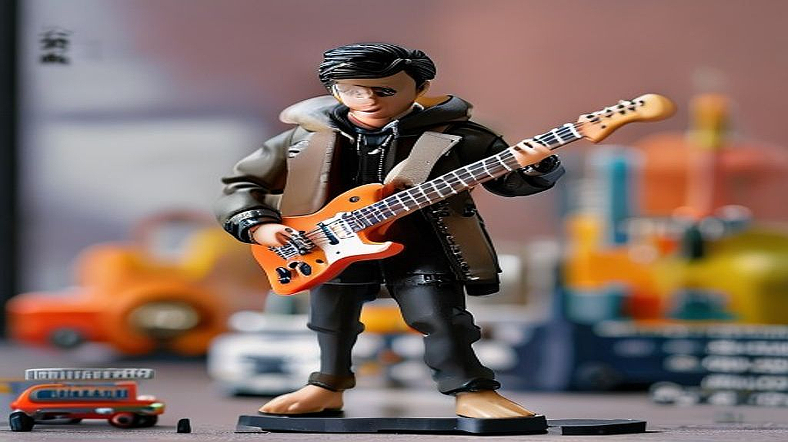

## 키덜트와 음악의 만남: 2026년형 한정판 뮤지션 피규어 컬렉션

아티스트 굿즈와 피규어, 그리고 팬덤 마케팅이 결합한 새로운 형태의 소장품 시장이 열리고 있습니다. 단순히 음악을 듣는 시대를 넘어, 내가 사랑하는 뮤지션의 정체성을 입체적으로 소유하려는 욕구는 이제 키덜트 문화의 핵심 영역으로 자리 잡았습니다. 2026년형 한정판 뮤지션 피규어 컬렉션은 단순한 플라스틱 인형이 아닙니다. 이것은 특정 시기 아티스트가 전하고자 했던 메시지, 무대 위의 조명, 그리고 팬들이 공유했던 기억을 물리적 공간에 박제하는 행위입니다.

최근의 시장 흐름을 보면, 단순히 로고가 박힌 티셔츠나 포토카드에서 벗어나 아티스트의 음악적 색깔을 조형적으로 해석한 아트 토이 형태가 주목받고 있습니다. 하지만 이런 프리미엄 굿즈는 가격대가 높고 공간을 많이 차지한다는 점에서 신중한 접근이 필요합니다. 오늘 글에서는 한정판 피규어를 구매하기 전, 여러분이 반드시 고민해야 할 실용적인 판단 기준과 수집의 늪에 빠지지 않기 위한 체크리스트를 정리해 드립니다. 지금 바로 내 방의 전시 공간과 예산을 점검하고, 정말 나에게 필요한 가치인지 확인해 봅시다.

## 소장 가치를 결정하는 3가지 핵심 판단 기준

뮤지션 피규어를 선택할 때 가장 먼저 고려해야 할 것은 '음악적 정체성의 투영도'입니다. 피규어는 단순히 얼굴이 닮았다고 해서 가치가 생기지 않습니다. 아티스트가 특정 앨범에서 보여준 복장, 당시의 시그니처 포즈, 혹은 음악의 질감을 표현한 디테일이 살아있는지가 핵심입니다.

첫 번째 기준은 **공간 점유 대비 만족도**입니다. 피규어는 보통 15cm에서 30cm 사이의 크기로 제작되는데, 이를 진열할 장식장이 없다면 구매 후 박스 안에 방치될 확률이 90% 이상입니다. 두 번째는 **재질의 지속성**입니다. PVC 소재는 시간이 지나면 유분기가 올라오거나 변색이 일어날 수 있습니다. 따라서 도색 마감 상태가 좋고, 자외선 차단이 가능한 케이스를 따로 구매할 예산이 있는지 계산해야 합니다. 세 번째는 **팬덤 내 순환 가치**입니다. 나중에 되팔 생각이 없더라도, 해당 모델이 '한정판'이라는 명목하에 지나치게 높은 가격으로 책정되어 있지는 않은지, 비슷한 퀄리티의 제품군과 비교했을 때 합리적인지 따져봐야 합니다.

구체적인 예시로, 특정 아티스트의 월드 투어 기념 피규어는 무대 의상의 디테일이 화려하지만, 관절 가동 범위가 좁아 전시 외에는 활용도가 낮습니다. 반면, 앨범 아트워크를 형상화한 스태츄 형태는 관절은 없지만 인테리어 오브제로서의 가치가 높습니다.

실패하는 케이스는 '충동적인 팬심'에 기반한 구매입니다. 아티스트의 활동 기간이 끝나고 나면 해당 피규어에 대한 애정이 급격히 식는 경우가 많습니다. 이때는 피규어를 처분하기도 어렵고, 공간만 차지하는 '애물단지'가 됩니다. 그러므로 구매 전에는 반드시 '내가 1년 뒤에도 이 피규어를 보며 그 시절의 음악을 떠올릴 것인가?'라는 질문을 스스로에게 던져보세요.

## 실전 체크리스트: 수집과 소비의 경계에서

본격적으로 수집을 시작하기 전, 여러분의 상황을 점검할 수 있는 체크리스트를 준비했습니다. 이 항목 중 3개 이상 해당하지 않는다면, 구매를 잠시 미루는 것이 좋습니다.

* 1. 30cm x 30cm 이상의 독립된 전시 공간을 확보했는가?
* 2. 피규어의 재질을 관리할 수 있는 습도 조절 환경(제습기나 장식장)을 갖추었는가?
* 3. 구매 비용이 월 가처분 소득의 10%를 넘지 않는가?
* 4. 피규어의 디자인이 음악적 취향을 넘어 인테리어 소품으로서도 만족스러운가?
* 5. 추후 처분 시 중고 거래 플랫폼의 시세 변동성을 이해하고 있는가?

이 체크리스트는 단순히 구매를 말리는 것이 아니라, 여러분의 소중한 자산과 공간을 보호하기 위한 장치입니다. 특히 2026년형 제품들은 더욱 정교해진 도색 기술을 자랑하지만, 그만큼 관리 난이도가 높습니다. 예를 들어, 무광 코팅된 피규어는 먼지가 앉으면 닦아내기 매우 어렵습니다. 붓이나 에어 블로어를 따로 구비해야 하는 번거로움이 있죠.

수집을 시작할 때는 무작정 전체를 구매하기보다, 가장 상징적인 '시그니처 모델' 하나만 먼저 구매해 보세요. 그것을 한 달 동안 책상 위에 두고 보면서 자신의 감정 변화를 관찰하는 것입니다. 만약 그 피규어를 볼 때마다 스트레스가 풀리고 음악을 다시 듣고 싶어진다면, 그때 본격적인 컬렉션을 시작해도 늦지 않습니다. 반대로 그저 '굿즈를 샀다'는 사실에만 만족한다면, 그것은 소유가 아니라 소비의 늪에 빠진 것입니다.

## 마케팅 관점에서 본 팬덤의 정서적 가치

기업은 왜 뮤지션 피규어를 만들까요? 이는 단순한 굿즈 판매를 넘어 팬덤의 '충성도'를 물리적 형태로 묶어두기 위함입니다. 팬덤 마케팅의 핵심은 '공유된 경험'을 시각화하는 것입니다. 피규어는 팬들에게 아티스트와의 연결고리를 강화해주며, 방 한구석에 자리 잡은 피규어는 매일 아티스트를 상기시키는 '브랜드 앰배서더' 역할을 수행합니다.

이러한 마케팅 효과를 측정하는 지표는 크게 두 가지입니다. 첫째는 **구매 후 재방문율**입니다. 피규어를 구매한 고객이 해당 아티스트의 다음 앨범이나 콘서트 티켓을 구매할 확률이 일반 팬보다 월등히 높다는 데이터가 존재합니다. 둘째는 **커뮤니티 내 확산력**입니다. 피규어를 전시한 사진이 SNS를 통해 공유되면서, 이는 곧 아티스트의 브랜딩 이미지를 고급화하는 효과를 낳습니다.

실패하는 마케팅 케이스는 아티스트의 정체성과 무관한 '공장형 디자인'을 입히는 경우입니다. 캐릭터의 얼굴만 아티스트로 바꾼 피규어는 팬들에게 외면받습니다. 팬들은 아티스트의 '서사'를 소비하고 싶어 하지, 단순히 로고가 박힌 인형을 원하지 않기 때문입니다. 성공적인 사례는 아티스트가 직접 디자인에 참여하거나, 특정 앨범의 비하인드 스토리가 담긴 소품을 피규어와 함께 구성한 경우입니다.

선택 기준을 정리하자면, 마케팅에 휘둘리지 않기 위해서는 '굿즈의 서사'를 읽어야 합니다. 이 피규어가 왜 만들어졌는지, 어떤 음악적 순간을 기념하는지 설명할 수 있는 제품인가를 확인하세요. 만약 설명이 부족하고 가격만 비싸다면, 그것은 당신의 팬심을 이용한 상업적 시도일 가능성이 높습니다.

## 결론: 취향을 소장하는 현명한 방법

음악은 흐르고 사라지지만, 피규어는 남아서 그 시간을 기억하게 합니다. 2026년형 한정판 뮤지션 피규어 컬렉션은 여러분의 공간에 음악적 감성을 더할 수 있는 훌륭한 매개체가 될 수 있습니다. 하지만 앞서 언급했듯, 이는 공간과 예산, 그리고 관리에 대한 책임이 따르는 취미입니다. 

단순히 굿즈를 모으는 것 자체에 집중하기보다, 여러분이 진정으로 아끼는 아티스트의 음악적 궤적을 어떻게 소장하고 싶은지 고민해 보시기 바랍니다. 오늘 제시해 드린 3가지 판단 기준과 체크리스트를 활용해, 여러분의 컬렉션이 단순한 물건의 집합이 아닌, 여러분의 취향을 증명하는 소중한 자산이 되기를 바랍니다. 지금 바로 여러분의 방을 둘러보고, 어떤 피규어가 그 자리에 놓였을 때 가장 어울릴지 상상해 보세요. 그 상상이 현실이 되었을 때, 여러분은 단순한 팬을 넘어 진정한 '컬렉터'로서 아티스트와 더 깊은 정서적 교감을 나누게 될 것입니다. 현명한 소비는 결국 자신의 취향을 명확히 아는 것에서 시작됩니다. 이제 여러분만의 컬렉션을 완성할 준비가 되셨나요?

2026년형 한정판 뮤지션 피규어 컬렉션은 단순한 소장품을 넘어, 여러분이 사랑하는 아티스트의 음악적 발자취를 곁에 두는 특별한 예술적 경험입니다. 오늘 살펴본 세 가지 판단 기준을 통해, 여러분의 공간이 더욱 깊이 있는 취향으로 채워지길 바랍니다. 무분별한 수집보다는 본인의 예산과 공간, 그리고 아티스트를 향한 진심 어린 애정을 먼저 고려해 보세요.

현명한 컬렉터가 되는 첫걸음은 자신의 취향을 명확히 아는 것에서 시작됩니다. 지금 바로 여러분의 책상이나 선반 위를 찬찬히 둘러보며, 어떤 피규어가 그곳에 놓였을 때 가장 빛날지 상상해 보세요. 그 상상이 현실이 되는 순간, 피규어는 단순한 굿즈를 넘어 여러분의 삶에 음악적 영감을 불어넣는 소중한 자산이 될 것입니다.

오늘의 가이드가 여러분의 컬렉팅 여정에 작지만 확실한 나침반이 되었기를 바랍니다. 여러분의 공간을 아티스트의 선율로 가득 채울 준비가 되셨나요? 지금 바로 여러분만의 독보적인 컬렉션을 완성해 보세요!
