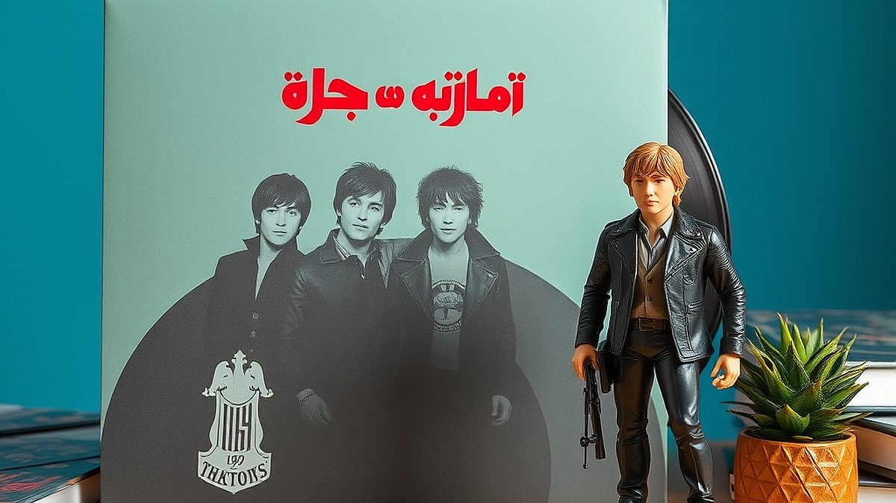

# 키덜트와 음악의 만남: 한정판 LP와 피규어 패키지의 경제학

한정판 LP와 피규어 패키지는 단순히 음악을 듣거나 장난감을 모으는 행위를 넘어, 팬덤의 서사와 개인의 취향을 결합한 고도의 문화적 경험입니다. 최근 음악 시장에서는 단순히 음반만을 판매하는 것이 아니라, 아티스트의 세계관을 입체적으로 구현한 피규어, 아트워크 북, 한정판 굿즈를 패키지로 묶어 소장 가치를 극대화하는 전략이 주류로 자리 잡았습니다. 저 또한 처음에는 단순히 좋아하는 가수의 음악을 소장하기 위해 LP를 구매했지만, 어느덧 피규어와 패키지 구성품이 주는 시각적 만족감이 음악적 경험을 얼마나 확장하는지 깨닫게 되었습니다. 하지만 이런 수집의 세계는 화려한 외관만큼이나 냉정한 판단력을 요구합니다. 무작정 '한정판'이라는 단어에 매몰되어 구매 버튼을 누르다 보면, 내 방 한구석은 감당하기 어려운 짐으로 가득 차기 십상입니다. 오늘은 키덜트 컬렉터이자 음악 애호가로서, 한정판 패키지를 구매할 때 반드시 고려해야 할 가치와 리셀 시장의 함정, 그리고 실패 없는 소비를 위한 실전 기준을 정리해 드립니다.

## 소장 가치를 결정짓는 패키지 구성의 핵심 조건

한정판 패키지를 구매할 때 가장 먼저 확인해야 할 것은 '구성품의 유기적 연결성'입니다. 단순히 음반에 피규어를 하나 끼워 넣었다고 해서 가치가 생기는 것이 아닙니다. 음악적 서사가 피규어의 조형이나 패키지의 디자인에 얼마나 깊숙이 녹아들어 있는지가 관건입니다. 예를 들어, 특정 앨범의 콘셉트가 미래지향적인 사이버펑크라면, 그에 걸맞은 질감의 피규어와 한정판 LP의 컬러 베리에이션이 조화를 이루어야 합니다. 단순히 앨범 자켓을 피규어화한 제품은 시간이 지나면 시각적 피로감을 주지만, 앨범의 수록곡과 연계된 디테일이 숨어 있는 패키지는 볼 때마다 새로운 발견을 선사합니다.

실패 사례를 하나 들어보겠습니다. 초보 컬렉터 시절, 아티스트의 인기만을 믿고 구성품이 조잡한 한정판 박스 세트를 예약 구매한 적이 있습니다. 알고 보니 피규어의 마감은 엉성했고, LP의 음질보다 박스의 부피만 커서 보관 공간을 지나치게 차지했습니다. 결과적으로 그 패키지는 며칠 보지 않고 창고로 들어갔습니다. 이런 실수를 피하기 위해서는 '공간 점유율 대비 만족도'를 따져야 합니다. 한정판 패키지는 일반 음반보다 최소 3배 이상의 부피를 차지합니다. 내가 이 패키지를 당당하게 전시할 공간이 있는지, 아니면 단순히 박스째로 쌓아둘 것인지 먼저 자문해야 합니다.

선택 기준은 간단합니다. 첫째, 피규어가 단순 사은품이 아닌 '아트 토이' 수준의 퀄리티를 갖췄는가? 둘째, 패키지를 해체했을 때 각각의 구성품이 인테리어 오브제로 기능할 수 있는가? 이 두 가지 질문에 '예'라고 답할 수 있을 때만 구매를 결정하십시오.

## 리셀 시장의 환상과 현실: 투기가 아닌 소장을 위한 태도

많은 사람이 한정판을 구매하며 '나중에 가격이 오르면 팔아야지'라는 생각을 가집니다. 하지만 리셀 시장은 생각보다 훨씬 변덕스럽고 잔인합니다. 음악 애호가로서 냉정하게 말하자면, 리셀 시장에서 가격이 유지되는 경우는 극히 드뭅니다. 대부분의 한정판은 발매 직후 수요가 몰려 가격이 상승하지만, 시간이 지나면 소장 가치가 있는 핵심 제품군을 제외하고는 정가 이하로 떨어지거나 거래 자체가 끊깁니다. 리셀을 목적으로 구매하는 것은 수집의 즐거움을 해칠 뿐만 아니라, 경제적 리스크를 본인이 오롯이 짊어지는 행위입니다.

리셀 시장의 흐름을 읽는 방법은 간단합니다. 해당 아티스트의 팬덤이 얼마나 지속 가능하게 유지되는지, 그리고 이번 한정판이 아티스트의 커리어에서 어떤 위치(예: 정규 앨범, 기념비적 라이브)를 차지하는지 확인하십시오. 인기가 일시적인 유행에 그친다면, 아무리 한정판이라도 2차 시장에서는 외면받습니다. 반면, 아티스트가 꾸준히 음악적 입지를 다져왔다면 그 가치는 시간이 흐를수록 완만하게 상승합니다. 

실패하기 쉬운 부분은 바로 '한정판 수량'에 대한 맹신입니다. 5,000장 한정이라고 해서 무조건 희소성이 있는 것이 아닙니다. 5,000명을 만족시킬 만큼의 퀄리티가 없다면 그 수량은 오히려 재고가 되어 시장에 풀립니다. 따라서 리셀 시장에서의 수익성을 기대하기보다는, 내가 이 물건을 5년 뒤에도 내 책상 위에 올려두고 행복해할 수 있는지를 기준으로 삼으십시오. 

## 실전 체크리스트: 한정판 구매 전 반드시 확인해야 할 5가지

이제 본격적으로 구매 버튼을 누르기 전, 스스로 점검해야 할 리스트를 소개합니다. 이 리스트는 제가 지난 5년간 수집 활동을 하며 얻은 가장 실용적인 기준입니다.

### 실전 체크리스트
1. **공간 확보:** 패키지 크기가 기존 보관함에 들어가는가? (최소 가로 30cm 이상 확보 필수)
2. **유지비 고려:** LP는 관리가 필요합니다. 턴테이블, 정전기 방지 브러시, 보호 비닐 구매 비용을 예산에 포함했는가?
3. **콘텐츠 경험:** 피규어를 제외한 음반 자체의 음악적 가치가 내 취향과 맞는가?
4. **리셀 가능성 배제:** 만약 이 물건이 내일 가격이 0원이 되어도 나는 이 패키지를 소장할 것인가?
5. **예산 우선순위:** 이번 달 생활비를 쪼개서 구매하는 것은 아닌가? (수집은 여유 자금으로 할 때 가장 즐겁습니다)

이 중에서 가장 중요한 것은 4번입니다. 수집은 타인의 욕망을 따라가는 것이 아니라 내 취향을 채우는 과정입니다. 만약 5번 조건에 걸린다면, 과감히 구매를 포기하고 그 돈으로 공연을 한 번 더 보거나 더 좋은 음향 기기를 갖추는 것이 음악적 경험을 깊게 만드는 데 훨씬 유리합니다.

### 피해야 할 경우
- 아티스트의 음악보다는 '희귀성'이라는 단어에 꽂혀서 구매하려는 경우.
- 피규어 제작사가 과거에 낮은 마감 품질로 악명이 높았던 경우.
- 패키지 크기가 너무 커서 일상적인 생활 공간(책상, 선반)을 심각하게 침해하는 경우.

결론적으로, 한정판 LP와 피규어 패키지는 여러분의 공간을 음악과 예술로 채우는 훌륭한 도구입니다. 하지만 그 도구가 여러분의 삶을 압도하게 두어서는 안 됩니다. 소유의 양보다는 소유의 질을, 리셀 차익보다는 그 물건이 나에게 주는 정서적 만족감을 우선순위에 두십시오. 지금 당장 여러분의 방을 둘러보고, 이 한정판 패키지가 정말 여러분의 공간에 어울릴지 상상해 보십시오. 만약 그 상상 속에서 미소가 지어진다면, 그것은 여러분의 소중한 컬렉션이 될 자격이 충분합니다. 이제는 수집가로서 자신의 취향을 확고히 하고, 더 현명하고 즐거운 덕질 라이프를 시작해 보시기 바랍니다. 수집은 끝이 아니라, 여러분의 취향을 완성해가는 긴 여정임을 잊지 마십시오.

## 마치며

한정판 LP와 피규어 패키지는 단순한 상품을 넘어, 음악과 예술을 공간 속에 구현하는 특별한 경험입니다. 하지만 희귀성이라는 유혹에 휩쓸려 충동적으로 수집하기보다는, 자신의 취향과 공간의 조화를 먼저 고려하는 현명한 안목이 필요합니다. 리셀의 수익성보다 물건이 주는 정서적 만족감에 집중할 때, 비로소 수집은 삶을 풍요롭게 채우는 가치 있는 여정이 됩니다.

이제는 여러분의 방을 천천히 둘러보며 이 패키지가 줄 기쁨을 상상해보세요. 그 상상 속에 미소가 번진다면, 그것은 여러분의 소중한 컬렉션이 될 충분한 자격이 있습니다. 소유의 양보다는 질에 집중하며, 오늘부터 여러분만의 확고한 취향을 담은 즐거운 ‘덕질’을 시작해보는 건 어떨까요? 수집은 끝이 아니라, 여러분의 취향을 완성해 나가는 긴 여정입니다. 여러분의 소중한 공간이 좋아하는 음악과 피규어로 가득 차, 매일이 설레는 일상이 되길 진심으로 응원합니다.
