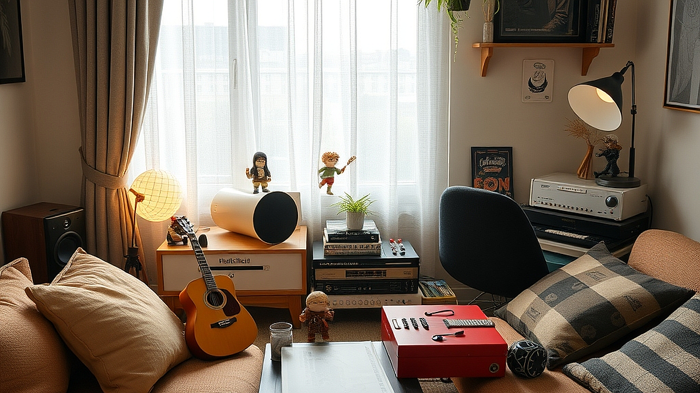

## 나만의 '키덜트' 공간 꾸미기: 음악과 피규어의 조화로운 배치

나만의 키덜트 공간을 꾸미는 일은 단순히 피규어를 진열하는 것을 넘어, 좋아하는 음악과 수집품이 조화를 이루는 안식처를 만드는 과정입니다. 퇴근 후 책상 앞에 앉았을 때, 내가 아끼는 캐릭터들이 시야에 들어오고 평소 즐겨 듣는 음악이 공간을 채우는 경험은 일상의 스트레스를 해소하는 강력한 수단이 됩니다. 하지만 수집품이 늘어날수록 공간은 금세 포화 상태가 되고, 정돈되지 않은 피규어들은 인테리어의 장점이 아닌 시각적 소음이 되기 십상입니다.

이 글에서는 좁은 데스크테리어 환경에서도 음악적 취향과 수집 욕구를 효율적으로 공존시키는 노하우를 다룹니다. 특히 1인 가구의 한정된 공간이나 이미 수집품으로 가득 찬 책상을 정리하고 싶은 분들을 위해, 값비싼 가구 교체 없이도 지금 당장 적용할 수 있는 구체적인 배치 기준과 공간 활용법을 제시합니다. 인테리어의 핵심은 '얼마나 많은 물건을 가지고 있느냐'가 아니라 '어떻게 물건 사이의 여백을 확보하느냐'에 있습니다. 이제부터 효율적인 배치 전략을 통해 당신만의 몰입감 넘치는 공간을 완성해보겠습니다.

## 시각적 소음을 줄이는 높낮이 배치와 여백의 미학

피규어를 배치할 때 가장 흔히 저지르는 실수는 평면적인 나열입니다. 모든 피규어를 책상 위에 일렬로 세워두면 시선이 분산되어 각각의 매력이 반감됩니다. 이를 방지하기 위해서는 '높낮이'를 활용한 입체적인 배치가 필수입니다. 

높낮이를 조절할 때는 시선의 높이를 고려해야 합니다. 앉았을 때 눈높이보다 약간 낮은 곳에 가장 아끼는 피규어를 배치하고, 주변부로 갈수록 크기가 작거나 덜 중요한 아이템을 배치하는 것이 좋습니다. 이때 다이소 등에서 쉽게 구할 수 있는 아크릴 계단식 진열대를 활용하면 공간을 수직으로 확장할 수 있습니다. 

* **선택 기준**: 책상 깊이가 60cm 이하인 경우, 가로로 긴 진열대보다는 수직형 계단 진열대를 선택하십시오. 시야를 덜 차지하면서도 수납 효율은 두 배 이상 높아집니다.
* **실패 케이스**: 모든 피규어를 비슷한 크기 순으로 일렬로 세우는 경우입니다. 이는 박물관의 창고처럼 보일 뿐, 공간의 생동감을 떨어뜨립니다.
* **구체적 예시**: 15cm 크기의 피규어 3개를 배치한다면, 가운데는 5cm 높이의 받침대를 두고 양옆은 바닥에 두어 삼각형 구도를 만듭니다. 이 작은 높이 차이만으로도 시선이 머무는 곳이 명확해집니다.

## 청각과 시각의 동기화: 음악이 흐르는 공간 구성

음악은 공간의 분위기를 결정짓는 가장 중요한 요소입니다. 피규어와 스피커를 배치할 때 주의할 점은 '진동'과 '간섭'입니다. 스피커의 위치가 피규어와 너무 가까우면 음악의 저음역대가 피규어에 미세한 진동을 전달하여 장기적으로는 도색 변형이나 낙하의 위험을 초래할 수 있습니다.

스피커는 피규어 진열대보다 약간 앞쪽이나 양옆으로 배치하여 음악이 공간 전체에 골고루 퍼지도록 하세요. 특히 데스크테리어 환경에서는 스피커 스탠드를 활용해 스피커의 트위터(고음부)가 귀 높이와 일치하게 맞추는 것만으로도 소리의 선명도가 달라집니다. 음악을 들으며 피규어를 감상할 때는 시각적 요소와 청각적 요소가 분리되지 않도록 스피커 주변에 너무 많은 피규어를 두지 않는 것이 좋습니다.

* **선택 기준**: 책상 공간이 좁다면 스피커를 벽에 거치하거나 모니터 암 뒤쪽 공간을 활용하여 피규어 진열 공간과 청취 공간을 20cm 이상 격리하십시오.
* **실패 케이스**: 스피커 바로 옆에 가벼운 피규어를 배치하는 경우입니다. 볼륨을 높일 때마다 피규어가 미세하게 움직이거나 소리가 스피커 몸체에 부딪혀 왜곡될 수 있습니다.
* **구체적 예시**: 스피커 사이에 턴테이블이나 소형 앰프를 두고, 그 위쪽 벽면에 선반을 설치해 피규어를 전시하면 음악 장비와 수집품이 자연스럽게 어우러지는 '뮤직 스튜디오' 느낌을 줄 수 있습니다.

## 실전 체크리스트: 정리가 안 되는 당신을 위한 3단계 점검

공간이 지저분해 보인다면 지금 바로 다음 세 가지를 점검해 보십시오. 이는 인테리어 전문 지식 없이도 바로 실행 가능한 판단 기준입니다.

### 1. 시각적 밀도 점검
책상 위 전체 면적 중 물건이 차지하는 비율이 60%를 넘지 않아야 합니다. 만약 꽉 차 있다면, 30% 정도의 피규어를 수납함에 넣어 '순환 전시'를 시작하세요. 모든 것을 다 보여주려 할수록 공간은 좁아집니다.

### 2. 색상 통일감 확인
피규어의 색감이 너무 화려하다면, 배경이 되는 바탕색을 무채색으로 맞추는 것이 좋습니다. 책상 매트나 벽면의 색상을 어둡게 하면 피규어의 색감이 오히려 강조됩니다.

### 3. 케이블 정리
피규어보다 더 지저분해 보이는 주범은 사실 전선입니다. 스피커와 조명, 충전기 케이블을 벨크로 타이로 묶어 책상 뒤로 숨기는 것만으로도 공간이 2배는 넓어 보입니다.

* **실수하기 쉬운 부분**: 전시 효과를 높이겠다며 과도하게 밝은 LED 조명을 사용하는 경우입니다. 피규어의 재질에 따라 빛 반사가 심해져 오히려 눈의 피로를 유발하고 고급스러움을 떨어뜨립니다. 간접 조명을 활용해 은은하게 비추는 방식을 권장합니다.

## 조화로운 안식처를 위한 마무리

나만의 키덜트 공간은 타인의 시선이 아닌, 자신의 만족을 위해 존재하는 곳입니다. 피규어와 음악이 만나는 지점은 결국 '내가 가장 편안함을 느끼는 상태'를 찾는 과정과 같습니다. 오늘 제시한 배치 기준과 실전 체크리스트를 활용해 당장 이번 주말에는 책상 위를 비우고, 좋아하는 음악 한 곡을 틀어놓고 피규어들을 다시 배치해 보십시오.

공간은 당신의 취향을 투영하는 거울입니다. 물건을 하나씩 줄이고 적절한 위치를 찾아주는 것만으로도, 당신의 방은 단순한 작업 공간에서 온전한 휴식을 위한 안식처로 탈바꿈할 것입니다. 오늘부터 조금씩, 하지만 확실하게 당신만의 취향이 깃든 공간을 가꾸어 나가시길 바랍니다. 지금 바로 책상 위에서 가장 눈에 띄는 피규어 하나를 집어, 그 옆의 스피커 위치를 조정하는 작은 변화부터 시작해 보는 것은 어떨까요? 그 작은 움직임이 당신의 일상을 더욱 풍요롭게 만들어 줄 것입니다.

## 마치며

나만의 키덜트 공간은 단순한 수집품의 나열이 아니라, 음악과 피규어가 어우러져 취향을 온전히 투영하는 안식처입니다. 조명과 배치를 세심하게 조정하는 것만으로도 일상 속에서 깊은 위로와 휴식을 얻을 수 있습니다.

이제 여러분의 차례입니다. 거창한 변화가 아니어도 좋습니다. 지금 바로 책상 위 가장 아끼는 피규어 하나를 들어 적절한 위치를 찾아주고, 그 곁에 마음을 편안하게 해 줄 음악 한 곡을 틀어보세요. 그 작은 움직임이 모여 당신의 공간은 더욱 특별하고 풍요로운 에너지를 머금게 될 것입니다.

오늘부터 조금씩, 타인의 시선이 아닌 오직 당신의 만족을 위해 공간을 가꾸어 보세요. 당신의 취향이 깃든 이 공간이 매일의 피로를 씻어주는 따뜻한 위로가 되길 진심으로 응원합니다. 이번 주말, 나만의 완벽한 안식처를 완성하는 즐거운 시간을 가져보시는 건 어떨까요?
