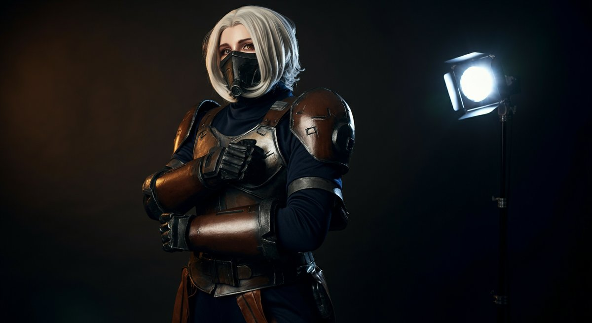

아, 정말 설레는 주제죠? 저 같은 40대 키덜트에게 [**코스프레**](https://namu.wiki/w/%EC%BD%94%EC%8A%A4%ED%94%84%EB%A0%88)는 단순한 취미를 넘어선 일종의 '타임머신' 같은 거예요. 어릴 적 TV 앞에서 침 흘리며 보던 애니메이션 속 주인공이 되고 싶다는 순수한 꿈, 그때는 감히 상상만 하던 일이었잖아요. 요즘은 그 꿈을 현실로 만들 수 있는 시대가 되어서 얼마나 좋은지 몰라요. 저도 처음엔 '내가 과연 할 수 있을까?' 하고 망설였지만, 막상 한 번 시작해보니 그 매력에 푹 빠져버렸지 뭐예요. 요즘 젊은 친구들 못지않게 이 코스프레 문화가 얼마나 역동적으로 발전하고 있는지 직접 경험하면서 느끼고 있답니다. 특히 2025년 들어서는 기술 발전과 함께 더욱 다채로운 형태로 진화하고 있어서, 이 열기가 식을 줄을 몰라요. 우리가 어릴 적 갖고 놀던 로봇 장난감이나 인형들이 이제는 내 몸에 직접 구현되는 것 같은 느낌이랄까요? 마치 잊고 지냈던 동심의 한 조각이 다시 살아나는 듯한 짜릿함이 있어요. 신작 게임이나 애니메이션이 나올 때마다 '아, 이건 진짜 코스프레로 만들어보고 싶다!' 하는 생각이 절로 들거든요. 특히 마니아들 사이에서는 새로 출시되는 캐릭터들의 디자인을 보면서 벌써부터 어떻게 구현할지 머리를 맞대고 고민하는 모습들을 자주 보곤 합니다. 저도 종종 새로운 피규어를 구매하거나, 한정판 레고를 조립하면서 느꼈던 그 성취감과 비슷한 행복감을 코스프레 준비 과정에서 얻곤 하죠. 주변 동료 키덜트들도 저처럼 푹 빠져서 주말마다 의상이나 소품을 만들고 사진 촬영을 나가는 경우가 허다해요. 처음 이 세계에 발을 들였을 때는 막연하게 어렵게만 느껴졌는데, 이제는 제 삶의 활력소가 되어버렸습니다. 혹시 여러분도 어릴 적 추억 속 영웅이 되고 싶다는 작은 소망을 가지고 계신가요? 아니면 이 코스프레 문화에 관심은 있지만, 어디서부터 어떻게 시작해야 할지 막막한 초보자이신가요? 걱정 마세요. 저처럼 한때 망설였던 '어른이'들을 위해, 제가 직접 겪고 배운 모든 노하우를 아낌없이 풀어놓을 테니까요. 제가 직접 여러 번의 시행착오를 겪으며 터득한 실용적인 팁과 함께, 2025년 최신 트렌드까지 꼼꼼히 짚어드릴게요. 이 글을 읽고 나면 여러분도 성공적인 코스프레를 위한 확실한 가이드라인을 얻어가실 수 있을 거예요. 자, 이제 저와 함께 추억 속 영웅이 되는 짜릿한 여정, 함께 떠나볼까요?

### 목차

- [코스프레, 단순한 취미를 넘어선 추억 소환의 마법 (입문자를 위한 모든 것)](#toc-1)
- [코스프레 퀄리티를 한 단계 높이는 실전 팁 (40년 덕력으로 터득한 노하우)](#toc-2)
- [코스프레 커뮤니티와 이벤트, 정보 교류의 장을 100% 활용하기 (2025년 트렌드)](#toc-3)
- [코스프레 장비 관리와 리세일, 덕후의 자산 관리법](#toc-4)

## 코스프레, 단순한 취미를 넘어선 추억 소환의 마법 (입문자를 위한 모든 것)

처음 **코스프레**라는 단어를 들었을 때, 많은 분들이 그저 특이한 의상을 입고 사진 찍는 행위 정도로만 생각하실 거예요. 저도 그랬으니까요. 하지만 막상 발을 들여보니, 이건 단순한 패션쇼가 아니라 한 캐릭터에 대한 깊은 애정과 이해, 그리고 그걸 나만의 방식으로 표현해내는 종합 예술 활동에 가깝더라고요. 제가 어릴 적 <에반게리온>의 아스카를 너무 좋아해서 관련된 피규어를 모으고, 한정판 설정집을 보면서 막연히 '내가 아스카가 된다면 어떨까?' 하고 상상만 했었는데, 이제는 그 상상을 현실로 만들어볼 수 있는 거죠. 이런 과정 자체가 저에게는 엄청난 설렘과 만족감을 줍니다. 코스프레는 그 캐릭터의 의상, 헤어스타일, 메이크업은 물론이고, 심지어 표정과 포즈까지 재현하면서 일종의 '페르소나'를 경험하게 해줘요. 이로 인해 스트레스를 해소하고, 새로운 자아를 발견하는 통로가 되기도 합니다. 특히 저처럼 바쁜 일상에 지친 40대 어른들에게는 잠시 현실을 잊고 동심으로 돌아갈 수 있는 값진 기회를 선사해주죠. 제 주변에는 어릴 적 즐겨 하던 게임 속 캐릭터를 코스프레하면서, 마치 그때의 용감했던 나로 돌아간 것 같다는 친구들도 많아요. 이런 경험이야말로 코스프레가 주는 진정한 마법이 아닐까 싶습니다.

이 코스프레 문화는 전 세계적으로 정말 거대하고 활발하게 움직이고 있어요. 일본의 코미케, 미국의 샌디에이고 코믹콘 같은 대형 행사들은 이미 전설적인 축제고요, 한국에서도 지스타, AGF(Anime Game Festival), 서브컬처 페스티벌 같은 곳에서 매년 수십만 명의 코스플레이어와 관람객이 함께 열기를 더하고 있습니다. 2024년 AGF 행사에는 무려 15만 명이 넘는 인파가 몰렸다고 하니, 그 인기를 짐작할 수 있겠죠? 이처럼 코스프레는 이제 소수의 마니아층을 넘어 대중적인 문화 현상으로 자리 잡았고, 다양한 연령대의 사람들이 이 즐거움에 동참하고 있습니다. 이런 행사에서 보면 정말 개성 넘치는 코스프레를 볼 수 있는데, 볼 때마다 감탄이 절로 나와요. 특히 요즘은 단순히 인기 캐릭터를 따라 하는 것을 넘어, 자신만의 해석을 담은 '오리지널 코스프레'나 다른 장르와 결합한 '크로스오버 코스프레'도 늘고 있는 추세입니다. 이런 창의적인 시도는 코스프레의 스펙트럼을 더욱 넓혀주고 있어요. 제가 처음 코스프레를 시작했을 때는 이런 다양한 시도보다는 정석적인 재현에 가까웠는데, 요즘은 정말 아티스트들의 작품을 보는 것 같은 기분이 들 때가 많아요. 이런 자유로운 표현 방식은 많은 사람들에게 더욱 큰 영감을 주고 있습니다. 코스프레에 대한 사회적 인식도 예전보다 훨씬 긍정적으로 바뀌어서, 이제는 하나의 건전한 취미 활동으로 존중받고 있고요.

하지만 **코스프레**를 처음 시작하는 분들은 막막하게 느껴질 수 있어요. 어떤 캐릭터를 골라야 할지, 의상은 어디서 구해야 할지, 메이크업은 어떻게 해야 할지 등 궁금한 점이 한두 가지가 아닐 겁니다. 저도 처음엔 유명 애니메이션 캐릭터인 <원피스>의 루피 코스프레를 도전하려다가, 고무고무 열매 능력자 재현 때문에 엄청 고생했던 기억이 나요. 그때 깨달았죠, 처음부터 너무 어려운 캐릭터에 도전하면 흥미를 잃기 쉽다는 걸요. 그래서 저는 초보자분들께는 _자신이 정말 좋아하고 애정하는 캐릭터 중에서 난이도가 너무 높지 않은 캐릭터_를 고르라고 조언해드리고 싶어요. 예를 들어, 평상복에 가까운 의상을 입는 캐릭터나, 복잡한 소품이 적은 캐릭터 등이 좋겠죠. 예를 들어, <하이큐>의 캐릭터들은 대부분 교복이나 스포츠 유니폼이라 입문용으로 아주 적합해요. 아니면 <귀멸의 칼날>처럼 특정 문양의 유카타를 입는 캐릭터도 생각보다 쉽습니다. 캐릭터를 선택할 때는 '내가 이 캐릭터를 얼마나 잘 표현할 수 있을까' 하는 자기 객관화도 중요합니다. 처음부터 너무 완벽하려고 하기보다는, 캐릭터의 핵심 포인트를 살리는 데 집중하는 것이 훨씬 효과적이에요. 어차피 코스프레는 즐거움이 최우선이니까요. 그리고 나서 점차 난이도를 높여가는 거죠. 이 과정을 통해 여러분도 저처럼 이 멋진 코스프레 세계에 푹 빠져들게 될 겁니다.

* * *

### 처음 시작하는 코스프레, 무엇부터 준비해야 할까?

자, 이제 설레는 마음으로 **코스프레**를 시작하기로 마음먹으셨다면, 가장 먼저 해야 할 일은 '캐릭터 선정'입니다. 앞에서 잠깐 언급했지만, 이 단계에서 너무 무리하면 안 돼요. 제가 처음 코스프레에 도전했을 때, 당시 엄청 좋아하던 <파이널 판타지>의 한 캐릭터를 선택했다가 절망했던 경험이 있어요. 화려한 갑옷과 복잡한 무기 때문에 의상 제작은커녕, 어울리는 가발을 찾는 것조차 쉽지 않았죠. 결국 어설프게 만들다가 접었는데, 그때 받은 좌절감은 이루 말할 수 없었습니다. 그래서 저처럼 실패하지 않으려면, **처음에는 최대한 간단한 의상과 적은 소품으로 구현 가능한 캐릭터**를 고르는 것이 현명해요. 예를 들어, <러브 라이브!> 같은 아이돌 애니메이션 캐릭터들은 교복이나 무대 의상이 비교적 단순하면서도 화려한 느낌을 낼 수 있어서 좋습니다. 아니면 <스파이 패밀리>의 요르 포저처럼 정장이나 평상복 베이스의 의상을 입는 캐릭터도 입문자에게 좋은 선택지가 될 수 있습니다. 캐릭터 선정 시에는 무엇보다 '내가 얼마나 이 캐릭터를 사랑하는가'가 중요해요. 애정이 깊으면 준비 과정이 아무리 힘들어도 즐겁게 이겨낼 수 있거든요. 그리고 자신의 신체적 특징(키, 체형)과도 잘 어울리는지 고려하는 것도 중요합니다. 어떤 캐릭터는 키가 커야 멋있게 표현되는 경우가 있고, 어떤 캐릭터는 특정 체형이 더 잘 어울릴 수 있거든요. 너무 억지로 캐릭터에 자신을 맞추기보다는, 자신에게 어울리는 캐릭터를 찾는 것이 훨씬 자연스럽고 만족도 높은 코스프레를 가능하게 합니다.

캐릭터를 정했다면 다음은 예산 계획입니다. 이건 정말 중요한 부분인데, 저도 초반엔 멋모르고 덤볐다가 지갑이 텅 비었던 적이 한두 번이 아니에요. **코스프레**는 생각보다 돈이 많이 드는 취미입니다. 의상, 가발, 소품, 메이크업 도구, 그리고 촬영 장소 대여나 스튜디오 비용까지 고려하면 꽤 큰돈이 들어갈 수 있죠. 하지만 걱정 마세요, 현명하게 접근하면 충분히 **가성비 좋은 코스프레**도 가능합니다. 예를 들어, 의상의 경우 직접 재봉틀로 만들거나, 중고 장터(네이버 카페 '코스어장터', '중고나라', '번개장터' 등)를 활용하면 새 제품보다 훨씬 저렴하게 구할 수 있어요. 제가 실제로 '코스어장터'에서 상태 좋은 의상을 시세보다 30% 싸게 구매한 적도 있습니다. 중고로 구매할 때는 꼭 판매자의 이전 거래 내역이나 후기를 확인하고, 의상 상태를 꼼꼼히 문의하는 것이 중요해요. 너무 급하게 구매했다가 사이즈가 안 맞거나, 하자가 많은 제품을 받아서 후회하는 경우가 종종 발생하거든요. 저도 처음에는 이런 실수를 여러 번 했었는데, 이제는 베테랑이 다 됐죠. 가발도 마찬가지예요. 저렴한 인조 가발을 구매해서 직접 스타일링하거나, 주변에 가발 스타일링에 능숙한 친구에게 도움을 받는 것도 좋은 방법입니다. 소품은 직접 만들면 재료비만 들기 때문에 비용 절감에 효과적이죠. EVA 폼이나 우드락, 아이소핑크 같은 재료들은 가격도 저렴하고 가공하기도 쉬워서 초보자들이 소품을 만들기에 아주 좋아요. 초기에는 약 10만원 ~ 30만원 정도의 예산을 잡고 시작하는 것이 일반적이지만, 캐릭터의 복잡도에 따라 그 이상이 될 수도 있다는 점을 명심하세요. 저의 경험상, 전체 예산의 50%를 의상에, 20%를 가발에, 20%를 소품에, 나머지 10%를 메이크업 도구나 부대 비용에 할당하는 것이 가장 효율적이었습니다.

마지막으로, 정보 수집과 학습이 중요합니다. 요즘은 유튜브나 네이버 카페 등 온라인에서 **코스프레** 관련 정보를 정말 쉽게 찾아볼 수 있어요. 예를 들어, '코스프레 메이크업 튜토리얼', '가발 스타일링 팁', 'EVA 폼 소품 제작 가이드' 같은 키워드로 검색하면 수많은 자료가 쏟아져 나옵니다. 저도 처음엔 유튜브 채널 '미뇽 Mignon'이나 '모네코 Monet Cos' 같은 곳에서 정말 많은 도움을 받았어요. 이분들이 초보자 눈높이에 맞춰서 자세하게 설명해주시거든요. 커뮤니티 활동도 적극적으로 참여해보세요. '코스프레 의상 제작'이나 '코스어장터' 같은 네이버 카페에서는 베테랑 코스어들이 자신들의 노하우를 아낌없이 공유해줍니다. 저도 여기서 활동하면서 많은 분들께 조언을 얻고, 저의 실패담을 공유하면서 공감대를 형성하곤 해요. 모르는 점이 있다면 주저하지 말고 질문해보세요. 대부분의 코스어들은 서로 돕고 배우는 문화를 가지고 있어서 친절하게 답변해줄 겁니다. 실제로 제가 소품 제작에 어려움을 겪었을 때, 한 커뮤니티 회원분이 본인이 직접 만든 소품 제작 과정을 사진과 함께 상세히 알려주셔서 큰 도움이 됐던 적이 있어요. 이런 상호작용은 코스프레를 더욱 즐겁고 풍요롭게 만들어줍니다. [보드카페 처음 가는 분들을 위한 초보 추천 게임 및 이용 꿀팁 초보 필독!](https://키덜트-stage.com/?p=272)을 찾으시는 분들도 있을 텐데요, 이 글처럼 처음 접하는 분야에 대한 정보는 미리미리 알아두는 것이 실수를 줄이는 가장 좋은 방법입니다. 결국, 충분한 정보와 계획이 여러분의 첫 코스프레를 성공적으로 이끌어 줄 거예요. 실패를 두려워하지 말고, 일단 한번 도전해보세요!

* * *

### 코스프레 의상과 소품, 현명하게 고르는 비법

**코스프레**의 핵심은 뭐니 뭐니 해도 의상과 소품이죠! 이걸 어떻게 준비하느냐에 따라 퀄리티가 천차만별로 달라집니다. 저도 초창기에는 무조건 '비싸면 좋겠지'라는 생각으로 고가 의상을 무리하게 구매했다가, 막상 받아보니 핏이 안 맞거나 원단이 예상과 달라서 실망했던 경험이 많아요. 특히 온라인 구매는 실제로 보지 못하고 사야 하니 더 그렇죠. 그래서 저는 의상과 소품을 고를 때 몇 가지 원칙을 세워두고 있습니다. 첫째, 캐릭터의 '시그니처'가 뭔지 파악하는 거예요. 예를 들어, <리그 오브 레전드>의 아리 코스프레를 한다면 아홉 개의 꼬리가 가장 중요하고, <원신>의 라이덴 쇼군이라면 화려한 기모노와 전용 무기가 핵심이겠죠. 이런 핵심 요소를 먼저 정하고, 여기에 예산을 집중 투자하는 겁니다. 둘째, '가성비'를 따지는 거예요. 저처럼 직장 생활하는 40대 키덜트에게는 시간도 돈이거든요. 직접 만들었을 때의 만족감은 크지만, 시간과 노력이 너무 많이 든다면 차라리 잘 만들어진 기성품을 구매하는 것이 효율적일 수 있습니다. 요즘은 중국 타오바오나 국내 코스프레 전문 쇼핑몰(ex. 위그매니아, 코스프레 샵24 등)에서 꽤 괜찮은 퀄리티의 의상과 소품을 합리적인 가격에 판매하고 있어요. 다만, 중국 구매대행을 이용할 때는 배송 기간이 길고(보통 2~3주), 사이즈 교환이 어렵다는 단점이 있으니 이 점을 고려해야 합니다. 제가 예전에 급하게 행사 의상을 구매했다가 배송 지연으로 낭패를 본 적이 있어서, 지금은 최소 한 달 전에는 주문하는 편이에요.

의상과 소품을 선택할 때는 재질과 내구성도 꼼꼼히 살펴봐야 합니다. **코스프레**는 한 번 입고 마는 옷이 아니라, 여러 번 착용하고 사진 촬영도 하는 경우가 많잖아요? 그래서 쉽게 헤지거나 찢어지지 않는 튼튼한 재질이 중요해요. 예를 들어, 코스프레 의상에 자주 사용되는 '스판덱스'는 활동성이 좋고 몸에 잘 맞아 편하지만, 고급스러움은 떨어질 수 있습니다. 반면, '새틴'이나 '실크' 같은 원단은 고급스러운 광택을 내지만 구김이 잘 가고 관리하기 까다로울 수 있죠. 소품의 경우, 'EVA 폼'이나 'PVC' 같은 소재는 가볍고 가공하기 쉽지만, 강도가 약해서 파손될 위험이 있습니다. 제가 실제로 행사장에서 소품이 부러져서 난감했던 적이 있었는데, 그때 이후로는 보강 작업을 필수로 하고 있어요. 만약 직접 소품을 만드신다면, 도색 마감에도 신경을 써야 합니다. 아무리 형태가 잘 나왔어도 도색이 어설프면 전체적인 퀄리티가 확 떨어져 보이거든요. 최소 2~3번의 도색과 마감제를 사용해서 표면을 보호하고 색감을 살려주는 것이 좋습니다. 개인적으로는 스프레이 페인트보다는 아크릴 물감을 여러 번 덧칠하는 것이 더 자연스러운 결과물을 얻을 수 있었어요. 그리고 2025년 들어서는 친환경 소재를 활용한 코스프레 의상이나 소품 제작에 대한 관심이 높아지고 있어요. 재활용 가능한 소재나 자연 분해되는 재료를 사용하는 거죠. 이런 트렌드도 한번 눈여겨볼 만합니다.

마지막으로, '리세일 가치'를 고려하는 것도 현명한 방법이에요. **코스프레** 의상이나 소품은 사용 후 처치 곤란할 때가 많거든요. 특히 캐릭터가 인기가 시들해지면 더더욱 그렇죠. 그래서 처음부터 너무 비싸게 투자하기보다는, 나중에 중고로 판매했을 때 어느 정도 가격을 받을 수 있을지도 염두에 두면 좋습니다. 인기 캐릭터의 의상이나 퀄리티 좋은 수제 소품은 중고 시장에서도 꽤 높은 가격에 거래되곤 합니다. 제가 몇 년 전에 구매했던 한정판 코스프레 의상을 거의 구매 가격의 80% 정도에 다시 팔았던 적도 있어요. 물론 구매할 때부터 '나중에 팔아야지' 하고 생각하는 건 아니지만, 한 번쯤은 이런 가능성을 열어두는 것이 현명합니다. 중고 판매를 염두에 둔다면, 의상을 깨끗하게 관리하고 보관하는 것이 중요해요. 착용 후에는 바로 세탁하거나 드라이클리닝을 맡기고, 습기가 없는 곳에 보관해야 변색이나 훼손을 막을 수 있습니다. 소품도 마찬가지로 부서지지 않도록 잘 포장해서 보관해야 하죠. 이런 작은 노력들이 나중에 여러분의 **코스프레** 자산을 지켜주는 셈이에요. 요즘 '코스어장터' 같은 카페에서는 리세일 시 주의할 점이나 시세 정보도 활발하게 공유되고 있으니, 참고해보시면 큰 도움이 될 겁니다. [커플을 위한 보드카페 이색 데이트 추천 코스 및 필수 게임 목록 완벽 가이드](https://키덜트-stage.com/?p=293)처럼, 어떤 취미든 현명하게 즐기는 방법은 끊임없이 정보를 탐색하고 적용하는 데 있다고 생각합니다.

* * *

## 코스프레 퀄리티를 한 단계 높이는 실전 팁 (40년 덕력으로 터득한 노하우)

의상과 소품을 준비했다고 해서 모든 **코스프레**가 완성되는 건 아니죠! 제가 수십 년간 덕질을 하면서 느낀 건, _정말 작은 디테일들이 전체적인 퀄리티를 확 끌어올린다_는 거예요. 특히 코스프레는 '캐릭터 구현'이 핵심이기 때문에, 단순한 재현을 넘어 캐릭터의 영혼을 담아내는 것이 중요합니다. 40대 아저씨가 뭘 알겠냐고 할 수도 있겠지만, 저도 수많은 시행착오와 커뮤니티 활동을 통해 나름의 노하우를 쌓아왔답니다. 처음 제가 <드래곤볼>의 손오공 코스프레를 했을 때, 의상은 완벽했는데 뭔가 아쉬웠거든요. 나중에 사진을 보고 나서야 알았죠. 특유의 전투 포즈나 표정을 제대로 살리지 못했던 거예요. 그때부터 캐릭터의 표정, 말투, 행동 습관까지 연구하기 시작했습니다. 2025년 들어서는 AI 기술을 활용해서 캐릭터의 미묘한 표정 변화나 행동 패턴을 분석해주는 앱도 등장하고 있어서, 이런 디테일 연구에 큰 도움을 받을 수 있습니다. 이런 작은 노력들이 모여 관객들에게 '진짜 캐릭터가 나타난 것 같다!'는 감탄을 자아내게 하는 거죠. 코스프레는 단순히 옷을 입는 것을 넘어, 캐릭터 그 자체가 되는 몰입의 과정이 포함되어야 합니다. 그렇지 않으면 아무리 비싼 의상을 입어도 껍데기만 남아버릴 수 있어요. 여러분도 좋아하는 캐릭터가 있다면, 단순히 의상을 준비하는 것 이상으로 그 캐릭터의 매력을 깊이 파고들어 보세요. 분명 더 높은 퀄리티의 코스프레를 완성할 수 있을 겁니다.

퀄리티를 높이는 데 있어서 메이크업과 가발 스타일링은 정말 중요한 부분을 차지합니다. 특히 메이크업은 캐릭터의 인상을 좌우하는 핵심 요소예요. 저처럼 원래 외모가 캐릭터와 동떨어져 있다면 더욱 그렇죠. 저도 처음에는 '남자인데 무슨 메이크업이야' 했다가, 나중에 사진 보고 충격받아서 바로 메이크업 도구를 구매했습니다. 캐릭터에 따라 눈 크기를 키우거나, 눈매를 날카롭게 만들거나, 피부 톤을 바꾸는 등 다양한 기술이 필요해요. 예를 들어, <주술회전>의 고죠 사토루처럼 날카로운 눈매의 캐릭터는 아이라인과 아이섀도로 눈매를 길고 위로 빼주는 것이 중요하고, <원신>의 클레처럼 귀여운 캐릭터는 눈 아래 애교살을 강조하고 블러셔로 생기 있는 볼을 연출해야 합니다. 가발 스타일링 역시 캐릭터의 헤어스타일을 그대로 재현하는 것이 중요해요. 단순히 가발을 쓰는 것을 넘어, 헤어 스프레이, 왁스, 고데기 등을 활용해서 캐릭터의 머리 모양을 완벽하게 만들어야 하죠. 유튜브에 '코스프레 가발 스타일링 튜토리얼'이라고 검색하면 정말 유용한 영상들이 많으니 참고해보세요. 제 경험상, 가발을 구매할 때는 원래 색상보다 한두 톤 밝은 것을 선택하는 게 좋아요. 조명 아래서 촬영하면 색이 더 어둡게 나오거든요. 그리고 가발에 열을 가할 때는 반드시 저온으로 시작하고, 내열사 가발인지 확인해야 합니다. 안 그러면 가발이 녹아내리는 불상사가 발생할 수 있어요. 저도 한 번 고데기로 가발을 태워먹고 비싼 가발을 버린 아픈 기억이 있답니다. 이런 디테일한 부분들이 모여서 전체적인 코스프레의 완성도를 결정하는 겁니다.

마지막으로, 사진 촬영과 포징은 **코스프레**의 꽃이라고 할 수 있습니다. 아무리 의상과 메이크업이 완벽해도 사진이 제대로 나오지 않으면 아쉽잖아요? 저도 처음엔 대충 찍었다가 '이게 누구야?' 소리 들은 적이 한두 번이 아니에요. 그래서 요즘은 사진 구도, 빛의 방향, 그리고 캐릭터에 맞는 포징을 연구하는 데 많은 시간을 투자합니다. 제가 좋아하는 <나루토>의 캐릭터 코스프레를 할 때는 '인술'을 사용하는 포즈나 역동적인 움직임을 담아내려고 노력하고, <세일러문> 같은 미소녀 캐릭터는 우아하고 예쁜 포즈를 연구하죠. 커뮤니티에서는 서로 코스프레 사진을 찍어주거나, 포즈에 대한 피드백을 주고받는 활동도 활발합니다. 전문 사진작가를 섭외하는 것도 좋은 방법이지만, 비용이 부담된다면 친구들과 서로 찍어주면서 연습해보는 것을 추천해요. 이때 중요한 것은 캐릭터의 특징을 잘 아는 사람이 찍어주는 것이 좋다는 겁니다. 그리고 2025년 최신 트렌드 중 하나는 'AI 기반 보정 기술'의 발전입니다. AI가 사진의 배경을 바꾸거나, 피부를 보정하고, 심지어 캐릭터 특유의 분위기를 더해주는 기능까지 제공하고 있어요. 이런 기술을 활용하면 아마추어도 전문가 못지않은 멋진 사진을 만들 수 있죠. 또한, 사진 촬영 시에는 소품의 활용도 중요합니다. 캐릭터가 사용하는 무기나 마법 지팡이 등을 활용해서 포즈를 취하면 훨씬 생동감 넘치는 사진을 얻을 수 있어요. 제 개인적인 팁으로는, 야외 촬영 시에는 **코스프레** 의상의 색상과 배경색의 조화를 고려해서 장소를 선택하는 것이 중요합니다. 너무 튀거나 배경과 어울리지 않는 색상의 의상이라면 배경 선택에 신중해야 합니다. 이 모든 노력들이 모여 '인생샷'을 만들어내는 거죠. 여러분도 이 노하우들을 잘 활용해서 최고의 코스프레 사진을 남겨보세요.

* * *

### 가성비 좋은 코스프레 소품 제작 & 구매 전략

소품은 **코스프레**의 화룡점정이라고 할 수 있어요. 의상만큼이나 중요해서, 어떤 소품을 착용하느냐에 따라 캐릭터의 분위기가 확 달라지거든요. 특히 <젤다의 전설> 링크처럼 검과 방패가 핵심인 캐릭터라면, 소품의 퀄리티가 전체 코스프레의 성패를 좌우하기도 합니다. 제가 처음 소품 제작에 도전했을 때, 의욕만 앞서서 제대로 된 도구도 없이 시작했다가 손만 아프고 결과물은 영 아니었던 기억이 생생해요. 그때 깨달은 것이 바로 '재료 선정'과 '도구 준비'의 중요성입니다. 가성비 좋게 소품을 제작하려면, 먼저 EVA 폼(고무 스펀지)을 추천합니다. 가볍고 가공하기 쉬워서 초보자들이 다루기 정말 좋아요. 칼로 자르고, 열풍기로 형태를 잡고, 글루건으로 붙이면 웬만한 소품은 뚝딱 만들 수 있습니다. 2025년 들어서는 3D 프린팅 기술이 대중화되면서, 복잡한 형태의 소품도 3D 모델링 파일을 구매하거나 직접 제작해서 출력하는 경우가 늘고 있어요. 물론 3D 프린터가 없는 분들은 3D 프린팅 서비스를 이용할 수도 있습니다. 이런 방법은 시간과 노력을 크게 절감해주면서도, 정교한 소품을 만들 수 있다는 장점이 있죠. 제가 최근에 <원신>의 타르탈리아 활을 3D 프린팅으로 제작하는 것을 봤는데, 그 퀄리티에 정말 깜짝 놀랐습니다. 기존에 수작업으로 만들었다면 최소 며칠은 걸렸을 작업인데, 훨씬 단시간에 고퀄리티 소품이 나오더라고요.

소품 구매 전략도 중요합니다. 모든 소품을 직접 만들 수는 없으니, 제작 난이도와 예산을 고려해서 현명하게 구매하는 것이 필요해요. 저의 경험상, 너무 복잡하거나 정교한 소품은 차라리 구매하는 것이 시간과 비용 면에서 효율적일 때가 많습니다. 예를 들어, 의 길가메쉬가 사용하는 에아(Enuma Elish) 같은 무기는 개인이 완벽하게 재현하기 어렵습니다. 이런 경우에는 전문 제작 업체나 숙련된 코스어에게 의뢰하거나, 해외 직구 사이트(알리익스프레스, 타오바오 등)에서 구매하는 것을 고려해볼 수 있습니다. 이때 중요한 것은 구매자 리뷰를 꼼꼼히 확인하고, 판매자에게 충분히 문의해서 실제 제품 사진을 받아보는 것입니다. 사진과 실물이 다른 경우가 의외로 많거든요. 제가 한 번은 무기 소품을 구매했는데, 광고 사진과 달리 재질이 너무 조악해서 실망했던 적이 있어요. 그때 이후로는 꼭 실물 사진을 요청하고, 가능하다면 후기를 참고해서 구매합니다. 평균적으로 소품 하나의 제작 비용은 재료값만으로 2만원에서 5만원 정도가 들지만, 구매 대행 시에는 5만원에서 20만원 이상까지도 들어갈 수 있습니다. 소품의 퀄리티와 디테일에 따라 가격이 천차만별이므로, 자신의 예산에 맞춰 현명한 선택을 해야 합니다. 너무 무리해서 비싼 소품을 구매하기보다는, 자신의 실력과 예산에 맞춰 가장 효과적인 방법을 선택하는 것이 중요합니다.

소품 관리와 보관 역시 **코스프레**의 수명을 늘리는 데 중요한 역할을 합니다. 특히 대형 소품이나 복잡한 구조의 소품은 보관을 잘못하면 쉽게 망가질 수 있어요. 제가 예전에 만든 <몬스터 헌터>의 대검 소품이 보관을 잘못해서 휘어버린 적이 있는데, 그때의 좌절감이란... 그래서 저는 모든 소품에 전용 보관함을 만들어주고 있습니다. 소품이 파손되지 않도록 스펀지나 에어캡으로 감싸서 보관하고, 습기나 직사광선을 피해 서늘한 곳에 두는 것이 중요해요. EVA 폼 소품은 열에 약하니, 여름철 차량 내부에 보관하는 것은 절대 금물입니다. 도색이 벗겨지지 않도록 마감제를 충분히 뿌려주는 것도 잊지 마세요. 소품은 한 번 망가지면 복구하기가 정말 어렵고, 새로 만들려면 많은 시간과 비용이 들기 때문에, 처음부터 관리에 신경 쓰는 것이 현명합니다. 행사장에 가져갈 때도 충격에 대비해 튼튼한 가방이나 케이스에 넣어 이동하는 것이 좋습니다. 제가 참여하는 코스프레 커뮤니티에서는 소품 관리 노하우나 효율적인 수납 아이디어에 대한 정보도 활발하게 공유되고 있습니다. 예를 들어, 낚시 도구함이나 미술용 도구함 등을 소품 보관용으로 활용하는 팁 같은 것들이죠. 이런 작은 팁들이 모여 여러분의 소중한 **코스프레** 장비들을 오랫동안 좋은 상태로 유지시켜 줄 거예요. 잘 관리된 소품은 나중에 리세일할 때도 더 높은 가치를 인정받을 수 있으니, 일석이조라고 할 수 있습니다.

* * *

### 사진 촬영과 포징, 코스프레의 꽃을 피우는 기술

아무리 **코스프레** 의상과 소품이 완벽해도, 그걸 가장 멋지게 기록하는 방법을 모른다면 반쪽짜리 아쉬움으로 남을 거예요. 저도 예전에는 그냥 서서 찍으면 되는 줄 알았다가, 결과물을 보고 '이건 내가 아니야!' 하면서 좌절했던 경험이 있습니다. 하지만 이제는 사진 한 장에도 캐릭터의 스토리를 담아낼 줄 아는 경지에 이르렀죠. 가장 중요한 것은 '캐릭터의 특성 이해'입니다. 제가 좋아하는 <철권>의 미시마 카즈야 코스프레를 한다면, 강렬하고 위압적인 포즈와 표정을 연출해야겠죠. 반면, <동물의 숲> 주민 코스프레라면 밝고 귀여운 느낌으로 편안한 포즈를 취해야 할 겁니다. 즉, 캐릭터의 성격, 주된 행동 양식, 상징적인 포즈 등을 미리 파악하고 연습하는 것이 필요해요. 거울 앞에서 여러 가지 표정과 포즈를 취해보면서 어떤 각도에서 가장 멋있게 나오는지 미리 확인해보는 것을 추천합니다. 특히 2025년 최신 트렌드 중 하나는 '콘셉트 촬영'의 중요성입니다. 단순한 배경 앞에서 찍는 것보다, 캐릭터의 세계관을 반영한 장소에서 촬영하거나 스토리가 담긴 연출을 하는 것이 더욱 인상적인 결과물을 만들어냅니다. 예를 들어, 폐공장이나 숲 속, 고궁 같은 장소는 캐릭터의 분위기를 극대화할 수 있는 좋은 배경이 될 수 있죠. 제가 최근에 참여했던 한 코스프레 팀은 <오버워치>의 한조 코스프레를 위해 고즈넉한 한옥을 배경으로 촬영했는데, 동양적인 미학과 캐릭터의 매력이 완벽하게 어우러져서 정말 인상 깊었어요.

좋은 사진을 얻기 위해서는 촬영자와의 소통이 필수입니다. 혼자 찍는 셀카도 좋지만, 제대로 된 **코스프레** 사진은 역시 다른 사람이 찍어줘야 빛을 발하죠. 저도 처음에는 친구들에게 대충 찍어달라고 부탁했다가 원하는 사진을 못 얻어서 속상했던 적이 많아요. 그래서 요즘은 촬영 전, 제가 원하는 캐릭터의 분위기나 특정 포즈에 대한 레퍼런스 사진을 충분히 공유합니다. "이 캐릭터는 이런 표정이 시그니처예요!", "이 각도에서 찍으면 더 멋있게 나와요!" 같은 구체적인 요청을 하는 거죠. 커뮤니티에는 서로 품앗이로 촬영해주는 문화도 잘 형성되어 있어요. '코스프레 사진사' 카페나 '출사 모델 및 작가 모집' 같은 네이버 카페에서 함께 작업할 사람을 구할 수 있습니다. 이때 중요한 것은 서로의 역할과 기대치를 명확히 하고, 결과물에 대한 피드백을 솔직하게 주고받는 것입니다. 저도 사진을 찍어주기도 하고, 찍히기도 하면서 서로의 촬영 노하우를 공유하고 있어요. 이런 과정을 통해 저뿐만 아니라 촬영자도 함께 성장할 수 있죠. 물론 비용을 지불하고 전문 사진작가를 섭외하는 것도 좋은 방법입니다. 특히 중요한 행사나 특별한 콘셉트 촬영을 할 때는 전문가의 손길이 확실히 다르다는 걸 느낄 수 있을 거예요. 사진 작가 선정 시에는 그 작가가 촬영한 다른 **코스프레** 작품들을 미리 확인하고, 자신의 캐릭터와 잘 어울리는 스타일을 가진 작가를 선택하는 것이 중요합니다.

마지막으로, 후반 보정 작업은 **코스프레** 사진의 완성도를 결정짓는 최종 단계입니다. 아무리 좋은 장비로 찍고 완벽한 포즈를 취했어도, 보정 없이는 어딘가 2% 부족한 느낌이 들 때가 많죠. 저도 처음엔 보정의 중요성을 잘 몰랐다가, 커뮤니티에서 다른 분들의 보정 전후 사진을 보고 깜짝 놀랐습니다. 단순히 피부 톤을 보정하고 잡티를 제거하는 것을 넘어, 캐릭터의 분위기에 맞는 색감을 입히고, 배경을 합성하거나 특수 효과를 추가하는 등 다양한 작업이 가능해요. 예를 들어, <리그 오브 레전드>의 마법사 캐릭터라면 마법 이펙트를 추가해서 더욱 판타지적인 분위기를 연출할 수 있죠. 보정 프로그램으로는 어도비 라이트룸이나 포토샵이 가장 많이 사용되지만, 요즘은 모바일 앱으로도 전문가 못지않은 보정이 가능합니다. '스냅시드', '라이트룸 모바일' 같은 앱들은 초보자도 쉽게 사용할 수 있으면서도 꽤 강력한 보정 기능을 제공합니다. 저도 급할 때는 이런 앱들을 활용해서 빠르게 보정을 하곤 해요. 단, 과도한 보정은 오히려 독이 될 수 있습니다. 캐릭터의 원래 분위기를 해치거나, 너무 비현실적인 사진이 될 수 있거든요. 적절한 선에서 보정을 하고, 원본의 매력을 살리는 데 집중하는 것이 중요합니다. 2025년에는 AI 기반의 자동 보정 기술이 더욱 발전해서, 코스플레이어들이 좀 더 쉽게 전문가 수준의 사진을 만들 수 있게 될 것으로 예상됩니다. 이런 기술들을 잘 활용하면 여러분의 **코스프레** 사진 퀄리티를 한 단계 끌어올릴 수 있을 거예요. 최고의 순간을 최고의 사진으로 남겨보세요!

* * *

## 코스프레 커뮤니티와 이벤트, 정보 교류의 장을 100% 활용하기 (2025년 트렌드)

**코스프레**는 혼자서도 즐길 수 있는 취미지만, 역시 같은 취미를 가진 사람들과 함께할 때 그 즐거움이 배가 됩니다. 저도 처음엔 혼자 즐기다가, 커뮤니티에 가입하고 오프라인 행사에 참여하면서 이 취미의 진정한 매력을 깨달았어요. 저처럼 40대 키덜트들에게는 같은 추억을 공유하는 친구들을 만나는 것 자체가 큰 기쁨이거든요. 어릴 적 <마징가 Z>나 <독수리 5형제> 같은 애니메이션을 보면서 자란 세대가 이제는 직접 코스프레를 하면서 서로의 작품을 칭찬하고 정보를 교환하는 모습을 보면 정말 뿌듯합니다. 2025년 현재, 코스프레 커뮤니티는 온라인과 오프라인 모두 활발하게 운영되고 있어요. 대표적으로 네이버 카페 '코스어장터', '코스프레 의상 제작', '코스프레 사진사' 같은 곳들은 정보 교류의 핵심 허브 역할을 하고 있습니다. 이런 곳에서는 의상 및 소품 구매/판매 정보, 행사 후기, 메이크업 팁, 촬영 스튜디오 추천 등 정말 다양한 정보를 얻을 수 있습니다. 제가 소품 재료가 급하게 필요했던 적이 있었는데, 카페에 글을 올리자마자 여러 회원분들이 도움을 주셔서 무사히 소품을 완성할 수 있었어요. 이런 상호작용은 코스프레 활동을 더욱 풍요롭게 만들어줍니다. 오프라인 행사에서는 직접 다른 코스어들의 작품을 보고 영감을 얻거나, 평소 온라인에서 교류하던 사람들과 직접 만나 친목을 다질 수 있죠. 이런 만남을 통해 새로운 아이디어를 얻거나, 함께 팀 코스프레를 기획하는 등 활동의 폭을 넓힐 수 있습니다.

오프라인 **코스프레** 행사는 그야말로 축제의 장입니다. 한국에서 가장 대표적인 행사로는 매년 열리는 AGF(Anime Game Festival), 지스타(G-STAR), 그리고 최근 부상하는 서브컬처 페스티벌 등이 있어요. 이 행사들은 단순한 전시회를 넘어, 코스플레이어들이 자신들의 작품을 선보이고, 관람객들과 소통하는 교류의 장입니다. 특히 2024년 AGF에서는 코스프레 콘테스트가 열려 많은 실력파 코스어들이 경쟁을 펼쳤는데, 그 열기가 정말 대단했어요. 제가 직접 현장에서 <원신>의 여러 캐릭터들이 팀 코스프레를 하는 것을 봤는데, 그 완성도와 팀워크에 감탄을 금치 못했습니다. 이런 행사에 참여할 때는 몇 가지 팁이 있어요. 첫째, 미리 동선과 부스를 파악하고 가세요. 워낙 규모가 크고 사람이 많아서 헤매기 쉽거든요. 둘째, 간식과 음료, 보조배터리는 필수입니다. 코스프레 의상을 입고 돌아다니면 체력 소모가 크고, 사진 촬영 요청도 많아서 배터리가 금방 닳아요. 셋째, 다른 코스어들에게 예의를 갖추는 것이 중요합니다. 사진 촬영 시에는 반드시 허락을 받고, 무리한 요구는 하지 않는 것이 매너입니다. 저도 행사장에서 예의 없이 촬영을 요구하는 사람들을 보면서 눈살을 찌푸렸던 경험이 있어요. 서로를 존중하는 태도가 건강한 코스프레 문화를 만듭니다. 2025년에는 VR/AR 기술을 활용한 '가상 코스프레' 체험존이나, AI가 참가자에게 어울리는 캐릭터를 추천해주는 서비스 등 새로운 형태의 이벤트가 더욱 확대될 것으로 예상됩니다. 이런 기술적 변화는 코스프레의 경험을 더욱 다채롭게 만들어 줄 거예요.

온라인 **코스프레** 커뮤니티 활동은 오프라인 행사 참여만큼이나 중요합니다. 제가 주로 활동하는 네이버 카페나 루리웹 게시판에는 수많은 정보와 노하우가 매일매일 갱신되고 있어요. 이곳에서 다른 코스어들의 작품을 보면서 영감을 얻기도 하고, 궁금한 점을 질문하거나, 제가 가진 노하우를 공유하기도 합니다. 특히 초보자분들이 흔히 하는 실수 중 하나가, 커뮤니티 눈팅만 하고 직접 참여하지 않는다는 거예요. '내가 질문하면 이상하게 보지 않을까?', '내 작품이 너무 어설퍼 보일까?' 같은 걱정 때문에 주저하는 경우가 많죠. 저도 처음엔 그랬습니다. 하지만 막상 용기를 내서 글을 써보고 질문을 해보니, 대부분의 커뮤니티 회원들은 매우 친절하고 적극적으로 도움을 주려고 합니다. 서로에게 배우고 성장하는 것이 이 커뮤니티의 본질이거든요. 제가 한때 의상 제작에 필요한 특정 재료를 구하지 못해서 애를 먹고 있었는데, 커뮤니티에 문의했더니 한 회원분이 자신의 남는 재료를 무료로 나눠주셨던 적도 있습니다. 이런 따뜻한 정이 바로 **코스프레** 커뮤니티의 매력이죠. 다만, 온라인 커뮤니티인 만큼 익명성을 이용한 비방이나 논란에 휘말리지 않도록 주의해야 합니다. 항상 예의 바른 태도를 유지하고, 긍정적인 정보 교류에 집중하는 것이 중요해요. 또한, 자신의 코스프레 사진을 공유할 때는 개인 정보 보호에 유의하고, 불쾌감을 줄 수 있는 콘텐츠는 자제해야 합니다. 커뮤니티의 규칙을 잘 지키면서 활동한다면, 여러분의 코스프레 라이프는 더욱 풍성해질 겁니다. [보드카페 처음 가는 분들을 위한 초보 추천 게임 및 이용 꿀팁 초보 필독!](https://키덜트-stage.com/?p=272)을 읽고 보드카페에 처음 방문하는 것처럼, 코스프레 커뮤니티도 처음에는 낯설 수 있지만, 조금씩 참여하다 보면 분명 즐거움을 찾게 될 거예요.

* * *

## 코스프레 장비 관리와 리세일, 덕후의 자산 관리법

우리가 **코스프레**를 하면서 공들여 만든 의상과 소품들은 단순한 물건이 아니라, 시간과 노력이 담긴 소중한 '작품'입니다. 피규어를 수집하는 것과 비슷하게, 이 아이템들에도 애착이 가고 나름의 가치를 부여하게 되죠. 저도 처음에는 대충 보관하다가 의상이 망가지거나 소품이 파손되어서 속상했던 적이 많아요. 특히 고가의 수제 의상이나 복잡한 소품은 한 번 망가지면 복구하기가 정말 어렵고, 다시 만들려면 많은 시간과 비용이 들거든요. 그래서 저는 이 장비들을 단순한 취미 용품이 아니라, 저의 '덕후 자산'으로 생각하고 체계적으로 관리하고 있습니다. 2025년 현재, 코스프레 시장의 규모가 커지면서 리세일(Resale) 시장도 매우 활성화되어 있어요. 퀄리티 좋은 의상이나 인기 캐릭터의 소품은 중고 시장에서도 꽤 높은 가격에 거래되곤 합니다. 단순히 취미로 끝나는 것이 아니라, 잘 관리하면 나중에 새로운 코스프레를 위한 자금 마련에도 도움이 될 수 있다는 거죠. 이건 마치 제가 아끼는 한정판 피규어를 소중히 보관했다가 나중에 프리미엄을 주고 판매하는 것과 비슷한 이치라고 볼 수 있습니다. 그러니 여러분의 소중한 **코스프레** 아이템들을 단순히 옷장 속에 방치하지 말고, 저와 함께 현명하게 관리하고 필요할 때 현명하게 리세일하는 방법을 알아보도록 해요. 이 과정 자체가 여러분의 덕질을 더욱 지속 가능하고 즐겁게 만들어 줄 겁니다.

고급 **코스프레** 의상 및 소품을 오래 유지하려면 체계적인 보관과 관리가 필수입니다. 의상의 경우, 착용 후에는 반드시 바로 세탁하거나 드라이클리닝을 맡겨야 합니다. 특히 무대용으로 사용되는 의상들은 땀과 먼지가 많이 묻기 때문에 관리에 소홀하면 쉽게 변색되거나 오염될 수 있어요. 저도 한 번은 급하다고 드라이클리닝을 미뤘다가, 의상에 얼룩이 생겨서 결국 폐기했던 아픈 경험이 있습니다. 세탁 후에는 통풍이 잘되는 곳에 걸어두어 완전히 건조시키고, 형태가 변형되지 않도록 전용 옷걸이에 걸어 보관하는 것이 좋습니다. 습기에 약한 소재(새틴, 벨벳 등)는 방습제를 함께 넣어 습기 찬 곳을 피해 보관해야 합니다. 소품의 경우는 더욱 세심한 관리가 필요해요. EVA 폼이나 3D 프린팅 소품은 직사광선이나 고온에 노출되면 변형되거나 색이 바랠 수 있으니, 서늘하고 그늘진 곳에 보관해야 합니다. 큰 소품은 분해해서 보관하거나, 파손 위험이 있는 부분은 뽁뽁이나 스펀지로 감싸주는 것이 좋습니다. 저도 <몬스터 헌터> 대검 소품을 보관할 때, 칼날 부분을 EVA 폼으로 한 번 더 감싸서 보관하고 있습니다. 작은 부품들은 잃어버리지 않도록 지퍼백이나 플라스틱 수납함에 따로 분류해서 보관하는 것이 효율적이에요. 이처럼 기본적인 관리만 잘 해줘도 여러분의 **코스프레** 장비들을 훨씬 오랫동안 새것처럼 유지할 수 있습니다. 평균적으로 잘 관리된 코스프레 의상은 3~5년, 소품은 5~10년 이상 사용이 가능하다고 보고 있습니다.

이제 **코스프레** 아이템 리세일 전략에 대해 이야기해볼까요? 모든 **코스프레** 아이템을 영원히 소장할 수는 없습니다. 캐릭터에 대한 흥미가 식거나, 새로운 코스프레를 위해 자금이 필요할 때가 오기 마련이죠. 이때 현명하게 리세일하면 여러분의 덕질 라이프에 큰 도움이 될 겁니다. 리세일을 고려한다면, 먼저 아이템의 상태를 최상으로 유지하는 것이 중요합니다. 깨끗하고 손상 없는 아이템일수록 더 높은 가격을 받을 수 있다는 건 당연한 사실이죠. 판매 전에는 의상을 깨끗하게 세탁하고, 소품의 먼지를 닦아내는 등 기본적인 관리를 해두세요. 다음으로, 정확한 정보와 상세한 사진을 제공하는 것이 중요합니다. 판매할 의상의 사이즈, 사용 횟수, 구매처, 하자가 있다면 어떤 하자인지 등을 솔직하게 기재해야 합니다. 사진은 여러 각도에서 찍고, 특히 하자가 있는 부분은 클로즈업해서 보여주는 것이 좋습니다. 저도 중고 거래를 많이 해봤지만, 불성실한 정보는 구매자의 신뢰를 잃게 만들고, 나중에 분쟁의 소지가 될 수 있습니다. 판매 채널로는 네이버 카페 '코스어장터'나 '중고나라', 그리고 번개장터 같은 중고 거래 앱이 가장 활발합니다. 특히 '코스어장터'는 코스프레 전문 커뮤니티인 만큼, 타겟 구매자들에게 효율적으로 노출될 수 있다는 장점이 있어요. 평균적으로 인기 캐릭터의 퀄리티 좋은 의상은 구매 가격의 60~80% 선에서 리세일될 수 있으며, 소품은 상태에 따라 50~70% 선에서 거래됩니다. 2025년 들어서는 NFT 기술을 활용한 디지털 코스프레 아이템 거래 플랫폼도 등장하고 있어서, 미래에는 실물 아이템과 함께 디지털 아이템의 리세일 시장도 더욱 커질 것으로 예상됩니다. 마지막으로, 적절한 가격을 책정하는 것이 중요합니다. 너무 비싸게 팔려고 하면 잘 팔리지 않고, 너무 싸게 팔면 손해를 볼 수 있으니, 다른 판매자들의 유사 아이템 가격을 참고하여 합리적인 가격을 설정하는 것이 좋습니다. 이런 팁들을 잘 활용해서 여러분의 **코스프레** 아이템들을 현명하게 관리하고, 필요할 때 새로운 덕질을 위한 자원으로 활용해보세요.

* * *

자, 지금까지 40대 키덜트인 제가 직접 겪고 배운 **코스프레**의 모든 것을 아낌없이 풀어보았습니다. 어릴 적 꿈을 현실로 만드는 이 짜릿하고 멋진 취미 활동이 얼마나 매력적인지 조금은 느끼셨나요? 처음엔 어렵고 막막하게 느껴질지 몰라도, 저처럼 차근차근 준비하고 하나씩 실행에 옮기다 보면 분명 여러분도 이 코스프레의 매력에 푹 빠져들게 될 겁니다. 캐릭터를 선택하는 것부터 의상과 소품을 준비하고, 메이크업과 가발 스타일링, 그리고 멋진 사진 촬영까지, 모든 과정이 여러분에게 새로운 즐거움과 성취감을 안겨줄 거예요. 저도 이 과정을 겪으면서 잊고 지냈던 유년 시절의 열정과 도전 정신을 다시금 일깨울 수 있었습니다. 마치 새로운 삶을 사는 것 같은 기분이랄까요?

기억하세요, 가장 중요한 것은 '즐기는 마음'입니다. 완벽하지 않아도 괜찮아요. 처음부터 베테랑 코스어처럼 멋진 작품을 만들 필요는 없습니다. 그저 여러분이 좋아하는 캐릭터가 되어보는 그 순간 자체를 즐기는 것이 중요해요. 혹시 저처럼 처음 도전했다가 실패하더라도, 그 과정에서 얻는 경험과 배움은 분명 다음 번 코스프레를 더욱 성공적으로 만들어 줄 거예요. 제가 위에서 알려드린 팁들, 예를 들어 _처음에는 간단한 캐릭터로 시작하고, 예산 계획을 꼼꼼히 세우며, 커뮤니티 활동을 통해 정보를 얻고, 의상과 소품 관리에 신경 쓰는 것_ 등이 여러분의 **코스프레** 여정에 큰 도움이 될 겁니다. 2025년 최신 트렌드인 AI 기술 활용이나 친환경 소재에 대한 관심도 놓치지 마시고요.

이 **코스프레**라는 취미는 단순히 옷을 입는 행위를 넘어, 자기 표현의 수단이 되고, 같은 취미를 가진 사람들과 소통하며 교류하는 즐거움을 선사합니다. 저는 이 커뮤니티 활동을 통해 정말 많은 좋은 사람들을 만났고, 서로의 덕질을 응원하면서 행복을 느끼고 있습니다. 여러분도 망설이지 말고, 지금 바로 여러분의 마음을 설레게 하는 캐릭터를 찾아보세요. 그리고 용기를 내어 한 발짝 내딛어 보세요. 분명 여러분의 일상에 새로운 활력과 기쁨을 가져다줄 겁니다. 저처럼 40대가 되어서도 여전히 가슴 뛰는 꿈을 쫓는 '어른이'가 될 수 있기를 응원합니다! 혹시 궁금한 점이 있다면 언제든지 댓글로 물어보세요. 제가 아는 한도 내에서 아낌없이 조언해드릴게요. 그럼, 멋진 **코스프레** 라이프를 응원합니다!
