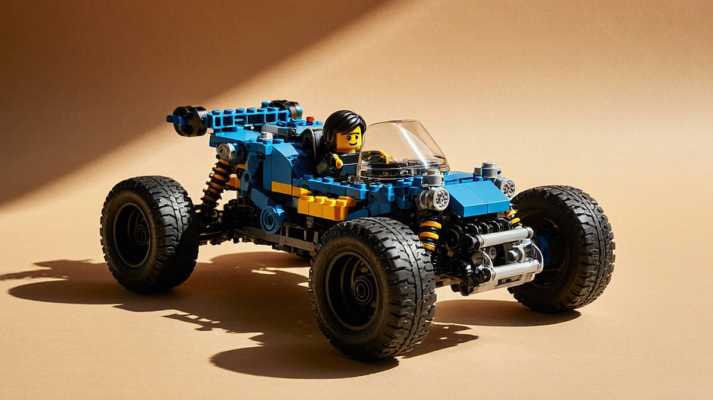

레고 테크닉 시리즈로 재현하는 2026년형 미래 모빌리티의 디테일은 단순한 플라스틱 조립을 넘어, 기계 공학적 호기심을 가진 성인들에게 하나의 '데스크 위 공학 실험실'과 같은 경험을 제공합니다. 20대 후반부터 40대까지의 키덜트 세대가 유독 이 시리즈에 열광하는 이유는 명확합니다. 어린 시절 단순히 모양을 맞추던 놀이에서 벗어나, 이제는 실제 자동차의 구동 원리인 기어비, 서스펜션의 압축과 이완, 그리고 조향 장치의 메커니즘을 내 손으로 직접 구현하며 카타르시스를 느끼기 때문입니다. 특히 2026년을 겨냥한 미래형 모빌리티 콘셉트 모델들은 기존의 내연기관 구조를 넘어 전기차 특유의 레이아웃과 공기역학적 설계를 반영하고 있어, 공학적 지적 욕구를 충족시키기에 충분합니다.

하지만 이런 복잡한 모델은 구매 전 고민이 많을 수밖에 없습니다. 부품 수만 수천 개에 달하고, 완성 후 차지하는 공간도 만만치 않기 때문입니다. 이 글에서는 단순히 신제품의 화려함을 나열하는 대신, 여러분이 이 취미를 지속 가능한 방식으로 즐기기 위해 반드시 확인해야 할 공학적 디테일과 현실적인 공간 제약, 그리고 조립 난이도를 판단하는 기준을 정리해 드립니다.

## 기계적 구조를 이해하는 조립의 즐거움: 단순 조립인가, 공학적 탐구인가

레고 테크닉의 핵심은 '움직임'입니다. 브릭을 쌓아 형태를 만드는 일반 레고와 달리, 테크닉은 핀과 액슬, 기어 부품을 사용하여 내부의 구동계를 완성합니다. 2026년형 미래 모빌리티 모델들은 대체로 복잡한 차동 기어(Differential)나 멀티 링크 서스펜션을 포함하고 있습니다. 

조립 전 판단해야 할 핵심 기준은 '내가 기계적 메커니즘을 확인하며 조립할 인내심이 있는가'입니다. 단순히 겉모습만 완성하고 싶다면 테크닉 시리즈는 가성비가 떨어지는 선택입니다. 하지만 기어의 맞물림이 어떻게 바퀴의 회전으로 이어지는지, 스티어링 휠을 돌릴 때 바퀴의 각도가 어떻게 변하는지 관찰하는 것이 즐겁다면 이보다 완벽한 취미는 없습니다.

실패 케이스를 예로 들어보겠습니다. 많은 초보자가 조립 도중 기어의 위치를 한 칸 어긋나게 끼우는 실수를 범합니다. 일반 레고는 겉에서 보면 그만이지만, 테크닉은 내부 기어가 어긋나면 완성 후 바퀴가 굴러가지 않거나 서스펜션이 제대로 작동하지 않습니다. 이럴 경우 완성된 모델을 다시 분해해야 하는 대참사가 일어납니다. 따라서 조립 시 '기어의 회전 방향과 맞물림'을 매 단계 확인하는 습관이 필수입니다.

선택 기준은 명확합니다. 조립 시간을 하나의 '공학 프로젝트'로 간주할 수 있다면 구매하세요. 만약 며칠 내에 빠르게 완성해서 장식장에 넣는 것만이 목적이라면, 조립 과정에서 오는 피로감이 만족감을 앞설 것입니다.

## 공간과 예산, 그리고 전시 가치를 결정하는 현실적인 체크리스트

미래 모빌리티 모델들은 보통 크기가 상당합니다. 2026년형 콘셉트 디자인을 반영한 모델들은 기존 슈퍼카 라인업보다 전장이 길거나 폭이 넓은 경우가 많습니다. 구매 전 가장 먼저 체크해야 할 것은 '내가 이 모델을 쾌적하게 전시할 공간이 있는가'입니다. 

실전 체크리스트를 제안합니다.
1. 전시 공간 측정: 단순히 모델의 가로세로 길이만 재지 마세요. 먼지 유입을 막기 위한 아크릴 케이스를 씌울 계획이라면 케이스 두께까지 포함해 최소 5cm 이상의 여유가 필요합니다.
2. 조립 환경 확보: 테크닉 모델은 부품이 매우 작고 파편화되어 있습니다. 최소 1미터 이상의 작업대와 부품을 분류할 수 있는 트레이 3~4개가 반드시 필요합니다.
3. 유지비 계산: 단순히 제품 가격뿐만 아니라, 완성 후 전시를 위한 LED 조명 키트나 먼지 청소를 위한 전용 브러시 등 액세서리 비용도 예산에 포함해야 합니다.

실패하기 쉬운 부분은 바로 '공간의 과소평가'입니다. 1/8 스케일의 대형 모델은 책상 위를 점령합니다. 키보드와 마우스를 놓을 자리가 사라지면 결국 모델은 방구석으로 밀려나고, 이는 곧 취미의 단절로 이어집니다. 자신의 책상 면적을 먼저 확인하고, 만약 공간이 좁다면 대형 모델보다는 테크닉 입문용 미들 사이즈 모델로 시작해 공간 활용도를 테스트하는 것이 현명합니다.

## 미래 모빌리티 디자인이 가져온 구조적 변화와 조립의 난이도

최신 미래 모빌리티 모델들은 전기차 플랫폼의 특성을 반영하여 기존 엔진 룸이 있던 자리에 배터리 팩이나 모터 유닛을 배치하는 구조를 취합니다. 이는 조립 측면에서 보면 '부품의 밀집도가 높아졌다'는 뜻입니다. 과거의 내연기관 모델이 피스톤의 왕복을 구현하는 데 집중했다면, 최신 미래형 모델은 모듈식 배터리 팩과 전기 모터 구동계를 재현하는 데 중점을 둡니다.

이러한 변화는 조립 난이도를 높이는 요인이 됩니다. 부품 간의 간격이 좁아지면서 손가락 끝으로 미세한 부품을 끼워 넣어야 하는 상황이 잦아졌습니다. 

선택 기준: 
- 핀을 끼우는 힘이 좋고, 좁은 공간에서 부품을 조립하는 정교함이 있다면 최신 모델을 추천합니다.
- 반면, 손가락 통증이 있거나 시력이 좋지 않아 작은 부품 식별이 어렵다면, 부품 간격이 비교적 여유로운 구형 모델이나 난이도가 낮은 라인업부터 시작하는 것이 좋습니다.

처음 시작하는 분들을 위한 팁은 '조립 시간의 분절'입니다. 한꺼번에 5시간을 투자하기보다, 설명서의 섹션 단위로 나누어 하루에 1~2시간씩 며칠에 걸쳐 조립하세요. 테크닉은 집중력이 흐트러지는 순간 기어 실수가 발생합니다. 뇌가 가장 맑을 때 조립을 시작하고, 피로감이 느껴지면 즉시 멈추는 것이 가장 효율적인 조립 방식입니다.

## 결론: 취향의 깊이를 더하는 실천적 키덜트 라이프

레고 테크닉 시리즈로 미래 모빌리티를 구현하는 과정은 단순한 소비가 아니라, 공학적 원리를 내 손끝으로 확인하는 능동적인 학습 과정입니다. 2026년을 향해가는 미래 모빌리티의 설계를 집 안에서 마주하는 경험은 분명 특별합니다. 하지만 이 취미가 스트레스가 되지 않으려면 자신의 환경을 객관적으로 분석하는 것이 우선입니다.

오늘 제시한 체크리스트와 조립 기준을 통해, 여러분의 다음 모델이 단순한 장식품이 될지, 아니면 일상 속 지적 자극을 주는 소중한 파트너가 될지 결정해 보시기 바랍니다. 충분한 공간과 조립 환경을 확보하고, 기계적 원리를 즐길 준비가 된 상태에서 시작하는 테크닉은 여러분의 취미 생활에 깊이를 더해줄 것입니다. 지금 바로 책상의 여유 공간을 확인하고, 내가 가장 흥미를 느끼는 메커니즘을 가진 모델이 무엇인지 찾아보는 것부터 시작해 보세요. 작은 브릭 하나가 모여 미래의 모빌리티를 완성하듯, 여러분의 취미도 계획적인 선택을 통해 더욱 견고해질 것입니다.

결국 레고 테크닉은 단순히 조립 설명서를 따라가는 과정을 넘어, 미래 모빌리티의 핵심 기계적 원리를 내 손으로 직접 구현해보는 지적인 탐험입니다. 오늘 살펴본 환경 조성과 체계적인 모델 선택 기준은 여러분의 취미 생활이 스트레스가 아닌, 일상의 활력소가 되도록 돕는 든든한 가이드가 되어줄 것입니다.

이제 여러분의 차례입니다. 오늘 당장 책상 위를 정리하고, 내가 구현해보고 싶은 미래의 동력 장치가 무엇인지 찾아보세요. 거창한 시작이 아니어도 좋습니다. 작은 브릭 하나를 맞물리는 순간, 여러분은 이미 2026년형 모빌리티의 설계자가 된 셈이니까요. 계획적인 선택으로 완성된 나만의 모델이 여러분의 공간에서 매일 새로운 영감을 주길 바랍니다. 오늘 저녁, 설레는 마음으로 브릭 박스를 열어보시는 건 어떨까요? 여러분의 즐거운 테크닉 라이프를 진심으로 응원합니다!
