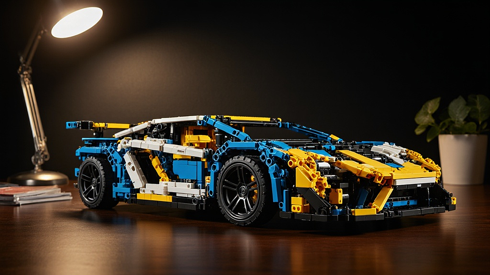

레고 테크닉 시리즈로 즐기는 나만의 데스크테리어와 2026년형 슈퍼카 모델 비교는 단순히 조립의 즐거움을 넘어, 삭막한 사무실 환경을 개인의 정체성이 담긴 공간으로 탈바꿈시키려는 3040 직장인들에게 가장 현실적인 해답이 되고 있습니다. 퇴근 후의 피로를 잊게 해주는 조립의 몰입감과 완성 후 책상 위에서 뿜어내는 기계적인 미학은 단순한 피규어 수집과는 결이 다릅니다. 우리는 왜 지금 이 정교한 플라스틱 조각들에 열광할까요? 그것은 불확실한 업무 성과와 달리, 설명서를 따라 한 단계씩 밟아나가면 반드시 눈앞에 실체가 구현되는 '통제 가능한 성취감' 때문입니다. 책상 위 모니터 옆, 무채색의 사무기기들 사이에 자리 잡은 테크닉 슈퍼카는 당신이 단순히 서류를 처리하는 기계가 아니라, 복잡한 메커니즘을 이해하고 심미적인 가치를 추구하는 주체임을 증명하는 오브제가 됩니다.

## 책상 위 1평의 미학: 슈퍼카 모델 선정의 실전 기준

데스크테리어의 핵심은 '공간의 효율'과 '시각적 무게감'의 균형입니다. 테크닉 시리즈는 일반 레고와 달리 기어, 피스톤, 서스펜션 등 내부 구동계가 그대로 드러나는 디자인이 특징입니다. 따라서 책상 위에 올릴 때는 단순히 크기가 큰 것보다, 내 책상의 깊이와 모니터 배치를 고려한 선택이 필요합니다.

선택의 첫 번째 기준은 '전시 면적'입니다. 보통 1:8 스케일의 대형 모델은 가로 길이가 50cm를 훌쩍 넘깁니다. 만약 모니터 암을 사용해 책상 공간을 확보한 상태라면 이 정도 크기가 압도적인 존재감을 주지만, 서류 작업이 많은 좁은 책상이라면 1:10 혹은 1:12 스케일의 모델이 적합합니다. 

실패하는 사례는 대부분 '멋있어 보여서' 무작정 대형 모델을 샀다가, 키보드와 마우스를 움직일 공간이 부족해져 결국 바닥으로 내려놓는 경우입니다. 이는 데스크테리어의 목적 자체가 상실되는 지점입니다. 

선택 기준을 명확히 합시다. 
1. 책상 깊이가 70cm 미만이라면: 가로 40cm 이하의 중형 모델을 선택해 공간의 여백을 확보하세요.
2. 모니터가 2대 이상인 환경이라면: 높이감이 있는 모델보다는 낮고 길게 뻗은 슈퍼카 형태가 시야를 가리지 않아 훨씬 안정적입니다.
3. 조명 활용: 책상 위 스탠드 조명이 모델의 기어 부품에 반사될 때의 질감을 고려하세요. 유광 파츠가 많은 모델은 직사광선보다 간접 조명 아래에서 더 고급스럽습니다.

## 조립의 몰입이 업무 스트레스에 미치는 영향

테크닉 시리즈의 조립 과정은 일종의 '명상'과 같습니다. 1000개가 넘는 부품을 분류하고, 핀을 꽂고, 기어를 맞물리는 과정은 업무 중 겪는 멀티태스킹의 피로를 씻어냅니다. 특히 기어박스가 제대로 맞물려 바퀴를 굴렸을 때 피스톤이 움직이는 것을 확인하는 순간, 뇌는 단순한 반복 업무에서 벗어나 논리적인 구조를 완성했다는 만족감을 얻습니다.

실제로 제가 사무실 책상에 테크닉 모델을 두기 시작한 이후, 회의 중 막히는 부분이 생길 때 습관적으로 모델의 바퀴를 굴리거나 조향 장치를 돌려보며 생각을 정리하는 습관이 생겼습니다. 이는 멍하니 스마트폰을 보는 것보다 훨씬 생산적인 휴식입니다.

주의해야 할 실수는 '완성 속도'에 집착하는 것입니다. 퇴근 후 매일 1시간씩, 딱 5번의 조립 세션으로 나누어 진행해 보세요. 한 번에 몰아서 조립하면 손가락 통증만 남고, 정작 책상 위에 올려두었을 때 그 모델이 가진 디테일을 충분히 음미할 시간이 부족해집니다.

실전 체크리스트:
- 조립 전 부품 분류: 트레이 3개를 준비해 핀류, 기어류, 패널류로 나누기만 해도 조립 시간이 20% 단축됩니다.
- 구동부 점검: 테크닉은 나중에 껍데기를 씌우면 내부 기어를 수정하기 어렵습니다. 5단계마다 바퀴를 굴려 기어가 헛돌지 않는지 확인하세요.
- 마감: 조립 후 남는 스티커는 가급적 붙이지 않는 것을 권장합니다. 스티커 없이 순수하게 파츠의 색상과 질감으로만 구성된 모델이 훨씬 고급스러운 인테리어 소품으로 보입니다.

## 유지 관리와 커뮤니티 활용법

데스크테리어의 완성은 '관리'입니다. 사무실은 집보다 먼지가 훨씬 많습니다. 특히 테크닉 모델은 틈새가 많아 먼지가 쌓이면 청소하기가 까다롭습니다. 

유지 관리 팁은 간단합니다. 안 쓰는 부드러운 화장용 브러시나 카메라 렌즈용 블로어를 책상 서랍에 하나씩 구비해 두세요. 퇴근 전 1분만 투자해 틈새 먼지를 털어내면, 1년 뒤에도 새것 같은 상태를 유지할 수 있습니다. 만약 먼지가 이미 쌓였다면, 억지로 닦으려 하지 말고 블로어로 강하게 불어내는 것이 파츠 변형을 막는 가장 좋은 방법입니다.

커뮤니티 관점에서는 '수집'보다 '개조'에 주목해야 합니다. 2026년형 라인업에서 특정 모델을 구매했다면, 해당 모델의 부품을 활용해 나만의 컬러 조합으로 일부 패널을 바꾸거나, 전용 LED 키트를 추가해 사무실 분위기에 맞는 조명으로 활용하는 유저들이 많습니다. 이런 커뮤니티 정보는 단순히 제품을 사는 것을 넘어, 내 책상을 하나의 '개인 갤러리'로 만드는 데 큰 도움을 줍니다.

실패하는 케이스는 '타인의 완성작'과 내 것을 비교하며 자괴감을 느끼는 것입니다. 레고는 본질적으로 놀이입니다. 완벽한 전시를 위해 너무 많은 비용을 들여 부품을 추가하기보다는, 내가 조립한 그 상태 그대로의 투박함을 즐기는 태도가 필요합니다.

## 결론: 당신의 책상은 당신의 성취를 보여주는 곳입니다

레고 테크닉 모델을 책상 위에 올리는 행위는 단순히 장난감을 두는 것이 아니라, 당신의 업무 환경에 '엔지니어링의 미학'을 더하는 일입니다. 2026년형 모델들은 이전 세대보다 훨씬 정교해진 서스펜션과 구동계를 자랑하며, 이는 책상 위에서 시각적인 즐거움뿐만 아니라 손끝으로 느끼는 촉각적인 만족감까지 제공합니다.

처음 시작한다면 너무 거대한 모델보다는 자신의 책상 공간에 맞는 적당한 크기의 모델을 선택하고, 조립 자체를 퇴근 후의 짧은 명상 시간으로 활용해 보세요. 먼지 관리라는 작은 습관만 더해진다면, 이 모델들은 단순한 플라스틱 조각이 아니라 당신의 삭막한 일상을 지탱하는 작지만 확실한 성취의 증거가 될 것입니다. 오늘 당장 책상의 여백을 확인하고, 당신의 취향을 투영할 첫 번째 모델을 골라보십시오. 완벽한 인테리어는 거창한 계획이 아니라, 책상 위를 차지한 작은 기계 장치 하나에서 시작됩니다.

레고 테크닉 2026년형 슈퍼카는 단순한 취미를 넘어, 정교한 엔지니어링의 미학을 일상으로 가져오는 특별한 데스크테리어 아이템입니다. 복잡한 기어와 서스펜션을 조립하며 느끼는 몰입감은 바쁜 업무 속 소중한 휴식이 되어줄 것입니다. 

지금 바로 여러분의 책상을 둘러보세요. 빈 공간에 어울릴 만한 작은 모델 하나가 여러분의 업무 환경을 얼마나 근사하게 바꿀 수 있을지 상상해 보는 것만으로도 설레지 않나요? 처음부터 거창할 필요는 없습니다. 조립의 즐거움을 만끽하며 완성된 모델을 책상 위에 올리는 그 순간, 여러분의 공간은 성취감으로 가득 찬 나만의 쇼룸으로 변할 것입니다. 

오늘 퇴근길, 여러분의 취향을 담은 첫 번째 슈퍼카를 골라보세요. 작은 플라스틱 조각들이 모여 일상에 새로운 활력을 불어넣는 마법을 직접 경험해 보시길 바랍니다. 당신의 책상 위에서 시작될 멋진 변화를 응원하겠습니다!
