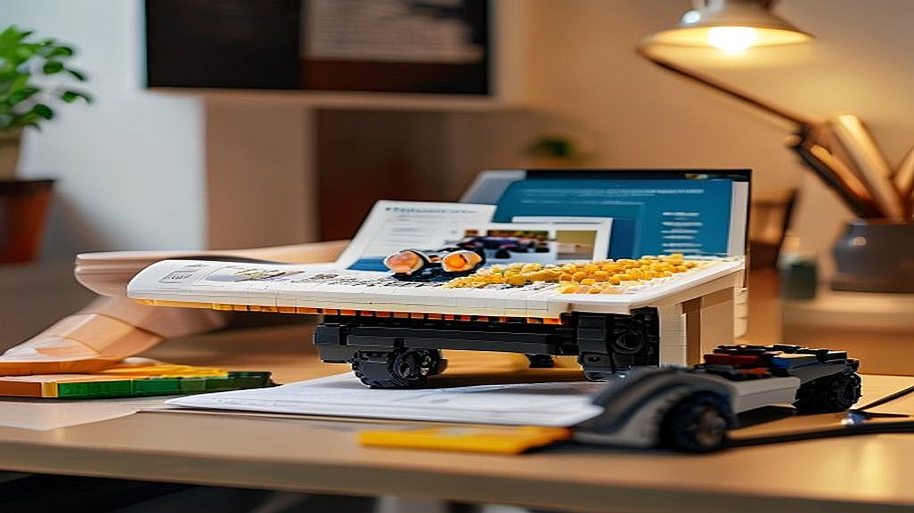

레고 테크닉 시리즈로 구축하는 나만의 데스크테리어는 단순히 책상 위에 장난감을 올리는 행위를 넘어, 반복되는 업무 환경에 뚜렷한 시각적 방점을 찍는 성인 취미의 완성입니다. 20대 후반부터 40대까지, 회사라는 삭막한 공간에서 하루 절반 이상을 보내는 우리에게 책상은 유일하게 통제 가능한 개인 영토입니다. 왜 지금 많은 직장인이 정교한 기어와 프레임으로 구성된 테크닉 시리즈에 열광할까요? 단순히 멋진 결과물 때문이 아닙니다. 모니터 속 무형의 업무 결과물과 달리, 테크닉 시리즈는 조립하는 과정에서 엔진의 피스톤이 움직이고 기어가 맞물리는 물리적 피드백을 확실하게 제공하기 때문입니다. 퇴근 후 혹은 주말, 복잡한 설계도를 따라 부품을 하나씩 맞춰가는 시간은 뇌의 과부하를 끄고 오직 손끝의 감각에만 집중하게 만드는 훌륭한 멘탈 리셋 버튼이 됩니다.

## 기계적 미학으로 채우는 데스크테리어의 기준

데스크테리어의 핵심은 조화와 기능입니다. 테크닉 시리즈는 일반적인 시스템 레고와 달리 외관이 매끄럽지 않고 뼈대와 기계 구조가 그대로 드러납니다. 바로 이 점이 성인의 책상에 어울리는 이유입니다. 너무 알록달록한 색감보다는 금속 질감의 그레이, 블랙, 혹은 강렬한 포인트 컬러가 들어간 제품을 선택해야 모니터, 키보드, 마우스 등 기존 장비와 이질감 없이 녹아듭니다. 

선택의 기준은 명확합니다. 책상의 가로 너비가 1200mm 미만이라면 50cm를 넘지 않는 중형 모델을 선택하세요. 대형 모델은 조립 후 압도적이지만, 모니터 앞에 두면 시야를 가려 오히려 업무 집중도를 떨어뜨립니다. 실패 사례로 자주 꼽히는 경우는 무작정 크고 유명한 슈퍼카 모델을 덜컥 구매하는 것입니다. 책상 위 공간을 고려하지 않은 선택은 결국 조립 후 거실 장식장으로 밀려나게 되며, 책상 위에는 먼지만 쌓이는 결과가 됩니다.

실전 체크리스트를 활용해 보세요. 먼저 조립할 공간의 가로 세로 길이를 측정합니다. 그다음, 테크닉 제품의 완성 사이즈와 비교하십시오. 마지막으로 해당 제품의 색상이 본인의 데스크 매트나 모니터 암의 컬러와 대비를 이루는지 확인합니다. 만약 본인이 미니멀한 화이트 데스크를 사용한다면, 화려한 컬러의 엔진 모델보다는 단색 위주의 기계적 구조물이 훨씬 정돈된 느낌을 줍니다.

## 스트레스 해소와 집중력을 위한 조립 프로세스

테크닉 시리즈는 인내심을 시험하는 취미입니다. 하지만 이 과정 자체가 직장인에게는 명상과 같습니다. 회사에서 겪는 수많은 변수와 달리, 레고는 설명서대로만 하면 반드시 결과가 나옵니다. 이 예측 가능성이 주는 심리적 안정감은 매우 큽니다. 조립을 시작할 때는 한 번에 끝내려 하지 마세요. 하루에 1번씩 봉지 번호 단위로 끊어서 조립하는 것이 좋습니다.

실수하기 쉬운 부분은 기어의 맞물림입니다. 테크닉은 기계적 구조를 구현하기 때문에 내부 기어 하나만 잘못 끼워도 나중에 전체를 분해해야 하는 불상사가 생깁니다. 이를 방지하려면 조립 단계마다 기어가 부드럽게 돌아가는지 손으로 직접 돌려보며 확인해야 합니다. 

처음 시작하는 분들을 위한 기준은 '부품 수 800개 이하의 모델'입니다. 2000개가 넘어가는 대형 모델은 초보자에게 성취감보다 피로감을 줍니다. 작은 모델부터 시작해 테크닉 특유의 핀 결합 방식과 빔 연결 방식을 익히는 것이 중요합니다. 만약 조립 도중 부품이 보이지 않는다면 당황하지 말고 봉지 안쪽 구석을 확인하세요. 작은 핀 부품은 투명 비닐에 붙어 있거나 박스 모서리에 끼어 있는 경우가 많습니다. 조립을 마친 후에는 남은 여분의 핀을 지퍼백에 담아 제품 하단에 보관하십시오. 나중에 이사를 가거나 재배치할 때 반드시 필요합니다.

## 지속 가능한 수집과 공간 활용 전략

테크닉 시리즈는 수집품이면서 동시에 인테리어 오브제입니다. 수집을 지속하려면 공간의 한계를 인정해야 합니다. 책상 위에는 딱 한 대의 메인 모델만 두는 것을 권장합니다. 여러 대를 올리면 '장난감 수집함'처럼 보일 뿐, '데스크테리어'라는 목적을 잃게 됩니다. 새로운 모델을 조립하고 싶다면 이전 모델은 다른 장소로 옮기거나, 혹은 분해하여 보관하는 유연함이 필요합니다.

실제 공간 활용 팁은 '높이'를 활용하는 것입니다. 책상 위 공간이 부족하다면 모니터 받침대 옆이나 책꽂이 상단을 활용하세요. 테크닉 모델은 대개 무게감이 있어 안정적입니다. 다만, 직사광선이 바로 내리쬐는 창가 자리는 피하세요. 레고의 ABS 플라스틱은 자외선에 오래 노출되면 변색이 일어납니다. 

유지비 측면에서도 고민이 필요합니다. 레고는 단종되면 가격이 오르는 경향이 있지만, 재테크 목적으로 접근하면 취미의 즐거움이 사라집니다. 정가에 구매할 수 있는 제품 위주로 선택하고, 할인 기간을 활용하여 구매하는 것이 정신 건강에 좋습니다. 실패 사례 중 하나는 출시된 지 오래된 단종 모델을 웃돈을 주고 구매했다가, 조립 후 디자인이 현재 데스크 환경과 맞지 않아 처분도 못 하고 짐이 되는 경우입니다. 현재 자신의 책상 분위기를 먼저 파악하고, 그에 맞는 최신 제품을 구매하는 것이 가장 현명한 소비입니다.

## 결론: 당신의 책상을 바꾸는 작은 기계적 엔진

레고 테크닉 시리즈는 단순히 조립하는 장난감이 아니라, 당신의 업무 공간에 기계적 정교함과 시각적 활력을 불어넣는 훌륭한 인테리어 오브제입니다. 복잡한 현실에서 벗어나 오직 손끝의 감각에 집중하는 시간은 성인만이 누릴 수 있는 독특한 치유 과정입니다. 오늘 제안한 조립 프로세스와 배치 전략을 참고하여, 여러분의 책상 위에 자신만의 기계적 미학을 구현해 보시기 바랍니다.

처음 시작하는 분이라면 부품 수 800개 이하의 모델로 가볍게 시작하여, 조립의 즐거움을 먼저 느껴보세요. 책상의 여유 공간을 측정하고, 데스크테리어의 전체적인 톤을 고려하여 제품을 선택하는 것만으로도 여러분의 공간은 훨씬 생동감 있게 변할 것입니다. 완벽한 조립 결과물보다는, 조립하는 과정에서 얻는 몰입과 완성 후 책상 위에서 마주하는 작은 기계적 구조물이 주는 만족감에 집중하세요. 이제 여러분의 책상을 단순한 일터에서, 창의적이고 활기찬 개인의 공간으로 탈바꿈시킬 시간입니다. 지금 바로 여러분의 데스크 환경에 어울리는 모델을 찾아보고, 첫 번째 조립을 시작해 보십시오.

레고 테크닉은 단순한 장난감을 넘어, 정교한 기계적 미학과 몰입의 즐거움을 동시에 선사하는 최고의 데스크테리어 아이템입니다. 복잡한 일상에서 잠시 벗어나 손끝의 감각에 집중하는 시간은 여러분의 정신을 맑게 하고, 완성된 작품은 책상 위에 독보적인 활력을 불어넣어 줄 것입니다.

처음 도전하신다면 너무 큰 모델보다는 800피스 이하의 제품으로 가볍게 시작해보세요. 조립 과정에서의 작은 성취감과 완성 후 마주하는 기계적 디테일은 여러분의 업무 공간을 단순한 일터를 넘어 창의적인 영감이 샘솟는 공간으로 탈바꿈시킬 것입니다.

자, 이제 여러분의 데스크테리어를 완성할 첫 번째 모델을 골라볼 시간입니다. 오늘 바로 마음에 드는 제품을 선택해 조립을 시작해 보세요. 책상 위에 놓인 작은 기계 구조물이 주는 특별한 만족감이 여러분의 일상을 어떻게 변화시키는지 직접 경험해 보시길 바랍니다. 여러분만의 멋진 데스크테리어를 응원합니다!
