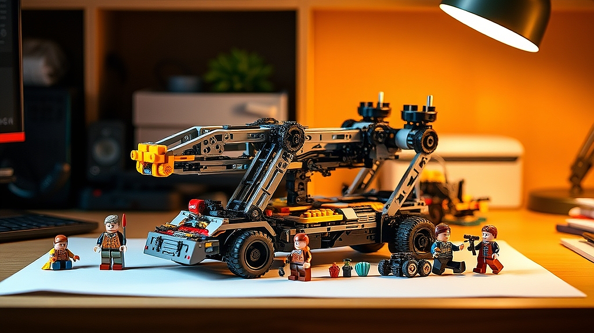

## 30대 직장인의 책상 위, 왜 다시 레고 테크닉이 유행인가

30대 직장인의 책상 위, 왜 다시 레고 테크닉이 유행인지 궁금하다면 지금 당신의 하루를 떠올려 보세요. 모니터 속 쏟아지는 데이터와 쉼 없이 울리는 메신저 알림, 그리고 결정 장애를 유발하는 수많은 비대면 회의 사이에서 우리는 '내 손으로 직접 통제할 수 있는 결과물'에 목말라 있습니다. 디지털 세상의 일은 때로 내가 아무리 공을 들여도 타인의 피드백이나 갑작스러운 기획 변경으로 허무하게 사라지곤 하죠. 반면, 레고 테크닉은 정직합니다. 매뉴얼대로 핀을 꽂고 기어를 맞물리면, 보이지 않던 동력이 전달되어 피스톤이 움직이고 바퀴가 굴러갑니다. 2026년 하반기, 많은 이들이 이 아날로그적 손맛에 다시 열광하는 이유는 단순한 추억 회상을 넘어, 복잡한 업무 환경에서 벗어나 '완벽한 몰입'을 경험할 수 있는 가장 확실한 수단이기 때문입니다.

## 기계적 메커니즘이 주는 뇌과학적 쾌감

레고 테크닉은 일반적인 브릭 조립과 차원이 다릅니다. 블록을 쌓아 형태를 만드는 것을 넘어, 실제 기계의 작동 원리를 내 손으로 재현하는 과정이기 때문입니다. 톱니바퀴가 맞물려 돌아가고, 서스펜션이 눌리며, 조향 장치가 앞바퀴를 움직이는 과정을 목격할 때 뇌는 단순한 시각적 만족을 넘어 '구조적 이해'에서 오는 카타르시스를 느낍니다. 이는 업무 스트레스로 지친 뇌를 '분석적 사고'에서 '감각적 몰입' 상태로 전환하는 아주 효율적인 스위치가 됩니다.

실제 사례를 들어볼까요. 마케팅 기획 업무를 하는 김 대리는 퇴근 후 1시간 동안 테크닉 모델의 엔진 피스톤이 움직이는 기어 박스를 조립합니다. 그는 "기획안이 반려될까 봐 불안해하던 뇌가, 정확하게 맞물려 돌아가는 기어를 보는 순간만큼은 완전히 멈춘다"고 말합니다. 실패 케이스도 있습니다. 조립의 '손맛'을 기대하고 무작정 5,000피스가 넘는 초대형 모델을 덜컥 구매한 경우입니다. 이들은 며칠 만에 조립을 포기하고, 결국 거대한 박스를 창고에 처박아두는 '인테리어 애물단지'를 만들게 됩니다.

선택 기준은 명확합니다. 자신의 현재 집중력과 가용 시간을 먼저 고려해야 합니다. 처음 시작한다면 500피스 내외의 미드 사이즈 모델로 시작하세요. 조립 난이도는 중간 정도이면서도, 기계적 구조를 충분히 맛볼 수 있는 적정선입니다. 시간은 약 5~8시간 정도 소요되며, 주말 오후 두 번에 나누어 완성하기에 적합합니다.

## 데스크테리어로 완성하는 나만의 몰입 공간

레고 테크닉은 단순히 조립하고 끝나는 장난감이 아닙니다. 완성된 결과물은 훌륭한 데스크테리어 소품이 됩니다. 하지만 여기서 흔히 하는 실수가 있습니다. 책상 위에 무조건 큰 모델을 올려두려는 욕심입니다. 30대 직장인의 책상은 이미 모니터, 키보드, 각종 서류들로 복잡합니다. 여기에 너무 큰 모델을 두면 오히려 시각적 피로도가 높아집니다.

실제 공간 활용 팁을 드립니다. 자신의 책상 깊이가 70cm 이하라면, 가로 길이가 30cm를 넘지 않는 모델을 고르세요. 그래야 모니터 옆이나 선반 위에 두었을 때 공간의 여백을 해치지 않으면서도, 조립의 결과물을 감상할 수 있는 시각적 안정감을 줍니다. 실패하는 경우는 모델의 크기만 보고 구매했다가, 정작 책상 위에 올렸을 때 마우스 움직일 공간조차 남지 않아 다시 박스에 넣는 상황입니다. 

선택 체크리스트를 활용해 보세요. 
1. 조립 후 전시할 공간의 가로/세로 길이를 측정했는가? 
2. 해당 모델을 조립하는 데 필요한 최소 40x40cm의 평평한 작업 공간이 확보되었는가? 
3. 조립 후 주기적으로 먼지를 털어낼 수 있는 환경인가? (테크닉 모델은 틈새가 많아 관리가 중요합니다)

이 기준을 통과하지 못한다면, 모델의 멋진 디자인에 현혹되지 말고 더 작은 사이즈로 눈을 낮추는 것이 장기적인 만족도를 높이는 길입니다.

## 실전 시작을 위한 판단 기준과 루틴

레고 테크닉을 시작할 때 가장 고민되는 것은 비용일 겁니다. 하지만 '취미 비용'을 계산할 때 주의할 점이 있습니다. 바로 '시간당 가치'입니다. 15만 원짜리 모델을 사서 20시간을 즐긴다면, 시간당 7,500원꼴로 스트레스를 해소하는 셈입니다. 이는 술자리 한 번이나 넷플릭스 구독료보다 훨씬 생산적인 몰입 경험을 제공합니다.

하지만 주의하세요. 단순히 '멋져 보이니까'라는 이유로 구매하는 것은 100% 실패합니다. 테크닉은 일반 브릭보다 훨씬 더 세밀한 집중력을 요구합니다. 핀 하나를 잘못 끼우면 나중에 전체를 다 뜯어내야 하는 상황이 오기 때문입니다. 처음 시작하는 분들을 위한 실전 체크리스트입니다.

- 조립 전 준비: 트레이 3~4개를 준비해 부품 종류별로 분류하세요. 테크닉은 부품의 모양이 미세하게 다른 경우가 많아 분류가 조립 속도를 2배 이상 높여줍니다.
- 조립 루틴: 하루 최대 1시간 30분을 넘기지 마세요. 집중력이 떨어지면 실수가 잦아지고, 이는 곧 스트레스로 이어집니다.
- 실패 점검: 만약 조립 중 기어가 뻑뻑하게 돌아간다면, 무리하게 힘을 주지 말고 2단계 전으로 돌아가 조립 상태를 확인하세요. 90%는 핀이 끝까지 밀려 들어가지 않았거나 기어 방향이 반대인 경우입니다.

피해야 할 유형은 '완성품의 화려함만 쫓는 사람'입니다. 과정 자체가 즐겁지 않다면, 완성 후에는 그저 먼지 쌓이는 플라스틱 덩어리에 불과합니다. 내가 기계의 작동 원리를 이해하고 조립하는 '과정'에서 즐거움을 느낄 수 있는지, 지난번 조립 취미를 얼마나 오래 유지했는지 스스로에게 물어보세요.

레고 테크닉은 30대 직장인에게 단순한 장난감이 아니라, 디지털 피로에서 벗어나 나만의 속도로 세상을 통제하는 아날로그적 명상 도구입니다. 처음부터 너무 거창한 모델을 고집하지 마세요. 책상 위 작은 공간에 놓인 톱니바퀴 하나가, 내일 아침 업무를 대하는 당신의 태도를 조금 더 차분하고 단단하게 만들어 줄 것입니다. 지금 바로 자신의 책상 공간을 확인하고, 당신의 몰입을 도와줄 첫 번째 모델을 선택해 보시기 바랍니다. 완벽한 결과물보다 중요한 것은, 그 과정을 즐기는 당신의 여유 있는 시간입니다.

## 마치며

레고 테크닉은 단순히 조립하는 장난감을 넘어, 복잡한 일상 속에서 잠시 멈춰 내면의 평온을 찾는 30대 직장인들을 위한 최고의 취미입니다. 기계의 원리를 이해하며 손끝으로 하나씩 맞춰가는 과정은 디지털 기기에 지친 뇌에 휴식을 주고, 스스로 속도를 조절하며 몰입하는 즐거움을 선사합니다.

완성된 결과물에만 집착하기보다는, 톱니바퀴가 맞물려 돌아가는 그 조용한 과정 자체를 온전히 누려보세요. 거창한 시작이 아니어도 좋습니다. 오늘 당장 퇴근길에 책상 위에 올릴 작은 모델 하나를 골라보는 건 어떨까요? 복잡한 업무와 스트레스는 잠시 접어두고, 오롯이 나에게 집중하는 아날로그 명상의 시간을 통해 내일의 당신을 더 단단하고 차분하게 만들어 보세요. 지금 당신의 책상 위, 작은 기계 장치가 선사할 뜻밖의 성취감을 직접 경험해 보시길 바랍니다. 당신의 즐거운 몰입을 응원합니다!
