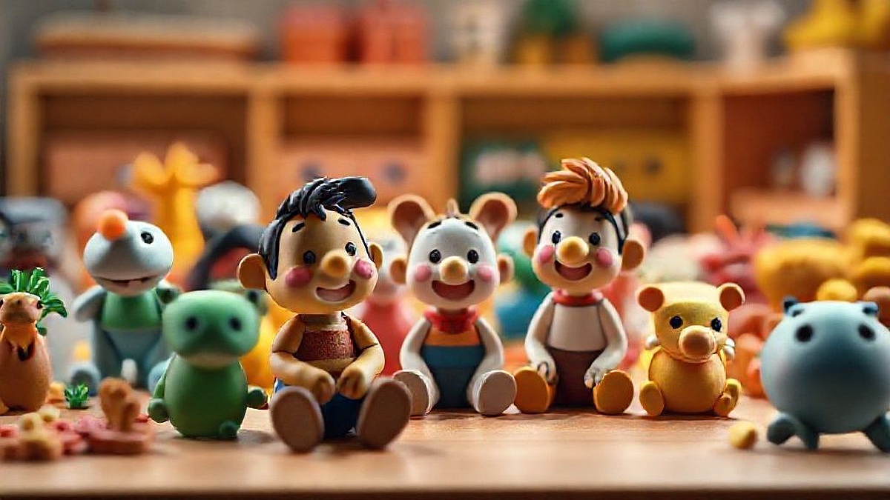

어릴 적, 백화점 장난감 코너 앞에서 침만 꿀꺽 삼키던 그 추억, 40대가 된 지금도 생생하게 떠오릅니다. 특히 당시에는 감히 엄두도 못 냈던 **한정판**이라는 이름의 물건들은 마치 꿈속의 보물처럼 느껴졌죠. 지금은 저도 어엿한 키덜트 수집가로서 다양한 피규어와 레고를 소장하고 있지만, 여전히 '한정판'이라는 단어는 제 가슴을 설레게 하고, 때로는 밤잠을 설치게 만드는 마법 같은 힘을 가지고 있습니다. 단순한 소유를 넘어선, 그 시절의 저를 위로하고 현재의 저에게 소소한 행복을 안겨주는 한정판의 매력은 정말이지 거부하기 어렵습니다. 단순히 희귀하다는 이유만으로 지갑을 열게 되는 건 아니에요. 그 안에는 과거의 향수, 미래의 가치, 그리고 무엇보다 나만의 특별한 이야기가 담겨 있기 때문이죠. 오늘은 제가 오랜 시간 한정판이라는 이름 아래 울고 웃으며 쌓아온 경험들을 여러분과 함께 나누고 싶습니다. 어떤 한정판이 진정한 가치를 지니는지, 어떻게 하면 후회 없는 수집 생활을 이어갈 수 있는지, 그리고 이 취미가 우리 삶에 어떤 즐거움을 더해주는지에 대해 솔직하게 이야기해볼까 합니다. 물론 저의 실패담도 가감 없이 풀어놓을 테니, 부디 여러분은 저처럼 눈물 젖은 빵을 먹지 않으시길 바라요.

## 한정판, 그 묘한 매력에 빠져들다: 단순한 물건을 넘어선 추억의 조각

제가 한정판의 세계에 발을 들인 건, 순전히 어릴 적 해소되지 못한 욕구 때문이었습니다. 70년대 후반, 80년대 초반을 살았던 저에게 당시 만화 속 주인공 로봇은 그야말로 꿈의 존재였죠. 그런데 그 로봇 완구 중에서도 특정 상점에서만 구할 수 있다거나, 특정 기간에만 판매하는 '특별판'이 있다는 소문을 들으면, 어린 마음에 얼마나 애가 탔는지 모릅니다. 부모님께 졸라도 '집에 있는 로봇이랑 똑같은데 뭐 하러 또 사니?'라는 답변만 돌아왔죠. 그 좌절감은 성인이 되어서도 마음 한구석에 남아있었습니다. 그러다 30대 중반, 우연히 인터넷 커뮤니티에서 제가 어릴 적 그토록 갖고 싶어 했던 로봇의 20주년 기념 한정판 피규어가 발매된다는 소식을 접했습니다. 보자마자 '아, 이건 진짜 사야 해!'라는 생각이 머릿속을 지배했죠. 그때의 저는 과거의 저에게 선물을 주는 기분으로, 망설임 없이 구매 버튼을 눌렀습니다.

막상 손에 넣고 보니, 그 피규어는 단순한 플라스틱 조형물이 아니었습니다. 어린 시절의 제가 꿈꾸던 모든 것이 응축된 보물 같았죠. 그 피규어를 보면서 저는 학창 시절 친구들과 모여 만화 이야기를 하던 순간들, 용돈을 모아 극장판 만화를 보러 가던 설렘, 그리고 그 로봇처럼 강해지고 싶었던 순수한 열망을 다시금 느낄 수 있었습니다. 이렇듯 한정판은 단순히 희귀하다는 이유만으로 매력적인 것이 아닙니다. 그것은 우리 내면의 기억과 감정을 건드리고, 잊고 지냈던 유년의 순수함을 다시 일깨워주는 매개체 역할을 합니다. 특히 40대가 된 지금, 경제적인 여유가 생기면서 어릴 적 꿈을 현실로 만드는 과정 자체가 저에게는 큰 위로이자 행복이 됩니다. 한정판이라는 이름표가 붙는 순간, 그 물건은 더 이상 공장에서 찍어낸 대량 생산품이 아니라, 저만의 특별한 의미를 지닌 유일무이한 존재로 변모하는 것이죠. 이처럼 감성적인 연결고리가 바로 제가 한정판의 묘한 매력에 헤어나오지 못하는 가장 큰 이유입니다. 수많은 컬렉터들이 한정판에 열광하는 것도 결국은 이런 감성적인 만족감 때문일 거라고 확신합니다.

## 현명한 한정판 수집, 실패는 줄이고 만족은 높이는 노하우

한정판 수집이 늘 즐겁기만 한 건 아닙니다. 저도 여러 번의 시행착오를 겪으며 쓴맛을 보기도 했죠. 가장 기억에 남는 실패는 5년 전쯤, 한 유명 캐릭터의 특정 색상 한정판 피규어를 구매했을 때였습니다. 당시 커뮤니티에서는 '이 색상은 역대급 희귀작이 될 것'이라는 분위기가 지배적이었고, 저 역시 FOMO(Fear Of Missing Out)에 휩싸여 꽤 높은 프리미엄을 주고 구매했습니다. 그런데 막상 받아보니 도색 상태가 엉망이었고, 몇 달 뒤에는 더 멋진 디자인의 새로운 한정판이 줄줄이 쏟아져 나오면서 제가 구매했던 피규어의 가치는 급락했습니다. 결국 저는 그 피규어를 보면서 '왜 그랬을까' 하는 후회만 남았죠.

이런 경험을 통해 저는 한정판 수집에 있어서 '현명함'이 얼마나 중요한지 깨달았습니다. 2025년 현재, 한정판 시장은 더욱 복잡하고 빠르게 변화하고 있습니다. 단순히 '한정판'이라는 이름만 믿고 달려들었다가는 저처럼 후회할 수 있어요. 그래서 저는 다음 세 가지 원칙을 꼭 지키라고 조언하고 싶습니다.

첫째, **철저한 사전 조사와 정보 수집**입니다. 특정 한정판이 나온다고 하면, 바로 구매 버튼을 누르기 전에 해당 브랜드의 평판, 과거 한정판의 품질 논란 여부, 그리고 무엇보다 **실제 제품 이미지**를 꼼꼼히 확인해야 합니다. 온라인 커뮤니티나 유튜브 리뷰 채널은 훌륭한 정보원입니다. 다른 컬렉터들의 솔직한 의견을 들어보고, 가능하다면 실물을 본 사람들의 후기를 찾아보세요. 단순히 '한정판'이라는 마케팅 문구에 현혹되지 않고, 실제로 내가 만족할 만한 품질인지 냉정하게 판단하는 것이 중요합니다. 특히 최근에는 디지털 아트나 NFT 형태의 한정판도 많아지고 있는데, 이때는 해당 디지털 자산의 *진정성*과 *소유권 증명 방식*을 명확히 이해해야 합니다. 블록체인 기반의 디지털 인증서가 제공되는지, 재판매 시 소유권 이전이 명확한지 등을 확인하는 것이 필수적입니다.

둘째, **나만의 기준과 선호도를 명확히 하는 것**입니다. 모든 한정판을 다 모을 수는 없습니다. 아니, 모을 필요도 없죠. 저는 이제 제가 진정으로 좋아하는 캐릭터나 테마, 그리고 저의 수집 공간에 어울리는 제품만을 선택합니다. 예를 들어, 저는 특정 로봇 시리즈의 초기 디자인을 선호하기 때문에, 아무리 새로운 한정판이 나와도 초기 디자인에서 크게 벗어나는 제품은 구매하지 않습니다. 리셀 가치를 고려하는 것도 중요하지만, 가장 우선시되어야 할 것은 **나의 만족감**입니다. 나에게 어떤 의미를 주는지, 나를 얼마나 행복하게 할 수 있는지 스스로에게 질문해봐야 합니다. 억지로 구매한 한정판은 결국 찬장 한구석에 박혀 빛을 보지 못하게 될 테니까요.

셋째, **리셀 가치에 대한 현실적인 기대와 접근**입니다. 한정판은 종종 투자 가치를 지닌다고 여겨지지만, 모든 한정판이 미래에 높은 프리미엄을 보장하는 것은 아닙니다. 오히려 대부분은 출시가를 크게 웃돌지 못하거나, 심지어 가치가 떨어지는 경우도 허다합니다. 저는 이제 리셀 가치를 *수집의 부수적인 요소*로 생각합니다. 정말 희귀하고, 역사적인 의미를 지니며, 꾸준히 수요가 있는 브랜드의 한정판은 분명 가치가 오를 여지가 있습니다. 하지만 단순히 '한정판'이라는 이유만으로 구매하는 것은 도박과 다름없습니다. 예를 들어, 유명 블록 완구사의 특정 테마 한정판은 시간이 지나도 꾸준히 인기를 유지하며 가치가 오르는 경향이 있지만, 유행에 민감한 캐릭터 피규어는 인기가 식으면 가치가 급락할 수 있습니다. 2025년에는 특히 *지속 가능성*을 강조하는 한정판들이 주목받고 있습니다. 친환경 소재를 사용하거나, 특정 사회적 메시지를 담은 제품들은 단순히 희소성뿐만 아니라 '의미 있는 소비'라는 측면에서 새로운 가치를 창출하기도 합니다. 리셀 가치를 판단할 때는 이러한 트렌드와 함께, **생산 수량, 브랜드 파워, 제품의 보존 상태** 등을 종합적으로 고려해야 합니다. 박스 미개봉 상태(미개봉)를 유지하거나, 전용 케이스에 보관하는 등 구매 후 관리도 리셀 가치에 큰 영향을 미친다는 점을 잊지 마세요.

## 한정판 컬렉션, 단순한 소유를 넘어선 가치와 즐거움

한정판을 수집하는 행위는 단순히 물건을 모으는 것을 넘어섭니다. 그것은 저에게 하나의 예술 작품을 창조하는 과정과도 같습니다. 저는 거실 한편에 저만의 작은 박물관을 꾸며 놓았습니다. 유리 장식장 안에 제가 아끼는 한정판 피규어와 레고 세트들을 테마별로 배치하고, 조명까지 신경 써서 설치했죠. 퇴근 후 지친 몸을 이끌고 집에 돌아와, 불을 켜고 이 컬렉션을 바라보면 하루의 피로가 싹 가시는 기분입니다. 특히 친구들이나 조카들이 집에 놀러 와서 '와, 삼촌 이거 진짜 멋있다! 이건 어떻게 구했어요?'라고 물어볼 때면, 제가 그 한정판을 손에 넣기까지의 드라마틱한 과정을 신나게 이야기해주곤 합니다. 그때의 뿌듯함은 정말이지 말로 다 표현할 수 없습니다.

제게 한정판 컬렉션은 단순히 물건의 전시가 아니라, **저의 역사와 취향을 보여주는 거울**입니다. 각 한정판에는 그것을 구매하기 위해 얼마나 많은 정보를 찾아보고, 어떤 노력을 기울였는지, 그리고 그것이 제게 어떤 의미를 지니는지에 대한 이야기가 담겨 있죠. 예를 들어, 제가 힘들었던 시기에 스스로에게 선물했던 특정 한정판 레고는 단순한 블록이 아니라, 그 시절의 저를 위로하고 다시 일어설 용기를 주었던 소중한 상징이 됩니다. 컬렉션을 통해 저는 과거의 저와 소통하고, 현재의 저를 돌아보며, 미래의 저에게 새로운 에너지를 부여받습니다.

또한, 한정판 수집은 저를 **다양한 사람들과 연결해주는 통로**가 되기도 합니다. 온라인 커뮤니티에서 같은 한정판을 수집하는 사람들과 정보를 공유하고, 새로운 제품이 나올 때마다 함께 설레어하며, 때로는 오프라인 모임을 통해 직접 만나 서로의 컬렉션을 자랑하고 감상하는 즐거움은 이 취미의 큰 부분입니다. 이런 교류를 통해 저는 수집에 대한 새로운 시각을 얻기도 하고, 미처 몰랐던 제품의 역사나 숨겨진 이야기들을 알게 되면서 컬렉션에 대한 애정이 더욱 깊어지곤 합니다. 2025년에는 이러한 커뮤니티 활동이 더욱 활발해지고, 단순히 정보를 공유하는 것을 넘어, 컬렉터들끼리 직접 한정판 제품을 *교환하거나 공동 구매하는* 등 더욱 적극적인 형태로 발전하고 있습니다. 특히 한정판의 진위 여부를 블록체인으로 확인하는 기술이 보편화되면서, 이러한 교환 및 거래 활동의 신뢰도가 더욱 높아지는 추세입니다.

결론적으로, 한정판 컬렉션은 저에게 단순한 소유의 기쁨을 넘어선 **다층적인 가치**를 제공합니다. 그것은 어린 시절의 꿈을 현실로 만드는 만족감, 나만의 공간을 아름답게 꾸미는 즐거움, 그리고 같은 취미를 공유하는 사람들과 소통하며 느끼는 유대감까지 포함합니다. 물론 컬렉션을 유지하는 데에는 적지 않은 노력과 비용이 들어갑니다. 먼지 제거부터 시작해서 습도 조절, 자외선 차단 등 세심한 관리가 필요하죠. 하지만 이러한 노력조차도 저에게는 컬렉션에 대한 애정을 표현하는 소중한 과정입니다. 한정판은 저에게 삶의 활력소이자, 지친 일상 속에서 잠시나마 동심으로 돌아갈 수 있게 해주는 마법 같은 존재입니다.

## 한정판, 그 매혹적인 여정의 끝에서

오늘 제가 나눈 이야기들이 여러분에게 한정판 수집의 매력과 현명한 접근법을 이해하는 데 조금이나마 도움이 되었기를 바랍니다. 한정판은 단순히 희귀한 물건이 아닙니다. 그것은 어린 시절의 꿈을 다시 만나게 해주고, 우리 삶에 특별한 의미와 즐거움을 더해주는 소중한 매개체입니다. 저처럼 40대가 되어 어릴 적 이루지 못했던 소망을 한정판을 통해 채우는 분들도 계실 테고, 젊은 세대들은 새로운 트렌드의 한정판에서 자신만의 가치를 발견하기도 할 겁니다.

물론, 무분별한 구매는 후회로 이어질 수 있습니다. 제가 겪었던 실패담처럼, 때로는 FOMO에 휩쓸려 충동적인 결정을 내리기도 하죠. 하지만 중요한 것은 그러한 경험을 통해 배우고, 자신만의 확고한 기준을 세워나가는 과정이라고 생각합니다. 철저한 사전 조사, 나만의 확고한 취향, 그리고 리셀 가치에 대한 현실적인 인식을 바탕으로 현명하게 수집한다면, 여러분의 한정판 컬렉션은 단순한 물건의 집합을 넘어 삶을 풍요롭게 하는 예술 작품이자 추억의 보물창고가 될 것입니다. 여러분도 혹시 마음속에 품고 있는 '그 한정판'이 있으신가요? 너무 망설이지 마세요. 하지만 구매하기 전에 꼭 한 번 더 자신에게 물어보세요. '이것이 나에게 어떤 의미를 줄까?'라고요. 그 질문에 대한 답이 명확하다면, 여러분의 수집 여정은 분명 후회 없는 즐거움으로 가득할 겁니다.