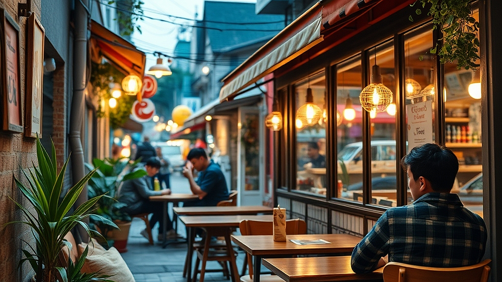

로컬마케팅과 브랜딩의 결합은 이제 단순히 동네 상권을 홍보하는 차원을 넘어, 그 지역만이 가진 고유한 맥락을 소비자의 취향과 연결하는 정교한 전략으로 진화하고 있습니다. 2026년으로 향하는 지금, 거대 프랜차이즈의 규격화된 서비스가 주는 편의성보다 특정 동네의 분위기와 그곳을 운영하는 사람의 철학이 담긴 작은 가게가 더 강력한 구매 동기가 됩니다. 소비자는 이제 '어디에나 있는 것'이 아니라 '여기서만 경험할 수 있는 것'을 찾기 위해 기꺼이 이동합니다. 로컬 크리에이터들이 주목받는 이유는 단순히 그들이 만든 제품이 좋아서가 아니라, 동네의 가치를 재발견하고 그것을 자신만의 언어로 해석해냈기 때문입니다. 이 글에서는 막연하게 동네의 특색을 살리겠다는 다짐을 넘어, 실제로 어떤 기준을 가지고 브랜딩을 설계해야 고객의 발길을 붙잡을 수 있는지 실무적인 관점에서 분석합니다. 브랜드가 사람들의 놀이 욕구를 건드리고 지속 가능한 팬덤을 구축하기 위해 당장 확인해야 할 지표들을 정리했습니다.

## 동네의 가치를 발견하는 관찰의 기술

로컬 브랜딩의 핵심은 '우리 동네가 특별하다'는 것을 증명하는 것이 아니라, '우리 동네의 불편함이나 특징이 누군가에게는 즐거운 발견이 될 수 있음'을 보여주는 데 있습니다. 많은 창업자가 동네의 역사를 나열하거나 억지로 지역색을 입히려는 실수를 범합니다. 대신 여러분이 운영하는 가게가 위치한 골목의 '보통의 시간'을 관찰하세요.

구체적인 사례로, 오래된 주택가 골목에서 카페를 운영하는 사례를 들어보겠습니다. 이곳의 실패 사례는 '세련된 인테리어'만 강조하여 동네의 맥락과 동떨어진 공간을 만드는 것입니다. 주변은 낡은 빌라와 조용한 주택인데, 가게 내부만 화려한 조명과 차가운 철제 가구로 채우면 손님은 이질감을 느낍니다. 반면, 성공하는 브랜드는 골목의 낮은 담벼락 높이나 오후 4시에 골목으로 들어오는 햇빛의 각도를 인테리어에 반영합니다. 

선택 기준은 명확합니다. '이 가게가 이 동네에 없었을 때, 주민들은 무엇을 아쉬워했는가'에 답할 수 있어야 합니다. 만약 주변에 1인 가구가 많다면, 거창한 식사 메뉴보다 퇴근길에 가볍게 들러 책을 읽거나 짧은 대화를 나눌 수 있는 30분 단위의 경험이 더 가치 있습니다. 

실전 체크리스트를 제안합니다. 첫째, 가게 반경 500미터 이내의 사람들이 주말 오후에 주로 무엇을 하는지 관찰하세요. 둘째, 그들이 편의점에서 사는 물건이 무엇인지 확인하세요. 셋째, 그들이 우리 가게에 들어올 때 입고 있는 옷차림과 가지고 있는 소지품을 보세요. 이 데이터가 바로 여러분이 팔아야 할 '동네의 가치'입니다. 만약 동네 사람들이 등산복을 주로 입는다면, 화려한 디저트보다는 든든한 로컬 재료의 간식이 훨씬 높은 전환율을 보입니다.

## 로컬 브랜딩의 실전 체크리스트와 측정 지표

브랜딩은 추상적인 가치가 아니라 측정 가능한 행동의 결과여야 합니다. 로컬 마케팅에서 가장 흔한 실수는 '좋아요'나 '팔로워 수'에 집착하는 것입니다. 동네 기반의 비즈니스는 매일 마주치는 이웃과 단골의 밀도가 수익을 결정합니다.

실패하기 쉬운 케이스는 대형 프랜차이즈의 마케팅 방식을 그대로 모방하는 것입니다. 전단지를 뿌리거나 무작위적인 할인 쿠폰을 발행하는 것은 로컬 브랜드의 희소성을 갉아먹습니다. 대신 '우리 동네만의 규칙'을 만드세요. 예를 들어, 동네 주민임을 인증하면 특정 시간대에 혜택을 주거나, 동네의 특정 장소에서 찍은 사진을 가져오면 메뉴를 업그레이드해 주는 방식입니다. 이는 고객이 동네를 더 깊이 탐색하게 만드는 놀이 기제가 됩니다.

핵심 측정 지표는 '재방문 주기가 짧아지는가'와 '고객이 주변 사람에게 우리 가게를 소개할 때 어떤 단어를 사용하는가'입니다. 후자는 아주 중요한데, 고객이 친구에게 "거기 맛집이야"라고 말하는 것과 "우리 동네에 이런 곳이 있는데, 진짜 동네 분위기랑 잘 어울려"라고 말하는 것은 브랜드의 생명력이 다릅니다. 후자의 경우, 고객은 이미 브랜드를 자신의 정체성과 동일시하고 있는 것입니다.

선택 기준은 다음과 같습니다. 마케팅 비용을 투입할 때, 이것이 '가게를 알리는 비용'인지 '가게의 가치를 높이는 비용'인지 구분하세요. 전자는 일회성 유입을 만들지만, 후자는 팬을 만듭니다. 1인 운영자라면 홍보 게시물 10개를 올리는 시간보다, 방문한 손님 1명과 나누는 5분의 깊은 대화가 장기적으로는 더 큰 자산이 됩니다. 로컬은 결국 관계의 밀도에서 승부가 납니다.

## 지속 가능한 로컬 브랜드의 생존 전략

로컬 브랜드가 규모의 경제를 이기려면 '대체 불가능한 맥락'을 만들어야 합니다. 하지만 많은 창업자가 운영 난이도를 고려하지 않고 무리한 확장이나 과도한 메뉴 구성을 시도합니다. 이는 고정비를 높여 경영을 어렵게 만드는 주원인이 됩니다.

실패하는 케이스는 동네의 특성을 살리겠다며 너무 복잡한 로컬 커뮤니티 프로그램을 운영하는 것입니다. 본업인 제품이나 서비스의 질이 흔들리면 커뮤니티는 사상누각이 됩니다. 성공하는 브랜드는 자신의 핵심 제품(커피, 빵, 굿즈 등)의 품질을 유지하면서, 그 주변에 아주 작은 곁들이 문화를 얹습니다. 예를 들어, 퇴근 시간 직전 1시간 동안만 동네 사람들을 위한 작은 음악을 틀어주거나, 특정 요일에만 동네의 사연을 담은 메뉴를 내놓는 식입니다.

운영 난이도를 낮추기 위한 전략으로 '한정적 운영'을 추천합니다. 매일 똑같은 서비스를 제공해야 한다는 강박에서 벗어나세요. 화요일은 '동네 기록의 날', 수요일은 '조용한 독서의 날'처럼 공간의 성격을 규정하면 손님들도 그에 맞춰 소비 패턴을 바꿉니다. 이는 공급자에게는 운영 효율을 높여주고, 소비자에게는 방문의 명분을 만들어줍니다.

피해야 할 조건은 '모두를 위한 브랜드'가 되려는 시도입니다. 로컬 브랜드는 '모두'를 만족시킬 필요가 없습니다. 동네의 특정 취향을 가진 100명만 확실하게 사로잡으면, 그들이 스스로 입소문을 내며 브랜드를 지탱합니다. 여러분이 가진 공간이 5평이라면 5평에 맞는 밀도 높은 경험을 설계하세요. 100평짜리 프랜차이즈와 경쟁하지 말고, 5평짜리 동네 사랑방으로서의 역할을 수행하는 것이 훨씬 강력한 브랜딩입니다.

로컬 브랜딩은 거창한 전략보다 동네를 향한 섬세한 시선에서 시작됩니다. 동네의 가치를 재발견한다는 것은 그곳에 사는 사람들의 일상을 존중하고, 그 일상 속에 여러분의 브랜드가 자연스럽게 녹아들게 만드는 과정입니다. 프랜차이즈가 흉내 낼 수 없는 것은 사장의 말투, 가게 구석에 놓인 동네 잡지, 그리고 창밖으로 보이는 동네의 풍경과 어우러지는 메뉴입니다. 지금 당장 가게 문을 열고 밖으로 나가보세요. 여러분의 가게가 위치한 골목의 공기와 사람들의 표정에서 브랜딩의 힌트를 찾을 수 있을 것입니다. 브랜드는 결국 사람이 만드는 관계의 총합이며, 로컬은 그 관계가 가장 따뜻하게 맺어질 수 있는 무대입니다. 오늘부터라도 우리 동네만의 작은 특징을 하나씩 기록해보고, 그것을 메뉴판이나 인테리어의 작은 구석에 녹여보시기 바랍니다. 고객은 여러분의 정성 어린 관찰을 반드시 알아보고, 그 동네를 다시 찾게 될 것입니다.

## 마치며

결국 로컬 브랜딩의 핵심은 규모가 아닌 '진심'에 있습니다. 동네의 사소한 일상과 사람들의 표정을 관찰하고, 그 따뜻한 관계를 브랜드에 담아낼 때 비로소 우리 가게는 대체 불가능한 동네의 명소가 됩니다. 거창한 마케팅보다 우리 동네만의 색깔을 담은 작은 디테일이 고객의 마음을 움직이는 가장 강력한 무기가 된다는 사실을 기억해 주세요.

지금 바로 여러분의 가게를 둘러싸고 있는 골목으로 나가보세요. 그곳에서 발견한 사소한 특징 하나를 메뉴판 한 귀퉁이나 가게 한구석에 녹여내는 것부터 시작해보는 건 어떨까요? 여러분의 섬세한 시선이 깃든 공간은 고객들에게 단순한 가게를 넘어, 다시 찾고 싶은 다정한 일상의 일부가 될 것입니다. 오늘부터 우리 동네라는 무대 위에서 여러분만의 멋진 이야기를 하나씩 써 내려가 보시길 응원하겠습니다. 여러분의 브랜드가 동네와 함께 더 깊게 뿌리내리기를 진심으로 바랍니다.
