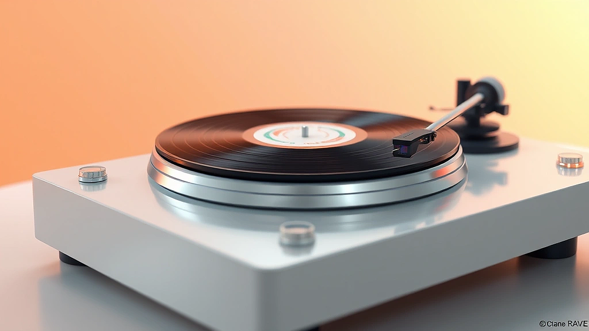

# LP판, 그 바늘 끝에서 시작되는 진짜 음악 이야기

**LP판**의 매력에 대해 이야기해볼까 해요. 제 방 한쪽 벽면을 가득 채운 이 까만 원반들은 단순한 음악 저장 매체를 넘어, 제게는 지난 시간의 기록이자 가장 깊은 위로를 주는 친구 같은 존재랍니다. 처음 LP의 세계에 발을 들인 건, 먼지 쌓인 아버지의 창고에서 우연히 발견한 퀸(Queen)의 <A Night at the Opera> 앨범 때문이었어요. 스트리밍으로 수백 번은 들었던 ‘Bohemian Rhapsody’였지만, 턴테이블에 LP를 올리고 바늘을 내리는 그 순간의 정적, 그리고 ‘치직’하는 노이즈와 함께 흘러나오는 프레디 머큐리의 목소리는 완전히 다른 차원의 경험이었죠. 마치 1975년의 녹음실에 제가 함께 앉아있는 듯한 착각마저 들게 했으니까요.

요즘 어딜 가나 LP, 바이닐(Vinyl) 이야기가 들려옵니다. 누군가는 그저 유행이라 말하고, 누군가는 불편함을 감수하는 비효율적인 취미라고도 하죠. 하지만 저는 단호하게 말할 수 있어요. 이것은 단순한 복고 열풍을 넘어, 음악을 ‘소유’하고 ‘집중’해서 듣는 행위의 가치를 재발견하는 과정이라고요. 터치 한 번이면 세상 모든 음악을 들을 수 있는 시대에, 굳이 한 장의 앨범을 위해 기꺼이 시간과 노력을 들이는 사람들이 늘어나는 이유. 오늘 그 깊고 따뜻한 LP의 세계로 여러분을 초대하려 합니다. 제 실패담과 소소한 팁까지 모두 담아서요.

## 왜 우리는 다시 LP에 빠져드는가?

스마트폰으로 음악을 듣는 게 너무나 당연한 시대에, 왜 우리는 거추장스럽고 손 많이 가는 LP에 다시 열광하는 걸까요? 그건 아마도 ‘효율’과 ‘편리’가 채워주지 못하는 어떤 감성적 허기를 LP가 정확히 채워주기 때문일 거예요. LP를 듣는 과정은 하나의 정성스러운 의식(Ritual)과도 같습니다. 비닐 포장을 조심스럽게 뜯고, 묵직한 디스크를 꺼내 턴테이블 위에 올린 뒤, 먼지떨이로 표면을 부드럽게 닦아내죠. 그리고 숨을 참고 바늘을 첫 번째 트랙의 시작 홈에 정확히 내리는 그 순간. 이 모든 과정은 음악을 듣기 위한 ‘준비’이자, 그 음악에 대한 ‘존중’의 표현이 아닐까 싶어요.

제가 정말 힘들었던 시기에, 쳇 베이커(Chet Baker)의 <Chet Baker Sings> LP를 들으며 밤을 지새운 적이 있어요. 스트리밍으로 들을 땐 그저 배경음악처럼 흘러가던 그의 쓸쓸한 트럼펫 소리와 나른한 목소리가, LP를 통해 들려올 땐 마치 제 귓가에 대고 직접 속삭여주는 것 같았죠. **바늘이 레코드의 소릿골을 긁으며 만들어내는 미세한 잡음과 함께 들려오는 그 소리는, 완벽하게 가공된 디지털 음원에서는 느낄 수 없는 인간적인 온기를 품고 있었어요.** "이 곡 들으면서 정말 위로받았어요"라는 말이 절로 나왔던 순간입니다. 바로 이 ‘따뜻함’이 아날로그 사운드의 가장 큰 매력일 텐데요, 이걸 기술적으로 간단히 풀어보자면, 소리의 파형을 그대로 기록하는 아날로그 방식과, 그 파형을 0과 1의 디지털 신호로 잘게 쪼개 기록하는 디지털 방식의 차이에서 비롯돼요. LP는 끊어지지 않는 연속적인 정보이기에, 우리 귀에 훨씬 자연스럽고 편안하게 들리는 거죠.

이런 감성적 만족감은 실제 데이터로도 증명됩니다. 미국 음반 산업 협회(RIAA)의 연례 보고서에 따르면, LP 판매량은 2006년 이후 17년 연속 성장하며 2022년에는 CD 판매량을 35년 만에 앞질렀습니다. 2023년 미국에서만 4,300만 장 이상의 LP가 팔렸다고 하니, 이건 더 이상 일부 마니아들의 취미가 아닌 거대한 문화 현상인 셈이죠. 테일러 스위프트나 빌리 아일리시 같은 팝스타들이 앨범을 낼 때마다 다양한 색상의 컬러 바이닐을 한정판으로 출시하는 것만 봐도, LP가 현세대 아티스트와 팬들에게 얼마나 중요한 소통 방식이 되었는지 알 수 있습니다.

## 나의 첫 LP와 턴테이블: 실패 없는 입문 가이드

LP의 매력에 막 눈을 뜬 분들이 가장 먼저 부딪히는 장벽이 바로 ‘어떤 턴테이블을 사야 할까?’일 겁니다. 저도 그랬거든요. 솔직히 고백하자면, 제 첫 턴테이블은 정말 끔찍한 선택이었습니다. 예쁜 디자인에 혹해서 10만 원대 초반의 여행 가방처럼 생긴 올인원 턴테이블을 샀는데, 그게 제 소중한 첫 LP 몇 장을 망가뜨리는 주범이 될 줄은 꿈에도 몰랐죠. 이런 제품들은 대부분 바늘이 레코드를 누르는 힘, 즉 ‘침압’을 조절하는 기능이 없어서 과도한 압력으로 소릿골을 깎아 먹기 일쑤거든요. 여러분은 저 같은 실수를 하지 않길 바라는 마음에서 몇 가지 실전 팁을 드릴게요.

### 입문용 턴테이블, 이것만은 확인하세요

*   **조절 가능한 카운터웨이트(Counterweight):** 턴테이블 팔(톤암) 뒤쪽에 달린 동그란 추를 말해요. 이걸 돌려서 바늘이 레코드를 누르는 압력, 즉 침압을 적절하게 맞춰줘야 합니다. 이게 없으면 그냥 피하세요. 레코드의 수명과 직결되는 가장 중요한 기능입니다.
*   **안티스케이팅(Anti-skating) 기능:** 레코드가 회전하면서 바늘을 안쪽으로 끌어당기는 힘이 생기는데, 이걸 바깥쪽으로 살짝 밀어내 균형을 맞춰주는 기능이에요. 이게 있어야 좌우 채널의 소리가 균일하게 나오고, 레코드 한쪽 면만 닳는 걸 방지할 수 있습니다.
*   **교체 가능한 카트리지와 바늘:** 바늘은 소모품이라 수명이 다하면 교체해야 해요. 카트리지(바늘이 달린 뭉치) 전체를 바꿀 수 있는 모델이라면, 나중에 더 좋은 소리를 위해 업그레이드하는 재미도 느낄 수 있죠.

이 세 가지만 기억하셔도 최소한 ‘레코드 킬러’ 턴테이블은 피할 수 있습니다. 예산은 20만 원대 후반에서 40만 원대 사이에서 시작하는 걸 추천해요. 이 가격대에서는 오디오테크니카(Audio-Technica)의 AT-LP60XBT나 AT-LP120XUSB 같은 모델들이 전 세계적으로 ‘국민 입문기’로 통합니다. 저도 두 번째 턴테이블로 AT-LP120XUSB를 선택했는데, 지금까지도 아주 만족하며 사용하고 있어요.

첫 LP는 무조건 본인이 가장 좋아하고 여러 번 들어서 익숙한 앨범으로 시작하세요. 그래야 디지털 음원과 LP 사운드의 차이를 더 명확하게 느낄 수 있거든요. 저는 라디오헤드(Radiohead)의 <OK Computer>를 첫 ‘제대로 된’ LP로 샀는데, ‘Paranoid Android’의 기타 리프가 스피커를 통해 울려 퍼지던 그 순간의 전율은 아직도 잊을 수가 없네요.

## LP, 알고 들으면 더 깊어진다: 마스터링과 프레싱의 비밀

공연을 자주 다니다 보면, 같은 곡이라도 그날의 음향 엔지니어링에 따라 전혀 다른 곡처럼 들리는 경험을 하곤 합니다. LP도 마찬가지예요. 어떤 엔지니어가, 어떤 방식으로 소리를 다듬어 LP에 새겼느냐에 따라 음악의 감동이 몇 배는 달라질 수 있거든요. 이 과정을 ‘마스터링(Mastering)’이라고 부르는데, 특히 LP 마스터링은 디지털 마스터링과는 완전히 다른 접근이 필요합니다.

### LP를 위한 특별한 소리 재단 과정

쉽게 비유하자면, 앨범을 만드는 과정이 요리라면 마스터링은 마지막에 소금과 후추로 간을 맞추고 예쁜 그릇에 담아내는 플레이팅 같은 거예요. LP는 물리적인 ‘소릿골’에 소리를 새기는 방식이라, 디지털처럼 무한정 크고 넓은 소리를 담을 수 없어요. 예를 들어, 너무 강력한 저음(베이스)을 그대로 새기면 바늘이 홈을 이탈해 춤을 춰버릴 수 있습니다. 그래서 LP 마스터링 엔지니어는 저음역대 소리는 주로 중앙(모노)에 배치하고, 치찰음(‘ㅅ’이나 ‘ㅊ’ 같은 날카로운 소리)이 너무 과하지 않게 다듬는 등, 마치 LP라는 그릇에 맞게 소리를 섬세하게 재단하는 과정을 거칩니다. 그래서 잘 마스터링 된 LP는 디지털 음원보다 오히려 더 공간감이 넓고 자연스러운 소리를 들려주기도 하죠. 핑크 플로이드(Pink Floyd)의 <The Dark Side of the Moon> 오리지널 프레싱 LP가 수십 년이 지난 지금도 오디오파일들 사이에서 전설로 불리는 이유도 바로 이 마스터링의 힘 덕분입니다.

### 180g 중량반과 하프 스피드 마스터링의 의미

LP를 사다 보면 ‘180g Heavyweight Vinyl’이라는 스티커를 자주 보게 될 거예요. 일반적인 LP가 120-140g 정도인 것에 비해 훨씬 두껍고 묵직한 판을 말하는데요, 이게 단순히 무겁기만 한 게 아닙니다. 판이 무거우면 회전할 때 더 안정적이고, 외부 진동에 강해서 바늘이 소릿골의 정보를 더 정확하게 읽어낼 수 있죠. 물론 이게 음질을 보장하는 절대적인 기준은 아니지만, 보통 공들여 만든 앨범이라는 ‘품질 보증’ 마크처럼 여겨지기도 합니다.

최근에는 2025년을 향해 가면서 ‘하프 스피드 마스터링(Half-Speed Mastering)’ 같은 고음질 기술이 다시 주목받고 있어요. 이건 말 그대로 LP를 찍어내는 원판(래커)을 깎을 때, 재생 속도의 절반으로 느리게 깎는 기술이에요. 시간을 두 배로 들여 천천히, 더 정밀하게 소릿골을 파내는 거죠. 덕분에 고음역대의 표현력이나 소리의 해상도가 비약적으로 좋아집니다. 애비 로드 스튜디오(Abbey Road Studios)에서 이 기술로 재발매한 롤링 스톤스(The Rolling Stones)나 퀸(Queen)의 앨범들은 정말 놀라운 사운드를 들려주니, 기회가 된다면 꼭 한번 들어보시길 권합니다.

## 바늘 끝에서 시작되는 당신만의 음악 여행

지금까지 저와 함께 LP의 세계를 짧게나마 여행해 보셨는데, 어떠셨나요? LP를 듣는다는 것은 단순히 음악을 감상하는 행위를 넘어, 아티스트가 앨범에 담아낸 이야기와 숨결을 가장 아날로그적인 방식으로 교감하는 일이라고 생각해요. 디지털 스트리밍이 우리에게 무한한 음악의 바다를 선물했다면, LP는 그 바다 속에서 내가 가장 사랑하는 단 하나의 섬으로 우리를 데려다주는 돛단배와도 같죠.

오늘 우리는 LP가 왜 다시 사랑받는지, 그리고 실패 없이 이 멋진 취미를 시작하는 방법과 조금 더 깊이 있게 즐기기 위한 소소한 지식까지 나눠봤습니다. 처음에는 조금 번거롭고 어렵게 느껴질 수도 있어요. 하지만 좋아하는 앨범을 직접 고르고, 조심스럽게 턴테이블에 올려 바늘을 내리는 그 모든 과정이 결국에는 음악에 더 깊이 몰입하게 만드는 소중한 시간이 되어줄 겁니다.

이번 주말, 가까운 레코드 가게에 들러 먼지 쌓인 음반들 사이에서 당신의 ‘인생 앨범’을 찾아보는 건 어떠세요? 아마 생각지도 못했던 보물을 발견하게 될지도 모릅니다. 당신의 플레이리스트에 잠들어 있던 음악이, LP 위에서 다시 생생하게 살아 숨 쉬는 마법 같은 경험을 꼭 해보시길 바라며. 음악이 여러분의 일상에 따뜻한 쉼표가 되기를 진심으로 응원합니다.

## 마치며

오늘 우리는 LP가 단순한 복고 유행을 넘어, 음악을 온전히 경험하는 하나의 문화로 다시 자리 잡은 이유를 살펴봤습니다. 디지털 스트리밍의 무한한 편리함도 좋지만, 직접 앨범을 고르고 턴테이블에 올리는 수고로움이 오히려 음악에 대한 애정을 깊게 만든다는 사실을 함께 확인했죠. 초보자를 위한 턴테이블 선택법부터 관리 팁까지, 이 매력적인 세계로 여러분을 안내하기 위한 소소한 정보들도 나누었습니다.

이제 이 글을 읽은 여러분이 직접 LP의 마법을 경험할 차례입니다. 이번 주말, 가까운 레코드 가게에 들러 먼지 쌓인 앨범들 사이를 거닐어 보세요. 꼭 유명한 명반이 아니어도 좋습니다. 당신의 눈길을 사로잡는 커버, 왠지 모르게 마음이 끌리는 아티스트의 앨범을 용기 내어 집어 드는 것부터 시작해보는 건 어떨까요? 그 한 장의 LP가 당신의 공간을 특별한 사운드로 채우고, 잊고 있던 감성을 깨워줄지도 모릅니다.

여러분의 첫 LP 탐험 후기나, 다른 이들에게 추천하고 싶은 숨은 명반이 있다면 댓글로 자유롭게 이야기해주세요. 바늘 끝에서 피어나는 따뜻한 선율이 여러분의 일상에 기분 좋은 쉼표를 찍어주기를 진심으로 바랍니다.