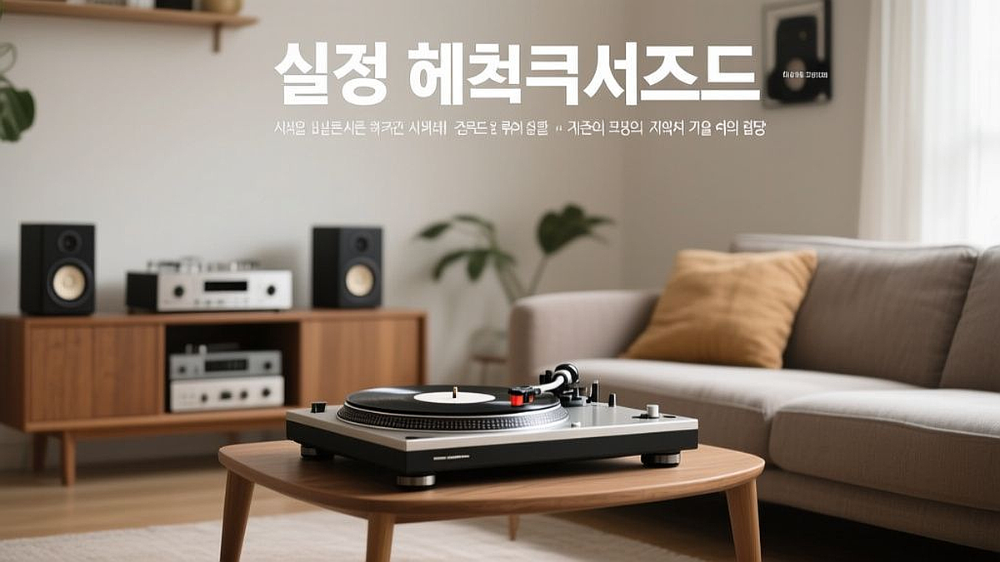

LP 턴테이블 입문은 2026년형 가성비 모델을 기준으로 거실 오디오 시스템을 구축하려는 이들에게 단순한 장비 구매 이상의 의미를 갖습니다. 스마트폰 하나로 전 세계의 음원을 클릭 몇 번이면 들을 수 있는 시대에, 굳이 바늘을 올리고 판을 뒤집는 수고를 감내하는 이유는 무엇일까요. 그것은 음악을 소비하는 행위가 아닌, 음악과 함께 머무는 시간을 선택하는 과정이기 때문입니다. 3040 세대를 중심으로 다시금 LP 붐이 이는 현상은 단순히 아날로그 향수에 대한 회귀가 아니라, 압축된 디지털 음원에서 느끼지 못했던 공간감과 물리적인 질감을 되찾으려는 시도입니다. 거실이라는 한정된 공간에 오디오를 들여놓는 일은 생각보다 많은 고민을 요구합니다. 어떤 스피커를 선택할지, 턴테이블과 앰프를 어떻게 연결할지, 공간의 울림은 어떻게 잡아야 할지 막막한 입문자를 위해, 오늘 바로 적용할 수 있는 현실적인 가이드를 정리했습니다. 섣불리 고가의 장비를 들이기보다, 자신의 라이프스타일에 맞춰 실패를 줄이는 단계별 접근법을 확인해 보시기 바랍니다.

## 첫 번째 관문: 올인원 턴테이블인가, 분리형 시스템인가

가장 먼저 부딪히는 고민은 '턴테이블에 스피커가 내장된 형태(올인원)'를 살 것인가, 아니면 '턴테이블, 앰프, 스피커를 따로 구성하는 분리형'을 택할 것인가입니다. 결론부터 말하자면, 거실에서 음악을 제대로 감상하고 싶다면 올인원 모델은 피하는 것이 좋습니다. 올인원 기기는 턴테이블 진동이 스피커로 고스란히 전달되어 소리가 뭉개지거나, 바늘이 튀는 현상을 근본적으로 해결하기 어렵기 때문입니다.

실패 사례를 하나 들어보겠습니다. 디자인만 보고 구매한 저가형 올인원 턴테이블은 2~3개월이 지나면 플래터의 회전 속도가 미세하게 느려지는 현상이 발생합니다. 이는 음정의 피치를 떨어뜨려 음악을 듣는 내내 불쾌한 감정을 유발하죠. 반면, 입문용 분리형 시스템은 '포노 앰프가 내장된 턴테이블'과 '액티브 스피커' 조합으로 시작하는 것이 경제적이고 효율적입니다.

선택 기준은 명확합니다. 거실 공간이 5평 미만이고, 오디오를 위한 별도의 선반을 마련하기 어렵다면 액티브 스피커를 활용한 분리형 구성을 택하세요. 이때 턴테이블은 '포노 이퀄라이저'가 내장된 모델을 고르는 것이 핵심입니다. 별도의 포노 앰프를 구매하는 비용과 복잡한 케이블 연결 과정을 건너뛸 수 있어 입문 난이도가 획기적으로 낮아집니다. 예산은 턴테이블 본체에 30만 원, 액티브 스피커에 30만 원 정도를 배정하면, 입문 수준에서 기대할 수 있는 최상의 가성비를 경험할 수 있습니다. 

## 실전 체크리스트: 설치와 공간 활용의 함정

오디오를 구매하고 나서 가장 당황하는 지점은 '소리가 아니라 진동'입니다. 턴테이블은 아주 예민한 장치입니다. 스피커와 같은 바닥에 두면 스피커의 울림이 턴테이블의 카트리지로 전달되어 '하울링'이라는 굉음을 만들어냅니다. 이를 방지하기 위한 실전 체크리스트를 확인하세요.

첫째, 턴테이블과 스피커는 반드시 서로 다른 가구 위에 올려두거나, 같은 가구라면 스피커 아래에 진동 방지용 패드(인슐레이터)를 반드시 설치해야 합니다. 둘째, 수평계는 필수입니다. 턴테이블이 평평하지 않으면 바늘이 한쪽으로 치우쳐 레코드판을 갉아먹게 됩니다. 스마트폰의 수평계 앱을 활용해도 좋으니, 설치 직후 반드시 수평을 맞추세요. 셋째, 전원 선과 오디오 케이블을 분리하세요. 전원 케이블이 오디오 신호선을 감싸고 있으면 웅 하는 노이즈가 발생할 확률이 높습니다.

실패 사례는 대개 '벽면에 밀착 배치'하는 경우입니다. 스피커 뒷면이 벽에 너무 가까우면 저음이 부풀어 올라 소리가 벙벙거리는 현상이 생깁니다. 적어도 벽에서 20cm 이상 띄우는 것이 좋습니다. 또한, 입문자가 흔히 하는 실수는 바늘(스타일러스)의 수명을 무시하는 것입니다. 보통 500시간 정도 사용하면 바늘 끝이 마모됩니다. 이를 방치하면 LP판의 홈이 영구적으로 손상되니, 사용 시간을 대략 기록해 두었다가 교체 주기를 챙기는 습관이 필요합니다.

## 왜 지금 LP인가: 디지털과 아날로그의 공존

디지털 스트리밍은 편리함이 무기입니다. 하지만 LP는 '집중'이 무기입니다. LP 한 장을 올리는 행위는 단순히 음악을 듣는 것이 아니라, 그 앨범 전체의 서사를 처음부터 끝까지 온전히 받아들이겠다는 선언과 같습니다. 2026년 현재, 우리는 선택 과잉의 시대에 살고 있습니다. 알고리즘이 골라주는 음악에 길들여진 귀를 잠시 쉬게 하고, 내가 직접 고른 판을 올리는 경험은 정서적으로 큰 만족감을 줍니다.

성공적인 오디오 구축을 위해 가장 중요한 것은 '유지비'를 계산하는 것입니다. 턴테이블은 기기 값보다 레코드판을 모으는 비용이 더 많이 들어갑니다. 한 달에 2~3장의 LP를 구매한다고 가정할 때, 약 10만 원 정도의 추가 예산이 필요합니다. 기기는 한 번 사면 오래 쓰지만, 음반은 늘어나는 만큼 공간을 차지합니다. 따라서 오디오 장비에 모든 예산을 쏟기보다는, 장비는 가성비 모델로 시작하고 남은 예산으로 자신이 정말 좋아하는 아티스트의 LP를 직접 찾아 구매하는 것을 권장합니다.

입문자가 피해야 할 태도는 '장비병'입니다. 더 비싼 카트리지, 더 정밀한 톤암을 찾는 것은 LP의 매력을 충분히 즐긴 뒤에 해도 늦지 않습니다. 지금은 거실에서 가족이나 친구와 함께 음악을 듣고, LP 커버를 감상하며 대화를 나누는 '경험'에 집중하세요. 아날로그 오디오는 완벽한 수치를 추구하는 취미가 아니라, 내 거실의 분위기를 음악으로 채우는 취향의 영역이기 때문입니다.

결론적으로, LP 턴테이블 입문은 정해진 정답을 따르는 것이 아니라 자신의 공간과 예산에 맞게 최적의 타협점을 찾는 과정입니다. 올인원보다는 포노 앰프 내장형 턴테이블과 액티브 스피커 조합으로 시작하여, 설치 시 진동과 수평에만 신경 써도 입문자가 겪는 대부분의 문제는 해결됩니다. 무엇보다 중요한 것은 음악을 듣는 시간 자체를 즐기는 태도입니다. 장비의 스펙에 갇히지 말고, 오늘 당장 좋아하는 음반 한 장을 골라 턴테이블 위에 올려보세요. 그 작은 행동이 당신의 거실을 완전히 새로운 공간으로 바꿔줄 것입니다. 장비는 거들 뿐, 주인공은 언제나 당신의 취향이 담긴 음악 그 자체라는 사실을 잊지 마시기 바랍니다.

## 마치며

LP 턴테이블 입문은 복잡한 수치나 완벽한 장비에 집착하는 과정이 아닙니다. 핵심은 자신의 예산 안에서 최적의 조합을 찾아내고, 그 공간을 음악으로 채우는 즐거움을 발견하는 데 있습니다. 포노 앰프 내장형 턴테이블과 액티브 스피커의 간단한 조합만으로도 충분히 깊이 있는 아날로그 사운드를 경험할 수 있으니, 장비에 대한 부담은 내려놓으셔도 좋습니다.

이제 고민은 잠시 접어두고, 평소 아끼던 LP 한 장을 꺼내 턴테이블 위에 올려보세요. 바늘이 레코드판 위를 흐르며 들려주는 첫 소절이 여러분의 거실을 이전과는 전혀 다른 따뜻한 공간으로 바꿔줄 것입니다. 완벽한 오디오 환경을 구축하는 것보다 중요한 것은 오늘 당장 음악과 함께하는 소중한 시간입니다. 여러분만의 취향이 담긴 음악으로 오늘 저녁, 거실의 공기를 새롭게 바꿔보시는 건 어떨까요? 지금 바로 그 첫 번째 회전을 시작해 보세요.
