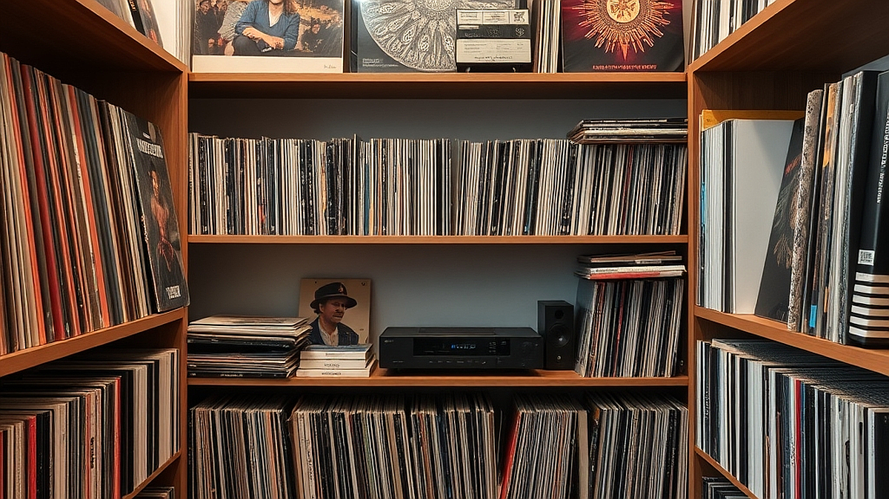

# LP 턴테이블 입문 3년 차, 이제는 '음반 보관'에 집중할 때

LP 턴테이블 입문 3년 차에 접어들었다면, 이제는 음반을 단순히 '사는 것'보다 '지키는 것'에 에너지를 쏟아야 할 시점입니다. 처음 1년은 좋아하는 아티스트의 앨범을 모으는 재미에 빠져 무작정 장수를 늘리는 데 급급했다면, 3년쯤 지나면 책장에 꽂힌 음반들이 왠지 모르게 눅눅해 보이거나, 판을 올릴 때마다 발생하는 노이즈가 예전보다 거슬리기 시작할 것입니다. LP는 종이와 비닐이라는 소재의 특성상 온도, 습도, 그리고 중력의 영향을 직접적으로 받습니다. 지금 당장 관리를 시작하지 않으면 5년 뒤에는 소중한 컬렉션 상당수가 휘어지거나 곰팡이의 공격을 받아 재생 불가능한 상태가 될 수 있습니다. 오늘은 고가의 장비를 새로 들이는 대신, 현재 가진 음반들을 건강하게 유지하고 수명을 늘릴 수 있는 실질적인 보관 전략에 대해 이야기해 보겠습니다. 턴테이블을 처음 샀을 때의 설렘을 잊지 않으려면, 지금 당장 책장 속 음반들의 안부를 확인해야 할 때입니다.

## 수직 보관은 선택이 아닌 생존의 법칙

많은 입문자가 가장 흔하게 범하는 실수는 LP를 눕혀서 쌓아두는 것입니다. 좁은 공간을 활용하려고 5장, 10장씩 눕혀서 쌓아두면, 가장 아래에 있는 음반은 상단에 쌓인 음반들의 무게를 견디지 못하고 서서히 휘어지기 시작합니다. 이를 업계에서는 '디싱(Dishing)' 현상이라고 부르는데, 한 번 휘어버린 LP는 턴테이블 위에서 바늘이 튀거나 평탄도가 깨져 소리까지 왜곡됩니다.

실패 사례를 하나 들자면, 제 지인은 이사 후 정리가 귀찮다는 이유로 30장 정도의 LP를 한 달간 눕혀서 보관했습니다. 그 결과, 가장 아래 있던 앨범은 눈에 띄게 휘어버렸고, 바늘이 정상적으로 트래킹을 하지 못해 결국 폐기해야 했습니다. LP는 반드시 책꽂이에 책을 꽂듯 수직으로 세워두어야 합니다. 이때 주의할 점은 너무 빽빽하게 꽂지 않는 것입니다. 음반을 뺄 때 억지로 힘을 주어야 할 정도라면, 음반 커버끼리 마찰이 생겨 손상이 발생합니다. 

선택 기준은 간단합니다. 음반을 손가락 하나로 쉽게 밀 수 있을 정도의 여유 공간을 확보하세요. 만약 공간이 부족하다면 무리하게 쌓지 말고, 음반 정리를 통해 듣지 않는 앨범을 처분하거나 별도의 수납함을 마련하는 것이 장기적으로는 훨씬 저렴한 투자입니다. 30cm 정도의 LP 무게는 생각보다 상당합니다. 책장을 고를 때도 칸막이가 튼튼한지, 벽에 고정할 수 있는지 반드시 확인해야 합니다.

## 습도와 온도가 만드는 보이지 않는 적

LP의 가장 큰 적은 습기입니다. 한국의 여름은 고온다습하여 습도가 70%를 넘나듭니다. 이런 환경에서 LP를 방치하면 종이 재질의 재킷에는 곰팡이가 피고, LP 표면에는 습기가 맺혀 먼지가 더 단단하게 들러붙습니다. 습기가 많은 곳에 보관된 LP는 재생 시 '틱' 하는 노이즈가 훨씬 크게 들리는데, 이는 습기로 인해 먼지가 제거되지 않고 홈에 고착되었기 때문입니다.

직접적인 해결책은 제습기 활용과 적절한 위치 선정입니다. LP를 벽면과 딱 붙여서 배치하지 마세요. 특히 외벽과 맞닿은 벽은 결로 현상이 발생하기 쉽습니다. 벽에서 최소 5cm 정도 띄우고, 공기가 순환할 수 있도록 배치하는 것이 좋습니다. 만약 방안의 습도를 관리하기 어렵다면, LP 전용 비닐 겉봉투를 사용하는 것만으로도 큰 도움이 됩니다. 

실전 체크리스트를 드립니다. 첫째, 음반을 넣는 비닐 겉봉투가 너무 얇아 습기를 막지 못하지는 않는지 확인하세요. 둘째, 여름철에는 방안의 습도를 50% 내외로 유지하도록 노력해야 합니다. 셋째, 만약 LP에 곰팡이 냄새가 난다면 즉시 밖으로 꺼내어 건조한 곳에서 말리고, 전용 클리닝 툴로 닦아내야 합니다. 습기는 한 번 침투하면 복구가 거의 불가능하므로, 예방이 유일한 대책입니다. 온도가 너무 높은 곳, 예를 들어 직사광선이 드는 창가 근처는 피하세요. 열에 의한 변형은 음반을 바로 못 쓰게 만듭니다.

## 겉봉투와 속지의 올바른 활용법

많은 분이 LP를 사면 비닐을 다 벗겨버리거나, 반대로 비닐을 씌운 채로 방치합니다. 여기서 중요한 점은 '어떤 비닐을 쓰는가'입니다. 시중에서 흔히 파는 일반적인 비닐은 시간이 지나면 끈적거리거나 누렇게 변색하며, 오히려 음반 재킷의 코팅을 벗겨내는 주범이 되기도 합니다.

선택 기준은 재질입니다. 저렴한 일반 비닐보다는 내구성이 강하고 변색이 적은 PP(폴리프로필렌) 소재의 겉봉투를 고르세요. 속지 역시 중요합니다. 종이로 된 속지는 LP를 넣고 뺄 때 미세한 종이 가루를 만들어 음반 홈으로 들어갑니다. 이는 소리의 해상도를 떨어뜨리고 바늘의 수명을 갉아먹습니다. 안감이 비닐 처리된 종이 속지나, 완전한 비닐 소재의 속지로 교체하는 것만으로도 음반의 청결도는 눈에 띄게 개선됩니다.

실수하기 쉬운 부분은 '속지를 넣는 방향'입니다. 보통 재킷의 입구와 같은 방향으로 속지를 넣는데, 이렇게 하면 먼지가 안으로 들어가기 쉽습니다. 속지를 재킷의 입구와 수직이 되게, 즉 위쪽이 막히도록 넣으면 먼지 유입을 최소화할 수 있습니다. 100장 기준, 좋은 속지로 교체하는 데 드는 비용은 몇만 원 수준이지만, 그로 인해 보호되는 음반의 가치는 수백만 원에 달합니다. 

## 정기적인 클리닝이 가져오는 변화

LP 관리는 보관에서 끝나지 않습니다. 아무리 잘 보관해도 재생할 때마다 공기 중의 먼지는 앉기 마련입니다. 턴테이블 재생 전후로 탄소 섬유 브러시를 사용하는 것은 이제 습관이 되어야 합니다. 브러시를 사용할 때는 너무 세게 누르지 말고, 회전하는 판 위에서 먼지를 가볍게 쓸어낸다는 느낌으로 해야 합니다.

가끔은 습식 클리닝도 필요합니다. 전용 세척액과 극세사 천을 사용하여 음반 홈 깊숙한 곳의 먼지를 제거하는 방식입니다. 다만, 세척액을 너무 많이 사용하면 오히려 물자국이 남거나 라벨이 젖을 수 있으니 주의해야 합니다. 

실전 루틴을 제안합니다.
1. 재생 전: 탄소 섬유 브러시로 가볍게 먼지 제거.
2. 재생 후: 바로 슬리브(속지)에 넣어 보관.
3. 분기별: 먼지가 많이 쌓인 앨범 위주로 습식 클리닝 진행.

이 과정이 번거롭게 느껴질 수 있지만, 음반의 수명을 결정짓는 것은 결국 이런 사소한 관리의 반복입니다. 깨끗하게 관리된 LP는 3년이 지나도 마치 어제 산 것처럼 선명한 소리를 들려줍니다.

LP 수집은 단순히 음악을 듣는 도구를 모으는 것이 아니라, 그 시대의 기록을 보존하는 작업입니다. 오늘 제안해 드린 수직 보관, 습도 조절, 속지 교체, 그리고 정기적인 클리닝은 고가의 오디오 시스템을 갖추는 것보다 훨씬 더 즉각적이고 확실한 음질 향상을 가져다줄 것입니다. 지금 바로 책장에 있는 음반들을 꺼내어 수직으로 잘 정돈되어 있는지, 속지가 종이 가루를 만들고 있지는 않은지 확인해 보시기 바랍니다. 관리는 취미의 끝이 아니라, 취미를 더 오래 지속하게 만드는 가장 강력한 연료입니다. 당신의 소중한 음반들이 10년, 20년 뒤에도 지금과 같은 감동을 전해줄 수 있도록 오늘부터 작은 변화를 시작해 보십시오.

## 마치며

LP 수집은 단순히 음악을 즐기는 것을 넘어, 시대를 관통하는 소리를 보존하는 가치 있는 작업입니다. 오늘 살펴본 것처럼 수직 보관과 습도 조절, 그리고 주기적인 클리닝은 고가의 장비보다 더 확실하게 음질을 지켜주는 기본기입니다. 번거로울 수 있지만, 이런 사소한 관리의 반복이 훗날 당신의 음반 컬렉션을 더욱 빛나게 만들 것입니다.

지금 바로 여러분의 턴테이블 옆, 혹은 책장에 꽂힌 LP들을 천천히 살펴보세요. 혹시 비스듬히 기울어져 있지는 않나요? 오래된 종이 속지가 가루를 날리고 있지는 않은지 확인해보는 것만으로도 충분합니다. 작은 관심이 모여 당신의 음악적 자산을 10년, 20년 뒤에도 생생하게 유지해 줄 테니까요.

관리는 취미를 지루하게 만드는 과정이 아니라, 좋아하는 음악을 더 오래, 더 깊게 즐기기 위한 가장 강력한 연료입니다. 오늘 제안해 드린 관리법을 하나씩 실천하며, 당신의 소중한 음반들이 들려주는 감동을 오랫동안 만끽하시길 바랍니다. 여러분의 즐거운 아날로그 라이프를 언제나 응원합니다!
