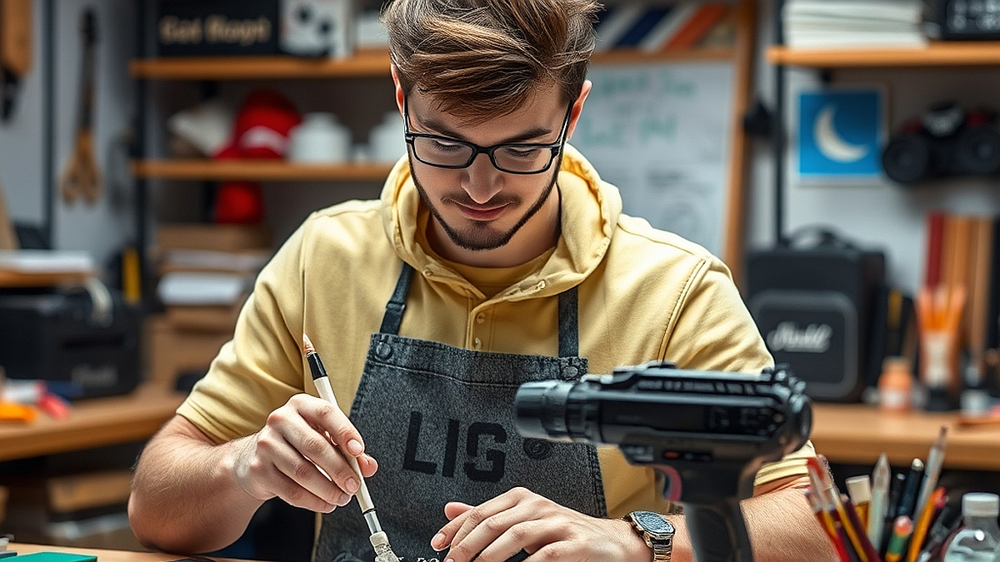

## 어른들의 놀이터, '메이커 스페이스'에서 나만의 굿즈 만들기

메이커 스페이스는 단순히 장비를 빌려주는 공간을 넘어, 머릿속에만 머물던 아이디어를 실물 굿즈로 구현하는 어른들의 창작 실험실입니다. 2026년 현재, 개인 창작 인프라는 공공기관과 민간 공유 오피스 결합 모델을 통해 누구나 접근 가능한 수준으로 고도화되었습니다. 과거에는 고가의 장비를 갖춘 전문가들의 전유물처럼 느껴졌지만, 이제는 1시간 단위의 예약 시스템과 친절한 튜토리얼 덕분에 초보자도 자신의 취향을 물질화할 수 있는 시대가 열렸습니다. 

내가 좋아하는 음악 앨범의 아트워크를 활용한 키링을 만들거나, 평소 좋아하던 캐릭터의 피규어를 직접 출력해 보는 경험은 소비의 끝단에 있던 우리에게 새로운 생산의 기쁨을 선사합니다. 하지만 막상 장비를 마주하면 무엇부터 시작해야 할지 막막해지기 마련입니다. 특히 디자인 파일의 형식이나 재료의 특성을 이해하지 못한 채 무작정 방문하면, 시간과 비용만 낭비하고 결과물 없이 돌아오기 십상입니다. 이 글에서는 3D 프린터와 레이저 커팅기를 활용해 취미를 실물로 구현하려는 분들을 위해, 시행착오를 줄이고 결과물을 성공적으로 뽑아낼 수 있는 실전 가이드를 제시합니다.

## 3D 프린터 활용: 입체적인 취향을 조형하는 법

3D 프린터는 평면적인 이미지에서 벗어나 입체적인 굿즈를 만들기에 최적입니다. 특히 캐릭터 피규어나 커스텀 액세서리 제작에 많이 쓰입니다. 이곳을 선택할 때 가장 중요한 기준은 '후가공 환경'입니다. 단순히 출력만 하고 끝나는 것이 아니라, 서포터(지지대)를 제거하고 표면을 매끄럽게 다듬는 샌딩 작업 공간이 확보되어 있는지 반드시 확인해야 합니다.

실제 사례를 들어보겠습니다. 좋아하는 밴드의 로고를 입체 키링으로 만들고 싶다면, 먼저 틴커캐드나 퓨전360 같은 툴로 3D 모델링 파일을 준비해야 합니다. 이때 너무 복잡한 곡면보다는 로고의 형태를 살린 단순한 돌출 구조가 성공 확률이 높습니다. 실패하는 가장 흔한 케이스는 모델링 파일의 '바닥면'이 평평하지 않아 출력 도중 기판에서 떨어지는 경우입니다. 이를 방지하려면 슬라이싱 소프트웨어에서 출력물 바닥면을 전체적으로 기판에 밀착시키는 설정을 반드시 체크해야 합니다.

선택 기준은 명확합니다. 만약 당신이 1시간 내외의 짧은 방문을 선호한다면, 출력 속도가 빠르고 재료 교체가 쉬운 FDM 방식 프린터가 있는 곳을 고르세요. 반면, 0.1mm 단위의 정밀한 디테일이 필요한 피규어를 만든다면, 레진 방식 프린터가 구비된 곳을 찾아야 합니다. 다만 레진은 세척 과정에서 알코올 등 화학물질을 다뤄야 하므로, 초보자라면 먼저 FDM 방식으로 형태를 익힌 뒤 다음 단계로 넘어가는 것을 권장합니다.

## 레이저 커팅기 활용: 굿즈 제작의 효율을 높이는 치트키

레이저 커팅기는 3D 프린터보다 훨씬 직관적이고 결과물도 빨리 나옵니다. 아크릴이나 나무 판재를 정밀하게 잘라내어 굿즈를 만드는 데 특화되어 있습니다. 마케팅 관점에서 보면, 레이저 커팅기는 '빠른 프로토타이핑'에 아주 적합합니다. 굿즈를 대량 생산하기 전, 디자인이 실제 형태와 어울리는지 확인하는 테스트용으로 최고입니다.

초보자가 흔히 하는 실수는 '재료의 두께'를 고려하지 않는 것입니다. 예를 들어 3mm 아크릴로 조립식 스탠드를 만드는데, 연결 부위를 3mm로 딱 맞춰 설계하면 실제로는 레이저가 지나간 폭(커프)만큼 틈이 생겨 헐거워집니다. 이를 방지하기 위해서는 디자인 파일 단계에서 여유 간격을 0.1mm 정도 좁게 설정하는 노하우가 필요합니다. 실패 케이스를 하나 더 꼽자면, 재료의 연소 가능성을 간과하는 경우입니다. 특정 플라스틱 소재는 레이저를 쏘면 유독가스가 발생하거나 녹아내려 기계가 망가질 수 있으므로, 반드시 해당 스페이스에서 허용하는 재료 리스트를 먼저 확인해야 합니다.

실전 체크리스트를 제안합니다. 첫째, 벡터 이미지 파일(AI, DXF 등)을 준비했는가? 둘째, 커팅할 재료의 두께를 정확히 측정했는가? 셋째, 기기 사용 전 튜토리얼 영상을 1번 이상 시청했는가? 이 세 가지를 충족한다면 30분 내외로 퀄리티 높은 아크릴 키링이나 코스터를 완성할 수 있습니다. 난이도는 3D 프린팅보다 낮아 초보자에게 적극 권장합니다.

## 메이커 스페이스 방문 전 반드시 확인해야 할 실전 체크리스트

어떤 공간을 선택하느냐에 따라 창작의 질이 달라집니다. 단순히 기계 대수만 볼 것이 아니라, '운영자의 상주 여부'와 '재료 구매 편의성'을 따져봐야 합니다. 

실전 체크리스트는 다음과 같습니다.
1. 기계 예약 시스템의 유연성: 당일 예약이 가능한가, 혹은 최소 3일 전 예약이 필수인가?
2. 재료 공급망: 스페이스 내에서 아크릴이나 필라멘트를 직접 판매하는가, 아니면 직접 사들고 가야 하는가? (초보자는 현장 구매가 가능한 곳이 훨씬 유리합니다.)
3. 후가공 도구 비치 여부: 니퍼, 사포, 접착제, 도색용 붓 등이 공용으로 비치되어 있는가?
4. 파일 포맷 지원: 내가 사용하는 디자인 툴의 확장자를 기계가 인식하는지 사전 문의했는가?

피해야 할 경우도 있습니다. 기계 사용료는 저렴하지만, 소프트웨어 라이선스 비용을 별도로 요구하거나, 기계가 너무 노후화되어 출력 실패율이 높은 곳은 시간 대비 효율이 극도로 떨어집니다. 특히 유지비 측면에서, 처음부터 고가의 장비를 구매하기보다는 메이커 스페이스의 1일 이용권을 활용해 장비와의 궁합을 먼저 확인하는 것이 현명합니다.

마지막으로, 실패를 두려워하지 마세요. 굿즈 제작은 한 번에 완벽한 결과물을 내는 것이 아니라, 수치와 설정을 조금씩 수정하며 최적의 값을 찾아가는 과정 그 자체입니다. 처음 방문한다면 간단한 평면 키링부터 시작해 보세요. 그렇게 한 번 성공의 맛을 보면, 그다음부터는 스스로의 취향을 실물로 구현하는 창작의 세계가 훨씬 넓게 보일 것입니다. 지금 바로 가까운 메이커 스페이스 홈페이지를 찾아보고, 이번 주말에 만들고 싶은 작은 아이템 하나를 구상해 보는 것부터 시작해 보길 바랍니다.

## 마치며

메이커 스페이스는 단순히 장비를 빌리는 공간을 넘어, 상상 속 아이디어를 현실로 끄집어내는 창의적인 놀이터입니다. 장비의 호환성을 확인하고, 합리적인 비용으로 효율적인 제작 환경을 선택하는 안목만 있다면 누구나 멋진 굿즈를 탄생시킬 수 있습니다. 무엇보다 중요한 것은 완벽함에 대한 강박을 내려놓고, 시행착오조차 즐거운 과정으로 받아들이는 마음가짐입니다.

이제 고민은 그만하고, 여러분의 상상력을 실물로 옮겨볼 차례입니다. 지금 바로 주변에 있는 메이커 스페이스를 검색해 보세요. 처음에는 작은 키링 하나로 시작해도 좋습니다. 내 손으로 직접 만든 세상에 단 하나뿐인 굿즈가 주는 성취감은 그 무엇과도 바꿀 수 없는 특별한 경험이 될 테니까요. 

이번 주말, 여러분만의 개성이 담긴 첫 번째 작품을 구상하며 설레는 도전을 시작해 보는 건 어떨까요? 여러분의 창작 활동을 진심으로 응원합니다!
