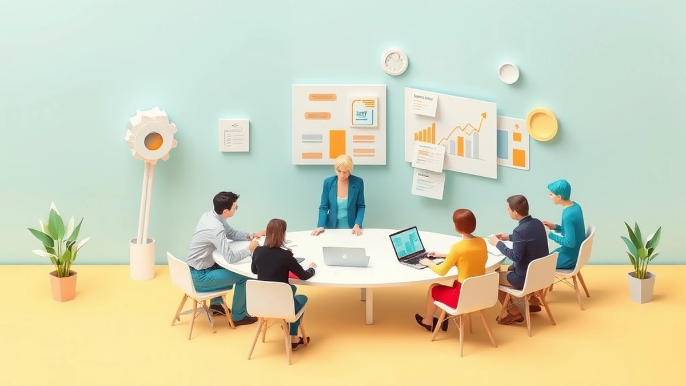

안녕하세요! 20년차 디지털 마케터이자 퍼포먼스 마케팅 전문가, 최성진입니다. 오늘은 **2025년 디지털 마케팅 성공 전략**에 대해 솔직하고 실용적인 이야기들을 풀어볼까 합니다. 20년 동안 이 바닥에서 뒹굴면서 수많은 캠페인을 기획하고 실행하고 실패하고 다시 일어서기를 반복했어요. 매년 새로운 기술과 트렌드가 쏟아져 나오지만, 결국 마케팅의 본질은 변하지 않더라고요. 바로 **'고객'을 이해하고, 그들에게 '가치'를 전달하며, '성과'를 만들어내는 것**입니다.

제가 처음 마케팅을 시작했을 때는 지금처럼 데이터 분석 툴이나 AI 같은 건 상상도 못했어요. 그저 감과 경험에 의존해서 광고를 돌리고, 반응을 보면서 수정하는 게 전부였죠. 그러다 보니 예산을 엉뚱한 곳에 낭비하거나, 좋은 아이디어임에도 불구하고 왜 실패했는지조차 모르는 경우가 허다했습니다. 하지만 시대가 변하면서 마케팅은 점점 더 과학이 되어갔고, 저 역시 살아남기 위해선 끊임없이 배우고 변화해야만 했죠. "실제로 해보니까 이게 효과가 있더라고요"라는 말처럼, 저는 늘 현장에서 부딪히며 얻은 경험들을 가장 소중하게 생각합니다. 오늘 여러분께 들려드릴 이야기는 단순히 이론적인 지식이 아니라, 제가 직접 발로 뛰고 깨지면서 얻은 생생한 노하우와 꿀팁들입니다. ROI, 전환율 같은 구체적인 수치들을 통해 어떻게 하면 더 나은 성과를 만들 수 있었는지, 그리고 어떤 실패를 통해 무엇을 배웠는지 가감 없이 공유해 드릴게요. 자, 그럼 2025년, 우리 마케터들이 반드시 알아야 할 성공 전략들을 함께 파헤쳐 볼까요?

## 데이터 기반 의사결정, 이제는 생존 필수 조건입니다

마케팅에서 데이터는 이제 선택이 아니라 생존을 위한 필수 조건이 되었습니다. 과거에는 "감"으로 마케팅을 하던 시절도 있었죠. 저 역시 그랬습니다. "이 광고는 왠지 잘 될 것 같아!", "이 고객층이 반응할 거야!" 하는 막연한 기대를 가지고 예산을 투입했던 적이 얼마나 많았는지 모릅니다. 하지만 그런 방식으로는 지속 가능한 성장을 기대하기 어려웠어요. 한번은 신규 서비스 런칭 캠페인에서, 내부적으로 '대박'을 예상했던 특정 채널에 예산의 절반 이상을 몰아준 적이 있습니다. 결과는 참혹했죠. 예상했던 전환율의 절반에도 못 미쳤고, ROAS(광고 투자 수익률)는 50%를 겨우 넘는 수준이었습니다. 그때 뼈저리게 느꼈습니다. **데이터 없이는 그 어떤 마케팅도 맹목적인 도박에 불과하다는 것을요.**

이후 저는 모든 마케팅 활동의 시작과 끝을 데이터로 연결하기 시작했습니다. 가장 먼저 한 일은 명확한 KPI(핵심 성과 지표)를 설정하는 것이었습니다. 단순히 '매출 증대'가 아니라, '특정 기간 내 신규 고객 획득 1000명', '구매 전환율 3% 달성', '광고 캠페인 ROAS 250% 이상'처럼 구체적인 목표를 세웠죠. 그리고 GA4(Google Analytics 4)와 CRM(고객 관계 관리) 데이터를 꼼꼼히 들여다보는 습관을 들였습니다. 어떤 키워드가 높은 전환율을 보이는지, 어떤 광고 소재가 클릭률(CTR)이 높은지, 고객들은 우리 웹사이트에서 어떤 경로를 거쳐 구매에 이르는지 등을 상세하게 분석했어요.

예를 들어, 한 이커머스 고객사의 경우, 특정 제품군에 대한 광고 효율이 지속적으로 저조한 문제가 있었습니다. 초기에는 단순히 제품 자체의 매력이 부족하다고 생각했죠. 하지만 데이터를 깊이 파고들어 보니, 문제는 제품이 아니라 광고 랜딩 페이지에 있었습니다. 랜딩 페이지의 로딩 속도가 너무 느렸고, 모바일 환경에서 제품 이미지가 제대로 보이지 않는 경우가 많았던 겁니다. 이 문제를 개선하자마자 해당 제품군의 **구매 전환율이 1.2%에서 3.5%로 껑충 뛰었고, ROAS도 180%에서 350%까지 상승**하는 놀라운 결과를 얻었습니다. 이처럼 데이터는 문제의 근원을 정확히 짚어주고, 해결책을 제시해 줍니다.

2025년에는 이러한 데이터 기반 의사결정이 더욱 고도화될 것입니다. 단순히 과거 데이터를 분석하는 것을 넘어, AI 기반의 예측 분석(Predictive Analytics)이 마케팅 예산 배분과 캠페인 최적화에 핵심적인 역할을 할 거예요. 예를 들어, AI가 과거 고객 행동 패턴과 시장 트렌드를 분석하여 "다음 달에는 특정 채널의 광고 효율이 20% 더 높아질 것으로 예상되니, 예산을 집중하라"는 인사이트를 제공할 수 있게 되는 거죠. 중요한 것은 이러한 툴을 맹신하는 것이 아니라, 우리 마케터가 데이터를 '해석'하고 '활용'하는 능력을 키우는 것입니다. 매일 아침 커피 한 잔과 함께 데이터 리포트를 열어보고, 작은 변화에도 민감하게 반응하며, **"왜 이런 결과가 나왔을까?"**라는 질문을 끊임없이 던지는 습관이 필요합니다. 실패는 데이터 속에서 답을 찾을 때 비로소 성공의 씨앗이 됩니다.

## 콘텐츠 마케팅, 이제는 '초개인화'가 답입니다

콘텐츠 마케팅은 여전히 강력하지만, 이제는 그 방식이 완전히 달라져야 합니다. 예전에는 그저 재미있고 바이럴이 잘 되는 콘텐츠를 만드는 데 집중했습니다. "일단 빵 터지면 장땡이지!" 하는 생각으로 밈(meme)을 활용하거나, 감성적인 스토리텔링에 올인했죠. 물론 그런 콘텐츠가 단기적인 이슈를 만들고 브랜드 인지도를 높이는 데 효과적일 수는 있습니다. 하지만 단순히 인지도를 넘어 실제 구매 전환까지 이어지게 하려면, 훨씬 더 정교한 전략이 필요합니다. 제가 직접 경험한 실패 사례를 말씀드릴게요. 한때 제가 운영하던 브랜드 블로그에서 모든 구독자에게 똑같은 내용의 뉴스레터를 발송했습니다. 신제품 출시, 이벤트 소식 등 중요한 정보였지만, 오픈율은 15%를 넘기기 어려웠고, 클릭률은 한 자릿수에 머물렀습니다. 고객들이 '나와 상관없는 이야기'라고 느끼는 게 분명했습니다.

이후 저는 **'초개인화(Hyper-personalization)'**에 집중하기 시작했습니다. 고객을 단순히 '구독자'라는 하나의 덩어리로 보는 대신, 그들의 관심사, 과거 구매 이력, 웹사이트 내 행동 패턴 등을 기반으로 세분화된 그룹으로 나누었습니다. 예를 들어, '스킨케어 제품에 관심 있는 20대 여성', '반려동물 사료를 구매한 30대 남성', '최근 장바구니에 특정 상품을 담아두고 결제하지 않은 고객' 등으로 말이죠. 그리고 각 그룹에 맞는 맞춤형 콘텐츠를 기획하고 발송했습니다. 스킨케어에 관심 있는 고객에게는 신제품 세럼 할인 정보를, 반려동물 사료 구매 고객에게는 신규 간식 출시 소식을, 장바구니에 상품을 담아둔 고객에게는 '장바구니 속 상품 잊지 마세요' 알림과 함께 소정의 할인 쿠폰을 제공하는 식입니다.

결과는 놀라웠습니다. **이메일 뉴스레터의 평균 오픈율은 15%에서 35%로 두 배 이상 상승했고, 클릭률은 3%에서 12%로 네 배 가까이 증가**했습니다. 특히 장바구니 알림 메시지를 받은 고객들의 **구매 전환율은 무려 20%에 육박**했습니다. 이처럼 초개인화된 콘텐츠는 고객에게 '나를 위한 메시지'라는 느낌을 주어 몰입도를 높이고, 결국 행동으로 이어지게 만듭니다.

2025년에는 AI 기술의 발전 덕분에 이러한 초개인화가 더욱 쉬워지고 정교해질 것입니다. AI는 고객 데이터를 실시간으로 분석하여, 각 고객에게 가장 적합한 콘텐츠 형식, 메시지 톤, 발송 시간까지 제안해 줄 수 있습니다. 예를 들어, 특정 고객이 평소 웹툰 형식의 콘텐츠에 더 반응한다면, 해당 고객에게는 텍스트 대신 웹툰으로 제작된 제품 설명을 보내는 식이죠. 또한, 인터랙티브 콘텐츠(Interactive Content)도 중요해질 겁니다. 단순히 정보를 제공하는 것을 넘어, 고객이 직접 참여하고 경험할 수 있는 퀴즈, 설문, 시뮬레이션 같은 콘텐츠가 고객 참여율을 높이는 데 큰 역할을 할 것입니다. 여러분의 마케팅 전략에 초개인화를 녹여내기 위해서는 **고객 여정(Customer Journey)을 세밀하게 분석하고, 각 단계에 맞는 맞춤형 콘텐츠 전략을 수립하는 것이 핵심**입니다. 이제 더 이상 '모두에게 통하는 한 가지 메시지'는 없습니다. 오직 '나에게 통하는 메시지'만이 고객의 마음을 움직일 수 있습니다.

## AI와 자동화, 마케터의 새로운 무기입니다

제가 20년 동안 마케팅 현장에서 일하면서 가장 큰 변화를 가져온 기술 중 하나를 꼽으라면, 단연 AI와 자동화입니다. 처음에는 AI가 마케터의 일자리를 빼앗을 거라는 막연한 두려움도 있었습니다. 하지만 시간이 지날수록 AI는 마케터의 적이 아니라, 훨씬 더 강력한 '무기'이자 '협력자'라는 것을 깨달았습니다. 반복적이고 시간 소모적인 업무를 AI가 대신 처리해주면서, 저는 더 창의적이고 전략적인 일에 집중할 수 있게 되었죠.

가장 먼저 AI와 자동화의 도움을 받은 분야는 **광고 최적화**였습니다. 예전에는 광고 캠페인을 운영하면서 수많은 변수들을 일일이 수동으로 조절해야 했습니다. 입찰가, 타겟팅, 광고 소재, 게재 위치 등 최적의 조합을 찾기 위해 밤샘 분석을 하기도 했죠. 하지만 AI 기반의 광고 최적화 툴을 도입하고 나서부터는 상황이 완전히 달라졌습니다. AI는 실시간으로 수십만 개의 데이터를 분석하여 가장 효율적인 광고 조합을 찾아내고, 자동으로 입찰가를 조절하며, 잠재 고객에게 가장 적합한 광고를 노출시켰습니다. 실제로 한 고객사의 경우, AI 기반의 광고 최적화 툴을 도입하고 나서 **CPA(고객 획득 비용)가 평균 20% 감소하고, 전체 캠페인의 전환율이 10% 상승**하는 놀라운 성과를 경험했습니다. 이는 AI가 인간의 한계를 뛰어넘는 속도와 정확성으로 데이터를 처리하고 예측했기 때문에 가능했던 결과였습니다.

물론, AI를 맹신해서는 안 됩니다. 저 역시 초기에는 AI 툴의 자동 설정에만 의존했다가 예상치 못한 문제에 직면한 적이 있습니다. 특정 캠페인에서 AI가 비용 효율적인 타겟만을 지나치게 좁게 설정하는 바람에, 새로운 잠재 고객을 발굴할 기회를 놓치고 캠페인 규모가 축소되는 경험을 했습니다. 그때 깨달았죠. AI는 강력한 도구이지만, 결국 **인간 마케터의 전략적 판단과 방향 설정이 필수적**이라는 것을요. AI에게 '무엇을 목표로 할지', '어떤 방향으로 나아갈지'를 명확하게 지시하고, 그 결과를 끊임없이 모니터링하며 조정해야 합니다.

2025년에는 AI가 마케팅의 거의 모든 영역에 더욱 깊숙이 침투할 것입니다. **생성형 AI(Generative AI)**는 광고 카피, 소셜 미디어 게시물, 이메일 콘텐츠, 심지어는 간단한 이미지나 영상까지도 빠르게 생성해 낼 수 있게 될 겁니다. 이는 마케터가 콘텐츠 제작에 드는 시간과 비용을 획기적으로 줄여주고, 더 많은 실험과 테스트를 가능하게 할 거예요. 또한, **AI 기반의 챗봇과 가상 비서**는 고객 문의에 실시간으로 응대하고, 개인화된 상품 추천을 제공하며, 고객 만족도를 높이는 데 큰 역할을 할 것입니다.

저는 여러분에게 AI를 두려워하지 말고, 적극적으로 학습하고 활용하라고 조언하고 싶습니다. 새로운 AI 툴이 나오면 일단 써보고, 그 기능을 익히세요. AI가 어떤 데이터를 필요로 하는지, 어떤 방식으로 학습하는지 이해하는 것이 중요합니다. **AI는 단순한 도구가 아니라, 우리의 마케팅 역량을 수십 배로 증폭시켜 줄 수 있는 강력한 파트너**입니다. AI와 함께라면 더 적은 노력으로 더 큰 성과를 만들어내는 '스마트한 마케터'가 될 수 있습니다.

마케팅은 끊임없이 변화하는 역동적인 분야입니다. 20년 동안 이 길을 걸어오면서 수많은 성공과 실패를 경험했지만, 그때마다 저를 다시 일어서게 한 것은 **'배움에 대한 갈증'과 '새로운 시도에 대한 용기'**였습니다. 오늘 제가 여러분께 들려드린 데이터 기반 의사결정, 초개인화된 콘텐츠 마케팅, 그리고 AI와 자동화 활용은 2025년 마케팅 환경에서 살아남고 성장하기 위한 핵심적인 요소들입니다.

기억하세요, 마케팅은 정답이 없는 여정입니다. 중요한 것은 멈추지 않고 끊임없이 실험하고, 데이터 속에서 답을 찾아내며, 고객의 목소리에 귀 기울이는 것입니다. 실패는 성공의 어머니라는 말이 마케팅에서는 더욱 진실로 다가옵니다. 저 역시 수많은 실패를 통해 더 단단해지고 현명해질 수 있었습니다. 오늘 제가 나눈 이야기들이 여러분의 마케팅 여정에 작은 불씨가 되기를 진심으로 바랍니다. 지금 바로 여러분의 마케팅 전략을 점검하고, 새로운 시도를 해보세요!

## 마치며

오늘 우리는 급변하는 마케팅 환경에서 성공하기 위한 핵심 요소들을 살펴보았습니다. 데이터 기반의 현명한 의사결정, 고객의 마음을 사로잡는 초개인화된 콘텐츠, 그리고 효율성을 극대화하는 AI와 자동화는 이제 선택이 아닌 필수가 되었습니다.

하지만 이 모든 것의 근간에는 끊임없이 배우고, 과감하게 새로운 시도를 하는 용기가 필요합니다. 마케팅은 정답을 찾아가는 과정이 아닌, 고객과 소통하며 함께 성장하는 여정입니다. 때로는 실패에 부딪히더라도, 그 경험을 통해 더 나은 방향을 찾아낼 수 있습니다. 지금 바로 오늘 나눈 인사이트를 바탕으로 여러분의 마케팅 전략을 점검하고, 작은 실험부터 시작해보세요. 첫걸음이 중요하며, 그 과정에서 얻는 모든 데이터와 피드백이 여러분을 더욱 강력한 마케터로 만들 것입니다. 변화를 두려워하지 않고 끊임없이 도전하는 여러분의 마케팅 여정을 진심으로 응원합니다. 성공적인 미래를 향해 나아가세요!