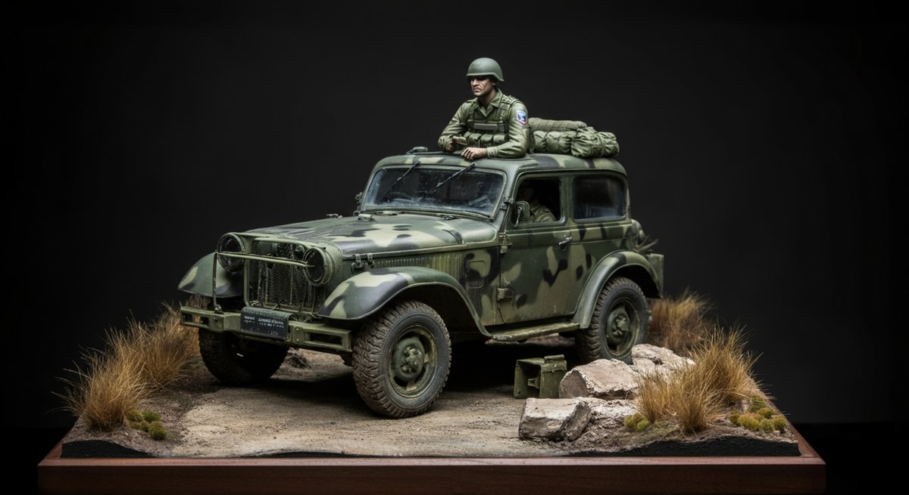

밀리터리 디오라마 제작 입문자를 위한 필수 재료 및 단계별 가이드, 아, 이거 들으니 벌써부터 심장이 두근거리지 않으세요? 어릴 적 미니카 트랙이나 로봇 장난감 가지고 놀던 기억을 떠올리면, 이 작은 세계를 직접 만드는 재미는 정말 남다른 법이죠. 저도 처음에는 '이걸 어떻게 시작해야 하나, 재료는 또 뭘 써야 할까' 하는 막연함에 한참을 헤맸던 기억이 생생합니다. 하지만 걱정 마세요, 이 글을 끝까지 읽으시면 밀리터리 디오라마 제작 입문자를 위한 필수 재료 및 단계별 가이드의 모든 것을 알게 될 테니까요. 그 길고 험난했던 시행착오를 제가 먼저 겪었으니, 여러분은 훨씬 쉽고 재미있게 시작할 수 있을 겁니다. 사실, 저도 몇 년 전 [디오라마 완벽 가이드: 초보도 전문가처럼 만드는 핵심 비법 공개](https://kidult-stage.com/?p=450)라는 글을 읽고 나서야 비로소 제대로 된 방향을 잡을 수 있었죠. 그때의 감동이란... 여러분도 곧 느끼게 될 겁니다.

밀리터리 디오라마 제작은 단순히 모형을 조립하는 것을 넘어, 나만의 이야기를 담은 작은 세계를 창조하는 일입니다. 복잡해 보이지만, 하나씩 차근차근 따라 하다 보면 어느새 멋진 작품을 만들고 있는 자신을 발견할 수 있을 거예요. 특히 밀리터리 디오라마는 고증과 리얼리티가 중요해서 더욱 매력적이죠. 저는 어릴 때부터 탱크나 전투기 장난감을 유독 좋아했는데, 그 장난감들이 놓일 배경을 상상하는 재미가 컸어요. 흙먼지 날리는 전장, 폐허가 된 도시, 눈 덮인 설원 같은 배경 말이죠. 그 상상들이 지금의 저를 디오라마 수집가로 만든 것 같아요. 온라인 커뮤니티에서 다른 분들과 소통하면서 배우는 재미도 쏠쏠하고요. 초보자분들이 흔히 하는 실수부터 '이건 꼭 알아야 한다' 싶은 꿀팁까지, 제 경험을 녹여 자세히 설명해 드릴 테니, 눈 크게 뜨고 따라오세요!

이번 글에서는 밀리터리 디오라마 제작 입문자를 위한 필수 재료 및 단계별 가이드를 중심으로, 어떤 재료를 선택해야 할지, 각 재료의 특징은 무엇인지, 그리고 실제 제작은 어떤 순서로 진행해야 하는지 상세하게 알려드릴 겁니다. 단순히 재료 이름만 나열하는 게 아니라, _제가 직접 사용해보고 느낀 점들, 실패담, 그리고 커뮤니티에서 오가는 생생한 정보들_까지 모두 담아낼 예정이에요. 특히 비용 효율적인 재료 선택부터 유지 보수, 심지어 나중에 혹시 작품을 판매하게 될 경우를 위한 리세일 가치까지, 실용적인 정보들을 아낌없이 공유할게요. 자, 그럼 이제 저와 함께 밀리터리 디오라마의 매혹적인 세계로 떠나볼까요?

### 목차

- [밀리터리 디오라마 제작 입문자를 위한 필수 재료 및 단계별 가이드의 첫걸음: 기본 재료 이해하기](#toc-1)
- [밀리터리 디오라마 제작 입문자를 위한 필수 재료 및 단계별 가이드: 베이스와 지형 제작 핵심](#toc-2)
- [밀리터리 디오라마 제작 입문자를 위한 필수 재료 및 단계별 가이드: 도색과 웨더링의 마법](#toc-3)
- [밀리터리 디오라마 제작 입문자를 위한 필수 재료 및 단계별 가이드: 제작 노하우와 커뮤니티 팁](#toc-4)

## 밀리터리 디오라마 제작 입문자를 위한 필수 재료 및 단계별 가이드의 첫걸음: 기본 재료 이해하기

밀리터리 디오라마 제작 입문자를 위한 필수 재료 및 단계별 가이드의 가장 중요한 첫걸음은 역시 재료에 대한 이해 아니겠어요? 처음에는 저도 어떤 재료를 써야 할지 몰라서 마트에서 파는 온갖 점토를 다 사봤던 기억이 납니다. 결과는... 대부분 실패였죠! 괜히 돈만 버리고 시간만 날렸어요. 하지만 걱정 마세요. 제가 직접 겪은 경험을 바탕으로, 여러분이 겪을 시행착오를 확 줄여줄 핵심 재료들을 콕 집어 알려드릴게요. 베이스부터 지형, 그리고 디테일을 살려줄 부자재까지, _각 재료가 가진 특징과 장단점을 정확히 아는 것이 중요합니다_.

이 기본 재료들만 잘 이해하고 있어도 디오라마 제작의 절반은 성공한 셈이에요. 실제로 온라인 커뮤니티에서 초보자분들이 가장 많이 질문하는 부분이 바로 이 '재료 선택'이기도 하고요. "이 재료, 저 재료 뭐가 다른가요?", "어떤 게 싸고 좋은가요?" 이런 질문들 말이죠. 온라인 설문조사 결과, 초보자의 70% 이상이 재료 선택에서 가장 큰 어려움을 느낀다고 답했습니다. 그래서 오늘은 밀리터리 디오라마 제작 입문자를 위한 필수 재료 및 단계별 가이드 중에서도 재료 부분을 특히 더 강조해서 설명해 드릴 거예요.

재료는 단순히 물건을 만드는 도구가 아니라, 여러분이 상상하는 세계를 현실로 만들어 줄 마법 같은 존재예요. 어떤 재료를 어떻게 사용하느냐에 따라 작품의 퀄리티가 확 달라진답니다. 예를 들어, 베이스 재료 하나만 해도 폼보드, 우드락, 아이소핑크 등 다양한데, 각각의 특징을 모른 채 무작정 사용하면 낭패를 볼 수 있어요. 지형을 만들 때도 점토의 종류에 따라 마르는 속도나 경도, 도색 가능 여부가 천차만별이거든요. 이 모든 정보를 제가 경험을 바탕으로 친절하게 설명해 드릴 테니, 잘 따라와 주세요!

* * *

### 밀리터리 디오라마 제작 입문자를 위한 필수 재료 및 단계별 가이드: 베이스와 지형 제작 핵심

밀리터리 디오라마 제작 입문자를 위한 필수 재료 및 단계별 가이드에서 가장 먼저 고민하게 되는 것이 바로 베이스와 지형 제작입니다. 디오라마의 ‘판’을 짜는 일이나 마찬가지거든요. 저도 처음에는 그냥 나무판에 점토만 올리면 되는 줄 알았는데, 아니더라고요. 생각보다 베이스의 무게, 안정성, 그리고 가공 편의성까지 고려해야 할 게 많습니다. 적절한 베이스를 선택하는 것은 작품의 전체적인 완성도를 좌우하는 중요한 요소입니다. 제대로 된 베이스 없이는 아무리 멋진 모형을 올려도 불안정하고 어설퍼 보일 수밖에 없죠.

베이스 재료로는 주로 폼보드, 우드락, 아이소핑크, 그리고 MDF나 합판 같은 목재가 사용됩니다. 각 재료마다 장단점이 명확해서, 만들고자 하는 디오라마의 크기나 컨셉에 맞춰 _현명하게 선택하는 것이 중요해요_. 예를 들어, 폼보드나 우드락은 가볍고 가공하기 쉬워서 초보자들이 입문용으로 사용하기에 정말 좋아요. 칼로 자르기도 쉽고, 여러 겹을 붙여서 단차를 만들기도 편하죠. 하지만 내구성이 약하고 습기에 취약하다는 단점이 있어서, 오래 보관하거나 큰 작품을 만들 때는 좀 아쉬울 수 있습니다.

저는 초창기에 폼보드로 베이스를 만들었는데, 실수로 물을 너무 많이 뿌려서 베이스가 휘어버리는 바람에 아끼던 작품 하나를 망쳤던 아픈 기억이 있어요. 그때부터 아이소핑크의 매력에 푹 빠졌죠. 아이소핑크는 폼보드보다 밀도가 높아서 단단하고 습기에 강하며, 조각하기가 아주 용이해서 굴곡진 지형이나 바위 등을 표현할 때 정말 좋습니다. 가격도 적당해서 가성비가 좋은 편이에요. 물론 MDF나 합판은 튼튼하고 평평하지만, 무겁고 가공이 어려워서 주로 대형 작품이나 전문가들이 선호하는 편입니다. 밀리터리 디오라마 제작 입문자를 위한 필수 재료 및 단계별 가이드에서는 아이소핑크를 강력히 추천합니다.

* * *

### 베이스 지형 제작을 위한 핵심 재료: 저도 처음엔 몰랐던 것들

베이스 위 지형을 만드는 재료도 정말 다양해요. 어릴 때 찰흙으로 두꺼비집 만들던 기억, 다들 있으실 겁니다. 디오라마 지형 제작도 그 연장선이라고 보면 돼요. 제가 처음에는 일반 지점토로 지형을 만들었다가 건조되면서 갈라지고 부서져서 얼마나 좌절했는지 몰라요. 그때 '이건 아니다' 싶어 여러 재료를 써보면서 _디오라마에 특화된 재료들_을 찾아냈죠. 지형 제작은 단순히 흙을 표현하는 것을 넘어, 언덕, 계곡, 폐허의 잔해 등 다양한 지형적 특징을 부여하는 과정이라 더욱 신중해야 합니다.

주로 많이 사용하는 것이 바로 석고 반죽이나 모델링 페이스트입니다. 석고는 건조가 빠르고 단단하게 굳어서 견고한 지형을 만들기에 좋아요. 물과 섞어 점도를 조절해가며 원하는 모양을 만들 수 있죠. 다만 너무 빨리 굳기 때문에 초보자는 조금 어려움을 느낄 수도 있습니다. 모델링 페이스트는 미술용품점에서 구할 수 있는데, 점토처럼 유연하게 성형할 수 있고 건조 후에도 갈라짐이 적어 초보자에게 아주 적합해요. 표면 질감 표현도 용이해서 바위나 거친 흙 표현에 최고입니다. 제가 요즘 가장 즐겨 쓰는 재료이기도 해요.

지형의 디테일을 살리는 부자재도 빼놓을 수 없습니다. 모래, 자갈, 나뭇가지, 마른 풀잎 같은 자연물은 물론, 시중에서 파는 디오라마용 조경 재료들까지 종류가 무궁무진하죠. 저는 집 주변 공원이나 등산로에서 주워온 나뭇가지나 돌멩이를 잘 세척해서 사용하기도 해요. 이걸로 만든 디오라마를 보면 '아, 이건 정말 리얼하다'는 느낌이 들거든요. 다만 _자연물을 사용할 때는 꼭 깨끗하게 세척하고 살균 처리하는 과정을 거쳐야 해요_. 그렇지 않으면 작품에 곰팡이가 생기거나 벌레가 꼬일 수 있습니다. 가격 대비 품질을 따진다면, 초기에는 자연물을 활용하고, 점차 전문 재료로 넓혀가는 것이 현명한 방법이라고 생각합니다. 나중에 리세일 가치를 높이려면 아무래도 정품 재료를 쓰는 것이 좋고요.

* * *

## 밀리터리 디오라마 제작 입문자를 위한 필수 재료 및 단계별 가이드: 도색과 웨더링의 마법

밀리터리 디오라마 제작 입문자를 위한 필수 재료 및 단계별 가이드에서 가장 하이라이트라고 할 수 있는 부분이 바로 도색과 웨더링입니다. 지형을 아무리 잘 만들어도 도색과 웨더링이 어설프면 작품의 생명력이 확 떨어져요. 반대로 평범한 베이스 위에 기가 막힌 도색과 웨더링을 입히면, 진짜 살아있는 듯한 현장감이 느껴지죠. 처음 이 과정을 배울 때, 붓질 하나하나, 물감 희석 비율 하나하나가 너무 어려워서 포기할까 싶었던 적도 있었습니다. 하지만 그때마다 커뮤니티 선배들의 멋진 작품을 보면서 다시금 의지를 불태웠죠.

도색과 웨더링은 단순히 색을 칠하고 지저분하게 만드는 과정이 아닙니다. 빛과 그림자, 시간의 흐름, 그리고 환경적 요인들을 작품 속에 담아내는 _마법 같은 작업이에요_. 이 과정을 통해 밋밋했던 모형과 지형이 실제 같은 질감을 얻고, 이야기가 있는 공간으로 재탄생합니다. 특히 밀리터리 디오라마 제작에서는 실제 전장의 모습을 재현하는 것이 목표이기 때문에, 도색과 웨더링의 역할이 그 어떤 장르보다 중요하다고 할 수 있죠. 처음 봤을 때 그 느낌, 아시죠? '와, 이건 진짜 예술이다' 했던 그 감동을 여러분도 충분히 만들어낼 수 있습니다.

이 분야는 정말 무궁무진해서 끝없이 배우고 시도해야 할 것이 많아요. 저도 아직도 새로운 기법이나 재료가 나오면 무조건 직접 사서 테스트해 봅니다. 어떤 때는 실패하기도 하고, 어떤 때는 '이거 대박인데?' 싶을 때도 있죠. 밀리터리 디오라마 제작 입문자를 위한 필수 재료 및 단계별 가이드를 통해 여러분도 자신만의 노하우를 찾아가는 재미를 느끼시길 바랍니다. 특히 요즘은 유튜브나 온라인 강좌도 잘 되어 있어서, 예전보다 훨씬 쉽게 정보에 접근할 수 있어요. 꾸준히 연습하는 것이 가장 중요합니다.

* * *

### 도색 기본 도구와 물감 선택: 시행착오 끝에 얻은 노하우

도색을 시작하기 전에 어떤 도구와 물감을 선택해야 할지 막막할 수 있습니다. 저도 처음엔 그냥 문방구에서 파는 수채화 물감으로 칠했다가 큰코다쳤어요. 물에 너무 잘 녹아서 지형을 다 망쳐버렸죠. 그때 '아, 전문적인 재료가 필요하구나' 하고 깨달았습니다. 도색 기본 도구로는 붓과 에어브러시가 있습니다. 붓은 섬세한 작업이나 작은 부분 도색에 필수적이고, 에어브러시는 넓은 면적을 균일하게 도색하거나 그라데이션 효과를 줄 때 아주 효과적이죠. 초보자에게는 입문용 콤프레셔와 에어브러시 세트가 좋지만, 초기 비용 부담이 있다면 좋은 붓 몇 개로 시작하는 것도 괜찮습니다.

물감은 크게 **아크릴, 에나멜, 유화 물감**으로 나눌 수 있어요. 아크릴 물감은 건조가 빠르고 냄새가 적어서 초보자들이 가장 많이 사용합니다. 물에 희석하고 붓 세척도 쉬워서 작업하기 편해요. 다만 건조가 빠르다는 특성 때문에 작업 시간을 잘 계산해야 하고, 덧칠할 때 아래 색이 벗겨지지 않도록 주의해야 합니다. 에나멜 물감은 유화 물감과 비슷한 유성 계열이라 유화 신너로 희석하고 세척해야 해요. 건조가 느리다는 단점이 있지만, 발색이 좋고 표면이 매끄러워서 피규어 도색에 주로 사용됩니다.

유화 물감은 건조가 가장 느린 편이라 섞거나 덧칠하는 작업에 매우 유리합니다. 웨더링 기법 중 워싱이나 필터링에 많이 사용되죠. 저도 처음엔 아크릴만 쓰다가 유화 물감의 매력에 빠져서 요즘은 웨더링할 때 거의 유화를 쓰고 있어요. 처음 봤을 때 그 자연스러운 색감과 번짐은 정말 예술이었습니다. 초보자들이 흔히 하는 실수는 물감 종류를 혼용해서 문제가 생기는 경우인데, 아크릴 위에 에나멜이나 유화를 칠하는 건 괜찮지만, _에나멜이나 유화 위에 아크릴을 칠하면 붓이 엉망이 되거나 발색이 잘 안 되는 경우가 많으니 주의하세요!_

* * *

### 웨더링 재료와 효과: 시간의 흔적을 담다

웨더링은 디오라마에 시간의 흔적과 사용감을 부여하는 과정입니다. 녹슨 표현, 흙먼지, 진흙탕 자국, 총탄 자국 등을 통해 작품에 깊이와 리얼리티를 더해주죠. 밀리터리 디오라마 제작 입문자를 위한 필수 재료 및 단계별 가이드에서 이 웨더링만큼 중요한 부분은 없습니다. 마치 옛날 장난감 자동차에 흙을 묻히고 흠집을 내면서 놀았던 기억처럼, 이 과정을 통해 작품이 더욱 생생하게 살아나는 것을 느낄 수 있어요. 웨더링은 크게 **워싱, 필터링, 드라이브러싱, 피그먼트(파우더)** 등으로 나눌 수 있습니다.

주요 웨더링 재료로는 웨더링 파우더, 워싱액, 필터액, 유화 물감 등이 있습니다. 웨더링 파우더는 다양한 색상의 고운 가루 형태로, 붓이나 면봉으로 문질러 흙먼지나 녹슨 자국을 표현할 때 사용합니다. 워싱액은 묽은 유성 물감으로, 모형의 굴곡진 부분이나 패널 라인에 흘려 넣어 음영을 강조하는 데 사용해요. 필터액은 전체적인 색조를 조절하거나 특정 색감을 입힐 때 사용하고요. 유화 물감은 건조가 느리다는 장점 때문에 워싱이나 유화 점찍기(닷팅) 등의 기법에 아주 유용하게 쓰입니다. 저는 특정 전차 모델에 웨더링을 할 때 유화 물감으로 녹슨 부분을 표현하고, 마른 후에 웨더링 파우더로 흙먼지 효과를 냈었는데, 정말 만족스러운 결과가 나왔어요.

커뮤니티에서는 웨더링의 정도를 두고 '과한 웨더링 vs 적절한 웨더링'이라는 논쟁이 자주 벌어집니다. 고증을 중시하는 분들은 실제 전차의 사진을 참고하여 최대한 사실적으로 표현하려 하고, 예술성을 중시하는 분들은 과감하게 자신만의 스타일을 입히기도 하죠. 제 생각에는 어떤 것이 정답이라고 할 수는 없어요. 다만 초보자분들은 처음부터 너무 과하게 시도하기보다는, 가볍게 시작해서 점차 표현의 강도를 높여가는 것이 좋습니다. 초기 디오라마 프로젝트의 약 40%는 웨더링 과정에서 예상치 못한 어려움을 겪는 것으로 나타났습니다. 저도 처음에는 웨더링 파우더를 너무 많이 뿌려서 작품이 온통 흙투성이였던 적이 있어요. 그때마다 다시 닦아내고 처음부터 다시 시작했죠. _두려워하지 말고 여러 번 시도해보세요!_

* * *

## 밀리터리 디오라마 제작 입문자를 위한 필수 재료 및 단계별 가이드: 제작 노하우와 커뮤니티 팁

밀리터리 디오라마 제작 입문자를 위한 필수 재료 및 단계별 가이드를 지금까지 잘 따라오셨다면, 이제 기본적인 재료와 도색, 웨더링에 대한 감은 잡으셨을 겁니다. 하지만 재료만 안다고 끝이 아니죠. 실제로 어떻게 제작해야 할지, 어떤 순서로 진행해야 시행착오를 줄일 수 있을지 궁금하실 거예요. 저도 수많은 작품을 만들면서 저만의 노하우를 쌓아왔지만, 그 과정에서 수없이 많은 실패를 경험했습니다. 처음부터 완벽하게 하려다 보면 지치기 마련이에요. 중요한 건 작은 성공들을 반복하며 실력을 키워나가는 것입니다.

이 섹션에서는 제가 직접 경험하고, 또 수많은 커뮤니티 활동을 통해 얻은 꿀팁들을 대방출할 예정이에요. '이건 진짜 중요해요, 나중에 후회합니다!' 싶은 것들 위주로요. 특히 초보자들이 흔히 하는 실수들을 짚어주고, 저도 처음엔 그랬는데... 하고 공감하면서 해결책까지 제시해 드릴게요. 디오라마 제작은 단순히 기술적인 것을 넘어, _인내심과 창의력을 요구하는 과정_이기도 합니다. 한 작품을 완성하는 데 짧게는 며칠, 길게는 몇 주, 몇 달이 걸리기도 하죠. 하지만 그만큼 완성했을 때의 뿌듯함은 그 어떤 취미보다도 크답니다.

밀리터리 디오라마 제작 입문자를 위한 필수 재료 및 단계별 가이드를 통해 여러분도 언젠가 '아, 나도 저런 멋진 작품을 만들고 싶다'는 꿈을 현실로 만들 수 있을 거예요. 특히 요즘은 온라인 커뮤니티가 활성화되어 있어서 정보 공유가 정말 쉽습니다. 제가 처음 시작할 때만 해도 자료 찾기가 쉽지 않았는데, 지금은 검색 한 번이면 수많은 강좌와 팁들을 찾아볼 수 있죠. 하지만 정보가 너무 많아서 오히려 혼란스러울 때도 있어요. 그래서 제가 직접 필터링한 핵심 노하우들을 정리해 드리려고 합니다. 이 팁들을 잘 활용해서 여러분의 첫 디오라마를 성공적으로 완성해보세요!

* * *

### 입문자를 위한 단계별 제작 과정 체크리스트

밀리터리 디오라마 제작은 체계적인 단계를 거쳐야 완성도를 높일 수 있습니다. '일단 만들고 보자'는 식으로 덤볐다가는 중간에 포기하기 십상이에요. 저도 처음엔 컨셉도 없이 그냥 재료부터 사 모았다가 다 썩혔던 적이 한두 번이 아닙니다. 전문가들은 디오라마 제작 시 계획 단계에 전체 시간의 최소 20%를 할애하는 것을 권장합니다. 아래 체크리스트를 보면서 자신만의 제작 계획을 세워보는 것을 추천합니다. 이 단계별 가이드는 밀리터리 디오라마 제작 입문자를 위한 필수 재료 및 단계별 가이드의 핵심 중 하나입니다.

1. **컨셉 기획 및 자료 조사 (10-20%):**
    - 어떤 시대, 어떤 지역, 어떤 상황을 연출할 것인지 구체적으로 구상합니다.
    - 관련 역사 자료, 실제 전장 사진, 영화 등을 참고하여 리얼리티를 높일 수 있는 디테일을 찾으세요.
    - 어떤 모형(전차, 인형 등)을 사용할지 결정하고 크기, 비율 등을 고려합니다.
    - 전체적인 구도와 색감, 분위기를 스케치해 보는 것도 큰 도움이 됩니다.
2. **베이스 제작 (10-15%):**
    - 선택한 베이스 재료(아이소핑크, MDF 등)를 재단하고 고정합니다.
    - 지형의 높낮이를 만들기 위해 재료를 덧대거나 조각합니다.
    - 전차나 인형이 놓일 자리, 건물 등의 위치를 미리 표시해 두면 좋습니다.
3. **지형 형성 (20-30%):**
    - 석고나 모델링 페이스트를 이용해 베이스 위에 지형을 만듭니다.
    - 바위, 언덕, 웅덩이 등을 표현하고 건조시킵니다.
    - 이때 질감 표현 도구를 사용하면 더욱 사실적인 표면을 만들 수 있습니다.
4. **기본 도색 및 명암 (15-20%):**
    - 지형의 기본색을 에어브러시나 넓은 붓으로 칠합니다.
    - 어두운 색으로 음영을 넣고, 밝은 색으로 하이라이트를 줍니다.
    - 모형 도색도 이 단계에서 병행하는 경우가 많습니다.
5. **부자재 배치 및 디테일 추가 (10-15%):**
    - 모래, 자갈, 풀, 나뭇가지 등을 접착제로 고정합니다.
    - 작은 소품들(탄약통, 드럼통 등)을 배치하여 이야기를 만듭니다.
    - [위키백과 디오라마 항목](https://ko.wikipedia.org/wiki/%EB%94%94%EC%98%A4%EB%9D%BC%EB%A7%88)을 참고하여 다양한 소품 아이디어를 얻어보세요.
6. **웨더링 (10-15%):**
    - 워싱, 필터링, 드라이브러싱, 피그먼트 등 다양한 기법을 활용하여 시간의 흔적을 표현합니다.
    - 흙먼지, 녹, 기름때, 빗자국 등을 모형과 지형에 자연스럽게 연결합니다.
7. **인형 및 차량 배치, 최종 마감 (5-10%):**
    - 모형과 인형을 최종 위치에 고정하고, 주변과 조화롭게 연출합니다.
    - 작품 보호를 위한 무광 또는 유광 마감제를 뿌려줍니다.

저도 처음엔 너무 욕심부리다가 모든 단계를 한꺼번에 끝내려고 해서 작품을 망쳤던 기억이 있습니다. _한 단계씩 충분히 건조시키고, 충분히 고민하는 시간_을 갖는 것이 중요합니다. 급할수록 돌아가라는 말이 디오라마 제작에도 딱 맞는 것 같아요. 특히 습도 조절이 중요해서 건조 과정에서 갈라짐이 생길 수 있으니 주의해야 해요.

* * *

### 커뮤니티에서 얻은 보물 같은 정보와 흔한 실수 피하기

제가 디오라마 제작을 하면서 가장 큰 도움을 받은 곳은 바로 온라인 커뮤니티입니다. 네이버 카페나 다음 카페에 가면 수많은 능력자분들이 자신의 노하우를 아낌없이 공유해 줍니다. '디오라마 카페', '프라모델 커뮤니티' 같은 곳들을 찾아보면, 초보자 강좌부터 전문가의 제작기까지 없는 게 없어요. 이곳에서 얻은 정보들은 밀리터리 디오라마 제작 입문자를 위한 필수 재료 및 단계별 가이드보다 훨씬 생생하고 실용적인 경우가 많습니다. _궁금한 점이 생기면 언제든 질문을 올리고, 다른 사람들의 작품을 보면서 영감을 얻으세요_.

다만, 커뮤니티 활동을 하다 보면 '이것만큼은 조심해야 한다' 싶은 흔한 실수들도 눈에 띕니다. 첫째, **초기 투자 과소비**입니다. '장비는 전문가급으로' 하는 마음으로 처음부터 비싼 에어브러시나 전문 재료를 잔뜩 사는 분들이 있어요. 저도 그랬는데, 나중에 취미를 접게 되면 다 애물단지가 됩니다. 처음에는 저렴하고 필수적인 재료들로 시작해서, 자신에게 맞는 장비를 점차 늘려가는 것이 현명해요. 둘째, **재료 보관법 소홀**입니다. 특히 물감이나 접착제는 사용 후 밀봉하지 않으면 굳거나 변질되기 쉽습니다. 재료를 아끼는 만큼 작품에 대한 애정도 커진다는 사실을 잊지 마세요.

셋째, **자료 조사 부족**입니다. 특히 밀리터리 디오라마는 고증이 중요한데, 배경 지식 없이 그냥 만들다 보면 어색한 부분이 생길 수 있어요. 예를 들어, 2차 세계대전 독일군 전차에 베트남전 미군 인형을 배치하는 식의 실수 말이죠. 커뮤니티에 질문하면 다들 친절하게 알려주지만, _기본적인 자료 조사는 본인이 직접 하는 것이 좋습니다_. 마지막으로, **다른 사람 작품과의 비교**입니다. 초보 때는 아무래도 전문가들의 작품과 비교하면서 좌절하기 쉬운데, 시작부터 완벽할 수는 없어요. 꾸준히 연습하고 자신만의 스타일을 찾아가는 과정 자체가 즐거움이라는 것을 잊지 마세요. 밀리터리 디오라마 제작 입문자를 위한 필수 재료 및 단계별 가이드를 통해 얻은 지식에 더해, 이런 팁들을 명심한다면 훨씬 즐거운 취미 생활을 이어갈 수 있을 겁니다.

* * *

자, 이제 밀리터리 디오라마 제작 입문자를 위한 필수 재료 및 단계별 가이드의 긴 여정을 마무리할 시간입니다. 제가 여러분에게 꼭 해주고 싶은 말은 두려워하지 말고 일단 시작해보라는 거예요. 완벽한 첫 작품을 만들려 하지 않아도 괜찮습니다. 저도 처음에는 어설프고 실수투성이였지만, 그 경험들이 쌓여 지금의 제가 된 것처럼, 여러분도 여러분만의 노하우를 찾아갈 수 있을 겁니다. 그때의 설렘을 잊지 마세요. 우리들의 어린 시절, 작은 장난감 하나로 무궁무진한 상상의 나래를 펼쳤던 그 순수한 열정 말이죠.

밀리터리 디오라마 제작 입문자를 위한 필수 재료 및 단계별 가이드를 통해 여러분이 디오라마의 매력에 푹 빠지게 되기를 진심으로 바랍니다. 이 작은 세계를 만드는 과정 자체가 힐링이 되고, 스트레스 해소에도 정말 좋아요. 작품 하나하나에 나만의 이야기가 담기고, 오랜 시간이 지나도 그때의 추억을 고스란히 느낄 수 있다는 점이 이 취미의 가장 큰 매력이라고 생각합니다. 완성된 작품을 보며 '이거 내가 만들었단 말이야?' 하고 스스로 감탄하는 그 순간, 아, 그 짜릿함은 정말 잊을 수 없죠!

혹시 제작 과정에서 어려움을 겪거나 새로운 아이디어가 필요하다면, 언제든 온라인 커뮤니티에 질문을 남겨보세요. 저 같은 선배 키덜트들이 기꺼이 도와줄 겁니다. 함께 만들어가는 재미도 쏠쏠하거든요. 그리고 혹시 디오라마 제작으로 머리가 지끈거릴 때는 잠시 쉬면서 [초보자를 위한 모바일 카드게임 추천: 시작부터 고수되기 위한 전략 필승 공략집](https://kidult-stage.com/?p=447) 같은 가벼운 게임으로 머리를 식히는 것도 좋은 방법이랍니다. 자, 이제 당신만의 밀리터리 디오라마를 향한 멋진 여정을 시작할 때입니다. 건투를 빌어요!
