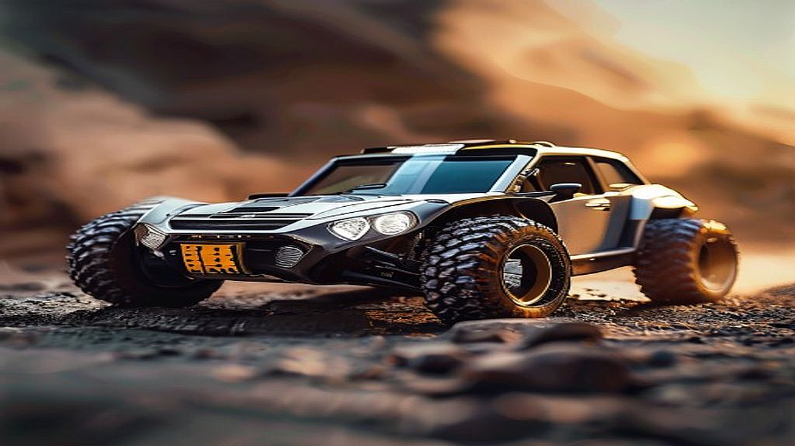

## 미니카의 귀환: 추억의 레이싱, 2026년형 튜닝의 세계

미니카의 귀환은 단순히 90년대 문방구 앞 트랙을 추억하는 복고 열풍이 아닙니다. 지금 20대 후반부터 40대까지의 키덜트들이 이 작은 모형 자동차에 다시 열광하는 이유는, 스마트폰 화면 속 가상 세계가 줄 수 없는 '물리적 정밀함'과 '직관적인 튜닝의 결과'를 갈구하기 때문입니다. 어린 시절 우리는 그저 건전지를 넣고 트랙에 올리기만 하면 그만이었지만, 지금의 어른들은 다릅니다. 모터의 회전수와 기어비, 타이어의 마찰 계수, 그리고 차체의 무게 중심을 계산하며 자신만의 레이싱 머신을 설계합니다. 이 취미는 더 이상 장난감이 아니라, 기계 공학적 호기심을 충족하는 정교한 엔지니어링의 영역으로 진화했습니다. 퇴근 후 책상 위에서 드라이버를 쥐고 나사 하나를 조이는 행위는, 복잡한 사회생활에서 잃어버렸던 통제권을 되찾는 과정이기도 합니다. 과연 성인이 된 우리가 다시 시작하는 미니카 취미는 어떤 모습이어야 할까요. 단순히 추억에 기대어 지갑을 여는 것이 아니라, 실질적인 만족을 얻기 위해 고려해야 할 선택의 기준을 지금부터 구체적으로 짚어보겠습니다.

## 첫 번째 머신 선택: 추억보다는 주행 환경을 먼저 고려할 것

미니카를 다시 시작할 때 가장 흔히 저지르는 실수는 '그때 그 시절 가장 빨랐던 모델'을 무작정 고르는 것입니다. 과거의 향수는 소장 가치에는 영향을 주지만, 현재의 레이싱 환경에서는 오히려 불리할 수 있습니다. 2026년 현재, 미니카를 즐기는 성인들이 고려해야 할 제1의 기준은 '주행 목적'입니다. 단순히 집에서 정비하고 트랙을 도는 것을 즐길 것인지, 아니면 공식 대회 규정에 맞춘 고성능 튜닝을 지향할 것인지에 따라 선택지가 완전히 달라집니다.

실제 사례로, 입문자가 무턱대고 복잡한 구조의 최신 섀시를 구매했다가 조립 과정에서 기어 맞물림을 제대로 구현하지 못해 모터만 태워 먹는 경우가 허다합니다. 실패를 피하려면 먼저 '입문용 샤시'를 고르는 것이 좋습니다. 타미야 기준으로 가장 대중적이고 부품 수급이 원활한 샤시 타입을 선택해야 나중에 튜닝 파츠를 교체할 때 시행착오를 줄일 수 있습니다.

선택 기준은 명확합니다. 만약 당신이 퇴근 후 1시간 이내의 짧은 집중을 원한다면, 부품 간의 유격이 적고 기본기가 탄탄한 완성형 키트를 고르십시오. 피해야 할 경우는 '디자인만 보고 고르는 경우'입니다. 겉모습이 화려해도 섀시의 구조가 튜닝 파츠와 호환되지 않으면, 나중에 성능을 올리고 싶어도 부품을 구할 수 없어 취미 자체가 정체됩니다. 예산은 초기 키트와 기본 공구 세트를 합쳐 약 5만 원 내외로 시작하는 것이 적당합니다. 여기서 더 욕심을 내기보다, 일단 기본 상태로 트랙을 완주하는 경험을 먼저 쌓아야 합니다.

## 튜닝의 함정: 정밀함이 곧 속도라는 착각을 버려라

미니카 튜닝은 '무조건 많이 달면 빨라진다'는 공식이 통하지 않는 세계입니다. 어른들의 튜닝은 종종 과유불급의 늪에 빠지곤 합니다. 롤러를 많이 달고, 무게추를 덕지덕지 붙이면 차체는 무거워지고, 오히려 코너링 속도는 저하됩니다. 2026년형 튜닝의 핵심은 '밸런스'입니다. 모터의 파워를 얼마나 효율적으로 노면으로 전달하느냐, 그리고 점프 구간에서 얼마나 안정적으로 착지하느냐가 승패를 결정합니다.

실제 실패 케이스를 보면, 고출력 모터를 먼저 장착하고 섀시 강성을 고려하지 않아 트랙 이탈이 잦아지는 경우가 많습니다. 모터 업그레이드는 가장 마지막 단계여야 합니다. 먼저 해야 할 것은 타이어의 접지력 조절과 롤러의 각도 조정입니다. 

### 실전 체크리스트: 지금 내 미니카가 느린 이유
* 타이어 표면이 경화되지 않았는가? (오래된 타이어는 마찰력이 낮아 코너에서 미끄러짐)
* 롤러의 나사가 헐겁지 않은가? (주행 중 진동으로 나사가 풀리면 코너링이 불안정해짐)
* 기어 박스 내부에 구리스가 적절히 도포되었는가? (건조한 기어는 마찰열로 인해 모터 부하를 높임)
* 무게 중심이 너무 높지 않은가? (카울 위에 무거운 장식을 올리면 점프 후 전복 확률이 급증함)

이 체크리스트를 통해 자신의 미니카를 매일 점검하십시오. 특히 롤러의 위치와 각도는 트랙의 벽면과 닿는 면적을 계산해야 하는데, 이는 단순히 조립하는 것을 넘어 물리적 환경을 이해하는 과정입니다. 튜닝은 '더하는 것'이 아니라 '불필요한 저항을 깎아내는 것'이라는 점을 기억하십시오.

## 커뮤니티와 공간: 혼자 하는 취미에서 함께하는 즐거움으로

미니카는 혼자서도 즐길 수 있지만, 정작 실력을 키우는 것은 결국 다른 이들의 세팅을 볼 때 가능합니다. 온라인 커뮤니티나 지역 소모임에 참여하는 이유는 단순히 정보를 얻기 위해서가 아닙니다. 내 차가 왜 트랙에서 튕겨 나가는지, 옆 사람의 차는 왜 그 구간을 부드럽게 통과하는지 직접 눈으로 확인하는 것이 가장 빠른 학습법입니다.

많은 이들이 오프라인 매장에 가는 것을 부담스러워하지만, 사실 미니카 매장은 가장 폐쇄적이면서도 개방적인 곳입니다. 자신의 세팅을 공개하고 조언을 구하면, 고수들은 흔쾌히 자신의 노하우를 공유합니다. 팁을 하나 드리자면, 처음 매장에 방문할 때는 자신의 미니카를 직접 가져가서 트랙에서 주행해보는 모습을 보여주십시오. 백 마디 질문보다 한 번의 주행이 더 많은 피드백을 불러옵니다.

피해야 할 태도는 '내 방식만 고집하는 것'입니다. 20년 전의 지식과 지금의 레이싱 트렌드는 다릅니다. 당시에는 모터 힘으로 밀어붙였다면, 지금은 감속과 가속의 타이밍을 제어하는 기술이 주류입니다. 커뮤니티 활동을 통해 변화된 규정과 튜닝 트렌드를 수용하는 유연함이 필요합니다. 공간의 경우, 집 안에 1미터 정도의 테스트 트랙을 구비하는 것은 추천하지만, 무리해서 거대한 레이싱 트랙을 집 안에 들일 필요는 없습니다. 유지비는 소모품인 건전지와 타이어 교체 비용으로 월 2~3만 원 정도면 충분합니다.

## 오늘 당장 시작하는 미니카 라이프

미니카의 귀환은 우리에게 '성취의 감각'을 돌려줍니다. 성인이 되어 즐기는 이 취미는 단순히 과거의 향수를 쫓는 것이 아니라, 정밀한 기계 조작을 통해 자신의 한계를 시험하는 엔지니어링의 과정입니다. 오늘 소개한 선택 기준과 튜닝 철학을 바탕으로, 여러분의 책상 위에 작은 레이싱 머신 한 대를 올려보십시오. 

처음에는 저렴한 기본 키트를 선택하여 조립의 즐거움을 느끼고, 차근차근 튜닝 파츠를 하나씩 추가하며 변화하는 주행 성능을 체감하십시오. 중요한 것은 완벽한 머신을 만드는 것이 아니라, 자신의 손으로 직접 조정한 차가 트랙을 매끄럽게 돌아나가는 그 순간의 희열을 맛보는 것입니다. 지금 당장 가까운 매장을 검색하거나 온라인으로 기본 키트를 주문하는 것부터 시작하십시오. 여러분의 추억은 이제 낡은 서랍 속이 아니라, 2026년의 레이싱 트랙 위에서 다시 달릴 준비를 마쳤습니다. 매일 조금씩 더 정교해지는 자신의 실력을 확인하며, 일상 속 작은 성취를 쌓아가는 즐거움을 만끽하시길 바랍니다. 미니카는 여러분의 인내와 정성을 기다리고 있습니다. 오늘 저녁, 드라이버를 잡고 나사 하나를 조이는 것부터 시작해 보시는 건 어떨까요.

## 마치며

미니카 튜닝은 단순한 장난감 조립을 넘어, 자신만의 레이싱 철학을 완성해가는 정교한 엔지니어링의 과정입니다. 2026년형 튜닝의 세계는 그 어느 때보다 진화했지만, 핵심은 여전히 변함없습니다. 오늘 살펴본 선택 기준과 튜닝의 묘미를 기억하며, 여러분만의 머신을 직접 손끝으로 완성해 보시기 바랍니다.

처음은 작고 소박한 기본 키트로 시작해도 좋습니다. 하나씩 파츠를 교체하며 트랙 위에서 변화하는 주행 성능을 체감하다 보면, 어느새 일상 속 작은 성취감과 함께 잊고 있던 추억이 생생하게 되살아날 것입니다. 완벽함을 쫓기보다는 내 손으로 직접 조정한 차가 트랙을 시원하게 질주하는 그 순간의 희열을 즐겨보세요.

자, 이제 서랍 속 추억을 꺼낼 시간입니다. 지금 바로 가까운 매장을 방문하거나 온라인으로 첫 번째 키트를 주문해 보세요. 오늘 저녁, 드라이버를 잡고 나사 하나를 조이는 그 작은 시작이 여러분의 2026년을 더욱 짜릿한 레이싱으로 채워줄 것입니다. 여러분의 머신은 지금 이 순간에도 트랙 위를 달릴 준비를 마쳤습니다. 즐거운 레이싱 라이프를 응원합니다!
