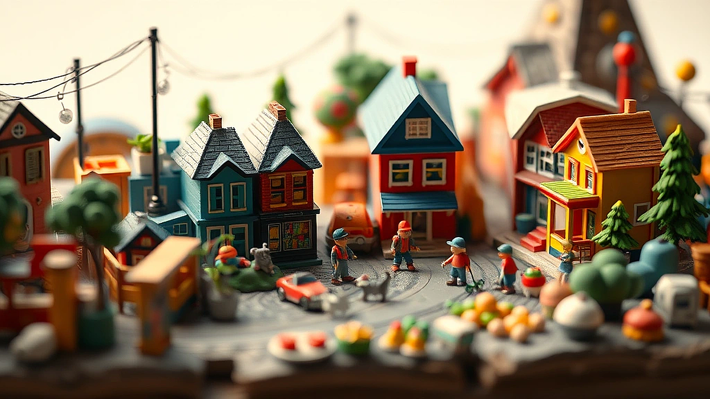

# 작지만 거대한 세상, 40대 키덜트가 미니어처에 빠진 이유

**미니어처**의 작은 세상에 한번 발을 들이면, 좀처럼 헤어나오기 힘들다는 말이 있습니다. 안녕하세요, 어릴 적 문방구 앞 뽑기 기계와 조립식 로봇에 영혼을 바쳤던, 이제는 어엿한 40대 아저씨이자 피규어와 레고로 책장 한편을 채워가는 키덜트 수집가입니다. 제 수집 목록에 레고 스타워즈 UCS 시리즈와 마블 핫토이 피규어 사이에, 조금은 쌩뚱맞아 보이는 작은 세계가 자리 잡고 있는데요. 바로 손톱보다 작은 빵과 그릇, 앤티크한 가구들로 채워진 미니어처의 세계입니다.

처음에는 저도 ‘이걸 왜 모으지?’ 싶었어요. 큼직하고 박력 넘치는 로봇이나 정교한 12인치 피규어에 비하면 너무 아기자기하게 느껴졌거든요. 그런데 어느 날, 인터넷에서 우연히 본 미니어처 공방 사진 한 장에 그야말로 ‘심쿵’하고 말았습니다. 실제보다 더 실제 같은 낡은 가죽 소파, 김이 모락모락 날 것만 같은 라멘 한 그릇, 햇살이 비치는 작은 서재의 풍경. 그 작은 공간 안에 담긴 디테일과 이야기가 제 마음을 흔들더군요. 그건 단순히 크기를 줄여놓은 모형이 아니었어요. 누군가의 시간과 정성, 그리고 추억이 꾹꾹 눌러 담긴 하나의 작품이었습니다. 그날 이후, 저는 홀린 듯 미니어처의 세계를 탐험하기 시작했고, 오늘은 여러분께 그 매력적인 세계로 향하는 작은 문을 열어드리고자 합니다.

## 처음 미니어처를 시작하는 당신에게

모든 시작이 그렇듯, 저의 첫 미니어처 도전은 솔직히 말해 처참했습니다. 의욕만 앞서서 인터넷에서 가장 화려해 보이는 ‘유럽풍 3층 저택 만들기’ DIY 키트를 덜컥 구매했죠. 상자를 열자마자 쏟아지는 깨알 같은 부품들과 몇 장짜리 빽빽한 설명서를 보고는 그대로 상자를 닫아버릴 뻔했습니다. "아, 이건 내 길이 아닌가?" 싶었죠. 핀셋으로 잡기도 힘든 작은 나무 조각에 목공용 풀을 바르다가 손에 다 묻히고, 벽지를 삐뚤게 붙여서 떼어내다 찢어먹기 일쑤였습니다. 며칠 밤낮을 끙끙대며 겨우 완성하긴 했지만, 결과물은 전문가의 샘플 사진과는 거리가 먼, 어딘가 허술하고 삐딱한 ‘폐가’에 가까웠습니다.

이런 시행착오를 겪고 나서야 깨달았습니다. 미니어처는 '완벽함'을 추구하는 것보다 '과정'을 즐기는 것이 훨씬 중요하다는 것을요. 혹시 저처럼 성급한 마음에 어려운 키트부터 도전하려는 분이 계시다면, 잠시만요! 제 실패담에서 얻은 몇 가지 팁을 먼저 들어보세요.

*   **작고 간단한 키트부터 시작하세요.** 처음에는 방 하나짜리, 혹은 가구 한두 개를 만들어보는 작은 키트로 시작하는 걸 강력 추천합니다. 요즘은 ‘Robotime’이나 ‘Rolife’ 같은 브랜드에서 초심자용으로 나온 예쁜 미니어처 하우스 키트가 정말 많아요. 설명서도 친절하고 부품도 잘 맞아서 성취감을 느끼기 딱 좋습니다. 저도 그 ‘폐가’ 사건 이후, 작은 ‘꽃집’ 키트를 만들면서 비로소 미니어처의 재미를 알게 되었답니다.

*   **도구는 기본만 갖추면 충분합니다.** 비싼 전문가용 도구 세트를 처음부터 살 필요는 없어요. 딱 세 가지만 기억하세요. **정밀한 핀셋, 잘 드는 아트 나이프(커터칼), 그리고 용도에 맞는 접착제.** 특히 접착제가 중요한데요. 나무나 종이는 목공용 풀, 플라스틱이나 작은 장식은 순간접착제를 쓰는 식으로 구분해서 사용해야 깔끔하게 완성할 수 있습니다. 저는 처음에 아무 생각 없이 만능 본드 하나로 다 붙이려다 여기저기 허옇게 자국만 남겼던 아픈 기억이 있습니다.

*   **시간을 즐기세요.** 미니어처 만들기는 시간과의 싸움이 아니라, 나 자신과 마주하는 명상의 시간과도 같습니다. 조급해하지 말고, 좋아하는 음악을 틀어놓고 차 한잔 마시면서 천천히 만들어보세요. 조금 삐뚤어져도 괜찮고, 색칠이 살짝 엇나가도 괜찮습니다. 그게 바로 ‘나만의 작품’이라는 증거니까요. 제 첫 작품인 그 어설픈 저택, 지금도 제 작업실 한편에 소중히 간직하고 있습니다. 볼 때마다 그때의 열정과 풋풋함이 떠올라 미소가 지어지거든요.

## 음식부터 가구까지, 어떤 미니어처를 모을까?

DIY 키트로 손맛을 좀 봤다면, 이제 본격적으로 수집의 세계로 넘어올 차례입니다. 미니어처의 장르는 생각보다 훨씬 다양해서, 한번 빠지면 통장 잔고가 위험해질 수 있으니 조심해야 합니다. (이건 진심 어린 조언입니다!) 저 역시 처음엔 DIY 키트만 만들다가, 어느새 일본 식완(食玩)의 세계에 눈을 뜨고, 실바니안 패밀리의 가구에 감탄하며 하나둘씩 사 모으기 시작했죠. 여러분의 취향을 저격할 만한 몇 가지 대표적인 미니어처 장르를 소개해 드릴게요.

### 실바니안 패밀리와 돌하우스: 감성의 끝판왕

아마 어릴 적 여자아이들 장난감 코너에서 한 번쯤 보셨을 겁니다. 귀여운 동물 인형 가족들이 아기자기한 집과 가구 속에서 살아가는 ‘실바니안 패밀리’ 말이죠. 사실 이건 아이들만의 전유물이 아닙니다. 성인 컬렉터들 사이에서도 엄청난 인기를 누리고 있어요. 특히 1980~90년대에 출시된 빈티지 제품들은 구하기도 힘들뿐더러 가격도 꽤 나갑니다. 실바니안의 매력은 단순히 귀여움을 넘어, 그 특유의 따뜻하고 포근한 감성에 있습니다. 불이 들어오는 벽난로, 서랍이 열리는 작은 장롱, 섬세한 무늬의 찻잔 세트까지. 이 작은 소품들을 하나씩 모아 나만의 ‘드림 하우스’를 꾸미다 보면, 팍팍한 현실을 잠시 잊고 동화 속 세상에 들어온 듯한 기분을 느낄 수 있습니다. 저도 아내의 등짝 스매싱을 각오하고 커다란 ‘불이 들어오는 이층집’을 들여놨는데, 가끔씩 가구 배치를 바꾸고 작은 인형들을 앉혀놓고 있으면 그렇게 마음이 편안해질 수가 없더라고요.

### 리멘트 식완: 작지만 확실한 행복

만약 저처럼 먹는 것에 진심인 분이라면, 일본의 ‘리멘트(Re-Ment)’에서 나오는 식완 시리즈는 그냥 지나칠 수 없을 겁니다. ‘식완’은 식품 완구의 줄임말로, 과자나 껌에 작은 장난감이 덤으로 들어있는 상품을 말해요. 리멘트의 ‘푸치 샘플(Puchi Sample)’ 시리즈는 그야말로 미니어처 음식계의 명품이라고 할 수 있습니다. 초밥 세트의 반투명한 생선살 표현, 돈가스 정식의 바삭해 보이는 튀김옷, 케이크의 섬세한 크림 장식까지. 보고 있으면 감탄이 절로 나옵니다. 대부분 ‘블라인드 박스’ 형태로 판매되기 때문에, 어떤 제품이 나올지 모르는 두근거림도 수집의 큰 재미 중 하나죠. 최근에는 ‘스누피’, ‘포켓몬스터’ 등 유명 캐릭터와 협업한 시리즈도 많이 나와서 수집욕을 더욱 자극합니다. 단종된 옛날 시리즈는 프리미엄이 붙어 중고 시장에서 비싸게 거래되기도 하니, 마음에 드는 시리즈가 있다면 망설이지 말고 구매하는 것이 좋습니다. 저도 몇 년 전에 놓쳤던 ‘우리집 주방’ 시리즈를 구하려고 발품을 팔았던 기억이 생생하네요.

## 40대 수집가의 실전 팁: 실패 없이 즐기는 법

어느 정도 미니어처의 세계에 익숙해졌다면, 이제는 좀 더 ‘현명한 수집가’가 될 시간입니다. 그저 예쁘다고, 갖고 싶다고 닥치는 대로 사 모으다 보면 어느새 집은 포화상태가 되고, 지갑은 가벼워지기 마련이죠. 저 역시 초반에 비슷한 실수를 반복했습니다. 충동적으로 구매했다가 막상 다른 소품들과 어울리지 않아 서랍 속에 잠자고 있는 미니어처들이 꽤 있거든요. 몇 번의 수업료를 지불하고 얻은, 조금 더 실용적인 팁 몇 가지를 공유해볼까 합니다.

*   **보관과 전시, 처음부터 계획하세요.**
    수집의 가장 큰 적은 ‘먼지’와 ‘변색’입니다. 아무리 예쁜 미니어처라도 먼지가 뽀얗게 쌓여있으면 그 매력이 반감되죠. 처음부터 아크릴 케이스나 유리 장식장을 활용하는 것을 추천합니다. 특히 ‘다이소’나 ‘무인양품’에서 판매하는 투명 아크릴 정리함은 가성비 좋은 훌륭한 대안이 될 수 있습니다. 저는 칸이 나뉘어 있는 아크릴 케이스에 테마별로 식완을 정리해두는데, 보기에도 좋고 관리도 편해서 아주 만족하고 있습니다. 또한, 직사광선은 플라스틱을 변색시키는 주범이니 전시는 꼭 그늘진 곳에 해주세요. 소중한 컬렉션이 누렇게 바래는 것만큼 가슴 아픈 일도 없으니까요.

*   **가격과 리세일 가치를 고려하는 눈.**
    모든 수집품이 재테크 수단이 될 수는 없지만, 기왕이면 가치가 보존되거나 오를 수 있는 제품을 알아보는 안목도 중요합니다. 미니어처 세계에도 ‘한정판’과 ‘단종품’이 존재합니다. 특히 리멘트의 초기 시리즈나 특정 브랜드의 기념판 제품들은 시간이 지날수록 가치가 오르는 경우가 많습니다. 중고 거래 사이트나 해외 경매 사이트(eBay 등)에서 시세를 종종 확인해보는 습관을 들이면 좋습니다. 구매할 때는 가급적 **원래 포장 박스를 버리지 말고 보관**하세요. 박스의 유무에 따라 나중에 중고로 판매할 때 가격 차이가 꽤 크게 날 수 있습니다. 물론 가장 중요한 것은 내가 그 물건을 얼마나 아끼고 좋아하는지이지만, 이런 실용적인 부분도 알아두면 분명 도움이 됩니다.

*   **커뮤니티에서 정보를 얻으세요.**
    혼자서 모든 정보를 찾는 데는 한계가 있습니다. 네이버 카페나 페이스북 그룹 등 미니어처 관련 커뮤니티에 가입해 보세요. 다른 사람들은 어떤 작품을 만드는지, 요즘 유행하는 아이템은 무엇인지, 어디서 저렴하게 구매할 수 있는지 등 살아있는 정보를 얻을 수 있는 최고의 장소입니다. 저도 커뮤니티에서 알게 된 해외 직구 사이트 덕분에 국내에서는 구하기 힘든 희귀한 재료를 구매한 경험이 있습니다. 다른 사람들의 멋진 작품 사진을 보는 것만으로도 새로운 영감을 얻고, 창작 의욕을 불태울 수 있을 겁니다.

## 작은 세상에서 찾는 나만의 큰 행복

어느새 제 방 한쪽 벽면은 큼직한 로봇들과 함께, 손톱만 한 그릇과 의자들이 옹기종기 모여있는 작은 세상으로 채워졌습니다. 누군가는 40대 남자의 취미로는 조금 엉뚱하다고 생각할지도 모르겠습니다. 하지만 저는 이 작은 세상을 들여다보고, 만들고, 정리하는 시간 속에서 그 어떤 취미에서도 얻지 못했던 평온함과 만족감을 느낍니다.

미니어처는 단순히 작은 물건을 모으는 행위를 넘어, 잊고 있던 어린 시절의 꿈, 내가 만들고 싶었던 공간, 그리고 소소한 일상의 행복을 내 손으로 직접 구현해내는 과정입니다. 복잡하고 빠르게 돌아가는 세상 속에서 잠시 멈춰 서서, 아주 작은 것에 집중하며 오롯이 나만의 시간을 가질 수 있게 해주는 소중한 탈출구이기도 하고요.

혹시 이 글을 읽고 마음이 조금이라도 움직이셨다면, 오늘 퇴근길에 가까운 문구점이나 소품 샵에 한번 들러보시는 건 어떨까요? 그곳에서 당신의 마음을 사로잡을 작은 미니어처 키트 하나를 발견하게 될지도 모릅니다. 그렇게 당신만의 작지만 거대한 세상이 시작될 수 있기를, 같은 취미를 가진 동료로서 진심으로 응원합니다.

## 마치며

이처럼 미니어처는 단순히 크기가 작은 소품을 넘어, 바쁜 일상 속에서 잊고 있던 소소한 행복과 나만의 속도를 되찾게 해주는 특별한 취미입니다. 처음에는 무엇부터 시작해야 할지 막막할 수도 있습니다. 하지만 거창한 계획은 잠시 접어두고, 그저 마음이 이끄는 작은 조각 하나부터 시작해보세요. 작은 의자 하나, 귀여운 찻잔 세트 하나를 완성했을 때의 그 뿌듯함은 분명 당신의 일상에 새로운 활력을 불어넣어 줄 것입니다.

망설이지 마세요. 당신의 손끝에서 펼쳐질 무한한 가능성의 세계가 기다리고 있습니다. 이 글이 당신의 첫걸음에 작은 용기가 되었기를 바랍니다. 언젠가 당신이 만든 작고 아름다운 세상 이야기를 들을 수 있기를 기대하며, 새로운 미니어처 동료가 되실 여러분을 환영합니다.