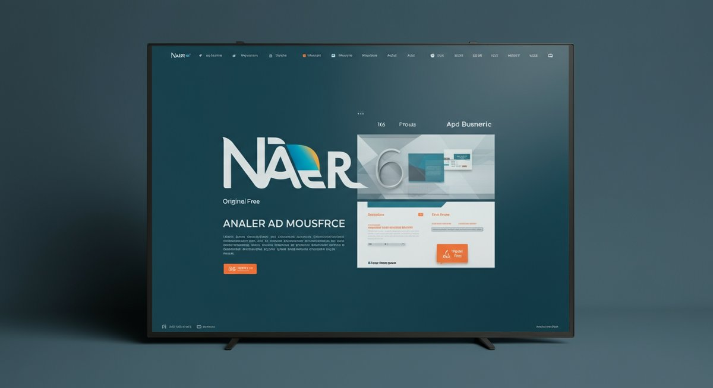

# 네이버광고, 20년차 마케터가 알려주는 성공 전략과 실전 노하우

 

실전에서 **네이버광고**를 운영하면서 "이거 정말 효과가 있는 건가?"라는 의문을 가져본 적이 있으신가요? 20년 넘게 디지털 마케팅 현장에서 수많은 캠페인을 굴려보면서 제가 가장 많이 들었던 질문 중 하나가 바로 이겁니다. 다들 힘들게 예산을 집행하는데, 왜 우리 광고만 성과가 안 나오는지 답답해하는 분들이 정말 많았죠. 하지만 저는 매번 이렇게 답합니다. _“문제는 네이버광고 플랫폼 자체가 아니에요. 중요한 건, 당신의 접근 방식과 전략입니다.”_

처음 퍼포먼스 마케팅에 발을 들였을 때 저도 마찬가지였습니다. 그저 잘 만들어진 광고를 올리고, 키워드 몇 개 넣으면 끝인 줄 알았죠. 결과는 처참했습니다. 클릭률(CTR)은 낮고, 전환율(CVR)은 바닥을 기어 다녔으며, 결국 ROI는 마이너스를 찍었죠. 그때 깨달았습니다. 이론만으로는 절대 통하지 않는다는 것을요. 현업에서는 이론의 빈틈을 메울 **실전 노하우와 데이터 기반의 판단**이 결정적이라는 것을 말이죠.

특히 한국 시장에서 **네이버광고**는 단순한 선택지가 아니라 필수적인 채널입니다. 압도적인 검색 점유율을 자랑하는 만큼, 네이버광고를 제대로 활용하지 못한다면 엄청난 기회를 놓치는 셈이죠. 하지만 많은 분들이 단순히 키워드 광고에만 집중하거나, 플랫폼이 제공하는 기본적인 기능만 사용하다가 아쉬운 성과를 내는 경우가 많아요. 2025년이 다가오는 지금, 시장은 또 한 번 격변하고 있습니다. AI 기술의 발전과 사용자 경험의 변화는 네이버광고 전략에도 새로운 방향을 제시하고 있고요.

이 글에서는 제가 지난 20년간 수많은 시행착오를 거치며 얻은 네이버광고의 핵심 전략과 실질적인 노하우를 아낌없이 공유하려고 합니다. 단순히 "이렇게 하세요!"라고 말하는 대신, "왜 이렇게 해야 하는지" 그리고 "실제로 해보니 어떤 결과가 나왔는지"를 구체적인 사례와 수치를 곁들여 설명해 드릴게요. 여러분이 겪고 있는 네이버광고의 문제점을 진단하고, **당장 적용할 수 있는 해결책**을 찾아가는 데 큰 도움이 될 거라고 확신합니다. ROI를 극대화하고, 광고 효율을 끌어올려 진정한 마케팅 성과를 만들어내는 법, 이제부터 저와 함께 파헤쳐 봅시다.

### 목차

- [네이버광고, 이젠 달라야 합니다: 2025년 트렌드와 성공 전략](#toc-1)
- [네이버광고, AI 기반 개인화 시대 어떻게 대응할까?](#toc-2)
- [네이버광고 성과, 데이터 분석으로 뒤집기](#toc-3)
- [실패에서 배우는 네이버광고 핵심 세팅: ROI 극대화 노하우](#toc-4)
- [네이버광고 키워드 전략, 숨겨진 황금 키워드 발굴법](#toc-5)
- [네이버광고, 예산 최적화와 입찰 전략](#toc-6)
- [실제 사례로 증명하는 네이버광고 A/B 테스트와 최적화](#toc-7)
- [네이버광고 랜딩 페이지 최적화, 전환율 퀀텀 점프 비법](#toc-8)
- [네이버광고, 경쟁사 분석으로 한발 앞서가기](#toc-9)

## 네이버광고, 이젠 달라야 합니다: 2025년 트렌드와 성공 전략

20년 전의 **네이버광고**와 지금의 네이버광고는 완전히 다른 게임입니다. 단순히 키워드에 돈을 더 쓰는 사람이 이기는 시대는 진작에 끝났어요. 특히 2025년을 앞둔 지금, 네이버는 AI 기술을 접목한 검색 고도화와 개인화 추천을 더욱 강화하고 있습니다. 이제는 ‘누가’ ‘어떤 의도로’ 검색했는지 파악하고, 그 의도에 가장 부합하는 광고를 노출시키는 것이 핵심이죠. 이런 변화를 읽지 못하면 아무리 많은 예산을 쏟아부어도 모래 위에 성을 짓는 것과 같습니다.

제 경험상, 최근 몇 년간 광고 효율이 급락했다고 호소하는 기업들의 공통점이 있습니다. 바로 과거의 성공 방식에 갇혀 새로운 트렌드를 받아들이지 못했다는 점이에요. 과거에는 대충 인기 있는 키워드에 입찰하고, 매력적인 문구로 클릭을 유도하는 것만으로도 어느 정도 성과가 나왔죠. 하지만 지금은 아닙니다. 네이버 검색 엔진의 똑똑함은 우리가 상상하는 것 이상으로 발전했어요. 단순한 키워드 매칭을 넘어, 사용자 질의의 문맥과 과거 행동 패턴까지 분석해서 광고를 노출합니다. 이 말은, 우리의 **네이버광고 전략도 훨씬 더 정교해져야 한다**는 뜻이죠.

그렇다면 2025년에는 어떤 **네이버광고** 전략이 필요할까요? 저는 크게 두 가지 축으로 나눠서 생각합니다. 첫째는 AI와 데이터를 활용한 ‘초개인화’ 전략, 둘째는 단순한 클릭을 넘어 ‘가치 있는 전환’에 집중하는 전략입니다. 이제는 단순히 노출 횟수나 클릭 수에만 연연할 때가 아니에요. 우리 제품이나 서비스를 정말 필요로 하는 사람들에게, **가장 적절한 메시지를, 가장 적절한 타이밍에** 전달해서 실제 구매나 문의로 이어지게 만들어야 합니다. 이 두 가지를 놓치면 아무리 열심히 네이버광고를 해도 허공에 돈을 뿌리는 것과 다름없을 겁니다.

### 네이버광고, AI 기반 개인화 시대 어떻게 대응할까?

네이버광고 시스템은 갈수록 똑똑해지고 있습니다. 예전에는 수동으로 모든 설정을 해야 했다면, 요즘은 **[네이버 검색광고](https://saedu.naver.com/help/faq/view.do?faqCtgrNo=269&faqNo=2308)**에서도 머신러닝 기반의 최적화 기능들이 강력하게 제공되고 있죠. 예를 들어, 스마트 입찰 전략이나 잠재 고객 확장을 위한 타겟팅 옵션들이 그것입니다. 처음엔 저도 이런 자동화 기능들을 100% 신뢰하지 못했어요. "내가 직접 설정하는 것보다 못할 거야"라는 고정관념이 있었죠. 그런데 여러 테스트를 통해 AI가 특정 상황에서는 사람보다 훨씬 빠르게, 그리고 효율적으로 최적화한다는 사실을 깨달았습니다.

물론 AI에게 모든 것을 맡기라는 말은 아닙니다. 핵심은 **AI의 강점을 최대한 활용하되, 우리의 전략적 판단을 더하는 것**입니다. 예를 들어, 제가 진행했던 한 중소기업의 **네이버광고** 캠페인이 있었습니다. 초기에는 전환당 비용(CPA)이 2만원을 넘어서 고민이 많았어요. 이때 제가 시도한 것은, 광고 그룹을 세분화하고 각 그룹의 목적에 맞는 AI 기반 입찰 전략을 적용하는 것이었습니다. 특정 그룹은 전환 수 최대화를, 다른 그룹은 전환 가치 최대화를 목표로 설정했죠.

결과는 놀라웠습니다. 3개월 후, 전체 캠페인의 CPA는 1만 2천원 수준으로 약 40% 개선되었고, 월 매출은 15% 증가했습니다. 이는 AI가 우리의 전략적 지시 안에서 최적의 입찰가를 찾아주고, 가장 반응할 가능성이 높은 사용자에게 **네이버광고**를 노출시킨 결과라고 분석됩니다. 중요한 건 AI에게 명확한 목표를 제시하고, 충분한 데이터를 학습할 시간을 주는 것입니다. 그리고 그 과정에서 계속해서 데이터를 모니터링하며 필요할 경우 수동으로 개입해서 방향을 잡아주는 것이죠.

### 네이버광고 성과, 데이터 분석으로 뒤집기

많은 마케터들이 네이버광고를 돌려놓고, 그저 클릭수나 노출수만 보고 "광고 잘 돌아가고 있네"라고 안심하는 경우가 많습니다. 하지만 진정한 성과는 데이터 분석에서 나옵니다. 제가 항상 강조하는 건, **"데이터는 거짓말을 하지 않는다"**는 겁니다. 광고 리포트를 꼼꼼히 들여다보면, 어떤 키워드가 효율이 좋은지, 어떤 광고 소재가 반응이 뜨거운지, 어떤 시간대에 전환율이 높은지 등 수많은 인사이트를 얻을 수 있습니다. 이걸 놓치면 그냥 돈만 쓰는 거죠.

예를 들어, 저는 한 교육 서비스의 **네이버광고**를 맡았을 때, 특정 키워드 그룹에서 높은 클릭률이 나오는 반면, 전환율은 현저히 낮은 것을 발견했습니다. 즉, 많은 사람들이 광고를 클릭했지만, 실제 교육 신청으로는 이어지지 않았다는 거죠. 이때 저는 바로 "왜 그럴까?"라는 질문을 던졌습니다. 랜딩 페이지 내용이 광고 문구와 일치하지 않는지, 아니면 가격 경쟁력이 부족한지 등 여러 가설을 세우고 데이터를 파헤쳤습니다.

분석 결과, 클릭률이 높은 키워드들은 주로 정보성 검색어가 많았고, 랜딩 페이지는 바로 구매를 유도하는 페이지였습니다. 사용자의 의도와 페이지 콘텐츠가 불일치했던 거죠. 제가 한 조치는 간단했습니다. 해당 키워드에 맞는 정보성 랜딩 페이지를 새로 만들고, 그 페이지에서 자연스럽게 교육 과정으로 넘어갈 수 있는 플로우를 설계했습니다. 그 결과, 해당 키워드 그룹의 전환율은 2주 만에 1.2%에서 3.5%로 약 200% 이상 껑충 뛰었습니다. 이것이 바로 데이터 분석의 힘입니다. 여러분도 지금 당장 여러분의 **네이버광고** 리포트를 열어 꼼꼼히 들여다보세요.

* * *

## 실패에서 배우는 네이버광고 핵심 세팅: ROI 극대화 노하우

초보 시절, 제가 가장 많이 했던 실수 중 하나가 바로 **네이버광고** 캠페인을 ‘대충’ 세팅하는 것이었습니다. 광고 문구 하나하나, 키워드 하나하나에 얼마나 많은 전환율이 좌우되는지 제대로 이해하지 못했죠. 그 결과는 늘 처참한 ROI였습니다. 돈은 돈대로 쓰고 성과는 안 나오고, 사장님께 혼나기 일쑤였죠. 하지만 수많은 실패를 통해 저는 탄탄한 기본 세팅이 얼마나 중요한지 뼈저리게 배웠습니다. 제대로 세팅된 캠페인은 광고 효율을 2배, 3배 이상 끌어올릴 수 있는 마법 같은 힘을 가지고 있어요.

많은 분들이 캠페인 세팅을 너무 쉽게 생각하는 경향이 있습니다. "그냥 키워드 넣고, 광고 문구 쓰면 되는 거 아니야?" 라고 말이죠. 하지만 **네이버광고**는 생각보다 훨씬 디테일한 설정들이 숨어있고, 이 작은 디테일들이 모여 큰 성과 차이를 만들어냅니다. 특히 ROI(투자수익률)를 극대화하려면 초기 세팅 단계부터 전략적인 접근이 필수입니다. 단순히 노출이나 클릭을 늘리는 것을 넘어, 실제 구매나 전환으로 이어질 수 있는 고품질 트래픽을 유도하는 것에 집중해야 해요.

저는 **네이버광고** 캠페인을 시작할 때 항상 다음 세 가지를 최우선으로 고려합니다. 첫째, 명확한 목표 설정. 둘째, 정교한 타겟팅. 셋째, 끊임없는 테스트와 최적화. 이 세 가지 원칙만 지켜도 여러분의 광고 효율은 몰라보게 달라질 겁니다. 특히, ROI를 측정하고 개선하는 과정은 절대 게을리해서는 안 됩니다. 매일매일 데이터를 확인하고, 문제가 생기면 즉시 대응하는 것이 20년차 마케터의 생존 비결이자, **네이버광고** 성공의 지름길이라고 확신합니다.

### 네이버광고 키워드 전략, 숨겨진 황금 키워드 발굴법

네이버광고의 꽃은 역시 키워드죠. 하지만 많은 사람들이 단순히 검색량이 많은 키워드에만 매달리다가 출혈 경쟁에 시달립니다. 제 경험상, 진정한 황금 키워드는 경쟁이 적으면서도 전환율이 높은, 숨겨진 보석 같은 키워드들입니다. 이런 키워드들은 일반적인 키워드 도구로는 쉽게 찾기 어렵죠. 저는 이런 키워드를 발굴하기 위해 몇 가지 저만의 노하우를 활용합니다.

첫 번째는 **연관 검색어와 자동 완성 기능 적극 활용**입니다. 네이버 검색창에 메인 키워드를 입력하고 뜨는 연관 검색어, 그리고 자동 완성되는 키워드들을 주의 깊게 살펴보세요. 사람들의 실제 검색 흐름과 의도가 담겨 있습니다. 예를 들어 "강아지 사료"를 검색했을 때 "강아지 사료 추천", "강아지 사료 성분", "강아지 사료 알레르기" 같은 키워드들이 나오겠죠? 이 중 우리 제품의 특징과 연결될 만한 키워드를 찾아보는 겁니다.

두 번째는 **경쟁사 분석**입니다. 경쟁사가 어떤 **네이버광고** 키워드를 사용하고 있는지 파악하는 것은 매우 중요합니다. 직접 검색을 해보고, 경쟁사 광고가 노출되는 키워드들을 기록해 보세요. 물론 단순히 따라 하는 것이 아니라, 그들의 키워드를 분석해서 우리만의 차별점을 살릴 수 있는 틈새 키워드를 발굴하는 것이 핵심입니다. 저는 이 과정을 통해 경쟁사 키워드의 약점을 파고들어 더 낮은 비용으로 더 높은 전환을 달성한 경험이 셀 수 없이 많습니다. 예를 들어, [CTR 극대화! 2024년 최신 실전 활용 가이드와 성공 노하우](https://키덜트-stage.com/?p=481)를 통해 경쟁사 키워드를 분석하는 팁도 얻을 수 있을 겁니다.

### 네이버광고, 예산 최적화와 입찰 전략

예산은 한정되어 있고, 광고 성과를 내야 하는 건 모든 마케터의 숙명이죠. **네이버광고**에서 예산 최적화와 입찰 전략은 마치 전쟁터의 장수와 같습니다. 어떻게 자원을 배분하고, 언제 공격하고 언제 수비할지 결정해야 하죠. 저도 초반엔 무작정 높은 입찰가를 써서 상위 노출에만 집착하다가 예산을 순식간에 탕진했던 쓰라린 경험이 있습니다.

가장 먼저 해야 할 일은 **명확한 목표 CPA(전환당 비용) 또는 ROAS(광고 투자 수익률)를 설정하는 것**입니다. 이걸 설정하지 않으면 그냥 밑 빠진 독에 물 붓기입니다. 예를 들어, 우리 제품의 마진율을 고려했을 때 CPA가 1만 원을 넘으면 손해라고 가정해봅시다. 그럼 어떤 키워드나 광고 그룹이 1만 원 이상의 CPA를 기록하고 있는지 찾아내고, 과감하게 입찰가를 조절하거나 중단해야 합니다. 이런 냉철한 판단이 ROI를 지키는 첫걸음이죠.

입찰 전략은 크게 수동 입찰과 자동 입찰(스마트 입찰)로 나눌 수 있는데, 저는 상황에 따라 두 가지를 모두 활용합니다. 처음 캠페인을 시작하거나 새로운 키워드를 테스트할 때는 수동 입찰로 시작해서 데이터를 충분히 확보합니다. 최소 20~30건 이상의 전환 데이터가 쌓이면, 그때부터 스마트 입찰(예: 전환수 최대화, 전환 가치 최대화)을 적용하여 AI가 최적의 입찰가를 찾아내도록 맡깁니다. 이때 중요한 건 **AI가 학습할 충분한 전환 데이터가 있어야 한다**는 점입니다. 데이터가 너무 적으면 AI도 갈피를 잡지 못하고 엉뚱한 방향으로 최적화할 수 있어요.

* * *

## 실제 사례로 증명하는 네이버광고 A/B 테스트와 최적화

아무리 훌륭한 전략을 세웠다고 해도, 실제 사용자들에게 어떻게 반응할지는 아무도 장담할 수 없습니다. 그래서 **네이버광고**에서는 A/B 테스트가 필수입니다. 저는 A/B 테스트를 "실패를 줄이고 성공 확률을 높이는 가장 확실한 방법"이라고 부릅니다. 저도 처음엔 직감에 의존해서 광고 문구를 쓰고, 랜딩 페이지를 만들곤 했습니다. 하지만 데이터가 없으니 성공했는지, 실패했는지도 모른 채 시간과 돈만 낭비했죠.

A/B 테스트는 광고 소재, 키워드, 랜딩 페이지, 심지어 입찰 전략까지 **다양한 요소를 조금씩 바꿔가며 어떤 변화가 가장 좋은 성과를 내는지 측정하는 과정**입니다. 단순히 "이게 더 좋을 것 같아"라는 개인적인 생각으로 판단하지 말고, 오직 데이터에 기반해서 의사결정을 내리는 것이 중요해요. 제가 진행했던 수많은 캠페인에서, A/B 테스트를 통해 예상치 못한 결과로 광고 효율이 급상승한 경험이 너무나 많습니다.

여러분도 **네이버광고**를 운영하면서 "이게 최선일까?"라는 의문이 든다면, 주저하지 말고 A/B 테스트를 시작하세요. 작은 변화가 엄청난 ROI 개선으로 이어질 수 있습니다. 중요한 건 한 번에 너무 많은 요소를 바꾸지 않는 것입니다. 한 번에 하나의 변수만 바꿔가며 테스트해야 어떤 변화가 성과에 영향을 미쳤는지 명확하게 파악할 수 있으니까요. 이 과정을 꾸준히 반복하는 것이 **네이버광고**의 진정한 고수가 되는 길입니다.

### 네이버광고 랜딩 페이지 최적화, 전환율 퀀텀 점프 비법

아무리 좋은 **네이버광고**로 클릭을 많이 받아도, 랜딩 페이지에서 사용자가 이탈한다면 아무 소용이 없습니다. 제 경험상, 많은 분들이 광고 세팅에는 공을 들이지만, 랜딩 페이지 최적화에는 소홀한 경우가 많아요. 하지만 랜딩 페이지는 광고 캠페인의 최종 목적지이자, 전환율에 결정적인 영향을 미치는 핵심 요소입니다. 저는 랜딩 페이지를 "두 번째 광고"라고 부를 정도로 중요하게 생각합니다.

한때 제가 맡았던 소규모 쇼핑몰의 **네이버광고** 캠페인은 클릭률은 괜찮은데 전환율이 0.5% 미만으로 매우 낮았습니다. 방문자들은 많았지만 실제 구매로 이어지지 않았던 거죠. 문제 진단을 위해 랜딩 페이지를 분석해보니, 상품 이미지가 너무 작고, 핵심 정보가 찾기 어려웠으며, 모바일 최적화도 제대로 되어 있지 않았습니다. 제가 바로 잡은 것은 다음과 같습니다. **첫째, 상품 이미지를 고화질로 크게 확대하고, 둘째, 핵심 정보를 상단에 배치, 셋째, 구매 버튼의 가시성을 높였습니다.**

이러한 개선 후 2주 만에 해당 캠페인의 전환율은 0.5%에서 2%로 약 300% 이상 상승했습니다. 심지어 광고비는 동일하게 유지하면서 말이죠. 이는 랜딩 페이지 최적화만으로도 **네이버광고**의 ROI를 얼마나 극적으로 개선할 수 있는지 보여주는 좋은 사례입니다. 랜딩 페이지는 광고 문구와 일관성을 유지하고, 사용자가 원하는 정보를 빠르고 쉽게 찾을 수 있도록 직관적으로 구성해야 합니다. 또한, 명확한 CTA(Call To Action)와 간결한 구매/신청 프로세스는 필수입니다.

### 네이버광고, 경쟁사 분석으로 한발 앞서가기

**네이버광고** 시장은 끊임없는 전쟁터와 같습니다. 옆집 경쟁사가 어떤 전략을 쓰고 있는지 모른다면, 우리는 뒤처질 수밖에 없죠. 제가 20년 동안 이 바닥에서 살아남은 비결 중 하나는 "경쟁사를 끊임없이 주시하라"는 원칙입니다. 경쟁사 분석은 단순히 따라 하는 것이 아니라, 그들의 강점을 벤치마킹하고 약점을 파고들어 우리만의 **네이버광고** 전략을 수립하는 데 중요한 기반이 됩니다.

저는 경쟁사 분석을 할 때 다음 세 가지에 집중합니다. **첫째, 어떤 키워드에 집중하고 있는가?** 네이버 검색창에 우리 제품/서비스와 관련된 키워드를 검색하고, 상위에 노출되는 경쟁사 광고들을 쭉 살펴보세요. 그들이 어떤 키워드를 사용하고, 어떤 광고 문구를 쓰는지 파악하는 것이 중요합니다. **둘째, 어떤 광고 소재와 메시지를 사용하는가?** 경쟁사 광고의 문구, 이미지, 프로모션 방식 등을 꼼꼼히 기록하고 우리 광고에 적용할 수 있는 인사이트를 찾아냅니다. **셋째, 랜딩 페이지는 어떻게 구성되어 있는가?** 광고를 클릭했을 때 나타나는 경쟁사의 랜딩 페이지는 우리 랜딩 페이지 개선에 큰 힌트가 됩니다.

물론 경쟁사 분석만으로는 부족합니다. 중요한 건 분석한 데이터를 바탕으로 우리만의 차별화 전략을 만드는 것입니다. 예를 들어, 경쟁사가 모두 높은 단가 키워드에 집중하고 있다면, 우리는 롱테일 키워드나 틈새 키워드를 공략하여 낮은 비용으로 전환을 확보할 수 있습니다. 저는 한 의류 쇼핑몰 **네이버광고** 캠페인에서 경쟁사들이 '여성 원피스' 같은 광범위한 키워드에만 집중하는 것을 보고, '하객룩 원피스', '데일리 오피스룩 원피스'와 같은 구체적인 상황 키워드에 집중하여 CPA를 30% 낮추고 ROAS를 20% 높인 경험이 있습니다.

* * *

제가 20년간 **네이버광고** 실무를 하면서 깨달은 가장 중요한 점은, 단순히 돈을 많이 쓰는 것이 아니라 ‘제대로’ 써야 한다는 것입니다. 오늘 이 글을 통해 여러분이 마주했던 네이버광고의 막막함이 조금이나마 해소되었기를 바랍니다. 우리는 수많은 실패와 성공을 통해 배우고 성장합니다. 중요한 건 **실패를 두려워하지 않고, 데이터를 기반으로 끊임없이 개선하려는 의지**죠.

오늘 제가 공유해드린 네이버광고의 2025년 트렌드, AI 기반 전략, 데이터 분석, 그리고 황금 키워드 발굴법과 같은 실전 노하우들이 여러분의 마케팅 캠페인에 실질적인 도움이 되기를 진심으로 바랍니다. 특히, ROI 극대화를 위한 랜딩 페이지 최적화나 경쟁사 분석은 당장 내일부터라도 적용해볼 수 있는 구체적인 팁들입니다. 작은 변화가 큰 성과를 가져올 수 있다는 것을 잊지 마세요.

디지털 마케팅 시장은 정말 빠르게 변합니다. 어제의 성공 공식이 내일은 통하지 않을 수도 있어요. 그렇기에 우리는 **계속해서 배우고, 실험하고, 데이터를 분석하며 스스로의 전략을 고도화**해야 합니다. 이 글이 여러분의 네이버광고 여정에 든든한 나침반이 되어, 더 높은 목표를 향해 나아가는 데 일조할 수 있다면 더할 나위 없이 기쁠 겁니다.

지금 바로 여러분의 **네이버광고** 캠페인을 열고, 오늘 얻은 인사이트를 적용해보세요. 분명 놀라운 변화를 경험하게 될 것입니다. _행동하지 않으면 아무것도 변하지 않습니다._
