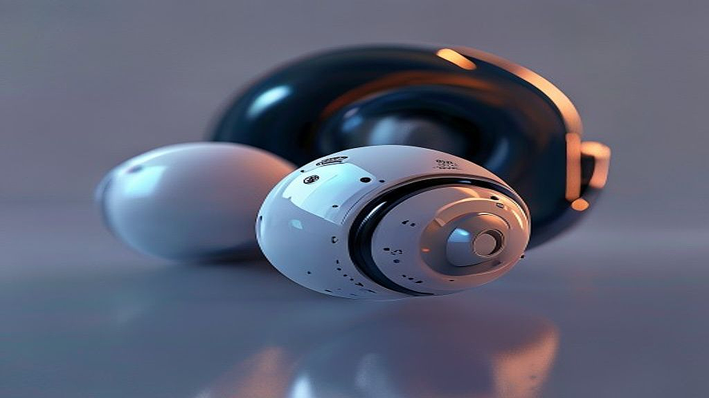

# 노이즈 캔슬링의 완성, 2026년형 무선 이어폰으로 듣는 몰입형 사운드

무선 이어폰과 노이즈 캔슬링 기술은 이제 단순히 음악을 듣는 도구를 넘어, 일상의 소음을 통제하고 나만의 공간을 확보하는 가장 효율적인 수단이 되었습니다. 여름 휴가철을 맞아 장시간 기차나 비행기를 타야 하는 직장인들에게, 주변의 소음을 지우고 온전히 음향기기 본연의 성능을 누리는 경험은 여행의 질을 결정짓는 핵심 요소입니다. 하지만 매년 쏟아지는 새로운 모델들 사이에서 나에게 맞는 제품을 고르기란 쉽지 않습니다. 단순히 비싼 제품이 모든 환경에서 최고의 소리를 들려주지는 않기 때문입니다. 오늘은 단순히 스펙을 나열하는 대신, 출퇴근길과 장거리 이동이라는 구체적인 상황 속에서 여러분의 귀를 만족시킬 제품을 선택하는 실질적인 기준과 체크포인트를 짚어보겠습니다.

## 첫 번째 기준: 저음역대 차단보다 중요한 것은 보컬의 선명도

많은 분이 노이즈 캔슬링 성능을 확인할 때 단순히 웅웅거리는 저음이 얼마나 사라지는지에만 집중합니다. 하지만 실제 지하철이나 카페에서 우리가 느끼는 피로감은 저음보다 사람의 말소리나 갑작스러운 고음역대 소음에서 옵니다. 고성능 이어폰은 엔진 소음 같은 일정한 주파수뿐만 아니라, 불규칙한 사람의 목소리까지 얼마나 자연스럽게 상쇄하느냐가 관건입니다.

실제 사례를 들어보겠습니다. 소음이 심한 지하철에서 보컬 중심의 발라드를 들을 때, 노이즈 캔슬링이 강하기만 한 제품은 오히려 보컬의 배음까지 깎아먹어 소리가 먹먹하게 들리는 경우가 있습니다. 반면, 적절한 프로세싱을 거치는 제품은 소음은 지우되 음악의 질감은 살려냅니다.

실패하기 쉬운 케이스는 무조건 노이즈 캔슬링 강도가 '최대'인 제품만 고집하는 것입니다. 강한 압박감은 장시간 착용 시 이압을 유발해 두통을 일으킵니다. 선택 기준은 간단합니다. 매장에 방문했을 때, 음악을 재생하지 않은 상태에서 노이즈 캔슬링을 켜보세요. 이때 귀가 먹먹해지는 느낌이 적으면서도 주변의 고음역대 소음이 부드럽게 감쇄된다면 그 제품은 합격점입니다. 

### 실전 체크리스트: 착용감과 이압 테스트
1. 30분 이상 착용했을 때 귀 내부가 붓는 느낌이 드는가?
2. 노이즈 캔슬링을 켰을 때 발생하는 화이트 노이즈가 거슬리지 않는가?
3. 이어팁의 재질이 장시간 착용 시 땀으로 인해 미끄러지지 않는가?

## 두 번째 기준: 연결 안정성과 멀티 포인트의 실용성

직장인에게 무선 이어폰은 음악 감상용을 넘어 업무용 도구이기도 합니다. 노트북으로 회의를 하다가 스마트폰으로 전화가 걸려 올 때, 이어폰을 뺐다 꼈다 하는 과정은 매우 번거롭습니다. 2026년 현재 출시되는 중상급형 무선 이어폰들은 대부분 멀티 포인트(두 기기 동시 연결)를 지원하지만, 그 전환 속도에는 차이가 있습니다.

연결 안정성이 중요한 이유는 단순히 음악이 끊겨서가 아닙니다. 외부 소음이 큰 환경에서 연결이 불안정하면 이어폰의 프로세서가 소음을 상쇄하는 연산을 멈추거나 다시 시작하면서 귀에 날카로운 '틱' 소리를 전달하기 때문입니다. 이는 청력에 좋지 않은 영향을 줄 뿐만 아니라 감상 흐름을 완전히 끊어버립니다.

실패하는 케이스는 스펙상 멀티 포인트를 지원한다고 해서 무조건 편리할 것이라 믿는 경우입니다. 실제로는 기기 간 전환 시 음악이 멈추는 시간이 3초 이상 걸리거나, 특정 노트북 환경에서 연결이 튕기는 사례가 빈번합니다. 선택 기준은 '전용 앱에서의 연결 우선순위 설정 여부'입니다. 앱 내에서 기기 간의 전환 정책을 얼마나 상세하게 설정할 수 있는지 확인하십시오. 

### 연결 안정성 확보를 위한 팁
* 주변에 블루투스 기기가 많은 지하철 역사 내에서 테스트해보는 것이 가장 정확합니다.
* 전용 앱 내에서 '연결 우선순위'를 '음질'이 아닌 '안정성'으로 변경했을 때 끊김이 줄어드는지 확인하세요.
* 노트북과 스마트폰을 동시에 연결한 채, 음악을 멈추고 다른 기기에서 재생 버튼을 눌렀을 때 2초 이내로 전환되는지 체크하세요.

## 세 번째 기준: 배터리 효율과 유지비용의 현실적 고려

아무리 음질이 좋아도 배터리 수명이 짧으면 무용지물입니다. 특히 노이즈 캔슬링을 켜면 배터리 소모는 급격히 빨라집니다. 많은 제품이 '최대 8시간 재생'을 홍보하지만, 이는 노이즈 캔슬링을 끄고 중간 볼륨으로 측정된 수치일 가능성이 큽니다. 실사용 환경, 즉 노이즈 캔슬링을 켜고 볼륨을 60% 이상으로 유지했을 때 5시간 이상 버티는 제품을 선택해야 합니다.

또한 유지비용을 간과하지 마세요. 무선 이어폰은 배터리 교체가 사실상 불가능한 소모품입니다. 2년 정도 사용하면 배터리 효율이 70% 이하로 떨어지는데, 이때 유닛 전체를 새로 사야 하는지, 아니면 제조사에서 유닛별 교체 서비스를 제공하는지 확인해야 합니다. 

실패 사례는 저렴한 가격에 혹해 검증되지 않은 브랜드의 제품을 구매했다가, 1년 뒤 배터리 방전으로 폐기하는 경우입니다. 선택 기준은 '배터리 수명 보증 기간'과 '단품 교체 서비스 비용'입니다. 브랜드 홈페이지의 고객 지원 페이지에서 유상 리퍼 비용을 미리 확인하는 것이 좋습니다.

### 실패하기 쉬운 부분: 관리와 습관
* 노이즈 캔슬링을 켜두고 케이스에 넣지 않은 채 방치하면 배터리 노화가 훨씬 빠릅니다.
* 고속 충전기를 사용하면 배터리 수명이 단축된다는 의견이 많지만, 사실은 발열 관리가 더 중요합니다. 케이스가 뜨거워지지 않는지 항상 확인하세요.
* 이어팁은 소모품입니다. 6개월마다 새것으로 교체하는 것만으로도 밀폐력이 높아져 노이즈 캔슬링 성능을 체감할 수 있습니다.

## 결론: 당신의 몰입을 위한 최선의 선택

결국 노이즈 캔슬링 이어폰은 스펙의 숫자가 아니라, 당신의 일상 속 소음을 얼마나 세밀하게 통제할 수 있느냐에 따라 가치가 결정됩니다. 오늘 제시해 드린 기준, 즉 고음역대 소음 차단 능력, 멀티 포인트의 전환 속도, 그리고 장기적인 유지비용을 고려한다면 실패 없는 선택을 할 수 있습니다.

지금 바로 자신의 가방에 있는 이어폰을 꺼내어, 카페에서 가장 시끄러운 자리에 앉아보십시오. 주변의 소음이 사라진 뒤 들려오는 음악의 세밀한 악기 소리에 집중할 수 있다면, 그 제품은 당신의 일상을 바꾸는 훌륭한 동반자입니다. 만약 그렇지 않다면, 오늘 정리해 드린 체크리스트를 들고 매장을 방문해 보시기 바랍니다. 음악은 장비가 아니라, 그 장비를 통해 얻는 몰입의 깊이로 완성됩니다. 여러분의 매일이 더 조용하고, 더 선명한 음악으로 채워지기를 바랍니다.

노이즈 캔슬링 이어폰은 단순한 기기를 넘어, 복잡한 일상 속에서 나만의 평온한 우주를 만드는 도구입니다. 오늘 살펴본 것처럼 고음역대 차단력, 연결의 편의성, 그리고 꾸준한 관리까지 꼼꼼히 체크한다면 여러분에게 꼭 맞는 최고의 몰입 파트너를 찾으실 수 있을 거예요.

성능 좋은 이어폰은 바쁜 출근길이나 소란스러운 카페조차 단번에 나만의 작업실로 바꿔주는 마법을 부리곤 합니다. 지금 바로 여러분의 이어폰으로 가장 좋아하는 플레이리스트를 재생해 보세요. 만약 기대했던 고요함이 느껴지지 않는다면, 오늘 정리해 드린 기준을 바탕으로 새로운 변화를 고민해 보셔도 좋습니다.

음악은 단순히 귀로 듣는 소리가 아니라, 장비를 통해 온전히 몰입하는 경험 그 자체니까요. 여러분의 매일이 더 조용하고, 더 선명한 음악으로 가득 채워지길 진심으로 응원합니다. 오늘 하루도 음악과 함께 평온한 시간 보내시길 바랍니다!
