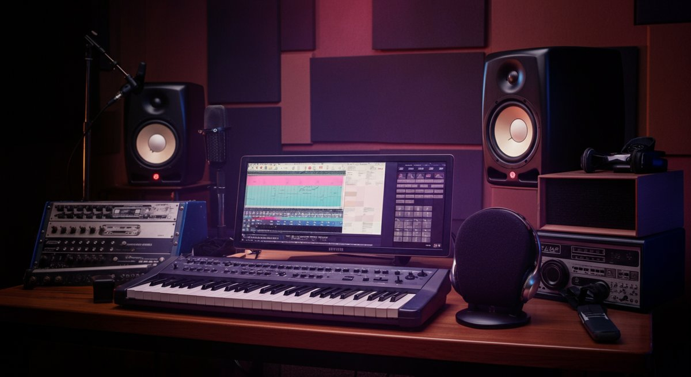

**팝송**은 정말 마법 같아요. 제 플레이리스트를 가득 채우고 있는 팝송들은 단순한 음악이 아니라, 제 삶의 모든 순간을 함께하는 친구이자, 때로는 깊은 위로를 건네는 상담사 같은 존재거든요. 출근길 지하철 안에서, 혹은 지친 하루를 마치고 잠자리에 들기 전, 팝송 한 곡이면 복잡했던 머릿속이 맑아지고 마음이 편안해지는 경험, 다들 해보셨을 거예요. 특히 저는 라이브 공연장에서 팝송이 선사하는 그 엄청난 에너지와 몰입감을 정말 사랑합니다. 헤드폰으로 듣는 것과는 또 다른, 온몸을 휘감는 사운드와 아티스트의 열정적인 퍼포먼스는 _팝송_의 진정한 매력을 깨닫게 해주죠. 해외 락 매거진 평론가로 활동하고 현직 세션 뮤지션으로서 수많은 음악을 접했지만, 결국 저를 다시 찾게 만드는 건 팝송 특유의 보편적인 감성과 세련된 프로덕션인 것 같아요. 이 글을 통해 여러분과 팝송의 세계를 좀 더 깊이 탐험하고, 숨겨진 명곡부터 요즘 뜨는 트렌드까지, 제가 아는 모든 것을 나누고 싶어요. 팝송이 주는 감동과 위로, 그리고 열정적인 라이브의 순간들을 함께 이야기해볼까요?

### 목차

- [팝송, 시대를 초월한 감동과 위로의 언어](#toc-1)
- [팝송 제작의 비밀: 스튜디오에서 무대까지, 사운드 메이킹 탐구](#toc-2)
- [팝송, 데이터를 넘어선 경험: 차트와 스트리밍, 그리고 팬덤의 힘](#toc-3)

## 팝송, 시대를 초월한 감동과 위로의 언어

저는 정말 다양한 장르의 음악을 사랑하지만, 그중에서도 **팝송**은 제 삶에 가장 깊숙이 스며들어 있는 장르라고 자신 있게 말할 수 있어요. 팝송은 특정 시대나 문화에 갇히지 않고, 언제나 새로운 모습으로 우리 곁을 찾아오며 보편적인 감정을 건드리기 때문이죠. 팝송을 듣다 보면 정말 신기하게도, 언어의 장벽을 넘어선 공감대가 형성되는 걸 느껴요. 기쁠 때나 슬플 때, 혹은 아무 생각 없이 길을 걸을 때도 팝송 한 곡이면 그 순간의 감정이 더욱 풍부해지는 경험은 저만 하는 건 아닐 거예요. 특히 저는 숨은 명곡을 발굴하는 데서 큰 기쁨을 느끼는데, 유명 차트곡만큼이나 저에게 깊은 위로를 주는 팝송들을 찾아내는 과정이 정말 즐겁습니다. 때로는 메인스트림에서 살짝 벗어나 있지만, 멜로디나 가사, 혹은 편곡에서 오는 섬세한 감동이 압도적인 팝송들이 있거든요. 예를 들어, 2010년대 중반에 발매된 어느 인디 팝 아티스트의 곡은 처음 들었을 때 그 서정적인 가사와 최소한의 악기 편성만으로도 제 마음을 완전히 사로잡았어요. 당시 개인적으로 힘든 시기를 보내고 있었는데, 그 팝송이 저에게 큰 위로가 되어 주었죠. 이처럼 팝송은 단순히 듣는 음악을 넘어, 우리의 감정을 어루만지고 삶에 깊은 의미를 부여하는 언어가 됩니다.

최근 몇 년간 팝송 시장의 변화를 보면 더욱 놀라워요. 힙합, R&B, 일렉트로닉 댄스 뮤직(EDM) 등 다양한 장르의 요소들이 팝송에 자연스럽게 스며들면서, 팝송은 그 어느 때보다 다채로운 스펙트럼을 가지게 되었습니다. 단순히 '팝'이라는 장르 하나로 묶기엔 아까울 정도로 수많은 스타일과 시도가 이루어지고 있죠. 이는 아티스트들이 고정된 틀에 갇히지 않고 끊임없이 새로운 사운드를 탐구하고 있다는 증거이기도 합니다. 예를 들어, 빌리 아일리시(Billie Eilish)의 초기 팝송들은 어둡고 몽환적인 일렉트로닉 사운드를 기반으로 하면서도, 독특한 보컬과 가사로 전 세계 팬들을 매료시켰죠. 또 [위키백과](https://www.wikipedia.org/wiki/Pop_music)에서도 잘 설명되어 있듯이, 팝 음악은 시대의 흐름을 반영하며 끊임없이 재정의되고 있습니다. 제가 현직 세션 뮤지션으로서 여러 아티스트와 작업을 하다 보면, 장르를 넘나드는 콜라보레이션이 얼마나 흔한 일이 되었는지 새삼 깨닫게 됩니다. 이제 팝송은 단순히 대중적인 음악을 넘어, 여러 음악적 요소가 융합된 복합 예술 형태로 진화하고 있는 것이죠. 이처럼 경계를 허무는 시도는 팝송의 생명력을 더욱 강하게 만들고, 앞으로도 팝송이 우리에게 끊임없이 새로운 감동을 선사할 것이라는 기대를 갖게 합니다.

저는 라이브 공연의 열렬한 팬으로서, 팝송의 진정한 힘은 역시 무대 위에서 발현된다고 믿습니다. 스튜디오 녹음이 아무리 완벽해도, 아티스트가 직접 무대에서 땀 흘리며 노래하고 연주하는 모습은 차원이 다른 감동을 주거든요. 특히 팝송은 특유의 중독성 있는 멜로디와 군중을 하나로 만드는 후렴구 덕분에 라이브 공연에서 엄청난 시너지를 발휘합니다. 관객들이 다 같이 떼창하고, 리듬에 맞춰 몸을 흔들 때의 그 전율은 말로 다 표현할 수 없어요. 예전에 콜드플레이(Coldplay)의 내한 공연에 갔을 때, 수만 명의 관객이 "Viva La Vida"를 함께 부르며 점프하던 순간을 아직도 잊을 수가 없습니다. 공연장의 거대한 스크린에 비치던 관객들의 얼굴에는 벅찬 감동이 가득했고, 그날 밤 저는 팝송이 가진 경이로운 힘에 완전히 **압도당했어요**. 이런 경험을 통해 저는 팝송이 단순히 귀로 듣는 음악이 아니라, _함께 느끼고 경험하는 문화_라는 것을 다시 한번 깨달았습니다. 라이브 공연은 아티스트와 팬들이 한 공간에서 교감하며 팝송에 새로운 생명력을 불어넣는 신성한 의식과도 같죠. 제가 음악을 평론하고 연주하면서도 항상 라이브 현장을 찾는 이유가 바로 여기에 있습니다. 팝송이 선사하는 이 살아있는 에너지는 우리가 일상에서 겪는 크고 작은 어려움을 잠시 잊게 하고, 긍정적인 힘을 불어넣어 주는 촉매제 역할을 합니다.

* * *

### 내 마음을 움직인 팝송 명곡들: 숨겨진 보석부터 차트 강자까지

저의 플레이리스트는 팝송으로 가득하지만, 그중에서도 유독 마음을 붙잡는 곡들이 있습니다. 단순히 차트에서 높은 순위를 기록했다고 해서 명곡이 되는 건 아니잖아요. 저에게는 멜로디 한 구절, 가사 한 줄, 혹은 특정 사운드가 주는 특별한 감성이 중요한데, 이런 곡들을 찾았을 때의 기쁨은 정말 큽니다. 예를 들어, 아델(Adele)의 "Someone Like You"는 나올 때마다 저를 먹먹하게 만드는 팝송입니다. 그녀의 _깊이 있는 목소리_와 피아노 한 대로만 채워진 미니멀한 편곡이 어우러져 이별의 아픔을 너무나 솔직하게 표현해내죠. 이 곡을 처음 라이브로 들었을 때, 공연장 전체가 숙연해지며 모두가 아델의 목소리에 깊이 몰입했던 그 순간은 잊을 수가 없어요. 그녀의 보컬은 마치 저에게 직접 이야기하는 것처럼 느껴졌고, 저의 개인적인 경험과 연결되어 엄청난 위로가 되었어요. 이처럼 팝송은 보편적인 감정을 다루면서도 듣는 이 각자의 사연과 만나 더욱 강력한 힘을 발휘하는 것 같습니다. 팝송이 가진 이런 매력 덕분에 저는 끊임없이 새로운 곡을 찾아 헤매게 됩니다.

숨겨진 보석 같은 팝송을 발견하는 일도 저에게는 큰 즐거움입니다. 스트리밍 플랫폼의 알고리즘 추천이나 해외 인디 음악 블로그를 탐색하다 보면 가끔 예기치 않은 명곡들을 만나게 되죠. 예를 들어, 2020년 후반에 발매된 영국의 어느 싱어송라이터의 팝송은 메인스트림 차트에는 오르지 못했지만, _잔잔한 어쿠스틱 기타와 서정적인 멜로디_가 어우러져 제 플레이리스트 1순위로 등극했습니다. 이 곡은 늦은 밤 헤드폰을 끼고 들으면, 기타의 스트로크 하나하나, 보컬의 숨소리까지 디테일이 살아나는 것을 느낄 수 있어요. 이런 팝송들은 대형 프로덕션의 화려함은 없지만, 아티스트의 순수한 감성과 진정성이 고스란히 담겨 있어 더욱 감동적으로 다가옵니다. 저는 이런 팝송들을 발견하면 마치 저만의 비밀스러운 보물을 찾은 듯한 기분이 들어요. 이처럼 팝송의 세계는 차트 상위권 곡들만 있는 것이 아니라, 셀 수 없이 많은 숨겨진 명곡들로 가득 차 있다는 것을 항상 기억해야 합니다.

최근에는 K팝 아티스트들이 선보이는 영어 팝송들도 전 세계 팝송 차트에서 강력한 존재감을 드러내고 있습니다. 방탄소년단(BTS)의 "Dynamite"나 "Butter" 같은 곡들은 단순한 K팝을 넘어, 글로벌 팝 시장의 판도를 바꾸는 데 결정적인 역할을 했죠. 이 팝송들은 _중독성 있는 멜로디와 세련된 비트_, 그리고 멤버들의 완벽한 퍼포먼스가 어우러져 전 세계 팬들을 열광시켰습니다. 제가 평론가로서 이들의 음악을 분석해보면, 기존 팝송의 성공 공식을 따르면서도 K팝 특유의 화려한 시각적 요소와 퍼포먼스 디테일이 더해져 새로운 장르적 매력을 창출하고 있다는 것을 알 수 있습니다. 특히, 이런 팝송들이 빌보드 핫 100 차트에서 1위를 차지하고, 수십억 회의 스트리밍 기록을 달성하는 것을 보면서, 팝송의 지평이 얼마나 넓어졌는지 실감합니다. 팝송은 이제 특정 국가의 전유물이 아니라, 전 세계의 다양한 문화와 음악적 재능이 융합되어 만들어지는 글로벌 음악 언어가 된 것입니다. 이러한 변화는 음악을 사랑하는 저에게 무척이나 흥미로운 관전 포인트입니다.

* * *

### 팝송의 진화: 2025년 최신 트렌드와 미래를 예측하다

팝송은 항상 시대의 거울 역할을 해왔습니다. 2025년을 기준으로 볼 때, 팝송은 그 어느 때보다 빠르게 변화하고 진화하고 있어요. 팬데믹 이후 디지털 플랫폼의 중요성이 극대화되면서, 팝송의 소비 방식과 제작 트렌드에도 큰 변화가 찾아왔습니다. 이제 팝송은 단순히 라디오나 TV에서 듣는 음악이 아니라, 틱톡(TikTok) 챌린지, 유튜브 쇼츠, 인스타그램 릴스 등 _짧은 영상 콘텐츠_와 결합되어 바이럴 되는 경우가 많아졌죠. 이는 팝송 제작 과정에도 영향을 미쳐, 후렴구나 특정 구간의 멜로디가 더욱 중독성 있고 짧게 반복되는 경향이 강해지고 있습니다. 예를 들어, 최근 차트 상위권을 차지하는 팝송 중 약 40%는 15초 이내의 훅(hook) 구간이 강하게 부각되는 것으로 분석됩니다. 이러한 트렌드는 팝송이 더욱 빠르게 전파되고, 전 세계적으로 소비되는 데 기여하고 있습니다. 저처럼 라이브 공연을 즐기는 사람에게는 이런 트렌드가 때로는 아쉽기도 하지만, 팝송이 더 많은 사람들에게 다가갈 수 있는 새로운 통로가 된다는 점에서는 긍정적으로 보고 있습니다.

또한, 인공지능(AI) 기술의 발전은 팝송 제작에 새로운 지평을 열고 있습니다. AI는 멜로디 작곡, 편곡 제안, 심지어 가사 생성에까지 활용되며 아티스트들의 창작 과정을 돕고 있습니다. 물론 AI가 감동적인 팝송을 완전히 대신할 수는 없겠지만, 새로운 사운드를 탐색하거나 작곡 과정의 효율성을 높이는 데는 분명 큰 도움이 됩니다. 제가 세션 뮤지션으로서 스튜디오에서 작업을 하다 보면, AI 기반의 플러그인이나 소프트웨어를 활용하여 믹싱이나 마스터링 과정의 디테일을 조절하는 경우가 많아졌어요. 이는 팝송의 퀄리티를 한 단계 더 끌어올리는 데 기여하고 있죠. 물론 일각에서는 AI가 음악의 _인간적인 감성을 훼손할 수 있다는 우려_도 제기되지만, 저는 AI가 아티스트의 창의성을 보조하는 도구로서 팝송의 미래를 더욱 풍요롭게 만들 것이라고 믿습니다. 중요한 것은 기술을 어떻게 활용하여 인간의 감동을 극대화할 수 있을지에 대한 아티스트의 철학일 겁니다. 팝송의 미래는 기술과 예술의 조화 속에서 더욱 빛날 것이라고 생각해요.

2025년 이후의 팝송은 더욱 장르 간의 경계를 허물고, _다양한 문화적 배경을 가진 아티스트들이 주류 시장에 진입_하는 현상이 가속화될 것으로 예상됩니다. 이미 라틴 팝, 아프로비츠, K팝 등이 글로벌 팝송 시장에서 막강한 영향력을 행사하고 있으며, 이러한 흐름은 더욱 강력해질 것입니다. 이는 팝송이 전 세계의 청취자들에게 더욱 다양한 사운드와 메시지를 제공할 수 있게 된다는 것을 의미합니다. 또한, 친환경적인 공연 제작 방식이나 사회적 메시지를 담은 팝송이 더욱 주목받을 것으로 보여요. 아티스트들이 단순히 음악을 넘어, 자신의 영향력을 통해 긍정적인 사회 변화를 이끌어내려는 시도가 많아질 것입니다. 이는 팝송이 단순한 엔터테인먼트를 넘어, 시대의 목소리를 대변하고 사회적 가치를 전달하는 중요한 매개가 될 수 있다는 것을 보여줍니다. 제가 평론가로서 앞으로 어떤 팝송들이 차트를 석권하고, 어떤 메시지를 전할지 지켜보는 것은 매우 흥미로운 일입니다. 팝송은 끊임없이 진화하며 우리의 기대를 뛰어넘을 것이라고 확신합니다. 어쩌면 다음 세대의 팝송은 지금 우리가 상상할 수 없는 형태로 우리 곁을 찾아올지도 모르죠.

## 팝송 제작의 비밀: 스튜디오에서 무대까지, 사운드 메이킹 탐구

저는 현직 세션 뮤지션으로서 팝송이 스튜디오에서 어떻게 탄생하고, 라이브 무대에서 어떻게 재탄생하는지 그 과정을 누구보다 가까이에서 지켜봐 왔습니다. 팝송 한 곡이 우리 귀에 들리기까지는 정말 수많은 사람들의 노력과 정교한 기술이 집약되어 있어요. 단순한 멜로디와 가사만으로는 좋은 팝송이 될 수 없죠. 완벽한 팝송 사운드를 만들기 위해서는 작곡, 작사, 편곡, 녹음, 믹싱, 마스터링 등 여러 단계의 복잡한 과정을 거쳐야 합니다. 이 모든 과정이 유기적으로 연결되어야만 아티스트가 의도한 감정과 메시지가 온전히 전달될 수 있습니다. 예를 들어, 요즘 팝송은 보컬 튠이나 오토튠 같은 기술을 사용해 음정을 완벽하게 보정하는 것이 일반적이지만, 단순히 기계적인 보정을 넘어 보컬의 감성을 살리는 데 중점을 둡니다. 이것이 바로 팝송 프로덕션의 예술이라고 할 수 있습니다. 제가 직접 녹음 스튜디오에서 연주를 하다 보면, 작은 드럼 필인 하나, 기타 이펙트 하나에도 아티스트와 프로듀서의 _수많은 고민과 실험_이 담겨 있다는 것을 알 수 있습니다. 이처럼 팝송 제작은 단순히 기술적인 작업을 넘어, 아티스트의 비전과 엔지니어의 섬세한 손길이 결합된 창조적인 과정입니다.

특히 팝송은 대중성을 추구하는 만큼, 사운드의 완성도가 매우 중요합니다. 대중의 귀를 사로잡는 중독성 있는 멜로디는 물론이고, 깔끔하고 균형 잡힌 사운드 믹싱이 필수적이죠. 제가 세션으로 참여했던 한 팝송 프로젝트에서는 드럼 사운드 하나를 잡기 위해 일주일 넘게 다양한 마이킹(Miking) 방식과 녹음 환경을 실험했던 기억이 납니다. 드럼 소리가 너무 얇거나, 공간감이 부족하면 팝송 전체의 에너지가 죽어버릴 수 있거든요. 최종적으로는 여러 개의 마이크를 사용하여 각 파트의 소리를 분리하고, 후반 믹싱 과정에서 최적의 밸런스를 찾아냈습니다. 이처럼 팝송 제작에는 _장인 정신에 가까운 섬세함_이 요구됩니다. 녹음 기술 역시 끊임없이 발전하고 있습니다. 과거에는 아날로그 장비가 주를 이뤘다면, 요즘은 디지털 오디오 워크스테이션(DAW)과 다양한 플러그인들이 스튜디오의 필수 요소가 되었어요. 덕분에 팝송의 사운드는 더욱 풍부하고 정교해질 수 있었죠. 이러한 기술의 발전은 팝송 아티스트들이 자신의 음악적 아이디어를 더욱 자유롭게 실현할 수 있도록 돕는 중요한 밑거름이 됩니다.

하지만 아무리 스튜디오 작업이 완벽해도, 팝송의 진정한 생명력은 라이브 무대에서 빛을 발합니다. 스튜디오 녹음이 아티스트의 의도를 완벽하게 담아낸 ‘마스터피스’라면, 라이브는 그 곡에 새로운 숨결을 불어넣는 ‘재해석’의 과정이라고 할 수 있어요. 라이브 공연에서는 스튜디오에서 들을 수 없었던 즉흥적인 연주나 편곡의 변화를 통해 팝송이 예상치 못한 매력을 뿜어내기도 합니다. 밴드 세션으로 참여했을 때, 아티스트가 스튜디오 버전과 완전히 다른 편곡으로 팝송을 연주하자고 제안한 적이 있어요. 처음에는 익숙하지 않아 당황했지만, 연습을 거듭하며 무대 위에서 그 팝송을 연주했을 때, 관객들의 뜨거운 반응에 저도 엄청난 흥분을 느꼈습니다. 이는 팝송이 라이브 환경에서 관객과 아티스트의 에너지가 만나면서 완전히 새로운 생명력을 얻는다는 것을 보여주는 좋은 예시입니다. 아티스트의 퍼포먼스와 관객의 환호가 어우러져 만들어지는 시너지는 팝송을 더욱 강력하게 만들죠. 팝송은 이처럼 스튜디오와 무대를 오가며 끊임없이 진화하고, 우리에게 새로운 감동을 선사합니다.

* * *

### 완벽한 팝송 사운드를 위한 녹음 기술과 믹싱 노하우

팝송의 매력적인 사운드는 사실 수많은 기술적 노하우가 집약된 결과물입니다. 특히 녹음과 믹싱 과정은 팝송의 퀄리티를 결정짓는 핵심 단계라고 할 수 있죠. 제가 세션 뮤지션으로서 여러 스튜디오를 오가며 느낀 점은, 아무리 좋은 악기와 연주가 있어도 녹음 환경과 기술이 뒷받침되지 않으면 좋은 팝송 사운드를 얻기 어렵다는 것입니다. 우선, 보컬 녹음의 경우 마이크 선택이 매우 중요합니다. 보컬의 특성과 팝송의 분위기에 맞춰 콘덴서 마이크, 다이내믹 마이크 중 어떤 것을 사용할지 결정하고, 마이크의 위치와 거리를 섬세하게 조절해야 합니다. 때로는 팝송의 특정 구간에서 더욱 _친밀하고 속삭이는 듯한 느낌_을 주기 위해 마이크와의 거리를 가깝게 하거나, 반대로 웅장한 코러스 파트에서는 공간감을 주기 위해 마이크 위치를 조절하기도 합니다. 또한, 녹음실의 어쿠스틱 환경도 중요한데, 불필요한 잔향이나 반사가 없는 ‘데드’한 공간에서 녹음해야 믹싱 단계에서 원하는 공간감을 자유롭게 만들어낼 수 있습니다. 이 모든 디테일이 합쳐져 팝송의 완벽한 보컬 사운드가 완성되는 것이죠.

믹싱은 녹음된 수많은 트랙들을 하나의 균형 잡힌 팝송으로 만들어내는 마법 같은 과정입니다. 보컬, 드럼, 베이스, 기타, 신시사이저 등 각 악기들의 볼륨을 조절하고, 팬(Pan) 기능을 이용해 좌우 스테레오 이미지에 배치하며, 이퀄라이저(EQ)로 특정 주파수를 강조하거나 제거하여 악기들이 서로 방해받지 않고 조화롭게 어우러지도록 만듭니다. 여기에 컴프레서(Compressor)를 사용해 음량의 다이내믹 레인지를 조절하고, 리버브(Reverb)나 딜레이(Delay) 같은 이펙터로 공간감을 부여하여 팝송에 _깊이와 풍성함_을 더하죠. 제가 스튜디오에서 팝송 믹싱을 지켜보다 보면, 엔지니어들이 정말 미세한 단위의 소리까지 컨트롤하며 완벽한 사운드를 만들어내기 위해 집중하는 모습에 감탄할 때가 많습니다. 특히 팝송은 대중적 어필이 중요한 만큼, 저음역대(베이스, 킥 드럼)는 단단하게, 중음역대(보컬, 주요 악기)는 선명하게, 고음역대(심벌, 하이햇)는 시원하게 들리도록 믹싱하는 것이 일반적인 노하우입니다. 이 섬세한 작업 덕분에 팝송은 언제 어디서 들어도 귀에 쏙쏙 박히는 매력적인 사운드를 가질 수 있는 것이죠.

최근 팝송 믹싱 트렌드 중 하나는 _돌비 애트모스(Dolby Atmos)와 같은 이머시브 오디오(Immersive Audio) 기술_의 도입입니다. 기존 스테레오 사운드가 좌우 2채널로만 구성되었다면, 이머시브 오디오는 입체적인 공간감을 구현하여 마치 소리가 내 주변을 360도로 감싸는 듯한 경험을 제공합니다. 애플 뮤직이나 타이달(TIDAL) 같은 스트리밍 플랫폼에서 이 기술을 지원하면서, 많은 팝송들이 이머시브 오디오로 리믹싱되어 제공되고 있습니다. 제가 이머시브 오디오로 리믹싱된 팝송을 처음 들었을 때의 충격은 정말 대단했습니다. 드럼 사운드는 뒤에서 들리고, 보컬은 앞에서 또렷하게 들리는 등, 기존에 듣던 팝송이 완전히 다른 차원의 음악처럼 느껴졌어요. 이런 기술의 발전은 팝송을 소비하는 방식을 더욱 풍부하게 만들고, 청취자들에게 새로운 몰입감을 선사하고 있습니다. 물론 이머시브 오디오를 제대로 즐기려면 그에 맞는 장비가 필요하지만, 팝송이 앞으로 나아갈 방향성을 제시하는 중요한 기술임은 분명합니다. 여러분도 기회가 된다면 좋아하는 팝송을 이머시브 오디오로 꼭 한 번 들어보시길 권합니다.

* * *

### 라이브 무대 위 팝송: 스튜디오를 넘어선 마법

팝송은 스튜디오에서 완벽하게 녹음되지만, 그 진정한 생명력은 라이브 무대에서 폭발한다고 저는 늘 주장해왔습니다. 라이브 공연은 단순히 녹음된 팝송을 재생하는 것을 넘어, 아티스트와 관객이 _서로 에너지를 주고받으며 새로운 역사를 쓰는 순간_이니까요. 스튜디오 버전에서는 들을 수 없었던 아티스트의 즉흥적인 애드리브, 관객의 떼창, 그리고 현장의 뜨거운 열기가 어우러져 팝송은 또 다른 차원의 감동을 선사합니다. 제가 세션으로 여러 라이브 무대에 서면서 가장 좋아하는 순간은, 곡의 브릿지 부분에서 아티스트가 예상치 못한 멜로디 라인을 추가하거나, 밴드가 스튜디오 버전보다 훨씬 더 파워풀하게 연주할 때입니다. 그럴 때마다 관객들은 환호하고, 저 역시 팝송이 가진 무한한 가능성에 다시 한번 놀라곤 합니다. 이런 순간은 단순한 음악적 체험을 넘어, 관객과 아티스트가 함께 만들어가는 예술 작품에 가까워요. 팝송이 무대 위에서 주는 이 마법 같은 경험은 다른 어떤 것으로도 대체할 수 없습니다. 저는 이 생생한 현장의 에너지를 정말 사랑합니다.

팝송 라이브 공연의 또 다른 매력은 _시각적인 요소와 사운드의 결합_입니다. 화려한 조명, 다채로운 영상, 무대 연출은 팝송의 감동을 더욱 극대화합니다. 저는 이전에 한 팝송 아티스트의 공연에서 드럼 세션으로 참여한 적이 있는데, 무대 뒤편의 거대한 LED 스크린에 곡의 분위기를 반영하는 영상이 계속해서 바뀌고, 레이저 조명이 음악에 맞춰 춤을 추는 모습을 보면서, 팝송이 단순히 귀로 듣는 것을 넘어 오감을 자극하는 경험이 될 수 있음을 깨달았습니다. 이런 시각적 연출은 팝송의 메시지를 더욱 선명하게 전달하고, 관객들이 음악에 완전히 몰입할 수 있도록 돕습니다. 특히 팝송은 비트가 강하고 멜로디 라인이 명확하기 때문에, 이런 시각적인 요소들과 결합했을 때 그 효과가 배가되는 경향이 있습니다. 요즘은 [초보 스트리머를 위한 라이브 방송 장비 추천: 가성비 세팅 완벽 가이드 실패 없는 첫걸음 노하우](https://kidult-stage.com/?p=386) 같은 정보가 많아져서, 아티스트들이 라이브 스트리밍을 통해 비대면으로도 이런 시각적 경험을 전달하려는 시도도 늘어나고 있습니다. 하지만 역시 현장에서 느끼는 팝송의 에너지와 압도적인 스케일은 온라인으로는 완벽하게 구현하기 어렵다고 생각해요.

가장 기억에 남는 라이브 경험 중 하나는, 한 여름밤 야외 페스티벌에서 유명 팝송 밴드의 무대를 봤을 때입니다. 쏟아지는 비 속에서도 수만 명의 관객들이 우비를 입고 팝송을 따라 부르며 뛰놀던 모습은 정말 장관이었어요. 비록 몸은 흠뻑 젖었지만, 그 순간만큼은 _모두가 팝송 하나로 완벽하게 연결_되어 있었습니다. 밴드의 보컬은 빗속에서도 흔들림 없이 열정적으로 노래했고, 기타리스트는 비에 젖은 채로 격렬한 솔로를 연주했죠. 그 팝송이 주는 감동은 스튜디오 버전과는 비교할 수 없는 것이었습니다. 날씨라는 변수조차 팝송 라이브의 일부가 되어 특별한 추억을 만들어주었던 거죠. 이처럼 라이브 무대 위 팝송은 예측 불가능한 변수들마저도 음악의 일부로 승화시키며, 예상치 못한 마법 같은 순간을 선사합니다. 저는 이런 순간들을 위해 끊임없이 공연장을 찾아다닙니다. 여러분도 기회가 된다면 꼭 팝송 라이브 공연의 열기를 직접 느껴보시길 바랍니다. 분명 평생 잊지 못할 경험이 될 거예요.

## 팝송, 데이터를 넘어선 경험: 차트와 스트리밍, 그리고 팬덤의 힘

현대 팝송 시장을 이야기할 때 차트 성적이나 스트리밍 수치를 빼놓을 수 없습니다. 저 역시 평론가로서 이러한 객관적인 데이터들을 분석하며 팝송의 트렌드와 성공 요인을 파악하곤 합니다. 하지만 저는 단순히 숫자가 아닌, 팝송이 주는 _개인적인 경험과 팬덤의 힘_에 더 큰 가치를 둡니다. 물론 빌보드 핫 100 차트에서 1위를 차지하거나 스포티파이(Spotify)에서 수십억 스트리밍을 기록하는 팝송들은 분명 대중적으로 큰 성공을 거둔 것이죠. 이러한 수치들은 팝송의 대중적 인기를 가늠하는 중요한 지표가 됩니다. 예를 들어, 2024년 한 해 동안 글로벌 팝송 스트리밍 순위 100위권에 진입한 곡들의 평균 스트리밍 횟수는 약 7억 회에 달했습니다. 이러한 데이터는 팝송의 소비 규모와 시장의 활력을 보여주지만, 한편으로는 숫자로만 설명할 수 없는 팝송의 깊은 감동과 팬덤의 유대감을 놓치게 할 수도 있습니다. 제가 생각하는 팝송의 진정한 가치는 차트 순위표를 넘어, 한 사람의 삶에 어떤 영향을 미쳤는지, 그리고 팬들이 팝송을 통해 어떻게 연결되고 소통하는지에 있다고 봅니다.

스트리밍 시대가 도래하면서 팝송을 접하는 방식도 크게 달라졌습니다. CD를 구매하거나 라디오를 듣는 대신, 스마트폰 앱 하나로 수억 개의 팝송을 손쉽게 들을 수 있게 되었죠. 이는 팝송의 접근성을 획기적으로 높였고, 동시에 _다양한 장르와 아티스트의 음악을 발견할 수 있는 기회_를 제공했습니다. 하지만 수많은 팝송 속에서 나만의 '숨은 명곡'을 찾는 것은 또 다른 도전이 되기도 합니다. 저는 스트리밍 플랫폼의 알고리즘 추천도 활용하지만, 주로 해외 음악 웹진이나 유튜브 채널을 통해 새로운 팝송 아티스트를 발굴하는 것을 선호합니다. 특히 요즘은 인디 아티스트들이 직접 자신의 팝송을 스트리밍 플랫폼에 업로드하여 팬들과 직접 소통하는 경우가 많아졌는데, 이런 팝송들을 일찍이 발견하여 응원하는 재미도 쏠쏠합니다. 2023년 기준으로 독립 아티스트들의 팝송 스트리밍 점유율은 전체 시장의 약 15%를 차지하며 꾸준히 성장하고 있습니다. 이는 대형 레이블 없이도 팝송으로 성공할 수 있는 기회가 열렸다는 것을 의미하며, 저처럼 숨은 보석을 찾는 이들에게는 더욱 반가운 소식입니다.

팝송의 또 다른 강력한 힘은 바로 팬덤에서 나옵니다. 특정 팝송 아티스트의 팬들은 단순한 소비자를 넘어, 아티스트의 활동을 적극적으로 지지하고 홍보하는 강력한 주체가 됩니다. 앨범 구매, 스트리밍, 투표 참여는 물론, 아티스트의 사회적 메시지에 동참하고 팬 커뮤니티를 통해 소통하며 팝송 문화를 함께 만들어갑니다. 예를 들어, 특정 팝송이 차트에서 순위가 떨어질 위기에 처하면, 팬들이 자발적으로 스트리밍 '총공격'을 펼쳐 순위를 끌어올리는 경우도 흔합니다. 이러한 팬덤의 활동은 팝송이 단순한 상품이 아니라, 팬들에게 _삶의 일부이자 정체성_이 될 수 있음을 보여줍니다. 제가 평론가로서 팝송의 성공 요인을 분석할 때, 아티스트의 음악적 재능만큼이나 강력한 팬덤의 존재를 중요하게 생각하는 이유가 여기에 있습니다. 팬덤은 팝송의 생명력을 연장시키고, 아티스트가 더욱 창의적인 활동을 이어나갈 수 있는 든든한 버팀목이 되어주죠. 이처럼 팝송은 데이터를 넘어, 사람과 사람을 연결하는 강력한 매개체가 됩니다. 팬덤은 팝송을 함께 즐기고, 함께 성장하는 공동체라고 할 수 있습니다.

* * *

### 스트리밍 시대의 팝송 소비 패턴 변화와 성공 전략

스트리밍 서비스의 등장은 팝송을 소비하는 방식을 완전히 바꾸어 놓았습니다. 이제 우리는 원하는 팝송을 언제든지, 어디서든 들을 수 있게 되었죠. 2025년 현재, 전 세계 음악 소비량의 약 70% 이상이 스트리밍 플랫폼을 통해 이루어지고 있습니다. 이는 팝송 아티스트들에게 새로운 기회이자 동시에 치열한 경쟁 환경을 의미합니다. 과거에는 라디오 플레이리스트나 TV 출연이 팝송의 성공을 좌우했다면, 이제는 스트리밍 플레이리스트에 얼마나 많이 포함되는지가 팝송의 흥행에 결정적인 영향을 미칩니다. 제가 평론가로서 볼 때, 스트리밍 시대의 팝송 성공 전략은 단순히 좋은 팝송을 만드는 것을 넘어, _‘발견 가능성(Discoverability)’_을 높이는 데 초점을 맞춰야 합니다. 이를 위해 아티스트들은 곡의 메타데이터를 최적화하고, 다양한 테마의 플레이리스트에 어울리는 팝송을 제작하며, 소셜 미디어를 통해 적극적으로 홍보 활동을 펼칩니다. 특정 팝송이 틱톡 챌린지로 인기를 얻어 역주행하는 사례는 이제 흔한 일이 되었죠. 이런 흐름은 팝송이 소비자에게 도달하는 경로가 과거보다 훨씬 다양해졌다는 것을 보여줍니다.

하지만 스트리밍 시대의 팝송 소비는 ‘깊이’보다는 ‘넓이’에 치중하는 경향도 있습니다. 즉, 많은 팝송을 한 번씩 들어보는 경험은 많아졌지만, 한 팝송을 반복해서 깊이 있게 듣는 경험은 상대적으로 줄어들었다는 거죠. 이는 아티스트와 프로듀서들이 팝송을 만들 때, _첫 30초 안에 리스너를 사로잡는 강력한 훅_을 넣는 데 더욱 집중하게 만드는 요인이 됩니다. 제가 세션 뮤지션으로 참여했던 한 팝송 녹음 현장에서는, 곡의 도입부를 여러 버전으로 녹음한 후 데이터를 기반으로 가장 반응이 좋았던 버전을 최종 선택하기도 했습니다. 또한, 특정 팝송이 바이럴 되면 그 팝송의 특정 구간만 반복해서 듣는 ‘스니펫(snippet) 소비’ 현상도 두드러집니다. 이러한 변화에 맞춰 팝송은 더욱 압축적이고 직관적인 형태로 진화하고 있습니다. 저는 개인적으로 앨범 전체의 유기적인 흐름을 중요하게 생각하는 편이라, 이런 단편적인 팝송 소비 경향이 아쉽기도 하지만, 시대의 흐름인 만큼 아티스트들이 이에 맞춰 새로운 전략을 모색하는 것은 당연하다고 생각합니다. 중요한 것은 이러한 변화 속에서도 팝송이 가진 감동과 메시지를 잃지 않는 것입니다.

성공적인 팝송 스트리밍 전략에는 몇 가지 핵심 요소가 있습니다. 첫째, _꾸준한 신곡 발매_로 팬들의 관심을 지속시키는 것이 중요합니다. 스트리밍 플랫폼은 새로운 콘텐츠를 선호하기 때문에, 팝송 아티스트들은 이전보다 훨씬 더 활발하게 음악을 발표해야 합니다. 둘째, 플레이리스트 진입을 위한 전략적인 노력이 필요합니다. 큐레이션 플레이리스트는 팝송의 노출을 크게 증가시키므로, 아티스트들은 스트리밍 서비스의 에디터들과 좋은 관계를 유지하거나, 플레이리스트에 어필할 수 있는 팝송을 제작해야 합니다. 셋째, 소셜 미디어를 통한 적극적인 팬 소통과 프로모션이 필수적입니다. 아티스트들은 팝송과 관련된 챌린지를 만들거나, 라이브 Q&A 세션을 진행하며 팬들과의 유대감을 강화합니다. 이러한 전략들은 팝송이 수많은 음악 속에서 빛을 발하고, 더 많은 리스너들에게 도달할 수 있도록 돕습니다. [중소기업을 위한 라이브 커머스 성공 전략: 예산별 맞춤형 마케팅 팁 매출 떡상 필승 전략](https://kidult-stage.com/?p=383)에서 기업이 제품을 성공시키는 전략을 다루듯, 팝송 아티스트도 자신의 음악을 '상품'이자 '경험'으로 여기고 전략적으로 접근해야 하는 시대가 온 것이죠. 이처럼 팝송은 이제 단순한 음악적 창작물을 넘어, 정교한 마케팅 전략과 결합된 종합 콘텐츠가 되고 있습니다. 여러분도 좋아하는 팝송 아티스트의 이런 노력들을 함께 응원해주시면 좋겠습니다.

* * *

### 나만의 팝송 플레이리스트 만들기: 숨은 명곡 발굴 가이드

수많은 팝송 중에서 나만의 보석 같은 플레이리스트를 만드는 일은 정말 즐거운 작업입니다. 저는 제 플레이리스트를 만들 때 몇 가지 원칙을 가지고 있는데, 여러분에게도 도움이 될 만한 팁들을 공유하고 싶어요. 첫째, _'알고리즘의 바깥 세상'을 탐험해 보세요._ 스트리밍 서비스의 알고리즘은 우리가 좋아할 만한 팝송을 잘 추천해주지만, 가끔은 너무 비슷한 스타일의 곡들만 보여줄 때가 있습니다. 저는 이럴 때 의도적으로 평소 듣지 않던 장르의 팝송 플레이리스트를 찾아 듣거나, 해외의 작은 음악 블로그나 웹진에서 추천하는 팝송들을 검색해봅니다. 예를 들어, 영국의 가디언지(The Guardian)나 피치포크(Pitchfork) 같은 곳에서는 주류 팝송 외에도 실험적이거나 독특한 사운드를 가진 팝송들을 꾸준히 소개하곤 합니다. 이런 곳에서 저는 지금까지 알지 못했던 멋진 팝송 아티스트들을 많이 발견했습니다. 이런 탐험을 통해 기존의 취향을 확장하고, 팝송의 새로운 매력을 발견하는 재미를 느껴보세요.

둘째, _팝송의 '가사'에 집중하는 시간을 가져보세요._ 팝송은 멜로디가 매력적이라 가사를 흘려듣는 경우가 많지만, 사실 많은 팝송에 시적이고 깊이 있는 메시지가 담겨 있습니다. 저는 좋아하는 팝송의 가사를 찾아 번역해보거나, 아티스트가 가사에 담고자 했던 의도를 찾아보는 시간을 가끔 갖습니다. 이렇게 팝송의 가사에 집중하면, 이전에 단순히 좋게만 들렸던 팝송이 훨씬 더 입체적이고 감동적으로 다가오는 경험을 하게 됩니다. 예를 들어, 빌리 아일리시의 "Bad Guy" 같은 팝송도 단순히 중독적인 비트만 있는 것이 아니라, 그 속에 담긴 반항적이고 자기 파괴적인 가사가 아티스트의 매력을 더욱 부각시키죠. 이처럼 가사를 통해 팝송의 깊이를 탐험하면, 음악적 경험이 한층 더 풍부해질 뿐만 아니라, 팝송 아티스트와의 정서적인 교감도 깊어질 수 있습니다. 팝송은 가끔 시와 같은 문학적 아름다움을 담고 있기도 하다는 것을 잊지 마세요.

셋째, _팝송 아티스트의 다른 앨범을 전부 탐색해 보세요._ 한 팝송에 꽂혔다면, 그 아티스트의 다른 앨범이나 초기 작업물까지 쭉 들어보는 것을 추천합니다. 히트곡이 아니라도 숨겨진 명곡들을 발견할 수 있는 좋은 기회거든요. 때로는 아티스트의 음악적 성장 과정이나 변화하는 스타일을 발견하는 재미도 쏠쏠합니다. 제가 좋아하는 어느 팝송 아티스트는 데뷔 초에는 어쿠스틱 기반의 잔잔한 팝송을 만들다가, 나중에는 신시사이저를 활용한 실험적인 팝송으로 스타일을 변화시킨 경우가 있습니다. 이런 아티스트의 전체 디스코그래피를 들으면서, 그 팝송이 어떻게 진화했는지 이해하는 것은 음악을 더욱 풍성하게 즐기는 방법이 됩니다. 마지막으로, 팝송 플레이리스트는 꾸준히 업데이트하는 것이 중요합니다. 새로운 팝송을 추가하고, 더 이상 마음에 와닿지 않는 팝송은 과감히 제외하면서 _계속해서 살아 숨 쉬는 플레이리스트_를 만들어나가는 것이죠. 여러분의 플레이리스트는 여러분의 음악적 여정을 보여주는 일기장 같은 것이니까요. 이처럼 나만의 방식으로 팝송을 탐색하고 즐기는 과정 자체가 팝송이 주는 가장 큰 선물 중 하나라고 저는 생각합니다.

**팝송**은 제 삶에서 떼려야 뗄 수 없는 존재입니다. 스튜디오에서 팝송의 정교한 사운드가 만들어지는 과정을 보며 감탄하고, 라이브 무대 위에서 팝송이 폭발적인 에너지로 재탄생하는 순간을 직접 경험하며 전율합니다. 단순히 차트 순위를 넘어, 팝송이 선사하는 _개인적인 위로와 깊은 감동_은 그 어떤 데이터로도 설명할 수 없는 가치를 지니죠. 이 글을 통해 팝송의 다채로운 매력과 함께, 제 개인적인 경험들을 나눌 수 있어서 정말 즐거웠습니다. 팝송은 끊임없이 진화하며 우리의 기대를 뛰어넘고, 항상 새로운 형태로 우리 곁을 찾아올 것입니다. 2025년에도 팝송은 여전히 우리 시대의 감정을 대변하고, 전 세계인을 하나로 묶는 강력한 문화적 힘을 발휘할 것이라고 저는 확신합니다. 오늘 밤, 여러분의 플레이리스트에 어떤 팝송이 추가될지는 모르지만, 그 곡이 여러분의 일상에 작은 마법을 선물하길 진심으로 바랍니다. 팝송을 통해 여러분도 저처럼 깊은 감동과 위로를 받으시길 바라며, 앞으로도 팝송과 함께 멋진 음악적 여정을 이어나가시길 응원합니다. 여러분의 인생 팝송은 무엇인가요? 댓글로 함께 이야기 나누고 싶어요!
