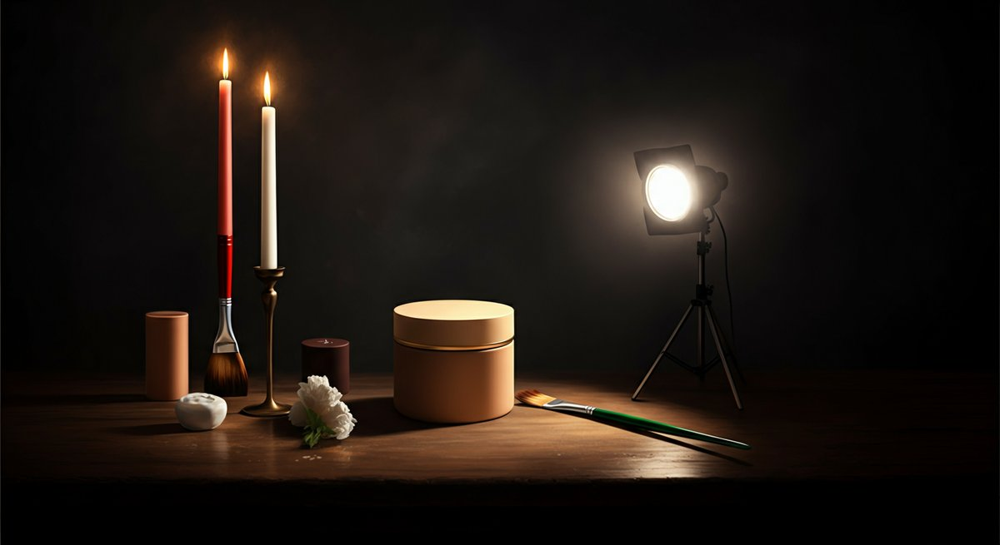

페인팅, 이 단어만 들어도 가슴이 웅장해지는 분들 분명 계실 거예요. 특히 저처럼 어릴 적 장난감이나 프라모델 조립하던 추억을 가진 분들이라면, 직접 색을 입히는 즐거움이 얼마나 특별한지 너무나 잘 아실 겁니다. 저도 한 40년 가까이 이 취미를 즐겨오면서 수많은 피규어와 모형들을 만나고 칠하고 또 고쳐가며 정말 많은 시간을 보냈습니다. 처음에는 그저 단순하게 색을 입히는 행위라고 생각했지만, 시간이 지날수록 **페인팅은 단순히 색을 칠하는 것을 넘어, 우리의 추억에 생명을 불어넣고, 고유한 이야기를 만들어가는 과정**이라는 걸 깨달았습니다. 요즘 신제품이 나올 때마다 그 설렘은 어린 시절과 똑같아요. 박스를 뜯는 순간부터 어떤 색을 입힐지, 어떤 디테일을 살릴지 머릿속으로 시뮬레이션이 돌아가죠. 이 맛에 우리가 페인팅을 놓지 못하는 거 아니겠어요? 특히나 최근에는 3D 프린팅 기술의 발전과 함께 나만의 피규어를 만들고 페인팅하는 문화가 더욱 확산되고 있어서, 그야말로 페인팅 덕후들에게는 축복 같은 시대가 아닌가 싶습니다. 그런데 막상 시작하려고 하면 어디서부터 손을 대야 할지 막막한 초보 분들도 많으실 거예요. 저도 처음엔 그랬습니다. 어떤 도료를 써야 하는지, 붓은 어떤 걸 골라야 하는지, 심지어 환기는 어떻게 해야 하는지까지, 아무것도 몰랐죠. 인터넷에 올라온 정보들은 너무 파편적이고 전문 용어 투성이라 오히려 더 혼란스러웠던 기억이 납니다. 하지만 걱정 마세요. 제가 오랜 시간 직접 겪고 배운 페인팅 노하우와 커뮤니티에서 얻은 생생한 정보들을 바탕으로, 여러분이 페인팅의 세계에 쉽고 재미있게 발을 들일 수 있도록 모든 것을 풀어 드릴게요. 피규어는 물론, 레고 커스텀이나 각종 모형 페인팅에 관심 있는 분들이라면 이 글이 정말 큰 도움이 될 거라고 확신합니다. 우리 모두의 페인팅 여정이 더욱 즐겁고 풍성해지기를 바라면서, 제가 가진 모든 경험을 아낌없이 공유해 드릴게요. 자, 그럼 페인팅의 매력 속으로 함께 떠나볼까요?

### 목차

- [피규어 페인팅, 왜 시작해야 할까요? 단순 취미 그 이상의 가치](#toc-1)
- [초보자를 위한 페인팅 필수 준비물: 이것만 있으면 시작할 수 있어요!](#toc-2)
- [실패하지 않는 페인팅 기본 기술과 노하우: 저도 처음엔 그랬습니다](#toc-3)
- [나만의 작품을 만드는 페인팅 응용 기술과 관리법](#toc-4)

* * *

## 피규어 페인팅, 왜 시작해야 할까요? 단순 취미 그 이상의 가치

저는 페인팅이 단순히 색을 입히는 행위를 넘어선다고 늘 생각합니다. 어릴 적 마징가Z나 건담 프라모델을 조립하면서 ‘아, 이 부분은 좀 더 진한 빨강이었으면 좋겠다’거나 ‘이 캐릭터는 내가 생각하는 이미지가 있는데’ 하는 상상을 많이 했었죠. 그때는 기술도 없고 정보도 없어서 그냥 조립만 하고 만족했지만, 지금은 직접 그 상상을 현실로 만들어낼 수 있는 시대가 됐습니다. 페인팅을 시작하는 가장 큰 이유는 바로 ‘나만의 것’을 만들고 싶다는 욕구 때문이 아닐까요? 세상에 하나뿐인 나만의 피규어, 나만의 모형을 만드는 즐거움은 그 어떤 것으로도 대체할 수 없는 특별한 경험입니다. 특히 요즘 나오는 피규어들은 워낙 조형이 훌륭해서, 여기에 약간의 페인팅만 더해도 그 가치가 확 올라가는 것을 직접 눈으로 확인할 수 있습니다. 저도 처음에는 도색되어 나오는 완성품에 만족했는데, 어느 순간 ‘이건 내가 좀 더 만져볼 수 있지 않을까?’ 하는 생각이 들더라고요. 그때부터 제 페인팅 여정이 시작되었습니다.

실제로 같은 취미를 가진 커뮤니티에서 활동하다 보면, 페인팅을 통해 자신의 개성을 드러내는 분들을 정말 많이 만납니다. 어떤 분은 피규어의 얼굴 표정을 섬세하게 바꿔서 원작 캐릭터의 특정 장면을 재현하기도 하고, 또 어떤 분은 아예 다른 색감으로 페인팅해서 완전히 새로운 느낌의 캐릭터를 창조하기도 하죠. 이런 작품들을 보면서 저도 많은 영감을 얻고, ‘나도 저렇게 해볼까?’ 하는 도전을 받습니다. 한 번은 제가 직접 페인팅한 레고 미니피규어를 커뮤니티에 올렸는데, 반응이 폭발적이었던 적이 있어요. 저와 똑같은 피규어를 가지고 있던 다른 회원들이 ‘어떻게 그렇게 디테일하게 페인팅했냐’고 물어보는데, 그 뿌듯함이란 말로 다 할 수 없었습니다. 이런 소통의 즐거움도 페인팅이 주는 큰 가치 중 하나죠. 게다가 페인팅은 단순한 취미를 넘어선 재테크 수단이 될 수도 있습니다. 전문가 수준으로 커스텀 페인팅된 한정판 피규어는 원가 대비 훨씬 높은 가격에 리셀되는 경우가 많거든요. 실제로 유명 아티스트의 손을 거친 페인팅 작품은 경매에서 수백만원을 호가하기도 합니다. 물론 모든 페인팅 작품이 그렇게 되는 건 아니지만, 잘 만들어진 작품은 그 가치를 인정받을 수 있다는 점이 매력적이죠.

페인팅은 또한 스트레스 해소에도 굉장히 효과적입니다. 저는 퇴근하고 나서 복잡한 생각들을 잠시 접어두고 붓을 잡으면, 온전히 작품에만 몰입하게 되더라고요. 아주 작은 디테일 하나하나에 집중하면서 섬세하게 붓질을 하다 보면, 어느새 시간 가는 줄 모르고 마음이 평온해지는 것을 느낍니다. 이게 바로 페인팅의 힐링 효과가 아닐까 싶습니다. 2025년 현재, 페인팅 관련 용품 시장은 전 세계적으로 매년 5% 이상 성장하고 있다고 합니다. 특히 한국에서는 키덜트 문화의 확산과 함께 페인팅에 대한 관심이 더욱 증폭되고 있죠. 이제 페인팅은 더 이상 일부 마니아층의 전유물이 아니라, 남녀노소 누구나 즐길 수 있는 대중적인 취미로 자리 잡고 있습니다. 저도 처음에는 망설였지만, 지금은 제 삶의 활력소가 된 페인팅을 여러분에게도 강력하게 추천하고 싶어요. 망설이지 말고 붓을 들어보세요. 분명 새로운 세계가 펼쳐질 겁니다.

* * *

### 나만의 페인팅 스타일을 찾는 여정

각자 페인팅을 하는 이유도, 원하는 결과물도 다 다를 겁니다. 어떤 분은 실사에 가까운 정교한 페인팅을 선호하고, 또 어떤 분은 애니메이션 같은 카툰풍의 쨍한 색감을 좋아하죠. 저도 처음에는 유명 유튜버들이 하는 페인팅 기법을 무작정 따라 해봤습니다. 하지만 저한테 잘 맞지 않는 기법들도 있었고, 원하는 색감이 나오지 않아서 좌절했던 적도 많아요. 중요한 건 나만의 페인팅 스타일을 찾아가는 과정입니다. 다양한 도료를 써보고, 여러 가지 붓을 경험해보고, 다른 사람들의 작품에서 영감을 얻으면서 자신에게 가장 잘 맞는 방법을 찾아나가는 것이죠. 이 과정에서 발생하는 시행착오들은 절대 실패가 아닙니다. 오히려 더 큰 성장을 위한 소중한 경험이 됩니다. 저도 처음엔 아크릴 물감만 고집했는데, 어느 날 유화 물감을 써보고 완전히 신세계를 경험했습니다. 마르는 시간이 길어서 답답했지만, 색을 섞고 블렌딩하는 재미가 너무 좋았거든요. 이런 경험들이 쌓여 저만의 페인팅 노하우가 만들어지는 겁니다.

특히 저는 건프라 페인팅에서 웨더링 기법을 즐겨 사용합니다. 마치 전투를 치른 듯한, 세월의 흔적이 묻어나는 느낌을 좋아하거든요. 처음에는 녹 표현이나 흙먼지 표현이 너무 어려웠어요. 유튜브에서 튜토리얼을 수십 번 돌려보고, 커뮤니티에 질문 글도 엄청 올렸습니다. 그렇게 하나하나 배워나가면서 이제는 꽤 자연스러운 웨더링 페인팅을 할 수 있게 되었죠. 여러분도 겁먹지 말고 다양한 기법에 도전해보세요. 피규어 페인팅이라면 명암 표현이나 얼굴 도색에 집중할 수도 있고, 레고 커스텀이라면 원작에 없는 새로운 디자인을 입히는 데 몰두할 수도 있겠죠. 이 모든 과정이 바로 페인팅의 진짜 재미입니다. 같은 도료, 같은 붓이라도 누가 페인팅하느냐에 따라 전혀 다른 작품이 나오는 걸 보면 정말 신기하지 않나요?

커뮤니티에서는 항상 새로운 페인팅 기법이나 도구에 대한 정보가 활발하게 공유됩니다. 저는 주로 네이버 카페 '키덜트 도색의 정석'이나 '모형 페인팅 연구소' 같은 곳에서 많은 정보를 얻습니다. 특히 2025년에는 스마트폰 앱을 활용한 색상 조합 시뮬레이션이나 3D 프린팅 후처리 페인팅 가이드 같은 새로운 트렌드들이 많이 보이고 있어요. 이런 최신 정보들을 적극적으로 활용하면 페인팅 실력을 한 단계 더 끌어올릴 수 있습니다. 제 생각에는 페인팅은 정답이 없는 창작 활동이기 때문에, 다양한 시도를 해보는 것이 가장 중요하다고 생각합니다. 혹시 페인팅으로 가치를 더 높인 피규어 컬렉션을 완성하고 싶다면, 먼저 [원피스 피규어 가성비 추천 순위 이것만 보면 끝! 후회 없는 선택법](https://키덜트-stage.com/?p=531)을 참고하여 좋은 베이스를 선택하는 것도 좋은 시작이 될 거예요.

* * *

## 초보자를 위한 페인팅 필수 준비물: 이것만 있으면 시작할 수 있어요!

페인팅을 시작하려고 마음먹었을 때 가장 먼저 부딪히는 문제가 바로 ‘무엇을 사야 하는가’입니다. 저도 처음에는 멋모르고 비싼 도구들을 잔뜩 샀다가 후회했던 적이 많아요. 특히 공방에서 쓰는 전문가용 장비들은 가격도 비싸지만, 관리하기도 까다로워서 초보자에게는 부담스러울 수 있습니다. 사실 처음부터 모든 걸 완벽하게 갖출 필요는 전혀 없습니다. 핵심적인 몇 가지 준비물만으로도 충분히 멋진 페인팅을 시작할 수 있어요. 저는 개인적으로 붓도색을 먼저 경험해보는 것을 추천합니다. 에어브러쉬는 장비 가격도 비싸고, 컴프레서 소음 문제나 세척의 번거로움 때문에 초보자에게는 진입 장벽이 높을 수 있거든요. 붓도색으로 페인팅의 기본 원리를 익히고 재미를 붙인 다음에, 나중에 필요성을 느낀다면 에어브러쉬를 고려해도 늦지 않습니다. 그럼 지금부터 제가 직접 사용해보고 검증한, 초보자에게 꼭 필요한 페인팅 준비물들을 자세히 알려드릴게요.

가장 중요한 건 역시 ‘도료’겠죠. 피규어나 모형 페인팅에는 주로 _아크릴 도료_와 _에나멜 도료_, 그리고 _락카 도료_가 사용됩니다. 초보자에게는 아크릴 도료를 가장 추천합니다. 냄새가 적고 물로 희석해서 사용할 수 있어 다루기 쉽고, 초보자가 실수했을 때 바로바로 수정하기 용이합니다. 건조 시간도 비교적 빨라서 여러 색을 겹쳐 칠하기 좋아요. 제가 처음 페인팅을 시작했을 때도 아크릴 도료로 시작했습니다. 지금은 타미야, 군제, 바예호 등 다양한 브랜드의 아크릴 도료가 나와 있는데, 바예호(Vallejo)의 모델 컬러나 게임 컬러는 발색력도 좋고 붓도색에 최적화되어 있어서 초보자에게 특히 인기가 많습니다. 저도 바예호 도료를 가장 많이 사용하고 있어요. 단점이라면 건조가 너무 빨라 블렌딩(색상 혼합)이 어려울 수 있다는 점인데, 전용 리타더나 블렌딩 미디엄을 섞어주면 해결됩니다. 에나멜 도료는 건조가 느려서 섬세한 워싱이나 먹선 작업에 좋지만, 냄새가 강하고 신너로만 희석이 가능하며 유광 마감이 주를 이룹니다. 락카 도료는 내구성이 강하고 건조가 매우 빠르지만, 유독성이 강해서 환기 시설이 필수적이고 초보자가 다루기엔 좀 어려울 수 있습니다. 따라서 처음에는 아크릴 도료 위주로 시작하는 것이 현명한 페인팅 접근법이라고 할 수 있습니다.

다음으로 중요한 건 ‘붓’입니다. 페인팅의 절반은 붓이라고 해도 과언이 아니죠. 처음에는 문방구 붓으로 시작했다가 낭패를 본 경험이 저도 있습니다. 붓모가 너무 약해서 조금만 힘을 줘도 갈라지고, 세밀한 표현은 꿈도 못 꿨어요. 초보자용 붓 세트를 구매하는 것이 가장 좋습니다. 주로 평붓, 라운드붓, 세필붓으로 구성되어 있는데, 이 세 가지 종류면 대부분의 페인팅 작업을 커버할 수 있습니다. _세밀한 묘사를 위한 세필붓(00호, 0호)_은 필수로 구비하세요. 붓 관리도 중요합니다. 사용 후에는 바로 깨끗하게 세척하고, 붓모가 손상되지 않도록 잘 말려 보관해야 오랫동안 좋은 상태를 유지할 수 있습니다. 저는 붓 세척 후에는 항상 붓모 끝을 뾰족하게 모아서 보관하는데, 이렇게 하면 다음 작업 때도 깔끔하게 사용할 수 있더라고요. 그 외에도 도료를 덜어 쓸 ‘팔레트’(다이소 플라스틱 팔레트나 집에 안 쓰는 접시도 충분해요), 붓 세척용 ‘물통’, 작업물을 고정할 ‘집게 스탠드’(이게 없으면 손에 도료 묻히는 일 다반사입니다!), 마스킹 테이프(정교한 경계선을 만들 때 필수), 그리고 최소한의 환기 장치(창문이라도 꼭 열어두세요) 정도만 있으면 기본적인 페인팅 준비는 완료됩니다. 처음부터 너무 많은 돈을 들이기보다는, 최소한의 장비로 시작해서 페인팅의 재미를 느껴보는 것이 중요합니다. 저도 처음에는 3만원 미만으로 붓 세트, 아크릴 도료 몇 가지, 팔레트, 물통을 준비해서 시작했어요. 지금도 그 첫 페인팅 경험은 잊을 수가 없습니다.

* * *

### 페인팅 도료의 종류와 특징

페인팅 도료는 크게 아크릴, 에나멜, 락카 이렇게 세 가지로 나뉜다고 말씀드렸죠. 각각의 도료는 고유의 장단점과 사용법이 있습니다. _아크릴 도료_는 수성 기반으로, 물이나 전용 희석제로 희석합니다. 냄새가 거의 없고 독성이 낮아 실내 작업에 적합하며, 건조가 빠르다는 특징이 있습니다. 붓으로 칠하기에 매우 용이하며, 색상도 다양해서 초보자들이 가장 많이 선택하는 도료입니다. 특히 바예호(Vallejo), 시타델(Citadel) 같은 브랜드는 피규어 페인팅에 특화된 제품들을 많이 출시하고 있어서 디테일한 표현에 좋습니다. 저도 주로 이 두 브랜드의 아크릴 도료를 사용하는데, 특히 시타델의 쉐이드(Shade)나 레이어(Layer) 도료는 초보자가 명암 표현하기에 정말 좋게 나와서 추천합니다. 한 번은 아크릴 도료로 오버코팅 페인팅을 시도했다가 망친 적이 있는데, 물로 닦아내면 바로 수정이 가능해서 크게 당황하지 않고 다시 시도할 수 있었어요. 이런 점이 아크릴 도료의 가장 큰 장점이라고 할 수 있습니다.

_에나멜 도료_는 유성 기반으로, 유성 신너를 사용해 희석합니다. 건조 시간이 길어 블렌딩이나 그라데이션 표현에 유리하고, 워싱(Washing)이나 먹선 작업에 많이 활용됩니다. 하지만 냄새가 강하고 환기가 필수적이며, 아크릴 도료 위에 칠할 경우 아래 도막이 녹을 수 있으니 주의해야 합니다. 보통 에나멜은 락카 도료 위에 도색하여 먹선을 넣는 용도로 많이 사용됩니다. 저는 주로 타미야(Tamiya)의 에나멜 도료를 이용하는데, 특히 패널라인 엑센트 컬러(Panel Line Accent Color)는 모형의 먹선 작업을 정말 쉽게 만들어줘서 애용하고 있습니다. 이 제품 하나면 밋밋했던 모형에 깊이감을 더할 수 있죠. 물론 에나멜 신너 냄새는 좀 견뎌야 하지만요. 마지막으로 _락카 도료_는 유성 기반이며, 락카 신너로 희석합니다. 건조가 매우 빠르고 도막이 단단하며 내구성이 뛰어나 대형 모형이나 차량 페인팅에 많이 쓰입니다. 서페이서나 클리어 마감제로도 활용되죠. 하지만 유독성이 가장 강하고 냄새도 심해서 반드시 방독면과 충분한 환기가 필요합니다. 초보자에게는 권하지 않지만, 나중에 에어브러쉬 페인팅을 시작하면 락카 도료의 매력에 빠지게 될 겁니다. 락카 도료는 주로 군제(Mr. Hobby)나 IPP(인터패스) 제품이 인기가 많습니다. 제가 처음 에어브러쉬를 들였을 때 락카 서페이서를 사용했는데, 뿌리는 순간 냄새가 온 방에 퍼져서 한동안 가족들에게 등짝 스매싱을 맞았던 기억이 납니다. 그 이후로는 베란다에서 작업하거나 환기 시설을 제대로 갖추고 있습니다.

이처럼 각 도료는 저마다의 특성이 있으니, 페인팅하려는 대상과 자신의 작업 환경, 숙련도를 고려하여 적절한 도료를 선택하는 것이 중요합니다. 처음부터 모든 도료를 다 써볼 필요는 없지만, 각 도료의 특성을 이해하고 있으면 나중에 더 다양한 페인팅 기법에 도전할 때 큰 도움이 될 거예요. 개인적으로 저는 아크릴 도료로 전체적인 색을 입히고, 에나멜 도료로 먹선이나 워싱 작업을 마무리하는 조합을 즐겨 사용합니다. 이렇게 하면 각 도료의 장점을 최대한 살리면서 페인팅의 완성도를 높일 수 있더라고요. 다양한 도료를 경험해보면서 _자신에게 가장 잘 맞는 페인팅 조합을 찾아가는 것도 이 취미의 큰 즐거움 중 하나_라고 할 수 있습니다. 물론 페인팅 전에 [원피스 피규어 정품 가품 구별법 구매 전 필수! 속지 않는 꿀팁](https://키덜트-stage.com/?p=528) 같은 글을 먼저 확인해서 좋은 베이스 피규어를 구하는 것이 중요하겠죠. 가품은 도색도 잘 안 먹는 경우가 많거든요.

* * *

## 실패하지 않는 페인팅 기본 기술과 노하우: 저도 처음엔 그랬습니다

페인팅은 처음부터 완벽할 수는 없습니다. 저도 수많은 시행착오를 겪으면서 지금의 노하우를 쌓았습니다. 처음에는 붓 자국이 심하게 남거나, 색이 고르게 칠해지지 않아서 실망했던 적도 많아요. 하지만 몇 가지 기본적인 기술과 원칙만 잘 지키면 초보자도 충분히 만족스러운 페인팅 결과물을 만들어낼 수 있습니다. 가장 중요한 건 바로 '욕심을 버리는 것'입니다. 한 번에 모든 것을 완벽하게 칠하려고 하지 마세요. 얇게 여러 번 겹쳐 칠하는 것이 페인팅의 핵심입니다. 저도 처음에는 빨리 끝내고 싶은 마음에 두껍게 칠했다가 붓 자국과 뭉침 현상 때문에 작품을 망쳤던 경험이 있습니다. 그 이후로는 아무리 급해도 얇게, 천천히, 여러 번 칠하는 습관을 들였습니다. 이 원칙 하나만 잘 지켜도 페인팅의 퀄리티가 확 달라질 거예요. 그리고 '인내심'도 정말 중요합니다. 도료가 완전히 마르기를 기다리지 않고 그 위에 바로 다음 색을 칠하면 색이 섞이거나 도막이 벗겨질 수 있습니다. 특히 아크릴 도료는 표면은 빨리 마르는 것 같아도, 속까지 완전히 건조되는 데는 시간이 좀 더 걸릴 수 있으니 충분한 시간을 두고 다음 작업을 시작해야 합니다.

가장 첫 번째 단계는 바로 ‘세척’입니다. 새로 산 프라모델이나 피규어 부품에는 제조 과정에서 묻은 유분이나 먼지가 남아있을 수 있습니다. 이런 이물질들이 남아있으면 도료가 제대로 안착되지 않고 튕겨 나가거나 뭉칠 수 있어요. 저는 중성세제를 푼 미지근한 물에 부품들을 담가 부드러운 칫솔로 살살 문질러 닦아낸 후, 깨끗한 물로 헹궈서 완전히 말립니다. 이 과정은 귀찮게 느껴질 수 있지만, 페인팅의 완성도를 결정하는 아주 중요한 첫걸음입니다. 저도 처음에는 세척 과정을 대충 넘겼다가, 도료가 자꾸 벗겨져서 ‘내 실력이 부족한가’ 자책했던 기억이 납니다. 알고 보니 단순한 세척 문제였죠. 다음은 ‘서페이서’ 작업입니다. 서페이서는 도료의 접착력을 높여주고, 표면의 미세한 흠집을 메워주며, 도색될 색상의 발색을 돕는 역할을 합니다. 특히 밝은 색상으로 페인팅할 때는 서페이서 작업이 필수적입니다. 보통 회색 서페이서가 많이 쓰이지만, 밝은 색을 칠할 때는 흰색 서페이서를, 어두운 색을 칠할 때는 검은색 서페이서를 사용하면 발색에 유리합니다. 스프레이 타입 서페이서도 있고, 붓으로 칠하는 타입도 있으니 편한 것을 선택하면 됩니다. 저는 주로 IPP나 군제에서 나오는 스프레이 서페이서를 사용합니다. 얇게 여러 번 뿌리는 것이 중요해요. 한 번에 두껍게 뿌리면 디테일이 뭉개질 수 있습니다. 서페이서가 완전히 마르면 고운 사포(1000~1500방)로 표면을 살짝 갈아주는 ‘표면 정리’를 해주면 도료가 더욱 부드럽게 안착됩니다. 제가 한 번은 서페이서 작업을 건너뛰고 바로 페인팅을 했는데, 색이 너무 옅게 나오고 얼룩덜룩해서 결국 다시 지우고 처음부터 시작했던 아픈 경험이 있습니다.

세 번째는 ‘기본 도색’입니다. 이제 드디어 색을 입힐 차례입니다! 붓으로 페인팅할 때는 붓에 도료를 너무 많이 묻히지 않도록 조절하는 것이 중요합니다. 붓 끝에 소량의 도료만 묻혀서 얇게 펴 바르세요. 한 번에 진한 색을 내려고 하지 말고, 완전히 건조된 후 덧칠하는 방식으로 색을 올립니다. 보통 2~3회 정도 얇게 덧칠하면 원하는 색감과 균일한 도막을 얻을 수 있습니다. 저는 항상 얇게 여러 번 칠하는 것을 강조합니다. _‘얇게, 여러 번’_ 이것만 기억하셔도 페인팅 실력이 크게 향상될 겁니다. 만약 넓은 면적을 칠할 때는 평붓을 사용하고, 좁은 면이나 디테일한 부분은 세필붓을 사용합니다. 붓 자국을 최소화하기 위해서는 붓을 한 방향으로 일정하게 움직이는 연습이 필요합니다. 처음에는 손에 힘이 많이 들어가서 붓 자국이 심하게 남을 수 있지만, 꾸준히 연습하면 분명 나아질 거예요. 저도 처음에는 붓 자국 때문에 스트레스가 이만저만이 아니었습니다. 마치 초등학생이 그린 그림처럼 붓질이 눈에 확 들어왔죠. 하지만 꾸준히 연습하고 붓 잡는 요령을 익히면서 지금은 웬만한 붓 자국은 자연스럽게 커버할 수 있게 되었습니다. 페인팅은 결국 인내심과 연습의 결과물이라는 것을 잊지 마세요. 이런 기본적인 단계를 착실히 밟아나가는 것이 훌륭한 페인팅의 시작입니다. 페인팅의 매력은 정말 끝이 없는 것 같아요.

* * *

### 초보자를 위한 페인팅 체크리스트

성공적인 페인팅을 위한 핵심 단계를 놓치지 않도록, 초보자 분들을 위한 체크리스트를 만들어 봤습니다. 저도 이 과정을 항상 머릿속에 새기고 작업하죠. _이 체크리스트만 잘 따라 하면 적어도 큰 실수는 피할 수 있을 거예요!_

1. **부품 세척 및 건조:** 중성세제로 유분과 먼지를 깨끗이 제거하고 완전히 말려줍니다. (가장 기본적인 페인팅 준비 단계!)
2. **서페이서 도포:** 얇게 여러 번 뿌려 접착력을 높이고 발색을 돕습니다.
3. **표면 정리:** 서페이서 건조 후 고운 사포로 가볍게 갈아 표면을 매끄럽게 합니다.
4. **기본 도색 (1차):** 붓에 도료를 소량만 묻혀 얇게 한 번 칠하고 완전히 건조시킵니다.
5. **기본 도색 (2~3차):** 1차가 완전히 마른 후, 같은 방식으로 얇게 덧칠하여 원하는 색감을 만듭니다.
6. **디테일 도색:** 세필붓으로 세부적인 부분(눈, 문양 등)을 섬세하게 칠합니다.
7. **먹선/워싱 (선택):** 에나멜 도료나 전용 먹선펜으로 음영을 강조합니다.
8. **마감재 도포:** 유광, 무광, 반광 마감재로 도막을 보호하고 원하는 질감을 표현합니다.
9. **완전 건조 및 보관:** 모든 작업 후 충분히 건조시킨 뒤 안전하게 보관합니다.

이 과정 하나하나가 페인팅의 퀄리티를 결정하는 중요한 요소입니다. 특히 1번과 2번 단계는 귀찮다고 건너뛰는 초보자들이 많은데, 절대로 무시해서는 안 됩니다. 저도 초창기에는 매번 건너뛰다가 도색이 들뜨고 벗겨지는 현상 때문에 스트레스를 많이 받았습니다. 나중에 알고 보니 페인팅의 기초가 제대로 안 되어 있었던 것이었죠. 여러분은 저처럼 실수하지 않으셨으면 좋겠습니다. 그리고 모든 작업 중간중간에 충분히 건조시키는 것이 핵심입니다. 성급함은 페인팅의 적! 명심하세요.

만약 페인팅 과정에서 흔히 발생하는 실수를 줄이고 싶다면, 작은 부품이나 연습용 모형에 먼저 시도해보는 것을 추천합니다. 저도 처음에는 버리는 런너 조각이나 다 쓴 플라스틱 용기에 페인팅 연습을 엄청 많이 했어요. 붓 잡는 법, 도료 희석 농도, 붓의 움직임 등을 충분히 연습한 후에 본 작품에 들어가는 것이 실패할 확률을 크게 줄일 수 있습니다. 그리고 다양한 페인팅 후기들을 찾아보고, 특히 실패담에서 많은 교훈을 얻을 수 있습니다. 네이버 카페나 유튜브 채널에 올라오는 페인팅 영상들을 참고하면서 자신에게 맞는 방법을 찾는 것도 아주 좋은 방법입니다. 페인팅은 경험이 쌓일수록 실력이 늘어나는 취미이니, 꾸준히 도전하는 것이 중요합니다.

* * *

## 나만의 작품을 만드는 페인팅 응용 기술과 관리법

기본적인 페인팅 기술에 익숙해졌다면, 이제는 좀 더 심화된 응용 기술들을 통해 _나만의 개성이 담긴 작품을 만들어 볼 차례_입니다. 페인팅의 세계는 정말 무궁무진하거든요. 단순히 색을 입히는 것을 넘어, 작품에 생명을 불어넣는 다양한 기법들이 존재합니다. 저는 특히 웨더링(Weathering)이나 그라데이션(Gradation) 페인팅을 좋아합니다. 웨더링은 마치 오랫동안 사용된 듯한, 혹은 격렬한 전투를 치른 듯한 ‘생활감’을 표현하는 기법이고, 그라데이션은 색이 자연스럽게 변하는 효과를 주는 것이죠. 이런 기법들은 작품에 깊이감과 현실감을 더해줘서 보는 이로 하여금 감탄을 자아내게 합니다. 처음에는 너무 어렵고 복잡하게 느껴질 수 있지만, 차근차근 따라 하다 보면 어느새 자신만의 멋진 작품을 만들고 있는 자신을 발견할 수 있을 겁니다. 저도 처음엔 웨더링 페인팅을 따라 하다가 온통 흙탕물 범벅을 만든 적이 있어요. 하지만 포기하지 않고 계속 시도하다 보니, 이제는 꽤 자연스러운 웨더링 효과를 낼 수 있게 되었습니다. 실패는 성공의 어머니라는 말이 페인팅에서는 진리인 것 같습니다.

응용 페인팅 기법 중 가장 대표적인 것이 바로 ‘먹선(Panel Lining)’과 ‘워싱(Washing)’입니다. 먹선은 모형의 패널 라인이나 틈새에 어두운 색 도료를 흘려 넣어 입체감을 강조하는 기법입니다. 주로 에나멜 도료나 전용 먹선펜을 사용하는데, 모세관 현상을 이용해 도료가 선을 따라 자연스럽게 흘러 들어가도록 합니다. 먹선 하나만 잘 넣어줘도 밋밋했던 모형이 훨씬 샤프하고 디테일하게 살아나는 것을 느낄 수 있습니다. 제가 가장 좋아하는 페인팅 작업 중 하나인데, 마치 마법을 부리는 것 같은 기분이 들 때가 많아요. 워싱은 전체적인 색감에 명암을 주거나, 특정 부위에 낡은 느낌을 표현할 때 사용합니다. 희석된 어두운 색 도료를 넓은 면적에 바른 후, 마르기 전에 깨끗한 붓이나 면봉으로 닦아내면서 움푹 들어간 부분에 도료가 고이게 하는 방식입니다. 이 두 가지 기법만 익혀도 페인팅의 퀄리티가 한 단계 업그레이드될 거예요. 이 외에도 ‘드라이 브러싱(Dry Brushing)’은 붓에 소량의 도료만 묻혀 거의 마른 상태로 돌출된 부분에 쓱쓱 문질러서 하이라이트 효과를 주는 기법이고, ‘치핑(Chipping)’은 모서리나 가장자리에 작은 벗겨짐 효과를 줘서 실제 전투 장비 같은 느낌을 주는 기법입니다. 2025년 최신 트렌드 중에는 _‘오버코팅 페인팅’_이 인기를 끌고 있는데, 이는 특정 색 위에 클리어 도료를 덧칠해 깊이감 있고 영롱한 색감을 표현하는 방법입니다. 자동차 모형이나 건담 페인팅에서 많이 볼 수 있죠. 이 모든 기법들은 유튜브 튜토리얼이나 페인팅 전문 커뮤니티에서 쉽게 찾아볼 수 있으니, 자신에게 맞는 기법부터 차근차근 도전해보시길 바랍니다.

페인팅된 소중한 작품들을 오랫동안 보존하기 위한 관리법도 굉장히 중요합니다. 아무리 멋지게 페인팅을 해도 관리를 소홀히 하면 도막이 손상되거나 색이 변질될 수 있거든요. 가장 기본적인 것은 ‘마감재’ 도포입니다. 페인팅 작업이 모두 끝난 후에는 반드시 마감재를 뿌려서 도막을 보호해야 합니다. 마감재는 유광, 무광, 반광 등 다양한 종류가 있으며, 작품의 분위기에 맞춰 선택할 수 있습니다. 저는 주로 무광 마감재를 선호하는데, 피규어나 모형에 좀 더 사실적인 질감을 부여해주기 때문입니다. 마감재 역시 얇게 여러 번 뿌리는 것이 중요하며, 너무 습하거나 추운 날씨에는 백화 현상(하얗게 뜨는 현상)이 발생할 수 있으니 맑은 날 통풍이 잘 되는 곳에서 작업해야 합니다. 저도 한겨울에 베란다에서 급하게 마감재를 뿌렸다가 작품이 하얗게 변해서 한동안 마음 아팠던 적이 있습니다. 충분한 건조 시간과 적절한 환경이 얼마나 중요한지 그때 뼈저리게 느꼈죠. 그리고 작품은 직사광선이 닿지 않는 서늘한 곳에 보관해야 합니다. 직사광선은 도료의 색상을 바래게 하고, 플라스틱 재질을 변형시킬 수 있습니다. 먼지가 쌓이는 것도 문제죠. 저는 유리 장식장 안에 제 소중한 작품들을 보관하는데, 주기적으로 극세사 천으로 먼지를 닦아주는 것도 잊지 않습니다. 먼지가 쌓이면 페인팅된 디테일이 가려지고, 미관상으로도 좋지 않으니까요. 습기가 많은 곳도 피해야 합니다. 습기는 도막을 약하게 하고, 경우에 따라서는 곰팡이가 생길 수도 있습니다. 이처럼 페인팅된 작품은 단순히 만들어지는 것을 넘어, 꾸준한 관심과 관리가 필요하다는 점을 명심해야 합니다. _여러분의 손으로 직접 생명을 불어넣은 작품들이 오랫동안 빛을 발할 수 있도록 잘 보살펴주세요!_

* * *

### 페인팅 케이스 스터디: 성공과 실패에서 배우는 교훈

제가 겪었던 두 가지 페인팅 사례를 공유해 드릴게요. 하나는 성공적인 경험, 다른 하나는 아쉬웠던 경험입니다. 이를 통해 여러분도 페인팅의 재미와 함께 주의할 점을 배울 수 있었으면 좋겠습니다.

**페인팅으로 되살아난 추억의 피규어: 레고 해적선 커스텀 페인팅**

제가 초등학교 때 가지고 놀던 레고 해적선 피규어가 있었습니다. 세월의 흔적을 고스란히 간직한 채 색이 바래고 지워진 상태였죠. 20년도 더 된 피규어라 솔직히 기대는 없었습니다. 하지만 제 페인팅 실력을 테스트하고 싶다는 생각에 복원 페인팅을 결심했습니다. 먼저 락카 신너로 남아있는 기존 도료를 완전히 제거했습니다. 이 과정에서 피규어 표면이 살짝 거칠어졌지만, 괜찮았습니다. 그 다음 IPP의 흰색 락카 서페이서를 얇게 두 번 뿌려주고, 완전히 건조시켰습니다. 흰색 서페이서는 제가 칠할 밝은 색 도료의 발색을 최적화하는 데 도움이 되죠. 저는 바예호 모델 컬러 아크릴 도료를 사용해서 해적선 선체와 돛 부분에 새로운 생명을 불어넣었습니다. 낡은 목선 느낌을 주기 위해 여러 톤의 갈색을 섞어 드라이 브러싱 기법을 사용했고, 돛에는 살짝 바랜 듯한 미색을 칠한 후 워싱 기법으로 그림자를 주었습니다. 특히 해적선 깃발의 해골 문양은 세필붓으로 한 땀 한 땀 정성껏 페인팅했는데, 원래 가지고 있던 그림보다 훨씬 선명하고 입체적으로 표현될 수 있었습니다. 모든 페인팅이 끝난 후에는 무광 마감재를 두 번 도포하여 도막을 보호했습니다. 결과는 대성공이었습니다! 낡았던 피규어는 마치 새로 태어난 것처럼 멋지게 변했고, 커뮤니티에 올렸을 때도 "와, 새 제품 같아요!", "저도 어릴 때 저거 있었는데, 다시 페인팅해야겠어요!" 같은 폭발적인 반응을 얻었습니다. 이 페인팅은 저에게 큰 자신감을 주었고, 무엇보다 잊고 있던 어린 시절의 추억을 다시금 생생하게 느낄 수 있게 해준 소중한 경험이었습니다. 이 경험 덕분에 저는 페인팅의 무한한 가능성을 다시 한번 깨닫게 되었습니다.

**조급함이 부른 참사: 레진 피규어 얼굴 페인팅 실패기**

반대로, 가장 아쉬웠던 페인팅 경험은 바로 레진 피규어 얼굴 도색 실패 사례입니다. 어느 날 제가 정말 아끼던 한정판 레진 피규어가 배송 중에 얼굴 부분에 살짝 흠집이 생겨서 페인팅으로 복원을 시도했습니다. 문제는 제가 너무 조급했다는 겁니다. 레진 피규어는 표면이 매끄러워서 아크릴 도료가 잘 안착되지 않을 수 있다는 것을 알면서도, 서페이서 작업을 생략한 채 바로 피부색을 올리기 시작했습니다. 게다가 건조 시간을 충분히 기다리지 않고 계속해서 색을 덧칠했죠. 결과는 참담했습니다. 도료가 얼룩덜룩 뭉치고, 붓 자국이 선명하게 남았으며, 심지어 일부 도료는 굳지 않고 미끄러져 내려왔습니다. 결국 원래 흠집보다 더 심각한 상태가 되어버렸죠. 처음에는 락카 신너로 지우려고 했지만, 레진 재질에 영향을 줄까 봐 무서워서 제대로 지우지도 못했습니다. 결국 전문가의 도움을 받아 복구했지만, 상당한 시간과 비용이 들었습니다. 이 경험을 통해 저는 페인팅의 기본 원칙인 '세척-서페이서-얇게 여러 번 칠하기-충분한 건조'의 중요성을 뼈저리게 느꼈습니다. 특히 아끼는 작품일수록 더 신중하고 차분하게 작업해야 한다는 교훈을 얻었죠. _페인팅은 인내심과의 싸움_이라는 것을 다시 한번 깨달은 순간이었습니다. 여러분은 저처럼 아까운 작품을 망치지 않도록, 항상 기본에 충실한 페인팅 작업을 하시길 바랍니다. 만약 이런 고가의 피규어라면, 처음부터 [원피스 피규어 정품 가품 구별법 구매 전 필수! 속지 않는 꿀팁](#INTERNAL_LINK_3)을 통해 정품을 구매하고 전문가의 도움을 받는 것이 현명할 수도 있습니다.

* * *

자, 여기까지 제가 오랜 시간 페인팅을 하면서 얻은 노하우와 커뮤니티에서 배운 정보들을 아낌없이 풀어봤습니다. 페인팅은 분명 쉽지 않은 취미일 수 있지만, 그만큼 큰 성취감과 즐거움을 안겨주는 매력적인 활동입니다. 처음에는 붓 자국이 나거나 색이 마음에 들지 않아서 좌절할 수도 있습니다. 저도 처음엔 정말 많이 그랬으니까요. 하지만 _포기하지 않고 꾸준히 연습하면 분명 여러분만의 멋진 페인팅 작품을 만들어낼 수 있을 겁니다._ 제가 제시한 필수 준비물들로 시작해서, 기본적인 페인팅 기술들을 익히고, 더 나아가 응용 기술들에도 도전해 보세요. 그리고 무엇보다 중요한 건, 페인팅을 즐기는 마음입니다. 정답이 있는 것이 아니니, 자신만의 속도와 방식으로 페인팅의 재미를 찾아나가셨으면 좋겠습니다. 저처럼 어릴 적 장난감을 가지고 놀던 추억을 소중히 여기는 분들이라면, 페인팅을 통해 그 추억에 새로운 생명을 불어넣는 경험을 꼭 해보시길 바랍니다. 분명 후회하지 않으실 거예요. 여러분의 페인팅 여정을 항상 응원하겠습니다! 혹시 더 궁금한 점이 있거나, 자신만의 페인팅 팁이 있다면 언제든지 댓글로 공유해주세요. 우리 모두 함께 페인팅 고수가 되는 그날까지, 즐거운 덕질 라이프 이어가자고요!