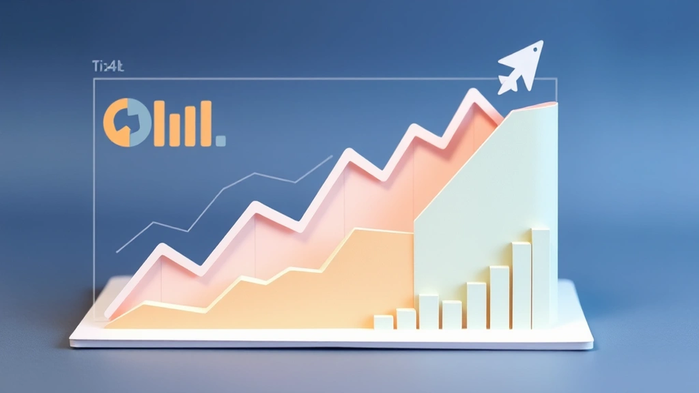

# 20년차 마케터가 털어놓는 '진짜 돈 버는' 퍼포먼스 마케팅의 모든 것

**퍼포먼스 마케팅**, 정말 광고비만 태우면 바로 매출이 쭉쭉 오르는 마법 같은 열쇠일까요? 안녕하세요, 20년째 이 바닥에서 구르고 또 구른 디지털 마케터입니다. 강남의 번쩍이는 대행사부터 이제 막 시작하는 스타트업의 작은 책상까지, 안 거쳐본 곳이 없네요. 그동안 수백억의 광고비를 집행하면서 깨달은 건 딱 하나입니다. 퍼포먼스 마케팅은 '돈 쓰는 기술'이 아니라 '돈 버는 과학'에 가깝다는 것. 그리고 대부분의 사람들이 이 과학을 오해하고 있다는 사실이죠.

많은 분들이 ROAS(광고비 대비 수익률) 300% 나왔다고 박수 치지만, 저는 속으로 '어디서 돈이 줄줄 새고 있진 않을까?'를 먼저 생각합니다. 반대로 전환율이 반 토막 나서 팀 전체가 패닉에 빠졌을 때, 오히려 저는 그 안에서 다음 분기 매출을 2배로 올릴 기회를 발견하기도 했고요. 이건 교과서에 나오는 얘기가 아닙니다. 제 월급과 고객사의 명운을 걸고 직접 부딪히며 얻어낸, 피땀 눈물 섞인 진짜 경험담입니다. 오늘은 여러분께 그저 그런 이론이 아니라, 제 20년 경력을 압축해서 "실제로 해보니까 이게 먹히더라"하는 날것 그대로의 이야기들을 좀 풀어볼까 합니다. 아마 이 글 하나만 제대로 소화하셔도, 내일부터 여러분의 광고 계정은 완전히 다른 퍼포먼스를 보여주게 될 겁니다.

## 데이터, 제발 '결과'만 보지 마세요: 과정 속에 숨은 보물찾기

다들 퍼포먼스 마케팅하면 가장 먼저 뭘 떠올리시나요? 아마 대부분 ROAS, 전환율, CPA(전환당 비용) 같은 최종 결과 지표일 겁니다. 물론 중요하죠. 최종 성적표니까요. 하지만 20년 동안 수많은 캠페인을 집행하면서 뼈저리게 느낀 건, **진짜 돈 되는 인사이트는 최종 결과가 아니라 그 결과를 만들어내는 '과정' 속에 숨어있다**는 사실입니다.

한 3년 전쯤이었을까요. 꽤 잘나가는 여성 의류 쇼핑몰 프로젝트를 맡았을 때의 일입니다. 당시 ROAS가 350% 수준으로 나쁘지 않았어요. 광고비를 1,000만 원 쓰면 3,500만 원의 매출이 나오는, 누가 봐도 괜찮은 성과였죠. 클라이언트도 만족했고, 팀원들도 이 정도면 선방했다고 안도하는 분위기였습니다. 하지만 제 눈에는 계속 무언가 찜찜한 게 보였어요. 성장이 정체되어 있었거든요. 더 나아갈 구석이 분명히 있을 것 같았죠.

그래서 저는 가장 기본적인 것부터 다시 파고들기 시작했습니다. 바로 고객의 구매 여정, 즉 '퍼널(Funnel)' 데이터였죠. 퍼널이 뭐냐고요? 어렵게 생각할 것 없습니다. 고객이 우리 광고를 보고(노출), 클릭해서(클릭), 사이트에 들어와(방문), 상품을 장바구니에 담고(장바구니 추가), 결제를 시작해서(결제 시작), 최종 구매를 완료(구매)하기까지의 과정을 깔때기 모양으로 그려보는 겁니다. 각 단계마다 사람들이 빠져나가기 때문에 깔때기 모양이 되는 거죠.

데이터를 까보니 놀라운 사실을 발견했습니다.
*   사이트 방문자 중 **장바구니에 상품을 담는 비율은 15%**로 업계 평균보다 높았어요. 상품이 매력적이라는 뜻이죠.
*   그런데! **장바구니에 상품을 담은 사람 중 실제 '결제 시작' 버튼을 누르는 사람이 고작 40%**밖에 안 되는 겁니다. 100명이 장바구니에 물건을 담으면 60명은 그냥 나가버린다는 뜻이죠. 바로 여기가 돈이 줄줄 새는 구멍이었습니다.

문제는 찾았으니, 이제 원인을 밝혀야죠. 저희는 히트맵 분석 툴(Hotjar 같은)을 사용해서 고객들이 장바구니 페이지에서 어떤 행동을 하는지 녹화된 영상을 전부 돌려봤습니다. 그랬더니 정말 어이없는 이유를 발견했어요. 모바일 화면에서 '쿠폰 적용' 버튼이 너무 작고 애매한 위치에 있어서 사람들이 못 찾고 헤매거나, 배송비 정책 안내가 불분명해서 추가되는 배송비에 당황해서 이탈하는 경우가 태반이었습니다.

해결책은 간단했습니다.
1.  장바구니 페이지의 UI/UX를 대대적으로 수정했습니다. '쿠폰 적용'과 '예상 배송비'를 가장 잘 보이는 곳에 크고 명확하게 배치했죠.
2.  '5만 원 이상 무료배송' 문구를 눈에 띄는 배너 형태로 상단에 고정시켰습니다.

결과는 어땠을까요? 단지 장바구니 페이지만 개선했을 뿐인데, **'결제 시작' 전환율이 40%에서 70%로 수직 상승**했습니다. 이것만으로도 전체 매출이 20% 가까이 올랐어요. 최종적으로 광고 효율은 어떻게 됐냐고요? 광고 소재나 타겟팅은 전혀 건드리지 않았는데도, **ROAS가 350%에서 550%로 뛰었습니다.** 똑같은 1,000만 원을 써도 5,500만 원의 매출이 나오는 구조로 바뀐 겁니다. 만약 저희가 'ROAS 350%면 괜찮네' 하고 안주했다면, 이 엄청난 기회를 영영 놓쳤을 겁니다.

이 경험 이후로 저는 신입 마케터들에게 항상 이렇게 말합니다. "결과 데이터에 울고 웃지 마라. 과정 데이터를 보고 원인을 찾아라. 진짜 실력은 거기서 판가름 난다." 여러분도 지금 당장 구글 애널리틱스를 열고, 가장 이탈률이 높은 페이지나 단계를 찾아보세요. 아마 생각지도 못한 곳에서 여러분의 비즈니스를 바꿀 보물을 발견하게 될 겁니다.

## 광고 소재, '예쁜 쓰레기'와 '돈 버는 효자'의 한 끗 차이

퍼포먼스 마케팅의 성과를 좌우하는 두 개의 큰 축이 있다면, 하나는 타겟팅이고 다른 하나는 단연 '광고 소재(Creative)'입니다. 특히 요즘처럼 모든 플랫폼이 알고리즘 기반으로 돌아가는 시대에는 소재의 중요성이 정말 하늘을 찌를 듯이 높아졌죠. 그런데 정말 많은 분들이 광고 소재에 대해 큰 착각을 하고 계세요. 바로 '예쁘고 퀄리티 높은 소재 = 성과 좋은 소재'라는 공식입니다.

단언컨대, 이 공식은 틀렸습니다. 제가 20년간 광고판에서 살아남으며 내린 결론은 **'예쁜 쓰레기'는 될지언정 '돈 버는 효자'는 아닐 확률이 높다**는 겁니다.

가장 기억에 남는 실패 사례가 하나 있습니다. B2B SaaS(기업용 서비스형 소프트웨어) 서비스를 제공하는 고객사였는데, 야심 차게 리드(잠재고객) 확보 캠페인을 준비하고 있었죠. 고객사 대표님은 브랜드 이미지도 중요하다며, 거액을 들여 CF 감독까지 섭외해 영화 예고편 같은 고퀄리티 영상 광고를 만들어 오셨습니다. 영상미는 정말 기가 막혔어요. 누가 봐도 '와, 이 회사 돈 좀 썼네' 싶은 그런 영상이었죠.

저희는 이 멋진 영상을 페이스북과 링크드인에 집행했습니다. 결과는요? 처참했습니다. **클릭률(CTR)은 0.3%**를 밑돌았고, 간혹 들어온 트래픽마저 단 한 건의 유의미한 리드로도 이어지지 않았습니다. 말 그대로 수천만 원을 허공에 날린 거죠. 대표님은 실망하셨고, 팀 분위기는 싸늘해졌습니다.

저는 밤새 그 '예쁜 쓰레기' 영상을 수십 번 돌려보며 실패 원인을 분석했습니다. 문제는 명확했어요.
*   **첫 3초가 너무 추상적이다:** 영상의 첫 5초 동안은 감성적인 배경음악과 함께 회사의 로고가 멋지게 등장하고, 사무실의 풍경을 아름답게 비추는 데 할애했습니다. 고객이 겪는 문제나 우리 서비스가 제공하는 해결책에 대한 단서는 전혀 없었죠. 사람들은 그저 '웬 광고람' 하고 휙 스크롤을 내려버린 겁니다.
*   **고객의 언어가 아니다:** 영상은 "혁신적인 워크플로우 솔루션으로 당신의 비즈니스를 재정의하세요" 같은 멋있지만 와닿지 않는 말들로 가득 차 있었습니다. 고객이 진짜 듣고 싶은 말, "이거 쓰면 야근 안 해도 됩니다" 같은 직설적인 메시지가 없었죠.

저는 대표님을 설득해서 딱 50만 원만 더 달라고 했습니다. 그리고 그 돈으로 제가 직접 만든 '못생긴' 광고 소재를 테스트해보기로 했죠. 제가 만든 건 별거 아니었습니다.
1.  **화면 녹화 영상:** 실제 우리 소프트웨어를 사용해서 복잡한 엑셀 보고서가 단 3번의 클릭으로 자동 생성되는 과정을 그대로 녹화했습니다.
2.  **강력한 첫 3초 훅(Hook):** 영상 시작과 동시에 "아직도 보고서 만드느라 야근하세요?"라는 자막을 화면 상단에 크게 박았습니다.
3.  **직설적인 카피:** 광고 문구도 "야근을 없애주는 자동 보고서 솔루션. 지금 14일 무료로 써보세요."라고 아주 간단명료하게 바꿨죠.

결과는 어땠을까요? 이 '못생긴' 화면 녹화 영상 광고는 그야말로 대박을 쳤습니다. **CTR은 2.8%까지 치솟았고 (거의 10배 상승!), 리드 전환율도 폭발적으로 증가해서 목표했던 CPA(리드당 비용)의 절반 가격에 잠재고객을 확보**하기 시작했습니다.

이 경험은 제게 아주 중요한 교훈을 줬습니다. 고객은 예술 작품을 감상하러 SNS를 하는 게 아닙니다. 자신의 문제를 해결해 줄 정보를 찾거나, 재미있는 콘텐츠를 소비하기 위해 들어오죠. 따라서 우리의 광고 소재는 '작품'이 아니라 '해결책' 또는 '재미'가 되어야 합니다. 특히 2025년을 향해가는 지금, **소비자들은 잘 다듬어진 광고보다 날것 그대로의, 진정성 있는 UGC(사용자 생성 콘텐츠) 스타일의 소재에 훨씬 더 강하게 반응**합니다.

광고 소재를 기획할 때 이것 하나만 기억하세요. "이 소재의 첫 3초는 스크롤을 멈추게 할 만큼 강력한가?" 그리고 "고객의 문제를 정확히 짚어주고, 해결책을 명확하게 제시하는가?" 이 두 가지 질문에 '예'라고 답할 수 없다면, 아무리 수억 원을 들여 만든 영상이라도 '예쁜 쓰레기'가 될 뿐입니다.

## 2025년, GA4와 AI를 모르면 '감'으로 마케팅하게 됩니다

솔직히 고백하자면, 저도 처음엔 변화가 두려웠습니다. 10년 넘게 손에 익었던 구글 유니버설 애널리틱스(UA)가 사라지고 낯선 GA4가 등장했을 때, 그리고 구글의 PMax(퍼포먼스 맥스) 캠페인처럼 AI가 마케터의 영역을 침범하기 시작했을 때 '아, 이제 내 경력도 끝인가'하는 불안감이 들기도 했죠. 하지만 이건 피할 수 없는 흐름입니다. 그리고 막상 써보니, 이건 위기가 아니라 엄청난 기회더군요. 2025년 이후의 퍼포먼스 마케팅은 **GA4와 AI를 얼마나 잘 활용하느냐에 따라 성과가 극명하게 갈릴 겁니다.** '감'으로 마케팅하던 시대는 정말로 끝났습니다.

### GA4, 고객의 '행동'을 속삭여주는 비밀 탐정

UA가 고객의 '방문' 단위로 데이터를 봤다면, GA4는 고객의 모든 '행동' 하나하나를 이벤트 단위로 추적합니다. 이게 왜 중요하냐고요? UA가 "손님 한 분이 가게에 들어와 10분 둘러보고 나가셨습니다"라고 보고했다면, GA4는 "손님 한 분이 들어와 청바지 섹션에서 3분, 티셔츠 섹션에서 5분을 머물렀고, 파란색 티셔츠를 입어봤지만(이벤트: `try_on`) 구매는 하지 않고 나가셨습니다"라고 속삭여주는 것과 같습니다. 훨씬 더 구체적이고 깊이 있는 분석이 가능해진 거죠.

제가 최근에 맡았던 한 온라인 강의 플랫폼의 사례를 들어볼게요. 특정 강의의 매출이 계속 부진해서 원인을 찾고 있었습니다. UA로는 그냥 해당 페이지의 이탈률이 높다는 것밖에 알 수 없었죠. 하지만 GA4의 '경로 탐색 분석' 보고서를 활용하니 전혀 다른 그림이 보였습니다.
*   **문제 발견:** 페이스북 광고를 통해 들어온 사용자들이 강의 상세 페이지에서 '수강 후기' 섹션까지는 열심히 스크롤을 내리지만, 정작 '수강 신청' 버튼은 거의 클릭하지 않고 이탈하는 패턴이 뚜렷하게 나타났습니다.
*   **가설 수립:** '혹시 수강 후기가 부족해서 신뢰를 주지 못하는 건 아닐까?' 또는 '가격이 너무 부담스럽게 느껴지는 게 아닐까?'
*   **A/B 테스트:** 저희는 두 가지 가설을 검증하기 위해 랜딩페이지를 두 버전으로 만들었습니다. A안은 기존 페이지, B안은 '수강 신청' 버튼 바로 위에 가장 만족도 높은 수강 후기 3개를 영상과 함께 배치하고, '12개월 무이자 할부 가능' 문구를 추가한 페이지였죠.
*   **결과:** B안 페이지의 '수강 신청' 버튼 클릭률이 A안에 비해 **무려 80%나 높게 나왔습니다.** 고객들은 강의 내용보다도 다른 사람들의 실제 경험과 가격 부담 완화에 더 민감하게 반응했던 겁니다. GA4가 아니었다면 우리는 영원히 '페이지 내용이 별론가?'하며 엉뚱한 곳만 파고 있었을 겁니다.

### AI 마케팅, 똑똑한 조수를 두는 기술

PMax나 메타의 어드밴티지+ 캠페인 같은 AI 기반 광고 상품들이 나오면서 많은 마케터들이 '이제 타겟팅도, 입찰도 AI가 다 해주니 우린 할 게 없네'라고 생각합니다. 이건 정말 위험한 착각입니다. AI는 만능이 아니라, 우리가 어떤 '데이터'와 '신호'를 주느냐에 따라 천재가 되기도 하고 바보가 되기도 하는 아주 강력한 도구일 뿐입니다. AI를 잘 쓴다는 건, **AI가 똑똑하게 학습할 수 있도록 양질의 먹이를 계속 던져주는 기술**과 같습니다.

예를 들어, PMax 캠페인을 그냥 '모든 방문자'에게 돌리면 AI는 갈피를 못 잡고 광고비를 낭비할 확률이 높습니다. 하지만 여기에,
*   **신호 1:** 우리 웹사이트에서 최근 30일 내 구매한 고객 리스트 (고객 일치 타겟팅)
*   **신호 2:** 특정 고가 상품을 조회했거나 장바구니에 담았던 사용자 리스트 (맞춤 잠재고객)
*   **신호 3:** 경쟁사 웹사이트를 방문한 사용자 리스트

이런 구체적인 '잠재고객 신호(Audience Signal)'를 제공해주면, AI는 이 사람들과 가장 유사한 행동 패턴을 보이는 새로운 잠재고객들을 기가 막히게 찾아내기 시작합니다. 실제로 한 가구 브랜드의 PMax 캠페인에 '소파 구매자' 리스트와 '식탁 상세페이지 조회자' 리스트를 각각 다른 에셋 그룹의 신호로 제공했더니, **전체 ROAS가 400%에서 750%로 두 배 가까이 상승**하는 기적을 경험했습니다. AI에게 명확한 방향을 제시해준 결과죠.

2025년의 마케터는 광고 소재를 만들고 버튼을 누르는 오퍼레이터가 아닙니다. GA4라는 탐정을 이용해 고객의 숨은 의도를 파악하고, 그 데이터를 기반으로 AI라는 똑똑한 조수에게 정확한 미션을 내리는 '전략가'가 되어야 합니다. 지금 GA4와 AI 광고 상품을 공부하는 것을 미루고 있다면, 당신은 스스로 도태의 길을 걷고 있는 것과 같습니다.

## 결론: 완벽한 전략보다 중요한 것은 '끊임없는 테스트'

지금까지 제 20년 경험을 바탕으로 퍼포먼스 마케팅의 핵심 원칙 세 가지를 말씀드렸습니다. 첫째, 최종 결과가 아닌 과정 데이터를 통해 새는 돈을 막고 기회를 찾는 것. 둘째, 예쁜 광고가 아닌 고객의 문제를 해결하는 직설적인 광고 소재를 만드는 것. 그리고 마지막으로, GA4와 AI라는 새로운 무기를 적극적으로 활용하여 데이터 기반의 의사결정을 내리는 것입니다.

이 모든 이야기의 결론은 사실 하나로 귀결됩니다. 퍼포먼스 마케팅의 세계에 '정답'이나 '만능 공식'은 없다는 것입니다. 제가 오늘 공유한 성공 사례들도 수십, 수백 번의 실패와 테스트 끝에 얻어낸 값진 결과물일 뿐입니다. 시장은 계속 변하고, 고객의 마음은 갈대 같으며, 플랫폼의 알고리즘은 매일같이 업데이트됩니다. 어제 성공했던 방식이 오늘은 실패의 원인이 될 수 있다는 뜻이죠.

따라서 20년차 마케터인 제가 여러분께 드릴 수 있는 가장 중요한 조언은 이것입니다. **완벽한 캠페인을 기획하느라 시간을 허비하지 마세요. 대신, 작게라도 끊임없이 가설을 세우고, 테스트하고, 배우고, 개선하는 사이클을 멈추지 마세요.** 오늘 당장 당신의 캠페인 데이터에서 '장바구니 이탈률'부터 확인해보시는 건 어떨까요? 혹은 가장 성과가 안 좋은 광고 소재의 첫 3초 문구를 바꿔보는 작은 시도도 좋습니다. 그 작은 변화가 여러분의 비즈니스에 놀라운 결과를 가져다줄 나비효과가 될 수 있습니다. 여러분의 성공적인 캠페인을 진심으로 응원합니다.

결론적으로, 퍼포먼스 마케팅의 핵심은 정답을 찾는 여정이 아니라, 끊임없는 질문과 실험을 통해 최적의 해답을 '만들어가는' 과정에 있습니다. 오늘 공유해 드린 조언처럼, 완벽한 전략을 기다리기보다 지금 당장 실행할 수 있는 작은 테스트 하나가 훨씬 더 큰 가치를 가집니다. 그 작은 시도들이 쌓여 여러분만의 성공 공식을 완성하게 될 것입니다.

여러분이 지금 당장 시도해보고 싶은 작은 아이디어나 캠페인을 운영하며 겪는 어려움이 있다면, 주저하지 말고 댓글로 공유해주세요. 서로의 경험을 나누며 함께 성장하는 마케터 커뮤니티가 되기를 바랍니다. 여러분의 용기 있는 첫걸음이 눈부신 성과로 이어지기를 진심으로 응원하며, 다음에도 실질적인 도움이 될 인사이트로 찾아뵙겠습니다.