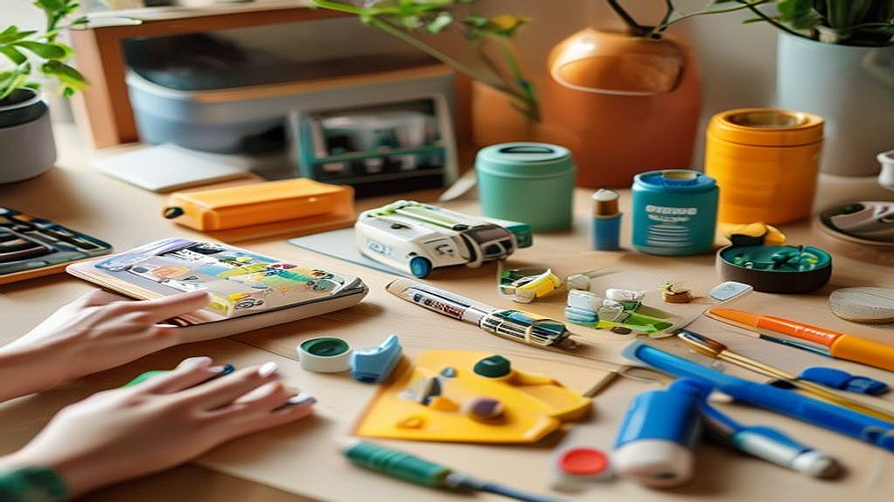

# 프라모델 도색의 입문, 2026년형 친환경 도료와 장비 가이드

프라모델 도색은 단순히 플라스틱 조립품에 색을 입히는 과정을 넘어, 나만의 결과물을 완성해가는 밀도 높은 창작의 영역입니다. 많은 3040 세대가 어린 시절 가조립 상태로 만족했던 로봇이나 자동차를 다시 꺼내 들며, 이제는 도색이라는 한 단계 높은 몰입을 꿈꿉니다. 하지만 현실적인 벽이 있습니다. 바로 독한 신너 냄새와 환기 시설의 부재, 그리고 가족들의 눈치입니다. 과거에는 도색을 하려면 베란다에 부스를 설치하거나 옥상으로 올라가야 했지만, 2026년 현재 도료 기술과 주변 장비의 발전은 거실 한구석에서도 충분히 도색을 즐길 수 있는 환경을 만들어주었습니다. 이번 글에서는 냄새와 독성을 최소화하여 집 안에서 안전하고 쾌적하게 도색을 시작하려는 당신을 위해, 지금 당장 실천 가능한 장비 선택법과 도료 운용 가이드를 정리합니다.

## 냄새 걱정을 덜어주는 도료 선택의 기준

도색을 망설이는 가장 큰 이유는 휘발성 유기화합물(VOC)에서 발생하는 자극적인 냄새입니다. 하지만 최근 시장의 흐름은 '친환경'과 '수용성'으로 완전히 기울었습니다. 여기서 중요한 것은 무조건 냄새가 없다고 홍보하는 제품을 덥석 잡는 것이 아니라, 내가 작업할 공간의 환기 능력에 맞춰 도료의 성질을 이해하는 것입니다.

실전 체크리스트를 통해 도료를 선택해 봅시다. 첫째, 작업 공간에 창문이 있고 배기 팬을 설치할 수 있는가? 둘째, 가족과 함께 생활하며 냄새에 극도로 예민한 구성원이 있는가? 셋째, 붓 도색 위주인가 에어브러시 위주인가? 

붓 도색이 주력이라면 수용성 아크릴 도료가 정답입니다. 알코올이나 전용 희석제만으로도 충분히 농도 조절이 가능하며, 아세톤 같은 강한 용제를 쓸 필요가 없습니다. 반면 에어브러시를 사용한다면 '저취형'으로 나온 에나멜 계열이나, 최신 수성 아크릴 도료를 권장합니다. 

실패 사례로 가장 흔한 것은 '냄새가 없다'는 말만 믿고 환기 장치 없이 밀폐된 방에서 장시간 작업하는 경우입니다. 아무리 친환경이라도 도료 입자가 공기 중에 부유하면 호흡기에 좋지 않습니다. 선택 기준은 명확합니다. 도료의 성분이 무엇인지보다, 내 작업 환경에서 '환기'를 얼마나 효율적으로 할 수 있는지를 먼저 따져야 합니다. 만약 0.5평 남짓한 책상 공간에서 작업한다면, 냄새가 적은 수성 도료를 쓰더라도 반드시 소형 탁상용 부스를 병행해야 합니다. 도료는 냄새의 원인이지만, 환기 장비는 그 원인을 제거하는 필수 도구라는 점을 잊지 마세요.

## 최소한의 공간으로 최대의 효과를 내는 장비 구축

프라모델 도색을 시작할 때 가장 큰 실수는 처음부터 거창한 콤프레셔와 대형 부스를 사들이는 것입니다. 2026년의 장비 시장은 '모듈화'가 핵심입니다. 좁은 공간에서도 필요할 때만 펼쳐서 사용하고, 작업이 끝나면 서랍에 넣을 수 있는 장비들이 주류를 이룹니다.

초보자가 반드시 갖춰야 할 것은 세 가지입니다. 첫째, 냄새를 빨아들이는 소형 이동식 부스입니다. 과거의 투박한 철제 부스와 달리, 최근 제품들은 접이식 구조로 되어 있어 사용하지 않을 때는 책 한 권 두께로 보관이 가능합니다. 둘째, 충전식 무선 에어브러시입니다. 콤프레셔와 에어브러시를 연결하는 복잡한 호스 없이, 손에 쥐는 것만으로 도색이 가능해 공간 제약을 획기적으로 줄여줍니다. 셋째, 전용 도색 집게와 거치대입니다. 부품을 손으로 잡고 칠하는 것은 불가능에 가깝기에, 튼튼한 집게와 이를 꽂아둘 스탠드는 도색 품질을 결정짓는 핵심 아이템입니다.

선택 기준은 '보관의 편의성'입니다. 일주일에 한 번, 주말에만 2~3시간 작업한다면 무거운 장비는 결국 짐이 됩니다. 10만 원 미만의 예산으로 시작한다면, 고성능 에어브러시 기기보다는 오히려 '좋은 환기 환경'과 '충분한 도색 집게'에 투자하는 것이 결과물 완성도를 높이는 데 훨씬 유리합니다. 부품을 고정하고 칠하고 말리는 과정이 원활해야 도색이 즐거워지기 때문입니다. 처음부터 풀세트를 갖추려 하지 말고, 딱 한 대의 프라모델을 완성할 수 있는 최소한의 장비만 구매해 시작해 보십시오. 장비는 언제든 추가할 수 있지만, 흥미를 잃으면 장비는 그대로 쓰레기가 됩니다.

## 실전 도색을 위한 단계별 프로세스와 주의사항

도색을 시작할 때 가장 중요한 것은 '서두르지 않는 것'입니다. 많은 초보자가 유튜브 영상의 화려한 기술에 현혹되어 바로 복잡한 도색에 도전하지만, 이는 대부분 실패로 끝납니다. 

핵심 기준은 '부품의 표면 처리'입니다. 도색의 80%는 사포질과 세척입니다. 플라스틱 표면의 기름기를 제거하지 않고 바로 색을 올리면 도료가 뭉치거나 벗겨집니다. 2026년 현재는 친환경 세정제가 잘 나와 있어, 굳이 독한 신너로 부품을 닦을 필요가 없습니다. 미지근한 물에 중성세제를 풀어 부품을 씻고 완전히 건조하는 것만으로도 도색의 기초는 끝납니다.

실수하기 쉬운 부분은 '도료의 농도'입니다. 붓 도색이든 에어브러시든 도료가 너무 진하면 붓 자국이 남고, 너무 묽으면 줄줄 흘러내립니다. 우유 농도 정도로 희석하는 것이 정석인데, 이를 감각으로 익히려면 흰색 플라스틱 조각에 여러 번 테스트해보는 과정이 필수입니다. 처음에는 한 번에 색을 입히겠다는 욕심을 버리고, 얇게 3~4번에 걸쳐 덧칠한다는 생각으로 접근하세요.

만약 도색을 하다가 실패했다면, 당황하지 말고 전용 신너로 닦아내거나 그대로 말린 뒤 다시 사포질을 하면 됩니다. 프라모델 도색은 실패를 수정하는 과정 또한 취미의 일부입니다. 처음 시작할 때는 복잡한 명암 도색이나 웨더링에 도전하지 마세요. 단색으로 깔끔하게 올리는 것만으로도 가조립 상태와는 비교할 수 없는 만족감을 느낄 수 있습니다. 정해진 순서대로 기초를 다지는 것이 가장 빠른 지름길입니다.

## 취미로서의 도색, 지속 가능한 소비를 위하여

프라모델 도색은 단순히 물건을 만드는 행위가 아니라, 나만의 시간을 확보하는 고급스러운 취미입니다. 2026년의 우리에게 도색은 냄새나 독성 같은 과거의 부정적 이미지에서 벗어나, 안전한 도료와 스마트한 장비를 통해 누구나 집에서 즐길 수 있는 창의적인 놀이가 되었습니다.

오늘 다룬 내용을 요약하자면, 자신의 주거 환경에 맞춰 환기 장비를 먼저 고민하고, 보관이 간편한 모듈형 장비를 선택하며, 무엇보다 서두르지 않는 기초 다지기를 실천하는 것입니다. 지금 당장 거창한 장비 쇼핑을 하기보다는, 가장 좋아하는 프라모델 하나와 수성 도료 몇 가지를 들고 작은 시작을 해보시길 권합니다. 도색은 결과물보다 그 과정에서 얻는 몰입의 즐거움이 훨씬 큽니다. 당신의 책상 위에서 완성될 작은 작품들이 일상의 소중한 환기가 되기를 바랍니다. 지금 바로 도색용 집게를 하나 들고, 당신의 첫 번째 프로젝트를 시작해 보십시오.

## 마치며

2026년의 도색은 더 이상 독성이나 냄새를 걱정해야 하는 고통스러운 작업이 아닙니다. 친환경 수성 도료와 스마트한 환기 시스템 덕분에, 이제 도색은 누구나 자신의 방 안에서 안전하게 즐길 수 있는 세련된 취미가 되었습니다. 오늘 살펴본 것처럼, 거창한 장비부터 갖추기보다는 자신의 환경에 맞는 최소한의 도구로 시작하는 것이 지속 가능한 취미 생활의 핵심입니다.

처음부터 완벽할 필요는 없습니다. 가장 아끼는 프라모델 하나와 몇 가지 색의 도료, 그리고 도색용 집게를 손에 쥐는 것만으로도 충분합니다. 서두르지 않고 차근차근 나만의 색을 입혀가는 과정에서 느끼는 깊은 몰입감은 그 어떤 결과물보다 값진 선물이 되어줄 것입니다. 

오늘 바로 작은 프로젝트를 시작해보는 건 어떨까요? 당신의 책상 위에서 펼쳐질 새로운 창작의 즐거움을 응원합니다. 고민은 완성만 늦출 뿐, 지금 바로 첫 번째 붓질을 시작해 보세요!
