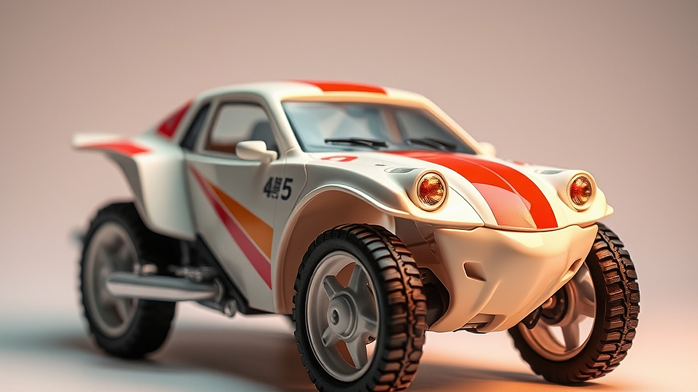

프라모델 도색, 'AI 컬러 매칭'으로 초보자도 프로처럼 완성하기라는 주제는 이제 단순히 기술적 호기심을 넘어, 주말 시간을 쪼개어 취미를 즐기는 3040 세대에게 실질적인 구원 투수가 되었습니다. 왜 지금 사람들이 이 방식에 열광할까요? 단순히 멋진 결과물을 내고 싶어서가 아닙니다. 퇴근 후 지친 몸을 이끌고 좁은 책상 앞에 앉았을 때, 조색 접시에 물감을 덜어내며 '이 색이 맞나?' 고민하다가 결국 붓을 꺾어버린 경험이 한 번쯤 있기 때문이죠. 과거에는 며칠을 투자해 색을 배합하고, 실패하면 다시 씻어내는 과정이 '도색의 낭만'이라 불렸지만, 지금은 다릅니다. 우리는 더 효율적이고, 실패 확률이 낮은 확실한 보상을 원합니다. 최근 AI 도구들이 사진 속 색상을 정밀하게 분석해 배합 비율을 알려주는 수준까지 진화하면서, 도색은 '무한한 시행착오'에서 '데이터 기반의 정밀 작업'으로 변모했습니다. 이 글에서는 좁은 공간에서 붓 도색이나 에어브러시를 시작하려는 분들이, 왜 AI 컬러 매칭을 활용해야 하는지, 그리고 어떤 기준으로 도구를 선택해야 실패를 줄일 수 있는지 현실적인 관점에서 짚어보겠습니다.

## AI 컬러 매칭이 도색의 진입장벽을 낮추는 이유

도색을 포기하게 만드는 가장 큰 적은 '색의 불일치'입니다. 머릿속에 떠오른 그럴듯한 건담의 메탈릭 블루를 구현하기 위해 여러 도료를 섞다가, 결국 탁한 회색이나 엉뚱한 보라색을 만들어본 경험이 있을 겁니다. AI 컬러 매칭 앱은 카메라로 원하는 색을 촬영하면, 가지고 있는 도료 브랜드의 라인업을 기반으로 최적의 조색 비율을 0.1g 단위까지 계산해 줍니다. 

구체적인 사례를 들어볼까요? 1/144 스케일 건담을 도색할 때, 박스 아트의 색감을 그대로 재현하고 싶다면 해당 이미지를 앱에 업로드하세요. 앱은 명도와 채도를 분석해 'A 도료 70%, B 도료 25%, C 신너 5%'와 같은 구체적인 가이드를 제공합니다. 이는 숙련된 모델러가 수십 년간 쌓아온 감각을 디지털 데이터로 치환한 것과 같습니다. 

실패 케이스도 명확합니다. 많은 초보자가 앱이 제안하는 비율을 맹신하다가, 조명 환경을 고려하지 않아 낭패를 봅니다. 작업실의 주광색 조명 아래서 배합한 색과, 완성 후 자연광 아래서 보는 색은 완전히 다를 수 있습니다. 이를 방지하려면 앱의 결과값을 그대로 따르되, 반드시 테스트용 플라스틱 조각(런너)에 먼저 도포해 본 뒤, 본인의 작업실 환경에서 색감을 확인하는 단계를 거쳐야 합니다. 선택 기준은 명확합니다. '다양한 도료 브랜드의 데이터베이스를 보유하고 있는가'와 '사용자가 가진 도료를 직접 등록해 관리할 수 있는가'를 최우선으로 확인하십시오.

## 실전 체크리스트: 장비보다 중요한 준비 단계

AI가 아무리 좋은 비율을 알려줘도 도색의 기본 환경이 갖춰지지 않으면 결과물은 처참합니다. 3040 취미인의 가장 큰 제약은 '공간'과 '시간'입니다. 거창한 부스나 고가의 콤프레셔를 사기 전에, 도색의 질을 결정짓는 것은 '데이터 관리'입니다. 

실전 체크리스트를 활용해 보세요. 
1. 도료의 점도 관리: AI가 알려준 비율대로 섞어도 도료의 점도가 맞지 않으면 붓 자국이 남거나 에어브러시가 막힙니다. 조색 후 반드시 전용 희석제를 사용하여 점도를 우유 농도 정도로 맞추는 습관을 들이세요. 
2. 기록의 습관화: 한 번 성공한 배합 비율은 반드시 앱 내의 '나만의 레시피' 탭에 저장하세요. 나중에 같은 색을 다시 만들 때 AI의 도움 없이도 동일한 결과를 낼 수 있는 자산이 됩니다. 
3. 기본 도구의 청결: 도색 실패의 80%는 오염된 도구에서 시작됩니다. 붓이나 에어브러시 노즐에 남아있는 잔여물은 AI가 계산한 정확한 색상을 오염시킵니다.

실수하기 쉬운 부분은 '무조건 많이 섞는 것'입니다. 초보자는 한 번에 많은 양을 조색하려 합니다. 하지만 AI가 알려준 비율은 아주 미세한 차이로도 색이 변할 수 있습니다. 처음에는 5ml 정도의 소량만 조색하여 색감을 확인하고, 만족스러울 때 양을 늘리는 것이 현명합니다. 선택 기준은 '도색 환경의 편의성'입니다. 환기 시설이 갖춰지지 않은 아파트 거실이라면 락카 도료보다는 수성 아크릴 도료를 기반으로 AI 매칭을 활용하는 것이 건강과 가정의 평화를 지키는 길입니다.

## AI 도색을 위한 도구 선택과 유지비 분석

이제 어떤 AI 보조 도구를 사용할지 결정해야 합니다. 시중에는 사진 분석형 앱과 컬러 차트 데이터베이스형 앱으로 나뉩니다. 사진 분석형은 직관적이지만, 카메라의 색감 왜곡을 완전히 배제하기 어렵습니다. 반면, 데이터베이스형은 제조사의 표준 색상표를 기준으로 하기에 정확도가 높지만, 사용자가 원하는 '나만의 커스텀 컬러'를 찾기에는 다소 답답할 수 있습니다.

예산과 난이도를 고려한 추천 방식은 두 가지 앱을 병행하는 것입니다. 먼저 사진 분석형 앱으로 원하는 색의 근사치를 찾고, 그 데이터를 데이터베이스형 앱에 입력하여 실제 보유한 도료로 변환하는 방식입니다. 이 과정은 초기에는 번거롭지만, 숙달되면 도색 준비 시간을 1시간에서 15분으로 단축할 수 있습니다. 

유지비 측면에서 보면, AI 도색은 오히려 경제적입니다. 무작정 도료를 사서 섞다가 버리는 양이 줄어들기 때문입니다. 2026년 현재, 도료 한 병의 가격은 결코 저렴하지 않습니다. 실패를 줄이는 것이 곧 장기적인 비용 절감입니다. 피해야 할 경우는 '무료 앱이라며 광고가 과도하게 노출되어 작업 흐름을 끊는 도구'입니다. 집중력이 중요한 도색 작업에서 잦은 광고는 의욕을 꺾는 주범입니다. 약간의 비용을 지불하더라도 광고 없는 깔끔한 UI의 앱을 선택하는 것이 정신 건강에 좋습니다. 

## 지금 당장 시작하는 도색 루틴

AI 컬러 매칭을 활용한 도색은 단순히 기술을 익히는 것이 아니라, 작업의 과정을 시스템화하는 과정입니다. 오늘 당장 집에 있는 프라모델 하나를 꺼내세요. 가장 눈에 띄는 부품 하나를 정하고, 그 색상을 앱으로 촬영해 보세요. 그리고 앱이 추천하는 비율대로 아주 적은 양만 조색해 봅니다. 

이때 중요한 점은 '완벽함'에 집착하지 않는 것입니다. 첫술에 배부를 수는 없습니다. AI는 도구일 뿐, 최종적인 색감의 조정은 여러분의 눈과 손이 해야 합니다. 만약 AI가 제안한 색이 마음에 들지 않는다면, 앱에 기록된 비율에서 아주 조금씩 도료를 가감하며 그 차이를 기록해 보세요. 이렇게 쌓인 데이터가 여러분만의 '도색 노하우'가 됩니다. 

결론적으로, AI 컬러 매칭은 도색의 문턱을 낮춰주는 훌륭한 가이드입니다. 하지만 진정한 즐거움은 그 가이드를 바탕으로 자신만의 색을 찾아가는 과정에서 나옵니다. 이제는 과거의 막연한 감각에 의존하지 마세요. 데이터와 기술을 활용해 더 효율적으로, 더 즐겁게 프라모델을 완성해 보시길 바랍니다. 지금 바로 앱스토어에서 컬러 매칭 도구를 다운로드하고, 오랫동안 방치해 두었던 프라모델 상자의 먼지를 털어내는 것부터 시작해 보세요. 당신의 책상 위 작은 건담이 프로의 색을 입고 다시 태어날 시간입니다.

## 마치며

AI 컬러 매칭 기술은 초보자도 전문가 수준의 색감을 구현할 수 있게 돕는 든든한 조력자입니다. 하지만 기억하세요. AI가 제시하는 데이터는 시작점일 뿐, 그 위에 여러분만의 감각을 한 방울 더할 때 비로소 세상에 하나뿐인 작품이 완성됩니다. 시행착오를 두려워하지 말고, 수치와 감각 사이에서 자신만의 황금 비율을 찾아가는 즐거움을 만끽해 보시길 바랍니다.

이제 더 이상 막연한 감각에 의존해 고민하지 마세요. 오늘 소개한 도구들을 활용해 여러분의 작업 공간에 새로운 활력을 불어넣어 보세요. 지금 바로 앱스토어에서 컬러 매칭 앱을 설치하고, 오랫동안 상자 속에 잠들어 있던 프라모델을 꺼내 보세요. 데이터라는 날개를 단 여러분의 건담이 프로의 색을 입고 다시 태어날 시간입니다. 여러분만의 멋진 작품을 완성하는 그 순간을 진심으로 응원합니다!
