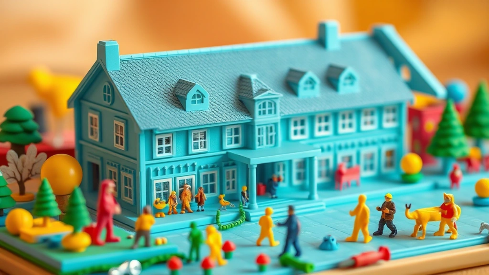

안녕하세요, 오랜만에 인사드리네요! 40대 키덜트 수집가, 오늘도 여러분의 추억을 자극할 이야기를 들고 왔습니다. 오늘 이야기의 주인공은 바로 **프라모델**입니다. 어릴 적 용돈을 모아 비닐봉지에 담긴 조립식 장난감을 사던 기억, 그 설렘과 마주했던 순간들이 아직도 생생한데요. 그 시절 저에게 프라모델은 단순한 장난감이 아니었습니다. 상상 속 영웅을 직접 만들고, 색칠하고, 만지작거리며 꿈을 키웠던 소중한 친구이자 동반자였죠. 지금은 서재 한편을 가득 채운 피규어와 레고들 사이에서 묵직한 존재감을 뽐내는 수많은 프라모델들을 볼 때마다, 어린 시절의 제가 얼마나 행복했는지 다시금 깨닫곤 합니다.

프라모델은 단순히 플라스틱 조각들을 끼워 맞추는 행위를 넘어섭니다. 그것은 어린 시절의 순수한 열정을 다시 불러일으키고, 섬세한 손길로 무언가를 완성해 나가는 과정에서 얻는 깊은 만족감을 선사합니다. 저는 실제로 다양한 건담 시리즈의 마스터 그레이드(MG)와 리얼 그레이드(RG) 모델들, 그리고 몇몇 밀리터리 프라모델들을 소장하고 있습니다. 처음에는 그저 추억에 잠겨 하나둘씩 모으기 시작했지만, 이제는 어떤 제품이 더 정교하고 조립감이 좋은지, 어떤 도색 기법을 적용해야 더 멋지게 완성될지 고민하는 진짜 '덕후'가 되어버렸죠. 이 블로그를 통해 저의 경험담과 함께, 프라모델의 매력에 푹 빠지고 싶은 여러분을 위한 실용적인 팁과 정보들을 아낌없이 공유해 드리려 합니다. 함께 프라모델의 세계로 떠나볼까요?

## 프라모델, 그때 그 시절부터 2025년 최신 트렌드까지

어릴 적 제게 프라모델은 정말 꿈같은 존재였습니다. 학교 앞 문방구 진열장에 놓인 박스 속 건담이나 태권브이, 아니면 탱크 같은 밀리터리 모델들을 보면서 침을 꼴깍 삼키던 기억이 아직도 선명해요. 그때는 니퍼 하나 없이 손으로 뜯거나 칼로 대충 잘라 조립하고, 도색은커녕 먹선도 넣지 못했지만, 그래도 완성된 모습만으로도 세상을 다 가진 듯 기뻤습니다. 삐뚤빼뚤하게 붙인 스티커, 어설프게 조립된 팔다리였지만, 제 손으로 직접 만들었다는 뿌듯함은 그 어떤 것과도 바꿀 수 없었죠.

시간이 흘러 40대가 된 지금, 프라모델의 세계는 정말 상상할 수 없을 정도로 발전했습니다. 예전에는 본드 없이는 조립이 불가능했던 모델들이 많았지만, 요즘은 '스냅핏(Snap-fit)' 방식이 대세가 되어 니퍼만 있어도 멋진 작품을 만들 수 있게 되었죠. 부품 분할도 예술의 경지에 이르러, 조립만으로도 원작의 색상을 거의 완벽하게 재현할 수 있게 되었고요. 특히 반다이(Bandai)의 건담 프라모델(건프라)은 그 기술력의 정점을 보여줍니다. 마스터 그레이드(MG)나 퍼펙트 그레이드(PG) 같은 등급의 제품들은 내부 프레임까지 정교하게 재현되어, 마치 실제 로봇의 축소판을 만드는 듯한 착각마저 들게 합니다. 처음 MG 등급의 건프라를 조립했을 때, 복잡한 부품 수와 디테일에 감탄하며 "아, 이거 진짜 어릴 때 갖고 싶었는데!"라는 말이 절로 나왔습니다. 이젠 단순히 조립을 넘어, LED 유닛을 넣어 눈에 불을 밝히거나, 작은 모터를 넣어 움직임을 부여하는 커스터마이징까지 가능해졌어요.

2025년 최신 트렌드를 이야기하자면, **기술 융합과 접근성 강화**가 핵심이라고 봅니다. 3D 프린팅 기술의 발전으로 개인 맞춤형 부품 제작이 더욱 쉬워지고 있고, 이는 한정판이나 단종된 부품을 대체하거나 자신만의 독창적인 프라모델을 만드는 데 크게 기여하고 있습니다. 또한, 증강현실(AR) 기술을 활용한 조립 매뉴얼이나 도색 시뮬레이션 앱 등도 등장하고 있어, 초보자들도 더욱 쉽게 프라모델의 세계에 발을 들일 수 있게 될 것입니다. 환경 문제에 대한 인식이 높아지면서, 재활용 플라스틱을 사용하거나 친환경 도료를 사용하는 '에코 프라모델' 제품들도 점차 늘어날 것으로 예상됩니다. 저는 최근에 한정판으로 출시된 재활용 플라스틱 건프라를 구매했는데, 환경을 생각하면서도 멋진 작품을 만들 수 있다는 점이 무척 만족스러웠습니다. 이처럼 프라모델은 단순히 취미를 넘어, 기술과 환경, 그리고 개인의 창의성이 융합되는 방향으로 진화하고 있습니다.

## 나만의 프라모델 컬렉션, 어떻게 시작하고 완성할까?

프라모델에 다시 입문하거나 처음 시작하려는 분들이 가장 많이 묻는 질문 중 하나가 "어떤 걸 사야 할까요?"입니다. 제 경험상 처음에는 너무 욕심내지 말고, 자신이 정말 좋아하는 주제의, 비교적 조립이 쉬운 제품부터 시작하는 것이 좋습니다. 예를 들어 건프라라면 **엔트리 그레이드(Entry Grade)나 하이 그레이드(HG)** 등급을 추천합니다. 가격도 저렴하고 부품 수도 적어 부담 없이 조립의 즐거움을 느낄 수 있습니다. 저도 처음에는 어릴 적 추억이 있는 건담 RX-78-2 HG 모델부터 다시 시작했어요. 그때의 설렘이 다시 찾아오는 듯한 기분이었죠. 밀리터리나 자동차 모델이라면 타미야(Tamiya)나 반다이의 쉬운 키트부터 시작하는 게 좋습니다.

프라모델 조립에 필요한 도구는 생각보다 간단합니다.
*   **니퍼**: 게이트(부품과 런너를 연결하는 부분)를 깔끔하게 자르는 데 필수입니다. 처음에는 저렴한 니퍼로 시작해도 좋지만, 좀 더 좋은 품질의 니퍼를 사용하면 게이트 자국을 최소화할 수 있어 만족도가 훨씬 높아집니다. 저는 처음에는 5천 원짜리 니퍼를 쓰다가, 3만 원대 정밀 니퍼로 바꿨는데 정말 신세계였습니다.
*   **아트 나이프**: 게이트 자국이나 불필요한 부분을 다듬을 때 유용합니다.
*   **핀셋**: 작고 섬세한 부품을 다루거나 스티커를 붙일 때 꼭 필요합니다.
*   **사포/스펀지 사포**: 게이트 자국을 매끄럽게 다듬거나 표면을 정리할 때 사용합니다.
*   **먹선펜/먹선 도료**: 프라모델의 디테일을 살려주는 데 핵심입니다. 저는 주로 마커 타입의 먹선펜을 사용하는데, 초보자도 쉽게 깔끔한 먹선을 넣을 수 있습니다.
*   **마감재(탑코트)**: 조립과 도색을 마친 후 프라모델을 보호하고, 광택 또는 무광택 효과를 주어 더욱 멋지게 완성합니다.

조립 과정에서 제가 겪었던 시행착오 중 하나는 바로 **도색**입니다. 처음에는 그냥 대충 붓으로 칠하면 되는 줄 알았죠. 하지만 붓 자국이 남거나 색이 고르지 않아 "아, 이거 진짜 망했네!"라며 몇 번이나 포기할 뻔했습니다. 프라모델 도색은 생각보다 섬세한 작업이 필요합니다. 초보자라면 부분 도색부터 시작하거나, 마커 타입의 도료를 사용하는 것이 좋습니다. 에어브러시 도색은 장비 투자도 필요하고 숙련도가 요구되니, 어느 정도 경험이 쌓인 후에 도전하는 것을 추천합니다. 저는 지금도 에어브러시 도색은 가끔 실패하지만, 그럴 때마다 실패 원인을 분석하고 다음 작품에 적용하며 배우고 있습니다.

완성된 프라모델은 멋지게 전시해야겠죠? 먼지가 쌓이는 것을 방지하기 위해 **아크릴 케이스**에 넣어두는 것이 좋습니다. 저는 작은 LED 조명을 함께 넣어 전시하는데, 밤에 불을 켜면 정말 근사한 분위기를 연출할 수 있습니다. 프라모델은 완성하는 기쁨뿐만 아니라, 나만의 공간을 꾸미는 즐거움까지 선사하는 취미입니다.

## 수집가라면 놓칠 수 없는 프라모델 실용 가이드: 가격, 희소성, 그리고 리셀

프라모델 수집을 본격적으로 시작하면, 자연스럽게 가격, 희소성, 그리고 리셀 가치에 관심을 갖게 됩니다. 저도 처음에는 그저 좋아하는 모델을 모으는 데 집중했지만, 어느 순간부터는 "이게 나중에 얼마나 오를까?" 하는 생각도 들더군요. 물론 프라모델은 투기 목적보다는 취미로 즐기는 것이 중요하지만, 현명하게 수집하는 팁을 알아두면 더욱 즐거운 취미 생활을 할 수 있습니다.

**가격 대비 품질**은 프라모델을 선택할 때 가장 중요한 기준 중 하나입니다. 일반적으로 반다이의 건프라는 가격대가 다양하지만, 그만큼 조립감과 디테일, 가동성이 매우 뛰어납니다. 특히 MG나 PG 등급은 부품 수가 많고 복잡하지만, 완성했을 때의 만족감은 정말 최고죠. 타미야의 밀리터리나 자동차 모델들은 실제를 방불케 하는 정교함과 고증을 자랑하며, 도색과 웨더링(오염 표현)을 통해 작품성을 극대화할 수 있습니다. 반면, 가격이 너무 저렴한 미인증 카피 제품이나 품질이 떨어지는 키트는 조립 과정에서 스트레스를 받거나 완성도가 낮아 실망할 수 있으니 주의해야 합니다. 저는 예전에 호기심에 저렴한 카피 제품을 구매했다가, 부품이 안 맞아서 조립을 포기한 경험이 있습니다. "아, 괜히 돈 버렸네"라는 후회가 밀려왔죠. 믿을 수 있는 제조사의 제품을 선택하는 것이 결국 시간과 비용을 아끼는 길입니다.

**희소성과 리셀 가치**는 프라모델 수집의 또 다른 재미 요소입니다. 한정판, 이벤트 한정 제품, 특정 잡지 부록 등은 시간이 지남에 따라 가치가 상승하는 경우가 많습니다. 예를 들어, 반다이의 프리미엄 반다이(P-Bandai)에서만 판매되는 한정판 건프라나, 특정 박람회에서만 판매되는 클리어 컬러 버전 같은 제품들이 대표적입니다. 이런 제품들은 출시 당시에는 구하기 힘들지만, 나중에 중고 시장에서 웃돈을 주고 거래되기도 합니다. 저는 몇 년 전, 한정판으로 출시된 특정 건프라 모델을 구매하지 못해서 두고두고 후회하고 있습니다. 당시에는 "굳이 한정판까지?"라고 생각했지만, 지금은 그 모델이 엄청난 프리미엄이 붙어 거래되는 것을 보면 "아, 그때 무조건 샀어야 했는데!"라는 탄식이 절로 나옵니다.

프라모델을 구매할 때는 주로 **온라인 쇼핑몰**이나 **오프라인 전문점**을 이용합니다. 온라인은 다양한 제품을 한눈에 비교할 수 있고, 할인 행사를 자주 진행한다는 장점이 있습니다. 오프라인 전문점은 직접 제품을 보고 구매할 수 있으며, 다른 수집가들과 정보를 교환하거나 조립 팁을 얻을 수 있다는 점에서 매력적입니다. 리셀을 고려한다면, **미개봉 상태**를 유지하는 것이 가장 중요합니다. 박스 손상 없이 보관하고, 직사광선을 피해 서늘한 곳에 보관해야 합니다. 중고거래 플랫폼을 이용할 때는 판매자와 충분히 소통하고, 제품 상태를 꼼꼼히 확인하는 것이 필수입니다. 프라모델은 단순히 플라스틱 조각이 아니라, 시간과 노력이 담긴 작품이자 추억의 조각이기 때문에, 그 가치를 제대로 이해하고 즐기는 것이 중요합니다.

프라모델은 어린 시절의 순수한 꿈과 열정을 다시금 일깨워주는 매력적인 취미입니다. 정교한 부품을 하나하나 맞춰가며 온전히 나만의 것을 완성하는 과정에서 얻는 성취감은, 바쁜 일상 속에서 잊고 지냈던 소중한 감정들을 다시금 느끼게 해줍니다. 저처럼 40대가 되어 다시 프라모델을 잡은 분들도 계실 테고, 혹은 이 글을 통해 프라모델의 세계에 처음 발을 들여놓으려는 분들도 계실 겁니다. 어떤 경우든, 프라모델은 여러분에게 즐거움과 만족감을 선사할 것입니다.

때로는 조립이 어렵고, 도색이 마음처럼 되지 않아 좌절할 때도 있을 겁니다. 하지만 그런 시행착오들을 통해 배우고 성장하는 것이 바로 프라모델의 진짜 매력이라고 생각합니다. 완성된 프라모델을 바라보며 흐뭇해하는 자신을 발견한다면, 이미 여러분은 진정한 프라모델 수집가의 길에 들어선 것입니다. 자, 망설이지 말고 여러분의 추억 속 프라모델을 다시 만나러 가보는 건 어떨까요? 혹은 새로운 프라모델에 도전하여 또 다른 추억을 만들어 보는 것도 좋습니다. 여러분의 첫 프라모델은 무엇이었나요? 아니면 어떤 프라모델에 가장 관심이 있으신가요? 댓글로 여러분의 이야기를 들려주세요!

## 마치며

프라모델은 단순히 플라스틱 조각을 맞추는 취미를 넘어, 인내심과 집중력을 기르고 손끝으로 무언가를 창조하는 특별한 경험입니다. 때로는 어려움에 부딪혀 좌절할 때도 있지만, 그 과정을 통해 배우고 성장하며 완성했을 때의 벅찬 성취감은 어떤 것과도 바꿀 수 없죠. 어린 시절의 향수를 다시 느끼고 싶거나 새로운 활력을 찾는 분이든, 프라모델은 분명 여러분에게 즐거움과 만족감을 선사할 겁니다.

이제 망설이지 말고 여러분만의 프라모델 여정을 시작해보세요. 잠자고 있던 창작 욕구를 깨우고, 추억 속 모델이든 새로운 도전이든, 마음을 이끄는 프라모델에 용기 있게 도전해보는 건 어떨까요? 여러분의 첫 프라모델 이야기, 가장 애착 가는 모델 추억이나 궁금한 점들을 댓글로 자유롭게 나눠주세요. 우리 함께 이 즐거운 취미를 더욱 풍성하게 만들어갈 수 있기를 바랍니다!