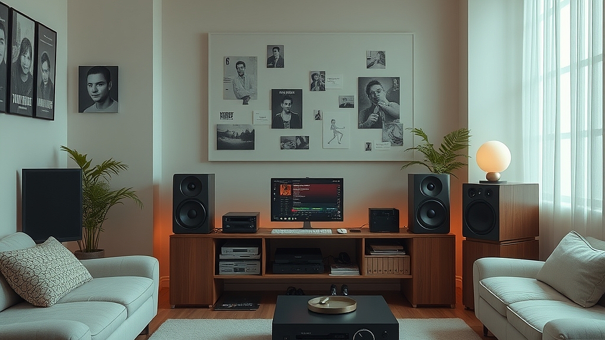

플레이리스트 큐레이션, 이제는 '기분'보다 '공간'이라는 관점으로 음악을 바라볼 때가 되었습니다. 불과 몇 년 전까지만 해도 우리는 출근길의 우울함이나 퇴근길의 해방감 같은 '감정의 상태'에 맞춰 노래를 골랐습니다. 하지만 2026년 현재, 음악 스트리밍 플랫폼의 알고리즘은 이미 우리의 감정을 파악하는 단계를 넘어섰습니다. 이제 고민의 핵심은 '내 기분이 어떤가'가 아니라 '내가 지금 머무는 이 공간의 공기를 어떻게 바꿀 것인가'로 이동했습니다. 

재택근무를 하거나 카페에서 개인 작업을 할 때, 단순히 좋아하는 노래를 틀어놓는 것만으로는 집중력이 유지되지 않습니다. 공간의 물리적 특성, 예를 들어 천장의 높이, 주변의 소음 정도, 그리고 그곳에서 수행해야 할 작업의 난이도에 따라 음악의 밀도와 템포를 다르게 설정해야 합니다. 더 이상 음악을 고르는 시간조차 아깝게 느껴진다면, 지금부터 설명할 '공간 기반 큐레이션'의 원칙을 적용해 보세요. 기분이라는 추상적인 개념에서 벗어나 공간이라는 구체적인 물리적 환경에 음악을 배치하는 법을 익히면, 여러분의 일상은 이전보다 훨씬 더 정교하게 설계될 것입니다.

## 공간의 밀도에 따라 음악의 비트를 선택하는 법

공간을 정의할 때 가장 먼저 고려해야 할 것은 '음악이 공간을 채우는 방식'입니다. 좁고 밀폐된 서재와 탁 트인 거실, 혹은 소음이 섞인 카페는 각기 다른 주파수 대역의 음악을 요구합니다. 

실제 사례로 제가 작업실 환경을 개선했던 경험을 들려드리죠. 3평 남짓한 좁은 방에서 복잡한 기획안을 작성할 때, 평소 즐겨 듣던 가사가 많은 팝 음악은 오히려 뇌의 언어 처리 영역을 방해해 집중력을 떨어뜨렸습니다. 이때는 보컬이 배제된 앰비언트 계열의 음악이나 일정한 비트가 반복되는 로파이(Lo-fi) 장르를 선택해야 합니다. 반면, 거실처럼 개방감이 큰 공간에서 가벼운 가사 업무를 볼 때는 중저음이 강조된 재즈나 보사노바 계열이 공간의 빈틈을 따뜻하게 메워줍니다.

실패 케이스는 명확합니다. 카페와 같은 공공장소에서 너무 조용한 클래식 피아노 곡을 틀어놓는 경우입니다. 주변의 대화 소리나 의자 끄는 소리와 음악의 다이내믹 레인지가 충돌하여 오히려 소음처럼 들리기 때문입니다. 이런 공간에서는 비트가 일정하고 음압이 고른 일렉트로닉이나 팝 댄스 장르가 적합합니다.

선택 기준은 다음과 같습니다. 
1. 공간에 울림이 많은가? 그렇다면 잔향이 적은 드라이한 녹음의 곡을 고르세요.
2. 공간에 생활 소음이 많은가? 그렇다면 특정 악기가 튀지 않는 평탄한 믹스의 곡을 고르세요.
3. 작업의 집중도가 필요한가? 그렇다면 가사가 없는 연주곡 위주로 구성하세요.

## 실전 체크리스트: 음악의 큐레이션 단계별 가이드

큐레이션을 자동화하고 싶다면 무작정 플레이리스트를 만드는 대신, 다음의 3단계 절차를 따라보세요. 이 과정은 음악을 고르는 시간을 10분 이내로 단축해 줄 것입니다.

첫째, '기준 곡'을 선정합니다. 공간의 성격과 가장 잘 어울린다고 생각하는 곡을 하나 정하세요. 예를 들어 '오후 3시의 햇살이 드는 서재'라면 차분한 기타 연주곡이 기준이 됩니다. 
둘째, 스트리밍 플랫폼의 '유사 곡 추천' 기능을 활용하되 필터를 적용합니다. 여기서 핵심은 '비슷한 템포'와 '비슷한 악기 구성'입니다. 
셋째, 리스트의 길이를 공간 체류 시간과 일치시킵니다. 보통 업무 집중 시간은 90분 단위가 가장 효율적이므로, 1시간 30분 분량의 리스트를 만들어 음악이 끝나는 시점을 휴식 시간으로 활용하는 것이 좋습니다.

실수하기 쉬운 부분은 '좋아하는 곡'과 '공간에 어울리는 곡'을 혼동하는 것입니다. 내가 좋아하는 곡이라도 공간의 성격과 맞지 않으면 소음이 됩니다. 예를 들어 아침 식사 시간의 경쾌한 주방에 어두운 분위기의 얼터너티브 록을 넣는다면 공간의 기능은 상실됩니다.

이 큐레이션 방식이 적합하지 않은 경우도 있습니다. 음악 자체가 주인공이 되어야 하는 감상용 시간, 즉 오디오 시스템을 테스트하거나 음악을 분석적으로 들어야 할 때는 이 규칙을 버려야 합니다. 이때는 공간의 효율성이 아니라 음악의 예술적 완성도에 집중해야 하기 때문입니다.

## 2026년형 큐레이션, 알고리즘을 부리는 법

오늘날의 스트리밍 플랫폼은 단순히 곡을 추천하는 것을 넘어, 사용자의 위치 정보와 시간대, 기기 연결 상태까지 고려합니다. 이를 효과적으로 부리려면 '태그'의 힘을 빌려야 합니다. 

공간별로 태그를 정리해 두세요. #집중_서재, #휴식_거실, #활력_주방과 같은 식으로 플레이리스트를 명명하고, 플랫폼의 학습 기능을 활용합니다. 3일만 해당 공간에서 특정 리스트를 반복 재생하면, 알고리즘은 그 공간의 물리적 맥락을 학습합니다. 이제는 '기분' 태그를 삭제하고 '공간' 태그를 추가하는 것만으로도 큐레이션의 질이 완전히 달라집니다.

핵심 기준은 다음과 같습니다. 
- 지속성: 해당 공간에서 3일 이상 같은 성격의 음악을 재생했는가?
- 가변성: 공간의 용도가 바뀔 때(예: 식탁에서 업무용 책상으로) 리스트를 즉각 교체할 준비가 되었는가?
- 데이터 정제: 내가 싫어하는 곡이 나오면 즉시 리스트에서 삭제하여 알고리즘의 오염을 방지하는가?

알고리즘은 여러분이 생각하는 것보다 훨씬 더 단순합니다. 여러분이 특정 공간에서 어떤 곡을 건너뛰는지, 어떤 곡을 끝까지 듣는지만 정확히 기록해도 AI는 최적의 배경음악을 알아서 배달해 줍니다. 

결론적으로, 플레이리스트 큐레이션은 이제 감성의 영역이 아닌 '환경 설계'의 영역입니다. 오늘 당장 여러분이 가장 많은 시간을 보내는 공간에 맞는 90분짜리 플레이리스트를 하나만 만들어 보세요. 가사가 없는 곡으로 시작해, 공간의 소음 정도에 따라 비트의 강도를 조절하는 것만으로도 공간의 분위기는 180도 달라집니다. 지금 바로 스트리밍 앱을 열어 '기분'이 아닌 '공간'을 검색창에 입력하고, 여러분의 일상을 음악으로 재배치해 보시기 바랍니다. 음악을 고르는 시간은 줄어들고, 그 공간에서 보내는 여러분의 시간은 더욱 밀도 높게 채워질 것입니다.

## 마치며

이제 플레이리스트를 단순히 기분에 따라 고르던 시대는 지났습니다. 음악은 이제 감정의 배설구가 아니라, 우리가 머무는 공간의 온도를 조절하는 정교한 ‘환경 설계’의 도구입니다. 알고리즘을 탓하기보다 내가 머무는 공간에 맞는 곡들을 의도적으로 배치하고, 불필요한 곡은 과감히 덜어내는 데이터 정제 과정을 거쳐보세요. 여러분의 일상이 음악을 통해 훨씬 더 밀도 있게 재구성될 것입니다.

오늘 당장 여러분이 가장 많은 시간을 보내는 작업실이나 거실을 떠올려 보세요. 그리고 그곳에 어울리는 90분짜리 플레이리스트를 직접 만들어보는 건 어떨까요? 가사가 없는 연주곡부터 시작해 공간의 소음과 비트의 강도를 맞춰가는 작은 실험만으로도, 익숙했던 공간이 전혀 새로운 곳으로 변하는 마법을 경험하게 될 것입니다. 

지금 바로 스트리밍 앱을 열어보세요. '기분'을 검색하던 손가락을 멈추고, 여러분의 '공간'을 위한 음악을 배치하는 것. 그 작은 변화가 여러분의 하루를 더욱 특별하게 만들어 줄 것입니다. 여러분의 공간은 지금 어떤 음악으로 채워지고 있나요?
