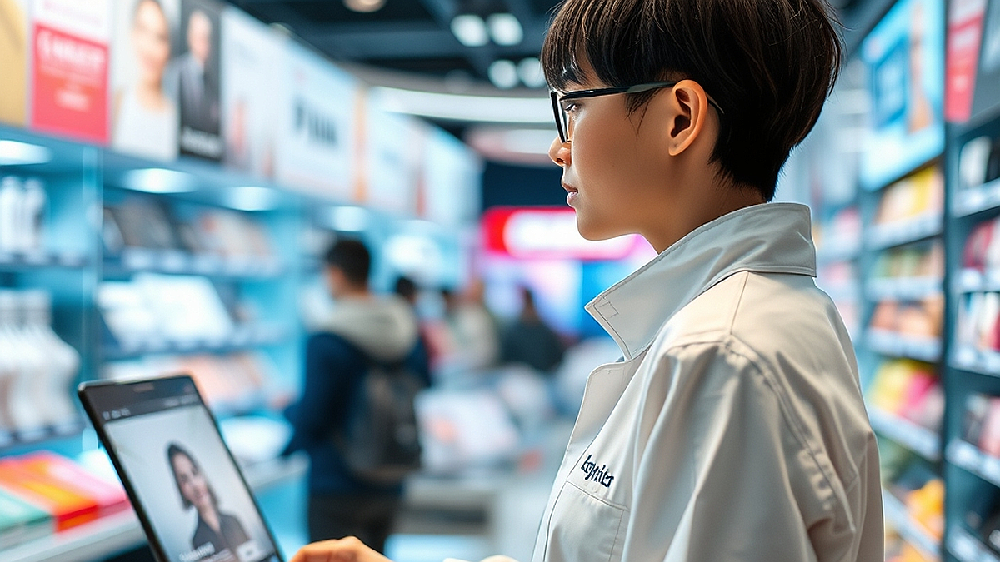

# 팝업스토어 피로도 증대, 2026년 브랜드가 선택한 '초개인화 큐레이션'

팝업스토어 피로도 증대 현상은 이제 마케팅 업계의 부정할 수 없는 현실이 되었습니다. 거리마다 쏟아지는 화려한 조명과 대형 조형물, 굿즈를 받기 위해 길게 늘어선 줄을 보며 소비자들은 더 이상 설렘보다는 피로감을 느낍니다. 2026년, 브랜드가 선택한 생존 전략은 '초개인화 큐레이션'입니다. 불특정 다수를 향해 거대한 공간을 빌려 외치는 방식은 이제 효율성을 잃었습니다. 대신 브랜드는 소규모 프라이빗 체험형 공간으로 눈을 돌리고 있습니다.

많은 마케터가 여전히 방문자 수라는 허상에 매몰되어 예산을 쏟아붓지만, 정작 돌아오는 것은 휘발성 강한 인증샷뿐입니다. 이제 소비자는 단순히 브랜드를 구경하는 것을 넘어, 자신의 취향을 세밀하게 반영한 경험을 갈구합니다. 오늘 이 글에서는 대규모 인파 중심의 팝업에서 소규모 프라이빗 체험으로 전환하는 구체적인 로드맵을 다룹니다. 예산이 한정적이고, 브랜드의 핵심 타깃이 명확하며, 일회성 노출보다 깊은 관계 맺기를 원하는 실무자라면 주목해야 할 마케팅의 전환점입니다. 단순히 공간을 꾸미는 단계를 넘어, 어떻게 고객의 일상 속 취향을 건드릴 것인지 그 실전적인 기준을 제시하겠습니다.

## 대규모 인파에서 소규모 프라이빗으로, 왜 변해야 하는가

과거의 팝업스토어는 규모가 곧 마케팅의 성패를 가르는 척도였습니다. 하지만 2026년 현재, 소비자는 '누구나 다 아는 공간'에 가는 것보다 '나만 아는 특별한 경험'을 소비할 때 더 높은 만족감을 느낍니다. 

마케터가 가장 먼저 점검해야 할 지점은 '누가 오느냐'가 아니라 '누가 우리 브랜드의 핵심 가치를 가장 깊이 이해할 것인가'입니다. 대형 팝업의 실패 사례를 보면 공통적으로 방문객의 숫자를 늘리기 위해 브랜드의 정체성과 무관한 게임이나 포토존을 배치합니다. 이 경우, 방문객은 브랜드를 기억하는 것이 아니라 '사진 찍기 좋은 장소'로만 기억하고 떠납니다. 

반면, 100% 예약제 기반의 프라이빗 팝업은 다릅니다. 예를 들어, 특정 취미를 가진 소수 인원 5명을 초대해 브랜드 제품을 직접 사용하게 하는 세션은 비용은 적게 들지만, 고객의 브랜드 충성도는 압도적으로 높습니다.

**실패 케이스:** 무작위 대중을 대상으로 팝업을 열고, 단순히 방문자 수 1만 명을 목표로 잡는 경우입니다. 이벤트 참여를 위해 경품을 뿌리면 방문객은 늘지만, 행사가 끝난 뒤 해당 브랜드의 재구매율은 0%에 수렴하게 됩니다.

**선택 기준:** 만약 브랜드의 타깃이 '고관여 제품군'이라면 소규모 프라이빗 팝업을 선택하십시오. 반면, '저관여 소모품'이라면 대규모 팝업이 유리할 수 있습니다. 예산이 5천만 원 이하라면 대규모 공간 대여보다는 타깃 고객 50명에게 집중하는 프라이빗 이벤트가 훨씬 효율적입니다.

## 초개인화 큐레이션을 위한 실전 체크리스트

초개인화 큐레이션은 단순히 고객의 이름을 부르는 수준이 아닙니다. 고객이 우리 브랜드를 접하는 순간, 그가 평소 가지고 있던 고민이나 취향이 해결되는 느낌을 주어야 합니다. 

이 단계를 실행하기 위해서는 데이터 기반의 사전 설문이 필수입니다. 행사 2주 전, 초대받은 고객들에게 그들의 취향을 묻는 3가지 질문을 던지십시오. 
1. 평소 브랜드 관련 카테고리에서 가장 고민하는 부분은 무엇인가?
2. 우리 브랜드의 제품 중 가장 궁금했던 라인업은 무엇인가?
3. 어떤 분위기에서 제품을 경험하고 싶은가?

이 데이터를 바탕으로 매장에 들어선 고객의 이름이 적힌 웰컴 카드와, 설문 결과에 맞춘 1:1 맞춤형 제품 추천 세트를 준비하십시오. 이것이 바로 초개인화의 시작입니다.

**실천 단계:**
- 1단계: 기존 고객 데이터 중 최근 6개월 이내 재구매 고객 30명을 선별합니다.
- 2단계: 그들의 구매 이력을 기반으로 가장 선호할 만한 제품군을 큐레이션합니다.
- 3단계: 15분 단위로 입장 시간을 쪼개어, 브랜드 매니저가 직접 고객 한 명에게 10분간 제품 시연과 상담을 진행합니다.

**실수하기 쉬운 부분:** 고객의 취향을 묻는 설문까지는 잘 진행하지만, 현장에서 그 정보를 전혀 활용하지 않는 경우입니다. 고객은 자신이 대답한 내용을 기억하고 있습니다. 현장에 도착했을 때 그 정보가 반영되어 있지 않다면 오히려 불쾌감을 줄 수 있습니다. 반드시 현장 스태프가 고객의 설문 데이터를 숙지하고 있어야 합니다.

## 마케팅 실험 방법과 측정 지표의 변화

초개인화 팝업은 기존의 '방문자 수'나 'SNS 언급량'으로 성과를 측정해서는 안 됩니다. 소규모 프라이빗 행사의 핵심 지표는 '전환율'과 '관계 밀도'입니다. 

행사 직후 바로 구매하지 않더라도, 이후 3개월간의 재구매율 혹은 브랜드 뉴스레터 구독 유지율을 측정하십시오. 초개인화된 경험을 한 고객은 브랜드와 강력한 연결 고리를 갖게 됩니다. 이를 측정하기 위해 행사장에 방문한 고객에게만 특별한 개인화 URL을 제공하고, 이후 구매 시 적용되는 혜택을 연동하는 방식을 추천합니다.

**실험 방법:** A그룹에는 기존 방식대로 무작위 오픈 팝업을, B그룹에는 초개인화 큐레이션 팝업을 진행하여 비교하십시오. B그룹의 경우 방문자 수는 1/10 수준일 수 있으나, 구매 단가(AOV)와 재구매율은 최소 3배 이상 차이가 날 것입니다.

**측정 지표:**
- 방문객 대비 구매 전환율 (가장 중요)
- 행사 이후 1개월 내 재방문 의사 응답률
- 고객 1인당 확보 비용(CAC) 대비 평생 가치(LTV)

만약 예산이 부족하다면 공간의 화려함보다는 '전문가 1인의 큐레이션 역량'에 투자하십시오. 공간은 심플하게 유지하되, 고객의 취향을 읽어주는 전문가가 배치된 10평 남짓한 공간이 수백 평의 텅 빈 포토존보다 훨씬 강력한 마케팅 효과를 냅니다.

## 결론: 팝업스토어는 '공간'이 아니라 '관계'를 파는 곳입니다

결국 2026년의 브랜드 마케팅은 '얼마나 많은 사람을 불러 모았는가'가 아니라 '얼마나 깊은 인상을 남겼는가'로 회귀하고 있습니다. 팝업스토어 피로도는 대중에게 뻔한 경험을 강요하는 브랜드에 대한 경고입니다. 이제는 숫자의 화려함 뒤에 숨지 마십시오. 당신의 브랜드가 누구를 위한 것인지, 그들이 진정으로 원하는 가치가 무엇인지 고민하는 것부터 시작해야 합니다.

소규모 프라이빗 체험은 대규모 행사보다 운영 난이도는 높지만, 브랜드의 팬덤을 구축하는 가장 확실한 방법입니다. 지금 당장 당신의 브랜드가 가진 데이터 중 가장 충성도 높은 고객 20명을 뽑아보십시오. 그들에게 브랜드가 직접 정성스러운 초대장을 보내고, 오직 그들만을 위한 1시간을 준비하는 것. 그것이 바로 초개인화 마케팅의 본질입니다. 

화려한 조명은 금방 꺼지지만, 고객과 나눈 진심 어린 대화는 브랜드의 자산으로 남습니다. 지금 바로 가장 가까운 고객부터 다시 챙기십시오. 그들이 당신의 브랜드를 지탱하는 가장 강력한 힘이 될 것입니다. 브랜드의 다음 팝업은 더 이상 보여주기 위한 전시장이 아니라, 고객과 브랜드를 잇는 깊은 대화의 장이 되어야 합니다. 오늘 제시한 기준들을 바탕으로 작은 실험부터 시작해 보시기 바랍니다. 고객은 당신이 그들의 취향을 이해하려 노력했다는 사실만으로도 브랜드에 마음을 열 것입니다.

이제는 팝업스토어의 규모나 화려함보다, 고객 한 사람의 취향을 얼마나 깊이 있게 이해하고 있느냐가 브랜드의 생존을 결정합니다. 대규모 행사로 브랜드의 존재감을 알리던 시대는 저물고, 이제는 소수 정예 고객과 진심을 나누는 '초개인화 큐레이션'이 마케팅의 핵심이 될 것입니다.

지금 바로 여러분의 브랜드가 보유한 데이터 속에서 가장 충성도 높은 고객 20명을 찾아보세요. 그들을 위한 작고 프라이빗한 경험을 설계하는 것부터 시작하는 겁니다. 화려한 전시보다 더 가치 있는 것은 고객과 나누는 진정성 있는 대화이며, 이러한 경험이 쌓일 때 비로소 강력한 팬덤이 구축됩니다.

다음 팝업은 단순히 보여주기 위한 공간이 아닌, 고객의 취향을 존중하는 대화의 장으로 만들어보세요. 고객은 당신이 그들을 위해 얼마나 고민했는지 그 마음을 반드시 알아줄 것입니다. 오늘 바로 가장 가까운 고객에게 먼저 손을 내밀어 보는 건 어떨까요? 당신의 브랜드가 그들의 일상 속에 깊이 스며들 수 있는 가장 확실한 첫걸음이 될 것입니다.
