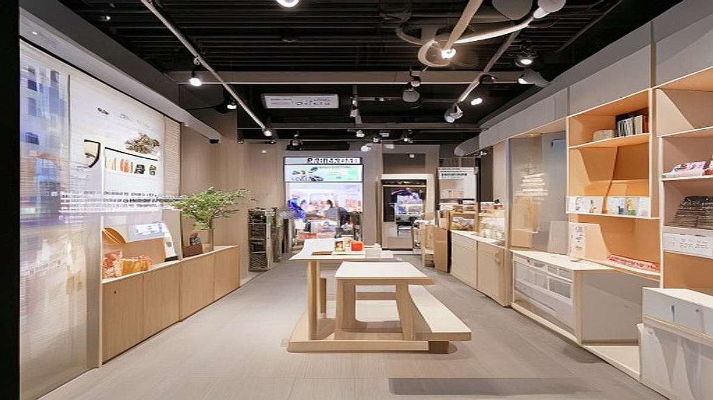

# 팝업스토어의 유통기한: 성수동에서 살아남는 브랜드 전략의 변화

팝업스토어의 유통기한은 이제 브랜드가 얼마나 화려한 공간을 꾸미느냐가 아니라, 방문객의 스마트폰 갤러리에 남은 사진이 얼마나 '나의 취향'으로 치환되는지에 달려 있습니다. 성수동 거리에는 매주 새로운 브랜드가 간판을 바꿔 달지만, 정작 그 안의 콘텐츠가 휘발되는 속도는 갈수록 빨라지고 있습니다. 마케터인 우리에게 닥친 고민은 명확합니다. 수억 원의 예산을 들여 2주간의 축제를 벌이는 것이 과연 팬덤을 만드는 '투자'인가, 아니면 그저 며칠 반짝하고 사라지는 '비싼 휘발성 광고'인가 하는 점입니다.

단순히 사진 찍기 좋은 곳, 소위 '인스타그래머블'한 공간은 이제 기본값이 되었습니다. 하지만 이제 소비자들은 영리합니다. 팝업스토어 입구에서 줄을 서는 순간, 그들은 브랜드가 자신들에게 건네는 메시지가 '진심'인지 '상술'인지 본능적으로 감별합니다. 방문객은 팝업스토어를 브랜드의 쇼룸이 아니라, 자신의 취향을 증명하는 놀이터로 인식하기 때문입니다. 오늘 이 글에서는 성수동이라는 밀도 높은 전장에서 살아남기 위해 브랜드가 던져야 할 질문과, 실패하지 않는 공간 경험 설계의 실무적 기준을 정리해 보겠습니다.

## 1. 공간은 콘텐츠가 아니라 '경험의 무대'여야 한다

많은 브랜드가 팝업스토어를 기획할 때 저지르는 첫 번째 실수는 '제품을 보여주는 전시회'를 만드는 것입니다. 성수동에는 이미 제품을 파는 편집숍과 쇼룸이 넘쳐납니다. 소비자가 굳이 시간을 내어 팝업스토어를 찾는 이유는 제품 그 자체가 아니라, 제품을 둘러싼 맥락을 경험하고 싶기 때문입니다.

실패하는 팝업스토어의 전형적인 특징은 '제품 중심의 배치'입니다. 입구에 들어서자마자 신제품을 나열하고, 설문조사를 강요하며, SNS 팔로우를 유도하는 방식은 소비자를 능동적인 참여자가 아닌 '잠재적 구매 데이터'로 취급하는 인상을 줍니다. 반면, 성공하는 브랜드는 공간을 하나의 '이야기'로 치환합니다. 예를 들어, 특정 향수를 판매하는 브랜드라면 향수병을 진열하는 대신, 그 향이 어울리는 가상의 공간이나 시간대를 후각과 시각으로 구현해 방문객이 그 세계관 안으로 들어오게 만듭니다.

선택 기준은 간단합니다. "이 공간에서 제품을 전부 치워도 방문객이 즐거움을 느낄 수 있는가?"라는 질문에 '예'라고 답할 수 있어야 합니다. 만약 제품이 없으면 아무런 콘텐츠가 남지 않는다면, 그것은 팝업스토어가 아니라 임시 판매대에 불과합니다.

* 실패 케이스: 화려한 포토존만 만들고 제품 설명 리플렛만 나눠주는 경우. 방문객은 사진만 찍고 3분 만에 퇴장하며 브랜드에 대한 기억은 휘발됩니다.
* 실전 팁: 방문객이 공간 내에서 무언가를 '직접 선택'하게 하세요. 단순히 보는 것이 아니라, 내 취향을 골라내는 과정이 포함될 때 브랜드는 비로소 기억에 남습니다.

## 2. 팬덤을 만드는 팝업은 '데이터'가 아닌 '기록'을 남긴다

팝업스토어의 성과를 측정할 때 흔히 방문자 수와 SNS 태그 수에 집착합니다. 하지만 이 지표들은 브랜드의 '팬덤'을 대변하지 않습니다. 1,000명의 뜨내기 방문객보다, 100명의 '다시 보고 싶은' 방문객을 만드는 것이 훨씬 중요합니다. 팝업스토어의 유통기한을 늘리는 힘은 방문객이 남긴 '기록'에서 나옵니다.

여기서 기록이란 단순한 후기가 아닙니다. 방문객이 자신의 취향을 투영해 만든 결과물이어야 합니다. 예를 들어, 브랜드의 철학이 담긴 굿즈를 직접 커스텀하거나, 브랜드의 세계관 내에서 자신의 캐릭터를 만드는 식의 활동은 방문객에게 강력한 '소유감'을 줍니다. 자신이 공을 들여 만든 결과물은 쉽게 버려지지 않으며, 이는 곧 브랜드와의 정서적 유대로 이어집니다.

실무적으로 가장 경계해야 할 부분은 '효율성'입니다. 방문객의 동선을 짧게 만들고, 회전율을 높여 더 많은 사람을 받으려는 시도는 팬덤 구축과는 상극입니다. 팬덤은 시간이 필요합니다. 공간 안에서 머무는 시간이 길수록, 브랜드와 교감할 가능성도 커집니다. 30분 동안 줄을 서서 5분 만에 나가게 만드는 구조라면, 그 30분의 대기 시간을 브랜드가 어떻게 보상할지 고민해야 합니다. 대기열조차 브랜드의 일부가 되도록 설계하는 것이 성수동에서 생존하는 브랜드의 전략입니다.

* 핵심 기준: '재방문 의사'를 물을 때, 제품 구매 때문이 아니라 '이 공간의 분위기' 때문에 다시 오고 싶다는 답이 나와야 합니다.
* 실수하기 쉬운 부분: 참여형 이벤트를 기획할 때 난이도를 너무 높게 설정하는 경우입니다. 고객은 공부하러 온 것이 아니라 놀러 왔다는 점을 명심하세요.

## 3. 지속 가능한 성장을 위한 체크리스트

팝업스토어를 준비하는 마케터라면 예산과 규모에 상관없이 아래의 체크리스트를 반드시 점검해야 합니다. 이는 단순히 화려한 행사를 만드는 것이 아니라, 브랜드의 지속가능성을 시험하는 잣대가 됩니다.

첫째, '브랜드의 페르소나'가 공간에 녹아 있는가? 공간의 조명, 음악, 향기, 직원들의 말투까지 하나의 캐릭터로 통일되어야 합니다. 둘째, '방문객의 보상'이 명확한가? 인스타그램에 올릴 사진 한 장 외에, 방문객이 얻어가는 심리적 만족감이나 실질적인 정보가 무엇인지 정의해야 합니다. 셋째, '사후 관리'가 준비되었는가? 팝업 종료 후 이 방문객들을 우리 브랜드의 공식 채널로 어떻게 연결할 것인가에 대한 전략이 없으면 모든 노력은 일회성으로 끝납니다.

팝업스토어는 끝이 아니라 시작입니다. 성수동의 수많은 공간 중 당신의 브랜드가 선택받으려면, 방문객이 그 문을 나설 때 '나는 이 브랜드와 좀 더 깊은 관계를 맺고 싶다'는 감정을 느끼게 해야 합니다. 휘발되는 유행에 올라타지 마세요. 오히려 유행의 중심지에서 자신만의 속도로 브랜드를 증명하는 것이, 역설적으로 가장 오래 살아남는 방법입니다.

결론적으로, 성공적인 팝업스토어는 화려한 외관이 아니라 방문객의 일상에 얼마나 깊숙이 침투했느냐에 의해 결정됩니다. 방문객의 갤러리에 남은 사진은 브랜드의 홍보물이 아니라 그들의 취향을 기록한 자산이 되어야 합니다. 지금 당장 기획 중인 팝업스토어에서 '판매'라는 단어를 지우고 '경험'과 '기록'이라는 단어를 넣어보세요. 고객은 당신이 파는 물건이 아니라, 당신이 제안하는 취향을 사러 올 것입니다. 오늘 분석한 세 가지 관점을 바탕으로, 휘발되지 않는 브랜드 경험을 설계해 보시길 권합니다.

## 마치며

성수동이라는 치열한 격전지에서 팝업스토어는 단순히 물건을 파는 공간을 넘어, 브랜드의 철학을 고객의 일상 속에 각인시키는 중요한 무대입니다. 일시적인 화제성에 기대기보다 고객의 취향을 자극하고 그들의 기억 속에 브랜드라는 자산을 남기는 전략이 반드시 필요합니다. 결국 팝업스토어의 성패는 방문객이 문을 나설 때 얼마나 브랜드와 깊은 유대감을 느꼈느냐에 달려 있습니다.

이제 기획의 중심을 '판매'에서 '경험'으로 옮겨보세요. 고객은 당신이 제안하는 남다른 취향을 소비하고, 그 경험을 자신의 기록으로 남기기를 원합니다. 오늘 살펴본 전략들을 바탕으로, 휘발되지 않는 브랜드의 생명력을 성수동에 뿌리 내려보시는 건 어떨까요? 지금 바로 당신의 브랜드가 고객의 일상에 스며들 수 있는 가장 특별한 경험은 무엇일지 고민해 보시길 바랍니다. 당신의 브랜드가 오래도록 기억될 멋진 팝업스토어를 응원하겠습니다!
