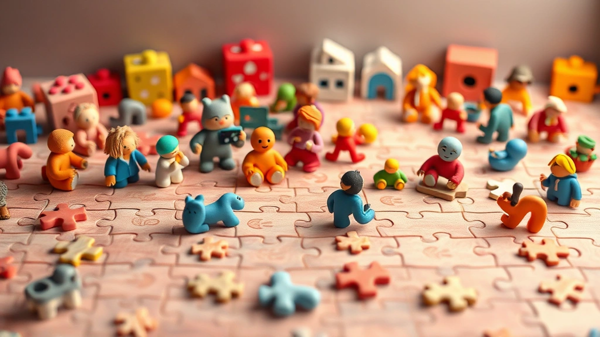

어릴 적, 퀴퀴한 나무 상자 안에서 쏟아져 나오던 수많은 조각들을 보며 설레던 기억, 다들 있으신가요? 저는 40대 키덜트 수집가로서, 피규어와 레고는 물론이고, 이 **퍼즐**이라는 매력적인 취미에 푹 빠져 살고 있습니다. 손끝으로 조각들을 더듬으며 그림을 완성해 나가는 과정은 단순히 시간을 보내는 행위를 넘어, 잊고 있던 어린 시절의 추억을 소환하고, 잠시 멈춰 서서 나 자신과 오롯이 대화하는 소중한 시간이죠. 제 방 한쪽 벽면을 가득 채운 완성된 퍼즐들을 볼 때마다, 그 하나하나에 담긴 스토리와 열정이 떠올라 미소를 짓곤 합니다.

사실 저에게 퍼즐은 단순한 취미를 넘어선 일종의 의식 같은 것이었어요. 복잡한 생각에 잠기거나 스트레스가 쌓일 때면, 저는 의례적으로 퍼즐 상자를 꺼냅니다. 수백, 수천 개의 조각들이 처음에는 막막하게 느껴지지만, 점차 윤곽이 잡히고 그림이 완성되어 가는 과정에서 마음의 평화를 찾고, 알 수 없는 성취감과 뿌듯함을 느끼죠. 특히 요즘에는 평면 퍼즐을 넘어 입체 퍼즐, 심지어는 스마트 기술이 접목된 퍼즐까지 등장하면서, 이 오래된 취미가 얼마나 다채롭게 진화하고 있는지 새삼 놀라곤 합니다. 오늘은 저처럼 퍼즐의 매력에 푹 빠진 분들, 혹은 이제 막 퍼즐의 세계에 발을 들이려는 분들을 위해 저의 경험담과 함께 2025년 최신 트렌드까지 아낌없이 풀어놓으려 합니다. 자, 그럼 퍼즐이라는 마법 같은 세계로 함께 떠나볼까요?

## 추억 소환! 클래식 퍼즐부터 2025년 뉴트로 트렌드까지

저에게 퍼즐의 시작은 단연 클래식 직소 퍼즐이었습니다. 초등학교 시절, 할머니 댁 거실에 놓여 있던 500조각짜리 알프스 풍경화 퍼즐이 제 첫 퍼즐이었죠. 가장자리 조각들을 먼저 맞춰 테두리를 만들고, 하늘색 조각, 초록색 조각, 집 모양 조각들을 색깔별로 분류하며 집중하던 그 시간은 마치 작은 탐험 같았습니다. 한 조각 한 조각이 제자리를 찾아갈 때마다 느껴지던 짜릿함과, 마침내 완성된 그림을 보며 느꼈던 뿌듯함은 지금도 생생하게 기억납니다. 그때는 그저 종이 퍼즐이 전부인 줄 알았죠.

하지만 시간이 흐르면서 퍼즐도 참 많이 변했습니다. 예전에는 주로 종이 재질의 평면 퍼즐이 대부분이었지만, 요즘에는 나무, 플라스틱, 심지어는 금속 재질의 퍼즐까지 찾아볼 수 있어요. 특히 2025년에는 ‘뉴트로(Newtro)’ 트렌드가 퍼즐 시장에도 강하게 불어닥치고 있습니다. 예전에 유행했던 빈티지 디자인이나 고전 명화를 현대적인 감각으로 재해석한 퍼즐들이 다시금 인기를 얻고 있죠. 얼마 전 저는 1980년대 애니메이션 캐릭터가 그려진 1000조각 퍼즐을 우연히 발견했는데, 아, 이거 진짜 어릴 적에 갖고 싶었던 그림이라 망설임 없이 구매했습니다. 조각들을 맞추는 내내 어린 시절 보던 만화 주제곡이 맴도는 것 같았어요. 완성하고 나니 단순한 퍼즐이 아니라, 제 유년 시절의 한 장면을 고스란히 담아낸 작품 같았습니다. 액자에 넣어 거실에 걸어두니 오며 가며 볼 때마다 미소가 절로 지어지더군요.

클래식 퍼즐을 고를 때는 몇 가지 팁이 있습니다. **첫째, 조각의 품질입니다.** 조각이 너무 얇거나 잘 휘는 재질은 맞추는 과정에서 스트레스를 유발하고, 완성 후에도 쉽게 망가질 수 있어요. 저는 개인적으로 두툼하고 견고한 조각을 선호합니다. 특히 조각 간의 맞물림이 부드러우면서도 단단하게 고정되는 제품이 좋습니다. 유명 브랜드인 *Ravensburger*나 *Clementoni* 같은 곳은 이런 면에서 믿을 수 있는 품질을 자랑하죠. **둘째, 인쇄 품질입니다.** 그림이 선명하고 색감이 풍부해야 완성했을 때의 만족도가 높습니다. 특히 미세한 색상 차이로 조각을 구분해야 하는 퍼즐의 경우, 인쇄 품질이 좋지 않으면 눈이 쉽게 피로해지고 퍼즐 풀이 자체가 어려워질 수 있습니다. **셋째, 리세일 가치**를 고려한다면, 한정판으로 출시되는 고전 명화 퍼즐이나 특정 아티스트와의 협업 퍼즐을 눈여겨볼 만합니다. 이런 퍼즐들은 시간이 지나도 가치를 유지하거나 오히려 오르는 경우가 종종 있거든요. 저도 몇 년 전 구매했던 특정 화가의 한정판 퍼즐이 현재는 두 배 가까이 가격이 올랐더라고요. 물론 저는 팔 생각은 전혀 없습니다만, 이런 점도 퍼즐을 고르는 또 다른 재미가 될 수 있습니다.

## 단순 조각 맞추기 그 이상! 입체 퍼즐과 스마트 퍼즐의 매력

평면 퍼즐에 익숙해질 무렵, 저는 새로운 도전을 찾아 입체 퍼즐의 세계로 발을 들였습니다. 처음에는 '이걸 어떻게 만들지?' 하는 막막함이 앞섰죠. 설명서만 봐도 머리가 지끈거리는 것 같았으니까요. 하지만 에펠탑 3D 퍼즐을 시작으로 타지마할, 콜로세움 등 세계 유명 건축물들을 하나둘 만들어나가면서, 평면 퍼즐과는 또 다른 차원의 성취감을 느꼈습니다. 조각들이 위로, 옆으로 쌓아 올려지며 서서히 형태를 갖춰나가는 모습은 정말 감동적이에요. 완성된 건축물을 책상 위에 올려놓았을 때의 뿌듯함은 말로 다 표현할 수 없습니다.

특히 기억에 남는 건, 제가 푹 빠져 있는 *해리포터* 시리즈의 호그와트 3D 퍼즐이었습니다. 수많은 탑과 다리, 세밀한 창문 조각들까지, 정말이지 역대급 난이도를 자랑했죠. 중간에 몇 번이고 포기하고 싶었던 순간이 있었습니다. 특히 작은 조각들이 제대로 맞물리지 않아 애를 먹었던 기억이 나네요. '아, 이거 진짜 갖고 싶었는데, 이렇게 어려울 줄이야!' 하고 혼잣말을 되뇌면서도, 밤늦게까지 끙끙대며 매달렸습니다. 그리고 마침내 완성된 웅장한 호그와트 성을 보았을 때, 그 성취감은 이루 말할 수 없었습니다. 단순한 장난감이 아니라, 제가 직접 마법 세계의 한 부분을 재현해낸 듯한 기분이었죠. 지금은 제 서재 가장 좋은 자리에 전시되어 오가는 사람들의 시선을 사로잡고 있습니다.

2025년 퍼즐 트렌드 중 하나는 바로 **스마트 퍼즐**입니다. 단순한 조각 맞추기를 넘어 디지털 기술이 접목되어 경험을 확장시켜주는 퍼즐이죠. 예를 들어, 완성된 퍼즐을 스마트폰 앱으로 스캔하면 증강현실(AR) 기술로 퍼즐 속 그림이 움직이거나, 숨겨진 이야기가 펼쳐지는 식입니다. 제가 최근에 시도했던 스마트 퍼즐은 완성된 그림 속 동물들이 AR로 살아 움직이며 생태계에 대한 정보를 알려주는 제품이었어요. 아이들과 함께 맞추면서 교육적인 효과까지 얻을 수 있어 정말 유익했습니다. 이런 스마트 퍼즐은 특히 젊은 세대나 아이들에게 퍼즐의 새로운 재미를 선사하며 큰 인기를 끌고 있습니다.

입체 퍼즐이나 스마트 퍼즐을 구매할 때는 **가격 대비 품질**을 꼼꼼히 따져봐야 합니다. 입체 퍼즐은 조각의 정교함과 맞물림이 중요해요. 조각이 헐거우면 완성 후 쉽게 무너지거나 형태가 틀어질 수 있습니다. 구매 전 온라인 후기를 통해 조각의 유격이나 설명서의 이해도를 확인하는 것이 좋습니다. 스마트 퍼즐의 경우, 앱의 안정성과 콘텐츠의 질이 중요합니다. 앱이 자주 오류가 나거나 콘텐츠가 부실하면 스마트 기능이 무용지물이 될 수 있으니까요. 또 한 가지, 요즘에는 **친환경 소재**로 만들어진 퍼즐들도 많이 나오고 있습니다. 재활용 플라스틱이나 FSC 인증을 받은 지속 가능한 목재로 만든 퍼즐은 환경을 생각하는 키덜트들에게 더욱 매력적인 선택지가 될 것입니다. 조금 더 비쌀 수는 있지만, 지구를 위한 가치 소비라고 생각하면 충분히 투자할 만한 가치가 있다고 봅니다.

## 퍼즐, 이제는 커뮤니티와 투자 가치까지! 키덜트의 현명한 퍼즐 라이프

예전에는 퍼즐이 혼자 즐기는 고독한 취미라고 생각했습니다. 하지만 요즘에는 퍼즐을 매개로 한 커뮤니티 활동이 정말 활발합니다. 온라인 카페나 SNS 그룹에서는 완성된 퍼즐 사진을 공유하고, 서로의 노하우를 나누며, 심지어는 퍼즐을 교환하거나 함께 맞추는 모임을 갖기도 합니다. 저도 최근에 가입한 온라인 퍼즐 동호회에서 제가 완성한 *스타워즈* 한정판 퍼즐 사진을 올렸는데, 정말 많은 분들이 칭찬해주시고 액자 처리 팁까지 알려주시더라고요. 같은 취미를 가진 사람들과 소통하는 것만으로도 퍼즐 라이프가 훨씬 풍요로워지는 것을 느꼈습니다.

퍼즐이 단순한 취미를 넘어 **투자 가치**를 지니기도 한다는 사실, 알고 계셨나요? 특정 아티스트와 협업하여 한정판으로 출시되는 퍼즐, 인기 IP(지적재산권)를 활용한 퍼즐(예: *디즈니*, *마블*, *스튜디오 지브리*), 그리고 단종된 빈티지 퍼즐 등은 시간이 지날수록 그 가치가 상승하는 경우가 많습니다. 저도 한때 구매했던 *미야자키 하야오* 감독의 작품 퍼즐이 지금은 희귀템으로 분류되어, 구매 가격의 몇 배를 호가하는 것을 보고 깜짝 놀랐습니다. 물론 저는 소장용으로 구매한 것이라 팔지는 않겠지만, 이런 정보들을 미리 알고 있다면 현명한 퍼즐 수집에 도움이 될 겁니다. 이런 퍼즐들은 보통 출시 초기에 빠르게 매진되니, 관심 있는 제품이 있다면 발매 소식에 귀를 기울이는 것이 중요합니다.

퍼즐을 오랫동안 즐기다 보니 시행착오도 겪었습니다. 한 번은 온라인에서 아주 저렴한 가격에 1000조각 퍼즐을 구매한 적이 있었어요. 그림도 마음에 들고 가격도 착해서 바로 결제했죠. 그런데 막상 받아보니 조각들이 너무 얇고, 심지어는 같은 모양의 조각이 여러 개 있거나, 조각들이 제대로 잘려 있지 않아 맞물림이 엉망인 겁니다. 결국 스트레스만 잔뜩 받고 완성하지 못하고 버려야 했던 아픈 기억이 있습니다. 그때 깨달았죠. **퍼즐은 가격이 전부는 아니다, 품질이 우선이다!** 조금 더 투자하더라도 좋은 품질의 퍼즐을 선택해야 완성도 높은 취미 생활을 즐길 수 있다는 것을요.

2025년에는 **개인 맞춤형 퍼즐**이나 **구독형 퍼즐 박스** 같은 새로운 서비스들도 더욱 활성화될 것으로 예상됩니다. 내가 좋아하는 사진을 퍼즐로 만들거나, AI가 생성한 나만의 특별한 그림을 퍼즐로 받아보는 거죠. 또 매달 새로운 테마의 퍼즐을 정기적으로 받아보는 구독 서비스는 저처럼 퍼즐에 진심인 사람들에게 정말 매력적인 제안이 될 것 같습니다. 완성된 퍼즐을 어떻게 보관하고 전시할지도 중요한데요, 저는 퍼즐 전용 액자를 사용하거나 퍼즐 풀로 조각들을 고정시킨 후 벽에 걸어둡니다. 퍼즐 매트를 사용하면 퍼즐을 맞추는 중간에도 쉽게 이동시키거나 보관할 수 있어 정말 유용합니다. 이런 소소한 팁들이 여러분의 퍼즐 라이프를 더욱 즐겁고 편리하게 만들어 줄 거예요.

퍼즐은 저에게 어린 시절의 순수한 즐거움을 다시금 선사하고, 복잡한 현실에서 잠시 벗어나 집중할 수 있는 안식처가 되어줍니다. 단순히 조각을 맞추는 행위를 넘어, 하나의 예술 작품을 완성하는 기쁨, 그리고 그 과정에서 얻는 깨달음과 성취감은 그 어떤 것과도 비교할 수 없죠. 클래식 퍼즐의 향수부터 3D, 스마트 퍼즐의 혁신, 그리고 커뮤니티와 투자 가치까지, 퍼즐의 세계는 우리가 생각하는 것보다 훨씬 더 넓고 깊습니다.

오늘 제 이야기가 여러분에게 퍼즐의 새로운 매력을 발견하고, 자신만의 퍼즐 라이프를 시작하는 작은 계기가 되었으면 좋겠습니다. 혹시 여러분만의 특별한 퍼즐 경험이나 추천하는 퍼즐이 있다면 댓글로 자유롭게 공유해주세요. 함께 퍼즐의 즐거움을 나누는 것이야말로 진정한 키덜트의 미덕이라고 생각합니다. 자, 지금 바로 당신의 책상 위에 퍼즐 한 조각을 올려보는 건 어떨까요?

## 마치며

우리는 오늘 퍼즐의 다채로운 매력과 무한한 가능성을 함께 탐험했습니다. 단순히 조각을 맞추는 행위를 넘어, 퍼즐은 우리에게 어린 시절의 순수한 기쁨을 되찾아주고, 복잡한 일상 속에서 잠시 벗어나 온전히 집중할 수 있는 귀한 안식처를 선물합니다. 정신적 이완과 함께 문제 해결 능력 향상, 성취감까지 얻을 수 있는 퍼즐은 진정한 '두뇌 비타민'과도 같습니다.

클래식한 직소 퍼즐의 향수부터 눈을 즐겁게 하는 3D 퍼즐, 그리고 최첨단 기술이 접목된 스마트 퍼즐에 이르기까지, 그 종류와 깊이는 상상 이상입니다. 혼자만의 몰입을 통해 삶의 작은 깨달음을 얻거나, 커뮤니티를 통해 같은 취미를 가진 이들과 즐거움을 공유하며 새로운 연결고리를 만들 수도 있죠. 퍼즐은 단순한 취미를 넘어, 우리의 삶을 더욱 풍요롭게 만드는 다각적인 가치를 지니고 있습니다.

이제 여러분의 차례입니다. 오늘 이 글이 여러분의 책상 위에 퍼즐 한 조각을 올려놓는 작은 계기가 되었기를 바랍니다. 망설이지 말고, 마음에 드는 퍼즐 하나를 선택해 그 매력에 푹 빠져보세요. 여러분만의 특별한 퍼즐 경험이나 추천하는 퍼즐이 있다면 주저 말고 댓글로 공유해주세요. 함께 퍼즐의 즐거움을 나누는 것이야말로 진정한 '키덜트'의 미덕이니까요. 퍼즐과 함께 새로운 행복을 발견하는 하루 되세요!