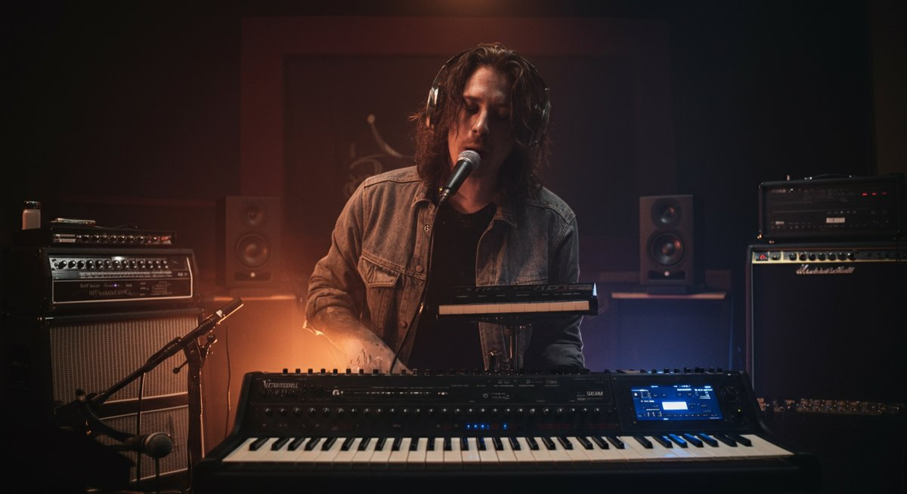

 

# 라이브, 심장을 울리는 전율의 순간: 음악 애호가를 위한 완벽 가이드

음악이 우리 삶의 배경이 아니라, 가슴을 관통하는 주인공이 되는 순간이 있다면, 그건 바로 \*\*라이브\*\* 공연장에서일 겁니다. 저는 다양한 장르를 넘나들며 숨겨진 보석 같은 곡들을 발굴하고, 그 음악이 라이브로 어떻게 피어나는지를 탐구하는 데 제 인생의 상당 부분을 바쳐왔습니다. 록 매거진 평론가로서, 또 현직 세션 뮤지션으로서 수없이 많은 무대에 서고 또 객석에서 공연을 지켜보며 느낀 건데요, _녹음된 음원으로는 절대 느낄 수 없는 그 특별한 감동_이 바로 라이브에 있다는 겁니다. 요즘처럼 손가락 하나로 수천만 곡을 들을 수 있는 시대에, 왜 우리는 여전히 땀과 열정이 뒤섞인 공간에서 함께 환호하고, 또 때로는 함께 울먹이는 걸까요?

개인적으로, 처음 라이브 공연의 매력에 푹 빠졌던 건 십대 시절, 허름한 홍대 클럽에서 무명 밴드의 공연을 보면서였어요. 헤드폰으로 듣던 앨범과는 완전히 다른, 날것 그대로의 에너지가 제 심장을 마구 때리는 느낌이었죠. 그날 이후로 저는 라이브 공연의 '성지'들을 찾아다니는 순례자가 되었고, 이젠 저 스스로 무대 위에서 그 에너지를 관객들과 나누는 사람이 되었네요. 라이브는 단순한 음악 감상을 넘어선, 오감으로 경험하는 하나의 의식(儀式)입니다. 눈앞에서 연주자가 땀을 흘리며 건반을 누르고 기타를 뜯는 모습, 앰프에서 뿜어져 나오는 쩌렁쩌렁한 베이스 사운드가 몸 전체를 휘감고, 주변 사람들과 함께 외치는 떼창 속에서 겪는 짜릿한 일체감… 이 모든 것이 어우러져 우리에게 잊을 수 없는 경험을 선사하죠. 하지만 단순히 '좋다'는 말로는 라이브의 진정한 가치를 다 설명할 수 없습니다.

이 글에서는 라이브 공연이 왜 특별한지, 어떤 기술적 배경이 숨어있는지, 그리고 여러분이 최고의 라이브 경험을 누리기 위해 무엇을 준비하고 즐겨야 하는지에 대해 제 모든 경험과 지식을 아낌없이 풀어놓으려고 합니다. 2025년 현재, 라이브 공연 산업은 팬데믹 이후 더욱 역동적으로 변화하고 있습니다. 스트리밍 서비스의 폭발적인 성장과 더불어, 아티스트들에게 라이브는 팬들과 소통하고 수익을 창출하는 가장 중요한 통로가 되었죠.

실제로 Pollstar에 따르면, 2023년 전 세계 라이브 음악 산업은 약 122억 달러(한화 약 16조 원) 규모로 성장하며 역대 최고치를 기록했습니다. 이는 2019년 대비 약 20% 증가한 수치로, 팬데믹으로 위축되었던 라이브 시장이 얼마나 빠르게 회복하고 있는지 보여주는 명확한 증거입니다. 음악 평론가로서 저는 앨범을 분석할 때 그 곡이 라이브에서 어떻게 구현될지 상상해보곤 합니다. 앨범 녹음 과정에서 보컬 마이크에 수만 원짜리 진공관 프리앰프를 물리고, 컴프레서 세팅을 몇 밀리세컨드 단위로 조절하며 완벽한 소리를 만드느라 녹음실에서 밤을 지새웠던 경험이 있어요.

그렇게 정교하게 다듬어진 소리도 라이브 무대 위에서는 예상치 못한 변수들과 만나 전혀 새로운 옷을 입게 됩니다. 연주자의 컨디션, 공연장의 음향 특성, 관객들의 에너지, 심지어 그날의 날씨까지 라이브의 모든 요소에 영향을 미치죠. 그래서 라이브 공연은 '지금, 여기'에서만 존재하는 유일무이한 예술 작품이라고 감히 말할 수 있습니다. 여러분도 저와 함께 이 특별한 라이브의 세계로 깊이 빠져들 준비가 되셨나요?

### 목차

- [라이브, 왜 우리를 그토록 매료시키는가?](#toc-1)
- [라이브 사운드의 비밀: 무대 위 마법을 만드는 기술](#toc-2)
- [2025년 라이브 트렌드: 증강현실(AR)과 인터랙티브 경험](#toc-3)
- [최고의 라이브 경험을 위한 나만의 비법과 체크리스트](#toc-4)
- [라이브의 미래: 변화와 도전 속에서 피어날 새로운 경험들](#toc-5)

## 라이브, 왜 우리를 그토록 매료시키는가?

우리는 왜 굳이 비싼 티켓을 사고, 붐비는 인파 속에서 몇 시간을 서서, 심지어는 비를 맞으면서까지 \*\*라이브\*\* 공연을 보러 가는 걸까요? 단순히 음악을 듣는 행위를 넘어, 라이브 공연은 우리의 오감을 자극하고 깊은 감정적 공명을 일으키는 특별한 힘을 가지고 있습니다.

저 역시 아무리 즐겨 듣던 곡이라도 라이브로 다시 만나면 마치 처음 듣는 것처럼 새로운 감동과 위로를 받곤 해요. 최근 몇 년간 스트리밍 서비스 이용자가 기하급수적으로 늘어났음에도 불구하고, 대규모 음악 페스티벌이나 단독 콘서트의 티켓이 순식간에 매진되는 현상은 라이브가 주는 본질적인 가치가 변치 않음을 보여줍니다. 실제로 한국문화관광연구원의 '2023년 공연예술 실태조사'에 따르면, 전체 공연 관람객 중 75% 이상이 라이브 공연 관람에 대한 높은 만족도를 보였으며, 재관람 의사도 90%에 육박하는 것으로 나타났습니다. 이는 라이브 경험이 단순한 소비가 아닌, 정서적 유대감과 만족감을 제공하는 중요한 문화 활동으로 자리매김했음을 의미합니다.

녹음된 음원은 연주자의 완벽한 의도와 기술력이 집약된 결정체이지만, 라이브는 그 한계를 뛰어넘어 예측 불가능한 생생함을 선사합니다. 연주자의 작은 실수, 즉흥적인 애드리브, 관객들의 반응에 따라 시시각각 변하는 에너지, 이 모든 것이 라이브만의 독특한 매력이죠. 저는 종종 해외 록 밴드들의 부틀렉(비공식 라이브 녹음)을 찾아 듣곤 하는데, 스튜디오 앨범에서는 들을 수 없는 그들의 거친 에너지나 새로운 편곡에 놀랄 때가 많습니다. 특히, 제가 가장 좋아하는 영국 밴드 'Muse'의 라이브는 단순히 앨범을 재현하는 수준을 넘어섭니다. 프론트맨 매튜 벨라미의 폭발적인 가창력과 기타 연주, 그리고 예측 불가능한 애드리브는 매번 다른 전율을 선사하죠. 마치 정교한 도자기를 보다가, 뜨거운 가마에서 막 꺼낸 거친 철기 조각을 마주하는 기분이랄까요? 이처럼 라이브는 아티스트와 관객이 함께 만들어가는 _유일무이한 예술적 교감의 장_이 되는 겁니다.

* * *

### 심장을 울리는 라이브 사운드의 비밀

라이브 공연의 핵심은 역시 '소리'입니다. 헤드폰으로 들었을 때와는 차원이 다른, 온몸을 감싸는 듯한 웅장함과 생생함은 라이브가 가진 마법 중 하나죠. 저는 세션 뮤지션으로 활동하며 여러 공연장의 음향 시스템을 직접 경험하고 조절해봤는데, 단순히 소리를 크게만 한다고 좋은 라이브 사운드가 나오는 게 아니더군요. 음향 엔지니어들은 공연장 구조, 악기 구성, 심지어는 관객의 수까지 고려하여 수많은 변수를 제어하며 최적의 사운드를 만들어냅니다.

예를 들어, 같은 기타 앰프라도 공연장의 벽 재질이나 천장 높이에 따라 소리가 먹먹해지거나 너무 튀는 경우가 생겨요. 이때 이퀄라이저로 특정 주파수 대역을 조절하거나, 마이킹 위치를 미세하게 변경하여 '라이브용' 최적의 소리를 찾아내는 거죠. 이러한 노력 덕분에 우리는 공연장에서 _드럼의 킥 소리가 가슴을 울리고, 베이스 라인이 몸을 휘감으며, 기타 리프가 귀를 찢을 듯이 선명하게 들리는_ 경험을 할 수 있습니다. 특히, 라이브 사운드에서 가장 중요한 부분 중 하나는 바로 저음역대입니다. 드럼의 킥과 베이스가 만들어내는 묵직한 저음은 단순히 듣는 것을 넘어, 우리의 몸을 진동시키며 원초적인 흥분과 몰입감을 선사하죠.

제가 가장 인상 깊었던 라이브 중 하나는 스코틀랜드 밴드 'Mogwai'의 내한 공연이었어요. 그들의 음악은 원래부터 웅장한 사운드 스케이프를 자랑하지만, 라이브에서는 그 저음이 마치 거대한 파도처럼 객석을 덮쳤습니다. _제 몸 안의 모든 장기들이 함께 진동하는 듯한 기분_이었고, 그 순간 저는 음악 속에 완전히 잠식되는 경험을 했습니다. 녹음된 음원에서 아무리 좋은 [헤드폰 실전 활용: 음질 200% 즐기기! 전문가의 숨겨진 노하우](https://kidult-stage.com/?p=353)를 통해 디테일을 살린다고 해도, 물리적인 공간에서 파동으로 전달되는 저음의 힘은 절대 따라올 수 없어요. 바로 이 점이 라이브 사운드가 우리에게 선사하는 가장 큰 선물 중 하나라고 생각합니다. 그래서 저는 공연장에 갈 때마다, 특히 저음역대가 잘 표현되는 위치를 선호하곤 합니다.

* * *

### 눈앞에서 펼쳐지는 퍼포먼스: 몰입의 기술

음악은 귀로 듣는 것이지만, 라이브 공연은 눈으로 보고, 몸으로 느끼고, 마음으로 공감하는 총체적인 예술 경험입니다. 무대 위에서 아티스트들이 쏟아내는 에너지, 그들의 표정과 몸짓 하나하나가 음악의 메시지를 더욱 강렬하게 전달하죠. 저는 록 평론가로서 수많은 공연을 분석해왔지만, 아무리 훌륭한 리뷰를 써도 그 순간의 에너지를 100% 담아낼 수는 없습니다.

예를 들어, U2의 공연을 보면 보노의 카리스마 넘치는 무대 장악력, 에지의 독창적인 기타 사운드와 함께 거대한 LED 스크린에 펼쳐지는 영상미가 어우러져 단순한 콘서트를 넘어선 하나의 거대한 예술 작품을 만들어냅니다. 그들의 'Zoo TV Tour'나 '360° Tour'는 기술적인 혁신과 예술적인 상상력이 결합되어 라이브 공연의 새로운 지평을 열었다고 평가받죠. 이런 퍼포먼스들은 관객들에게 단순히 음악을 듣는 것을 넘어선 시각적, 감각적 몰입감을 선사합니다. 라이브 공연에서 관객들이 느끼는 몰입감은 아티스트의 퍼포먼스뿐만 아니라, 공연을 둘러싼 모든 요소들에 의해 증폭됩니다. 조명은 음악의 분위기를 시각적으로 구현하고, 무대 연출은 곡의 스토리를 입체적으로 전달합니다.

저는 한번은 런던에서 'Coldplay'의 공연을 봤는데, 그들은 모든 관객에게 LED 팔찌를 나눠줬어요. 특정 곡이 나올 때마다 이 팔찌들이 곡의 분위기에 맞춰 다양한 색깔로 빛나면서, 수만 명의 관객이 마치 하나의 거대한 유기체처럼 움직이는 듯한 장관을 연출했습니다. 그 순간 저는 저 자신이 공연의 일부가 된 것 같은 강렬한 공감과 흥분을 느꼈죠. 이처럼 라이브 공연은 아티스트와 관객이 서로에게 에너지를 주고받으며 '지금 이 순간'을 함께 만들어가는 과정입니다. 여러분도 경험해보신 적 있으신가요? 모두가 하나 되어 같은 리듬을 타고, 같은 멜로디를 따라 부르는 그 순간의 짜릿함은 그 어떤 말로도 표현하기 어렵습니다. 저의 플레이리스트에 담긴 수많은 곡들도 라이브에서 들었을 때 비로소 진정한 의미를 찾곤 합니다.

* * *

## 라이브 사운드의 비밀: 무대 위 마법을 만드는 기술

우리가 공연장에서 경험하는 웅장하고 완벽한 \*\*라이브\*\* 사운드는 단순히 앰프와 스피커를 크게 틀어서 만들어지는 것이 아닙니다. 그 뒤에는 수십 년간 축적된 음향 기술과 엔지니어들의 끊임없는 노력이 숨어있죠. 저는 세션 뮤지션으로서 무대 위에서 인이어 모니터(IEM)를 착용하고 연주하는 경우가 많은데, 이 작은 이어폰 하나가 제 연주와 보컬의 균형을 잡아주는 것은 물론, 관객에게 전달되는 소리의 퀄리티에도 막대한 영향을 미칩니다.

2025년 현재, 라이브 음향 기술은 놀라운 발전을 거듭하며 녹음 스튜디오 못지않은 정교함을 무대 위로 가져왔습니다. 특히 디지털 믹싱 콘솔과 라인 어레이 스피커 시스템, 그리고 정교한 음향 시뮬레이션 소프트웨어의 등장은 라이브 사운드의 수준을 한 단계 끌어올렸죠. 과거 아날로그 장비 시절에는 라이브 사운드 체크에만 몇 시간씩 걸리던 것이, 이제는 몇 번의 클릭과 미세 조정을 통해 훨씬 효율적으로 이루어집니다. 덕분에 우리는 더 많은 시간을 아티스트의 퍼포먼스에 집중할 수 있게 되었어요. 라이브 사운드를 만드는 과정은 마치 요리와 같습니다. 각 악기의 소스를 신선하게 준비하고, 적절한 비율로 섞고, 완벽한 온도로 익혀내는 과정이죠.

이 모든 것을 총괄하는 사람이 바로 \*\*오디오 엔지니어\*\*입니다. 그들은 수십 개의 마이크를 설치하고, 수십 채널의 악기 소스를 믹싱 콘솔로 받아들여, 각 악기의 볼륨과 톤을 조절하고 이펙트를 추가하며 최상의 조화를 만들어냅니다. 공연장의 크기와 형태, 관객의 유무에 따라 소리의 반사나 흡수율이 달라지기 때문에, 엔지니어는 사운드 체크 시간에 다양한 조건에서 소리를 테스트하고 보정하는 과정을 거칩니다.

예를 들어, 야외 페스티벌과 실내 공연장의 음향 세팅은 완전히 다를 수밖에 없어요. 야외에서는 소리가 멀리 퍼져나가기 때문에 더욱 강력한 출력을 필요로 하고, 바람과 같은 외부 변수에도 대비해야 합니다. 반면 실내 공연장은 잔향(reverb)과 같은 공간 특성을 고려해 소리가 뭉치지 않도록 세밀한 조절이 필요하죠. 이런 섬세한 기술적 배경이 있어야 우리가 듣는 라이브 사운드가 비로소 '명품'이 될 수 있습니다.

* * *

### 명품 라이브 사운드, 그 뒤엔 오디오 엔지니어의 땀이

제가 세션 활동을 하면서 가장 존경하는 분들 중 한 분은 바로 라이브 오디오 엔지니어들입니다. 그들은 단순히 장비를 다루는 기술자를 넘어, 음악을 이해하고 무대 위 아티스트의 의도를 소리로 구현해내는 예술가라고 생각해요. 녹음실에서는 원하는 소리가 나올 때까지 수십 번이고 다시 녹음할 수 있지만, 라이브는 단 한 번의 기회뿐입니다. 그 순간 모든 것을 완벽하게 해내야 하죠. 제가 경험했던 한 일화가 있어요.

밴드 '자우림'의 라이브 공연에서 베이스 사운드가 평소보다 유난히 돋보여서 감탄했던 적이 있습니다. 나중에 알고 보니 그날 엔지니어분이 베이스 기타의 특정 주파수 대역을 앨범보다 미세하게 부스트시키고, 컴프레서의 어택 타임을 조절해서 라이브의 활기찬 분위기에 맞춰 더욱 펀치감 있는 소리를 만들어냈다고 하더군요. 이런 디테일 하나하나가 모여 우리에게 잊을 수 없는 라이브 경험을 선사하는 겁니다. 특히 라이브 믹싱에서 중요한 것은 '다이내믹스'를 살리는 것입니다.

스튜디오 녹음에서는 정교한 프로듀싱을 통해 모든 소리를 일정 수준 이상으로 끌어올리지만, 라이브에서는 음악의 흐름에 따라 소리가 커지고 작아지는 강약 조절이 매우 중요합니다. 조용한 발라드 곡에서는 보컬의 미세한 떨림까지 놓치지 않도록 하고, 록 음악에서는 드럼과 기타의 폭발적인 에너지를 그대로 전달해야 하죠.

최근에는 [사무용 노이즈 캔슬링 헤드폰 비교 및 추천: 조용한 업무 환경 조성 궁극의 집중력 솔루션](https://kidult-stage.com/?p=357)에서도 다이내믹 레인지를 강조하는 것처럼, 라이브 공연에서도 음악의 감정선을 살리는 다이내믹한 소리 연출이 핵심입니다. 이를 위해 엔지니어들은 고가의 디지털 믹싱 콘솔(예: Avid VENUE, Yamaha CL 시리즈)과 최첨단 스피커 시스템(예: L-Acoustics K2, d&b audiotechnik J-series)을 사용합니다. 이런 장비들은 수만 명 규모의 대형 공연장에서도 좌석 위치에 따른 음질 편차를 최소화하고, 모든 관객에게 균일하고 선명한 사운드를 전달할 수 있도록 설계되어 있습니다. 이처럼 엔지니어들의 숙련된 기술과 최첨단 장비의 조화가 우리가 경험하는 라이브의 마법을 만들어내는 진짜 비밀인 셈이죠.

* * *

## 2025년 라이브 트렌드: 증강현실(AR)과 인터랙티브 경험

기술의 발전은 \*\*라이브\*\* 공연의 정의와 경험 자체를 끊임없이 확장시키고 있습니다. 2025년 현재, 단순한 음향과 조명을 넘어 증강현실(AR), 가상현실(VR), 그리고 인공지능(AI) 기술이 라이브 무대에 적극적으로 도입되면서 관객들에게 차원이 다른 몰입감을 선사하고 있죠. 과거에는 상상하기 힘들었던 시각적 효과와 인터랙티브 경험이 이제는 라이브 공연의 필수 요소로 자리 잡아가고 있습니다.

저는 개인적으로 록 밴드 'Muse'의 2019년 'Simulation Theory Tour'를 보면서 AR 기술의 잠재력을 실감했습니다. 그들은 무대 위에서 거대한 로봇이나 외계 생명체가 등장하는 듯한 AR 효과를 연출했는데, _마치 영화 속에 들어와 있는 듯한 착각_을 불러일으켰어요. 이런 시도들은 라이브 공연이 단순히 '보는 것'을 넘어, '경험하는 것'으로 진화하고 있음을 명확하게 보여줍니다. 이와 더불어, 팬데믹 이후 온라인 라이브 스트리밍이 보편화되면서, 오프라인 공연의 현장감과 온라인의 접근성을 결합한 하이브리드형 라이브 모델도 점차 확산되고 있습니다.

이러한 기술적 진보는 아티스트들에게도 새로운 창작의 기회를 제공합니다. 제가 평론가로서 최근 주목하는 아티스트 중 한 명은 바로 미국의 일렉트로닉 팝 듀오 'Purity Ring'입니다. 그들의 라이브 공연은 음악뿐만 아니라 독특한 비주얼 아트와 조명 기술이 결합되어 환상적인 분위기를 연출합니다. 특히, 보컬 메건 제임스의 커스텀 의상에 반응하는 조명 시스템은 마치 그녀의 움직임에 따라 무대가 살아 숨 쉬는 듯한 인상을 줍니다. 이런 기술적인 요소들은 음악의 감성을 더욱 깊이 있게 전달하고, 관객들에게 잊을 수 없는 시각적 경험을 선사하는 데 결정적인 역할을 합니다. 저처럼 현직 세션 뮤지션들도 이런 기술들을 어떻게 무대 위에서 활용할지 고민하며, 음악적 표현의 폭을 넓히기 위해 노력하고 있습니다. 이제 라이브는 더 이상 소리의 영역에만 머무르지 않고, _시각, 촉각, 심지어는 후각까지 자극하는 총체적인 예술_로 진화하고 있는 것이죠.

* * *

### 가상과 현실을 넘나드는 라이브 경험

증강현실(AR)과 가상현실(VR) 기술은 라이브 공연을 더욱 풍성하게 만들고 있습니다. 2025년 현재, 일부 선도적인 공연에서는 스마트폰 앱을 통해 무대 위의 특정 오브젝트를 비추면 가상의 캐릭터가 나타나거나, 숨겨진 영상이 재생되는 인터랙티브 경험을 제공합니다. 이는 관객 개개인이 능동적으로 공연에 참여하고, 자신만의 방식으로 새로운 요소를 발견할 수 있도록 돕습니다. 한편, VR 기술은 멀리 떨어진 팬들도 마치 현장에 있는 것처럼 생생하게 라이브를 즐길 수 있도록 합니다.

실제로 SM엔터테인먼트의 'Beyond LIVE'와 같은 플랫폼은 고화질 AR 기술과 실시간 인터랙션을 결합하여 온라인 콘서트의 새로운 표준을 제시했죠. 관객들은 실시간 채팅으로 아티스트와 소통하고, 아티스트는 관객들의 응원봉 색깔을 바꾸는 등 쌍방향 소통이 가능해지면서 온라인 라이브의 한계를 뛰어넘었습니다. 이러한 기술적 진보는 라이브 공연의 접근성을 혁신적으로 높였습니다. 물리적으로 공연장을 방문하기 어려운 팬들이나 해외 팬들도 고품질의 라이브를 경험할 수 있게 된 것이죠.

저는 가끔 온라인으로 해외 밴드의 라이브 스트리밍을 볼 때가 있는데, 고가의 VR 헤드셋을 착용하면 마치 스탠딩 존의 한복판에 서 있는 듯한 착각이 들 정도로 생생한 경험을 할 수 있습니다. 물론 실제 공연장의 땀내와 함성, 옆 사람의 어깨가 부딪히는 물리적인 감각까지는 구현하기 어렵지만, 시각과 청각만큼은 놀라운 수준으로 재현해냅니다. 또한, AI 기술은 관객의 감정 상태를 분석하여 실시간으로 조명이나 영상 연출을 변화시키는 시도까지 이루어지고 있습니다. 예를 들어, 관객의 함성 소리나 박수 소리 데시벨에 따라 무대 조명이 더 화려하게 바뀌는 식이죠. 이런 기술들은 라이브를 더욱 개인화되고 예측 불가능하며 흥미로운 경험으로 만들고 있습니다.

* * *

### 인터랙티브 라이브: 관객이 곧 아티스트

미래의 라이브 공연은 관객이 단순한 수동적인 관람객을 넘어, 능동적인 참여자이자 심지어는 공연의 일부를 만들어가는 공동 창작자가 될 가능성을 품고 있습니다. 이미 일부 실험적인 공연에서는 스마트폰 앱을 통해 관객들이 곡의 순서를 투표하거나, 무대 배경 영상을 직접 선택할 수 있도록 하고 있습니다. 저는 이런 시도들이 너무나 흥미롭다고 생각하는데요, 저만의 플레이리스트를 만들어 공연에 반영한다면 얼마나 짜릿할까요!

실제로 네덜란드의 DJ 'Armin van Buuren'은 자신의 라이브 세트에서 관객들의 실시간 투표를 받아 다음 곡을 선정하는 이벤트를 진행하기도 했습니다. 이러한 인터랙티브 요소는 관객들에게 공연에 대한 더욱 깊은 소속감과 주인의식을 부여하고, 매번 예측 불가능한 새로운 경험을 선사합니다. 뿐만 아니라, 웨어러블 기기나 생체 데이터를 활용한 인터랙션도 발전하고 있습니다. 예를 들어, 관객의 심박수나 뇌파 데이터를 분석하여 실시간으로 무대 조명이나 음악의 특정 요소를 변화시키는 기술이 개발 중입니다.

상상해보세요, 여러분의 심장이 가장 격렬하게 뛰는 순간, 무대 전체가 붉은색으로 물들고 드럼 비트가 더욱 강력해진다면! 이 모든 것이 라이브 공연을 더욱 개인적이고 감각적인 경험으로 만들어 줄 것입니다. 물론 아직은 초기 단계의 기술이지만, 언젠가 공연장에 입장할 때마다 새로운 신체 데이터를 활용한 맞춤형 라이브 경험을 제공받는 날이 올지도 모릅니다. 이처럼 기술은 라이브 공연이 단순한 '무대 위의 쇼'를 넘어, _관객 개개인의 경험과 감정을 반영하는 살아있는 예술_로 진화할 수 있도록 돕고 있습니다. 라이브의 미래가 더욱 기대되는 이유죠.

* * *

## 최고의 라이브 경험을 위한 나만의 비법과 체크리스트

수많은 \*\*라이브\*\* 공연을 직접 보고, 또 무대 위에서 경험하면서 저는 최고의 라이브 경험을 위한 몇 가지 비법을 터득했습니다. 단순히 공연장에 가는 것을 넘어, 철저한 준비와 마음가짐이 뒷받침될 때 비로소 라이브의 진정한 매력을 온전히 느낄 수 있더군요. 가장 중요한 것은 바로 '오픈 마인드'입니다. 제가 좋아하는 밴드가 아니더라도, 새로운 장르나 아티스트의 라이브를 접해보는 것만으로도 예상치 못한 감동과 위로를 받을 수 있습니다. 저는 홍대 인디 클럽에서 우연히 'ADOY'라는 밴드의 공연을 봤는데, 그들의 몽환적인 신스팝 사운드가 라이브에서 폭발적인 에너지로 변하는 것을 보고 완전히 매료되었어요. 그날 이후로 저는 그들의 음악에 푹 빠졌고, 제 플레이리스트에 항상 상위권을 차지하고 있습니다. 이런 우연한 발견이 바로 라이브가 주는 큰 즐거움 중 하나죠. 또한, 공연 전에 아티스트의 음악을 충분히 듣고 가는 것이 좋습니다. 특히 가사를 미리 숙지하고 간다면, 공연 중 떼창이나 아티스트의 메시지에 더욱 깊이 공감할 수 있습니다.

저는 해외 록 밴드 공연을 갈 때는 가사집을 몇 번이고 읽어보고 가요. _낯선 언어의 노래라도 가사를 알고 들으면 감동이 두 배_가 되거든요. 그리고 공연 당일에는 몸 컨디션을 최상으로 만드는 것이 중요합니다. 충분한 수면을 취하고, 가벼운 식사를 하고 가는 것이 좋죠. 스탠딩 공연은 체력 소모가 크기 때문에 중간에 지쳐서 음악에 집중하지 못하는 불상사를 막을 수 있습니다. 제 경험상, 공연 30분 전에는 가볍게 몸을 풀어주고, 물을 충분히 마시는 것이 도움이 되더군요. 사소한 준비 같지만, 이런 디테일들이 모여 여러분의 라이브 경험을 훨씬 더 풍성하게 만들어 줄 겁니다.

* * *

### 놓쳐선 안 될 라이브 명소와 숨은 보석 찾기

최고의 라이브를 경험하기 위해서는 좋은 공연장을 선택하는 것도 매우 중요합니다. 대형 공연장에서의 웅장함도 좋지만, 저는 개인적으로 작은 라이브 클럽에서 느껴지는 친밀한 에너지를 더 좋아합니다. 홍대 '롤링홀'이나 '상상마당 라이브홀' 같은 곳들은 음향 시설이 훌륭하고, 아티스트와 관객 간의 거리가 가까워 더욱 생생한 교감을 나눌 수 있죠.

특히, 저는 재즈나 블루스 같은 장르를 좋아해서 청담동 '원스인어블루문'이나 이태원 '올댓재즈' 같은 곳을 자주 찾습니다. 이곳에서는 테이블에 앉아 와인 한 잔과 함께 라이브 연주를 들으며 _일상의 스트레스를 잊고 온전히 음악에 몰입_할 수 있습니다. 이런 곳들이 바로 제가 발굴하는 '숨은 명소'들입니다. 숨은 보석 같은 아티스트를 찾는 방법도 알려드릴게요. 저처럼 음악 평론가라면 앨범을 먼저 접하겠지만, 일반 팬들에게는 지역 음악 페스티벌이나 인디 클럽의 '오픈 마이크' 공연을 적극 추천합니다. 이곳에서는 아직 대중에게 잘 알려지지 않은 신인 아티스트들의 날것 그대로의 열정을 만날 수 있습니다. 저도 종종 이런 곳에서 _'이 밴드 언젠가 대박 나겠는데?'_ 싶은 팀들을 발견하곤 합니다.

그리고 요즘은 유튜브나 인디 음악 플랫폼에서 '라이브 클립'을 자주 찾아보는 것도 좋은 방법입니다. 앨범과는 또 다른 매력을 가진 라이브 버전을 미리 접하고, 마음에 드는 아티스트가 있다면 바로 다음 공연 정보를 찾아보는 거죠. 저만의 팁이 있다면, 밴드들의 SNS를 팔로우해서 '깜짝 공연'이나 '게릴라 라이브' 소식을 놓치지 않는 겁니다. 이런 공연들은 소규모로 진행되어 더욱 특별한 경험을 선사합니다.

* * *

### 공연 관람 전후, 잊지 말아야 할 준비물과 에티켓

완벽한 라이브 경험을 위해서는 몇 가지 준비물과 에티켓을 숙지하는 것이 중요합니다. 제가 여러 공연을 다니면서 깨달은, 여러분의 라이브 만족도를 200% 끌어올릴 실질적인 팁들을 공유해드릴게요. \*\*라이브 공연 필수 준비물 체크리스트:\*\*

1. **편안한 신발:** 스탠딩 공연은 몇 시간 동안 서 있어야 하므로, 굽이 낮고 편안한 신발은 필수입니다. _발이 편해야 온전히 음악에 집중할 수 있어요!_
2. **휴대용 보조배터리:** 사진, 영상 촬영은 물론 공연 후 길 찾기나 연락에 대비해 스마트폰 배터리 관리가 중요합니다.
3. **작은 가방/힙색:** 귀중품과 필수품만 간편하게 보관할 수 있는 가방이 좋습니다. 큰 백팩은 다른 관객에게 불편을 줄 수 있어요.
4. **생수 또는 음료:** 공연 중 목마름은 집중력을 흐트러뜨릴 수 있습니다. (단, 공연장 규정 확인 필수)
5. **귀마개(선택 사항):** 너무 큰 사운드가 불편하거나, 오랜 시간 공연을 즐겨야 할 경우 고품질 귀마개는 청력 보호에 도움이 됩니다. 제가 쓰는 건 음질 왜곡 없이 볼륨만 줄여주는 뮤지션용 귀마개예요.
6. **신분증 및 티켓:** 입장 시 필수입니다. 미리 꺼내두면 시간을 절약할 수 있어요.

\*\*라이브 공연 에티켓:\*\*

- **휴대폰 매너:** 과도한 영상 촬영이나 플래시 사용은 다른 관객의 시야를 방해하고, 아티스트에게도 방해가 될 수 있습니다. _짧게 기록하고, 눈과 귀로 온전히 즐기는 것이 중요해요._
- **떼창과 응원:** 곡의 분위기에 맞춰 적절한 시점에 참여하는 것이 좋습니다. 옆 사람에게 방해가 되지 않도록 주의해주세요.
- **자리 양보:** 특히 스탠딩 공연에서는 서로 밀치거나 싸우는 일 없이, 조금 더 배려하는 마음이 필요합니다. 다 함께 즐기는 자리잖아요.
- **쓰레기 처리:** 공연장은 모두가 사용하는 공간입니다. 개인 쓰레기는 반드시 지정된 장소에 버리거나 가져가주세요.

이런 작은 배려와 준비가 여러분의 라이브 경험을 훨씬 더 즐겁게 만들어 줄 겁니다. 한번은 제가 해외 페스티벌에서 너무 신발을 잘못 신어서 공연 내내 발이 아파 음악에 제대로 집중하지 못했던 아픈 기억이 있어요. 그때 이후로는 무조건 편한 신발만 고집하게 되었죠. 사소한 불편함이 최고의 순간을 망칠 수도 있습니다.

* * *

## 라이브의 미래: 변화와 도전 속에서 피어날 새로운 경험들

\*\*라이브\*\* 공연은 끊임없이 진화하고 있습니다. 팬데믹이라는 전례 없는 위기를 겪으면서도, 아티스트와 팬들은 새로운 방식으로 연결될 길을 찾아냈고, 이는 라이브 산업에 더욱 큰 혁신을 가져왔습니다. 2025년 현재, 우리는 단순한 공연 관람을 넘어 가상 현실, 증강 현실, 인공지능 등 최첨단 기술이 융합된 복합적인 경험을 기대할 수 있게 되었습니다. 저는 록 평론가로서 수많은 아티스트들이 이 변화에 어떻게 적응하고 새로운 창작물을 내놓을지 기대하고 있습니다.

예를 들어, 인디 밴드들이 VR 기술을 활용하여 자신들만의 독특한 세계관을 구현한 '가상 라이브 클럽'을 만들고, 전 세계 팬들이 아바타로 접속해 함께 공연을 즐기는 시대가 머지않았다고 봅니다. 이는 물리적 제약을 넘어 더욱 다양하고 실험적인 라이브 경험을 가능하게 할 것입니다. 하지만 기술적인 발전만큼이나 중요한 것은 라이브 공연이 지닌 본질적인 가치를 잃지 않는 것입니다. 아무리 기술이 발전해도, 무대 위에서 아티스트가 땀 흘리며 연주하고, 그 에너지를 관객들이 온몸으로 받아들이며 함께 공감하는 순간의 마법은 변치 않을 겁니다.

저는 현직 세션 뮤지션으로서, 언젠가 제가 직접 개발에 참여한 AR 기술이 적용된 무대에서 연주하고 싶은 꿈이 있습니다. 물론, 그 기술이 음악의 감동을 해치지 않고, 오히려 더욱 증폭시키는 방향으로 사용되어야 하겠죠. 라이브의 미래는 결국 _기술과 인간적인 감정, 그리고 예술적인 상상력의 조화_ 속에서 피어날 것이라고 믿습니다. 이처럼 라이브 공연은 단순히 음악을 듣는 행위를 넘어, 우리 삶에 깊은 위로와 활력을 불어넣는 소중한 문화유산으로 계속 발전해나갈 것입니다.

* * *

라이브 공연은 그 어떤 미디어로도 대체할 수 없는 특별한 감동과 위로를 우리에게 선사합니다. 제가 아무리 좋아하는 곡이라도 헤드폰으로 수백 번 듣는 것보다, 단 한 번의 라이브 경험이 더 깊은 울림을 주곤 하죠. 무대 위 아티스트의 열정, 온몸을 휘감는 웅장한 사운드, 그리고 옆 사람과 함께 어깨를 들썩이며 하나 되는 그 순간의 짜릿함은 잊을 수 없는 추억이 됩니다. 2025년 현재, 기술의 발전은 라이브 공연을 더욱 풍성하고 다채롭게 만들고 있지만, 그 본질적인 매력은 변치 않을 것이라고 저는 확신합니다. 저처럼 라이브 공연을 사랑하는 여러분도 이 글에서 얻은 팁과 정보들을 활용하여 다음 공연에서는 더욱 깊이 있는 몰입과 전율을 경험하시길 바랍니다.

숨겨진 명소를 찾아 나서고, 새로운 아티스트의 열정에 귀 기울여 보세요. 불편한 신발 때문에 음악에 집중하지 못했던 제 실패담처럼, 사소한 부분에서 오는 아쉬움을 미리 방지하고, 공연의 모든 순간을 만끽하시길 바랍니다. 여러분의 마음을 사로잡았던 최고의 라이브 경험은 무엇이었나요? 댓글로 함께 나눠주시면 저에게도 큰 영감이 될 것 같습니다. 저는 앞으로도 무대 위에서, 또 객석에서 여러분과 함께 이 '살아있는 음악'의 감동을 계속해서 만끽할 겁니다. 그러니, 주저하지 말고 가장 가까운 라이브 공연장으로 달려가세요. 여러분의 심장을 다시 뛰게 할 _진정한 라이브의 마법_이 기다리고 있을 테니까요!
