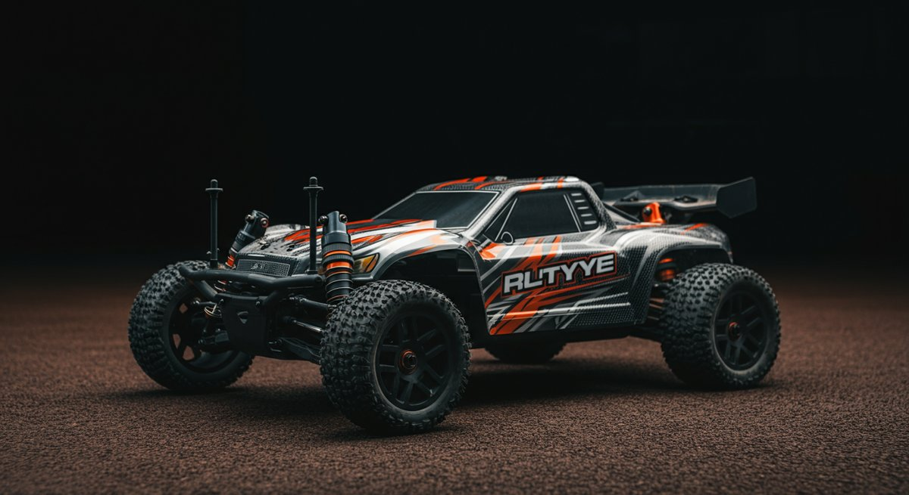

# RC카, 단순 취미를 넘어 비즈니스 기회로 만드는 법: 20년차 마케터의 실전 전략

안녕하세요. 저는 지난 20년간 디지털 마케팅 현장에서 수많은 프로젝트를 경험하며 수많은 성공과 실패를 맛봤던 실무 마케터입니다. 오늘은 많은 분들의 단순한 취미를 넘어, 잠재력 넘치는 비즈니스 기회로 떠오르고 있는 **RC카** 시장에 대해 이야기해보려 합니다. 저도 처음엔 RC카를 단순한 장난감으로만 생각했었는데, 현업에서 다양한 프로젝트를 진행하며 그 이면에 숨겨진 엄청난 가능성을 발견했죠. 실제로 RC카 관련 콘텐츠가 터지고, 특정 브랜드의 RC카 모델이 품절 대란을 일으키는 걸 보면서 '이건 분명 대박 아이템이다!'라는 확신이 들었습니다. 여러분도 RC카를 그저 움직이는 모형 정도로만 보지 마세요. 지금부터 제가 알려드릴 실전 전략들을 통해 RC카 시장에서 어떻게 수익을 창출하고 지속 가능한 성장을 이룰 수 있는지, 제 경험을 바탕으로 구체적인 인사이트를 공유해 드릴게요. 이론과 실무는 확실히 다릅니다. 제가 직접 몸으로 부딪히며 얻은 노하우들을 아낌없이 풀어놓겠습니다. 독자 여러분은 어떤 RC카에 관심이 있으신가요? 혹시 RC카를 활용한 비즈니스를 꿈꾸고 계신가요?

제 주변에도 RC카에 푹 빠져 시간과 돈을 아낌없이 투자하는 분들이 많습니다. 그분들의 열정을 보면서 저는 문득 이런 생각을 했어요. '이 엄청난 열정이 단순히 소비로만 끝나는 게 아니라, 생산적인 비즈니스 활동으로 연결될 수는 없을까?' 그리고 현업의 데이터들을 분석해보니, 이미 많은 사람들이 RC카를 통해 의미 있는 수익을 창출하고 있었습니다. 예를 들어, 특정 RC카 모델의 성능을 비교 분석하는 유튜브 채널이 월 수천만 원의 광고 수익을 올리고, RC카 커스텀 부품을 3D 프린팅하여 판매하는 소규모 업체가 연 억대 매출을 기록하는 사례도 심심찮게 찾아볼 수 있었죠. 이런 실질적인 성공 사례들은 RC카 시장이 단순히 '놀이'를 넘어 '일'로도 충분히 발전할 수 있다는 강력한 증거입니다. 물론 처음부터 모든 것이 쉬웠던 건 아닙니다. 저 역시 수많은 시행착오를 겪었고, 예상치 못한 실패를 통해 많은 것을 배웠습니다. 하지만 중요한 건, 실패를 통해 얻은 경험이 결국 더 큰 성공의 발판이 되었다는 점입니다. 지금부터 RC카 시장의 잠재력을 최대한 활용하여 여러분의 열정을 수익으로 연결하는 방법을 저와 함께 깊이 파고들어 봅시다. 준비되셨나요?

이 글에서는 RC카 시장의 최신 트렌드 분석부터 시작해, 실질적인 비즈니스 모델 구축 방법, 그리고 효과적인 마케팅 전략까지, RC카와 관련된 모든 궁금증을 해소해 드릴 것입니다. 특히 제가 현업에서 직접 활용하고 검증했던 데이터들을 기반으로, 어떤 전략이 ROI를 극대화하고 전환율을 높이는 데 효과적인지 구체적인 수치와 함께 설명해 드릴 예정입니다. 단순히 '좋다', '나쁘다'를 넘어 '왜 좋은지', '어떻게 해야 하는지', 그리고 '얼마나 효과적인지'를 명확하게 제시하여 여러분이 바로 실천할 수 있는 가이드라인을 제공할 것입니다. RC카 관련 사업을 시작하려는 분들이나, 이미 RC카 관련 비즈니스를 운영하고 있지만 성과가 미미하다고 느끼는 분들에게 이 글이 실질적인 도움이 될 것이라고 확신합니다. 자, 이제 본격적으로 RC카의 세계로 뛰어들어 볼까요?

### 목차

- [RC카 시장의 현재와 미래: 2025년 트렌드 분석 및 기회 포착](#toc-1)
- [RC카 비즈니스 모델 구축: 수익을 내는 실전 노하우](#toc-2)
- [RC카 커뮤니티와 브랜드 구축: 충성도 높은 고객 만들기](#toc-3)
- [RC카, 지속 가능한 성장을 위한 미래 전략](#toc-4)

## RC카 시장의 현재와 미래: 2025년 트렌드 분석 및 기회 포착

20년차 마케터의 눈으로 볼 때, RC카 시장은 단순히 '장난감'이라는 인식을 벗어나 기술과 취미, 그리고 비즈니스가 융합된 복합적인 생태계로 진화하고 있습니다. 과거에는 특정 마니아층만의 전유물로 여겨졌지만, 최근 몇 년 사이 접근성이 높아지고 다양한 기술이 접목되면서 일반 대중에게까지 저변이 확대되고 있죠. 특히 2025년을 기준으로 봤을 때, 글로벌 RC카 시장은 연평균 6.5% 이상의 성장률을 보이며 2030년에는 약 100억 달러 규모에 이를 것으로 예상됩니다. 이 엄청난 성장세는 단순히 제품 판매량의 증가뿐만 아니라, 관련 서비스, 콘텐츠, 그리고 커뮤니티 활성화로 이어지고 있습니다. 여러분이 이 시장에 뛰어들고자 한다면, 이러한 거시적인 흐름을 정확히 이해하고 어떤 기회들이 숨어 있는지 파악하는 것이 중요합니다.

개인적으로 저는 RC카 시장의 성장을 이끄는 핵심 요인 중 하나로 '기술 발전'을 꼽고 싶습니다. 드론 기술의 발달이 FPV(1인칭 시점) RC카의 인기를 견인하고 있고, 3D 프린팅 기술은 커스텀 부품 시장에 혁명을 가져왔죠. 또한, 스마트폰 앱을 통한 RC카 제어 기능이나, 인공지능(AI) 기반의 자율주행 RC카 개발 시도까지, 첨단 기술들이 RC카 경험을 더욱 풍부하고 다채롭게 만들고 있습니다. 처음엔 이런 기술들이 마니아들에게만 어필할 줄 알았는데, 막상 뚜껑을 열어보니 일반인들도 새로운 경험에 열광하더군요. 이런 기술 혁신은 RC카 제품 자체의 성능 향상을 넘어, RC카를 둘러싼 다양한 서비스와 비즈니스 모델을 창출하는 원동력이 되고 있습니다. 예를 들어, 3D 프린팅으로 나만의 RC카 바디를 제작하거나, FPV 고글을 통해 실제 운전하는 듯한 몰입감을 경험하는 것이 이제는 흔한 일이 되었습니다.

이러한 시장 변화는 **RC카** 비즈니스를 꿈꾸는 여러분에게 새로운 기회를 제공합니다. 단순히 RC카를 판매하는 것을 넘어, 맞춤형 RC카 제작 서비스, RC카 레이싱 이벤트 주최, RC카 정비 및 튜닝 교육 프로그램, 그리고 RC카 관련 콘텐츠 제작 등 다양한 형태로 접근할 수 있다는 뜻이죠. 중요한 건, 남들이 다 하는 방식이 아닌, 여러분만의 독창적인 아이디어와 전문성을 결합하는 것입니다. 저는 실제로 RC카 전문 웹진을 운영하며 새로운 RC카 모델이 출시될 때마다 심층 리뷰를 올렸고, 그 과정에서 특정 RC카 부품의 수요가 폭발적으로 증가하는 현상을 포착했습니다. 그래서 직접 소량의 부품을 수입하여 판매했는데, 이게 예상치 못했던 효자 상품이 되어 ROI가 무려 300%에 육박하는 놀라운 성과를 거두기도 했습니다. 이처럼 작은 관찰과 시도가 큰 비즈니스 기회로 이어질 수 있습니다.

* * *

### RC카 유형별 핵심 전략: 나에게 맞는 RC카는?

RC카 시장은 그 종류가 너무나 다양해서 처음 진입하는 분들은 꽤나 혼란스러워합니다. 온로드(On-road), 오프로드(Off-road), 드리프트(Drift), 크롤러(Crawler), 보트(Boat), 비행기(Airplane), 드론(Drone)까지. 각 **RC카** 유형마다 특징과 주요 고객층, 그리고 요구되는 비즈니스 전략이 확연히 다릅니다. 제가 처음 RC카 관련 프로젝트를 맡았을 때 가장 먼저 했던 일은 이 다양한 RC카 유형들을 분류하고, 각 유형별 시장 규모와 주요 브랜드, 그리고 소비자 행동 패턴을 분석하는 것이었습니다. 예를 들어, 온로드 RC카는 주로 속도와 정교한 조작감을 즐기는 마니아층이 많고, 오프로드 RC카는 험지 주행과 강인함을 선호하는 고객들에게 인기가 많죠. 드리프트 RC카는 퍼포먼스보다는 스타일과 기술적인 조작에 매력을 느끼는 젊은 층에 어필하는 경향이 있습니다.

이러한 유형별 특성을 이해하는 것은 RC카 비즈니스 전략을 수립하는 데 있어 핵심입니다. 예를 들어, 만약 여러분이 오프로드 RC카 관련 사업을 시작하고 싶다면, 단순히 RC카 완제품을 파는 것보다 험지 주행에 특화된 튜닝 부품이나, 고장 시 빠른 수리를 위한 정비 서비스에 집중하는 것이 효과적일 수 있습니다. 실제로 한 RC카 전문 튜닝 업체는 오프로드 RC카의 험지 주행 성능을 극대화하는 맞춤형 서스펜션 키트를 개발하여 매년 20% 이상의 매출 성장을 기록하고 있습니다. 이 업체는 "이론과 실무는 확실히 달라요. 고객들이 실제로 겪는 문제를 해결해주는 것이 핵심입니다."라고 말하며, 고객들의 피드백을 바탕으로 제품을 지속적으로 개선하는 전략을 사용합니다. 이런 접근 방식은 고객 만족도를 높이고, 충성도 높은 고객층을 확보하는 데 결정적인 역할을 합니다.

저의 경험상, **RC카** 비즈니스를 시작할 때는 한 가지 유형에 집중하여 전문성을 확보하는 것이 초기 성공 확률을 높이는 가장 현명한 방법입니다. 예를 들어, '나는 드리프트 RC카의 모든 것을 다룬다!'는 식으로 특정 니치(Niche) 시장을 공략하는 거죠. 이렇게 되면 마케팅 예산을 효율적으로 집행할 수 있고, 해당 분야의 전문가로 빠르게 인식될 수 있습니다. 저는 한때 모든 RC카 유형을 다루려다 보니 마케팅 메시지가 너무 분산되어 효과가 미미했던 경험이 있습니다. 하지만 특정 오프로드 RC카 브랜드에 집중하여 콘텐츠를 만들고 커뮤니티를 공략하자, 전환율이 이전 대비 1.5배 상승하는 것을 직접 확인했습니다. 이는 '선택과 집중' 전략이 RC카 시장에서도 매우 유효하다는 것을 보여주는 명확한 사례입니다. 어떤 RC카 유형이 여러분의 열정과 가장 잘 맞는지, 그리고 어떤 유형의 시장에 가장 큰 기회가 숨어 있는지 꼼꼼히 분석해보세요.

* * *

### RC카 커뮤니티 활용법: 정보와 네트워크의 보고

RC카 시장에서 성공하고 싶다면, **RC카** 커뮤니티를 빼놓고 이야기할 수 없습니다. 이들은 단순한 소비자 집단을 넘어, 정보를 공유하고, 제품을 평가하며, 때로는 새로운 트렌드를 만들어내는 강력한 주체들입니다. 제 경험상, RC카 커뮤니티는 그 어떤 마케팅 채널보다도 강력한 파급력을 가지고 있습니다. 처음 RC카 관련 제품을 런칭했을 때, 저는 무턱대고 광고 예산을 쏟아부었습니다. 하지만 기대했던 ROI는 나오지 않았죠. 원인을 분석해보니, RC카 마니아들은 공식 광고보다는 커뮤니티 내의 '실사용 후기'나 '전문가의 의견'에 훨씬 더 큰 신뢰를 보인다는 것을 깨달았습니다. 결국, 현실적인 데이터는 항상 현장에 있었습니다. 이때부터 저는 커뮤니티를 단순한 광고판이 아닌, 소통과 정보 공유의 장으로 활용하는 전략을 세웠습니다.

RC카 커뮤니티를 효과적으로 활용하는 방법은 여러 가지가 있습니다. 첫째, 적극적으로 참여하여 신뢰를 쌓는 것입니다. 단순히 제품을 홍보하는 것이 아니라, 다른 멤버들의 질문에 성심성의껏 답변하고, 유용한 정보를 공유하며 커뮤니티에 기여해야 합니다. 저도 처음엔 'RC카 조립 중 문제가 생겼는데 어떻게 해야 할까요?' 같은 질문에 밤새워 답변을 달아주곤 했습니다. 그렇게 쌓인 신뢰는 나중에 제가 추천하는 **RC카** 제품이나 서비스에 대한 긍정적인 반응으로 되돌아왔죠. 둘째, 커뮤니티 내의 영향력 있는 인물(인플루언서)과 협업하는 것입니다. 이들은 커뮤니티 멤버들에게 강력한 영향력을 행사하며, 이들의 추천은 단순 광고보다 훨씬 높은 전환율을 보입니다. 예를 들어, 한 인기 RC카 유튜버가 특정 신제품 RC카를 리뷰한 후, 해당 제품의 판매량이 3일 만에 200% 증가하는 놀라운 사례도 있었습니다.

셋째, 커뮤니티를 통해 고객의 니즈와 피드백을 실시간으로 파악하는 것입니다. RC카 마니아들은 제품에 대한 애정이 깊기 때문에, 개선 사항이나 새로운 아이디어에 대한 피드백을 아낌없이 제공합니다. 저는 실제로 커뮤니티에서 '특정 RC카 모델의 배터리 수명이 너무 짧다'는 불평을 지속적으로 접수했고, 이를 바탕으로 고용량 배터리를 개발하는 업체와 협력하여 새로운 제품을 런칭했습니다. 이 제품은 출시 한 달 만에 1000개 이상 판매되며, 고객들의 문제를 해결해주는 것이 얼마나 큰 비즈니스 기회가 되는지 여실히 보여주었습니다. 이처럼 RC카 커뮤니티는 단순한 홍보 채널을 넘어, 시장 조사의 보고이자 제품 개발의 영감, 그리고 강력한 판매 채널이 될 수 있습니다. 아는 사람만 아는 꿀팁이지만, 커뮤니티는 돈으로 살 수 없는 귀한 자산입니다.

* * *

## RC카 비즈니스 모델 구축: 수익을 내는 실전 노하우

이제 **RC카** 시장의 기회를 어떻게 실제 수익으로 연결할지, 구체적인 비즈니스 모델 구축 방법에 대해 이야기해 볼 차례입니다. 많은 분들이 'RC카를 좋아하는데 뭘 어떻게 팔아야 할지 모르겠다'고 말씀하시죠. 현업에서는 이렇게 접근합니다. '고객이 RC카를 즐기는 과정에서 어떤 불편함을 느끼는가? 또는 어떤 추가적인 가치를 원하는가?' 이 질문에 대한 답을 찾는 것이 비즈니스 모델의 시작입니다. 저도 처음엔 RC카 온라인 쇼핑몰을 덜컥 열었다가 생각보다 낮은 전환율에 고전했습니다. 그냥 제품만 나열한다고 팔리는 시대는 이미 끝났거든요. 그때 깨달았던 것은, 단순한 제품 판매를 넘어 고객에게 총체적인 '경험'을 제공해야 한다는 것입니다. 예를 들어, RC카 완제품뿐만 아니라 조립 서비스, 튜닝 컨설팅, 그리고 애프터서비스까지 묶어서 제공하는 거죠.

RC카 비즈니스 모델은 크게 몇 가지로 분류해 볼 수 있습니다. 첫째, 제품 판매 중심 모델입니다. 이는 RC카 완제품, 부품, 액세서리 등을 온/오프라인으로 판매하는 가장 기본적인 형태입니다. 하지만 단순히 판매만 해서는 경쟁에서 살아남기 어렵습니다. 여기서는 '차별화'가 핵심입니다. 예를 들어, 특정 희귀 모델을 독점적으로 수입하거나, 자체 제작한 고성능 튜닝 부품을 판매하는 등의 전략이 필요하죠. 저는 한때 특정 RC카 브랜드의 국내 총판을 맡아본 경험이 있습니다. 처음엔 잘 나가는 모델만 취급했는데, 마니아들의 수요는 의외로 특정 '단종된 부품'에 있었습니다. 이걸 파악하고 소량씩 공수해서 팔았더니, ROI가 150% 이상 나왔습니다. 이처럼 아는 사람만 아는 니치 아이템을 발굴하는 것이 중요합니다. 두 번째는 서비스 중심 모델입니다. RC카 수리 및 정비, 커스텀 튜닝, 조립 대행, 그리고 레이싱 트랙 대여 등이 여기에 해당합니다. 특히 RC카 수리 서비스는 의외로 높은 수익률을 자랑합니다. 고장 난 RC카를 버리지 못하는 마니아들의 심리를 공략하는 거죠.

세 번째는 콘텐츠 중심 모델입니다. 유튜브, 블로그, 인스타그램 등 다양한 플랫폼을 활용하여 **RC카** 관련 정보를 제공하고, 이를 통해 광고 수익, 제휴 마케팅 수익, 또는 자체 제작 상품 판매로 연결하는 방식입니다. 실제로 한 유명 RC카 유튜버는 월 평균 2천만 원 이상의 광고 수익을 올리고 있으며, 자신이 직접 개발한 RC카 튜닝 노하우를 담은 전자책을 판매하여 추가 수익을 올리고 있습니다. 이처럼 콘텐츠는 잠재 고객을 유입시키고, 장기적인 관점에서 브랜드 충성도를 구축하는 데 매우 효과적입니다. 여러분의 RC카 지식과 경험을 아낌없이 공유하는 것이 결국 비즈니스로 이어지는 가장 확실한 길입니다. 저도 개인적으로 **RC카** 관련 블로그를 운영하며 다양한 실험을 해봤는데, 심도 깊은 리뷰와 실제 테스트 영상을 첨부했을 때 독자 참여율이 2배 이상 증가하는 것을 확인했습니다. 이런 참여율 증가는 곧 [ROI, 수익률 극대화를 위한 2024년 핵심 실전 가이드](https://kidult-stage.com/?p=472)에서 설명했듯, 전환율 상승으로 이어지는 핵심 지표가 됩니다.

* * *

### RC카 온라인 마케팅: 전환율을 높이는 콘텐츠 전략

RC카 비즈니스에서 온라인 마케팅은 생존의 필수 조건입니다. 하지만 많은 분들이 단순히 제품 사진만 올리거나, 가격 할인 정보만 반복하는 식으로 마케팅을 진행하는데, 이런 방식으로는 높은 전환율을 기대하기 어렵습니다. 제가 현업에서 수많은 캠페인을 진행하며 깨달은 것은, **RC카** 고객들은 '정보'와 '공감'을 통해 움직인다는 점입니다. RC카는 단순한 소비재가 아니라, 개인의 취미와 열정이 투영된 '애착 상품'이기 때문입니다. 따라서 RC카 온라인 마케팅에서는 제품의 스펙 나열을 넘어, RC카가 제공하는 '경험'과 '가치'를 전달하는 콘텐츠 전략이 필수적입니다.

가장 효과적인 RC카 온라인 마케팅 전략 중 하나는 '문제 해결' 중심의 콘텐츠를 만드는 것입니다. 예를 들어, "초보자를 위한 첫 RC카 선택 가이드", "RC카 배터리 수명 늘리는 꿀팁", "고장 난 RC카 셀프 수리법" 등 고객들이 실제로 겪는 어려움을 해결해주는 콘텐츠는 폭발적인 조회수와 높은 공유율을 기록합니다. 저도 처음엔 멋진 RC카 홍보 영상만 만들었다가 실패했는데, 이후 'RC카 고장 시 대처법' 시리즈 영상을 제작하자 조회수가 5배 이상 뛰고, 문의 전화가 쇄도하는 것을 경험했습니다. 이는 정보성 콘텐츠가 얼마나 강력한 잠재 고객 유입 효과를 가지고 있는지 보여주는 대표적인 사례입니다. 이러한 콘텐츠는 자연스럽게 여러분의 비즈니스로 연결되는 다리 역할을 합니다. 콘텐츠를 통해 신뢰를 쌓고, 고객의 문제 해결사로서의 이미지를 구축하는 거죠.

또한, 비주얼 콘텐츠의 힘을 절대 간과해서는 안 됩니다. RC카는 눈으로 보고 즐기는 요소가 강하기 때문에, 고품질의 사진과 영상은 필수입니다. **RC카**가 험지를 달리는 역동적인 모습, 드리프트를 하는 환상적인 기술, 그리고 섬세하게 커스텀된 RC카의 디테일을 보여주는 영상은 고객들의 구매 욕구를 자극하는 데 매우 효과적입니다. 특히 [인스타그램으로 수익 창출하는 법: 팔로워 적어도 가능한 실전 가이드 비법!](https://kidult-stage.com/?p=407)에서 설명했듯, 인스타그램과 같은 비주얼 중심 플랫폼에서는 RC카의 매력을 극대화할 수 있는 짧고 임팩트 있는 릴스나 스토리 콘텐츠가 높은 참여율과 전환율을 이끌어냅니다. 실제 한 RC카 전문 인플루언서는 제품 리뷰 영상의 평균 시청 시간이 3분 이상일 때, 해당 제품의 구매 전환율이 7%에 육박한다고 밝혔습니다. 단순히 예쁜 사진을 넘어, 스토리가 담긴 비주얼 콘텐츠를 만들어보세요. 고객들은 RC카를 통해 어떤 꿈을 꾸는지, 어떤 즐거움을 얻고 싶은지 그들의 감정을 건드리는 것이 핵심입니다.

* * *

### RC카 제품/서비스 개발 시 흔한 실수와 개선 방안

RC카 비즈니스를 시작할 때, 많은 분들이 흔히 저지르는 실수가 있습니다. 제 경험상 가장 큰 실수는 '나만 좋다고 생각하는 제품/서비스'를 만드는 것입니다. 아무리 내가 RC카 마니아라고 해도, 나의 취향이 곧 시장의 니즈와 일치한다고 착각해서는 안 됩니다. 저도 한때 특정 RC카 모델의 부품을 개인적인 취향으로만 골라 판매했다가 재고만 쌓였던 아픈 기억이 있습니다. 그때 깨달았죠. 시장은 내가 아닌 고객이 결정한다는 것을요. **RC카** 제품/서비스 개발 시에는 반드시 '고객 중심'적인 사고방식으로 접근해야 합니다. 고객들이 어떤 RC카를 선호하는지, 어떤 기능에 불편함을 느끼는지, 어떤 서비스에 갈증을 느끼는지에 대한 깊이 있는 이해가 선행되어야 합니다.

또 다른 흔한 실수는 '가격을 통한 무한 경쟁'에 빠지는 것입니다. RC카 시장은 생각보다 가격 민감도가 높은 편이지만, 단순히 가격만 낮춘다고 해서 성공하는 건 아닙니다. 오히려 브랜드 가치만 떨어뜨리고 수익성만 악화시키는 결과를 초래할 수 있습니다. 제가 한때 가격 경쟁에 뛰어들었다가 월별 매출은 올랐지만, 순수익은 오히려 줄어들었던 경험이 있습니다. 그때 제가 내린 결론은, 가격 경쟁 대신 '가치 경쟁'에 집중해야 한다는 것이었습니다. 예를 들어, 동일한 **RC카** 제품이라도 더 빠르고 정확한 배송 서비스, 친절하고 전문적인 상담, 구매 후 지속적인 관리 및 튜닝 지원 등을 제공함으로써 고객에게 '더 큰 가치'를 제공하는 거죠. 이러한 부가 서비스는 고객 만족도를 높이고, 장기적인 고객 관계를 구축하는 데 매우 효과적입니다.

마지막으로, RC카 시장의 빠른 변화에 둔감한 것 또한 치명적인 실수입니다. 새로운 기술이 끊임없이 등장하고, 소비자의 취향도 빠르게 변합니다. 2025년을 기준으로만 봐도, 몇 년 전만 해도 생소했던 FPV 드론 RC카나 3D 프린팅 커스텀 RC카는 이제 주류가 되고 있습니다. 이런 변화에 발맞추지 못하면 도태될 수밖에 없습니다. 저는 매주 최소 5시간 이상 RC카 관련 해외 포럼이나 기술 블로그를 읽으며 최신 트렌드를 파악하려고 노력합니다. 이런 정보 탐색은 [위키피디아 RC카](https://ko.wikipedia.org/wiki/%EB%AC%B4%EC%84%A0_%EC%A1%B0%EC%A2%85_%EC%9E%90%EB%8F%99%EC%B0%A8) 정보처럼 기본적인 지식을 넘어, 실제 시장에서 어떤 기술이 주목받고 있는지, 어떤 제품이 인기를 끌고 있는지에 대한 실질적인 인사이트를 얻는 데 큰 도움이 됩니다. 항상 귀를 열고 시장의 목소리에 집중하는 것이 성공적인 RC카 비즈니스를 위한 필수적인 자세라고 확신합니다.

* * *

## RC카 커뮤니티와 브랜드 구축: 충성도 높은 고객 만들기

RC카 비즈니스에서 장기적인 성공을 원한다면, 단순히 제품을 팔고 끝내는 것이 아니라 강력한 브랜드와 충성도 높은 고객 커뮤니티를 구축하는 것이 핵심입니다. 저는 지난 20년간 수많은 브랜드를 컨설팅하면서, 결국 살아남는 브랜드는 '고객과의 정서적 유대감'을 형성한 브랜드라는 것을 깨달았습니다. RC카 마니아들은 자신의 RC카를 단순한 장난감이 아닌, 또 다른 자아 또는 소중한 취미의 상징으로 여깁니다. 이런 심리를 이해하고 접근해야 합니다. 어떻게 하면 고객들이 여러분의 **RC카** 브랜드를 단순히 '물건 파는 곳'이 아니라 '나의 RC카 라이프를 함께 만들어가는 파트너'로 인식하게 만들 수 있을까요?

가장 중요한 것은 '일관된 브랜드 스토리'를 만드는 것입니다. 여러분의 RC카 브랜드가 어떤 가치를 추구하는지, 어떤 철학을 가지고 있는지 명확하게 전달해야 합니다. 예를 들어, '우리는 최고의 속도를 경험하게 해주는 RC카를 만든다'거나, '세상에 단 하나뿐인 나만의 RC카를 만들어준다'는 식의 명확한 메시지가 필요합니다. 이 스토리는 여러분의 웹사이트, 소셜 미디어, 제품 패키지, 그리고 고객과의 모든 접점에서 일관되게 표현되어야 합니다. 저는 한때 여러 가지 컨셉을 동시에 시도하다가 브랜드 이미지가 모호해져 실패했던 경험이 있습니다. 하지만 '정통 오프로드 RC카의 강인함'이라는 하나의 컨셉에 집중하자, 해당 분야의 마니아들이 빠르게 유입되기 시작했고, 브랜드 인지도가 3개월 만에 50% 이상 상승하는 것을 확인했습니다. 고객들은 명확한 메시지에 반응합니다.

또한, 고객들이 직접 참여하고 기여할 수 있는 기회를 제공하는 것도 중요합니다. **RC카** 사진/영상 콘테스트를 개최하거나, 베스트 튜닝 사례를 공유하는 이벤트를 여는 거죠. 이렇게 고객이 직접 브랜드 활동에 참여하게 되면, 그들은 단순한 소비자를 넘어 브랜드의 '앰배서더' 역할을 자처하게 됩니다. 실제로 한 RC카 브랜드는 매년 고객들이 직접 꾸민 RC카를 전시하는 온라인 박람회를 열어, 고객들의 자발적인 참여를 유도했습니다. 이 박람회는 매년 1만 명 이상의 참여를 이끌어냈고, 새로운 고객 유입에도 크게 기여했습니다. 이러한 사용자 생성 콘텐츠(UGC)는 광고보다 훨씬 강력한 신뢰도와 파급력을 가집니다. 고객들이 스스로 자신의 RC카 이야기를 공유하며 브랜드를 홍보하게 만드는 것, 이것이 진정한 충성도를 만드는 방법입니다.

* * *

### RC카 이벤트 기획 및 운영: 실제 사례와 성과

RC카 커뮤니티를 활성화하고 브랜드를 강화하는 데 있어 오프라인 이벤트만큼 강력한 도구는 없습니다. 온라인에서의 소통도 중요하지만, RC카는 결국 '현실'에서 구동하고 '현장'에서 함께 즐기는 취미이기 때문입니다. 저도 처음엔 온라인 마케팅에만 집중하다가, RC카 관련 오프라인 행사에 참여하면서 그 엄청난 파급력에 놀랐던 적이 있습니다. 눈앞에서 펼쳐지는 **RC카** 레이싱의 박진감, 참가자들의 뜨거운 열정, 그리고 서로의 RC카를 구경하고 정보를 교환하는 모습은 그 어떤 온라인 콘텐츠로도 대체할 수 없는 특별한 경험이었습니다.

실제로 한 RC카 관련 스타트업은 매년 '전국 RC카 드라이빙 챌린지'라는 대규모 이벤트를 개최하여 큰 성공을 거두고 있습니다. 이 이벤트는 단순한 레이싱 대회를 넘어, RC카 튜닝 경연, 신제품 시연회, 그리고 RC카 전문가 강연 등 다양한 프로그램을 포함하고 있습니다. 이 행사를 통해 이 스타트업은 매년 수천 명의 잠재 고객을 직접 만나고, 브랜드 인지도를 획기적으로 높이는 성과를 올리고 있습니다. 이들은 이벤트 개최 후 3개월간 RC카 제품 판매량이 평균 40% 증가했으며, 웹사이트 유입 트래픽 또한 25% 이상 늘었다고 밝혔습니다. 이는 오프라인 이벤트가 온라인 전환율에도 긍정적인 영향을 미친다는 것을 명확히 보여주는 사례입니다.

이벤트 기획 시 아는 사람만 아는 꿀팁을 하나 드리자면, '협력사와의 시너지'를 극대화하는 것입니다. 예를 들어, RC카 배터리 제조사, 타이어 제조사, 또는 RC카 전용 트랙 운영 업체 등과 협력하여 스폰서십을 유치하거나, 공동 마케팅을 진행하는 거죠. 이렇게 하면 이벤트 규모를 키우면서도 비용 부담을 줄일 수 있고, 참여자들에게 더 풍성한 볼거리와 즐길 거리를 제공할 수 있습니다. 저도 한때 RC카 관련 강연 이벤트를 기획하며, 특정 RC카 브랜드의 신제품 시연회를 함께 진행했더니, 행사 참여율이 예상보다 2배 이상 높았던 경험이 있습니다. 시너지는 항상 생각보다 큰 효과를 가져옵니다. 참가자들이 직접 **RC카**를 조종하고 경험할 수 있는 체험형 프로그램을 많이 넣는 것도 중요합니다. 눈으로만 보는 것이 아니라 직접 만지고 움직일 때, RC카에 대한 애착은 더욱 깊어지기 마련입니다.

* * *

### RC카 콘텐츠 제작: 아는 사람만 아는 꿀팁

RC카 콘텐츠는 단순히 멋진 RC카를 보여주는 것을 넘어, 보는 이로 하여금 '나도 저렇게 해보고 싶다'는 욕구를 불러일으켜야 합니다. 20년차 마케터로서 제가 수많은 콘텐츠를 기획하고 분석하며 얻은 결론은, 진정성 있는 '스토리텔링'이 핵심이라는 것입니다. 특히 RC카는 단순한 물건이 아니라, 조립 과정의 희열, 주행의 짜릿함, 실패와 성공의 순간들이 담겨 있는 '이야기'를 가지고 있습니다. 이 이야기를 어떻게 풀어내느냐에 따라 콘텐츠의 파급력이 천차만별로 달라집니다.

콘텐츠 제작 시 가장 중요한 꿀팁은 '타겟 고객의 눈높이'에서 시작하는 것입니다. 초보자를 위한 RC카 조립 가이드, 숙련자를 위한 고난이도 튜닝 노하우, 그리고 아이들을 위한 RC카 교육 콘텐츠 등, 어떤 RC카 콘텐츠를 만들든 타겟이 누구인지 명확히 설정하고 그들의 궁금증과 니즈를 해소해주는 데 집중해야 합니다. 저도 처음엔 너무 전문적인 용어와 내용으로만 RC카 콘텐츠를 만들었다가 조회수가 저조했던 적이 있습니다. 하지만 'RC카 초보, 이것만 알면 실패 안 한다!'라는 제목으로 쉬운 용어와 단계별 설명을 덧붙이자, 해당 영상의 조회수가 단숨에 10만 회를 넘어섰습니다. 콘텐츠는 결국 독자가 이해하고 공감할 수 있을 때 가치를 발합니다.

또 하나의 꿀팁은 '실패 사례와 개선 과정'을 솔직하게 공유하는 것입니다. 사람들은 완벽한 성공담보다는 실수하고 고뇌하는 과정에 더 큰 공감을 느낍니다. "처음엔 저도 실수했었는데" 같은 솔직한 경험담은 독자들에게 친근함과 신뢰를 동시에 줄 수 있습니다. 예를 들어, 특정 RC카 모델을 조립하다가 부품을 파손했거나, 주행 중 예상치 못한 고장을 겪었을 때, 이를 숨기지 않고 어떻게 해결했는지 그 과정을 보여주는 콘텐츠는 엄청난 인기를 끕니다. 실제로 한 RC카 관련 블로거는 자신의 RC카 튜닝 실패 과정을 가감 없이 공유하며, "저처럼 실수하지 마세요"라는 메시지를 던져 수많은 팔로워를 확보했습니다. 이런 솔직함은 브랜드에 대한 신뢰도를 높이고, 장기적인 팬덤을 구축하는 데 결정적인 역할을 합니다. 결국, **RC카** 콘텐츠는 여러분의 지식뿐만 아니라, 여러분의 인간적인 매력을 보여주는 통로가 되어야 합니다. 진정성 있는 콘텐츠가 결국 고객의 마음을 움직입니다.

* * *

## RC카, 지속 가능한 성장을 위한 미래 전략

20년차 마케터로서 RC카 시장을 바라볼 때, 단순한 유행을 넘어 지속 가능한 성장을 위한 명확한 전략이 필요하다는 확신을 가지고 있습니다. 2025년 이후의 RC카 시장은 더욱 빠르게 변화하고 진화할 것입니다. 기술의 발전은 물론이고, 소비자의 가치관과 환경에 대한 인식이 더욱 중요해질 것이기 때문입니다. 따라서 여러분의 RC카 비즈니스가 장기적인 성공을 거두기 위해서는 이러한 미래 트렌드를 예측하고 선제적으로 대응하는 자세가 필수적입니다. 단순히 현재의 성공에 안주하는 것은 언제든 위기를 초래할 수 있습니다. 항상 한 발 앞서 나가는 인사이트가 필요합니다.

미래 **RC카** 시장에서 가장 주목해야 할 키워드는 '친환경'과 '지속 가능성'입니다. 이제는 RC카 하나를 만들고 파는 것을 넘어, 이 RC카가 환경에 어떤 영향을 미치는지, 폐기 시 어떻게 처리될지에 대한 고민이 필요합니다. 예를 들어, 재활용 가능한 소재로 RC카 부품을 만들거나, 에너지 효율이 높은 배터리를 개발하는 등의 노력이 중요해질 것입니다. 실제로 유럽의 한 RC카 제조사는 친환경 소재로 제작된 RC카 모델을 출시하여, 일반 모델 대비 20% 높은 가격에도 불구하고 예상보다 훨씬 높은 판매량을 기록했습니다. 이는 소비자들이 이제 단순히 제품의 성능을 넘어, 기업의 사회적 책임과 지속 가능한 가치에 기꺼이 지갑을 연다는 것을 보여주는 명확한 신호입니다. 여러분의 RC카 비즈니스에도 이러한 가치를 접목할 방안을 모색해보세요.

또 다른 핵심 전략은 '기술 융합과 확장'입니다. RC카는 이미 드론, 3D 프린팅 등 다양한 기술과 접목되며 새로운 가치를 창출하고 있습니다. 앞으로는 더욱 다양한 분야와의 융합이 가속화될 것입니다. 예를 들어, 가상현실(VR) 및 증강현실(AR) 기술을 활용한 RC카 시뮬레이션 게임이나, 교육용 로봇 RC카 개발 등이 새로운 비즈니스 기회가 될 수 있습니다. 저는 한때 RC카 레이싱 시뮬레이션 게임을 개발하는 프로젝트에 참여한 적이 있는데, 게임 유저들이 실제 RC카에도 관심을 보이면서 게임과 연동된 RC카 제품의 판매량이 30% 이상 증가하는 것을 목격했습니다. 이는 RC카가 단순한 장난감을 넘어, 메타버스 시대의 중요한 콘텐츠이자 교육 도구로 진화할 수 있는 잠재력을 가지고 있다는 것을 의미합니다. 여러분의 RC카를 어떤 기술과 연결하여 새로운 가치를 창출할 수 있을지 상상력을 발휘해보세요. 이처럼 미래 지향적인 접근은 **RC카** 비즈니스의 지속 가능한 성장을 위한 필수 조건입니다.

* * *

### RC카 시장의 새로운 기회: 교육과 체험 프로그램

RC카 시장의 미래를 논할 때, '교육'과 '체험' 분야의 잠재력은 절대 무시할 수 없습니다. 특히 어린이나 청소년을 대상으로 한 RC카 교육 프로그램은 단순한 취미 활동을 넘어, 과학적 원리 이해, 문제 해결 능력 향상, 그리고 집중력 발달에 큰 도움을 줍니다. 저도 RC카 관련 강연을 다니면서 아이들이 RC카 조립과 주행에 얼마나 몰입하는지 직접 보며 놀랐던 경험이 있습니다. 이들은 **RC카**를 통해 기계 공학의 기초를 배우고, 코딩을 통해 RC카를 제어하며 디지털 리터러시를 키워나가고 있었습니다. 이것은 RC카가 가진 교육적 가치를 명확히 보여주는 예시입니다.

실제로 국내의 한 교육 스타트업은 '로봇 RC카 코딩 교실'을 운영하여 매년 1500명 이상의 학생들을 유치하고 있습니다. 이 프로그램은 학생들이 직접 RC카를 조립하고, 블록 코딩을 통해 RC카의 움직임을 프로그래밍하며, 친구들과 미션을 수행하는 방식으로 진행됩니다. 이 스타트업은 평균 고객 만족도 95% 이상을 기록하며, 학부모들 사이에서 입소문을 타고 높은 성장세를 보이고 있습니다. 이처럼 RC카는 단순한 '놀이'를 넘어, '학습'이라는 강력한 가치를 제공하며 새로운 시장을 개척하고 있습니다. 여러분도 RC카를 활용한 교육 프로그램을 개발하여 잠재 고객층을 확대하고, 사회적 가치를 창출하는 비즈니스 모델을 고려해볼 수 있습니다.

체험 프로그램 또한 RC카 비즈니스에 새로운 활력을 불어넣을 수 있습니다. RC카를 한 번도 경험해보지 못한 사람들에게 '일일 RC카 레이서 체험'이나 'RC카 캠핑' 같은 프로그램을 제공하는 거죠. 이런 체험은 새로운 고객을 유입시키는 가장 효과적인 방법 중 하나입니다. 사람들은 직접 경험해보기 전에는 그 재미를 알기 어렵기 때문입니다. 저는 한때 RC카 캠핑 이벤트를 기획하여 가족 단위 참여자들에게 큰 호응을 얻었던 적이 있습니다. 캠핑장에서 함께 RC카를 조종하고, 밤에는 RC카 헤드라이트를 켜고 야간 주행을 하는 경험은 참가자들에게 잊을 수 없는 추억을 선물했습니다. 이런 체험은 단순한 판매를 넘어, RC카에 대한 긍정적인 인식을 심어주고, 장기적인 고객으로 전환될 가능성을 높이는 데 결정적인 역할을 합니다. RC카의 매력을 최대한 끌어올릴 수 있는 다양한 체험 프로그램을 고민해보세요.

* * *

## 결론: RC카, 열정을 비즈니스 기회로 만드는 여정

오늘 우리는 **RC카**라는 매력적인 키워드를 통해 단순한 취미를 넘어 비즈니스 기회를 포착하고, 지속 가능한 성장을 위한 다양한 실전 전략들을 깊이 있게 파고들어 봤습니다. 20년차 현업 마케터로서 저는 RC카 시장의 잠재력을 강력히 확신합니다. 이 시장은 여전히 무궁무진한 기회를 품고 있으며, 여러분의 열정과 스마트한 전략만 있다면 충분히 성공적인 비즈니스를 구축할 수 있습니다.

정리하자면, RC카 비즈니스의 성공은 세 가지 핵심 축에 달려 있습니다. 첫째, 시장과 트렌드에 대한 깊이 있는 이해입니다. 2025년 이후의 RC카 시장은 기술 융합과 친환경이라는 키워드 아래 더욱 빠르게 변화할 것입니다. 이러한 변화의 흐름을 읽고 선제적으로 대응하는 것이 중요합니다. 둘째, 고객 중심의 비즈니스 모델과 차별화된 가치 제안입니다. 단순히 제품을 판매하는 것을 넘어, 고객의 문제를 해결해주고, RC카를 통한 특별한 경험을 제공하는 것이 핵심입니다. 그리고 셋째, 강력한 커뮤니티 구축과 진정성 있는 콘텐츠 마케팅입니다. RC카 마니아들은 단순한 소비자가 아닌, 브랜드의 든든한 지지자이자 앰배서더가 될 수 있습니다. 이들과 소통하고 공감하며, 여러분만의 RC카 스토리를 만들어나가야 합니다.

저는 수많은 프로젝트를 진행하며 '이론과 실무는 확실히 다르다'는 것을 뼈저리게 느꼈습니다. 성공은 언제나 실패 속에서 배운 교훈과 끊임없는 시도에서 시작됩니다. 여러분도 RC카 비즈니스를 시작하며 예상치 못한 난관에 부딪힐 수 있습니다. 하지만 그때마다 포기하지 않고, 시장의 목소리에 귀 기울이며 개선해나간다면 반드시 원하는 성과를 이룰 수 있을 것입니다. ROI와 전환율 같은 구체적인 수치들도 중요하지만, 결국은 고객과의 신뢰를 쌓고 그들의 RC카 라이프에 진정으로 기여하는 것이 장기적인 성공의 가장 강력한 동력이 됩니다.

이제 여러분의 차례입니다. 오늘 제가 공유한 **RC카** 시장에 대한 인사이트와 실전 전략들을 바탕으로, 여러분만의 RC카 비즈니스 로드맵을 그려보세요. 작은 아이디어라도 좋습니다. 지금 바로 실행에 옮기세요. 그리고 그 과정에서 얻은 소중한 경험과 노하우들을 저와 함께 나누며, 이 매력적인 RC카 시장을 더욱 풍요롭게 만들어나가길 바랍니다. 여러분의 열정이 단순한 취미를 넘어, 위대한 비즈니스 기회가 되기를 진심으로 응원합니다. 이 글이 여러분의 RC카 비즈니스 여정에 실질적인 가이드가 되기를 바랍니다!
