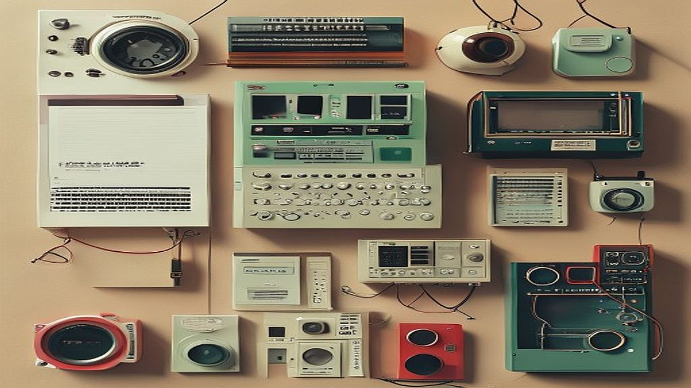

## 레트로 가전의 부활, 2026년형 디자인으로 재해석된 오디오와 게임기

레트로 가전이 단순한 유행을 넘어 3040 세대의 라이프스타일을 점령하고 있습니다. 2026년형 디자인으로 새롭게 출시되는 오디오와 게임기는 과거의 향수를 자극하는 외관에 현대적인 무선 연결성과 고해상도 사운드라는 실용성을 결합했습니다. 과거의 가전이 단순히 기능을 수행하는 도구였다면, 지금의 레트로 가전은 거실과 서재의 분위기를 결정짓는 인테리어 오브제이자 개인의 취향을 전시하는 매개체입니다. 

하지만 무턱대고 디자인만 보고 구매했다가는 금세 먼지만 쌓이는 애물단지가 되기 십상입니다. 30대 중반, 재택근무가 잦아지며 서재를 나만의 취향 공간으로 꾸미기 시작한 저는 턴테이블과 레트로 스타일의 게임기를 배치하며 한 가지 중요한 사실을 깨달았습니다. 가전은 결국 '사용하는 시간'과 '관리하는 노력'이 조화를 이룰 때 비로소 공간의 가치를 높인다는 점입니다. 이번 글에서는 디자인과 성능 사이에서 고민하는 여러분을 위해, 2026년형 레트로 가전을 선택할 때 반드시 고려해야 할 실질적인 판단 기준과 실패하지 않는 배치 전략을 정리했습니다. 단순히 예쁜 물건을 사는 단계를 넘어, 나의 공간에 어떤 가전이 어울릴지 구체적으로 따져봅시다.

## 공간의 페르소나를 결정하는 첫 번째 기준: 디자인과 기능의 우선순위

레트로 가전을 선택할 때 가장 먼저 마주하는 딜레마는 '디자인이냐, 성능이냐'입니다. 2026년형으로 재해석된 제품들은 겉으로는 1980년대의 아날로그 감성을 띠고 있지만, 내부에는 블루투스 5.4, 고음질 코덱, 혹은 고성능 프로세서가 탑재되어 있습니다. 

**선택 기준: 나의 사용 패턴 파악하기**
가장 먼저 판단해야 할 것은 '내가 얼마나 자주 이 기기를 조작할 것인가'입니다. 만약 당신이 음악을 큐레이션하고 LP를 뒤집는 행위 자체를 즐기는 사람이라면, 인터페이스가 다소 불편하더라도 아날로그 다이얼과 스위치가 달린 제품이 만족스러울 것입니다. 반대로 스마트폰 스트리밍이 주력이라면, 디자인은 레트로하되 전면 디스플레이나 별도의 앱 지원이 충실한 모델을 선택하는 것이 정신 건강에 이롭습니다.

*   **실제 사례:** 레트로 디자인의 올인원 오디오를 구매한 지인의 경우, 음질은 훌륭했으나 매번 스마트폰을 연결하기 위해 전용 앱을 켜야 하는 번거로움 때문에 결국 블루투스 스피커를 따로 하나 더 구매했습니다.
*   **실패 케이스:** 디자인만 보고 구매한 저가형 레트로 게임기는 에뮬레이터 구동 속도가 느려 10분 만에 흥미를 잃었습니다. 성능이 뒷받침되지 않는 레트로는 단순한 플라스틱 장식품에 불과합니다.
*   **선택 포인트:** 제품의 상단 인터페이스를 확인하세요. 물리 버튼의 조작감이 만족스러운지, 혹은 스마트폰과 연동되는 범용성이 얼마나 확보되었는지(연결 시간 5초 이내인지)가 결정적입니다.

## 키덜트 인테리어의 완성: 배선과 배치 전략

레트로 가전은 그 자체로 존재감이 큽니다. 하지만 인테리어의 핵심은 '깔끔함'입니다. 레트로 가전은 대부분 전원 케이블이나 연결선이 두드러지는 경우가 많습니다. 이를 방치하면 빈티지한 멋은 사라지고 어수선한 잡동사니처럼 보이기 쉽습니다.

**실전 체크리스트: 인테리어 배치 시 고려할 3요소**
1. **케이블 관리:** 제품의 전원선이 뒤쪽으로 어떻게 숨겨지는지 확인하세요. 2026년형 제품 중에는 후면 디자인까지 고려해 케이블을 깔끔하게 정리할 수 있는 슬롯이 마련된 모델이 많습니다.
2. **높이와 시선:** 오디오는 눈높이보다 낮게, 게임기는 조작이 편한 허리 높이에 두는 것이 좋습니다. 너무 높은 곳에 두면 레트로 기기 특유의 복잡한 버튼을 사용하기 어렵습니다.
3. **색감의 통일성:** 우드 톤의 레트로 오디오를 선택했다면, 주변 가구도 비슷한 톤으로 맞추거나 완전히 대비되는 화이트 계열로 배치해 제품이 돋보이게 하세요.

*   **실제 사례:** 거실 한가운데 레트로 게임기를 배치한 결과, 지저분한 HDMI 선 때문에 인테리어가 망가졌습니다. 이를 해결하기 위해 무선 디스플레이 어댑터를 활용해 선을 최소화하는 방식으로 바꿨습니다.
*   **실패 케이스:** 공간을 고려하지 않고 대형 레트로 스피커를 구매했다가, 책상 위 공간이 좁아져 결국 바닥에 내려놓고 사용하는 경우입니다. 바닥에 놓으면 먼지가 더 많이 쌓이고 관리가 소홀해집니다.
*   **선택 포인트:** 제품의 '깊이(Depth)'를 반드시 측정하세요. 대부분의 레트로 가전은 일반 가전보다 부피가 큽니다. 기존 가구의 깊이와 맞지 않으면 돌출되어 공간이 좁아 보입니다.

## 지속 가능한 취향을 위한 유지비와 관리법

레트로 가전은 일반 가전보다 관리에 손이 많이 갑니다. 특히 빈티지한 질감을 살리기 위해 사용된 가죽 마감, 금속 노브, 패브릭 그릴 등은 시간이 지나면 오염되거나 낡기 마련입니다. 이를 '멋'으로 받아들일 것인지, 아니면 '고장'으로 볼 것인지에 따라 제품 선택이 달라져야 합니다.

**유지비와 관리 체크 포인트**
*   **청소 난이도:** 패브릭 그릴은 먼지가 잘 쌓입니다. 에어건이나 부드러운 브러시로 2주에 한 번은 관리해 줄 자신이 있는지 자문해 보세요.
*   **부품 수급:** 노브(손잡이)나 스위치 같은 물리 부품은 고장이 잦습니다. 브랜드가 3년 이상 지속적으로 부품을 공급하는지, 혹은 범용 부품을 사용하는지 확인하는 것이 경제적입니다.
*   **소모품 비용:** LP 플레이어라면 바늘 교체 비용, 게임기라면 컨트롤러 배터리 교체 주기를 미리 계산해 두어야 합니다.

*   **실제 사례:** 화이트 레트로 오디오를 샀다가 1년 만에 변색되어 고생했습니다. 플라스틱 재질보다는 금속이나 원목 마감 제품이 시간이 지나도 빈티지한 멋을 유지하는 데 유리합니다.
*   **실패 케이스:** 배터리 교체가 불가능한 내장형 배터리 제품을 구매했다가, 2년 후 배터리 효율이 급격히 떨어져 유선 전용으로만 사용하게 된 경우입니다.
*   **선택 포인트:** 제품 상세 페이지에서 'AS 가능 기간'과 '소모품 구매처'를 찾아보세요. 브랜드 공식 홈페이지에서 부품을 별도로 판매하지 않는다면, 2년 후에는 고장이 나도 버려야 할 가능성이 높습니다.

레트로 가전은 2026년의 기술력과 과거의 미감이 만나는 지점입니다. 단순히 예쁜 물건을 사는 것이 아니라, 나의 일상에 음악과 놀이를 다시 끌어들이는 과정임을 기억하세요. 디자인에 현혹되어 기능을 포기하지 말고, 매일 아침 전원을 켜고 싶은 제품을 선택하는 것이 가장 중요합니다. 오늘 정리해 드린 배치 전략과 관리 기준을 바탕으로, 여러분의 공간에 오래도록 머물 수 있는 취향의 조각을 찾길 바랍니다. 이제 여러분의 서재에 어울릴 첫 번째 레트로 가전을 고를 준비가 되셨나요?

## 마치며

레트로 가전은 단순히 과거의 디자인을 재현하는 것에 그치지 않습니다. 최신 기술이 뒷받침된 2026년형 레트로 제품들은 일상에 깊이 있는 감성과 편리함을 동시에 선사하죠. 앞서 살펴본 것처럼, 제품을 선택할 때는 외관의 미학뿐만 아니라 배터리 교체 가능 여부와 사후 관리 서비스까지 꼼꼼히 따져보는 안목이 필요합니다. 겉모습에만 치중해 쉽게 버려질 물건을 사는 대신, 오랫동안 곁을 지킬 수 있는 튼튼하고 신뢰할 수 있는 제품을 골라보세요.

여러분의 공간을 더욱 특별하게 만들어줄 레트로 오디오나 게임기를 찾고 계신가요? 지금 바로 관심 있는 브랜드의 공식 홈페이지를 방문해 상세 사양을 확인해보는 것부터 시작해보세요. 취향이 담긴 작은 가전 하나가 여러분의 평범한 일상을 근사한 휴식의 시간으로 바꿔줄 것입니다. 오늘 공유해 드린 가이드가 여러분의 현명하고 즐거운 소비에 도움이 되었길 바랍니다. 여러분의 서재에 낭만을 더해줄 첫 번째 아이템을 찾으셨다면, 댓글로 살짝 자랑해주세요!
