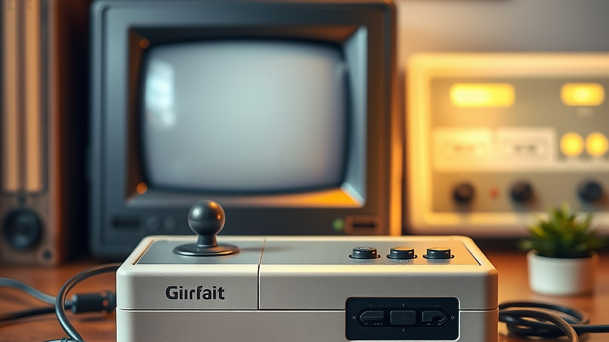

레트로 게임기 에뮬레이터 환경 구축은 단순히 옛날 게임을 다시 하는 행위를 넘어, 2026년을 살아가는 3040 세대가 자신의 어린 시절과 현재의 기술력을 정교하게 결합하는 일종의 '디지털 큐레이션' 작업입니다. 우리가 90년대 게임에 열광하는 이유는 단순히 그 시절이 그리워서가 아니라, 복잡한 현대의 게임 시스템에서 벗어나 직관적이고 밀도 높은 재미를 재발견하고 싶기 때문입니다. 예전에는 브라운관 TV의 뭉툭한 화질 속에서 상상력으로 메워야 했던 도트 그래픽이, 이제는 고해상도 모니터와 정밀한 필터링 기술을 통해 새로운 미학으로 재탄생합니다. 이 글은 단순히 추억에 젖는 법을 알려주는 것이 아니라, 2026년의 기술 환경에서 레트로 게임을 가장 쾌적하게 즐기기 위해 무엇을 준비하고, 어떤 시행착오를 줄여야 하는지 실질적인 가이드를 제공합니다.

## 디스플레이와 입력 지연, 쾌적한 환경을 위한 물리적 기준

레트로 게임기 에뮬레이터를 구축할 때 가장 먼저 마주하는 벽은 화질과 입력 지연입니다. 90년대 게임은 4대 3 비율의 브라운관 TV에 최적화되어 설계되었습니다. 이를 16대 9 비율의 현대적인 4K 모니터에 그대로 띄우면 화면이 좌우로 늘어지거나, 도트가 뭉개져 우리가 기억하던 깔끔한 선명함을 느낄 수 없습니다.

가장 먼저 고려해야 할 기준은 디스플레이의 주사율과 업스케일링 방식입니다. 단순히 화면을 키우는 것이 아니라, 픽셀을 정수 배로 확대하는 정수 스케일링(Integer Scaling)을 지원하는 환경을 구축해야 합니다. 그래야만 도트의 날카로운 경계선이 유지됩니다. 또한, 현대 디스플레이의 입력 지연(Input Lag)은 레트로 게임의 생명인 정교한 조작을 방해하는 주범입니다.

실패 케이스로 가장 흔한 경우는 저가형 HDMI 변환기를 사용하거나, 입력 지연이 심한 일반 사무용 모니터에 기기를 연결하는 상황입니다. 이 경우 버튼을 누른 뒤 0.1초 뒤에 캐릭터가 움직이는 답답함을 겪게 되며, 이는 게임의 몰입도를 완전히 파괴합니다. 선택 기준은 명확합니다. 게임 모드가 지원되는 디스플레이를 선택하고, 가능하다면 픽셀 보간(Interpolation) 설정을 끄고 픽셀 아트 본연의 형태를 유지하는 설정을 우선하세요. 30인치 이하의 적당한 크기의 모니터가 레트로 게임의 감성을 살리기에는 50인치 이상의 대형 TV보다 훨씬 유리합니다.

## 에뮬레이터 하드웨어 선택과 시스템 구축 전략

하드웨어를 선택할 때는 본인의 '숙련도'와 '공간 활용성'을 먼저 따져봐야 합니다. 2026년 현재, 시장에는 초소형 리눅스 기반 게임기부터 강력한 성능의 미니 PC까지 선택지가 매우 넓습니다. 하지만 무조건 고사양이라고 좋은 것은 아닙니다. 90년대 게임을 즐길 목적이라면 오히려 저전력으로 구동되는 최적화된 기기가 발열 관리나 전력 소모 면에서 훨씬 효율적입니다.

실전 체크리스트를 제안합니다. 첫째, 휴대성이 중요한가? 그렇다면 4인치 내외의 화면을 가진 휴대용 기기를 선택하세요. 둘째, 거실 TV에 연결해 가족이나 친구와 즐길 것인가? 그렇다면 블루투스 컨트롤러 연결이 원활하고, 화면 출력이 안정적인 거치형 미니 PC 환경이 적합합니다. 셋째, 설정의 번거로움을 감수할 수 있는가? 만약 설정이 귀찮다면 OS가 내장된 완성형 휴대용 기기가 정답입니다.

실패하는 경우는 자신의 목적과 맞지 않는 기기를 구매하는 것입니다. 예를 들어, 거실에서 즐기고 싶은데 작은 휴대용 기기만 고집하면 결국 화면 크기와 조작감 때문에 얼마 지나지 않아 방치하게 됩니다. 반대로 복잡한 설정을 싫어하는 사람이 성능만 보고 미니 PC를 조립하면, 에뮬레이터 세팅 과정에서 지쳐 흥미를 잃기 쉽습니다. 따라서 자신의 기술적 이해도에 맞춰 '완성형 제품'과 '조립형 시스템' 중 하나를 먼저 결정하십시오. 가격대는 10만 원대부터 50만 원대까지 다양하지만, 20만 원 전후의 제품이 90년대 게임을 구동하기에는 충분한 성능을 보장합니다.

## 유지 관리와 커뮤니티 활용, 취미를 지속하는 힘

레트로 게임은 시작보다 유지가 어렵습니다. 수많은 게임 목록 속에서 무엇을 할지 고르다가 시간을 다 보내는 '선택 장애'에 빠지기 쉽기 때문입니다. 이를 방지하기 위해 자신만의 라이브러리를 구축하는 것이 중요합니다. 모든 게임을 다 넣기보다는, 정말로 다시 해보고 싶은 10개에서 20개의 게임 위주로 즐겨찾기를 구성해 보세요. 게임기 하나를 온전히 '나만의 명작 박물관'으로 만드는 과정이 취미를 오래 지속하게 합니다.

또한, 레트로 게임 커뮤니티를 적극적으로 활용할 것을 권장합니다. 2026년의 커뮤니티는 단순히 옛날이야기를 하는 곳이 아닙니다. 새로운 디스플레이에 맞는 화면 필터 설정값, 최신 패드와의 호환성 문제 해결책 등 실용적인 정보가 매일 공유됩니다. 혼자 고민하면 해결하는 데 며칠이 걸릴 문제도, 커뮤니티의 검증된 가이드를 따라 하면 10분 만에 해결할 수 있습니다.

실수하기 쉬운 부분은 무분별한 설정 변경입니다. 에뮬레이터는 설정 항목이 매우 방대합니다. 하나를 건드리면 다른 하나가 어긋나는 경우가 많습니다. 반드시 초기 설정을 백업해두고, 하나씩 변경하며 테스트하는 습관을 들이세요. 만약 게임 실행이 안 된다면, 하드웨어 결함보다는 에뮬레이터의 코어(Core) 설정이 잘못되었을 확률이 90% 이상입니다. 이때는 커뮤니티 검색을 통해 해당 기종의 '표준 설정'을 찾아 그대로 적용하는 것이 가장 빠릅니다.

## 결론: 2026년에 즐기는 레트로 게임의 본질

레트로 게임기 에뮬레이터 환경을 구축하는 것은 과거로 도피하는 것이 아니라, 과거의 유산을 현재의 높은 기술력으로 재해석하여 즐기는 능동적인 문화 활동입니다. 우리가 90년대 게임에 반응하는 이유는 그 시절의 게임이 가진 '완결성' 때문입니다. 업데이트와 과금 유도가 없는, 처음부터 끝까지 정교하게 설계된 게임의 재미는 현대 게임이 결코 대체할 수 없는 가치입니다.

이 취미를 시작하려는 분들께 당부하고 싶은 것은, 완벽함을 추구하며 기기만 계속 교체하는 '장비병'을 경계하라는 점입니다. 중요한 것은 기기의 성능이 아니라, 그 기기를 통해 어떤 게임을 어떤 마음가짐으로 즐기느냐입니다. 오늘 제안한 디스플레이 선택 기준과 하드웨어 구성 전략을 바탕으로, 여러분의 거실이나 책상 위에 작은 90년대 추억의 공간을 만들어 보십시오. 지금 바로 선호하는 게임 장르 3가지만 정하고, 그 장르를 가장 잘 구동할 수 있는 기기를 찾아보시기 바랍니다. 레트로 게임은 여러분이 어린 시절 느꼈던 그 순수한 즐거움을 다시 찾을 준비가 되어 있습니다. 완벽한 환경을 구축하는 과정 자체가 또 하나의 즐거운 게임이 될 것입니다.

결국 레트로 게임은 단순히 과거의 유물을 꺼내는 행위가 아니라, 정교하게 완성된 게임성을 온전히 경험하며 잃어버린 순수한 즐거움을 되찾는 일입니다. 화려한 장비나 완벽한 세팅에 매몰되기보다는, 지금 당장 여러분의 마음을 설레게 했던 그 시절의 게임을 다시 마주하는 것이 가장 중요합니다.

이제 거창한 준비는 잠시 내려놓고, 여러분의 추억 속 가장 아끼던 게임 3가지를 떠올려 보세요. 그리고 그것을 가장 잘 구동할 수 있는 환경을 하나씩 만들어 나가는 과정 그 자체를 즐겨보시길 바랍니다. 오늘 바로 에뮬레이터를 설치하고, 어린 시절 그 방구석에서 느꼈던 가슴 뛰는 모험을 다시 시작해 보는 건 어떨까요? 여러분의 책상 위에 펼쳐질 90년대의 풍경이, 지친 일상 속에서 가장 따뜻하고 다정한 휴식처가 되어줄 것입니다. 자, 이제 다시 컨트롤러를 잡을 시간입니다!
