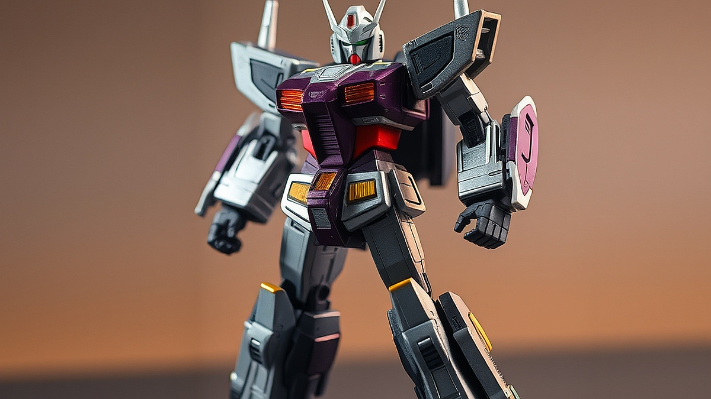

초합금 피규어의 귀환은 단순히 과거의 향수를 되살리는 차원을 넘어, 2026년식 정교함이 어른들의 까다로운 미적 감각과 물리적 만족감을 어떻게 충족시키는지 보여주는 상징적인 현상입니다. 책상 위에 놓인 가벼운 플라스틱 피규어가 주는 허전함에 지친 당신이라면, 이제는 손끝에 닿는 차가운 금속의 질감과 묵직한 무게감에 주목할 때입니다. 20대 후반부터 40대까지, 우리는 이미 수많은 소모성 굿즈를 거쳐왔습니다. 하지만 이제는 '사고 버리는' 소비가 아니라, '소장하고 만지는' 경험의 가치를 중시합니다. 초합금은 단순히 메카닉의 외형을 흉내 내는 것이 아니라, 합금 특유의 비틀림 없는 강도와 정밀한 관절 설계로 아날로그적 손맛을 극대화합니다. 과거의 초합금이 투박한 어린이용 장난감이었다면, 지금의 초합금은 성인 수집가의 공간을 압도하는 정밀 공학의 결정체입니다. 왜 지금 다시 초합금인가? 그것은 디지털 정보가 범람하는 세상에서, 물리적으로 존재하는 단단한 실체와 그 실체를 직접 조작하는 행위가 주는 확실한 감각적 피드백이 우리에게 필요하기 때문입니다.

## 무게감과 질감이 주는 심리적 만족의 실체

초합금 피규어를 처음 손에 쥐었을 때 느껴지는 그 묵직함은 단순한 금속의 밀도가 아니라, 지불한 비용에 대한 즉각적인 보상으로 다가옵니다. 플라스틱 피규어는 가볍고 다루기 쉽지만, 시간이 지나면 관절이 헐거워지거나 직사광선 아래에서 변색되는 피로감을 줍니다. 반면 합금 소재는 변형이 적고, 관절 내부의 기어와 맞물리는 금속 부품들이 내는 특유의 조립음은 성인 수집가만이 누릴 수 있는 고도의 감각적 즐거움입니다.

선택 기준은 분명합니다. 본인의 디스플레이 환경이 '먼지로부터 안전한 유리 장식장'인가, 아니면 '자주 만지고 가지고 노는 책상 위'인가에 따라 초합금의 비중을 결정해야 합니다. 유리 장식장에만 둘 예정이라면 외형의 도색 마감(웨더링이나 메탈릭 도장)이 중요한 선택 기준이 되겠지만, 직접 만질 계획이라면 관절의 유지력과 합금 파츠의 배치, 즉 '무게 중심'이 설계에 어떻게 반영되었는지를 확인해야 합니다. 

실패 사례로 흔히 꼽히는 경우는 화려한 외관에만 현혹되어 관절 구조를 확인하지 않는 것입니다. 합금 비중이 높으면 그만큼 무게가 실리기 때문에, 하체 관절이 금속의 하중을 견디지 못하면 피규어는 스스로 서 있지 못하고 금세 자세가 무너집니다. 2026년 현재 시장에 나오는 고가 모델들은 이를 해결하기 위해 관절 내부에 래칫 기어를 삽입하여 '딱딱' 소리를 내며 고정되도록 설계합니다. 따라서 구매 전에는 반드시 해당 모델의 관절 고정 방식이 단순 마찰식인지, 기어식인지 확인하십시오. 마찰식은 시간이 지나면 반드시 헐거워지지만, 기어식은 반영구적인 포징이 가능합니다.

## 실전 체크리스트: 수집가의 안목을 키우는 3단계

초합금 피규어 시장에 처음 발을 들일 때 가장 큰 실수는 '무조건 비싼 것이 최고'라는 믿음입니다. 가격은 브랜드 가치와 금형 제작의 난이도를 반영할 뿐, 당신의 취향을 보장하지 않습니다. 입문 단계에서 가장 먼저 체크해야 할 실전 기준은 '조립과 가동의 비율'입니다.

1단계: 가동 범위 확인. 피규어를 세워두기만 할 것인지, 아니면 역동적인 전투 포즈를 취할 것인지 결정하세요. 포즈가 중요하다면 관절 부위가 합금으로 덮여 있는지, 아니면 가동을 위해 플라스틱 프레임이 노출되어 있는지 살펴야 합니다. 합금이 너무 많으면 오히려 가동 범위가 좁아질 수 있습니다.

2단계: 유지보수 환경 점검. 금속 피규어는 습기에 취약합니다. 특히 해안가 근처나 습도가 높은 여름철에는 금속 표면에 녹이 슬거나 도색이 들뜨는 현상이 발생할 수 있습니다. 방습제를 넣은 밀폐 장식장이 없다면, 구매를 다시 고려해야 합니다.

3단계: 중고 거래 시 검수 항목. 초합금의 핵심은 관절입니다. 중고를 거래할 때는 반드시 판매자에게 '관절의 텐션(유지력)'을 영상으로 확인받으세요. 특히 어깨와 고관절처럼 무게 중심을 잡는 부위가 헐거워졌다면, 수리 비용이 제품 가격의 상당 부분을 차지할 수 있습니다.

이러한 과정은 번거로워 보이지만, 결과적으로 실패 없는 소비를 돕는 필수적인 절차입니다. 초합금은 한번 구매하면 수십 년을 곁에 두는 제품입니다. 따라서 '지금 당장 예쁜가'보다 '5년 뒤에도 관절이 버틸 수 있는 설계인가'를 먼저 질문해야 합니다.

## 초합금 수집, 공간과 예산의 현실적 균형

수집은 공간의 한계에서 시작됩니다. 초합금 피규어는 일반 피규어보다 밀도가 높고 무게가 상당하여, 일반적인 선반에 무리하게 배치하면 선반이 휘거나 바닥이 찍히는 불상사가 발생합니다. 저의 경우, 수집 초기에는 무작정 여러 모델을 구매하다가 장식장 선반이 무게를 견디지 못해 파손되는 경험을 했습니다. 그 이후로 저는 '공간 대비 하중'을 먼저 계산합니다.

선택 기준은 다음과 같습니다. 선반 한 칸당 허용 하중이 5kg 미만이라면, 1/60 스케일 이상의 대형 초합금은 피해야 합니다. 대신 1/144 스케일이나 손바닥 크기의 정교한 합금 모델을 여러 개 배치하는 것이 시각적인 만족도와 안전성 측면에서 훨씬 유리합니다. 

피해야 할 경우는 '공간에 대한 계획 없이 신제품을 예약 구매하는 것'입니다. 초합금은 박스 크기 또한 상당합니다. 박스를 버리지 않는 수집가라면, 피규어 본체보다 박스를 보관할 공간이 더 많이 필요하다는 사실을 간과해서는 안 됩니다. 

실전 팁으로, 저는 피규어를 배치할 때 '삼각대 원리'를 적용합니다. 두 발로 서 있는 자세보다 한쪽 다리를 살짝 뒤로 뺀 자세가 훨씬 안정적이며, 합금의 무게가 지면으로 고르게 분산됩니다. 또한, 장식장 바닥에 미끄럼 방지용 실리콘 패드를 부착하면 지진이나 충격으로부터 소중한 컬렉션을 안전하게 보호할 수 있습니다. 

마지막으로, 초합금 수집은 타인에게 보여주기 위한 전시가 아닙니다. 퇴근 후 지친 몸을 이끌고 장식장 앞을 지나갈 때, 조명을 받은 금속 표면이 반사하는 빛과 그 묵직한 존재감을 느끼는 것만으로도 충분한 가치가 있습니다. 

초합금 피규어는 단순히 어린 시절의 로망을 투영하는 대상이 아닙니다. 2026년의 우리에게 이것은 정밀한 설계와 차가운 질감을 통해 일상의 스트레스를 잊게 해주는, 가장 물리적이고도 확실한 위로입니다. 이제는 무분별한 소비에서 벗어나, 관절의 설계와 소재의 내구성을 꼼꼼히 따져보고 본인의 공간에 가장 잘 어울리는 단 하나의 메카닉을 선택해 보시기 바랍니다. 당신이 선택한 그 묵직한 존재감이 책상 위에서 든든한 동반자가 되어줄 것입니다. 지금 바로 당신의 장식장 허용 하중과 관절 관리 환경을 체크해 보세요. 준비가 된 사람만이 이 아날로그적 만족감의 정점을 누릴 자격이 있습니다.

## 마치며

2026년형 초합금 피규어는 단순한 장난감을 넘어, 정밀한 공학적 설계와 금속 특유의 묵직한 질감으로 현대인에게 깊은 위로를 건네는 예술 작품입니다. 화려한 외형 뒤에 숨겨진 구조적 견고함과 아날로그적인 손맛은 디지털 세상 속에서 우리가 잃어버렸던 감각을 다시금 깨워줍니다.

이제 여러분의 공간에 그 특별한 존재감을 더해볼 시간입니다. 단순히 유행을 쫓기보다, 자신의 취향과 공간에 가장 어울리는 단 하나의 메카닉을 신중히 골라보세요. 장식장의 하중을 확인하고 관절을 조심스럽게 다루며 피규어와 교감하는 과정 자체가 수집의 진정한 즐거움이 될 것입니다.

오늘 퇴근길, 여러분을 기다리는 든든한 동반자를 만나러 가보는 건 어떨까요? 정교하게 설계된 금속의 차가운 표면이 여러분의 지친 하루를 따뜻하게 어루만져 줄 것입니다. 여러분의 장식장 속 첫 번째 주인공은 누구인가요? 지금 바로 그 설레는 여정을 시작해 보세요!
