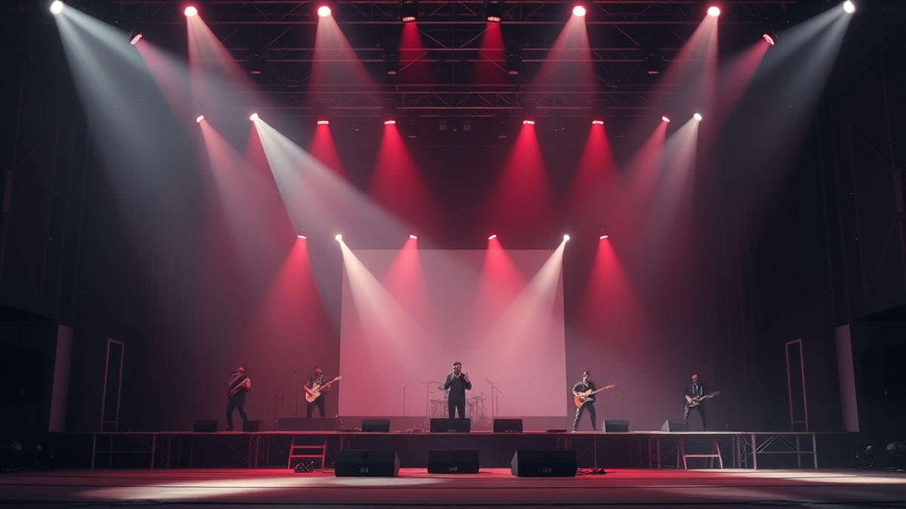

# 라이브 공연, 심장을 울리는 그 전율! 2025년, 우리는 왜 다시 무대 앞으로 달려가는가?

라이브 공연만큼 우리를 뜨겁게 만들고 깊이 위로하는 경험은 또 있을까요? 저는 음악을 그저 듣는 것을 넘어, 온몸으로 느끼는 이 순간들을 사랑합니다. 앨범을 수백 번 돌려 들으며 가사를 외우고 멜로디에 빠져드는 것도 좋지만, 역시 아티스트와 팬들이 한 공간에서 숨 쉬며 만들어내는 시너지는 그 어떤 것으로도 대체할 수 없는 마법 같아요. 제게 라이브 공연은 단순한 취미를 넘어선 일종의 *의식*입니다. 삶의 고단함 속에서 지쳐갈 때, 저는 언제나 공연장을 찾았고, 그곳에서 예상치 못한 위로와 에너지를 얻곤 했습니다.

때로는 거대한 스타디움을 가득 메운 수만 명의 함성 속에서 작은 점이 되는 경험을 하기도 하고, 때로는 소규모 클럽에서 아티스트의 땀방울까지 보이는 생생한 무대를 마주하기도 합니다. 장르를 가리지 않고 다양한 음악을 탐닉하는 저에게, 재즈 클럽의 즉흥적인 스캣부터 록 페스티벌의 광란적인 슬램까지, 모든 라이브 무대는 그 자체로 하나의 예술 작품이자 살아있는 역사입니다. 2025년이 되면서 기술의 발전과 함께 공연 문화도 빠르게 변화하고 있지만, 변치 않는 한 가지는 바로 무대 위에서 뿜어져 나오는 날 것 그대로의 에너지, 그리고 그것이 우리에게 선사하는 잊을 수 없는 감동일 겁니다. 오늘은 제가 왜 이렇게 라이브 공연에 미쳐 사는지, 그리고 이 특별한 경험을 어떻게 하면 200% 더 즐길 수 있는지에 대한 저의 진심 어린 이야기와 꿀팁들을 나누어볼까 합니다. 공연을 사랑하는 여러분과 함께 이 전율을 다시 한번 느껴보고 싶어요.

## 왜 우리는 라이브 공연에 열광하는가: 오감 만족을 넘어선 교감의 마법

여러분은 어떤 공연에서 가장 큰 감동을 받으셨나요? 저는 아마도 재작년, 제가 가장 힘들었던 시기에 우연히 가게 된 한 인디 밴드의 소규모 공연이었을 겁니다. 당시 저는 모든 것에 지쳐 있었고, 음악을 듣는 것조차 버겁게 느껴지던 때였어요. 그런데 그 밴드의 보컬이 어쿠스틱 기타 하나만 들고 무대에 올라, 제가 정말 좋아했던 한 곡을 부르기 시작하더군요. 스튜디오 앨범에서는 화려한 편곡과 효과음으로 가득했던 그 곡이, 라이브에서는 오직 그녀의 목소리와 기타 선율만으로 채워졌습니다.

그 순간, 저는 정말이지 *말로 표현할 수 없는 위로*를 받았어요. 앨범의 완벽하게 다듬어진 사운드도 좋지만, 라이브는 아티스트의 숨소리, 찰나의 떨림, 그리고 가사를 읊조리는 목소리의 미세한 변화까지 고스란히 전달하죠. 보통 스튜디오 녹음은 완벽한 소리를 만들기 위해 수많은 트랙을 쌓고, 보컬 피치 보정이나 타이밍 수정 등 정교한 후반 작업을 거칩니다. 하지만 라이브는 달라요. 그 순간의 공기, 아티스트의 감정, 그리고 관객들의 에너지가 한데 섞여 오직 *그때, 그곳에서만 들을 수 있는 단 하나의 소리*를 만들어냅니다. 공연장의 사운드 엔지니어가 현장에서 실시간으로 모든 악기와 보컬의 밸런스를 맞추고, 공간의 특성을 고려해 최적의 음향을 구현하려 노력하죠. 이 모든 과정이 어우러져, 우리가 듣는 것은 그저 '노래'가 아니라 '살아있는 음악'이 되는 겁니다.

제 가슴을 울렸던 그 공연에서, 저는 무대 위 아티스트와 눈을 마주치며 저도 모르게 눈물을 흘렸습니다. 제 옆에 서 있던 관객도 흐느끼고 있었고요. 우리는 서로 알지 못했지만, 그 순간만큼은 같은 감정을 공유하고 있었습니다. 이것이 바로 라이브 공연의 가장 큰 매력이 아닐까요? 단순히 귀로 듣는 것을 넘어, 온몸으로 베이스의 진동을 느끼고, 조명에 따라 시시각각 변하는 무대 연출에 압도되며, 옆 사람과 어깨를 부딪히며 함께 노래하는 *오감 만족의 경험*.

이러한 교감은 2025년에도 여전히 라이브 공연의 핵심 가치로 남아 있습니다. 오히려 기술의 발전은 이러한 교감을 더욱 증폭시키는 방향으로 진화하고 있죠. 단순히 큰 스크린이나 화려한 조명을 넘어, 관객의 움직임이나 스마트폰 앱을 통해 무대 연출에 직접 참여할 수 있는 인터랙티브 요소들이 등장하고 있어요. 예를 들어, 특정 곡에서 관객들이 각자의 앱을 통해 색깔을 선택하면, 그 색깔들이 모여 무대 배경을 수놓는 식으로요. 이러한 경험은 우리가 단순히 '보는' 관객이 아니라, 공연의 일부가 되어 '함께 만들어가는' 창조자가 되는 듯한 느낌을 줍니다. 저는 이런 경험을 할 때마다, 정말이지 무대와 객석의 경계가 허물어지는 듯한 짜릿함을 느낍니다. 우리 모두가 하나의 거대한 에너지가 되어 아티스트와 교감하는 그 순간, 우리는 현실의 모든 걱정을 잊고 오직 음악에만 몰입하게 되는 거죠.

## 2025년, 라이브 공연 트렌드를 읽다: 기술과 팬덤이 만드는 새로운 경험

2025년의 라이브 공연 현장은 불과 몇 년 전과는 사뭇 다른 풍경을 보여주고 있습니다. 코로나19 팬데믹을 거치며 급격히 발전한 기술은 라이브 공연의 형태와 경험을 완전히 뒤바꿔 놓았죠. 저는 이 변화의 흐름 속에서 때로는 놀라움을, 때로는 아쉬움을 느끼며 새로운 공연 문화를 체험하고 있습니다.

가장 눈에 띄는 트렌드 중 하나는 바로 **하이브리드 콘서트**의 확산입니다. 이제 공연은 단순히 현장 관객만을 위한 것이 아닙니다. 고화질 스트리밍, VR/AR 기술을 활용한 가상현실 공연, 그리고 메타버스 플랫폼 내에서 진행되는 콘서트까지, 물리적 제약을 넘어선 다양한 형태의 라이브 경험이 제공되고 있어요. 저도 한동안 해외 아티스트의 내한 공연을 기다리다 지쳐, 거실에서 VR 헤드셋을 쓰고 가상 콘서트에 참여했던 경험이 있습니다. 실제 공연장과 거의 흡사하게 구현된 가상 공간에서 아티스트가 노래하고, 다른 아바타들과 함께 환호성을 지르는 경험은 꽤나 신선했어요. 물론, 현장의 땀 냄새와 뜨거운 함성, 그리고 옆 사람의 어깨 너머로 보이는 무대의 생생함까지 완벽하게 재현할 수는 없었지만, 지리적 제약 때문에 놓칠 수밖에 없었던 공연을 즐길 수 있었다는 점에서는 분명 혁신적이었습니다. 하지만 한편으로는, 기술이 너무 앞서나가 현장의 날 것 그대로의 감동이 희석될까 하는 우려도 살짝 들었죠. 실제로 한 버추얼 콘서트에서는 기술적인 오류로 인해 사운드가 끊기거나 아바타가 제대로 움직이지 않아 몰입감이 깨지는 아쉬운 경험도 있었어요. 완벽한 기술 구현이 아직은 숙제로 남아있는 셈이죠.

또 다른 중요한 변화는 **팬덤의 참여와 상호작용**이 더욱 강화되었다는 점입니다. 이제 팬들은 단순한 수동적인 관객이 아닙니다. 공연 기획 단계부터 아티스트와의 소통을 통해 셋리스트에 영향을 미치거나, 굿즈 디자인에 의견을 내기도 합니다. 공연 현장에서는 아티스트가 실시간으로 팬들의 질문에 답하고, 투표를 통해 다음 곡을 정하는 등 즉각적인 소통이 이루어지기도 해요. 스마트폰 앱을 활용한 실시간 응원봉 제어는 이제 기본 중의 기본이 되었고, 공연 중 특정 구간에서 팬들이 보낸 메시지가 대형 스크린에 송출되는 이벤트도 흔하게 볼 수 있습니다. 이러한 상호작용은 팬들에게 '내가 이 공연의 일부다'라는 소속감과 함께 더욱 강렬한 유대감을 선사합니다. 저는 이런 트렌드가 아티스트와 팬덤의 관계를 더욱 끈끈하게 만들고, 더 나아가 공연 자체를 더욱 풍부하고 다채롭게 만든다고 생각해요.

마지막으로, **지속 가능성**은 2025년 공연 문화에서 빼놓을 수 없는 키워드입니다. 환경 문제에 대한 인식이 높아지면서, 많은 공연 기획사들이 일회용품 사용을 줄이고, 친환경 소재의 굿즈를 제작하며, 에너지 효율적인 공연 시스템을 도입하는 등 다양한 노력을 기울이고 있습니다. 디지털 티켓 사용은 이제 거의 모든 공연에서 기본이 되었고, 물품 보관함도 플라스틱 대신 재활용 가능한 소재로 만들어지는 곳이 많아졌습니다. 저도 예전에는 공연장에서 받은 종이 전단지를 무심코 버리곤 했는데, 요즘은 모바일 앱으로 정보를 확인하고 개인 텀블러를 챙겨가는 등 작은 실천들을 하려고 노력하고 있어요. 이러한 변화는 단순히 환경 보호를 넘어, 공연을 즐기는 우리 모두가 더 나은 미래를 만들어가는 데 동참한다는 의미를 부여하며, 공연 경험의 가치를 더욱 높여주고 있습니다. 기술과 팬덤, 그리고 지속 가능성이라는 세 가지 축이 어우러져, 2025년의 라이브 공연은 그 어느 때보다 역동적이고 의미 있는 경험을 선사하고 있습니다.

## 나만의 라이브 공연 200% 즐기기: 예매부터 현장까지 실전 팁 대방출

저는 지난 십수 년간 수많은 공연을 다니면서 저만의 노하우를 쌓아왔습니다. 때로는 엄청난 실패를 맛보기도 했지만 (예를 들어, 암표에 속아 돈을 날리거나, 셋리스트를 미리 알지 못해 후회한 적도 있죠), 그런 경험들이 쌓여 지금의 '공연 마스터'가 되었다고 자부합니다. 여러분도 저처럼 최고의 라이브 경험을 누릴 수 있도록, 예매부터 현장까지 제가 터득한 실전 팁들을 아낌없이 공유해 드릴게요.

### 1. **치열한 티켓 전쟁에서 승리하는 법**

공연의 시작은 뭐니 뭐니 해도 티켓 예매입니다. 특히 인기 아티스트의 공연은 '피켓팅(피 튀기는 티켓팅)'이라는 말이 나올 정도로 경쟁이 치열하죠. 저는 한 번은 정말 가고 싶었던 밴드의 공연 티켓을 놓치고는 며칠 밤낮을 후회했던 적이 있습니다. 그때의 쓰라린 경험 이후로 몇 가지 원칙을 세웠어요.

*   **팬클럽 선예매 활용:** 가고 싶은 아티스트가 있다면, 주저하지 말고 팬클럽에 가입하세요. 일반 예매보다 먼저, 더 좋은 좌석을 선점할 기회가 주어집니다.
*   **예매처 알람 설정:** 주요 예매처(인터파크, 멜론티켓, 예스24 등)에 미리 로그인해두고, 알람 설정을 해두면 티켓 오픈 시간을 놓치지 않을 수 있습니다.
*   **빠른 손과 안정적인 인터넷:** 티켓 오픈 시간 5분 전부터 대기하고, 안정적인 유선 인터넷 환경에서 예매하는 것이 좋습니다. 여러 장을 한 번에 예매하기보다, 일단 한 장이라도 잡는다는 생각으로 빠르게 진행하는 것이 성공률을 높입니다.
*   **대기열과의 싸움:** 대기열이 길더라도 포기하지 마세요. 새로고침은 금물! 인내심을 가지고 기다리면 의외로 좋은 자리가 풀리는 경우가 많습니다.
*   **암표는 절대 금지:** 비공식적인 경로로 암표를 구매하는 것은 불법일 뿐만 아니라, 공연 문화 전체를 해치는 행위입니다. 저도 한때 너무 가고 싶어서 유혹에 넘어갈 뻔했지만, 결국은 공식 취소표나 추가 오픈을 기다리는 것이 현명하다는 것을 깨달았습니다.

### 2. **공연장 가기 전, 이것만은 꼭!**

티켓을 손에 넣었다면, 이제 공연을 제대로 즐기기 위한 준비를 해야 합니다.

*   **셋리스트 예측 (혹은 피하기):** 저는 보통 공연 전에 아티스트의 최근 투어 셋리스트를 찾아봅니다. 어떤 곡을 들을 수 있을지 미리 알면 기대감이 더 커지죠. 하지만 어떤 분들은 서프라이즈를 위해 일부러 셋리스트를 피하기도 합니다. 이건 개인의 취향에 따라 선택하세요!
*   **복장과 신발:** 스탠딩 공연이라면 편안한 운동화는 필수입니다. 발이 아프면 아무리 좋아하는 노래가 나와도 집중하기 어렵습니다. 너무 두꺼운 외투는 벗기 불편하고 짐이 될 수 있으니, 벗기 쉬운 가벼운 옷차림이 좋아요.
*   **짐은 최소화:** 가방은 작은 크로스백이나 에코백이 좋습니다. 큰 백팩은 다른 관객들에게 불편을 줄 수 있고, 물품 보관함에 맡겨야 할 수도 있어요.
*   **휴대폰 충전과 보조배터리:** 공연 중 사진이나 영상을 찍고, 친구들과 연락하거나 길을 찾을 때 휴대폰은 필수입니다. 배터리가 방전되지 않도록 미리 충전하고, 보조배터리를 챙기는 것이 좋습니다.
*   **수분 보충:** 공연장에서 목이 마를 때를 대비해 개인 텀블러에 물을 담아가거나, 공연장 내에서 판매하는 음료를 구매하세요. 목을 아끼지 않고 따라 부르다 보면 금방 목이 마르거든요.

### 3. **현장에서 200% 즐기는 마스터의 팁**

공연장에 도착했다면, 이제 모든 것을 내려놓고 음악에 몸을 맡길 시간입니다.

*   **일찍 도착하기:** 공연 시작 최소 30분 전에는 도착해서 여유 있게 입장하고, 화장실도 미리 다녀오세요. 굿즈를 구매할 예정이라면 1시간 이상 일찍 가는 것이 좋습니다.
*   **오프닝 밴드에게도 박수를:** 많은 공연에서 오프닝 밴드가 무대에 오릅니다. 이들은 미래의 스타가 될지도 모르는 숨겨진 보석일 수 있어요. 그들의 열정적인 무대에도 아낌없는 박수와 환호를 보내주세요. 저도 오프닝 밴드에게 반해 팬이 된 경우가 여러 번 있습니다.
*   **휴대폰은 잠시 넣어두세요:** 물론 멋진 순간을 기록하고 싶은 마음은 이해합니다. 하지만 너무 많은 시간을 휴대폰 화면 뒤에서 보내기보다는, *두 눈과 두 귀, 그리고 온몸으로* 그 순간을 직접 경험하는 데 집중해 보세요. 아티스트의 눈을 보고, 그들의 숨소리를 직접 듣는 것만큼 중요한 건 없습니다.
*   **주변 관객들과 함께 즐기기:** 공연은 혼자만의 경험이 아닙니다. 옆 사람과 함께 노래하고, 환호하고, 박수 치면서 에너지를 나누세요. 모르는 사람과도 음악으로 하나 되는 경험은 라이브 공연만이 줄 수 있는 특별한 선물입니다.
*   **공연 에티켓 지키기:** 과도한 점프나 팔 흔들기는 주변 사람들에게 방해가 될 수 있습니다. 서로 배려하며 안전하게 공연을 즐기는 것이 중요해요. 그리고 공연이 끝난 후에는 쓰레기를 잘 챙겨서 버리고, 깨끗한 공연장을 만드는 데 동참해 주세요.

공연이 끝난 후에는 온몸이 뻐근하고 목이 쉬어버리는 경우가 많습니다. 하지만 그 피곤함 속에서도 마음속 깊이 차오르는 충만감과 행복감은 그 어떤 피로도 잊게 만들죠. 저는 공연장을 나설 때마다, 방금 전까지 무대 위에서 펼쳐졌던 마법 같은 순간들을 다시 한번 되새기곤 합니다. 그 여운은 며칠, 아니 몇 주 동안 저를 지탱해 주는 소중한 에너지가 됩니다.

## 공연은 끝나도, 그 감동은 영원히

오늘 우리는 라이브 공연이 왜 그토록 우리를 열광시키는지, 2025년의 공연 트렌드는 어떤 모습인지, 그리고 이 특별한 경험을 200% 즐기기 위한 저만의 팁들을 함께 나누어 보았습니다. 라이브 공연은 단순한 오락을 넘어, 아티스트와 관객이 함께 만들어가는 살아있는 예술이며, 우리에게 깊은 위로와 잊지 못할 추억을 선사하는 마법 같은 공간입니다. 기술의 발전이 공연의 형태를 바꾸고 있지만, 결국 그 핵심에는 사람과 사람의 교감, 그리고 음악이 주는 순수한 감동이 자리 잡고 있다는 것을 다시 한번 느꼈으면 좋겠습니다.

저는 앞으로도 꾸준히 공연장을 찾아다니며, 그곳에서 얻는 에너지와 감동으로 삶을 채워나갈 겁니다. 여러분도 더 이상 망설이지 말고, 지금 바로 다음 공연 티켓을 찾아보세요. 거대한 스타디움이든, 작은 클럽이든, 혹은 집 안에서의 가상 콘서트든, 그곳에서 여러분을 기다리는 새로운 세상이 있을 겁니다. 우리 모두, 다음 라이브 공연에서 뜨거운 함성으로 하나 되는 그 순간을 함께 만들어나가요! 음악과 함께하는 삶은 언제나 축제니까요.