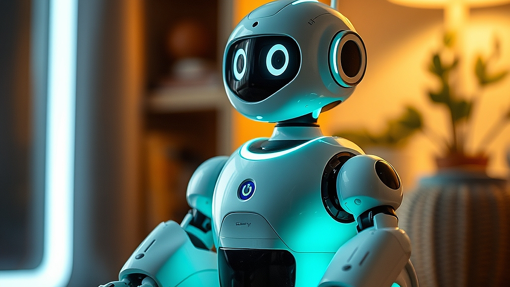

스마트홈과 키덜트의 결합은 이제 단순한 기술 과시를 넘어, 나만의 방구석 무드를 완성하는 핵심적인 인테리어 전략이 되었습니다. 20대 후반부터 40대까지의 키덜트들은 더 이상 장식장에 피규어를 가두어두는 것에 만족하지 않습니다. 낮에는 업무를 위한 차분한 공간이었다가, 밤이 되면 내가 좋아하는 캐릭터와 테마에 맞춰 조명과 로봇이 반응하는 몰입형 공간을 원하죠. 과거에는 복잡한 배선과 프로그래밍 능력이 필수였지만, 이제는 스마트 조명과 연동되는 자동화 시스템이 대중화되면서 누구나 쉽게 방 전체의 분위기를 제어할 수 있게 되었습니다. 단순히 제품을 사서 놓는 것이 아니라, 기술을 활용해 공간의 서사를 만드는 것이 요즘 취향의 핵심입니다. 이번 글에서는 스마트홈 기술을 내 취미 공간에 어떻게 실질적으로 녹여낼지, 그리고 어떤 기준을 가지고 장비를 선택해야 실패하지 않는지 구체적으로 다루어 보겠습니다.

## 조명 하나가 바꾸는 피규어 전시의 깊이

스마트 조명은 단순히 밝기를 조절하는 도구가 아닙니다. 피규어 수집가에게 조명은 작품의 디테일을 살리는 가장 저렴하면서도 효과적인 장치입니다. 우리가 흔히 범하는 실수는 밝기만 한 형광등 아래에 소중한 컬렉션을 두는 것입니다. 스마트 LED 바나 스트립 조명을 활용하면 특정 피규어의 색감에 맞춰 배경 조명을 바꾸거나, 시간대에 따라 은은한 앰비언트 라이트를 연출할 수 있습니다.

예를 들어, 사이버펑크 스타일의 메카닉 피규어를 전시한다면 스마트 조명을 차가운 블루와 보라색 톤으로 설정해 보세요. 단순히 피규어만 덩그러니 있을 때보다 공간 전체가 하나의 세계관처럼 느껴집니다.

실패 케이스는 너무 강한 직사광선을 활용하는 경우입니다. 조명 위치를 잘못 잡으면 피규어의 재질에 따라 번들거림이 생기거나 그림자가 부자연스럽게 생겨 오히려 완성도를 떨어뜨립니다. 조명은 반드시 피규어 뒤쪽이나 아래쪽에서 간접적으로 쏘아 올리는 방식을 택해야 합니다.

선택 기준은 '색 재현력(CRI)'과 '연동성'입니다. 저렴한 제품은 색감이 뭉개지기 쉽습니다. 단순히 색이 변하는 것보다, 내가 사용하는 스마트홈 플랫폼과 얼마나 매끄럽게 연결되는지가 중요합니다. 앱 하나로 '게임 모드', '독서 모드', '전시 모드'를 설정해두면 퇴근 후 스위치 하나로 내 공간의 성격이 완전히 달라지는 경험을 할 수 있습니다.

## 로봇, 정적인 공간에 생명력을 불어넣다

방구석 키덜트 문화의 다음 단계는 로봇의 도입입니다. 여기서 말하는 로봇은 거창한 산업용 로봇이 아니라, 데스크 위에서 움직이는 작은 인터랙티브 로봇이나 스마트홈 허브 역할을 하는 로봇을 의미합니다. 내가 좋아하는 캐릭터의 움직임을 모사하거나, 특정 상황에 맞춰 반응하는 로봇은 공간을 살아있는 것처럼 느끼게 합니다.

구체적인 예시로, 책상 위에 둔 스마트 로봇이 내가 방에 들어오는 것을 인식하고 고개를 돌리거나, 특정 음악이 나올 때 리듬에 맞춰 움직이도록 설정하는 것입니다. 이는 단순한 장난감을 넘어 공간과 상호작용하는 경험을 제공합니다.

실패 케이스는 로봇의 소음입니다. 키덜트의 방은 휴식과 몰입의 공간입니다. 작동할 때마다 거슬리는 기계음이 들린다면 금방 실증이 납니다. 구매 전 반드시 작동 소음 수준을 확인해야 합니다. 또한, 배터리 충전 방식이 불편하면 결국 구석에 처박히는 신세가 되기 십상입니다.

선택 기준은 '확장성'입니다. API를 지원하거나 커뮤니티에서 다양한 커스텀 기능을 공유하는 제품을 고르세요. 단순히 정해진 기능만 쓰는 것보다, 사용자가 직접 동작을 입력하거나 다른 스마트 기기와 연동해 시나리오를 짤 수 있는 제품이 훨씬 오래갑니다.

## 실전 체크리스트: 실패 없는 스마트홈 꾸미기

스마트홈과 키덜트 취미를 결합할 때 가장 중요한 것은 '단순함'입니다. 기기가 너무 많아지면 관리가 안 되고, 결국 스마트홈이 아니라 '스마트 스트레스'가 됩니다. 다음의 체크리스트를 통해 자신의 준비 상태를 점검해 보세요.

1. 네트워크 안정성: 기기가 많아지면 와이파이 부하가 걸립니다. 공유기가 여러 기기를 동시에 감당할 수 있는지 확인했나요?
2. 전력 통합 관리: 멀티탭 하나에 모든 기기를 연결하면 화재 위험이 있습니다. 스마트 플러그를 활용해 구역별로 전력을 차단할 수 있는 환경인가요?
3. 시나리오의 단순화: 너무 복잡한 자동화는 오히려 불편합니다. 딱 3가지 모드(집중 모드, 휴식 모드, 취침 모드) 정도로 시작하세요.
4. 공간의 여백: 기기로 공간을 가득 채우지 마세요. 스마트 조명과 로봇은 피규어를 '돋보이게' 하는 조연입니다. 주인공인 피규어보다 기기가 먼저 눈에 띄면 안 됩니다.

이 과정에서 가장 흔히 하는 실수는 한 번에 모든 장비를 사는 것입니다. 스마트홈 환경은 한 번에 완성하는 것이 아니라, 살면서 조금씩 기기를 추가하며 최적화하는 과정입니다. 먼저 조명 하나, 그다음 스마트 플러그 하나씩 추가하며 내 방의 루틴을 만들어 보세요.

## 지금 바로 시작해야 할 이유

스마트홈 기술은 이제 완성 단계에 접어들었습니다. 더 이상 코딩 실력이 필요하지 않으며, 앱 설치만으로 누구나 전문가 수준의 조명 연출이 가능합니다. 키덜트에게 방은 단순한 방이 아니라 자신의 세계관을 투영하는 성소입니다. 그 성소를 최신 기술로 업그레이드하는 것은 단순한 소비가 아니라, 나를 위한 공간의 질을 높이는 투자입니다.

지금 바로 자신의 방을 둘러보세요. 조명 하나만 바꾸어도, 혹은 피규어 옆에 작은 로봇 하나만 두어도 방의 온도가 달라집니다. 너무 거창한 계획을 세우기보다, 오늘 당장 스마트 조명 하나를 주문해 피규어 장식장 뒤에 붙이는 것부터 시작해 보는 건 어떨까요? 기술은 기술 그 자체로 머물 때보다, 당신의 취미와 결합했을 때 비로소 가치를 발휘합니다. 오늘 저녁, 당신만의 방구석 무드를 직접 설계해 보시기 바랍니다. 당신의 취미 생활은 기술을 만남으로써 더욱 깊고 풍성해질 것입니다.

## 마치며

스마트홈 기술과 키덜트 문화의 만남은 단순한 인테리어를 넘어, 나만의 세계관을 완성하는 특별한 경험입니다. 조명으로 피규어의 디테일을 살리고, 로봇으로 공간에 생동감을 불어넣는 것만으로도 방은 훨씬 더 몰입감 넘치는 성소로 변모합니다. 거창한 준비는 필요 없습니다. 지금 바로 작은 스마트 전구 하나를 설치하거나, 스마트 플러그로 장식장 조명을 제어하는 것부터 시작해 보세요. 작은 변화가 모여 당신만의 방구석 무드를 완성하고, 일상의 피로를 잊게 할 최상의 휴식처를 선사할 것입니다. 오늘 저녁, 기술이라는 도구로 당신의 소중한 취미 공간에 새로운 생명력을 불어넣어 보는 건 어떨까요? 당신의 상상력이 기술을 만나 더욱 빛나는 순간을 지금 바로 경험해 보시길 바랍니다.
